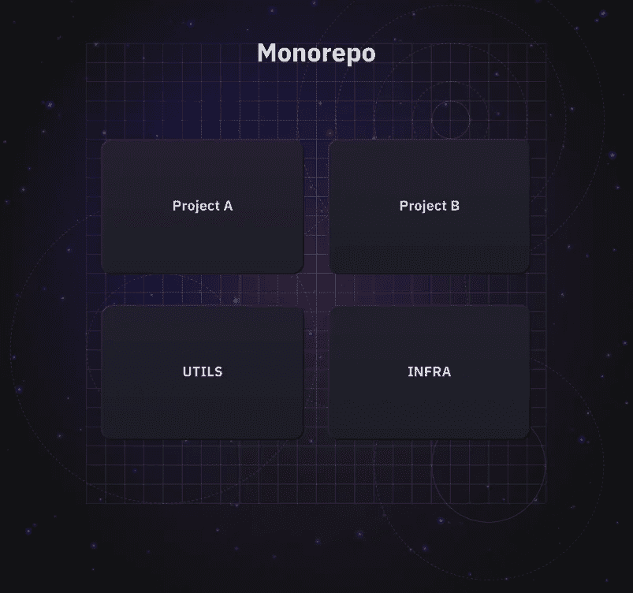
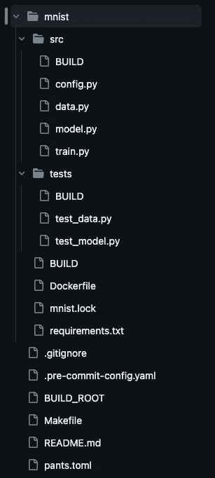
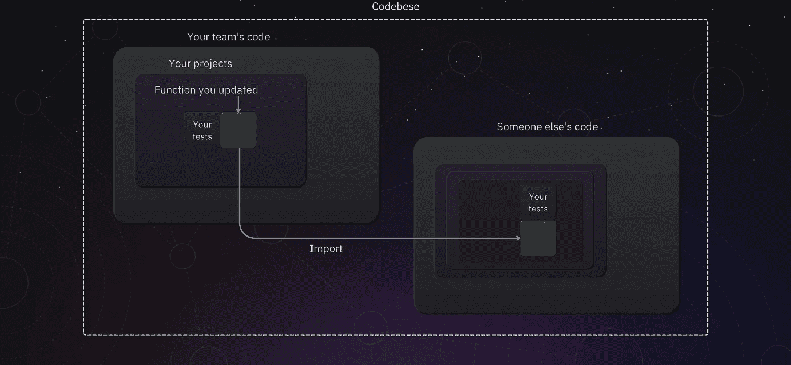
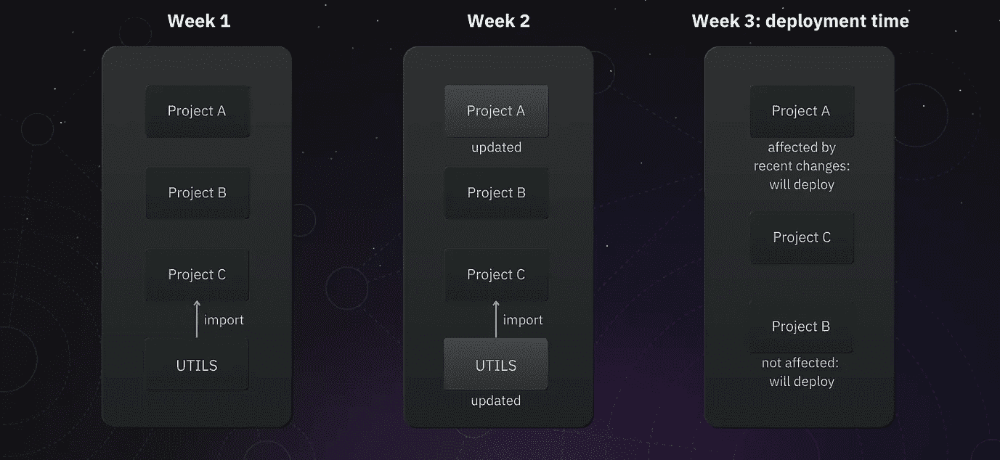

# 使用 Pants 组织机器学习单一仓库

> 原文：[`towardsdatascience.com/organizing-a-machine-learning-monorepo-with-pants-8e0570de0c4c`](https://towardsdatascience.com/organizing-a-machine-learning-monorepo-with-pants-8e0570de0c4c)

## MLOps

## 简化你的机器学习工作流管理

[](https://michaloleszak.medium.com/?source=post_page-----8e0570de0c4c--------------------------------)[](https://towardsdatascience.com/?source=post_page-----8e0570de0c4c--------------------------------) [Michał Oleszak](https://michaloleszak.medium.com/?source=post_page-----8e0570de0c4c--------------------------------)

·发布于 [Towards Data Science](https://towardsdatascience.com/?source=post_page-----8e0570de0c4c--------------------------------) ·阅读时间 20 分钟·2023 年 8 月 18 日

--


你是否曾经在项目之间复制粘贴公用代码块，导致不同仓库中存在多个版本的相同代码？或者，可能在更新存储数据的 GCP 存储桶名称后，你需要对数十个项目进行拉取请求？

上述情况在机器学习团队中经常发生，其后果从单个开发者的不满到团队无法按需交付代码等各不相同。幸运的是，有解决办法。

让我们深入探讨单一仓库，这是一种在谷歌等大型科技公司广泛采用的架构，了解它如何提升你的机器学习工作流。单一仓库提供了众多优势，尽管存在一些缺点，但它仍然是管理复杂机器学习生态系统的有力选择。

我们将简要讨论单一仓库的优缺点，研究为什么它是机器学习团队的优秀架构选择，并窥探大科技公司如何使用它。最后，我们将了解如何利用 Pants 构建系统将你的机器学习单一仓库组织成一个强大的 CI/CD 构建系统。

系好安全带，我们将开始简化你的机器学习项目管理之旅。

*本文最初发布在* [*neptune.ai 博客*](https://neptune.ai/blog/organizing-ml-monorepo-with-pants)*。*


# 什么是单一仓库？



机器学习单一仓库。作者提供的图片，来源于 neptune.ai。

Monorepo（单体仓库的缩写）是一种软件开发策略，其中多个项目的代码存储在同一个仓库中。这个想法可以广泛到*所有*公司代码用各种编程语言存储在一起（有人说 Google 吗？），也可以狭窄到由一个小团队开发的几个 Python 项目放在一个仓库中。

在这篇博客文章中，我们关注于存储机器学习代码的仓库。


# Monorepos 与 polyrepos

Monorepos 与 polyrepos 方法形成鲜明对比，在 polyrepos 中，每个单独的项目或组件都在其自己的仓库中。关于这两种方法的优缺点已经讨论了很多，我们不会过于深入探讨。我们只讨论一些基本内容。


Monorepo 架构。图片由作者提供，通过 neptune.ai。

Monorepo 架构提供了以下优势：

+   **单一 CI/CD 管道**，意味着没有隐藏的部署知识分散在不同仓库的个体贡献者之间；

+   **原子提交**，由于所有项目都存在于同一个仓库中，开发人员可以进行跨项目的更改，这些更改跨越多个项目但作为单个提交合并；

+   **跨项目轻松共享** 公用程序和模板；

+   **轻松统一** 编码标准和方法；

+   更好的 **代码可发现性**。

自然地，没有免费的午餐。我们需要为上述好处付出代价，而代价表现为：

+   **可扩展性挑战**：随着代码库的增长，管理 monorepo 可能变得越来越困难。在非常大的规模下，你将需要强大的工具和服务器来处理克隆、拉取和推送更改等操作，这可能需要大量的时间和资源。

+   **复杂性**：Monorepo 可能更难管理，特别是与依赖和版本控制有关。共享组件的更改可能会影响多个项目，因此需要额外的谨慎以避免破坏性更改。

+   **可见性和访问控制**：由于每个人都在同一个仓库中工作，控制谁可以访问什么可能会很困难。虽然这本身不是缺点，但在代码受严格 NDA 保护的情况下，可能会引发法律问题。

是否值得支付 monorepo 提供的优势由每个组织或团队单独决定。然而，除非你在极其庞大的规模上运作或处理绝密任务，否则我认为——至少在我擅长的领域，即机器学习项目中——monorepo 是大多数情况下的良好架构选择。

让我们来谈谈原因。


# 使用 monorepo 的机器学习

至少有六个原因说明单一代码库特别适合机器学习项目。

1.  数据管道集成

1.  实验间的一致性

1.  简化模型版本控制

1.  跨职能协作

1.  原子性更改

1.  编码标准的统一

让我们逐一讨论这些方面。

## 数据管道集成

机器学习项目通常涉及预处理、转换和将数据输入模型的数据管道。这些管道可能与机器学习代码紧密集成。将数据管道和机器学习代码保存在同一代码库中，有助于保持这种紧密集成，并简化工作流程。

## 实验间的一致性

机器学习开发涉及大量实验。将所有实验保存在单一代码库中可以确保环境设置的一致性，并减少由于代码或数据版本不同而导致的实验间差异风险。

## 简化模型版本控制

在单一代码库中，代码和模型版本是同步的，因为它们被检查到同一个仓库中。这使得管理和追踪模型版本变得更加容易，这在机器学习可重复性至关重要的项目中尤其重要。只需查看任何时刻的提交 SHA，它即可提供所有模型和服务的状态信息。

## 跨职能协作

机器学习项目通常涉及数据科学家、机器学习工程师和软件工程师之间的合作。单一代码库通过提供所有项目相关代码和资源的唯一真实来源来促进这种[跨职能协作](https://neptune.ai/blog/ml-collaboration-best-practices-from-ml-teams)。

## 原子性更改

在机器学习的背景下，模型的性能可能依赖于数据预处理、特征提取、模型架构和后处理等各种互相关联的因素。单一代码库允许进行原子性更改——对多个组件的更改可以作为一个整体提交，确保依赖关系始终保持同步。

## 编码标准的统一

最后，机器学习团队通常包括没有软件工程背景的成员。这些数学家、统计学家和计量经济学家是拥有出色想法和训练解决业务问题模型能力的聪明人才。然而，编写干净、易读且易于维护的代码可能并不是他们最擅长的领域。

单一代码库通过自动检查和执行所有项目的编码标准，帮助确保高代码质量，并且帮助工程能力较弱的团队成员学习和成长。


# 行业中的做法：著名的单一代码库

在软件开发领域，一些全球最大、最成功的公司使用单一代码库。以下是一些值得注意的例子。

+   **Google**: Google 长期以来一直坚定支持单一代码仓库方法。他们的整个代码库，估计包含 20 亿行代码，都集中在一个庞大的仓库中。他们甚至[发表了一篇相关论文](https://research.google/pubs/pub45424/)。

+   **Meta**: Meta 也为其庞大的代码库使用了单一代码仓库。他们创建了一个名为“Mercurial”的版本控制系统，以处理单一代码仓库的规模和复杂性。

+   **Twitter**: Twitter 已经长期使用 Pants 来管理他们的单一代码仓库，接下来我们将讨论这个构建系统！

许多其他公司，如 Microsoft、Uber、Airbnb 和 Stripe，也[在部分代码库中使用单一代码仓库方法](https://en.wikipedia.org/wiki/Monorepo#:~:text=This%20practice%20dates%20back%20to,of%20code%20and%20daily%20changes)。

理论讲解够了！让我们看看如何实际构建一个机器学习单一代码仓库。因为仅仅把曾经分开的仓库放到一个文件夹中是不够的。


# 如何用 Python 设置机器学习单一代码仓库？

在本节中，我们将围绕我为本文创建的[示例机器学习仓库](https://github.com/MichalOleszak/pants-monorepo-example)展开讨论。它是一个简单的单一代码仓库，仅包含一个项目或模块：一个名为 *mnist* 的手写数字分类器，以其使用的著名数据集命名。

目前你只需知道，在单一代码仓库的根目录下，有一个名为 mnist 的目录，其中包含用于训练模型的 Python 代码、相应的单元测试，以及一个用于在容器中运行训练的 Dockerfile。



我们将使用这个小示例来保持简单，但在更大的单一代码仓库中，*mnist* 仅是仓库根目录中的众多项目文件夹之一，每个文件夹至少会包含源代码、测试、Dockerfile 和需求文件。


# 构建系统：你为什么需要一个，以及如何选择？

## 为什么需要构建系统

想一想，除了编写代码，开发不同项目的各个团队在单一代码仓库中的开发工作流中还会采取哪些行动。他们会对代码运行静态分析工具，以确保符合风格标准，运行单元测试，构建例如 Docker 容器和 Python wheels 这样的工件，将它们推送到外部工件库，并将它们部署到生产环境。

以测试为例。你在维护的工具函数中进行了更改，运行了测试，所有测试都通过了。但是你如何确保你的更改不会破坏其他团队可能正在使用的代码？你当然也应该运行*他们*的测试套件。

但要做到这一点，你需要准确知道你所更改的代码在哪里被使用。随着代码库的增长，手动查找这点并不高效。当然，作为替代方案，你可以始终执行所有测试，但再次强调：这种方法并不是特别高效。



为什么你需要一个构建系统：测试。图像由作者提供，来自 neptune.ai。

另一个例子：生产部署。无论你是每周、每日还是持续部署，当时间到来时，你会构建 monorepo 中的所有服务并将其推送到生产环境。但，嘿，你需要在每次部署时*全部*构建吗？在大规模时这可能会耗时且成本高昂。

有些项目可能已经好几周没有更新了。另一方面，它们使用的共享工具代码可能已经进行了更新。我们如何决定构建什么？再次，这全关乎依赖关系。理想情况下，我们只会构建那些受最近更改影响的服务。



为什么你需要一个构建系统：部署。图像由作者提供，来自 neptune.ai。

所有这些在代码库较小的情况下可以通过简单的 shell 脚本处理，但随着规模的扩大和项目开始共享代码，挑战也随之出现，其中许多挑战都围绕着依赖管理。

## 选择合适的系统

如果你投资一个合适的构建系统，上述问题将不再存在。构建系统的主要任务是构建代码。它应该以一种聪明的方式来完成这项任务：开发者只需要告诉它*构建什么*（“构建受我最新提交影响的 Docker 镜像”或“仅运行那些涵盖了我更新的方法的代码的测试”），但*如何*进行则应该留给系统来处理。

有几个优秀的开源构建系统。由于大多数机器学习是用 Python 完成的，我们来关注一下支持 Python 最好的构建系统。在这方面最受欢迎的两个选择是 [Bazel](https://bazel.build/) 和 [Pants](https://www.pantsbuild.org/)。

Bazel 是 Google 内部构建系统 Blaze 的开源版本。Pants 也受到 Blaze 的极大启发，并且它旨在实现与 Bazel 类似的技术设计目标。感兴趣的读者可以在这篇 [博客文章](https://blog.pantsbuild.org/pants-vs-bazel/) 中找到对 Pants 和 Bazel 的比较（但请注意，这来自 Pants 的开发者）。[monorepo.tools](https://monorepo.tools/) 底部的表格提供了另一种比较。

两个系统都很棒，我并不打算在这里宣布哪一个*更好*。话虽如此，Pants 通常被描述为更易于设置，更易于接触，并且对 Python 进行了良好的优化，这使得它非常适合机器学习 monorepo。

根据我个人的经验，决定使用 Pants 的关键因素是它活跃且乐于助人的社区。每当你有问题或疑虑时，只需在社区 Slack 频道发帖，许多支持者将很快帮助你解决。


# 介绍 Pants

好了，进入重点吧！我们将一步一步介绍不同的 Pants 功能及其实现方法。你也可以在[这里](https://github.com/MichalOleszak/pants-monorepo-example/tree/main)查看相关的示例代码库。

## 设置

Pants 可以通过 pip 安装。在本教程中，我们将使用截至本文撰写时的最新稳定版本 2.15.1。

```py
pip install pantsbuild.pants==2.15.1
```

Pants 可以通过一个名为[*pants.toml*](https://github.com/MichalOleszak/pants-monorepo-example/blob/main/pants.toml)*.* 的全局主配置文件进行配置。在其中，我们可以配置 Pants 自身的行为以及它依赖的下游工具的设置，如 pytest 或 mypy。

让我们从一个最基本的*pants.toml* 开始：

```py
[GLOBAL]
pants_version = "2.15.1"
backend_packages = [
    "pants.backend.python",
]

[source]
root_patterns = ["/"]

[python]
interpreter_constraints = ["==3.9.*"]
```

在全局部分，我们定义 Pants 版本和我们需要的后端包。这些包是 Pants 的引擎，支持不同的功能。作为起点，我们只包含 Python 后端。

在源部分，我们将源设置为代码库的根目录。从版本 2.15 开始，为了确保这一点，我们还需要在代码库的根目录下添加一个[空的 BUILD_ROOT 文件](https://github.com/MichalOleszak/pants-monorepo-example/blob/main/BUILD_ROOT)。

最后，在 Python 部分，我们选择要使用的 Python 版本。Pants 会在我们的系统中查找符合这里指定条件的版本，因此请确保你已经安装了这个版本。

这是一个好的开始！接下来，让我们来看一下任何构建系统的核心：构建文件。

## 构建文件

构建文件是用于以声明方式定义目标（要构建的内容）及其依赖项（它们工作所需的内容）的配置文件。

你可以在目录树的不同层级拥有多个构建文件。文件越多，对依赖管理的控制就越细粒度。实际上，Google 在其代码库中的几乎每个目录都有一个构建文件。

在我们的示例中，我们将使用三个构建文件：

+   `mnist/BUILD` — 在项目目录中，这个构建文件将定义项目的 Python 需求和要构建的 docker 容器；

+   `mnist/src/BUILD` — 在源代码目录中，这个构建文件将定义 Python 源文件，即需要进行 Python 特定检查的文件；

+   `mnist/tests/BUILD` — 在测试目录中，这个构建文件将定义哪些文件使用 Pytest 运行，以及这些测试执行所需的依赖。

让我们来看一下`mnist/src/BUILD`：

```py
python_sources(
    name="python",
    resolve="mnist",
    sources=["**/*.py"],
)
```

`mnist/BUILD` 看起来是这样的：

```py
python_requirements(
    name="reqs",
    source="requirements.txt",
    resolve="mnist",
)
```

构建文件中的两个条目被称为目标。首先，我们有一个 Python 源代码目标，我们称之为*python*，虽然名称可以是任何东西。我们将 Python 源代码定义为目录中的所有 .py 文件。这是相对于构建文件的位置，也就是说：即使我们在*mnist/src*目录之外有 Python 文件，这些源代码只捕获*mnist/src*文件夹中的内容。还有一个 resolve 字段，我们稍后会谈论它。

接下来，我们有 Python 需求目标。它告诉 Pants 在哪里可以找到执行我们 Python 代码所需的需求（同样，相对于构建文件的位置，在这个例子中是 mnist 项目的根目录）。

这就是我们需要的所有信息。为了确保构建文件定义正确，让我们运行：

```py
pants tailor --check update-build-files --check ::
```

正如预期的那样，我们得到： “未发现对 BUILD 文件的必要更改。”作为输出。很好！

让我们再花点时间了解一下这个命令。简而言之，裸的*pants tailor*可以自动创建构建文件。然而，它有时会添加过多的文件，这就是为什么我倾向于手动添加文件，然后使用上述命令检查其正确性。

结尾的双分号是 Pants 的表示法，它告诉 Pants 对整个 monorepo 运行该命令。或者，我们可以用*mnist::*替换它，以仅对*mnist*模块运行。

## 依赖项和锁定文件

为了进行高效的依赖管理，Pants 依赖于锁定文件。锁定文件记录每个项目所使用的所有依赖项的特定版本和来源。这包括直接依赖和传递依赖。

通过捕捉这些信息，锁定文件确保在不同环境和构建中一致地使用相同版本的依赖项。换句话说，它们作为依赖关系图的快照，确保在构建中的可重现性和一致性。

要为我们的*mnist*模块生成锁定文件，我们需要在*pants.toml*中添加以下内容：

```py
[python]
interpreter_constraints = ["==3.9.*"]
enable_resolves = true
default_resolve = "mnist"

[python.resolves]
mnist = "mnist/mnist.lock"
```

我们启用了 resolves（Pants 对锁定文件环境的术语），并为*mnist*定义了一个，传递了一个文件路径。我们还将其设置为默认的。这是我们之前传递给 Python 源代码和 Python 需求目标的 resolve，这就是它们知道需要什么依赖项的方式。我们现在可以运行：

```py
pants generate-lockfiles
```

以获取：

```py
Completed: Generate lockfile for mnist
Wrote lockfile for the resolve `mnist` to mnist/mnist.lock
```

这在*mnist/mnist.lock*创建了一个文件。如果你打算在远程 CI/CD 中使用 Pants，该文件应该用 git 进行检查。而且，自然地，每次更新*requirements.txt*文件时，它都需要更新。

在 monorepo 中有更多项目时，你可能会选择有选择性地为需要它的项目生成锁定文件，例如 `pants generate-lockfiles --resolve=mnist`。

设置完成了！现在让我们使用 Pants 做一些对我们有用的事情。

## 使用 Pants 统一代码风格

Pants 本身支持多种 Python linter 和代码格式化工具，如 Black、yapf、Docformatter、Autoflake、Flake8、isort、Pyupgrade 或 Bandit。它们的使用方式相同；在我们的示例中，让我们实现 Black 和 Docformatter。

为此，我们向*pants.toml*中添加两个适当的后端：

```py
[GLOBAL]
pants_version = "2.15.1"
colors = true
backend_packages = [
    "pants.backend.python",
    "pants.backend.python.lint.docformatter",
    "pants.backend.python.lint.black",
]
```

如果我们想的话，可以通过在 toml 文件中添加额外的部分来配置这两个工具，但现在我们先使用默认设置。

要使用格式化工具，我们需要执行一个称为 Pants 目标的操作。在这种情况下，有两个目标相关。

首先，lint 目标将以检查模式运行这两种工具（按照它们在后端包中列出的顺序，所以 Docformatter 先，Black 后）。

```py
pants lint ::
```

```py
Completed: Format with docformatter - docformatter made no changes.
Completed: Format with Black - black made no changes.
✓ black succeeded.
✓ docformatter succeeded.
```

看起来我们的代码符合这两个格式化工具的标准！但是，如果不是这样，我们可以执行 fmt（“格式化”的缩写）目标，以适当地调整代码：

```py
pants fmt ::
```

实际上，你可能会想使用多于这两个格式化工具。在这种情况下，你可能需要更新每个格式化工具的配置，以确保它与其他工具兼容。例如，如果你使用的是 Black 的默认配置，就像我们这里做的一样，它将期望代码行不超过 88 个字符。

但是如果你还想添加 isort 来自动排序你的导入项，它们会发生冲突：isort 会在 79 个字符后截断行。为了使 isort 与 Black 兼容，你需要在 toml 文件中包含以下部分：

```py
[isort]
args = [
    "-l=88",
 ]
```

所有格式化工具都可以通过将参数传递给其底层工具的方式在*pants.toml*中进行配置。

## 使用 Pants 进行测试

让我们运行一些测试！为此，我们需要两个步骤。

首先，我们向*pants.toml*中添加相应的部分：

```py
[test]
output = "all"
report = false
use_coverage = true

[coverage-py]
global_report = true

[pytest]
args = ["-vv", "-s", "-W ignore::DeprecationWarning", "--no-header"]
```

这些设置确保在运行测试时会生成测试覆盖率报告。我们还传递了一些自定义的 Pytest 选项来调整其输出。

接下来，我们需要回到我们的 `mnist/tests/BUILD` 文件，并添加一个 Python 测试目标：

```py
python_tests(
    name="tests",
    resolve="mnist",
    sources=["test_*.py"],
)
```

我们将其称为 tests 并指定要使用的 resolve（即锁定文件）。Sources 是 Pytest 查找要运行的测试的地方；在这里，我们显式传递了所有以“test_”开头的 .py 文件。

现在我们可以运行：

```py
pants test ::
```

获取：

```py
✓ mnist/tests/test_data.py:../tests succeeded in 3.83s.
✓ mnist/tests/test_model.py:../tests succeeded in 2.26s.
Name                               Stmts   Miss  Cover
------------------------------------------------------
__global_coverage__/no-op-exe.py       0      0   100%
mnist/src/data.py                     14      0   100%
mnist/src/model.py                    15      0   100%
mnist/tests/test_data.py              21      1    95%
mnist/tests/test_model.py             20      1    95%
------------------------------------------------------
TOTAL                                 70      2    97%
```

正如你所看到的，运行这个测试套件大约花了三秒钟。如果我们再次运行它，我们将立即得到结果：

```py
✓ mnist/tests/test_data.py:../tests succeeded in 3.83s (memoized).
✓ mnist/tests/test_model.py:../tests succeeded in 2.26s (memoized).
```

注意 Pants 如何告诉我们这些结果是被缓存的。由于测试、测试的代码或要求没有更改，因此无需实际重新运行测试——它们的结果是保证一致的，因此只是从缓存中提供。

## 使用 Pants 检查静态类型

我们再添加一个代码质量检查。Pants 允许我们使用 `mypy` 来检查 Python 中的静态类型。我们需要做的就是在*pants.toml*中添加 mypy 后端：`pants.backend.python.typecheck.mypy`*。*

你可能还想配置 mypy 以使其输出更具可读性和信息量，可以包含以下配置部分：

```py
[mypy]
args = [
    "--ignore-missing-imports",
    "--local-partial-types",
    "--pretty",
    "--color-output",
    "--error-summary",
    "--show-error-codes",
    "--show-error-context",
]
```

有了这个，我们可以运行 `pants check ::` 来获取：

```py
Completed: Typecheck using MyPy - mypy - mypy succeeded.
Success: no issues found in 6 source files
✓ mypy succeeded.
```

## 使用 Pants 发布 ML 模型

让我们谈谈发布。大多数机器学习项目涉及一个或多个 Docker 容器，例如处理训练数据、训练模型或通过 Flask 或 FastAPI 通过 API 提供服务。在我们的玩具项目中，我们还有一个 [用于模型训练的容器](https://github.com/MichalOleszak/pants-monorepo-example/blob/main/mnist/Dockerfile)。

Pants 支持自动构建和推送 Docker 镜像。让我们看看它是如何工作的。

首先，我们在 *pants.toml* 中添加 Docker 后端：`pants.backend.docker`*.* 我们还将对其进行配置，传递一些环境变量和一个构建参数，这在稍后会派上用场：

```py
[docker]
build_args = ["SHORT_SHA"]
env_vars = ["DOCKER_CONFIG=%(env.HOME)s/.docker", "HOME", "USER", "PATH"]
```

现在，在 `mnist/BUILD` 文件中，我们将添加两个目标：一个文件目标和一个 Docker 镜像目标。

```py
files(
    name="module_files",
    sources=["**/*"],
)

docker_image(
    name="train_mnist",
    dependencies=["mnist:module_files"],
    registries=["docker.io"],
    repository="michaloleszak/mnist",
    image_tags=["latest", "{build_args.SHORT_SHA}"],
)
```

我们将 Docker 目标命名为 `train_mnist`。作为依赖项，我们需要传递要包含在容器中的文件列表。最方便的方式是将此列表定义为单独的 `files` 目标。在这里，我们简单地将 mnist 模块中的所有文件包含在一个名为 `module_files` 的目标中，并将其作为依赖项传递给 Docker 镜像目标。

自然地，如果你知道容器只需要某些文件的子集，传递这些文件作为依赖项是个好主意。这一点很重要，因为这些依赖项被 Pants 用来推断容器是否受到了更改影响并需要重建。在这里，`module_files` 包括所有文件，如果 mnist 文件夹中的任何文件发生更改（即使是 readme!），Pants 会将 `train_mnist` Docker 镜像视为受到了这一更改的影响。

最后，我们还可以设置外部注册表和要推送镜像的仓库，以及推送时使用的标签：在这里，我将把镜像推送到我的个人 Docker Hub 仓库，总是带有两个标签：“latest”和短的提交 SHA，后者将作为构建参数传递。

有了这个，我们可以构建一个镜像。还有一件事：由于 Pants 在其隔离的环境中工作，它不能从主机读取环境变量。因此，要构建或推送需要 SHORT_SHA 变量的镜像，我们需要将其与 Pants 命令一起传递。

我们可以这样构建镜像：

```py
SHORT_SHA=$(git rev-parse --short HEAD) pants package mnist:train_mnist
```

获取：

```py
Completed: Building docker image docker.io/michaloleszak/mnist:latest +1 additional tag.
Built docker images: 
  * docker.io/michaloleszak/mnist:latest
  * docker.io/michaloleszak/mnist:0185754
```

快速检查显示镜像确实已被构建：

```py
docker images
```

```py
REPOSITORY            TAG       IMAGE ID       CREATED              SIZE
michaloleszak/mnist   0185754   d86dca9fb037   About a minute ago   3.71GB
michaloleszak/mnist   latest    d86dca9fb037   About a minute ago   3.71GB
```

我们还可以使用 Pants 一次性构建和推送镜像。只需将 `package` 命令替换为 `publish` 命令即可。

```py
SHORT_SHA=$(git rev-parse --short HEAD) pants publish mnist:train_mnist
```

这将构建镜像并将其推送到我的 Docker Hub，[它们确实已经到达了](https://hub.docker.com/repository/docker/michaloleszak/mnist/general)。

## Pants 在 CI/CD 中

我们刚刚手动在本地运行的相同命令可以作为 CI/CD 流水线的一部分执行。例如，你可以通过 GitHub Actions 或 Google CloudBuild 等服务来运行它们，比如在功能分支被允许合并到主分支之前作为 PR 检查，或者在合并之后验证其是否有效，并构建和推送工件。

在我们的玩具仓库中，我实现了[一个预推送提交钩子](https://github.com/MichalOleszak/pants-monorepo-example/blob/main/.pre-commit-config.yaml)，该钩子在 git push 时运行 Pants 命令，并且仅在所有命令通过时才允许推送。在其中，我们运行以下命令：

```py
pants tailor --check update-build-files --check ::
pants lint ::
pants --changed-since=main --changed-dependees=transitive check
pants test ::
```

你可以看到一些用于`pants check`的新标志，这是使用 mypy 进行类型检查的功能。它们确保检查仅在与主分支相比发生了更改的文件及其传递依赖项上运行。这很有用，因为 mypy 的运行时间较长。将其范围限制在实际需要的部分可以加快处理速度。

在 CI/CD 管道中，docker 构建和推送会是什么样的？大致如下：

```py
pants --changed-since=HEAD^ --changed-dependees=transitive --filter-target-type=docker_image publish
```

我们像以前一样使用 publish 命令，但增加了三个额外的参数：

+   `--changed-since=HEAD^` 和 `--changed-dependees=transitive` 确保仅构建与先前提交相比受更改影响的容器；这对于在合并后的主分支上执行非常有用。

+   `--filter-target-type=docker_image` 确保 Pants 只做构建和推送 Docker 镜像的工作；这是因为`publish`命令可能会引用其他目标，例如，它可以用来将 helm charts 发布到 OCI 注册表。`package`命令也是如此：除了构建 docker 镜像，它还可以创建 Python 包；因此，传递`--filter-target-type`选项是一种良好的做法。


# 结论

单体仓库通常是机器学习团队的绝佳架构选择。然而，大规模管理它们需要对适当的构建系统进行投资。其中一个系统是 Pants：它易于设置和使用，并且提供对机器学习团队经常使用的许多 Python 和 Docker 功能的本地支持。

此外，它是一个开源项目，拥有一个庞大且乐于助人的社区。我希望在阅读完这篇文章后，你能尝试一下。即使你目前没有一个单体仓库，Pants 仍然可以简化和促进你日常工作的许多方面！


# 参考文献

+   Pants 文档: [`www.pantsbuild.org/`](https://www.pantsbuild.org/)

+   Pants 与 Bazel 的博客文章: [`blog.pantsbuild.org/pants-vs-bazel/`](https://blog.pantsbuild.org/pants-vs-bazel/)

+   monorepo.tools: [`monorepo.tools/`](https://monorepo.tools/)


感谢阅读！

如果你喜欢这篇文章，为什么不[**订阅电子邮件更新**](https://michaloleszak.medium.com/subscribe)我的新文章呢？通过[**成为 Medium 会员**](https://michaloleszak.medium.com/membership)，你可以支持我的写作，并获得对所有其他作者和我自己的故事的无限访问权。

想时刻掌握机器学习和人工智能领域日新月异的动态吗？查看我的新通讯，[**AI Pulse**](https://pulseofai.substack.com/)。需要咨询吗？你可以问我任何问题或[**在这里**](https://topmate.io/michaloleszak)预约一对一咨询。

你还可以尝试[我的其他文章](https://michaloleszak.github.io/blog/)。无法选择？可以看看这些：

[](/unboxing-dinov2-metas-new-all-purpose-computer-vision-backbone-d8e22c059040?source=post_page-----8e0570de0c4c--------------------------------) ## 开箱 DINOv2，Meta 的新型通用计算机视觉骨干网

### 视觉基础模型是否正在赶上大型语言模型？

towardsdatascience.com [](/self-supervised-learning-in-computer-vision-fd43719b1625?source=post_page-----8e0570de0c4c--------------------------------) ## 自监督学习在计算机视觉中的应用

### 如何用仅有的几个标记样本来训练模型

towardsdatascience.com [](/how-to-detect-data-drift-with-hypothesis-testing-1a3be3f8e625?source=post_page-----8e0570de0c4c--------------------------------) ## 如何通过假设检验检测数据漂移

### 提示：忘记 p 值吧

towardsdatascience.com
