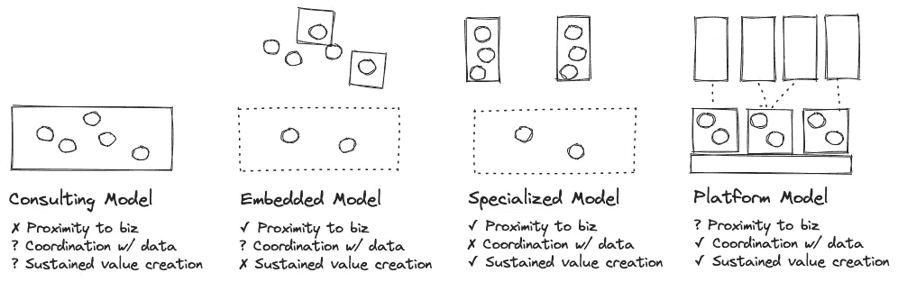
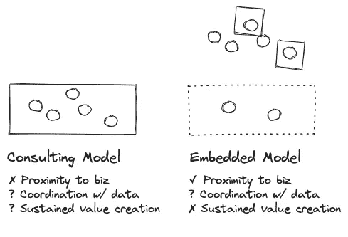
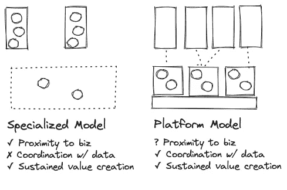

# 组织生成式人工智能：数据科学团队的 5 个经验教训

> 原文：[`towardsdatascience.com/organizing-generative-ai-5-lessons-learned-from-data-science-teams-2f271874ae4a?source=collection_archive---------4-----------------------#2023-08-25`](https://towardsdatascience.com/organizing-generative-ai-5-lessons-learned-from-data-science-teams-2f271874ae4a?source=collection_archive---------4-----------------------#2023-08-25)

## *大语言模型（LLMs）拥有巨大的潜力，但创造可持续的价值将需要的不仅仅是一个特种小组*

 [shane murray](https://medium.com/@shane.murray5?source=post_page-----2f271874ae4a--------------------------------)

·

[关注](https://medium.com/m/signin?actionUrl=https%3A%2F%2Fmedium.com%2F_%2Fsubscribe%2Fuser%2F8aa0d9ae3ebd&operation=register&redirect=https%3A%2F%2Ftowardsdatascience.com%2Forganizing-generative-ai-5-lessons-learned-from-data-science-teams-2f271874ae4a&user=shane+murray&userId=8aa0d9ae3ebd&source=post_page-8aa0d9ae3ebd----2f271874ae4a---------------------post_header-----------) 发布于 [Towards Data Science](https://towardsdatascience.com/?source=post_page-----2f271874ae4a--------------------------------) ·9 min read·2023 年 8 月 25 日

--

*图片由作者提供*

你做到了！

在执行领导层含糊其辞地向利益相关者承诺将把新的生成式人工智能功能整合到整个组织之后，你的[特种小组](https://www.lucidchart.com/blog/what-is-a-tiger-team#:~:text=A%20tiger%20team%20is%20a,Apollo%2013%20mission%20in%201970.) 快速地生产了一个符合要求的最小可行产品（MVP）。将 OpenAI API 集成到你的应用程序中并不困难，而且它*可能*最终会变得有用。

那么现在会发生什么？虎队不可能永远疾驰。每个成员在组织内都有另一角色，这将再次占据他们的大部分时间和注意力。

更不用说，为了这个项目而忽视加快的典型流程和结构，这是有其原因的。事实证明，它们对确保产品适配性、从开发到运营的过渡以及成本优化（等等）非常关键。

仔细想想，现在项目完成了，实际上没有任何平台基础设施可以帮助扩展下一轮 LLM 模型或其他通用 AI 产品特性。

现在看来是时候开始考虑如何在您的数据组织内构建和支持通用 AI 团队了。尽管那些华丽的产品演示使过程看起来轻而易举，但未来可能会面临波涛汹涌的迹象：

+   除非你是六大科技巨头之一，否则数据科学和通用 AI 专业知识都是稀缺的。到目前为止，没有人真正有任何重要的经验。对每个人来说都是新的。

+   业务知道它想要通用 AI，但还不完全知道为什么。技术令人兴奋，但具体的使用案例还不明确。没有人有维护部署的多少经验。

+   这个生态系统一夜之间蓬勃发展起来，但支持技术和最佳实践还没有成熟。风险通常是未预见的，不确定性很高。

如果这听起来很熟悉，那是因为确实如此。在过去五年左右，数据科学团队在[其机器学习算法和应用程序中遇到了所有这些问题](https://www.montecarlodata.com/blog-why-production-machine-learning-fails-and-how-to-fix-it/)。

这是一次痛苦的经历。2020 年，[Gartner 报道](https://www.gartner.com/en/newsroom/press-releases/2020-10-19-gartner-identifies-the-top-strategic-technology-trends-for-2021#:~:text=Gartner%20research%20shows%20only%2053,a%20production%2Dgrade%20AI%20pipeline.)显示，仅有 53%的机器学习项目从原型成功进入生产阶段 —— 这是在具有一定 AI 经验的组织中。对于仍在努力发展数据驱动文化的公司而言，这个数字可能更高，一些[失败率估计](https://venturebeat.com/2019/07/19/why-do-87-of-data-science-projects-never-make-it-into-production/)甚至飙升至接近 90%。

作为曾在纽约时报领导数据团队并遇到许多这些挑战的人，我可以证明组织结构、流程和平台对这些倡议的成功有多重要。

我还与来自各种公司规模和行业的数百名数据领导交谈过，他们表达了一套共同的经验教训。这些通过数据科学团队的血汗和泪水赢得的最佳实践应该成为每位数据领导思考其长期通用 AI 战略和团队结构的首要考虑因素。

# 经验教训 1：理解结构性权衡和成熟度曲线

就像你不能在没有任何训练的情况下起床去跑马拉松一样，你的组织在加强其运营能力之前，无法建立一个与领先数据团队相匹配的生成 AI 组织结构。

我在这方面看到的最常见的错误之一是急于去分散化并在公司内部嵌入（也许是在一个[数据网格](https://www.montecarlodata.com/blog-what-is-a-data-mesh-and-how-not-to-mesh-it-up/)），从而使人才资源过于分散。虽然这样可以更好地理解和接近业务，但持续创造价值是困难的。

可能会有一些成功的案例，但这些往往依赖于一两个自我驱动者的才能。数据科学人才稀缺，而能够独立识别、优先排序、沟通并执行高价值项目的高级数据科学人才更为罕见。

当那些有才华的个人离开时，机构知识、代码库和项目进展往往会随之离开。他们留下的团队成员被迫扮演考古学家的角色，试图解读这些被遗弃项目所留下的文物的目的和意义。大多数情况下，需要从接近零的状态重新开始。

图片由作者提供。

对于较小的数据科学和机器学习团队来说，咨询模型往往是一种更成功的方法。这种方法汇集了大量的人才，可以集中于最高优先级的项目。需要缓解的潜在缺点是，你要防止[卓越中心](https://medium.com/@shane.murray5/organizing-talent-return-of-the-data-center-of-excellence-3c6a2b4a3190)变成一个产生教授可能喜欢的镀金模型的实验室，但这些模型与实际业务挑战不符。

随着团队规模的扩大和成熟度曲线的提升，稍有不同的组织结构会变得更加合适。“专业化”模型通常会将数据科学和机器学习资源集中于几个高价值的问题上，并在相关业务领域内部署团队。

这一现象最常见的表现是，当机器学习成为产品的核心部分（例如个性化或欺诈检测）时，与产品或工程团队的关联比与核心数据团队的关联更为重要。核心数据团队通常在数据科学方面有自己的投资，这与专业化团队大体独立。

这种模型可以成功，但确实会造成低效和孤岛现象。例如，中央团队和专业化团队通常会有定制的平台，几乎没有共享服务。产品领域中的流数据可能会从由中央团队收集的自定义数据中受益，但这种连接可能永远无法建立。

*图片由作者提供。*

另一种后期组织结构可以被描述为“平台”模型。嵌入式和专业化模型可能会因为缺乏跨业务领域的可见性和凝聚力而受到影响，每个数据科学问题都有其自己的全栈解决方案，尽管在解决的问题类型上存在固有的相似性。

解决方案是与业务领域或垂直行业有一些故意的分隔，以避免过度适配他们的运营模型，就像你对待其他横向平台团队一样。

将机器学习视为平台追求的一个主要好处是，一旦你展示了每个机器学习应用的价值，就可以投资于共享平台基础设施，因为这可以降低部署和维护新应用的资源和成本。这种投资相对于应用团队的投资初期应该较小，使他们能够相对独立地运营，追求业务伙伴的长期目标。

在这种平台模型中，可以创建一个 GenAI 团队作为应用团队之一，赋予其定制堆栈的任务和工程资源，以提供价值，同时与其他平台团队协调，以重用基础设施和标准，从而为组织提供持续的价值。我强烈建议采用这种模型，而不是试图将 Gen AI 分散到许多团队中。关键质量很重要。

# 课程 2：按用例组织而不是按业务职能组织

最近，我与一家媒体公司的一位数据领导进行了对话，这是这篇文章的灵感来源。他们告诉我，他们的数据科学团队按领域（在这种情况下是媒体属性）组织。

数据科学团队在每个领域内从事相同类型的项目，即文章推荐算法。毫无疑问，每个领域都受益于对其特定问题的专注，每个数据科学团队也受益于与各自业务和编辑合作伙伴的接近。但这有助于突出这种组织结构的一些缺点；人才部署效率低下，尽管许多团队解决的是相同类型的内容排名问题，但缺乏共享的基础设施。

在《纽约时报》，我们发现围绕共同问题组织数据科学团队是有效的。一旦在一个领域证明了模型的有效性，通常对其进行调整和修改以适应另一个领域的独特输入和约束比让两个团队并行创建两个模型更为高效。从逻辑上讲也是如此，构建原型总是比后续产品花费更多时间。

生成 AI 也应以同样的方式考虑。让团队专注于一个适合技术的高价值用例，例如为事件市场提供个性化座位建议，或为媒体网站进行语言本地化，然后将这一解决方案应用于其他适用领域。

# 课程 3：关注长期价值和难题

在技术和数据领域，“长期”有其独特的含义，其中首席数据官的平均任期大致与[一罐花生酱](https://www.usatoday.com/story/money/2019/08/11/foods-longest-shelf-life-expiration-date/39924813/)相当。

当项目收官时，这一目标仍然会是个问题吗？五年后，它仍然有需求吗？在这段时间内，新模型是否能够迭代并发现附加价值？

现实是，假设你没有利用现成的模型，机器学习和生成 AI 项目可能会很昂贵（尽管 LLMs [正在迅速商品化](https://www.mosaicml.com/blog/billion-parameter-gpt-training-made-easy)）。开发一个经过良好训练和管理的模型以适应用例可能需要几个月，或者在某些情况下，甚至几年。

与*其他选择相比*，提升效果最好是值得的。例如，一个旨在优化 Facebook 广告支出的机器学习模型可能听起来很吸引人，但你会发现这在广告平台内部本地完成。

尽管如此，关注长期价值并不意味着制定一个第一个发布计划在 2025 年的路线图。

# 课程 4：将 AI 团队与业务赞助者配对

那么，如何确保你的数据科学和生成 AI 团队专注于重要的业务问题呢？将他们与业务赞助者配对。

寻找新技术的创新应用不太可能是一个线性旅程，预计会有绕道。与业务赞助者建立强大的合作伙伴关系就像一个指南针，确保团队在探索前沿时不会偏离业务价值。我发现这也扩展了团队的视角，超越了横跨多个团队的问题。

图片来源：[Jamie Street](https://unsplash.com/@jamie452?utm_source=unsplash&utm_medium=referral&utm_content=creditCopyText)于[Unsplash](https://unsplash.com/photos/_94HLr_QXo8?utm_source=unsplash&utm_medium=referral&utm_content=creditCopyText)

一位强大的业务赞助者还将确保团队在整个旅程中得到充分支持，解锁资源并帮助导航任何涉及内部流程或政治的困难地带。这种导航的一部分可能需要跨团队对齐路线图，以提供一致的后端和前端体验。

由于这些举措可能会跨越多个季度，执行层的参与对于确保这些项目不会过早终止也至关重要。

# 课程 5：了解数据平台的前提条件

建造制造机器的机器总是比生产最终产品更困难。这一点在生产汽车的工厂和用于开发和生产大语言模型的数据平台中都是如此。

商业领袖总是会考虑商业目标，并经常忽视实现这些目标所需的[数据平台投资](https://www.linkedin.com/pulse/youre-all-genai-now-what-barr-moses)。他们并不是恶意的，他们只是依赖你这个数据专家来告诉他们需要什么。

例如，机器学习团队已经投资建设或购买了特征存储和 MLops 解决方案。更不用说对云数据环境、数据质量及相关附加功能的基础投资了。

对于生成式 AI 计划，[数据平台](https://www.montecarlodata.com/blog-what-is-a-data-platform-and-how-to-build-one/)和数据管道架构的大部分内容将保持不变（如果你还没有投资现代数据栈，那么这是起点）。没有可发现的高质量数据就没有生成式 AI 项目。然而，还会有一些针对[LLM 工程](https://huyenchip.com/2023/04/11/llm-engineering.html)的额外解决方案，比如模型托管、缓存、AI 代理框架等，还有许多尚未被发明的解决方案。

# 从过去中学习或重蹈覆辙

毋庸置疑，生成式 AI 是一种颠覆性技术，学习如何大规模利用它将创造出一系列痛苦的经验教训。然而，不必从零开始。为了长期成功，结构化你的数据科学和生成式 AI 团队。

这篇文章由 Michael Segner 共同撰写。

在 Medium 上关注我，获取更多关于数据领导力、数据科学应用以及相关主题的故事。订阅，将我的故事直接送到你的收件箱。
