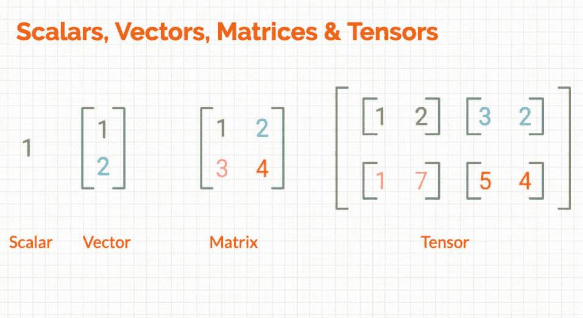

# 其他机器学习术语：文本的稀疏和密集表示

> 原文：[`towardsdatascience.com/other-ml-jargons-sparse-and-dense-representations-of-texts-for-machine-learning-21fcd7a01410`](https://towardsdatascience.com/other-ml-jargons-sparse-and-dense-representations-of-texts-for-machine-learning-21fcd7a01410)

## 其他机器学习术语

## 向量化的简要介绍及其在自然语言处理中的重要性

 [Nabanita Roy](https://nroy0110.medium.com/?source=post_page-----21fcd7a01410--------------------------------)

·发表于 [Towards Data Science](https://towardsdatascience.com/?source=post_page-----21fcd7a01410--------------------------------) ·9 分钟阅读·2023 年 2 月 15 日

--

图片由 [Compare Fibre](https://unsplash.com/@comparefibre?utm_source=medium&utm_medium=referral) 提供，来源于 [Unsplash](https://unsplash.com/?utm_source=medium&utm_medium=referral)

# **介绍**

矩阵和向量是机器学习（ML）算法进行模式学习和预测所需的量化信息。将这些技术应用于文本数据时，文本的数值表示被工程化为矩阵，以包含文本中的相关信息。“稀疏性”和“密集性”概念有助于高效设计和构建这些矩阵，用于人工智能领域中的所有高维数据处理用例。

## 向量表示在自然语言处理中的重要性

将文本数据表示为向量是应用机器学习技术进行预测、推荐或聚类的必要条件。在自然语言处理（NLP）中，“*相似的单词出现在相似的上下文中*”这一概念是基础的。让我们来看看：

1.  在**文本分类**用例中，如支持票据的分类、垃圾邮件检测、虚假新闻检测和反馈情感分析，具有相似单词的文本会被分类到特定类别中。

1.  在**推荐系统**中，具有相似个人资料信息、浏览历史和过去订单的人表示对产品有类似的选择或口味。这些信息用于生成推荐。

1.  **无监督聚类**在文本中寻找模式和相似的单词，以便对文档和文章进行分组。典型应用包括新闻文章的分类、趋势分析和客户细分。

1.  在**信息检索**系统中，索引文档会与查询进行匹配，有时以“模糊”的方式进行，然后将匹配的文档集合返回给用户。此外，相似度度量用于对搜索结果进行排序。

因此，捕捉这些向量中的相似性是自然语言处理领域的一个主要研究方向。这些向量被投影到一个 N 维平面中，然后从 N 维空间中的这些向量中提取模式以对文本进行分类。有时会应用降维技术，如 PCA 或 t-SNE。向量的设计控制了基于文本的机器学习模型的整体性能，因此至关重要。

向量设计大致分为“稀疏”（意指很少填充）和“密集”（意指密集填充）两类。在本文中，我从数学的角度回顾了矩阵和向量的概念，然后讨论了这两种向量化技术——稀疏向量表示和密集向量表示，包括分别使用 Scikit Learn 和 Gensim 的演示。我还在文章末尾总结了这些表示的应用和实用性。

# 矩阵和向量的入门

在数学上，*矩阵定义为一个二维矩形数字数组。* 如果数组有 *m* 行和 *n* 列，那么它是一个 *m × n* 的矩阵。

如果一个矩阵只有一行或只有一列，它被称为向量。*1×n* 矩阵或向量是行向量（其中有 *n* 列但只有 *1* 行），而 *m × 1* 矩阵或向量是列向量（其中有 *m* 行但只有 *1* 列）。这里有一张清晰演示这一点的图片：

图片来源：数据科学线性代数 Ep1 — 使用 Python 介绍向量和矩阵

这是一个 [标量、向量和矩阵的入门](https://www.mathsisfun.com/algebra/scalar-vector-matrix.html) 和 数据科学中使用 Python 介绍向量和矩阵。

# 稀疏表示 | 矩阵 | 向量

图片由 [Henning Witzel](https://unsplash.com/@henning?utm_source=medium&utm_medium=referral) 提供，来自 [Unsplash](https://unsplash.com/?utm_source=medium&utm_medium=referral)

在几乎所有实际应用中，基于计数的量化数值表示信息通常是**稀疏的**，换句话说，***数值表示* *只包含在海量数字中对你有用的一小部分。***

这是因为，从直观上看，在文档集合中，只有作为文章、介词、连词和代词的单词被明显使用，因此具有较高的出现频率。然而，在一组体育新闻文章中，诸如‘soccer’或‘basketball’的术语，其出现次数有助于确定文章关联的运动类型，尽管出现次数较少，但频率并不很高。

现在，如果我们为每个新文章构造一个向量，假设每篇文章有 50 个单词，那么‘soccer’会出现约 5 次。因此，在 50 次中，45 次向量元素将为零，这表示我们关注的单词的缺失。因此，长度为 50 的向量中 90%是冗余的。这是[**one-hot 向量**](https://scikit-learn.org/stable/modules/generated/sklearn.preprocessing.OneHotEncoder.html)生成的一个例子。

稀疏矩阵生成的另一个典型例子是[**Count Vectorizer**](https://scikit-learn.org/stable/modules/generated/sklearn.feature_extraction.text.CountVectorizer.html)，它确定一个单词在文档中出现的次数。它为每个文档生成一个“计数向量”矩阵，从而构成一个*d × v*的矩阵，其中 d 是文档的数量，v 是文档集合中的单词或词汇的数量。

**这里演示了 Count Vectorizer 的工作原理：**

以下是[‘demo’一词的四种不同含义](https://www.google.com/search?q=demo&oq=demo&aqs=chrome..69i57j69i61.775j0j4&sourceid=chrome&ie=UTF-8)，每种含义代表一个文档 ~

**文档 1：**演示一个产品或技术

**文档 2：**公开会议或游行，抗议某事或表达对政治问题的观点

**文档 3：**录制一首歌曲或音乐作品，以展示音乐团队或表演者的能力，或作为完整录音的准备

**文档 4：**演示软件或其他产品的功能

我使用了[**Scikit Learn 的 CountVectorizer**](https://scikit-learn.org/stable/modules/generated/sklearn.feature_extraction.text.CountVectorizer.html)实现来生成这四个“文档”的稀疏矩阵。以下是我使用的代码👩‍💻

图片来源：作者

*_cv.toarray()*的输出是**4** *×* **34 数组**中单词的数字表示（*使用.toarray()从向量转换*），如下图所示：

在这个 Jupiter Notebook 中找到这个例子 | 图片来源：作者

在矩阵中：

+   zero 表示完全没有出现（基本上没有信息）

+   任何大于零的数值是单词在四个文档中出现的次数（一些有用的信息和一些冗余的信息）。

+   34 是词汇表的大小（或文档中唯一单词的总数），因此形状为 4 x 34。

稀疏性的最简单衡量标准是零元素占总元素的比例，在这种情况下约为~

+   零的数量 = 93

+   数组中的元素数量 = 4 *×* 34 *=* 136

因此，数组中超过 50%的元素完全没有信息（93 个中的 136 个），但这是一个高维矩阵，需要更多的内存（增加的 [**空间复杂度**](https://en.wikipedia.org/wiki/Space_complexity)）和计算时间（增加的 [**时间复杂度**](https://en.wikipedia.org/wiki/Time_complexity)）。如果机器学习模型使用这个高维数据，它将发现很难处理。

+   寻找模式

+   为所有维度调整权重将花费过高。

+   它最终会导致预测时的延迟问题。

稀疏性类似于维度诅咒的概念。推荐系统和协同过滤技术、计数数据表示，包括著名的 TF-IDF，都容易受到文本数据稀疏性相关的问题。

# 稠密表示 | 矩阵 | 向量

由 [Mike L](https://unsplash.com/@wheremikeat?utm_source=medium&utm_medium=referral) 在 [Unsplash](https://unsplash.com/?utm_source=medium&utm_medium=referral) 拍摄

出路？一种包含更多信息且冗余更少的表示，数学上定义为大多数元素非零的矩阵或向量。这种数据表示被称为稠密矩阵或稠密向量。它们通常比稀疏矩阵的尺寸更小。

## 使用稠密向量进行机器学习的优点

1.  维度越小，优化机器学习模型的权重就越快、越容易。

1.  尽管稠密向量的维度可能比稀疏矩阵小，但它们也可能足够大以挑战计算基础设施（想象一下 Word2Vec 或基于 BERT 的表示），但仍然包含丰富且有用的信息，如句法、语义或形态关系。

1.  它们对文本元素之间关系的概括能力更强，这一点通过 word2vec 算法的成功得到了明确证明。

## 将稀疏表示转换为稠密表示的常见自然语言处理技术：

1.  [**Word2Vec**](https://radimrehurek.com/gensim/auto_examples/tutorials/run_word2vec.html): 这是最受欢迎的算法之一，使用浅层神经网络学习稠密表示，同时尝试预测可能的词汇并捕捉语义关系。

1.  [**FastText**](https://fasttext.cc/): 另一种使用浅层神经网络实现相同目标的算法，只是 FastText 使用了字符级 n-grams。然而，Word2Vec 被认为对英语效果最好，但 FastText 对形态丰富的语言如阿拉伯语、德语和俄语更为适用。此外，它在捕捉句法特征方面优于语义特征。

1.  [**GloVe**](https://nlp.stanford.edu/projects/glove/): 同样！学习密集表示，但基于共现的概率。

这是一个简明的演示，展示如何使用[**Gensim 的 word2vec**](https://radimrehurek.com/gensim/auto_examples/tutorials/run_word2vec.html)算法获取密集表示。

以下是词汇‘demonstration’的长度为 10 的密集表示（请注意*vector_size*参数对于*word2vec*模型的值是 10）。注意此数值表示中没有零。

图片来源：作者

通常，向量的尺寸越大，捕捉的知识就越好，特别是语义信息。这些对评估文本相似性和在无监督的文本处理技术中非常有用。

此外，以下是我们第一个文档“*产品或技术的演示*”中每个单词获得的密集向量的快照，这些向量按文档中出现的顺序排列。这次我没有清理文本，而是保持原样，因此列表中有七个词向量：

对文档‘*产品或技术的演示*’获得的长度为 10 的密集向量显示该数值表示中没有非零元素 |* 图片来源：作者

**像这样的密集向量也可以在大型语料库上进行预训练**，这些语料库通常可以在线访问。想象一下一个字典，像往常一样列出所有唯一的词汇，但其词汇意义被包含其数值表示的预训练词向量替代，颇似一个**“量化字典”**。这里有两个流行的“量化字典”可以下载并应用于文本处理任务：

+   [**Google**](https://code.google.com/archive/p/word2vec/)**：使用 Google 新闻数据集训练**，包含约 1000 亿个词汇。300 维的词向量可以从[这里](https://drive.google.com/file/d/0B7XkCwpI5KDYNlNUTTlSS21pQmM/edit?usp=sharing)下载。词汇表的大小为 300 万。

+   [**GloVe**](https://nlp.stanford.edu/projects/glove/)**：使用 Wikipedia 文章训练**，包含 50、100、300 和 500 维的词向量，可以从[这里](https://nlp.stanford.edu/data/glove.6B.zip)下载。词汇表的大小是 400k。

# **结论**

传统上，一维热编码向量、词频矩阵（或计数向量）和 TF-IDF 评分（稀疏表示）被用于文本分析。它们并不保留任何语义信息。然而，现代方法通过神经网络（如 Word2Vec）或更复杂的统计方法和归一化技术（如 GloVe）来获取词嵌入，更好地保留了词的“意义”，并使我们能够对出现于类似上下文中的词进行聚类。但这些方法也带来了计算时间更长的复杂性，这使得它们在扩展时成本较高（取决于学习超参数，特别是更高的向量表示大小）。此外，它们也更难以解释。

照片由[Michał Parzuchowski](https://unsplash.com/@mparzuchowski?utm_source=medium&utm_medium=referral)拍摄，发布在[Unsplash](https://unsplash.com/?utm_source=medium&utm_medium=referral)。

在所有现实世界的案例中，这两种方法都是适用的。例如，在著名的[垃圾邮件分类数据集](https://www.kaggle.com/datasets/uciml/sms-spam-collection-dataset/code)中，稀疏表示方法可以获得接近完美的模型表现。在这种情况下，我们无需计算稠密向量嵌入即可获得更好的性能，因为我们用简单透明的方法就能成功实现目标。

因此，推荐的文本处理任务起点是使用[基于频率的词袋模型](https://en.wikipedia.org/wiki/Bag-of-words_model)，该模型生成稀疏向量。对于这样的管道，清理和整理文本数据至关重要。通过合适的特征和词汇工程，它们在速度和性能方面可能是最有效的，特别是当不需要语义信息时。

[**这是 Jupyter Notebook**](https://github.com/royn5618/Medium_Blog_Codes/blob/master/Sparsity_and_Density.ipynb) **，其中包含完整的 Python 演示，展示了如何为相同示例获取稀疏和稠密向量（使用 Gensim 的 Word2Vec）。**

**💡 想了解更多关于自然语言处理的矩阵设计吗？这里有一篇文章可以进一步学习：**

 ## 自然语言处理中的向量空间模型矩阵设计

### 自然语言处理中的知识表示简要哲学和分布式词矩阵设计的简明指南……

towardsdatascience.com

**💡 想要实现 Word2Vec 用于文本分类？这里有一个关于多类文本分类的实用教程，讲解了如何使用 Keras 的嵌入层以及 Gensim 的 Word2Vec 算法学习稠密表示：**

 ## 使用 Keras 进行多类文本分类：有词嵌入与无词嵌入的比较…

### 词嵌入是否为文本分类模型增加价值？让我们在这个多类预测任务中来探讨一下…

towardsdatascience.com

**参考资料：**

1.  [`machinelearningmastery.com/sparse-matrices-for-machine-learning/`](https://machinelearningmastery.com/sparse-matrices-for-machine-learning/)

1.  [`kavita-ganesan.com/fasttext-vs-word2vec/#.Y-OP7XbP02w`](https://kavita-ganesan.com/fasttext-vs-word2vec/#.Y-OP7XbP02w)

*感谢访问！*

**我的链接：** [Medium](https://medium.com/@nroy0110) | [LinkedIn](https://www.linkedin.com/in/nabanita-roy/) | [GitHub](https://github.com/royn5618)
