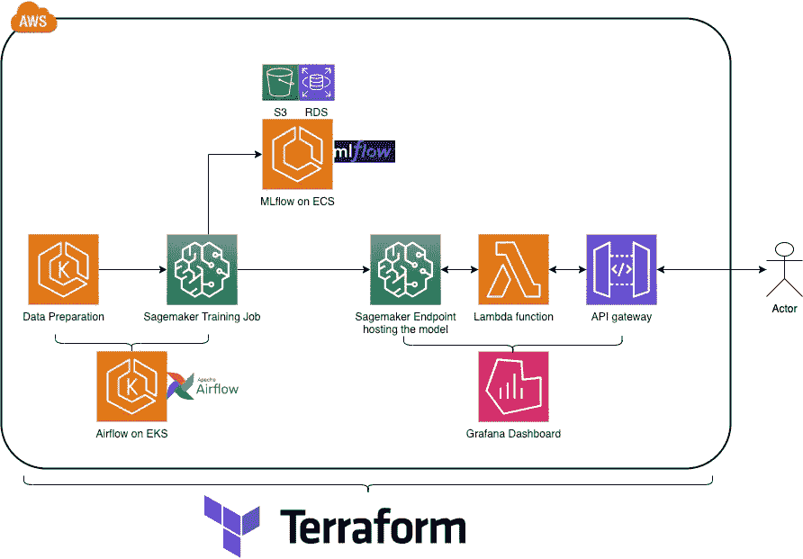

# 我们的 MLOps 故事：为十二个品牌提供生产级机器学习

> 原文：[`towardsdatascience.com/our-mlops-story-production-grade-machine-learning-or-twelve-brands-a8727fd56c94`](https://towardsdatascience.com/our-mlops-story-production-grade-machine-learning-or-twelve-brands-a8727fd56c94)

## 在荷兰 DPG Media 以有限资源构建 MLOps 平台的过程中，我们学到的东西

 [Jeffrey Luppes](https://medium.com/@jeffluppes?source=post_page-----a8727fd56c94--------------------------------)

·发表于 [Towards Data Science](https://towardsdatascience.com/?source=post_page-----a8727fd56c94--------------------------------) ·阅读时间 12 分钟·2023 年 6 月 5 日

--

部署一个机器学习模型一次是一个直接的任务；重复将机器学习模型投入生产则要困难得多。为了应对这一复杂过程，MLOps（机器学习运维）的概念应运而生。MLOps 代表了 DevOps、机器学习和软件工程实践的融合。这里有几个细微之处，但 MLOps 具体包含什么的更好定义仍在讨论中，也是供应商推销其产品的战场。为了简洁起见，我宁愿继续讲述我们的 MLOps 故事。

我们的 MLOps 之旅始于 2021 年 9 月。我们的团队仅在六个月前成立，我们开始时接手了少量继承的项目。我们团队的目标在纸面上很简单：我们要为*在线服务*提供数据/机器学习平台，这是 DPG Media 的一部分，专注于网站和社区。我们的“投资组合”包括十多个品牌，其中包括：一个受欢迎的科技新闻网站及其社区、两个招聘门户网站、一个期待父母的社区、几个可以购买二手车的网站，以及几个具有类似受众的网站。这一点对本文的其余部分很重要。

当我们开始构建平台时，我们计划支持这十二个（荷兰）品牌。

当时，机器学习团队只有一名数据科学家和我，一名机器学习工程师。我们两人相隔两周被聘用，对我们被期望投入的组织都是全新的。

当时，我们的机器学习生产环境（我宽松地使用这个术语）如下所示：

+   一个建议工作，为用户提供建议，通过 Airflow 在 Spark 上运行，适用于品牌 #1。

+   一个给汽车定价建议的模型，同时作为 Airflow 的批处理作业运行，用于品牌 #2。

+   一个针对品牌 #3 的 Databricks 目标受众的模型，作为计划好的笔记本再次作为批处理作业运行。

+   一个在 EC2 上运行的单个 Flask 应用程序，将各种模型加载到内存中，以便演示和展示各个品牌的项目。

面对十二个品牌，每个品牌可能在自己的系统和云上，我们不能对我们开发的任何东西如何被使用做出强烈假设。

两位现已离职的数据科学家完成了所有先前的项目。他们的大多数项目都存在于 Jupyter Notebooks 中，服务它们的 Flask 应用程序托管在 EC2 上 — 且经常宕机。一个单一的 MLflow 服务器在 EC2 上运行，但已过时，并且存在一些安全问题。Databricks 项目只是一个单一的笔记本，甚至没有版本控制。我们甚至不知道谁为我们安排作业的集群付费。

我们的团队需要扩展，承担更多项目，并仅花少量时间支持旧项目。我们无法继续以原有方式运作，特别是当我们希望进行实时推理时。机器学习的良机开始出现，我们的客户要求实时模型。对 MLOps 的结构化方法的必要性变得明确。

# 制定计划

我们可以依赖数据工程师（我们的团队有四名专职数据工程师）、架构师和 DPG 的系统工程师的帮助，但显然我们应该自己掌握平台。特别是我们的数据工程师已经捉襟见肘，面临着自己的截止日期和迁移。未来我们需要自己管理和更新我们的系统。我们必须亲自掌控。

我们在团队内部组织了几次头脑风暴会议，并采访了组织中的几位架构师。事情逐渐变得更为确定，而不是像之前那样在我们办公室五楼的一个阴暗角落的白板上涂涂画画。我们想给 MLflow 另一个机会，并尽可能地将所有内容保留在 AWS 上。毕竟，AWS SageMaker 显然在向更成熟的平台发展。我们的一位团队负责人敦促我们尽早适应 Terraform（或某种形式的 IaC）。由于我们的数据工程师已经在使用 Terraform，这成为了我们平台的基石。

*拍打白板* 这个家伙只能容纳这么多功能。图片由作者提供。

我加入了 MLOps 社区以了解更多工具，并与供应商进行了几次对话。开始参加聚会。幸运的是，我们还有一个 AWS 企业支持团队可以帮助我们，因为我们已经是 AWS 的大用户。很多想法，可能太多了，开始涌入。MLOps 场景（现在仍然是）有点混乱，[这在预期之中](https://www.mihaileric.com/posts/mlops-is-a-mess/)；对我们来说，重要的是快速行动并决定最重要的事情。

我们最终决定平台的原则大致如下：

+   用 Terraform 做所有事情，*除非我们不能..*

+   尽量遵循数据网格（我们组织在 2021 年采纳了），*除非..*

+   尽可能使用托管服务，*除非..*

+   转向无服务器，*除非..*

+   尽可能避免使用 Kubernetes

+   *随着进展* 建设，并在我们重新访问旧项目时迁移它们

# 模型工件和实验跟踪以及我们的第一个 MLOOPS

尽管有意图仅在需要时迁移，但我们尝试的首件事之一是将 MLflow 服务器迁移到 AWS Fargate，并将数据库放在 AWS RDS 上，而不是与服务器运行在同一个 EC2 实例上。根据业务单元，我们决定托管一个实例，测试和生产用不同的服务器。这样，四个业务单元意味着 4 x 2 几乎相同的设置。

MLflow 在 AWS 上的示例架构。取自 [`aws.amazon.com/blogs/machine-learning/managing-your-machine-learning-lifecycle-with-mlflow-and-amazon-sagemaker/`](https://aws.amazon.com/blogs/machine-learning/managing-your-machine-learning-lifecycle-with-mlflow-and-amazon-sagemaker/)

这证明是一个相当昂贵的想法（8 份这个设置，每个都有自己的负载均衡器和数据库！），而我们正在做的项目数量远远不足以支撑它。后来我们将其减少到两个实例。像这样大规模启动也意味着要直接解决 terraform、弹性负载均衡器、IAM 和 route 53。学习曲线相当陡峭，花了很多时间熟悉 AWS 的各个部分。

> 我们的第一个 ML-OOPS 尝试在需要之前设置大量（昂贵的）实例并维护它们。

对于实验（即 Jupyter 笔记本），我们决定使用 AWS SageMaker 的 Notebook 实例。这些笔记本实例配备了一个生命周期脚本，会将正确的 MLflow uri 设置为环境变量。我们创建了一些脚本来批量更新这些实例，以及监控笔记本本身，比如在有人将实例留在办公时间外时在我们的 Slack 频道中发出警报。

# 模型部署和训练

很快就到了部署我们的第一个模型的时候。我们使用了 SageMaker 的模型端点，并决定使用 Lambda 和 API 网关的设置。SageMaker 本质上可以作为一个一站式部署服务，尽管相比于自己启动 EC2 实例并托管模型，费用更高。相比于自己管理的 Kubernetes 集群，费用也更高。不过，你会得到很多回报。SageMaker 处理各种部署策略、自动扩展，并在需要时允许我们选择 GPU 类型。

我们通过 SageMaker SDK 轻松地从本地和云环境（例如 Jupyter notebook 或 Airflow）部署模型。AWS Lambda 为模型的输入和输出提供了额外的控制，而 API Gateway 提供了一个可以用 API 密钥供用户使用的 restful 接口。除了模型本身，所有元素都通过 terraform 进行部署，添加新模型只需添加一个 terraform 模块，主要指定名称和从哪里提取 Lambda 的代码。这也意味着我们可以改进模型的（前）处理，而无需更改 SageMaker 端点，并为 lambdas 单独设置 CI/CD。

AWS 上的典型部署。图像由作者提供。

训练任务也委托给了 SageMaker。为我们的前几个 ML 训练任务（使用 TensorFlow 构建的文本分类 LSTM 模型）创建模板并从*训练任务容器内部*将其记录到 MLflow 上，花费了相当大的精力。我们为训练任务制作了一个通用模板。SageMaker 对接收训练任务有相当明确的要求，这意味着你需要遵循平台的某些约定——即使在使用 TensorFlow 时也是如此。幸运的是，在后台，SageMaker 的模型服务仍然使用 TensorFlow Extended 处理 TensorFlow 模型，因此与 SavedModels 有一定的直观操作性。

我们通过 Airflow 协调训练任务，并明确不包括任何代码合并后的再训练。我们的一些模型相当昂贵，一些则不然，但几乎所有模型都需要大量计算或存储。如果在计划运行之前需要，我们可以简单地触发 dag 并运行管道。

# 监控和警报

我们 AWS 购物清单上的最后一项是监控和警报。我们首先尝试了 Amazon Managed Prometheus 和 Amazon Managed Grafana，希望能够将 CloudWatch 中的数据导入这些工具中，从而节省 CloudWatch 的成本。事实证明，这可以通过 exporter 工具实现。我们瞄准了 YACE（[yet-another-cloudwatch-exporter](https://github.com/nerdswords/yet-another-cloudwatch-exporter)），但它需要存放在某个地方。这个地方很快就会是 EC2，然后是 ECS。

我们还需要跟踪来自一个业务单位的一些指标。这意味着我们需要某种接口来与之互动。起初，这似乎可以通过 Managed Prometheus 的 Remote Write 功能实现，但我们需要更多控制，因此我们还是设置了 YACE（Prometheus 每五分钟抓取一次）。我们决定将 YACE 和 Prometheus 移动到 ECS 集群，并设置 Remote Write 加 pushgateway 来接收来自我们环境之外的指标。最后，我们放弃了 Amazon Managed Prometheus。

不幸的是，YACE 并不支持我们使用的所有 AWS 服务。我们缺乏 SageMaker 的导出功能，对我们的模型端点一无所知。幸运的是，Amazon Managed Grafana 实例也从 CloudWatch 中提取统计数据，虽然这需要支付额外的费用。

在 Amazon Managed Grafana 中，我们创建了一个通用仪表板，通过将 json 模型参数化，将其转换为模板。一旦完成，我们通过 terraform 推出了每个模型的仪表板。不幸的是，Amazon Managed Grafana 需要一个 API 密钥，以便我们的 terraform 和 ci/cd 正常运行，该密钥的最大有效期为 30 天。我们设置了一个密钥轮换 Lambda，每 29 天销毁并重新创建一个密钥，并将其存储在一个 AWS 秘密中，我们可以在 terraform 代码中请求它。这样，当部署模型时，我们现在可以在几秒钟内自动生成一个 API、监控和日志记录以及一个自定义仪表板。

由于 Grafana 也可以设置在指标超过某个阈值时发送警报，这种设置还允许我们在出现问题时触发警报，并将其转发到 Slack 或 OpsGenie。由于我们仍然只有两个人，我们制定了一个值班计划，每人轮流值班一周。诀窍是从不定义高优先级的警报。

# 结果

从一瞥来看，组成“部署”平台的最重要服务。图片来源：作者。

我们最终的“框架”相当轻量级，细心的读者会发现它实际上并没有努力实现完全的端到端自动化。目前我们有大约 15 个模型部署用于实时推断，一年下来仍由两个人组成的团队维持。上面的图片是 AWS 为中心的视图，而下面的蓝图，使用了 [AI 基础设施联盟](https://github.com/ai-infrastructure-alliance/blueprints) 的模板，提供了迄今为止堆栈功能的概述。

我们的 MLOps 堆栈。图片来源：作者。

我们希望保持灵活性，觉得使用一个更重的“为我们做所有事情”的框架可能会更具限制性和更昂贵。我们尽量不做强假设。例如，并不是每个项目都有新数据进入或有来自生产的反馈。我们可能不被允许随时存储预测结果。并不是每个模型都部署在 SageMaker 上（有些可以很好地运行在 Lambda 中！）。

就像 Lak Lakshmanan 最近的帖子（标题引发关注的“[不，你不需要 MLOps](https://becominghuman.ai/no-you-dont-need-mlops-5e1ce9fdaa4b)”）以及现在著名的[MLOps without much Ops](https://towardsdatascience.com/tagged/mlops-without-much-ops)博客系列（“[你不需要更大的船](https://github.com/jacopotagliabue/you-dont-need-a-bigger-boat)”），我们有一个努力保持简单的平台。

也就是说，如果你想保持灵活性、节省时间、预算或复杂性。

尽管如此，在构建平台时我们确实有很多需求。展示了我们需求映射的 ML 生命周期的高层次图表显示，我们现在覆盖了大部分需求。

我们希望在平台中拥有的功能以及我们已覆盖的功能的可视化。请注意，我们在这篇博客文章中没有讨论所有功能。

# 向前思考

现在我们已经讨论了我们构建了什么以及它如何融入更大的图景。接下来我们要做什么？

该平台在测试和验证方面仍然存在盲点。除了偶尔的测试外，我们没有正式的框架。提前构建这些框架并确保不进行过早优化相对困难，尤其是在压力下。同时，从软件开发的角度来看，这是我们确实无法缺少的。

作为一家媒体公司，我们有处理文本、图像、点击流、图形、向量和表格数据的模型。一些模型处理多种数据类型。模型可以包括从 XGBoost 和随机森林到 Transformer 及各种递归神经网络和卷积神经网络的任何东西。我们如何希望构建或购买能够测试所有数据类型和模型的东西呢？

另一个需要解决的问题是减少 Lambda 函数的冷启动时间。Lambda 函数是在被调用时运行的服务函数。第一次调用后，Lambda 会保持活动状态约 15 分钟，除非有其他调用跟随，最长寿命约为两小时。在首次分配资源和镜像时会出现冷启动。有时这只是几秒钟，但如果在 Lambda 中添加 TensorFlow 导入，你可能会看到你的 API 超时。

这是使用 Lambda 的生活事实——但这意味着我们或 API 的用户需要具备错误处理机制，以应对运行时间过长的问题。虽然建议不要在低流量的情况下使用 Lambda，但它仍然是我们所拥有的最便宜的选择，并且有助于抵消 SageMaker 的成本溢价。此外，它们非常容易维护。然而，冷启动是否真正成为问题，完全取决于业务背景和请求量。

我希望将来能离开我们自托管的 MLflow。它没有基于角色的访问控制。这意味着每个用户都可以查看（和删除）每个模型，并且用户需要滚动浏览可能上百个模型才能找到他们需要的。使用它还需要认知负担；任何使用它的数据科学家都必须主动注意设置实验和调用诸如 mlflow.log 或 mlflow.autolog 的函数。由于我们没有使用从 MLflow 部署到 SageMaker 的选项，我们可以切换到这个领域中的其他工具之一。我们实际上只是将 MLflow 用作跟踪过去模型运行的一种方式。

# 结束语

总结来说，本文介绍了我们创建适合我们需求的 MLOps 堆栈的过程。我们使用了 AWS 服务和开源工具来选择一套工具，以处理我们大部分的用例。随着团队的发展，这个堆栈将继续演变。我们的主要收获是：

+   **选择托管服务，别回头看。** 如果你的团队相对较小，选择托管服务是个很好的主意，这样你就不会有同样的管理开销。

+   **获取 Sagemaker。** Sagemaker 非常适合小型团队，并且在部署方面表现出色（虽然更新方面表现一般，这个以后再说），但熟悉它需要一些时间。

+   **顺其自然。** Airflow 和 MLFlow 是机器学习堆栈中的好工具，因为它们允许编排和机器学习记账，这使你能够专注于最重要的工作。

+   **基础设施即代码是云计算的 10 倍放大器。** 说真的，Terraform 为我们节省了大量工作，真是太疯狂了。

我希望这种完全开放的讨论能帮助其他团队决定他们的技术栈并评估他们的需求。希望未来我们使用的平台和工具能够变得更加成熟，并且更好地集成。

本文得到了 [Gido Schoenmacker](https://www.linkedin.com/in/g-schoenmacker/)、[Joost de Wit](https://www.linkedin.com/in/jjdewit/)、[Kim Sterenborg](https://www.linkedin.com/in/kimsterenborg/) 和 [Amine Ben Slama](https://www.linkedin.com/in/amineslama/) 的帮助。

[*Jeffrey Luppes*](https://www.linkedin.com/in/jeffluppes/) *是位于荷兰阿姆斯特丹的* [*DPG Media*](https://www.dpgmediagroup.com/en-NL) *的机器学习工程师。*
