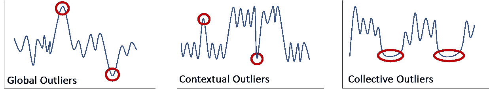
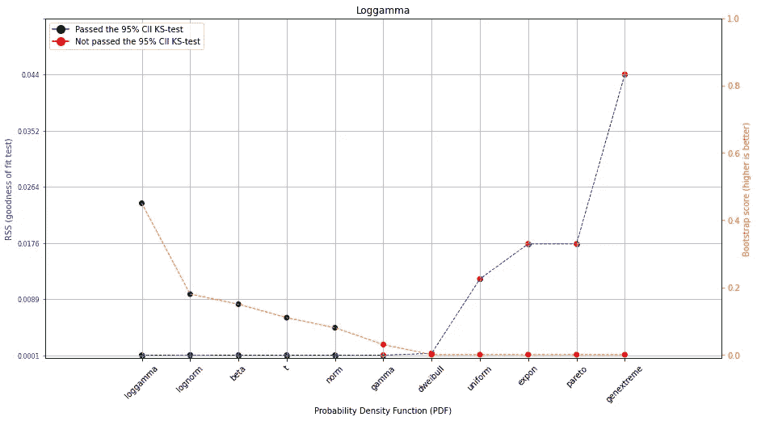
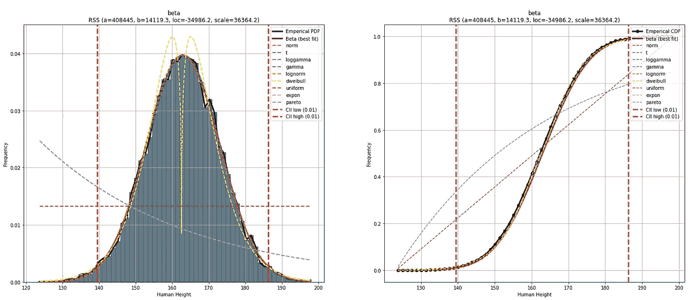
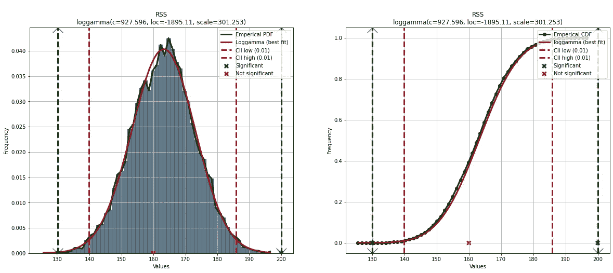
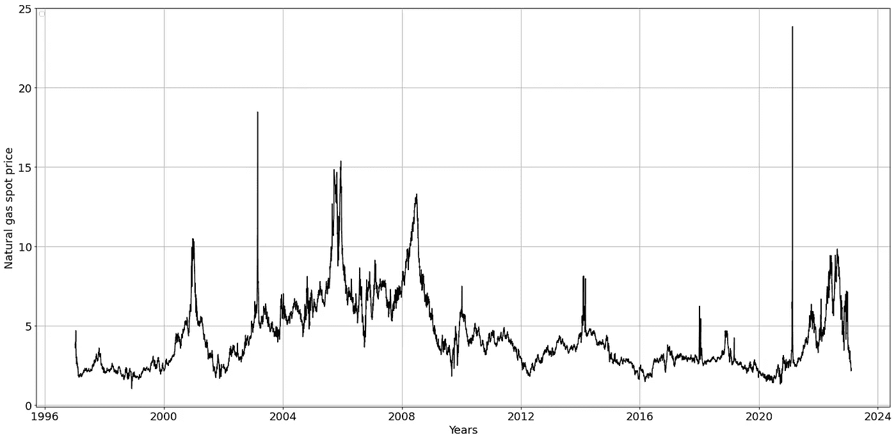
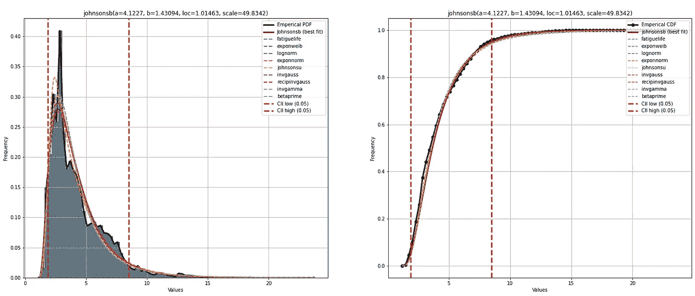
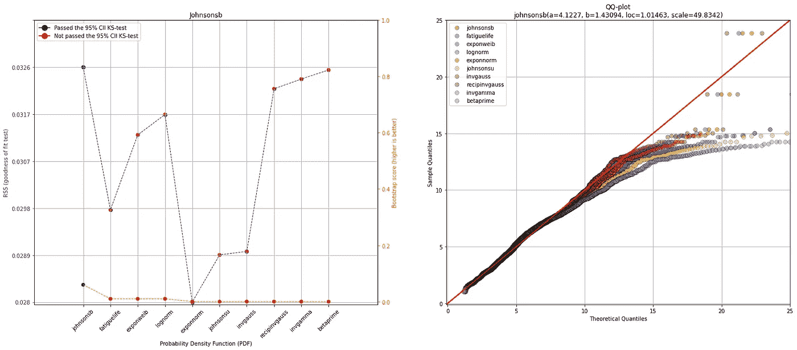
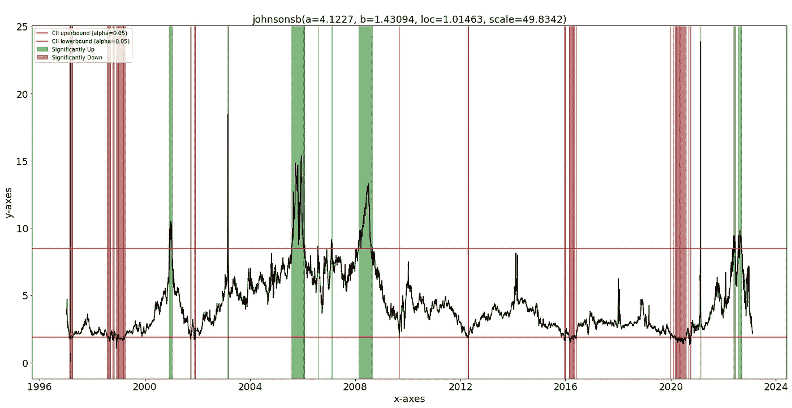

# 单变量数据集中的分布拟合异常值检测

> 原文：[`towardsdatascience.com/outlier-detection-using-distribution-fitting-in-univariate-data-sets-ac8b7a14d40e`](https://towardsdatascience.com/outlier-detection-using-distribution-fitting-in-univariate-data-sets-ac8b7a14d40e)

## 学习如何使用概率密度函数检测异常值，以实现快速、轻量级的模型和可解释的结果。

[](https://erdogant.medium.com/?source=post_page-----ac8b7a14d40e--------------------------------)[](https://towardsdatascience.com/?source=post_page-----ac8b7a14d40e--------------------------------) [Erdogan Taskesen](https://erdogant.medium.com/?source=post_page-----ac8b7a14d40e--------------------------------)

·发表于[数据科学前沿](https://towardsdatascience.com/?source=post_page-----ac8b7a14d40e--------------------------------) ·阅读时间 16 分钟·2023 年 2 月 18 日

--


图片由[Randy Fath](https://unsplash.com/es/@randyfath?utm_source=unsplash&utm_medium=referral&utm_content=creditCopyText)提供，[来自 Unsplash](https://unsplash.com/photos/G1yhU1Ej-9A?utm_source=unsplash&utm_medium=referral&utm_content=creditCopyText)

异常或新奇检测适用于各种需要明确早期警告的异常情况，例如传感器数据、安全操作和欺诈检测等。由于问题的性质，异常值不常出现，并且由于缺乏标签，创建监督模型可能变得困难。异常值也被称为异常或新奇，但在基本假设和建模过程上存在一些根本差异。***在这里，我将讨论异常和新奇之间的根本差异以及异常值检测的概念。通过一个实际的例子，我将演示如何创建一个无监督模型，用于使用概率密度拟合来检测单变量数据集中的异常和新奇。*** *distfit 库在所有示例中都被使用。*

*如果你觉得这篇文章有帮助，可以使用我的* [*推荐链接*](https://medium.com/@erdogant/membership) *继续无缝学习，并注册 Medium 会员。此外，* [*关注我*](http://erdogant.medium.com) *以保持对我最新内容的关注！*

# 异常还是新奇？

异常和新颖性都是与标准、正常或预期的情况偏离的观察。对于这种观察的集体名称是***异常值***。一般来说，异常值呈现在分布的（相对）尾部，远离其余的密度。此外，如果你观察到某个值或小范围值的密度出现大幅尖峰，这可能指向潜在的异常值。***虽然异常和新颖性检测的目标是相同的，但在概念建模上存在一些差异*** *[1]*，简要总结如下：

> **异常是已知存在于训练数据中的异常值，并且偏离正常或预期的情况。** 在这种情况下，我们应该旨在对具有预期/正常行为的观察值（也称为内点）进行建模，并忽略偏离的观察值。那些超出预期/正常行为的观察值即为异常值。
> 
> **新颖性是指训练数据中未曾出现的异常值。数据中不包含偏离正常/预期的观察。** 新颖性检测可能更具挑战性，因为没有异常值的参考。在这种情况下，领域知识更为重要，以防止模型对内点过拟合。

# 异常值可以分为三类。

我刚刚提到异常和新颖性之间的区别在于建模过程。但不仅仅如此。在我们开始建模之前，我们需要对“*异常值应该是什么样的*”设定一些期望。异常值大致可以分为三类（图 1），总结如下：

+   **全局异常值**（也称为点异常值）是单个独立的观察值，与所有其他观察值偏离[1, 2]。当提到“*异常值*”时，通常指的是全局异常值。

+   **上下文异常值**发生在特定观察值在特定上下文中不符合预期时。上下文可以表现为双峰或多峰分布，而异常值在上下文中偏离。例如，冬季气温低于 0 度是正常的，但在夏季则不寻常，因此被称为异常值。除了时间序列和季节性数据，其他已知应用还包括传感器数据[3]和安全操作[4]。

+   **集体异常值**（或称为群体异常值）是一组具有不寻常行为的相似/相关实例，与数据集中的其他数据点相比具有不同的表现[5]。这类异常值群体可能形成双峰或多峰分布，因为它们通常表示与个体异常值不同的问题类型，例如批处理错误或数据生成过程中的系统性问题。请注意，集体异常值的检测通常需要不同于个体异常值的检测方法。



图 1\. 从左到右展示了全局异常值、上下文异常值和集体异常值的示例。图片由作者提供。

在开始建模异常值之前，还有一个需要讨论的部分是***数据集***部分。从数据集的角度来看，异常值可以根据单一特征（单变量）或每个观察值的多个特征（多变量）进行检测。继续阅读，因为下一部分是关于单变量和多变量分析的。

# 异常值可以以单变量或多变量方式建模。

检测任何类型异常值的建模方法有两个主要类别；*单变量和多变量分析（图 2）*。我将重点讨论单变量随机变量的异常值检测，但在此之前，我将简要描述它们的区别：

+   **单变量**方法是指使用一个变量一次性标记样本/观察值为异常值，例如，一个人的年龄、体重或时间序列数据中的单一变量。在这种情况下，分析数据分布适合于异常值检测。

+   **多变量**方法是指样本/观察值包含多个特征，可以一起分析，例如年龄、体重和身高。它适合于检测具有（非）线性关系或每个变量的值分布（高度）偏斜的异常值。在这些情况下，单变量方法可能效果不佳，因为它未考虑变量之间的关系。


图 2\. 单变量与多变量分析在异常值检测中的概述。图像由作者提供。

# 使用分布拟合进行单变量异常值检测。

在单变量数据集中，有多种（非）参数化的异常值检测方法，如 Z 分数、Tukey 围栏和基于密度的方法等。这些方法的共同点是建模底层分布。因此，*distfit*库[6]特别适合于异常值检测，因为它可以确定单变量随机变量的概率密度函数（PDF），还可以使用百分位数或分位数以非参数方式建模单变量数据集。此外，它可以用于建模任何三类异常值：全局、上下文或集体异常值。有关使用*distfit*库[6]进行分布拟合的更详细信息，请参见这篇博客。建模方法可以总结如下：

1.  计算随机变量在不同 PDF 中的拟合度，然后使用拟合优度检验对 PDF 进行排名，并通过自助法评估。*注意，可以使用带分位数或百分位数的非参数方法。*

1.  直观检查直方图、PDF、CDF 和分位数-分位数（QQ）图。

1.  根据步骤 1 和 2 选择最佳模型，但也要确保（非）参数模型（例如，PDF）的属性与使用案例相匹配。*选择最佳模型不仅是一个统计问题；也是一个建模决策。*

1.  使用（非）参数模型（如 PDF）对新的未见样本进行预测。

# 连续随机变量的新颖性检测。

我们从一个简单而直观的例子开始，展示如何通过分布拟合和假设检验来实现单变量的**新颖性检测**。***在这个例子中，我们的目标是追求一种新颖的方法来检测全球异常值***，即*数据中不包含偏离正常/预期的观察值*。这意味着，在某些时候，我们应该仔细融入领域知识，以设定异常值的边界。

假设我们有 10,000 人的身高测量值。让我们生成一个`mean=163`和`std=10`的随机正态数据，代表我们的*人类身高*测量值。*我们期望一个包含两个尾部的钟形曲线；那些身高比平均值小或大的数据。*请注意，由于随机成分，重复实验时结果可能会略有不同。

```py
# Import library
import numpy as np

# Generate 10000 samples from a normal distribution
X = np.random.normal(163, 10, 10000)
```

## 1\. 确定最佳拟合人类身高的 PDF。

在检测任何异常值之前，我们需要拟合一个分布（PDF），以描述人类身高的正常/预期行为。*distfit* 库可以拟合多达 89 种理论分布。我将把搜索限制在常见/流行的概率密度函数，因为我们预计会有一个钟形曲线（*见以下代码部分*）。

```py
# Install distfit library
pip install distfit
```

```py
# Import library
from distfit import distfit

# Initialize for common/popular distributions with bootstrapping.
dfit = distfit(distr='popular', n_boots=100)

# Estimate the best fit
results = dfit.fit_transform(X)

# Plot the RSS and bootstrap results for the top scoring PDFs
dfit.plot_summary(n_top=10)

# Show the plot
plt.show()
```



图 3\. 人类身高与最常见分布的 RSS 分数拟合情况。

***loggamma*** PDF 被检测为*人类身高*的最佳拟合，依据是拟合优度检验统计量（RSS）和自助法。请注意，自助法评估了 PDF 是否存在过拟合。自助得分范围在[0, 1]之间，描绘了 PDF 的自助数量(`n_bootst=100`)的拟合成功率。也可以从图 3 中看到，除了*loggamma* PDF 外，还有多个其他 PDF 也被检测出低残差平方和，即*Beta, Gamma, Normal, T-分布, Loggamma, 广义极值, 和 Weibull 分布*（图 3）。然而，只有五种 PDF 通过了自助法。

## 2: 视觉检查最佳拟合的概率密度函数（PDF）。

最佳实践是视觉检查分布拟合。*distfit* 库包含内置的绘图功能，如结合 PDF/CDF 的直方图和 QQ 图。可以按照如下方式创建图表：

```py
# Make figure
fig, ax = plt.subplots(1, 2, figsize=(20, 8))

# PDF for only the best fit
dfit.plot(chart='PDF', n_top=1, ax=ax[0]);

# CDF for the top 10 fits
dfit.plot(chart='CDF', n_top=10, ax=ax[1])

# Show the plot
plt.show()
```



图 4\. 帕累托图，显示了经验数据的直方图和估计的 PDF。左侧面板：最佳拟合的 PDF（贝塔）。右侧面板：前 10 个最佳拟合的 CDF。置信区间基于 alpha=0.05。

视觉检查确认了顶级 PDF 的拟合优度评分。然而，有一个例外，即威布尔分布（图 4 中的黄色线）似乎有两个峰值。换句话说，尽管 RSS 较低，但视觉检查未显示出对我们随机变量的良好拟合。*请注意，引导法很快排除了威布尔分布，现在我们知道原因了*。

## 步骤 3：通过使用 PDF 属性进行决定。

最后一步可能是最具挑战性的，因为仍然有五种候选分布在拟合优度测试、引导法和视觉检查中得分非常高。我们现在应该决定哪个 PDF 在其基本属性上最适合建模人类身高。我将逐步阐述与我们人类身高建模用例相关的顶级候选分布的属性。

> **正态分布** 是一个典型的选择，但需要注意的是，对人类身高的正态性假设在所有人群中可能并不成立。它没有重尾，因此可能无法很好地捕捉异常值。
> 
> **学生 t 分布** 通常在样本量较小或总体方差未知时作为正态分布的替代。它比正态分布具有更重的尾部，这能更好地捕捉数据中的异常值或偏斜。如果样本量较小，这种分布本可以是一个选项，但随着样本量的增加，t 分布趋近于正态分布。
> 
> **伽玛分布** 是一种连续分布，通常用于建模数据呈正偏态，即存在长尾的高值。人类身高可能因异常值（如非常高的个体）而呈正偏态。然而，引导法显示了较差的拟合。
> 
> **对数伽玛分布** 具有偏斜的形状，类似于伽玛分布，但具有更重的尾部。它建模值的对数，这使得当数据具有大量高值时更为合适。
> 
> **贝塔分布** 通常用于建模比例或率[9]，而不是像我们用于身高的这种连续变量。如果身高被一个参考值（如中位身高）除以，那么它本是一个合适的选择。因此，尽管它在拟合优度测试中得分最高，我们通过视觉检查确认了良好的拟合，但它不会是我的首选。
> 
> **广义极值（GEV）**分布可以用来建模人群中的极值分布，例如最大值或最小值。它也允许重尾分布，可以捕捉数据中的离群值或偏斜。然而，它通常用于建模极值的分布 [10]，而不是像人类身高这样的连续变量的总体分布。
> 
> **Dweibull 分布**可能不是这个研究问题的最佳匹配，因为它通常用于建模具有单调增加或减少趋势的数据，例如故障时间或事件时间数据 [11]。人类身高数据可能没有明确的单调趋势。PDF/CDF/QQ 图的视觉检查也显示没有良好的匹配。

总结来说，***loggamma*** 分布在考虑了*拟合优度检验、引导法、视觉检查以及现在基于与研究问题相关的 PDF 属性*后，可能是这个特定使用案例中最佳的选择。请注意，我们可以轻松指定*loggamma* 分布并在输入数据上重新拟合（参见代码部分），如果需要的话（参见代码部分）。

```py
# Initialize for common or popular distributions.
dfit = distfit(distr='loggamma', alpha=0.01, bound='both')

# Estimate the best fit
results = dfit.fit_transform(X)

# Print model parameters
print(dfit.model)

# {'name': 'loggamma',
#  'score': 6.676334203908028e-05,
#  'loc': -1895.1115726427015,
#  'scale': 301.2529482991781,
#  'arg': (927.596119872062,),
#  'params': (927.596119872062, -1895.1115726427015, 301.2529482991781),
#  'color': '#e41a1c',
#  'CII_min_alpha': 139.80923469906566,
#  'CII_max_alpha': 185.8446340627711}

# Save model
dfit.save('./human_height_model.pkl')
```

## 第 4 步\. 对新的未见样本进行预测。

使用拟合模型，我们可以评估新（未见）样本的重要性，并检测它们是否偏离正常/预期（内点）。预测是基于理论概率密度函数进行的，这使得它轻量、快速且易于解释。PDF 的置信区间是通过`alpha`参数设置的。***这是需要领域知识的部分，因为我们的数据集中没有已知的离群值。*** 在这种情况下，我设置了置信区间（CII）`alpha=0.01`，这导致最小边界为 139.8cm，最大边界为 185.8cm。默认情况下，两个尾部都会被分析，但这可以使用`bound`参数进行更改*（参见上面的代码部分）*。

我们可以使用`predict`函数对新的未见样本进行预测，并创建预测结果的图表（图 5）。请注意，显著性经过了多重测试校正：`multtest='fdr_bh'`。*因此，离群值可能位于置信区间之外，但不会被标记为显著。*

```py
# New human heights
y = [130, 160, 200]

# Make predictions
results = dfit.predict(y, alpha=0.01, multtest='fdr_bh', todf=True)

# The prediction results
results['df']

#        y   y_proba y_pred         P
# 0  130.0  0.000642   down  0.000428
# 1  160.0  0.391737   none  0.391737
# 2  200.0  0.000321     up  0.000107

plt.figure();
fig, ax = plt.subplots(1, 2, figsize=(20, 8))
# PDF for only the best fit
dfit.plot(chart='PDF', ax=ax[0]);
# CDF for the top 10 fits
dfit.plot(chart='CDF', ax=ax[1])
# Show plot
plt.show()
```



图 5\. 左面板：经验数据和对数-伽马 PDF 的直方图。黑线是经验数据分布。红线是拟合的理论分布。红色垂直线是设置为 0.01 的置信区间。绿色虚线被检测为离群值，红色叉号则不显著。（作者提供的图像）

预测结果存储在`results`中，包含多个列：`y`、`y_proba`、`y_pred`和`P`。`P`代表原始 p 值，`y_proba`是经过多重测试校正后的概率（默认值：`fdr_bh`）。请注意，使用`todf=True`参数时会返回一个数据框。两个观察值的概率`alpha<0.01`，并标记为显著`up`或`down`。

# 真实世界数据中的异常检测。

到目前为止，我们已经看到如何拟合模型并检测新颖性检测中的全球异常值。***在这里，我们将使用真实世界的数据进行异常检测。*** 使用真实世界的数据通常更具挑战性。为了演示这一点，我将从 Thomson Reuters [7] 下载*天然气现货价格*的数据集，这是一份开源且免费提供的数据集 [8]。下载、导入并去除 nan 值后，共有 6555 个数据点，覆盖 27 年。

```py
# Initialize distfit
dfit = distfit()

# Import dataset
df = dfit.import_example(data='gas_spot_price')

print(df)
#             price
# date             
# 2023-02-07   2.35
# 2023-02-06   2.17
# 2023-02-03   2.40
# 2023-02-02   2.67
# 2023-02-01   2.65
#           ...
# 1997-01-13   4.00
# 1997-01-10   3.92
# 1997-01-09   3.61
# 1997-01-08   3.80
# 1997-01-07   3.82

# [6555 rows x 1 columns]
```

## 对数据集的可视化检查。

为了直观地检查数据，我们可以创建一个*天然气现货价格*的折线图，以查看是否存在明显的趋势或其他相关问题（图 6）。可以看出，2003 年和 2021 年包含两个主要的峰值（这表明存在全球异常值）。此外，价格动作似乎呈现出自然的波动，有局部的高点和低点。基于这个折线图，我们可以对预期的分布形成直观的理解。价格主要在[2, 5]范围内波动，但在 2003 年至 2009 年之间有一些异常年份，价格范围更多在[6, 9]之间。

```py
# Get unique years
dfit.lineplot(df, xlabel='Years', ylabel='Natural gas spot price', grid=True)

# Show the plot
plt.show()
```



图 6\. 从 Thomson Reuters [7, 8]获取的天然气现货价格数据集开放数据源。

让我们使用*distfit*来更深入地研究数据分布，并确定相应的 PDF。搜索空间设置为所有可用的 PDF，bootstrap 方法设置为 100，以评估 PDF 的过拟合情况。

```py
# Initialize
from distfit import distfit

# Fit distribution
dfit = distfit(distr='full', n_boots=100)

# Search for best theoretical fit.
results = dfit.fit_transform(df['price'].values)

# Plot PDF/CDF
fig, ax = plt.subplots(1,2, figsize=(25, 10))
dfit.plot(chart='PDF', n_top=10, ax=ax[0])
dfit.plot(chart='CDF', n_top=10, ax=ax[1])

# Show plot
plt.show()
```



图 7\. 左：PDF，右：CDF。所有拟合的理论分布以不同颜色显示。（图片由作者提供）

最佳拟合的 PDF 是*Johnsonsb*（图 7），但当我们绘制经验数据分布时，PDF（红线）并未完全跟随经验数据。一般来说，我们可以确认大多数数据点位于[2, 5]范围内（*这是分布的峰值所在位置*），并且在分布中存在一个较小的第二个峰值，价格动作大约在 6 附近。这也是 PDF 未能平滑拟合经验数据的地方，导致一些低估和高估。通过总结图和 QQ 图，我们可以更好地研究拟合情况。让我们使用以下代码创建这两个图：

```py
# Plot Summary and QQ-plot
fig, ax = plt.subplots(1,2, figsize=(25, 10))

# Summary plot
dfit.plot_summary(ax=ax[0])

# QQplot
dfit.qqplot(df['price'].values, n_top=10, ax=ax[1])

# Show the plot
plt.show()
```

在汇总图中看到拟合优度测试在所有顶级分布中显示了良好的结果（低分）很有趣。然而，当我们查看自助法的结果时，显示除了一个分布外，所有分布都过度拟合（图 8A，橙色线）。这并不完全意外，因为我们已经注意到超调和欠调。QQ 图确认拟合的分布与经验数据之间存在较大偏差（图 8B）。只有*Johnsonsb*分布显示出（边际）良好的拟合。



图 8\. A. 左侧面板：根据自助法得分和拟合优度测试对 PDF 进行排序。B. 右侧面板：QQ 图，比较经验分布与所有其他理论分布。（图片由作者提供）

## 全球和上下文异常值检测。

我们将继续使用*Johnsonsb*分布和`predict`功能来检测异常值。我们已经知道数据集中包含异常值，因为我们遵循了异常方法，即*分布是基于内点进行拟合的，而现在落在置信区间之外的观察值可以标记为潜在的异常值。* 使用`predict`函数和`lineplot`我们可以检测和绘制异常值。从图 9 可以看到，虽然我们没有明确对其建模，但全球异常值和一些上下文异常值都被检测到了。***红色条形图***表示不足代表的异常值，***绿色条形图***表示过度代表的异常值。可以设置`alpha`参数来调整置信区间。

```py
# Make prediction
dfit.predict(df['price'].values, alpha=0.05, multtest=None)

# Line plot with data points outside the confidence interval.
dfit.lineplot(df['price'], labels=df.index)
```



图 9\. 拟合分布并进行预测后的异常值绘制。绿色条形图表示在 95%置信区间上界之外的异常值。红色条形图表示在 95%置信区间下界之外的异常值。

# 结语。

我描述了异常检测与新颖性检测之间的区别，以及如何使用分布拟合创建模型。通过使用*distfit*库，可以评估 89 种理论分布，选择合适的分布，并对新的未见样本进行预测。通过一个实际示例和一个真实数据集，我展示了如何确定最佳匹配的 PDF。请注意，可能没有任何已知的理论分布显著匹配。在这种情况下，*distfit*库还提供了使用*百分位数*或*分位数*进行非参数拟合的选项。更多信息请参考我之前的博客关于分布拟合[6]。需要注意的是，异常检测是一项具有挑战性的任务，因为什么是正常或预期的定义可能是主观的，并且可能根据应用而有所不同。此外，异常可能由测量误差、数据错误或自然波动引起，因此在得出任何结论之前，仔细考虑偏差的根本原因非常重要*。

*保持安全。保持警觉。*

***干杯 E.***

*如果你觉得这篇文章对你有帮助，请使用我的* [*推荐链接*](https://medium.com/@erdogant/membership) *继续无限学习并注册 Medium 会员。此外，* [*关注我*](http://erdogant.medium.com) *以保持最新内容的更新！*

## 软件

+   [Distfit Github/文档](https://erdogant.github.io/distfit/)

+   [Distfit notebook 示例](https://erdogant.github.io/distfit/pages/html/Documentation.html#colab-notebook)

## 让我们联系吧！

+   [在 LinkedIn 上联系我](https://www.linkedin.com/in/erdogant/)

+   [在 Github 上关注我](https://github.com/erdogant)

+   [在 Medium 上关注我](https://erdogant.medium.com/)

## 参考文献

1.  Breunig, Kriegel, Ng, 和 Sander (2000)*,* [*LOF: 识别基于密度的局部异常点*](https://www.dbs.ifi.lmu.de/Publikationen/Papers/LOF.pdf) Proc. ACM SIGMOD

1.  [`scikit-learn.org/stable/modules/outlier_detection.html`](https://scikit-learn.org/stable/modules/outlier_detection.html)

1.  Hayes, M.A., Capretz, M.A. *大传感器数据的上下文异常检测框架*. *《大数据期刊》* **2**, 2 (2015). [`doi.org/10.1186/s40537-014-0011-y`](https://doi.org/10.1186/s40537-014-0011-y)

1.  A. AlEroud 和 G. Karabatis, *一种上下文异常检测方法用于发现零日攻击*, 2012 国际网络安全会议, 美国弗吉尼亚州亚历山德里亚, 2012, 第 40–45 页, doi: [10.1109/CyberSecurity.2012.12](https://doi.org/10.1109/CyberSecurity.2012.12)

1.  Song W., Dong W., Kang L. *基于贝叶斯框架和遗传算法的群体异常检测*, Inf. Sci. (NY), 533 (2020), 第 138–149 页, [10.1016/j.ins.2020.03.110](https://doi.org/10.1016/j.ins.2020.03.110)

1.  E. Taskesen, *如何找到数据的最佳理论分布*, 2023 年 2 月 Medium。

1.  Thomson Reuters，[*天然气现货价格*](https://www.eia.gov/dnav/ng/hist/rngwhhdW.htm)

1.  Thomson Reuters，[*天然气现货价格开放源数据*](https://www.eia.gov/opendata/)

1.  维基百科，[*贝塔分布*](https://en.wikipedia.org/wiki/Beta_distribution)*.*

1.  statisticshowto，[*极值分布与极值理论*](https://www.statisticshowto.com/extreme-value-distribution/)

1.  维基百科，[*威布尔分布*](https://en.wikipedia.org/wiki/Weibull_distribution)。
