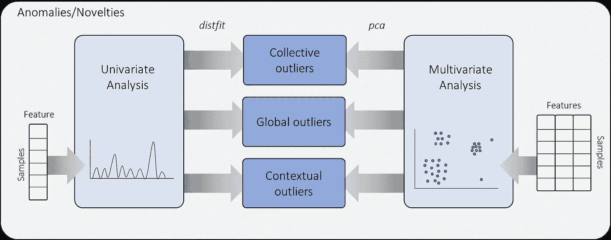
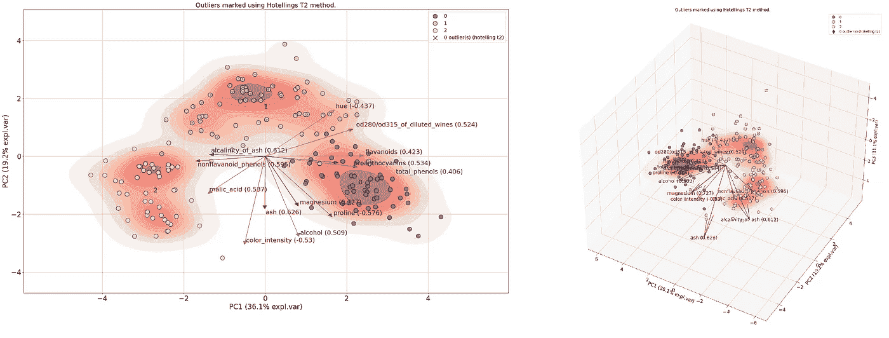
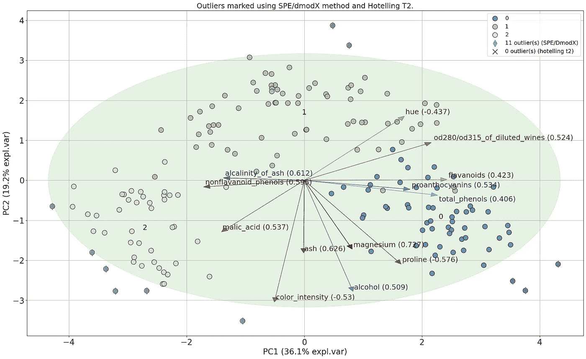
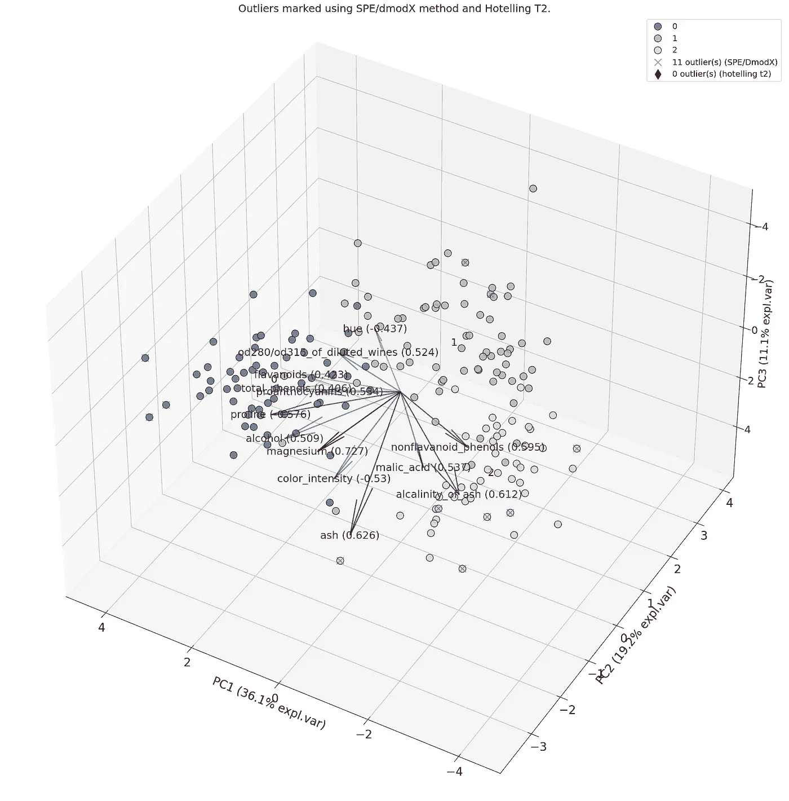
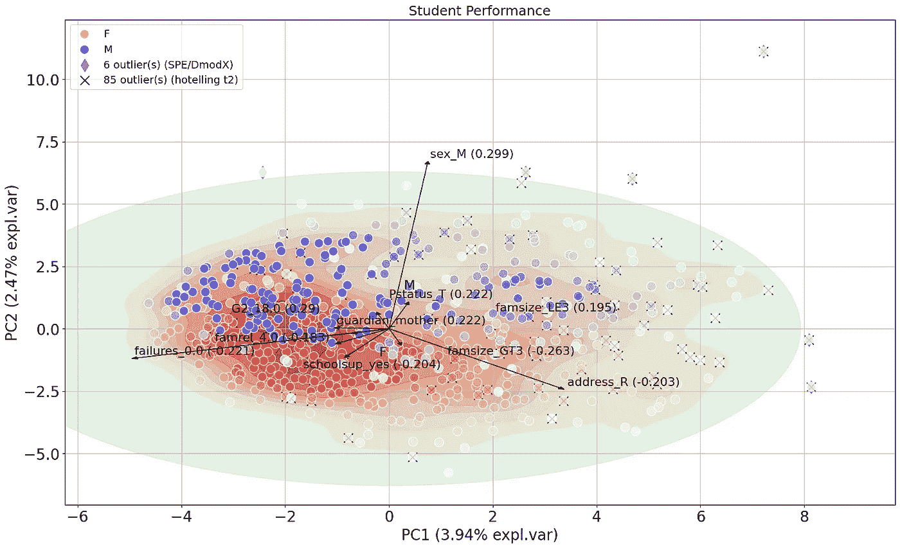

# 主成分分析与霍特林 T2 及 SPE/DmodX 方法的异常值检测

> 原文：[`towardsdatascience.com/outlier-detection-using-principal-component-analysis-and-hotellings-t2-and-spe-dmodx-methods-625b3c90897`](https://towardsdatascience.com/outlier-detection-using-principal-component-analysis-and-hotellings-t2-and-spe-dmodx-methods-625b3c90897)

## 由于 PCA 的敏感性，它可以用于检测多变量数据集中的异常值。

[](https://erdogant.medium.com/?source=post_page-----625b3c90897--------------------------------)[](https://towardsdatascience.com/?source=post_page-----625b3c90897--------------------------------) [Erdogan Taskesen](https://erdogant.medium.com/?source=post_page-----625b3c90897--------------------------------)

·发表于[Towards Data Science](https://towardsdatascience.com/?source=post_page-----625b3c90897--------------------------------) ·阅读时长 11 分钟·2023 年 3 月 11 日

--


照片由[Andrew Ridley](https://unsplash.com/@aridley88?utm_source=unsplash&utm_medium=referral&utm_content=creditCopyText)提供，拍摄于[Unsplash](https://unsplash.com/photos/jR4Zf-riEjI?utm_source=unsplash&utm_medium=referral&utm_content=creditCopyText)

主成分分析（PCA）是一种广泛使用的降维技术，能够在保持相关信息的同时减少维度。由于其敏感性，它也可以用于检测多变量数据集中的异常值。异常值检测可以为异常情况提供早期预警，允许专家在问题升级之前识别和解决问题。然而，由于高维度和缺乏标签，在多变量数据集中检测异常值可能具有挑战性。PCA 在异常值检测中提供了几个优势。***我将描述使用 PCA 进行异常值检测的概念。通过实际示例，我将展示如何为连续和分类数据集创建一个无监督模型来检测异常值。***

## 异常值检测。

异常值可以通过***单变量***或***多变量***方法建模（见图 1）。在单变量方法中，异常值是通过对一个变量进行数据分布分析来检测的。有关单变量异常值检测的更多详细信息，请参阅以下博客文章[1]：

[](/outlier-detection-using-distribution-fitting-in-univariate-data-sets-ac8b7a14d40e?source=post_page-----625b3c90897--------------------------------) ## 单变量数据集中的分布拟合异常值检测

### 了解如何使用概率密度函数检测离群点，以获得快速且轻量的模型和可解释的结果。

towardsdatascience.com

多变量方法使用多个特征，因此可以检测具有（非）线性关系或偏斜分布的离群点。scikit-learn 库有多种多变量离群点检测解决方案，例如一类分类器、孤立森林和局部离群因子[2]。***在这篇博客中，我将专注于使用主成分分析[3]进行多变量离群点检测，其自身具有可解释性等优点；离群点可以通过主成分分析的降维得到可视化。***



图 1\. 单变量与多变量分析在离群点检测中的概述。*多变量数据集的离群点检测将在此博客中描述（*图像由作者提供）。

## 异常与新颖性

***异常与新颖性***是与标准/预期行为偏离的观察结果，也称为离群点。尽管有一些不同：***异常是之前见过的偏差***，通常用于检测欺诈、入侵或故障。***新颖性是之前未见过的偏差***，用于识别新的模式或事件。在这种情况下，使用领域知识非常重要。由于什么是正常或预期的定义可以是主观的并且基于应用而有所不同，因此检测异常和新颖性都可能具有挑战性。

# 主成分分析用于离群点检测。

主成分分析（PCA）是一种线性变换，它减少了数据的维度并寻找数据中方差最大的方向。由于这种方法的特性，它对具有不同值范围的变量以及离群点都很敏感。一个优点是它允许在二维或三维散点图中可视化数据，使得更容易直观地确认检测到的离群点。此外，它提供了对响应变量的良好解释性。PCA 的另一个重大优点是它可以与其他方法结合使用，例如不同的距离度量，以提高离群点检测的准确性。在这里，我将使用包含两种离群点检测方法的 PCA 库：Hotelling’s T2 和 SPE/DmodX。有关更多细节，请阅读关于主成分分析和`pca`库的博客文章[3]。

[](/what-are-pca-loadings-and-biplots-9a7897f2e559?source=post_page-----625b3c90897--------------------------------) ## 什么是 PCA 负荷和如何有效使用 Biplots?

### 主成分分析的实用指南

[towardsdatascience.com

*如果你觉得这篇关于异常值检测的文章对你有帮助，* [*关注我*](http://erdogant.medium.com/) *以保持最新内容！通过我的* [*推荐链接*](https://medium.com/@erdogant/membership) *来支持这篇内容，这将为你提供 Medium 会员无限制的学习和阅读。*

# 连续随机变量的异常值检测。

让我们从一个示例开始，演示如何使用[Hotelling’s T2](https://erdogant.github.io/pca/pages/html/Outlier%20detection.html#)和[SPE/DmodX](https://erdogant.github.io/pca/pages/html/Outlier%20detection.html#spe-dmodx)进行连续随机变量的异常值检测。我将使用来自 sklearn 的*wine dataset*，该数据集包含 178 个样本，13 个特征和 3 个葡萄酒类别[4]。

```py
# Intallation of the pca library
pip install pca
```

```py
# Load other libraries
from sklearn.datasets import load_wine
import pandas as pd

# Load dataset
data = load_wine()

# Make dataframe
df = pd.DataFrame(index=data.target, data=data.data, columns=data.feature_names)

print(df)
#     alcohol  malic_acid   ash  ...   hue  ..._wines  proline
# 0     14.23        1.71  2.43  ...  1.04  3.92   1065.0
# 0     13.20        1.78  2.14  ...  1.05  3.40   1050.0
# 0     13.16        2.36  2.67  ...  1.03  3.17   1185.0
# 0     14.37        1.95  2.50  ...  0.86  3.45   1480.0
# 0     13.24        2.59  2.87  ...  1.04  2.93    735.0
# ..      ...         ...   ...  ...   ...  ...
# 2     13.71        5.65  2.45  ...  0.64  1.74    740.0
# 2     13.40        3.91  2.48  ...  0.70  1.56    750.0
# 2     13.27        4.28  2.26  ...  0.59  1.56    835.0
# 2     13.17        2.59  2.37  ...  0.60  1.62    840.0
# 2     14.13        4.10  2.74  ...  0.61  1.60    560.0
# 
# [178 rows x 13 columns]
```

我们可以在数据框中看到每个特征的值范围差异很大，因此归一化步骤很重要。归一化步骤是[*pca library*](https://erdogant.github.io/pca/)中的一个内置功能，可以通过`normalize=True`设置。在初始化时，我们可以分别指定异常值检测方法，`ht2`用于 Hotelling’s T2，`spe`用于 SPE/DmodX 方法。

```py
# Import library
from pca import pca

# Initialize pca to also detected outliers.
model = pca(normalize=True, detect_outliers=['ht2', 'spe'], n_std=2  )

# Fit and transform
results = model.fit_transform(df)
```

运行 fit 函数后，*pca*库会对每个样本进行异常值评分。对于每个样本，会收集多个统计数据，如下面代码部分所示。数据框中的前四列（`y_proba`、`p_raw`、`y_score`和`y_bool`）是使用 Hotelling’s T2 方法检测的异常值。后两列（`y_bool_spe`和`y_score_spe`）则基于 SPE/DmodX 方法。

```py
# Print outliers
print(results['outliers'])

#     y_proba     p_raw    y_score  y_bool  y_bool_spe  y_score_spe
#0   0.982875  0.376726  21.351215   False       False     3.617239
#0   0.982875  0.624371  17.438087   False       False     2.234477
#0   0.982875  0.589438  17.969195   False       False     2.719789
#0   0.982875  0.134454  27.028857   False       False     4.659735
#0   0.982875  0.883264  12.861094   False       False     1.332104
#..       ...       ...        ...     ...         ...          ...
#2   0.982875  0.147396  26.583414   False       False     4.033903
#2   0.982875  0.771408  15.087004   False       False     3.139750
#2   0.982875  0.244157  23.959708   False       False     3.846217
#2   0.982875  0.333600  22.128104   False       False     3.312952
#2   0.982875  0.138437  26.888278   False       False     4.238283

[178 rows x 6 columns]
```

**Hotelling’s T2** 计算了基于前`n_components`的卡方检验和 P 值，从而允许通过`y_proba`对异常值进行从强到弱的排序。请注意，异常值的搜索空间是 PC1 到 PC5，因为预期最高的方差（因此也是异常值）会出现在前几个组件中。注意，深度是可选的，以防方差在前五个组件中捕捉得不好。让我们为葡萄酒数据集绘制异常值并标记它们（图 2）。

```py
# Plot Hotellings T2
model.biplot(SPE=False, HT2=True, density=True, title='Outliers marked using Hotellings T2 method.')

# Make a plot in 3 dimensions
model.biplot3d(SPE=False, HT2=True, density=True, arrowdict={'scale_factor': 2.5, 'fontsize': 20}, title='Outliers marked using Hotellings T2 method.')

# Get the outliers using SPE/DmodX method.
df.loc[results['outliers']['y_bool'], :]
```



图 2。左面板：PC1 与 PC2 的关系图以及使用 Hotelling’s T2 方法检测的 9 个异常值的投影样本。右面板：带有异常值的三维图。（图片由作者提供）

**SPE/DmodX**方法是实际观察值与其投影之间的距离度量，使用主成分。距离中心的值由 Hotelling’s T2 值表示，因此图 3 中的椭圆表示样本超出 Hotelling’s T2 的边界。样本根据前两个主成分的均值和协方差被标记为异常值（图 3）。换句话说，当它在椭圆之外时。

```py
# Plot SPE/DmodX method
model.biplot(SPE=True, HT2=True, title='Outliers marked using SPE/dmodX method and Hotelling T2.')

# Make a plot in 3 dimensions
model.biplot3d(SPE=True, HT2=True, title='Outliers marked using SPE/dmodX method and Hotelling T2.')

# Get the outliers using SPE/DmodX method.
df.loc[results['outliers']['y_bool_spe'], :]
```



图 3A. 使用 SPE/DmodX 方法检测到的离群值用菱形标出。使用 Hotelling T2 方法检测到的离群值用十字标出。（作者提供的图像）



图 3B. 使用 SPE/DmodX 方法检测到的离群值在 3D 图中可视化。

使用两种方法的结果，我们现在也可以计算重叠情况。在这种用例中，有 5 个离群值重叠（*见下方代码部分*）。

```py
# Grab overlapping outliers
I_overlap = np.logical_and(results['outliers']['y_bool'], results['outliers']['y_bool_spe'])

# Print overlapping outliers
df.loc[I_overlap, :]
```

# 分类变量的离群值检测。

对于分类变量中的离群值检测，我们首先需要对分类变量进行离散化，使得距离可以互相比较。通过离散化的数据集（独热编码），我们可以使用 PCA 方法，并应用 Hotelling’s T2 和 SPE/DmodX 方法。我将使用学生成绩数据集[5]进行演示，该数据集包含 649 个样本和 33 个变量。我们将按照*下方的代码部分*导入数据集。关于列描述的更多细节可以在[这里](https://archive.ics.uci.edu/ml/datasets/student+performance)找到。如果数据集中存在标识符列或浮点类型的变量，我会将其删除或将其分类为离散区间，但在这里不会删除任何列。

```py
# Import library
from pca import pca

# Initialize
model = pca()

# Load Student Performance data set
df = model.import_example(data='student')

print(df)
#     school sex  age address famsize Pstatus  ...  Walc  health absences
# 0       GP   F   18       U     GT3       A  ...     1       3        4
# 1       GP   F   17       U     GT3       T  ...     1       3        2
# 2       GP   F   15       U     LE3       T  ...     3       3        6
# 3       GP   F   15       U     GT3       T  ...     1       5        0  
# 4       GP   F   16       U     GT3       T  ...     2       5        0  
# ..     ...  ..  ...     ...     ...     ...  ...   ...     ...      ...  
# 644     MS   F   19       R     GT3       T  ...     2       5        4  
# 645     MS   F   18       U     LE3       T  ...     1       1        4  
# 646     MS   F   18       U     GT3       T  ...     1       5        6  
# 647     MS   M   17       U     LE3       T  ...     4       2        6  
# 648     MS   M   18       R     LE3       T  ...     4       5        4  

# [649 rows x 33 columns]
```

变量需要进行独热编码，以确保变量之间的距离可以相互比较。这会导致 649 个样本产生 177 列（见下方`code`部分）。

```py
# Install onehot encoder
pip install df2onehot

# Initialize
from df2onehot import df2onehot

# One hot encoding
df_hot = df2onehot(df)[‘onehot’]

print(df_hot)
#      school_GP  school_MS  sex_F  sex_M  ...  
# 0         True      False   True  False  ...  
# 1         True      False   True  False  ...  
# 2         True      False   True  False  ...  
# 3         True      False   True  False  ...  
# 4         True      False   True  False  ...  
# ..         ...        ...    ...    ...  ...  
# 644      False       True   True  False  ...  
# 645      False       True   True  False  ...  
# 646      False       True   True  False  ...  
# 647      False       True  False   True  ...  
# 648      False       True  False   True  ...  

# [649 rows x 177 columns]
```

我们现在可以使用处理后的独热数据框作为 PCA 的输入并检测离群值。在初始化过程中，我们可以设置`normalize=True`以对数据进行标准化，并且需要指定离群值检测方法。

```py
# Initialize PCA to also detected outliers.
model = pca(normalize=True,
            detect_outliers=['ht2', 'spe'],
            alpha=0.05,
            n_std=3,
            multipletests='fdr_bh')

# Fit and transform
results = model.fit_transform(df_hot)

# [649 rows x 177 columns]
# [pca] >Processing dataframe..
# [pca] >Normalizing input data per feature (zero mean and unit variance)..
# [pca] >The PCA reduction is performed to capture [95.0%] explained variance using the [177] columns of the input data.
# [pca] >Fit using PCA.
# [pca] >Compute loadings and PCs.
# [pca] >Compute explained variance.
# [pca] >Number of components is [116] that covers the [95.00%] explained variance.
# [pca] >The PCA reduction is performed on the [177] columns of the input dataframe.
# [pca] >Fit using PCA.
# [pca] >Compute loadings and PCs.
# [pca] >Outlier detection using Hotelling T2 test with alpha=[0.05] and n_components=[116]
# [pca] >Multiple test correction applied for Hotelling T2 test: [fdr_bh]
# [pca] >Outlier detection using SPE/DmodX with n_std=[3]
# [pca] >Plot PC1 vs PC2 with loadings.

# Overlapping outliers between both methods
overlapping_outliers = np.logical_and(results['outliers']['y_bool'],
                                      results['outliers']['y_bool_spe'])

# Show overlapping outliers
df.loc[overlapping_outliers]

#     school sex  age address famsize Pstatus  ...  Walc  health absences 
# 279     GP   M   22       U     GT3       T  ...     5       1       12  
# 284     GP   M   18       U     GT3       T  ...     5       5        4 
# 523     MS   M   18       U     LE3       T  ...     5       5        2 
# 605     MS   F   19       U     GT3       T  ...     3       2        0 
# 610     MS   F   19       R     GT3       A  ...     4       1        0 

# [5 rows x 33 columns]
```

Hotelling T2 检验检测到 85 个离群值，SPE/DmodX 方法检测到 6 个离群值（图 4，见图例）。两个方法重叠的离群值数量为 5 个。我们可以使用`biplot`功能绘制图形，并将样本根据任何类别（例如`sex`标签）进行着色，以便进一步调查。离群值用`x`或`*`标记。这是进行深入检查的良好起点；在我们的案例中，我们可以在图 4 中看到这 5 个离群值与其他所有样本逐渐分离。我们可以对离群值进行排名，查看载荷，并深入调查这些学生（*见前述代码部分*）。为了对离群值进行排名，我们可以使用 Hotelling T2 方法的`y_proba`（值越低越好），以及 SPE/DmodX 方法的`y_score_spe`（值越大越好，它是样本到中心的欧几里得距离）。

```py
# Make biplot
model.biplot(SPE=True,
             HT2=True,
             n_feat=10,
             legend=True,
             labels=df['sex'],
             title='Student Performance',
             figsize=(20, 12),
             color_arrow='k',
             arrowdict={'fontsize':16, 'c':'k'},
             cmap='bwr_r',
             gradient='#FFFFFF',
             edgecolor='#FFFFFF',
             density=True,
             )
```



图 4. 使用 SPE/DmodX 方法检测到的离群值用菱形标出。使用 Hotelling T2 方法检测到的离群值用十字标出。（作者提供的图像）

# 结束语。

我展示了如何使用 PCA 对连续和分类变量进行多变量异常值检测。通过使用*pca*库，我们可以使用 Hotelling 的 T2 和/或 SPE/DmodX 方法来确定候选异常值。每个变量对主成分的贡献可以通过负载获取，并在低维 PC 空间中使用双变量图进行可视化。这些可视化见解有助于提供关于异常值检测的直觉，并判断是否需要后续分析。一般来说，异常值检测可能具有挑战性，因为确定什么被认为是正常的可能是主观的，并且根据具体应用而有所不同。

*保持安全，保持冷静。*

***干杯，E.***

*如果你觉得这篇关于异常值检测的文章对你有帮助，* [*关注我*](http://erdogant.medium.com/) *以便了解我最新的内容！通过使用我的* [*推荐链接*](https://medium.com/@erdogant/membership) *支持这篇内容，这将为你提供 Medium 会员的无限学习和阅读机会。*

## 软件

+   [PCA Github/文档](https://erdogant.github.io/pca/)

+   [PCA 笔记本示例](https://erdogant.github.io/pca/pages/html/Documentation.html#colab-notebook)

## 让我们联系！

+   [让我们在 LinkedIn 上联系](https://www.linkedin.com/in/erdogant/)

+   [关注我的 Github](https://github.com/erdogant)

+   [关注我的 Medium](https://erdogant.medium.com/)

## 参考资料

1.  E. Taskesen, *PCA 负载和双变量图是什么？*，Medium，Towards Data Science，2022 年 4 月

1.  Scikit-Learn，[*异常值检测*](https://scikit-learn.org/stable/modules/outlier_detection.html)。

1.  E. Taskesen，*如何为你的数据找到最佳理论分布*，2023 年 2 月 Medium。

1.  Wine 数据集，[*https://archive-beta.ics.uci.edu/dataset/109/wine*](https://archive-beta.ics.uci.edu/dataset/109/wine)

1.  P. Cortez 和 A. Silva，[*利用数据挖掘预测中学生表现*](https://archive-beta.ics.uci.edu/dataset/320/student+performance)*，ISBN 978–9077381–39–7*
