# 概述全球巧克力贸易

> 原文：[`towardsdatascience.com/overviewing-the-global-chocolate-trade-6478adeb8ead`](https://towardsdatascience.com/overviewing-the-global-chocolate-trade-6478adeb8ead)

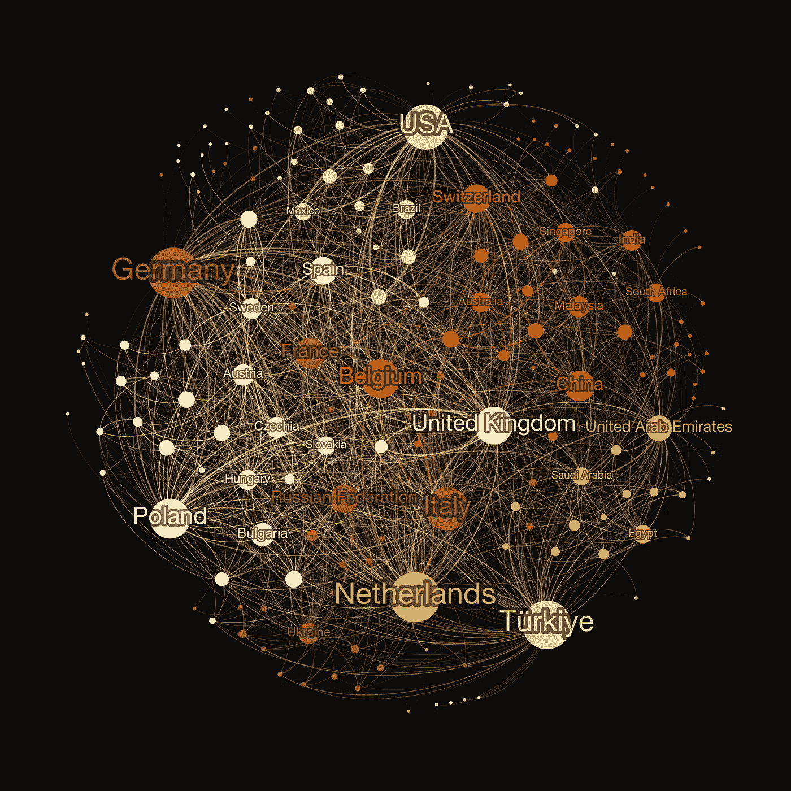

全球巧克力贸易网络

## 使用网络分析来探索联合国 Comtrade 的国际贸易数据

[](https://medium.com/@janosovm?source=post_page-----6478adeb8ead--------------------------------)[](https://towardsdatascience.com/?source=post_page-----6478adeb8ead--------------------------------) [米兰·贾诺索夫](https://medium.com/@janosovm?source=post_page-----6478adeb8ead--------------------------------)

·发布于 [数据科学之路](https://towardsdatascience.com/?source=post_page-----6478adeb8ead--------------------------------) ·阅读时长 9 分钟·2023 年 11 月 24 日

--

在这篇文章中，我通过关注“巧克力及其他含可可的食品制品”贸易类别，探索联合国 Comtrade 国际贸易数据库。虽然这种特定的关注使我的文章在一个字面上的小众市场上具有明确方向，但分析步骤和方法层次是通用的。因此，基于这些步骤，可以快速分析从能源到武器的任何国际贸易关系。当结合贸易的时空维度，并可以选择通过例如及时的政治事件、国际冲突等信息进行增强时，也可以轻松将这些事件与其宏观经济影响关联起来。虽然国际贸易数据分析的影响深远，但现在让我们使用网络和探索性数据科学来深入了解主要出口国及其巧克力贸易关系。

*在本文中，所有图片——如果标题中没有另行说明——均由作者创建。*

# 1. 数据收集

一旦我登录到[Comtrade](https://comtradeplus.un.org/TradeFlow)网站，我进入了其 TradeFlow 界面——这是一个很好的在线平台，我可以轻松地构建查询以获取任何类型的国际贸易数据。

在那个界面中，可以自由选择出口方、交易商品、时间段以及一些其他交易特征。对于本文，我选择了标记为 HS1806 的项目组（“巧克力及其他含可可的食品制品”），使用所谓的[协调制度](https://www.flexport.com/data/hs-code/1806-chocolate-and-other-food-preparations-containing-cocoa/)。此外，我只关注出口商品，在所有可能的报告者（出口方）和合作伙伴（接收方）之间，选择了过去 20 年的时间范围。注意：一个查询最多可以覆盖 12 年，因此我运行了两个查询，每个查询覆盖 10 年。查询完成后，基于网络的平台会自动下载生成的.csv 文件。

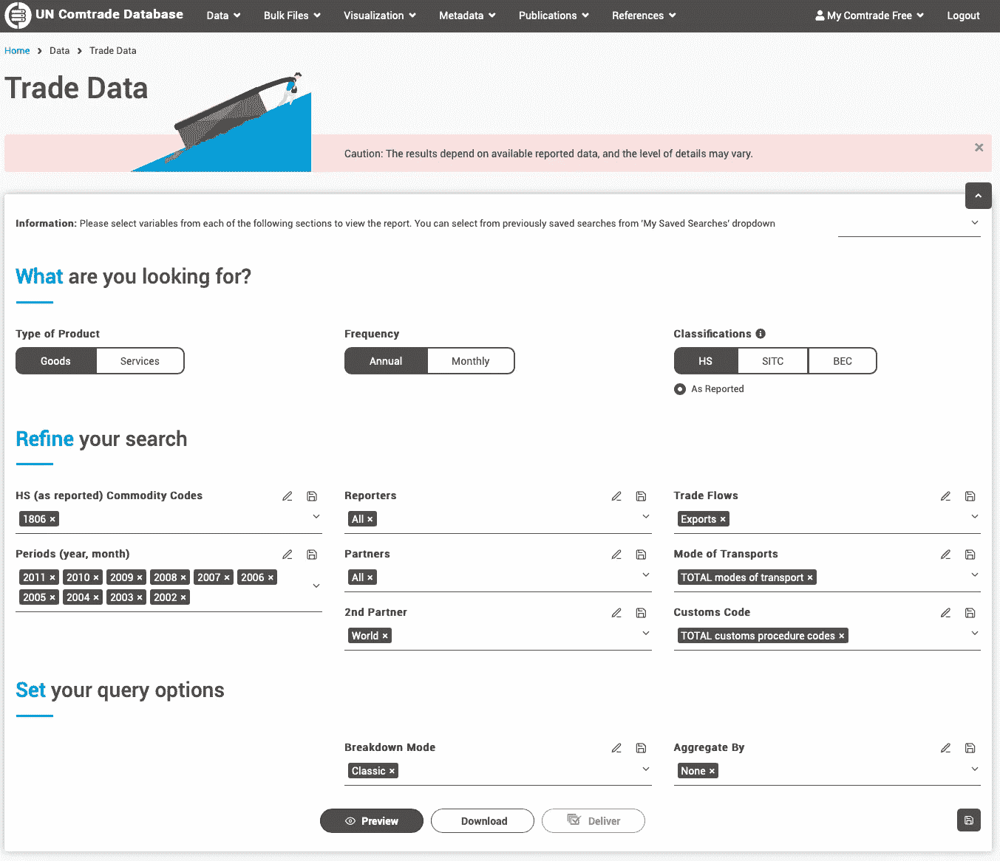

从 Comtrade 查询数据的截图 — [`comtradeplus.un.org/TradeFlow`](https://comtradeplus.un.org/TradeFlow)。

# 2\. 探索数据

下载了两个时间段的两个.csv 文件后，我开始对其进行探索。首先，我将两个文件合并为一个 Pandas 数据框，然后探索其特征：

```py
df1 = pd.read_csv('chocolate_trade_2012_2022.csv', encoding='iso-8859-1')
df2 = pd.read_csv('chocolate_trade_2002_2012.csv', encoding='iso-8859-1')

df = df1.append(df2)
print(len(df))
df.head(5)
```

此单元格的输出：

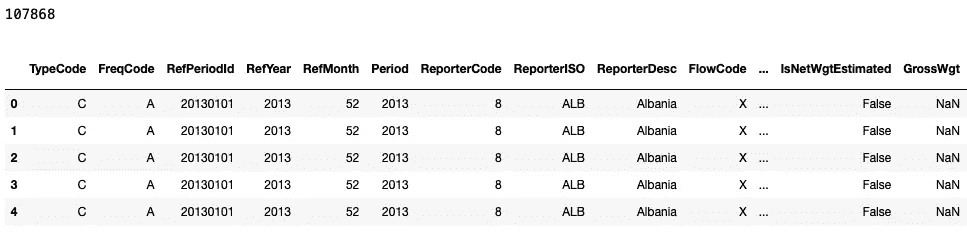

贸易数据的大小和样本。

所以，看起来合并后的数据框有超过 10 万条记录！这数据量相当大。让我们看看每条记录的特征：

```py
print(df.keys())
```

此单元格的输出：

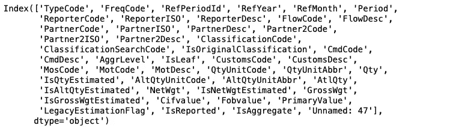

贸易数据的不同特征。

如此单元格所示，这个电子表格中确实有很多列——准确来说是 48 列。然而，为了揭示巧克力交易背后的主要模式，我将只关注其中的几个。

具体来说，关于发送和接收方，哪些国家的英文名称存储在*ReporterDesc*和*PartnerDesc*列中。我还添加了有关交易商品的质量和数量的信息——*PrimaryValue*包含交易的总现金价值，而*GrossWgt*则是运输糖果的总质量。最后，我还保留了一些时间信息——特别是*RefYear*——显示交易发生的年份。

然后，我通过仅保留选定的列并删除那些不对应任何实际交易的记录，创建了原始数据框的清理版本。

注意：查看缺失值时发现，很多交易记录有*PrimaryValue*字段，但*GrossWgt*实际上缺失。这是数据质量问题，因此我在遵循后续过滤步骤时非常小心。

```py
# compute the number of missing values
features_to_kep = ['PartnerDesc', 'ReporterDesc',  'PrimaryValue', 'GrossWgt', 'RefYear']

print('Get the fraction of missing values:')
for feat in features_to_kep:
    print(feat,round((len(df)- len(df.dropna(subset = [feat])))/len(df),3))
```

此代码块的输出：

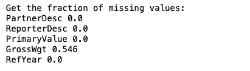

每个特征的缺失值比例。

所以，看来大约一半的交易记录缺少*GrossWgt*信息——然而，它们仍然有价格标签！

```py
# filter the data
print(len(df))
df = df[['PartnerDesc', 'ReporterDesc',  'PrimaryValue', 'GrossWgt', 'RefYear']]
df2 = df.dropna(subset = ['PrimaryValue'])
df2 = df2[df2.PrimaryValue>0]
df2 = df2[df2.ReporterDesc != 'World']
df2 = df2[df2.PartnerDesc != 'World']
print(len(df2))
df2.head(3)
```

此单元格的输出：

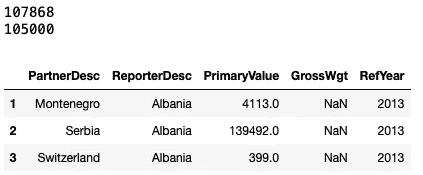

清理后的数据框。

过滤仅减少了数据量的几个百分点，这意味着非常少的国家错过了巧克力出口。似乎很直观！

现在创建一个简单的分布图，查看这些连续值的情况：

```py
import matplotlib.pyplot as plt

# this function does some nice formatting on the axis and labels
def format_axis(ax):   
    for pos in ['right', 'top']:   ax.spines[pos].set_edgecolor('w')    
    for pos in ['bottom', 'left']: ax.spines[pos].set_edgecolor('k')         
    ax.tick_params(axis='x', length=6, width=2, colors='k')
    ax.tick_params(axis='y', length=6, width=2, colors='k') 
    for tick in ax.xaxis.get_major_ticks():  tick.label.set_fontsize(12) 
    for tick in ax.yaxis.get_major_ticks():  tick.label.set_fontsize(12)

f, ax = plt.subplots(1,4,figsize=(15,4))

ax[0].hist(df2['PrimaryValue'], bins = 20)
ax[1].hist(df2['GrossWgt'], bins = 20)
ax[2].hist(df2['RefYear'], bins = 8)
ax[3].scatter(df2['PrimaryValue'], df2['GrossWgt'], alpha = 0.1)

ax[0].set_ylabel('Number of records', fontsize = 14)
ax[0].set_xlabel('PrimaryValue', fontsize = 14)
ax[1].set_xlabel('GrossWgt', fontsize = 14)
ax[2].set_xlabel('RefYear', fontsize = 14)
ax[3].set_ylabel('PrimaryValue', fontsize = 14)
ax[3].set_xlabel('GrossWgt', fontsize = 14)

ax[0].set_yscale('log')
ax[1].set_yscale('log')

ax[3].set_yscale('log')
ax[3].set_xscale('log')

for aax in ax: format_axis(aax)

plt.tight_layout()
```

输出：

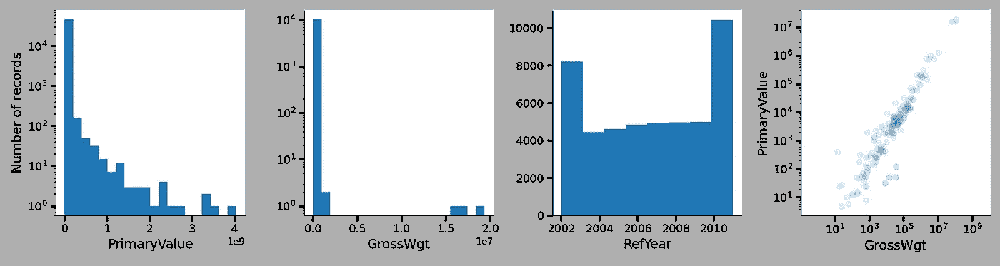

贸易特征的分布图。

前两幅图展示了交易现金价值和总重量的对数刻度分布，每幅图都显示出相对不令人惊讶的幂律趋势，即许多小规模交易和少量极大的交易。

接下来是时间演变——每年的交易数量以及一个散点图，显示了可可产品的总重量和价格之间的高相关性——交易量越大，价格也越高。

现在，让我们看看极端情况——过去二十年哪些国家是主要供应商：

```py
df2.groupby(by = 'ReporterDesc').sum().sort_values(by = 'PrimaryValue', ascending = False)[['PrimaryValue']].head(10)
```

这个代码块的结果是主要出口国家的表格：

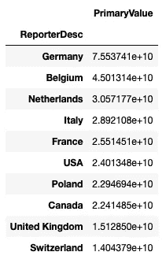

主要出口国。

由于贸易值以当前[美元价值](https://unstats.un.org/wiki/display/comtrade/Calculation+of+dollar+value+in+trade+statistics+-+Current+value+or+constant+dollar+value)储存，我在 20 年的时间窗口内对其进行了汇总，从而得出这个排行榜。根据全球巧克力品牌，我有点放心看到德国、比利时和瑞士位列前茅，而美国则可能由于市场规模庞大而跻身前十。

现在换个角度看看谁是可可产品的最大客户：

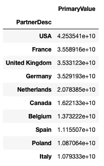

主要进口国。

# 3\. 国家排名

在看到汇总的 20 年十大之后，让我们看看国家排名如何演变以及市场如何随时间变化：

```py
# get the list of overall top 10 countries
top10 = df2.groupby(by = 'ReporterDesc').sum().sort_values(by = 'PrimaryValue', ascending = False)[['PrimaryValue']].head(10).index.to_list()
top10_ranks = {t : [] for t in top10}

# store the latest order here for the visualization
top10_latest = {}

# for each year, create a ranking, and store them in a dictionary of lists
# where each key is a country
for year in range(2002, 2023):

    df2_year = df2[df2.RefYear==year]
    df2_year = df2_year.groupby(by = 'ReporterDesc').sum().sort_values(by = 'PrimaryValue', ascending = False)[['PrimaryValue']]

    df2_year['rank'] = [1 + i for i in range(len(df2_year))]

    for c, r in df2_year.to_dict()['rank'].items():
        if c in top10_ranks:
            top10_ranks[c].append((year, r))
            if year == 2022:
                top10_latest[c] = r

top10_latest = [c for c, r in sorted([(c, r) for c, r in top10_latest.items()], key=lambda x: x[1])]            
top10_ranks 
```

这个代码块的输出：

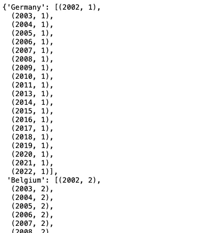

国家在全球可可产品出口中的年度排名（样本）。

现在，展示这个排名是如何演变的，并查看过去二十年整体前十国家的位置。

```py
f, ax = plt.subplots(1,1,figsize=(15,5))

for country in top10_latest:

    ranks = top10_ranks[country]    
    y, r = zip(*ranks)
    ax.plot(y, r, 'o-', label = country, linewidth = 2)

format_axis(ax)
ax.set_ylim([13.5,0.5])
ax.set_xlim([2001,2023])
ax.legend(loc=(1.00, 0.14), frameon = False, handletextpad=.5, fontsize = 16)
ax.set_xlabel('Year', fontsize = 20)
ax.set_ylabel('Annual rank', fontsize = 20)
```

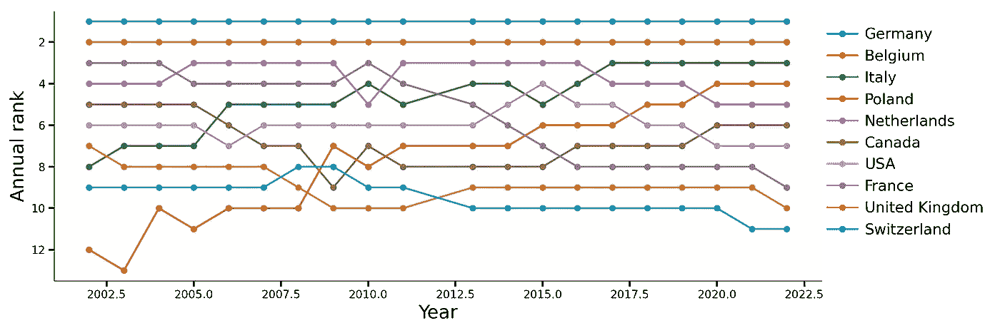

主要可可产品出口国的年度排名演变。

图表告诉我们，德国和比利时的主导地位从未被质疑。荷兰紧随其后，但意大利自 2022 年起缓慢上升，最终获得第三位，此后又缓慢下滑至第 5 位。

极端情况下，法国似乎经历了最大的下降，从第 3 位降至第 9 位，而波兰则从第 13 位上升，2022 年跃升至第 4 位！

# 4\. 贸易网络

贸易是网络行为的经典例子——通过商品、服务和现金交易连接的行为者。因此，我探索性分析的自然下一步是构建国家的贸易网络。为此，我将依赖名为[NetworkX](https://networkx.org)的包。

这将是一个定向网络，其中每个源节点是一个出口国，而目标节点是每笔交易的最终站点。此外，每个连接的权重基于过去 20 年中每两个国家之间的总贸易美元价值。

此外，我创建了一个名为“Weight”的列，它是*PrimaryValue*的归一化对数。

```py
import networkx as nx
import math

df2['Weight'] = [math.log(v) for v in df2.PrimaryValue.to_list()]

G = nx.from_pandas_edgelist(df2, source='ReporterDesc', target='PartnerDesc', edge_attr= 'Weight', create_using = nx.DiGraph)
G.number_of_nodes(), G.number_of_edges()
```

这个网络首先结果为 245 个节点和 11741 条链接，因此我重新生成它，但过滤掉每个小于最大交易额 1%的交易！

```py
top_value = max(df2.PrimaryValue)
df3 = df2[df2.PrimaryValue>top_value*0.001]

G = nx.from_pandas_edgelist(df3, source='ReporterDesc', target='PartnerDesc', edge_attr= 'Weight', create_using = nx.DiGraph)
G.number_of_nodes(), G.number_of_edges()

G = nx.from_pandas_edgelist(df3, source='ReporterDesc', target='PartnerDesc', edge_attr= 'Weight', create_using = nx.DiGraph)
G.number_of_nodes(), G.number_of_edges()
```

根据此单元格的输出，这个过滤后的图有 51 个节点和 123 条连接它们的链接！让我们将其导出为 Gephi 文件格式，并在[Gephi](https://gephi.org)中应用力导向布局，设置节点大小与显著贸易伙伴（过滤网络中的度）成比例，并根据连接方之间的总交易值调整链接宽度。此外，我根据网络社区对节点进行着色。

最终可视化效果：


[含可可的巧克力及其他食品制品](https://www.flexport.com/data/hs-code/1806-chocolate-and-other-food-preparations-containing-cocoa/)的国际贸易网络。

对最终网络的一些进一步思考，如下方所示，其中标记了 30 个最高度节点。正如着色所示，共有五个社区——整个贸易网络中更加密集的子图，揭示了一些相当意外的非正式贸易联盟，例如，以新兴明星波兰为中心的一个。德国、法国和意大利似乎建立了自己的贸易轴线，而荷兰与阿联酋属于同一社区。有趣的是，比利时似乎是与亚洲、印度和澳大利亚强关联的最大节点。

# 结论

在我看来，Comtrade 是分析国际贸易各个方面和维度的一个充满活力的来源，包括基于体积和时间的统计数据以及网络关系。虽然本文集中于基础知识，并旨在提供贸易数据分析的起点，但这些数据也可以用来研究宏观经济现象，例如国际冲突、制裁、新法规、变化以及不同行业领域的新趋势的影响。
