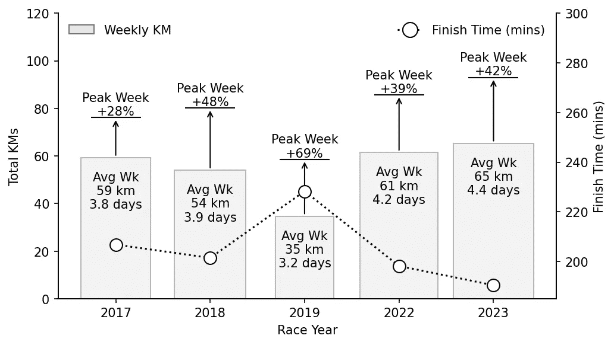
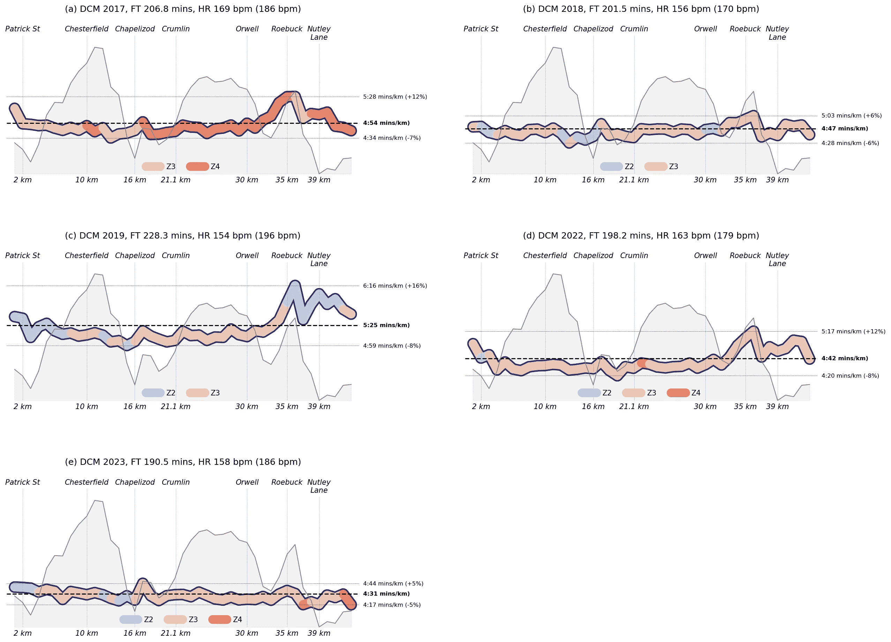
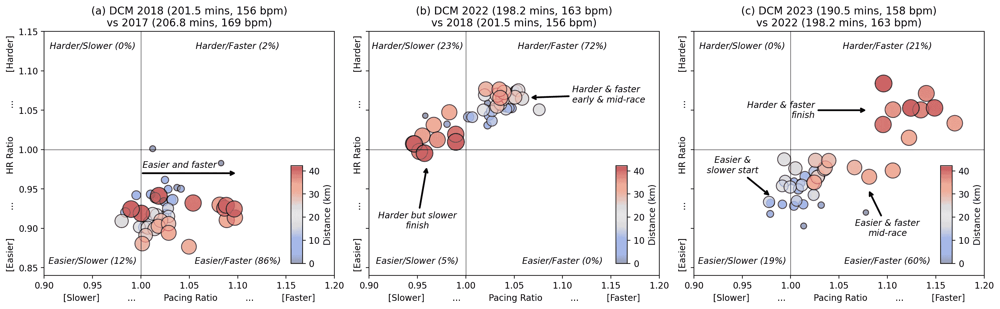
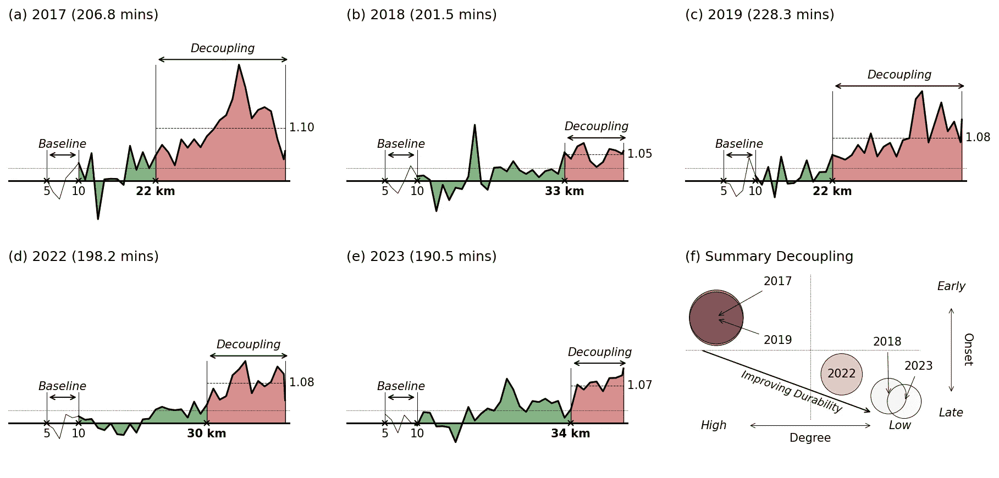

# 佩速、努力和耐力

> 原文：[`towardsdatascience.com/pacing-effort-and-stamina-6b340ab53650`](https://towardsdatascience.com/pacing-effort-and-stamina-6b340ab53650)

## 对最近都柏林城市马拉松比赛的技术分析

 [barrysmyth](https://barrysmyth.medium.com/?source=post_page-----6b340ab53650--------------------------------)

·发表于[Towards Data Science](https://towardsdatascience.com/?source=post_page-----6b340ab53650--------------------------------) ·12 分钟阅读·2023 年 11 月 29 日

--

*在我们开始之前，我想把这篇文章定位为几篇最近文章中的一篇，这些文章位于数据科学与马拉松跑步的交汇处。在之前的文章中，我集中讨论了几个与* *马拉松训练可视化* *和* *表现数据**相关的技术挑战。这里我将重点转向分析（我自己的）最近的马拉松表现，使用一些之前讨论过的可视化技术以及来自运动科学领域的几个表现指标。因此，本文提供了一个具体的例子，展示了如何使用（跑步）速度和努力等相对简单的概念来探索更复杂的现代生理测量指标，如恢复力和耐力，从而更好地理解马拉松表现。同时，值得注意的是，类似的想法在许多其他耐力领域如骑行、铁人三项、滑冰等也被证明是相关的。*

我在生活中晚些时候才开始跑步。我是在 40 多岁时开始的。我已经能够完成 8 次都柏林城市马拉松（DCM）——从 2013 年开始——而且在变老的过程中，我很幸运地取得了几次新的*个人最佳*（*PBs*）。我今年（2023 年）最近的努力是在一个凉爽、潮湿的十月底早晨取得了一个[新 PB](https://medium.com/running-with-data/my-irish-life-dublin-marathon-b83969278b73)。我在略超过 3 小时 10 分钟的时间内跑过终点，比我之前的最好成绩（2022 年）快了 7 分钟多。

作为一名数据科学家，我对从我的比赛经验中学习非常感兴趣，今年我的个人最佳成绩（PB）的规模令人惊讶和迷人。我觉得小的 PB 可能在计划之中——如果条件良好——但我设定的最佳目标是 3 小时 15 分钟，而 3 小时 10 分钟并未出现在我的计划中。这一表现仅仅是因为更加努力和更快地跑了吗？还是其他因素在起作用？我的配速和努力程度与之前的比赛和 PB 相比如何？

在这篇文章中，我将考虑几场最近的比赛，探讨我的*努力（心率，每分钟跳动次数）*和*速度（或*配速，分钟/公里）*之间的相互关系，以及一种更为近期的耐力指标[*耐久性 [1]*，这是一个新兴的生理适应能力测量指标](https://www.youtube.com/watch?v=SZ2Ov5vAtA4)，有点类似于我们所认为的*耐力*。虽然每次新的 PB 都是因为跑得更快（平均而言），但我的近期 PB 也与较低的努力程度相关。我是否跑得过于保守，还是早期的 PB 跑得过于激进？这就是耐久性分析发挥作用的地方，因为它观察速度和努力之间不断演变的关系。

# 4 个个人最佳成绩和一个跟腱伤情

在本次分析中，我将考虑自 2017 年以来的 5 届都柏林马拉松；2020 年和 2021 年因疫情取消。我在大多数比赛中身体健康良好，除了 2019 年，那时跟腱受伤阻碍了我的正常训练。2022 年比较特殊，因为我的目标比赛是伦敦马拉松——在当年都柏林马拉松前仅 4 周——因此我的训练虽然很好，但并不一定针对都柏林进行了优化。然而，我在都柏林跑得更快了。真是让人摸不着头脑！

在 2017 年至 2022 年的比赛中，我使用了差不多相同的训练计划——这是我多年前在网上找到的——根据我的完成时间的改善调整了配速。在这些年里，我主要是自己训练，偶尔与朋友一起跑步。我在 2023 年春季加入了 Kilcoole Athletics Club（[KAC](http://kilcooleac.com)）——这是我做出的最佳决定！——并最终按照俱乐部的官方计划进行训练，与最棒的一群马拉松跑者一起定期训练。

尽管训练不是本文的重点——希望将来能有所展现——以下是每次比赛前 16 周训练的总结。通常，我每周跑 4-5 天（55-60 公里），在目标马拉松前有 3-4 次长跑（≥30 公里），除了 2019 年，那时我的跟腱疼痛影响了训练并限制了长跑。今年，我记录了适度的训练量增加（每周 65 公里，峰值超过 90 公里），加上一些更为艰苦的长跑训练。

我的过去五届都柏林马拉松训练总结，显示了每周平均训练量/频率、每周最大训练量和最终完成时间。

# 配速与努力

分析我最近的马拉松比赛的一个简单方法是考虑在不同比赛阶段的配速（分钟/公里）和努力（心率）。我使用了[Strava API](https://developers.strava.com)来[下载](https://medium.com/towards-data-science/improving-the-strava-training-log-4d2039c49ec4)我的比赛活动，包括每 1 公里段的平均配速和心率数据。为了简化，我使用了 Strava 的[心率区域](https://support.strava.com/hc/en-us/articles/216917077-Heart-Rate-Zones)而不是我实际的心率值；Strava 使用五个心率区域（Z1, …, Z5），基于最大心率的不同百分比。

下面的图表显示了我每公里段的平均配速（*y 轴*），以及比赛阶段（*x 轴*）。每个‘[*热图线*](https://medium.com/towards-data-science/how-to-create-a-heat-line-plot-82f8038d1659)’的颜色编码反映了对应比赛段的心率区域。为了参考，还显示了都柏林马拉松的海拔轮廓，背景中突出显示了几个标志性位置。每个图表上标注了我的平均比赛配速（虚线，加粗文本），以及比赛段的最大（最慢）和最小（最快）配速。

都柏林马拉松每 1 公里段的配速和心率区域，以及都柏林马拉松的海拔轮廓。

有几个观察点值得注意：

+   我的 2017 年比赛（a）涉及了最大的努力（平均心率 169 bpm），且这场比赛中相当一部分时间在 Z4 区域完成，这不是马拉松比赛中想要待的地方，至少不能待太久。

+   我的训练中断在 2019 年（c）中表现得很明显。那一年我比较轻松（因为我不得不这样做，因此经常在 Z2 区域跑步），但在多山的 Roebuck 段我减速（>6 分钟/公里），并且在随后的下坡和平坦段中未能恢复努力。

+   2018 年（b）和特别是 2023 年（e），从配速/努力的角度来看，是执行得非常好的比赛例子。这两场比赛的特点是 Z2 区域跑步量适中，特别是在早期多山的阶段，且下半场几乎没有减速。2023 年的最后一段 Roebuck Hill 几乎没有对我的比赛产生影响。

+   尽管 2022 年我的时间是第二快的，但我的配速和努力不如 2018 年或 2023 年“组织得好”。前半段几乎都是 Z3 区域跑步，并且在最后 10 公里时我的配速开始恶化。尽管如此，我还是在 2022 年创下了个人最佳。

因此，通过仔细管理我的配速和努力，我能够在 2018 年（约 5 分钟个人最佳）和 2023 年（约 7 分钟个人最佳）创造出两个非常强劲的个人最佳。相比之下，我在 2017 年和 2022 年的个人最佳是经过艰苦努力取得的，且比赛后期明显减速。

# 连续个人最佳比较

下面的散点图提供了连续个人最佳成绩对比（2017 年与 2018 年，2018 年与 2022 年，2022 年与 2023 年）的更直接比较。每个点指的是比赛中的一个 1 公里赛段。点的大小和颜色表示赛段的公里数：早期赛段较小且较蓝，后期赛段较大且较红。每个点的位置基于该公里在*更近期*个人最佳成绩中的配速和努力（实际心率），与*之前*的个人最佳成绩相比。

例如，（a）比较了 2018 年与 2017 年。在 2018 年，只有一个公里跑得比 2017 年更努力且更快。对于我 2018 年的其余比赛，我跑得更轻松，通常也更快。

比较连续个人最佳成绩在努力（心率）和速度（配速）方面的差异。每个标记对应于马拉松中的一个特定 1 公里赛段，并根据更近期的个人最佳是否跑得更努力/轻松以及更快/更慢进行定位。早期赛段用较小的（蓝色）标记表示。后期赛段用较大的（红色）标记表示。

第二个散点图（b，2022 年与 2018 年）讲述了一个完全不同的故事。我在 2022 年的比赛大部分时间以比 2018 年更大的努力跑完，2022 年的 72%赛段也跑得更快，特别是在比赛的早期和中期。然而，2022 年后期的表现却不尽如人意。尽管我在跑得更努力，但它们比 2018 年慢，且大部分发生在比赛的后期。这突显了 2022 年艰难的最后 10 公里。较慢但更努力！尽管如此，还是创下了新的个人最佳！

今年情况有所改善（c）。我今年有 19%的比赛赛段跑得比 2022 年慢，主要是在早期阶段，但总是以较轻松的努力跑完。我的中期赛段也以比 2022 年少的努力完成，但速度也更快。而最大的进步是我能够比 2022 年更强烈地完成 2023 年。最后的 9 公里比 2022 年快了 10-15%。我需要更大的努力来实现这一点——这些最后赛段的平均心率比之前高约 1-8%——但我能够在比赛的晚期阶段提高努力程度，这是我之前几年无法做到的。

努力与节奏之间存在强烈的互动。这并不令人惊讶，但也使分析变得更加困难。拥有一个单一的衡量标准来指责比赛表现的因素总是有用的，这就是*耐力*可能发挥帮助作用的地方。

# 从生理韧性到耐力

耐力运动表现与三个重要生理特征密切相关——[*VO2max*、*跑步经济性* 和 *VO2max 的分数利用率*](https://www.ncbi.nlm.nih.gov/pmc/articles/PMC4388468/)2——但标准[模型](https://pubmed.ncbi.nlm.nih.gov/2022559/) [3]在很大程度上忽视了这些因素在长期运动中可能恶化的情况。这导致该领域的一位领先研究者，[安迪·琼斯教授](https://sshs.exeter.ac.uk/staff/profile/index.php?web_id=Andrew_Jones)——曾与保拉·拉德克利夫和埃利德·基普乔格等人合作——提出了[*生理学* *韧性* 作为耐力运动表现的重要第四维度](https://pubmed.ncbi.nlm.nih.gov/37606604/) [4]，这可能有助于将最佳选手（如基普乔格）与其他具有类似 VO2 和跑步经济性特征的运动员区分开来。

生理韧性的一个实际测量是所谓的[*耐久性*](https://pubmed.ncbi.nlm.nih.gov/33886100/)*。它基于跑者内部和外部工作负荷的比率。简而言之，可以使用跑者的心率作为*内部* 工作负荷的测量，而他们的速度（米/秒）可以用作*外部* 工作负荷的测量。然后，通过将跑者的心率除以当前速度来计算*内部-外部比率*（*IER*）。当跑者的心率增加而速度减少时，他们达到了耐久性极限。当这种情况持续发生时，跑者的 IER 将会增加，因为跑者的心率与其速度发生*解耦*。这种解耦表明跑者已经超出了当前的耐久性阈值。

一种用于[分析马拉松环境下耐久性的协议](https://pubmed.ncbi.nlm.nih.gov/35511416/) [5]涉及将跑者的*基线 IER（bIER）*定义为马拉松 5–10 公里段的平均 IER。选择这个区段是为了确保跑者有时间“*适应*”比赛。然后，可以通过将跑者该段的 IER 除以 bIER 来计算跑者的*相对 IER（rIER）*。当***rIER >1.025*** *在比赛剩余时间内* 时，称为解耦发生。

下面的图表（a-e）展示了我最近马拉松每公里的 rIER。绿色区域表示尚未发生解耦。解耦（红色区域）仅在 rIER>1.025 并在比赛剩余时间内保持这种状态时才会发生。注意到有几个短暂的区域，绿色区域超过了允许的 rIER 阈值，但由于这些峰值是暂时的（通常是由于上坡或水站减速），它们不被归类为解耦的开始。

每个马拉松的相对内部-外部工作负荷比（a）—（e）显示了何时发生解耦以及解耦发生后的程度（红色）。在（f）中，（a）—（e）中的比赛解耦特征的总结表明，解耦时间的延迟导致耐力的提升。

这些图示显示了我的耐力在多年的变化情况。在 2017 年，我在半程（22 公里）后解耦，且程度非常显著（平均 rIER 为 1.10，相当于*中等*程度的解耦）。这与 2019 年我因伤病干扰的耐力类似。我的耐力在 2018 年、2022 年和 2023 年的个人最佳成绩中显著提升。比赛中的解耦发生在更晚（≥30 公里），且解耦后的平均 rIER 要温和得多（在 1.05 到 1.08 之间，表示*低*程度的解耦）。

（f）中的散点图总结了这些结果。每场比赛通过位于 xy 轴上的一个点来表示，该点基于解耦的累计程度（解耦后的总 rIER）和解耦的发生时间。2017 年和 2019 年是早期解耦的例子，累计解耦程度明显高于 2018 年、2022 年和 2023 年中的晚期解耦。

新兴的趋势应该很明显。它指向了我最近的、经过良好训练的比赛中的解耦时间越来越晚，因此解耦的程度更低。究竟这是由于更好的训练、更好的比赛配速，还是两者兼有，仍然是一个悬而未决的问题。[一个尚未解答的问题](https://www.ncbi.nlm.nih.gov/pmc/articles/PMC9388405/)是耐力特征是否对训练适应有敏感性，但某些训练方法可能能够减少经过良好训练的跑者的解耦现象。

# 结论

本文旨在提供对我最近几场都柏林马拉松比赛的相对深入的数据分析。很容易得出结论认为更快的比赛就是更好的比赛，但这并不能讲述完整的故事。我们在这里考虑了配速和努力（以心率为标准），显然控制自己的努力至少与坚持目标配速同样重要，以实现个人最佳成绩。一般来说，我控制较好的努力（2018 年和 2023 年）都代表了新的强劲个人最佳时间，并且在比赛后期几乎没有通常配速下降的证据。

我们还考察了一个相对较新的表现指标——耐力，作为我们生理弹性的替代指标，以便更好地理解配速与努力之间的相互作用。当然，我最近的个人最佳成绩与耐力的显著提升有关。当然，这些都忽略了训练的影响，而训练在我们的体能水平和比赛准备中扮演了重要角色。我们会在适当的时候进一步探讨这点……

尽管本文重点讨论了马拉松跑步，但所提出的观点在其他耐力领域同样适用。关于将诸如耐久性等概念应用于骑行[6]和[铁人三项](https://scientifictriathlon.com/tts295/)等多种耐力运动的[相关研究](https://www.wattkg.com/science-of-durability/)正在不断增加。因此，这里提出的观点对于处理各种耐力领域的人体表现数据的数据科学家来说，应该更具普遍意义。

# **参考文献**

上述文本中直接链接的科学文章在此详细列出，以确保完整性。

1.  Maunder E, Seiler S, Mildenhall MJ, Kilding AE, Plews DJ. 在耐力运动员的生理学分析中，“耐久性”的重要性。体育医学。2021 年 8 月；51(8)：1619–1628。doi: 10.1007/s40279–021–01459–0。2021 年 4 月 22 日在线发表。PMID: 33886100。

1.  Shaw AJ, Ingham SA, Atkinson G, Folland JP. 跑步经济性与最大氧摄取量的相关性：在高度训练的长跑运动员中的横断面和纵向关系。PLoS One。2015 年 4 月 7 日；10(4)：e0123101。doi: 10.1371/journal.pone.0123101。PMID: 25849090；PMCID: PMC4388468。

1.  Joyner MJ. 建模：基于生理因素的最佳马拉松表现。应用生理学杂志（1985）。1991 年 2 月；70(2)：683–7。doi: 10.1152/jappl.1991.70.2.683。PMID: 2022559。

1.  Jones AM. 第四维度：生理韧性作为耐力运动表现的独立决定因素。生理学杂志。2023 年 8 月 22 日。doi: 10.1113/JP284205。在线发表。PMID: 37606604。

1.  Smyth B, Maunder E, Meyler S, Hunter B, Muniz-Pumares D. 在马拉松期间内部与外部工作负荷的解耦：对 82,303 名业余跑者耐力的分析。体育医学。2022 年 9 月；52(9)：2283–2295。doi: 10.1007/s40279–022–01680–5。2022 年 5 月 5 日在线发表。PMID: 35511416；PMCID: PMC9388405。

1.  Valenzuela PL, Alejo LB, Ozcoidi LM, Lucia A, Santalla A, Barranco-Gil D. 职业自行车运动员的耐久性：一项实地研究。国际体育生理表现杂志。2022 年 12 月 15 日；18(1)：99–103。doi: 10.1123/ijspp.2022–0202。PMID: 36521188。

有兴趣的读者可以在这里和[这里](https://medium.com/p/82f8038d1659)以及我最近在都柏林马拉松的冒险经历[这里](https://medium.com/p/b83969278b73)找到有关使用 Strava 数据和本文中使用的一些可视化的信息。

我定期撰写各种主题的文章，特别是在数据科学/机器学习与马拉松跑步的交汇处，文章发布在[Running with Data](https://medium.com/running-with-data)和[Towards Data Science](https://towardsdatascience.com)。

所有图像和图表均由作者制作。
