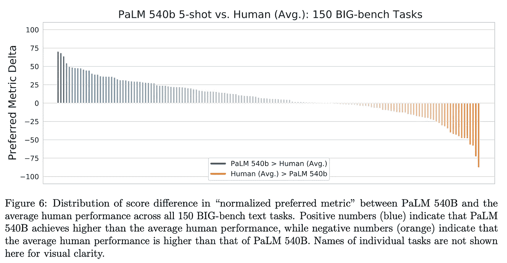

# PaLM：高效训练大型语言模型

> 原文：[`towardsdatascience.com/palm-efficiently-training-massive-language-models-b82d6cc1582`](https://towardsdatascience.com/palm-efficiently-training-massive-language-models-b82d6cc1582)

## 史无前例的 LLM 规模、效率和性能

 [Cameron R. Wolfe, Ph.D.](https://wolfecameron.medium.com/?source=post_page-----b82d6cc1582--------------------------------)

·发表于[Towards Data Science](https://towardsdatascience.com/?source=post_page-----b82d6cc1582--------------------------------) ·阅读时间 17 分钟·2023 年 6 月 19 日

--

(照片由[Corey Agopian](https://unsplash.com/@corey_lyfe?utm_source=unsplash&utm_medium=referral&utm_content=creditCopyText)提供，来自[Unsplash](https://unsplash.com/images/nature/palm-tree?utm_source=unsplash&utm_medium=referral&utm_content=creditCopyText))

近年来，大型深度神经网络已成为解决大多数语言理解和生成任务的**终极架构**。最初，提出了诸如[BERT](https://cameronrwolfe.substack.com/p/language-understanding-with-bert) [2]和 T5 [3]的模型，这些模型使用了[两阶段训练方法](https://cameronrwolfe.substack.com/i/76273144/training-bert)，即在大规模文本语料库上进行预训练（使用[自监督“填充”目标](https://cameronrwolfe.substack.com/i/76273144/self-supervised-learning)），然后在目标数据集上进行微调；见下文。尽管这些技术很有用，但对大型语言模型（LLMs）的最新研究表明，大型自回归（仅解码器）变换器模型在少样本学习中表现出色，能够以最小的适应性在下游任务中取得令人印象深刻的性能。

(来自[4])

LLM 的少样本学习能力最初由[GPT-3](https://cameronrwolfe.substack.com/p/language-model-scaling-laws-and-gpt) [4]展示，这是一种拥有 1750 亿参数的 LLM。为了进行少样本预测，该模型在一个庞大的文本语料库上进行预训练（使用基本的[语言建模目标](https://cameronrwolfe.substack.com/i/85568430/language-modeling)），然后提供任务描述和若干个任务解决示例；见上文。对 LLM 的进一步分析表明，模型性能随着规模的增加而平滑提升（根据[幂律](https://cameronrwolfe.substack.com/i/88082618/power-laws)）[5, 6]。因此，在 GPT-3 之后提出了各种 LLM，试图通过“扩大”模型和训练来提高结果，通常通过更大的模型和更多/更好的预训练数据组合来实现改进。

训练更大的 LLM 是有益的，但要高效地做到这一点却非常困难。通常，我们将训练分布到许多机器上，每台机器配备多个加速器（即 GPU 或[TPUs](https://cloud.google.com/tpu/docs/tpus)）。这一方法以前已成功实施（例如，MT-NLG 在一个拥有 2240 个 A100 GPU 的系统上训练了一个 5300 亿参数的 LLM），但结果并不特别令人印象深刻。尽管模型很大，但训练的数据量不足。然而，鉴于更高的训练吞吐量，我们可以（理论上）在更大的数据集上更广泛地预训练这样的巨大模型，从而获得更好的结果。

在本概述中，我们将探讨**Pathways 语言模型（PaLM）**，这是一种拥有 5400 亿参数的 LLM，使用 Google 的[Pathways](https://blog.google/technology/ai/introducing-pathways-next-generation-ai-architecture/)框架进行训练。通过消除[管道并行性](https://cameronrwolfe.substack.com/i/88082618/other-useful-details)，这一架构实现了令人印象深刻的训练吞吐量，使得 PaLM 能够在更广泛的数据集上进行预训练。最终模型的少样本性能处于行业领先水平。此外，PaLM 在解决复杂推理任务方面也有一定能力。简单来说，PaLM 清楚地提醒我们，LLM 的性能在规模上尚未达到瓶颈。只要有足够高效的训练基础设施来支持在更多数据上预训练更大的模型，我们仍将继续看到性能的提升。

（来源于 [1, 16]）

# 背景

我们在本新闻通讯中广泛探讨了语言建模主题，并在之前的帖子中回顾了几种显著的（大规模）语言模型：

+   GPT 和 GPT-2 [[链接](https://cameronrwolfe.substack.com/p/language-models-gpt-and-gpt-2)]

+   规模定律和 GPT-3 [[链接](https://cameronrwolfe.substack.com/p/language-model-scaling-laws-and-gpt#%C2%A7other-useful-details)]

+   现代 LLMs [[链接](https://cameronrwolfe.substack.com/p/modern-llms-mt-nlg-chinchilla-gopher)]

+   专业化 LLM [[link](https://cameronrwolfe.substack.com/p/specialized-llms-chatgpt-lamda-galactica)]

尽管如此，我们将在这里简要回顾有关 LLM 的先前工作，以提供理解 PaLM 的重要背景。

## 语言建模回顾

仅解码器转换器架构

现代语言模型仅仅是 [仅解码器转换器模型](https://cameronrwolfe.substack.com/i/85568430/decoder-only-transformers)（如上图所示），这些模型通过自监督 [语言建模目标](https://cameronrwolfe.substack.com/i/85568430/language-modeling) 在无标签文本上进行预训练。该目标对文本序列进行采样，并训练语言模型准确预测下一个词/标记。在进行广泛的预训练后，LLM 如 [GPT-3](https://cameronrwolfe.substack.com/p/language-model-scaling-laws-and-gpt#%C2%A7other-useful-details) 被发现能在少量示例学习模式下表现非常好。

**这有什么用？** 简而言之，LLM 的通用文本到文本格式使其能够轻松地推广到解决各种任务，只需少量调整。我们可以仅仅通过广泛地预训练一个单一模型，并利用少量示例学习来解决各种任务，而不必对模型进行微调或添加任务特定的层。尽管预训练这样的基础模型是非常昂贵的，但这些方法具有巨大的潜力，因为一个模型可以被重新用于许多应用。这一过程称为上下文学习；见下文。

（来源于 [4]）

**什么构成一个好的 LLM？** 早期的研究表明，语言模型的性能应该随着模型规模的增加而平滑提高（根据 [幂律](https://cameronrwolfe.substack.com/i/88082618/power-laws)）（即，大模型表现更好）。这一发现导致了 GPT-3 的提出，这是一个规模空前的 LLM（1750 亿参数），实现了突破性的少量示例学习性能。后续工作尝试探索 [更大的 LLM](https://cameronrwolfe.substack.com/i/91134599/using-deepspeed-and-megatron-to-train-megatron-turing-nlg-b-a-large-scale-generative-language-model)，但这些更大的模型并没有带来进一步的性能突破。相反，我们最终发现，生产高性能 LLM 需要将更大的模型与更大的预训练数据集相结合 [6]。

> *“预计所需的训练数据量远超目前用于训练大型模型的数据量，这突显了数据集收集的重要性，除了允许模型规模扩展的工程改进。”* — 来源于 [6]

## 架构修改

除了使用改进的训练框架，PaLM 还对基础的仅解码器架构进行了相当大的修改。这些更改大多数采纳了先前的工作，这些工作揭示了最大化 LLM 训练效率和性能的最佳实践。

**SwiGLU 激活函数。** 大多数大语言模型（LLMs）在每一层内使用的[前馈神经网络](https://cameronrwolfe.substack.com/i/94634004/feed-forward-neural-networks)具有类似的结构。也就是说，这个网络进行两次前馈变换（不使用偏置，并单独应用于序列中的每个令牌向量），中间使用[修正线性单元（ReLU）激活函数](https://pytorch.org/docs/stable/generated/torch.nn.ReLU.html)。然而，后续的工作[13]揭示了其他激活函数的选择可能实际上更好。

具体来说，PaLM 使用了 SwiGLU 激活函数，它是 Swish [14] 和 GLU [15] 激活函数的组合。这个激活函数由下面的方程给出。

（作者创作）

我们将 Swish 激活函数定义为

（作者创作）

换句话说，SwiGLU 是对输入的两个[线性变换](https://mathworld.wolfram.com/LinearTransformation.html)的逐元素乘积，其中一个变换应用了 Swish 激活函数。尽管这个激活函数需要进行三次矩阵乘法，但最近的工作发现，在固定的计算量下，它能带来性能提升。与像 ReLU 这样的普通激活函数相比，SwiGLU 似乎提供了不可忽视的性能提升 [13]。

**并行变压器块。** PaLM 还使用了[变压器块](https://cameronrwolfe.substack.com/i/85568430/decoder-only-transformers)的并行版本，而不是常规（串行）版本。这两种形式之间的差异在下图中展示。

并行与串行变压器块（作者创作）

在模型足够大的情况下，使用并行变压器块可以将训练过程的速度提高 15%。这种加速会以较小 LLM（例如，80 亿参数模型）性能略有下降为代价，但全尺寸 LLM 使用并行块时往往表现相似。

（来源 [16]）

**旋转位置嵌入。** PaLM 使用了旋转位置嵌入（RoPE），而不是[绝对位置嵌入](https://cameronrwolfe.substack.com/i/76273144/berts-architecture)或[相对位置嵌入](https://jaketae.github.io/study/relative-positional-encoding/)，如[16]中所提议。RoPE 嵌入通过以下方式结合了绝对和相对位置：

1.  使用旋转矩阵编码绝对位置

1.  将相对位置直接纳入自注意力机制

直观地，RoPE 找到了绝对和相对位置嵌入之间的折中。上图所示，RoPE 始终优于其他嵌入策略。而且，它在 HuggingFace 等常见库中[易于访问](https://huggingface.co/docs/transformers/model_doc/roformer)。

**多查询注意力。** 最后，PaLM 用一种称为多查询注意力的替代结构替换了典型的多头自注意力机制。多查询注意力在每个注意力头之间共享键和值向量（下面用红色突出显示），而不是为每个头执行单独的投影。这一变化并没有使训练速度更快，但确实显著提高了 LLMs 的[自回归解码](https://cameronrwolfe.substack.com/i/85568430/decoder-only-transformers)（即用于执行推理或生成）的效率。

多查询注意力在注意力头之间共享键和值投影（来源 [17]）

## 其他有用的概念

+   基础模型和零/少样本学习 [[link](https://cameronrwolfe.substack.com/i/85568430/creating-foundation-models)]

+   LLM 对齐 [[link](https://cameronrwolfe.substack.com/i/93578656/where-do-generic-llms-fall-short)]

+   LLM 的适应策略 [[link](https://cameronrwolfe.substack.com/i/93578656/refining-llm-behavior)]

+   LLM 的简要发展 [[link](https://cameronrwolfe.substack.com/i/93578656/what-are-language-models)]

# [PaLM: 使用 Pathways 扩展语言建模](https://arxiv.org/abs/2204.02311) [1]

现在，我们将概述 PaLM，一个 5400 亿参数的密集语言模型，它通过使用[Pathways 框架](https://blog.google/technology/ai/introducing-pathways-next-generation-ai-architecture/)进行了高效训练。PaLM 是迄今为止训练过的最大密集型 LLM 之一，其高效的训练策略使得其预训练过程可以在大数据集（>7000 亿个标记）上进行。这种大型语言模型与广泛的预训练语料库的结合，导致了一些有趣的结果，我们将在本节中探讨。

## PaLM 是如何工作的？

PaLM 是一个大型的 LLM，通过广泛的预训练（得益于高效的 Pathways 架构）和对基础模型架构的一些修改，达到了令人印象深刻的少样本学习性能。我们将概述 PaLM 架构和训练模式的细节。

**模型。** PaLM 使用了一个仅解码器的变换器，具有 5400 亿参数。然而，这个模型超越了典型的仅解码器架构，通过进行一些修改：

+   在 MLP 层中使用 SwiGLU 激活（而不是[ReLU](https://deepai.org/machine-learning-glossary-and-terms/relu)）。

+   在注意力层中使用多查询注意力。

+   仅使用并行变换器块。

+   绝对或相对位置嵌入被 ROPE 嵌入替代。

为了了解模型规模的影响，[1] 中测试了三种不同规模的 PaLM；见下文。

（来自 [1]）

尽管幂律法则表明性能在上述模型之间应平滑提升，[1] 的分析发现 *我们通常会看到使用最大（5400 亿参数）模型时，性能有不成比例的提升*。较大的 LLM 在结合更广泛的预训练过程时提供了意外的大收益。

> *“对于某些任务，我们观察到不连续的改进，其中从 62B 扩展到 540B 在准确性上有显著跃升，相较于从 8B 扩展到 62B… 这表明，当模型达到足够的规模时，大型语言模型的新能力可能会出现，并且这些能力会在先前研究的规模之外继续出现。”* — 来自 [1]

**数据集。** PaLM 的预训练语料库包含 780B 个标记。这个数据集比用于训练 [Chinchilla](https://cameronrwolfe.substack.com/i/91134599/training-compute-optimal-llms) [6] 的数据集略小，但仍然大于大多数之前的 LLM；见下文。

（来自 [3]）

创建高性能的 LLM 不仅仅是让模型变得更大。对 LLM 的缩放规律的最新研究 [6] 表明，性能将随着模型大小和预训练语料库大小的增加而提高。因此，PaLM 有机会显著超越 MT-NLG 等模型（尽管其仅略大），通过使用更大的预训练语料库。

PaLM 使用的预训练语料库来源于高质量的网页、书籍、维基百科、新闻、文章、代码和社交媒体对话。它包含 22% 的非英语数据（见下文），并受到用于训练 LaMDA 和 GLaM [8, 9] 的语料库的启发。所有模型都在这个数据集上训练了一个完整的周期。

（来自 [1]）

**使用大词汇量。** 由于预训练语料库中有相当一部分是非英语的，作者还采用了 [SentencePiece tokenizer](https://github.com/google/sentencepiece) ，其词汇量为 256K。该分词器直接处理原始文本输入，并从文本中提取标记（即词或子词）。此分词过程基于一个基础词汇表（即已知标记的集合），从文本中提取的所有标记必须是词汇表的成员。如果一个标记不在基础词汇表中，它将被拆分成更小的块（可能是字符），直到被分解成有效的标记，或者用通用的“`[UNK]`”（未知词汇标记）替代。

使用小词汇表意味着许多重要的标记可能无法被正确捕捉，这可能会影响 LLM 的性能。对于多语言模型，我们通常会看到底层词汇表的大小大幅增加，以避免这种情况，因为来自多种语言的数据会利用更广泛的标记范围。PaLM 也不例外：作者采用了比平常更大的词汇表，以避免错误标记数据，并允许在多种语言间更有效的学习。要了解更多关于在多种语言上训练的语言模型的信息，请查看 [这里](https://cameronrwolfe.substack.com/p/many-languages-one-deep-learning) 的链接。

**训练系统。** 在概述用于 PaLM 的训练框架之前，我们需要了解一些与分布式训练相关的概念。最重要的是，我们需要理解模型、数据和流水线并行之间的区别。虽然我已经[之前](https://cameronrwolfe.substack.com/p/language-model-scaling-laws-and-gpt#%C2%A7other-useful-details)解释了这些概念，但 [这里](https://twitter.com/rasbt/status/1625494398778892292?s=20) 的推文提供了更好（且更简明）的描述。

PaLM 在一组 6144 个 TPU 芯片上进行训练，这些芯片分布在两个 [TPU 集群](https://cloud.google.com/tpu/docs/training-on-tpu-pods)（即，通过高速网络接口连接的 TPU 组）中。在发布时，这个系统是描述的最大配置；见下图。

（来自 [1]）

在一个集群内部，TPU 之间的通信非常快速。但集群之间的通信则要慢得多。通常，模型和数据并行的带宽需求过大，无法在 TPU 集群之间高效训练。大多数先前的工作通过以下方式处理这个问题：

1.  将训练限制在单个 TPU 集群上 [8, 9]。

1.  在集群之间使用带宽要求较低的流水线并行 [7, 10]。

然而，流水线有许多显著的缺点，比如在清空或填充流水线时使加速器处于空闲状态，以及高内存需求。使用 Pathways 系统，PaLM 在 TPU 集群之间通过模型和数据并行（即无流水线并行）进行高效训练。这种新颖的训练范式显著提高了效率。

（来自 [1]）

例如，PaLM 实现了一个模型 [FLOPs](https://stackoverflow.com/questions/58498651/what-is-flops-in-field-of-deep-learning) 利用率（即每秒令牌吞吐量与系统理论最大吞吐量的比值）为 46.2%，而之前的系统难以超过 30% 的利用率；详见上文。有关 Pathways 系统及其如何在 LLM 训练效率上实现如此巨大的改进的信息，请查看 [这里](https://blog.google/technology/ai/introducing-pathways-next-generation-ai-architecture/) 的文章。

## PaLM 的表现如何？

在 [1] 中提供的分析超越了实现卓越的少样本学习表现。PaLM 被证明能够有效处理多种语言，具备改进的推理能力，性能显著优于较小的模型，甚至在某些任务上超越了人类水平的语言理解。

**多语言 LLM。** 之前的 LLM（例如，GPT-3 [4]）已经表现出一定的机器翻译能力，特别是在将其他语言翻译成英语时。在以英语为中心的数据对和设置中，我们看到 PaLM 相对于之前的 LLM 改进了翻译性能；详见下文。

（来自 [1]）

在资源稀缺和非英语中心的数据上，PaLM 仍表现相对良好，但不及现有的监督翻译方法；详见上文。然而，鉴于之前的工作并未广泛考虑非英语设置，PaLM 在这种设置下的相对良好表现令人印象深刻。总体而言，这项分析显示 PaLM 语言翻译能力有所提升，但仍不及监督技术。

除了语言翻译之外，我们还看到 PaLM 在多语言生成任务上表现出色。正如预期的那样，PaLM 在英语语言生成能力方面表现最佳，但该模型在非英语生成任务上仍优于之前的语言模型。总体而言，这些结果表明，通过进行小幅调整（例如，增加非英语预训练数据并为分词器使用更大的词汇表），可以显著提高 LLM 的多语言能力。

**超越人类表现。** [BIG-bench 数据集](https://github.com/google/BIG-bench)包含 150 个任务，涵盖逻辑推理、翻译、问答、数学等主题。相对于之前的 LLM，我们看到 PaLM 在大多数任务上表现有所提升；详见下文。

（来自 [1]）

比起超越之前的 LLMs，PaLM 在大多数 BIG-bench 任务上的表现也超越了人类的平均水平；见下文。对于这些任务中的某些任务，超越人类简单地表明 PaLM 能够记忆数据或在多种语言之间进行推理。然而，这并不总是如此！在其他任务中（例如，因果关系识别），我们看到 PaLM 似乎在语言理解上有所改善。

（来自[1]）

**幂律是否总是成立？** 当我们将 PaLM 的表现细分到特定任务类别时，我们发现模型规模对某些任务特别有帮助。例如，在逻辑序列任务（即将一组词语排列成逻辑顺序）中，最大的 PaLM 模型在相对于较小模型的性能上有了巨大的提升。对于其他任务（例如，数学归纳），模型规模几乎没有影响。

（来自[1]）

总的来说，PaLM 的表现并不总是遵循与模型规模相关的幂律。在某些情况下，使用更大的模型会导致性能的巨大意外提升，而在其他情况下，最大的模型仅比较小的变体表现稍好；见上文。

**学习推理。** 尽管语言模型在许多任务上表现良好，但它们在解决基本推理任务时常常遇到困难。许多研究人员引用了 LLMs 这一局限性作为其“浅薄”语言理解的证明。然而，最近的出版物已经使用*链式思维提示*（即在 LLM 生成最终输出之前生成几个推理“步骤”）来提高 LLMs 的推理能力[11, 12]；见下文。

（来自[1]）

在评估 PaLM 时，[1]中的作者发现，将这种规模的模型与链式思维提示相结合，足以在算术和常识推理任务上实现最先进的准确度。之前的方法利用了特定领域的架构、微调，甚至任务特定的验证模块来解决这些推理任务。相比之下，PaLM 只需使用少量示例的链式思维提示（以及用于算术推理任务的外部计算器模块）即可解决这些任务；见下文。

（来自[1]）

有趣的是，我们发现最大的 PaLM 模型在推理能力上远优于较小的变体。考虑到之前的研究发现规模对推理性能的影响通常是混合的（有时是负面的），这一发现很有趣。PaLM 的结果表明，只要采用正确的提示方法，模型（和数据）规模似乎可以有益于推理性能。

（来自[1]）

## PaLM API

如果你有兴趣试用 PaLM，那你很幸运！PaLM 的 API 在过去几周内已向部分开发者发布。许多 AI 社区成员将 Google 发布的 PaLM API 视为对 OpenAI 在一周前公开发布的[ChatGPT API](https://openai.com/blog/introducing-chatgpt-and-whisper-apis)的回应。有关 PaLM API 发布的更多信息，请阅读[这里](https://developers.googleblog.com/2023/03/announcing-palm-api-and-makersuite.html)的文章。尽管训练和托管 LLMs 很困难，但我们目前看到这些工具通过 API 向开发者开放的巨大转变。因此，实践者可以轻松访问这些令人惊叹的模型，无需培训和托管的麻烦或费用。这降低了使用这些强大模型构建应用的门槛，开启了无限的可能性！关于可以构建的应用实例，我推荐查看[OpenAI cookbook](https://github.com/openai/openai-cookbook)。

# 重点总结

尽管最初尝试训练超越 GPT-3 规模的 LLMs 并不完全成功，但我们从 PaLM 中看到，我们所需的只是一个高效的训练框架，允许更广泛的预训练。通过使用 Pathways 框架，PaLM 可以在比之前模型（如 MT-NLG [7]）更大的数据集上进行训练。得到的 LLM 具有令人印象深刻的多语言理解和推理能力，我们看到模型规模的增加往往能带来显著的好处。以下是从 PaLM 中得到的一些重要启示。

**幂律定律是否总是成立？** 关于 LLMs 的众多出版物表明，LLM 性能与各种数量（如（非嵌入式）模型参数、数据集规模、训练计算量等）之间存在幂律关系。虽然这种趋势在整体性能方面是成立的，但当我们单独检查每个任务的性能时，情况则更为复杂。某些任务从规模中受益不成比例，而其他任务则未见太多好处。因此，规模通常对 LLMs 有帮助，但结果会根据下游任务的不同而有显著差异。

**我们是否应该避免管道并行性？** PaLM 的一个主要卖点是其高效的 Pathways 训练框架。通常，在多个 TPU 集群或计算节点上训练需要使用管道并行性，因为内存带宽有限。然而，通过去除管道并行性并仅使用数据和模型并行性进行 TPU 集群训练，我们发现 PaLM 实现了突破性的训练效率和吞吐量。这些对训练框架的提升使得 PaLM 可以在更多的数据上进行训练，从而展现出模型令人印象深刻的性能。

**LLM 的规模与推理。** 之前关于 LLM 的研究经常指出其推理能力较差。实际上，LLM 在进行推理任务时，其能力似乎会随着规模的增大而下降。然而，我们看到在 PaLM 的情况下并非总是如此。如果我们将更大的 LLM 与更多的预训练数据和正确的提示方法（即链式思维提示）相结合，我们可以看到 LLM 推理能力有相当明显的提升！

## 结束语

非常感谢你阅读这篇文章。我是 [Cameron R. Wolfe](https://cameronrwolfe.me/)，[Rebuy](https://www.rebuyengine.com/) 的 AI 主管。我研究深度学习的经验和理论基础。你也可以查看我在 medium 上的 [其他文章](https://medium.com/@wolfecameron)！如果你喜欢这篇文章，请关注我的 [twitter](https://twitter.com/cwolferesearch) 或订阅我的 [Deep (Learning) Focus 新闻通讯](https://cameronrwolfe.substack.com/)，我在其中帮助读者通过对热门论文的易懂概述，深入理解深度学习研究中的主题。

## 参考文献

[1] Chowdhery, Aakanksha, 等人。“Palm：通过路径扩展语言建模。” *arXiv 预印本 arXiv:2204.02311*（2022）。

[2] Devlin, Jacob, 等人。“Bert：用于语言理解的深度双向 transformer 预训练。” *arXiv 预印本 arXiv:1810.04805*（2018）。

[3] Raffel, Colin, 等人。“利用统一的文本到文本 transformer 探索迁移学习的极限。” *机器学习研究杂志* 21.1（2020）：5485–5551。

[4] Brown, Tom, 等人。“语言模型是少样本学习者。” *神经信息处理系统进展* 33（2020）：1877–1901。

[5] Kaplan, Jared, 等人。“神经语言模型的规模定律。” *arXiv 预印本 arXiv:2001.08361*（2020）。

[6] Hoffmann, Jordan, 等人。“训练计算最优的大型语言模型。” *arXiv 预印本 arXiv:2203.15556*（2022）。

[7] Smith, Shaden, 等人。“使用 deepspeed 和 megatron 训练 megatron-turing nlg 530b，一个大规模生成语言模型。” *arXiv 预印本 arXiv:2201.11990*（2022）。

[8] Thoppilan, Romal, 等人。“Lamda：对话应用的语言模型。” *arXiv 预印本 arXiv:2201.08239*（2022）。

[9] Du, Nan, 等人。“Glam：使用专家混合进行语言模型的高效扩展。” *国际机器学习会议*。PMLR，2022。

[10] Rae, Jack W., 等人。“扩展语言模型：方法、分析与训练 gopher 的见解。” *arXiv 预印本 arXiv:2112.11446*（2021）。

[11] Nye, Maxwell, 等人。“展示你的工作：语言模型的中间计算记事本。” *arXiv 预印本 arXiv:2112.00114*（2021）。

[12] Cobbe, Karl, 等人。“训练验证者解决数学词题。” *arXiv 预印本 arXiv:2110.14168*（2021）。

[13] Shazeer, Noam。“Glu 变体改进了 transformer。” *arXiv 预印本 arXiv:2002.05202*（2020）。

[14] 拉马钱德兰，普拉吉特，巴雷特·佐普和阮光伟。“寻找激活函数。” *arXiv 预印本 arXiv:1710.05941* (2017)。

[15] 多芬，扬·N. 等人。“使用门控卷积网络进行语言建模。” *国际机器学习会议*。PMLR，2017。

[16] 苏建林等人。“Roformer: 增强型变换器与旋转位置嵌入。” *arXiv 预印本 arXiv:2104.09864* (2021)。

[17] 瓦斯瓦尼，阿希什等人。“注意力机制即你所需的一切。” *神经信息处理系统进展* 30 (2017)。
