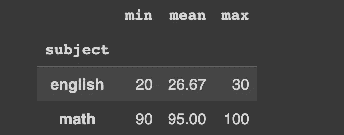

# Pandas: apply、map 还是 transform？

> 原文：[`towardsdatascience.com/pandas-apply-map-or-transform-dd931659e9cf?source=collection_archive---------3-----------------------#2023-01-31`](https://towardsdatascience.com/pandas-apply-map-or-transform-dd931659e9cf?source=collection_archive---------3-----------------------#2023-01-31)

## Pandas 最通用函数的指南

[](https://polaris000.medium.com/?source=post_page-----dd931659e9cf--------------------------------)[](https://towardsdatascience.com/?source=post_page-----dd931659e9cf--------------------------------) [Aniruddha Karajgi](https://polaris000.medium.com/?source=post_page-----dd931659e9cf--------------------------------)

·

[关注](https://medium.com/m/signin?actionUrl=https%3A%2F%2Fmedium.com%2F_%2Fsubscribe%2Fuser%2Fdda13b3bf503&operation=register&redirect=https%3A%2F%2Ftowardsdatascience.com%2Fpandas-apply-map-or-transform-dd931659e9cf&user=Aniruddha+Karajgi&userId=dda13b3bf503&source=post_page-dda13b3bf503----dd931659e9cf---------------------post_header-----------) 发布于 [Towards Data Science](https://towardsdatascience.com/?source=post_page-----dd931659e9cf--------------------------------) ·9 分钟阅读·2023 年 1 月 31 日

--

[](https://medium.com/m/signin?actionUrl=https%3A%2F%2Fmedium.com%2F_%2Fbookmark%2Fp%2Fdd931659e9cf&operation=register&redirect=https%3A%2F%2Ftowardsdatascience.com%2Fpandas-apply-map-or-transform-dd931659e9cf&source=-----dd931659e9cf---------------------bookmark_footer-----------)

照片由[Sid Balachandran](https://unsplash.com/@itookthose?utm_source=medium&utm_medium=referral)提供，发布在[Unsplash](https://unsplash.com/?utm_source=medium&utm_medium=referral)

作为一个使用 Pandas 多年的用户，我注意到许多人（包括我自己）经常几乎总是使用`**apply**`函数。虽然在较小的数据集上这不是问题，但在处理大量数据时，这种做法引起的性能问题会变得更加明显。虽然`**apply**`的灵活性使其成为一个简单的选择，但这篇文章介绍了其他 Pandas 函数作为潜在的替代方案。

在这篇文章中，我们将探讨`**apply**`、`**agg**`、`**map**`和`**transform**`的使用方式，并提供一些示例。

## 内容目录

```py
* map
* transform
* agg
* apply
* Unexpected behavior
```

## 示例

让我们以一个数据框为例，该数据框包含三名学生在两门科目中的分数。我们将在接下来的工作中使用这个示例。

```py
df_english = pd.DataFrame(
    {
        "student": ["John", "James", "Jennifer"],
        "gender": ["male", "male", "female"],
        "score": [20, 30, 30],
        "subject": "english"
    }
)

df_math = pd.DataFrame(
    {
        "student": ["John", "James", "Jennifer"],
        "gender": ["male", "male", "female"],
        "score": [90, 100, 95],
        "subject": "math"
    }
)
```

现在我们将这些数据合并成一个单一的数据框。

```py
df = pd.concat(
    [df_english, df_math],
    ignore_index=True
)
```

我们最终的数据框看起来是这样的：


示例数据框

我们将使用这个数据集来探索每个函数的使用。

## map

```py
Series.map(arg, na_action=None) -> Series
```

`**map**`方法作用于`Series`，并根据传递给函数的`arg`来映射每个值。`arg`可以是一个函数——就像`apply`可以接受的那样——但它也可以是字典或系列。

`na_action`本质上让你决定如果系列中存在`NaN`值会发生什么。当设置为`"ignore"`时，`arg`不会应用于`NaN`值。

例如，如果你想用映射替换系列中的分类值，你可以这样做：

```py
GENDER_ENCODING = {
    "male": 0,
    "female": 1
}
```

```py
df["gender"].map(GENDER_ENCODING)
```

输出符合预期：它返回与我们原始系列中的每个元素对应的映射值。


map 的输出

尽管`**apply**`不接受字典，但仍然可以实现这种功能，但效率和优雅程度远不如前者。

```py
df["gender"].apply(lambda x:
    GENDER_ENCODING.get(x, np.nan)
)
```


`apply`的输出与`map`的输出相同

**性能**

在对包含百万条记录的性别系列进行编码的简单测试中，`**map**`比`**apply**`**快了 10 倍**。

```py
random_gender_series = pd.Series([
    random.choice(["male", "female"]) for _ in range(1_000_000)
])

random_gender_series.value_counts()

"""
>>>
female    500094
male      499906
dtype: int64
""" 
```

```py
"""
map performance
"""
%%timeit
random_gender_series.map(GENDER_ENCODING)

# 41.4 ms ± 4.24 ms per loop (mean ± std. dev. of 7 runs, 10 loops each)
```

```py
"""
apply performance
"""
%%timeit
random_gender_series.apply(lambda x:
    GENDER_ENCODING.get(x, np.nan)
)

# 417 ms ± 5.32 ms per loop (mean ± std. dev. of 7 runs, 1 loop each)
```

由于`**map**`也可以接受函数，因此任何不依赖于其他元素的转换——例如不像均值这样的聚合——都可以传递。

使用`map(len)`或`map(upper)`等方法可以使预处理变得更加容易。

让我们将这个性别编码结果分配回数据框，并继续探讨`**applymap**`。

```py
df["gender"] = df["gender"].map(GENDER_ENCODING)
```


使用 map 编码性别

## `applymap`

```py
**DataFrame.applymap(*func*, *na_action=None*, ***kwargs*) -> DataFrame**
```

我不会花太多时间在`**applymap**`上，因为它与`**map**`非常相似，并且内部实现使用了`**apply**`。`**applymap**`在数据框上按元素级别工作，就像`**map**`一样，但由于它是通过`**apply**`内部实现的，因此不能接受字典或系列作为输入——仅允许使用函数。

```py
try: 
    df.applymap(dict())

except TypeError as e:
    print("Only callables are valid! Error:", e)

"""
Only callables are valid! Error: the first argument must be callable
"""
```

`na_action`的工作方式与`**map**`**中的相同**。

## transform

```py
DataFrame.transform(func, axis=0, *args, **kwargs) -> DataFrame
```

虽然之前的两个函数在元素级别工作，但`transform`在列级别工作。这意味着你可以在`**transform**`**中使用聚合逻辑**。

让我们继续使用之前的数据框。


我们的示例，带有编码后的性别

假设我们想要标准化数据。我们可以做如下操作：

```py
df.groupby("subject")["score"] \
    .transform(
        lambda x: (x - x.mean()) / x.std()
    )

"""
0   -1.154701
1    0.577350
2    0.577350
3   -1.000000
4    1.000000
5    0.000000
Name: score, dtype: float64
"""
```

我们本质上是在从每个组中提取分数系列，并用其标准化值替换每个元素。这是不能通过`**map**`完成的，因为它需要按列计算，而`map`仅在元素级别工作。

如果你熟悉`**apply**`，你会知道这种行为也可以通过它来实现。

```py
df.groupby("subject")["score"] \
    .apply(
        lambda x: (x - x.mean()) / x.std()
    )

"""
0   -1.154701
1    0.577350
2    0.577350
3   -1.000000
4    1.000000
5    0.000000
Name: score, dtype: float64
""" 
```

我们得到的结果基本相同。那么使用 `**transform**` 的意义何在？

> `**transform**` 必须返回一个在应用轴上长度相同的数据框。

记住 `**transform**` 必须返回一个在其应用轴上长度相同的数据框。这意味着即使 `**transform**` 与返回聚合值的 `groupby` 操作一起使用，它也会将这些聚合值分配给每个元素。

例如，假设我们想知道每个学科所有学生分数的总和。我们可以这样用 apply 来做到这一点：

```py
df.groupby("subject")["score"] \
    .apply(
        sum
    )

"""
subject
english     80
math       285
Name: score, dtype: int64
""" 
```

但是在这里，我们通过学科聚合了分数，失去了关于各个学生及其分数关系的信息。如果我们尝试用 `**transform**` 做同样的事情，我们会得到更有趣的结果：

```py
df.groupby("subject")["score"] \
    .transform(
        sum
    )

"""
0     80
1     80
2     80
3    285
4    285
5    285
Name: score, dtype: int64
"""
```

尽管我们在组级别工作，但我们仍能跟踪组级信息与行级信息之间的关系。

由于这种行为，`**transform**` 如果你的逻辑没有返回一个变换后的系列，将会抛出 `ValueError`。因此，任何类型的聚合都不会有效。然而，`**apply**` 的灵活性确保了即使在进行聚合时也能正常工作，正如我们将在下一节中详细探讨的那样。

```py
try:
    df["score"].transform("mean")
except ValueError as e:
    print("Aggregation doesn't work with transform. Error:", e)

"""
Aggregation doesn't work with transform. Error: Function did not transform
"""
```

```py
df["score"].apply("mean")

"""
60.833333333333336
"""
```

**性能**

就性能而言，从 `**apply**` 切换到 `**transform**` 的速度提高了 **2 倍**。

```py
random_score_df = pd.DataFrame({
    "subject": random.choices(["english", "math", "science", "history"], k=1_000_000),
    "score": random.choices(list(np.arange(1, 100)), k=1_000_000)
})
```


用于测试 `**transform**` 性能的 1M 行数据框

```py
"""
Transform Performance Test
"""
%%timeit
random_score_df.groupby("subject")["score"] \
    .transform(
        lambda x: (x - x.mean()) / x.std()
    )

"""
202 ms ± 5.37 ms per loop (mean ± std. dev. of 7 runs, 1 loop each)
"""
```

```py
"""
Apply Performance Test
"""
%%timeit
random_score_df.groupby("subject")["score"] \
    .apply(
        lambda x: (x - x.mean()) / x.std()
    )

"""
401 ms ± 5.37 ms per loop (mean ± std. dev. of 7 runs, 1 loop each)
"""
```

## agg

```py
DataFrame.agg(func=None, axis=0, *args, **kwargs) 
    -> scalar | pd.Series | pd.DataFrame
```

`**agg**` 函数更容易理解，因为它只是返回对传递给它的数据进行的聚合。因此，无论你的自定义聚合器是如何实现的，结果将是传递给它的每一列的单个值。

我们现在来看一个简单的聚合——计算每个组在 `score` 列上的均值。注意我们可以传递位置参数给 `**agg**` 以直接命名聚合结果。

```py
df.groupby("subject")["score"].agg(mean_score="mean").round(2)
```


使用 agg 按学科计算的均值

可以将多个聚合器作为列表传递。

```py
df.groupby("subject")["score"].agg(
    ["min", "mean", "max"]
).round(2)
```



使用 apply 按学科计算的均值——与我们之前的结果相同。

`**agg**` 提供了更多的聚合选项。在前两个示例中，我们看到它允许你在列表中执行多个聚合，甚至进行命名聚合。你还可以构建自定义聚合器以及对每列进行多个特定聚合，比如对一列计算均值，对另一列计算中位数。

**性能**

就性能而言，`**agg**` 比 `**apply**` 稍快，至少在简单聚合的情况下是这样。让我们重新创建之前性能测试中相同的数据框。

```py
random_score_df = pd.DataFrame({
    "subject": random.choices(["english", "math", "science", "history"], k=1_000_000),
    "score": random.choices(list(np.arange(1, 100)), k=1_000_000)
})
```


用于性能测试的相同数据框

```py
"""
Agg Performance Test
"""

%%timeit
random_score_df.groupby("subject")["score"].agg("mean")

"""
74.2 ms ± 5.02 ms per loop (mean ± std. dev. of 7 runs, 10 loops each)
"""
```

```py
"""
Apply Performance Test
"""

%%timeit
random_score_df.groupby("subject")["score"].apply(lambda x: x.mean())
"""
102.3 ms ± 1.16 ms per loop (mean ± std. dev. of 7 runs, 10 loops each)
"""
```

使用 `**agg**` 比 `**apply**` 提高了大约 30% 的性能。在进行多次聚合测试时，我们得到了类似的结果。

```py
"""
Multiple Aggregators Performance Test with agg
"""
%%timeit
random_score_df.groupby("subject")["score"].agg(
    ["min", "mean", "max"]
)

"""
90.5 ms ± 16.7 ms per loop (mean ± std. dev. of 7 runs, 1 loop each)
"""
```

```py
"""
Multiple Aggregators Performance Test with apply
"""
%%timeit
random_score_df.groupby("subject")["score"].apply(
    lambda x: pd.Series(
        {"min": x.min(), "mean": x.mean(), "max": x.max()}
    )
).unstack()

"""
104 ms ± 5.78 ms per loop (mean ± std. dev. of 7 runs, 10 loops each)
"""
```

## apply

对我来说，这是我们讨论过的最令人困惑的一个，主要是由于它的灵活性。我们刚才看到的每一个例子都可以用`**apply**` 复制**。**

当然，这种灵活性是有代价的：正如我们的性能测试所示，它明显较慢。


性能测试：`apply`函数明显较慢，这是可以理解的。

## 意外的行为

`**apply**` 灵活性带来的另一个问题是结果有时会令人惊讶。

**处理第一个组两次**

一个已经解决的问题是关于某些性能优化的：`**apply**` 会将第一个组处理两次。第一次，它会查找优化，然后处理每个组，因此会将第一个组处理两次。

我最初在调试我编写的自定义 apply 函数时注意到这一点：当我打印出组的信息时，第一个组被显示了两次。如果存在副作用，这种行为会导致静默错误，因为任何更新都会在第一个组上发生两次。

**当只有一个组时**

这个问题自 2014 年起就困扰着 pandas。当整个列中只有一个组时，即使`**apply**`函数期望返回一个系列，它最终却会产生一个数据框。

结果类似于额外的堆叠操作。让我们尝试重现它。我们将使用原始数据框，并添加一个`city`列。假设我们所有的三位学生，John、James 和 Jennifer 都来自波士顿。

```py
df_single_group = df.copy()
df_single_group["city"] = "Boston"
```


我们的数据框增加了“city”列

现在，让我们计算两组的组均值：一组基于 `subject` 列，另一组基于 `city`。

在 `subject` 列上分组时，我们得到了一个多索引系列，这是我们预期的。

```py
df_single_group.groupby("subject").apply(lambda x: x["score"])
```


apply 在有多个组时返回一个多索引系列

但是当我们按`city`列分组时，正如我们所知，这只有一个组（对应于`“Boston”`），我们得到的是：

```py
df_single_group.groupby("city").apply(lambda x: x["score"])
```


apply 在只有一个组时返回一个未堆叠的数据框

注意结果如何被透视？如果我们`**stack**` 这个，我们将得到预期的结果。

```py
df_single_group.groupby("city").apply(lambda x: x["score"]).stack()
```


堆叠我们之前的结果会得到预期的结果

截至本文撰写时，这个问题仍未修复。

# 代码

你可以在这里找到完整的代码以及性能测试。

[](https://github.com/Polaris000/BlogCode/tree/main/PandasApply?source=post_page-----dd931659e9cf--------------------------------) [## BlogCode/PandasApply 在 main · Polaris000/BlogCode]

### 这是我博客文章《Pandas：apply、map 还是 transform？》中使用的示例代码。博客文章讨论了 Pandas 的…

[github.com](https://github.com/Polaris000/BlogCode/tree/main/PandasApply?source=post_page-----dd931659e9cf--------------------------------)

# 结论

`**apply**` 提供的灵活性使它在大多数场景中非常方便选择，但正如我们所见，使用专门为实现你的需求设计的工具通常更为高效。本文仅覆盖了 `**apply**` 部分内容，这个函数还有很多其他功能。未来的文章将从这里继续。

这篇文章应该给你提供了有关 Pandas 的可能性的一个概念，我希望这能鼓励你充分利用它的功能。
