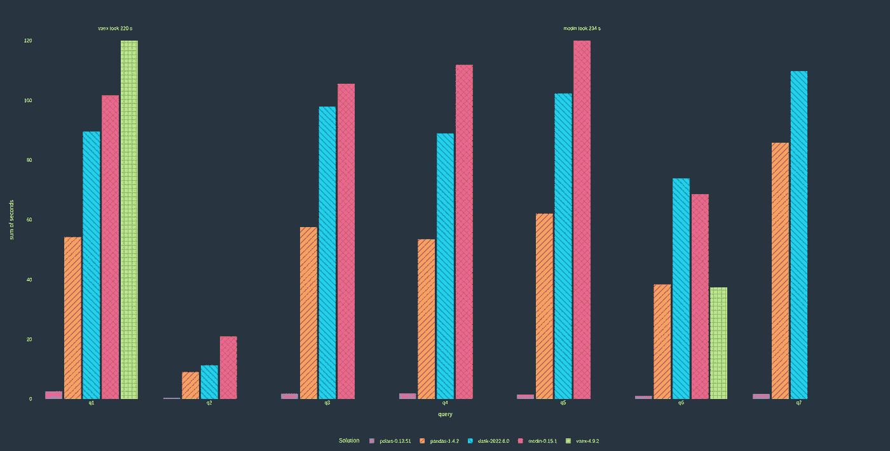
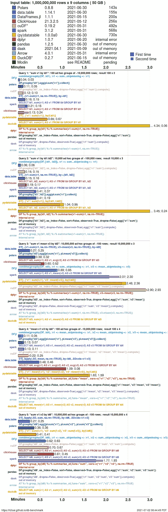

# Polars: Pandas DataFrame 但更快

> 原文：[`towardsdatascience.com/pandas-dataframe-but-much-faster-f475d6be4cd4?source=collection_archive---------1-----------------------#2023-01-03`](https://towardsdatascience.com/pandas-dataframe-but-much-faster-f475d6be4cd4?source=collection_archive---------1-----------------------#2023-01-03)

## 执行多线程优化的 pandas 操作

[](https://travis-tang.medium.com/?source=post_page-----f475d6be4cd4--------------------------------)[](https://towardsdatascience.com/?source=post_page-----f475d6be4cd4--------------------------------) [Travis Tang](https://travis-tang.medium.com/?source=post_page-----f475d6be4cd4--------------------------------)

·

[关注](https://medium.com/m/signin?actionUrl=https%3A%2F%2Fmedium.com%2F_%2Fsubscribe%2Fuser%2F169b6a57c01e&operation=register&redirect=https%3A%2F%2Ftowardsdatascience.com%2Fpandas-dataframe-but-much-faster-f475d6be4cd4&user=Travis+Tang&userId=169b6a57c01e&source=post_page-169b6a57c01e----f475d6be4cd4---------------------post_header-----------) 发表在 [Towards Data Science](https://towardsdatascience.com/?source=post_page-----f475d6be4cd4--------------------------------) ·11 min 阅读·2023 年 1 月 3 日[](https://medium.com/m/signin?actionUrl=https%3A%2F%2Fmedium.com%2F_%2Fvote%2Ftowards-data-science%2Ff475d6be4cd4&operation=register&redirect=https%3A%2F%2Ftowardsdatascience.com%2Fpandas-dataframe-but-much-faster-f475d6be4cd4&user=Travis+Tang&userId=169b6a57c01e&source=-----f475d6be4cd4---------------------clap_footer-----------)

--

[](https://medium.com/m/signin?actionUrl=https%3A%2F%2Fmedium.com%2F_%2Fbookmark%2Fp%2Ff475d6be4cd4&operation=register&redirect=https%3A%2F%2Ftowardsdatascience.com%2Fpandas-dataframe-but-much-faster-f475d6be4cd4&source=-----f475d6be4cd4---------------------bookmark_footer-----------)

面对现实吧。Pandas 很慢。当你的数据框有几百万行时，等待一行代码执行一分钟变得非常令人沮丧。你会发现等待的时间比实际分析的时间还要长。

解决这个问题的库有很多。PySpark、Vaex、Modin 和 Dask 是一些例子。

今天，我们来看看 **Polars**。


Polars 非常快。图片由 Midjourney 提供。

*我与 Polars、PySpark、Vaex、Modin 和 Dask 并无任何关联。*

# Polars 是一个极其快速的数据框库。

**Polars** 非常快。两个基准测试将 Polars 与其替代品进行了比较，结果显示 Polars 是最快的库之一。

[一个基准测试](https://www.pola.rs/benchmarks.html)将 Polars 与其替代品进行对比，任务是读取数据并执行各种分析任务。Polars 的表现始终优于其他库。



数值越低，速度越快。*请注意，基准测试是由 Polars 发布的，因此可能存在一些偏见。* ([Source](https://github.com/pola-rs/tpch))

另一个 [基准测试](https://h2oai.github.io/db-benchmark/) 由 H2O.ai 发布，比较了 Polars 与其替代品在 5 个查询中的表现。在这里，输入表的大小为 50GB，包含 10 亿行和 9 列。

Polars 再次证明了其优势。



根据 H2O 的基准测试，Polars 非常快速。 [Source](https://h2oai.github.io/db-benchmark/)

# Polars 快速的原因：并行化

Polars 之所以快速，是因为它使用了并行化和缓存高效算法来加速分析任务。以下是它的策略。

+   减少冗余的复制

+   高效遍历内存缓存

+   最小化并行中的竞争

## 它是用 Rust 创建的，而不是 Python

Polars 比那些尝试使用 Python 实现并发的库（如 Pandas）要快得多。这是因为 Polars 是用 Rust 编写的，而 Rust 在实现并发方面比 Python 更出色。

Python 在实现并发方面表现不佳的原因是它使用了 [*全局解释器锁 (GIL)*](https://realpython.com/python-gil/)，而 Rust 中没有这一特性。GIL 是一个锁，只允许一个线程控制 *Python 解释器*。


Python 比 Rust 慢的原因。照片由 [FLY:D](https://unsplash.com/es/@flyd2069?utm_source=medium&utm_medium=referral) 提供，来源于 [Unsplash](https://unsplash.com/?utm_source=medium&utm_medium=referral)

这样想：你在一个玩具工厂（处理器）里，有四个工人（处理器中的核心）。

> 在 Python 的情况下：任何时候，一个工人需要持有钥匙（*GIL*）才能运行玩具机器（*Python 解释器*）。他们不能共享机器，一个工人必须在将钥匙传递给另一个工人之前完成玩具的工作。因此，本质上，任何时候只有一个工人可以运行玩具机器。其他三个工人处于闲置状态。
> 
> 在 Rust 的情况下：任何时候，一个工人不需要持有钥匙才能使用玩具机器*。* 他们可以共享机器，一个工人不必在另一个工人开始使用同一台机器之前完成玩具的工作。因此，本质上，多个工人可以同时使用玩具机器。没有人需要闲置。

## 它支持惰性执行

**惰性执行** 意味着表达式不会立即被评估，而是仅在需要时才评估。相比之下，**急切执行** 立即评估表达式。

因此，Polars 可以进行优化——仅运行所需的部分，忽略不必要的部分。它还可以在运行时并行化这些评估。

另一方面，Pandas 执行时是急切的，导致资源浪费。

你可以通过快进到下面的“懒惰地选择列”和“急切地选择列”部分，来查看急切执行和懒惰执行之间的差异示例。

# 安装 Polars

安装 Polars 很简单。只需在终端中运行以下命令。（注意 `[all]` 子句在这里是可选的。）

```py
pip install polars[all]
```

# 数据集：纽约市停车票（4200 万行 x 51 列）

为了说明 Polars 的使用，我们将使用一个大型数据集，即 **4200 万行** [纽约市停车票](https://www.kaggle.com/datasets/new-york-city/nyc-parking-tickets) 来自 Kaggle（它具有 [公共领域](https://creativecommons.org/publicdomain/zero/1.0/) 许可，所以可以随意使用！）

> 纽约市财政部收集有关每张纽约市停车票的数据（每年约 1000 万张！）。


纽约市停车。照片由 [Scott Gummerson](https://unsplash.com/@scottgummerson26?utm_source=medium&utm_medium=referral) 在 [Unsplash](https://unsplash.com/?utm_source=medium&utm_medium=referral) 提供

完整的数据集有 4200 万行，并分布在 4 个文件中——每年一个文件。接下来的博客中，我们将只使用 **一个文件**（2013 年至 2014 年）。

*为什么我们没有使用全部四个文件？不幸的是，当我尝试将所有四个文件连接在一起时，Polars 崩溃了。*

下面的所有代码都在 [Kaggle notebook](https://www.kaggle.com/travisvoon/polars-demo-by-travis-tang/edit) 中执行，该 notebook 拥有：

+   4 个 CPU 核心

+   30 GB RAM

# 使用 Polars 读取数据

Polars 提供 `scan_csv` 选项。扫描会延迟实际的文件解析，而是返回一个名为 `LazyFrame` 的懒惰计算持有者。

实际计算发生在调用 `collect()` 时。

为什么我们要延迟实际解析文件？这样可以让 Polars 生成一个最优的执行计划。例如，当调用 `collect` 时，Polars 可以跳过加载某些列的过程，如果它们在计算中不需要。

```py
# Scanning in 9 million rows and 51 columns. 
# We ignore any potential errors in the dataset due to encoding / dirty null values.
temp_df = pl.scan_csv("/kaggle/input/nyc-parking-tickets/Parking_Violations_Issued_-_Fiscal_Year_2014__August_2013___June_2014_.csv", 
                      ignore_errors = True)

# Read the data
result_df = temp_df.collect()

# Reading dataset
result_df

# Time taken: 14.1 s ± 3.29 s per loop
```

你还可以使用其他函数来读取数据，包括：

+   [Parquet 文件](https://pola-rs.github.io/polars-book/user-guide/howcani/io/parquet.html)

+   [JSON 文件](https://pola-rs.github.io/polars-book/user-guide/howcani/io/json.html)

+   [数据库](https://pola-rs.github.io/polars-book/user-guide/howcani/io/read_db.html)

+   [AWS](https://pola-rs.github.io/polars-book/user-guide/howcani/io/aws.html)

+   [Google BigQuery](https://pola-rs.github.io/polars-book/user-guide/howcani/io/google-big-query.html)

+   [Postgres](https://pola-rs.github.io/polars-book/user-guide/howcani/io/postgres.html)

# 基于条件过滤行

## 过滤精确值

你也可以使用 `filter` 关键字来过滤特定的行。为此，你需要使用 `pl.col(['column_name_here'])` 函数来指定列名。

```py
# Lazily read (scan) in 9 million rows and 51 columns.
temp_df = pl.scan_csv("/kaggle/input/nyc-parking-tickets/Parking_Violations_Issued_-_Fiscal_Year_2014__August_2013___June_2014_.csv", ignore_errors = True)

# Filtering for rows with the "Registration State" in NY
result_df = temp_df.filter(pl.col(['Registration State'])=="NY")

# Run the filtering using collect.
result_df.collect()

# Time taken: 12.6 s ± 205 ms per loop (mean ± std. dev. of 7 runs, 1 loop each)
```

你可以想象，我们可以使用其他操作符，如`>`（小于）、`<`（大于）、`>=`（大于或等于）、`&`（与）、`|`（或）来实现更复杂的条件。

## 过滤更复杂的条件

你也可以根据更复杂的条件进行过滤。在这里，我使用正则表达式来过滤行。条件是`Plate ID`必须包含‘a’或‘1’。

```py
# Lazily read (scan) in 9 million rows and 51 columns.
temp_df = pl.scan_csv("/kaggle/input/nyc-parking-tickets/Parking_Violations_Issued_-_Fiscal_Year_2014__August_2013___June_2014_.csv", ignore_errors = True)

# Find all carplates that contain the letter 'a' or '1'. 
result_df = temp_df.filter(pl.col("Plate ID").str.contains(r"[a1]"))

# Run the filter using collect.
result_df.collect()

# Time taken: 12 s ± 176 ms per loop (mean ± std. dev. of 7 runs, 1 loop each)
```

## 过滤精确值（非常慢的方法）

你也可以**使用索引选择行**，这对 pandas 用户来说是熟悉的选择数据方式。

为此，你不能使用惰性读取 CSV 的`scan_csv`函数。相反，你应该选择急切读取 CSV 的`open_csv`函数。

请注意，这**是一种反模式**，因为它不允许 Polars 进行并行化。

```py
# Eagerly read in 9 million rows and 51 columns.
# Note that we use read_csv, not scan_csv here.
temp_df = pl.read_csv("/kaggle/input/nyc-parking-tickets/Parking_Violations_Issued_-_Fiscal_Year_2014__August_2013___June_2014_.csv", ignore_errors = True)

# Filtering for rows with the "Registration State" in NY
result_df = temp_df[['Registration State']=="NY"]

# Time taken: 15 s ± 3.72 s per loop (mean ± std. dev. of 7 runs, 1 loop each)
```

# 选择列

## 惰性选择列

你可以使用`select`关键字选择列。请注意，这里的语法已经不同于常规的 pandas 语法。

```py
# Lazily read (scan) in 9 million rows and 51 columns.
temp_df = pl.scan_csv("/kaggle/input/nyc-parking-tickets/Parking_Violations_Issued_-_Fiscal_Year_2014__August_2013___June_2014_.csv", ignore_errors = True)

# Selecting a particular column called Plate ID. 
# In pandas, this will look like result_df = temp_df['Plate ID']
result_df = temp_df.select(['Plate ID']).collect()

# Run it using the collect()
result_df.collect()

# Time taken: 1.59 s ± 24.9 ms per loop (mean ± std. dev. of 7 runs, 1 loop each)
```

## 急切选择列

类似地，你可以使用方括号表示法来选择列。然而，如我在上面的“通过索引过滤”部分所提到的，这是一种反模式。

```py
# Eagerly read in all 9 million rows and 51 columns.
temp_df = pl.read_csv("/kaggle/input/nyc-parking-tickets/Parking_Violations_Issued_-_Fiscal_Year_2014__August_2013___June_2014_.csv", ignore_errors = True)

# Selecting the Plate ID column
result_df = temp_df['Plate ID']

# Time taken: 12.8 s ± 304 ms per loop (mean ± std. dev. of 7 runs, 1 loop each)
```

让我们比较惰性执行和急切执行的速度。惰性执行需要 1.59 秒，而急切执行需要 12.8 秒。7 倍的速度提升是因为 Polars 在惰性执行中*仅*读取“Plate ID”列，而在急切执行中需要读取**所有**列（不仅仅是“Plate ID”）。

# 创建新列

要创建一个新列，Polars 使用`with_columns`语法。

## 使用字符串函数创建列

以下示例中，找到字符串列`Plate ID`的`length`并将其命名为`plate_id_letter_count`。

```py
# Lazily read (scan) in 9 million rows and 51 columns.
temp_df = pl.scan_csv("/kaggle/input/nyc-parking-tickets/Parking_Violations_Issued_-_Fiscal_Year_2014__August_2013___June_2014_.csv", ignore_errors = True)

# String functions to find all Plate ID that contain the letter 'a' or '1'
result_df = temp_df\
            .with_column(pl.col("Plate ID").str.lengths().alias("plate_id_letter_count"))\

# Evaluate the string function.
result_df.collect()

# Time taken: 14.8 s ± 5.79 s per loop
```

## 使用 lambda 函数创建列

可以在`map`函数中指定`lambda`函数，以指定应用于特定列的函数。然后，我们可以使用函数的结果创建一个新列。

```py
# Lazily read (scan) in 9 million rows and 51 columns.
temp_df = pl.scan_csv("/kaggle/input/nyc-parking-tickets/Parking_Violations_Issued_-_Fiscal_Year_2014__August_2013___June_2014_.csv", ignore_errors = True)

# Create a new column called "Clean Violation Code"
# using the formula 10000 + df["Violation Code"]
result_df = temp_df.with_columns([
    pl.col("Violation Code").\
    map(lambda x: x+10000).\
    alias("Clean Violation Code")
])

# Evaluate the function.
result_df.collect()

# Time taken: 13.8 s ± 796 ms per loop (mean ± std. dev. of 7 runs, 1 loop each) 
```

# 执行聚合

我们还提供了一个`groupby`和聚合的示例。

```py
# Lazily read (scan) in 9 million rows and 51 columns.
temp_df = pl.scan_csv("/kaggle/input/nyc-parking-tickets/Parking_Violations_Issued_-_Fiscal_Year_2014__August_2013___June_2014_.csv", ignore_errors = True)

# For each vehicle registration state, calculate the number of tikcets 
# and create a list of all violation codes.
result_df = temp_df\
            .groupby("Registration State").agg(
    [
        pl.count(),
        pl.col("Violation Code").list(),

    ]
).sort('Registration State')\
.collect()

result_df

# time taken: 2.3 s ± 29.1 ms per loop
```

# 组合多个函数

数据科学家经常需要同时执行多个步骤。我们可以使用 Polars 中的`.`表示法来实现。

在以下示例中，我们首先使用`with_column`将`Issue Date`列从`string`列替换为`datetime`列。

然后，我们对`Registration State`进行`groupby`。对于每个州，我们找到票据的最早`Issue Date`。

最后，我们按字母顺序对`Registration State`进行排序。

```py
# Lazily read (scan) in 9 million rows and 51 columns.
temp_df = pl.scan_csv("/kaggle/input/nyc-parking-tickets/Parking_Violations_Issued_-_Fiscal_Year_2014__August_2013___June_2014_.csv", ignore_errors = True)

# Combine multiple steps into one
# Convert "Issue Date" intoa date column, 
# Then group by Registration State and perform some aggregation.
result_df = temp_df\
            .with_column(pl.col("Issue Date").str.strptime(pl.Date, fmt="%m/%d/%Y"))\
            .groupby("Registration State").agg(
                [pl.first("Issue Date")]
              ).sort('Registration State')\

# Run the steps
result_df.collect()

# Took 1.69 s ± 18.1 ms per loop (mean ± std. dev. of 7 runs, 1 loop each)
```

# 将两个表合并成一个

如果你有两个存储在两个单独文件中的表，并且你想将它们合并成一个数据帧？使用`concat`方法。

```py
# Lazily scan two dataframes 
temp_df1 = pl.scan_csv("/kaggle/input/nyc-parking-tickets/Parking_Violations_Issued_-_Fiscal_Year_2014__August_2013___June_2014_.csv", ignore_errors = True)
temp_df2 = pl.scan_csv("/kaggle/input/nyc-parking-tickets/Parking_Violations_Issued_-_Fiscal_Year_2015.csv", ignore_errors = True)

# Concatenating datasets
result_df = pl.concat(
    [
        temp_df1,
        temp_df2,
    ],
    how="vertical",
)

# Reading dataset
result_df.collect()

# Time taken: 
```

# 按键连接表

你可能需要将一个表中的信息与另一个表连接。为此，你可以使用`join`方法。

有多种类型的`join`，包括熟悉的类型（inner、left、right）以及一些新型的（anti、asof、semi）。更多细节请阅读[文档](https://pola-rs.github.io/polars-book/user-guide/howcani/combining_data/joining.html)。

```py
df_cars = pl.DataFrame(
    {
        "id": ["a", "b", "c"],
        "make": ["ford", "toyota", "bmw"],
    }
)
df_repairs = pl.DataFrame(
    {
        "id": ["c", "c"],
        "cost": [100, 200],
    }
)

df_inner_join = df_cars.join(df_repairs, on="id", how="inner")
print(df_inner_join)
```

```py
shape: (2, 3)
┌─────┬──────┬──────┐
│ id  ┆ make ┆ cost │
│ --- ┆ ---  ┆ ---  │
│ str ┆ str  ┆ i64  │
╞═════╪══════╪══════╡
│ c   ┆ bmw  ┆ 100  │
├╌╌╌╌╌┼╌╌╌╌╌╌┼╌╌╌╌╌╌┤
│ c   ┆ bmw  ┆ 200  │
└─────┴──────┴──────┘
```

# 它与 Vaex 有何不同？

我早期写了一篇关于 Vaex 的帖子，并收到许多关于 Vaex 和 Polars 是否不同的评论。以下是我的一些观察。

1.  Vaex 的语法更类似于 Pandas；Polar 的语法更类似于 R 或 PySpark。

1.  Vaex 具有更多的机器学习和数据可视化 API。Polar 的重点是基础的数据处理（过滤、选择、聚合）。

1.  Vaex 是用 CPP 编写的，而 Polars 是用 Rust 编写的。

根据你的使用案例，你可能会发现 Vaex 或 Polars 更好。例如，在纽约数据集中，我无法使用 Polars 连接所有四个 CSV 文件（它会导致内存不足问题），而我可以用 Vaex 做到这一点。

```py
import polars as pl

# Read four dataframes to form a 42.3M parking ticket datasets
temp_df1 = pl.scan_csv("/kaggle/input/nyc-parking-tickets/Parking_Violations_Issued_-_Fiscal_Year_2014__August_2013___June_2014_.csv", ignore_errors = True)
temp_df2 = pl.scan_csv("/kaggle/input/nyc-parking-tickets/Parking_Violations_Issued_-_Fiscal_Year_2015.csv", ignore_errors = True)
temp_df3 = pl.scan_csv("/kaggle/input/nyc-parking-tickets/Parking_Violations_Issued_-_Fiscal_Year_2017.csv", ignore_errors = True)
temp_df4 = pl.scan_csv("/kaggle/input/nyc-parking-tickets/Parking_Violations_Issued_-_Fiscal_Year_2016.csv", ignore_errors = True)

# Concatenating dataset
result_df = pl.concat(
    [
        temp_df1,
        temp_df2,
        temp_df3,
        temp_df4,
    ],
    how="vertical",
)

# Reading dataset
result_df.collect()

# Could not be run since it causes out-of-memory issue. 
```

```py
import vaex 

# Read four dataframes to form a 42.3M parking ticket datasets
temp_df1 = vaex.open("/kaggle/input/nyc-parking-tickets/Parking_Violations_Issued_-_Fiscal_Year_2014__August_2013___June_2014_.csv", schema_infer_fraction=1)
temp_df2 = vaex.open("/kaggle/input/nyc-parking-tickets/Parking_Violations_Issued_-_Fiscal_Year_2015.csv", schema_infer_fraction=1)
temp_df3 = vaex.open("/kaggle/input/nyc-parking-tickets/Parking_Violations_Issued_-_Fiscal_Year_2017.csv", schema_infer_fraction=1)
temp_df4 = vaex.open("/kaggle/input/nyc-parking-tickets/Parking_Violations_Issued_-_Fiscal_Year_2016.csv", schema_infer_fraction=1)

# Concatenating dataset
result_df = vaex.concat([
        temp_df1,
        temp_df2,
        temp_df3,
        temp_df4
    ])

# Reading dataset
result_df

# Could be run without out-of-memory problem.
```

# 判决：在这种条件下使用 Polars。

你应该使用 Polars？Vaex？PySpark？Dask？以下是我的思考方式：

+   如果你的数据很庞大，进入了 10GB 以上的“大数据”领域，你可能要考虑使用 PySpark。否则，Polars、Vaex 和 Dask 是可能的选择。

+   如果你有多台计算机在一个集群中，并且你想在这些计算机之间分配工作负载，使用 Dask。

+   如果你需要可视化、机器学习和深度学习，使用 Vaex。如果不需要，使用 Polars。

这是一个粗略的指南，因为最终的答案取决于你的使用案例。因此，我鼓励你尝试每一个。在某些情况下，Polars 和 Vaex 可能比 PySpark 更快（[当数据集有数百万行时](https://www.confessionsofadataguy.com/dataframe-showdown-polars-vs-spark-vs-pandas-vs-datafusion-guess-who-wins/)）。在某些情况下，Vaex 可以运行，但 Polars 可能会崩溃（如上面的`concat`示例）。


超级速度的 pandas。图片由 Midjourney 提供。

我是一名数据科学家，我在[LinkedIn](https://www.linkedin.com/in/travistang/)和 Medium 分享数据科学技巧。关注我以获取更多类似的技巧。
