# 时间序列的 Pandas

> 原文：[`towardsdatascience.com/pandas-for-time-series-c6cb7c0a3680`](https://towardsdatascience.com/pandas-for-time-series-c6cb7c0a3680)

## Python 中的数据处理

## 本文解释了 pandas 的时间序列方法。让我们像专业人士一样处理时间序列。

[](https://kahemchu.medium.com/?source=post_page-----c6cb7c0a3680--------------------------------)[](https://towardsdatascience.com/?source=post_page-----c6cb7c0a3680--------------------------------) [KahEm Chu](https://kahemchu.medium.com/?source=post_page-----c6cb7c0a3680--------------------------------)

·发表于 [Towards Data Science](https://towardsdatascience.com/?source=post_page-----c6cb7c0a3680--------------------------------) ·阅读时间 13 分钟·2023 年 7 月 26 日

--


图片由 [Aron Visuals](https://unsplash.com/@aronvisuals?utm_source=unsplash&utm_medium=referral&utm_content=creditCopyText) 提供，[Unsplash](https://unsplash.com/s/photos/time?utm_source=unsplash&utm_medium=referral&utm_content=creditCopyText) 上的照片

自从我作为数据科学家进入职场以来，我处理的大多数数据都是时间序列。好吧，时间序列有很多定义，通常定义为一组在一段时间内收集的数据点。或者用 Python 的方式说，它指的是一个带有日期时间索引的数据集，并且至少有一列数值。

这可以是过去几个月的股票价格，过去几周的大型超市销售数据，甚至是一个患者在几个月内记录的血糖水平。

在本文中，我将展示如何将 pandas 应用于时间序列数据集，以生成的血糖水平记录为例。

有了这些，这篇文章将按如下结构进行：

1.  日期时间格式处理 — *将日期时间序列转换为所需格式*

1.  将日期时间转换为特定周期 — *将每个数据点转换为特定时间段*

1.  根据条件筛选日期时间序列 — *根据选定时间段筛选数据点*

1.  时间偏移 — *将数据点向下移动特定周期*

1.  重新抽样时间序列 — *根据指定的时间周期对数据点进行分组*

1.  折线图

> 让我们开始吧！

像往常一样，任何 Python 分析的第一步是导入必要的库。

# 导入库

```py
import pandas as pd
import random
import numpy as np
from datetime import datetime 
```

# 创建数据

接下来，让我们为这个演示生成一个血糖水平记录数据集。

```py
def create_demo_data():

    random.seed(365)
    np.random.seed(365)
    number_of_data_rows = 2160

    # generate list of date
    dates = pd.bdate_range(datetime(2020, 7, 1), freq='4H', periods=number_of_data_rows).tolist()

    # create a dictionary with the date generated and blood sugar level
    data = {'date': dates,
            'blood_sugar_level': np.random.normal(5.5, 1, size=(1, number_of_data_rows))[0]}
    # create dataframe
    df = pd.DataFrame(data)
    df = df.sort_values(by=["date"])
    df = df.set_index(keys="date")
    return df

df = create_demo_data()
print(df.shape)
df.head(10)
```

使用上述脚本，生成了一个包含 2160 个数据点的数据集，记录了一年，间隔 4 小时。数据点从 2020 年 7 月 1 日开始，到 2021 年 6 月 25 日结束。

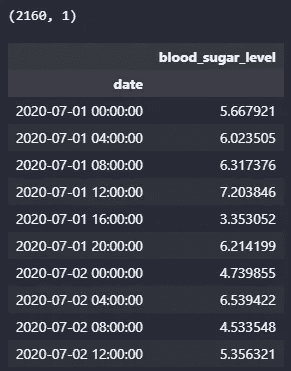

前 10 个数据点。图片来源：作者。

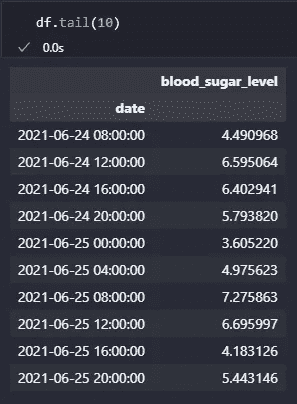

最后的 10 个数据点。图片来源：作者。

现在数据准备好了，开始吧！😊

# 日期时间格式操作

以下是五种可以用来操作日期时间序列的方法。

`[pandas.Series.dt.normalize](https://pandas.pydata.org/pandas-docs/stable/reference/api/pandas.Series.dt.normalize.html)` — 将时间转换为午夜 12:00:00。

`[pandas.Series.dt.round](https://pandas.pydata.org/pandas-docs/stable/reference/api/pandas.Series.dt.round.html)` — 对数据执行四舍五入操作到指定的频率。

`[pandas.Series.dt.floor](https://pandas.pydata.org/pandas-docs/stable/reference/api/pandas.Series.dt.floor.html)` — 对数据执行向下取整操作到指定的频率。

`[pandas.Series.dt.ceil](https://pandas.pydata.org/pandas-docs/stable/reference/api/pandas.Series.dt.ceil.html)` — 对数据执行向上取整操作到指定的频率。

`[pandas.Series.dt.strftime](https://pandas.pydata.org/pandas-docs/stable/reference/api/pandas.Series.dt.strftime.html)` — 使用指定的 date_format 转换为索引。

## 舍入时间戳的方法

对于`.round`、`.floor`和`.ceil`方法，我们需要定义频率来舍入时间。频率必须是固定频率，如‘S’（秒），不能是‘ME’（月末）。

根据作者的尝试与错误，固定频率有 D、H、T/min、S、L/ms、U/us 和 N。查看[时间序列频率](https://pandas.pydata.org/pandas-docs/stable/user_guide/timeseries.html#timeseries-offset-aliases)获取所有频率值。

`.round`、`.floor`和`.ceil`方法之间的区别将在下面的两个例子中显示。*下面的两个例子将使用生成的日期列表，而不是为演示生成的数据框。*

第一个例子是将时间戳从 2 小时频率间隔舍入到 6 小时频率间隔。

```py
import pandas as pd
# generate dates at 2-hour frequency
ts = pd.date_range(pd.Timestamp("2023-04-06 12:00"), periods=5, freq='2H')
print("Before normalize\n", ts)
freq = "6H"
ts_norm = ts.normalize()
ts_round = ts.round(freq=freq)
ts_floor = ts.floor(freq=freq)
ts_ceil = ts.ceil(freq=freq)
print("After normalize\n", ts_norm)
print("After round off\n",ts_round)
print("After round off to floor\n",ts_floor)
print("After round off to ceiling\n",ts_ceil)
```

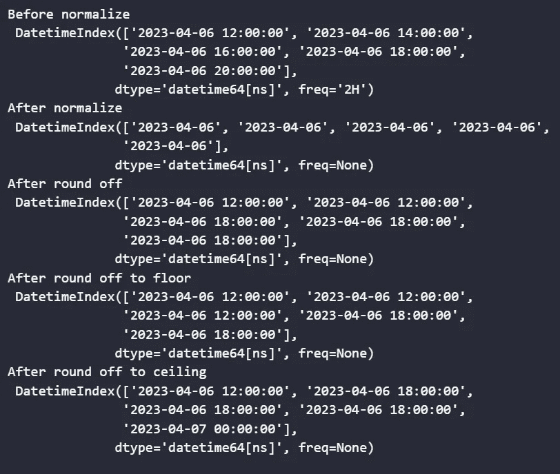

脚本输出 1。图片来源：作者。

第二个例子是将时间戳从 3 小时频率间隔舍入到 6 小时频率间隔。

```py
import pandas as pd
# generate dates at 3-hour frequency
ts = pd.date_range(pd.Timestamp("2023-04-06 12:00"), periods=5, freq='3H')
print("Before normalize\n", ts)
freq = "6H"
ts_norm = ts.normalize()
ts_round = ts.round(freq=freq)
ts_floor = ts.floor(freq=freq)
ts_ceil = ts.ceil(freq=freq)
print("After normalize\n", ts_norm)
print("After round off\n",ts_round)
print("After round off to floor\n",ts_floor)
print("After round off to ceiling\n",ts_ceil)
```

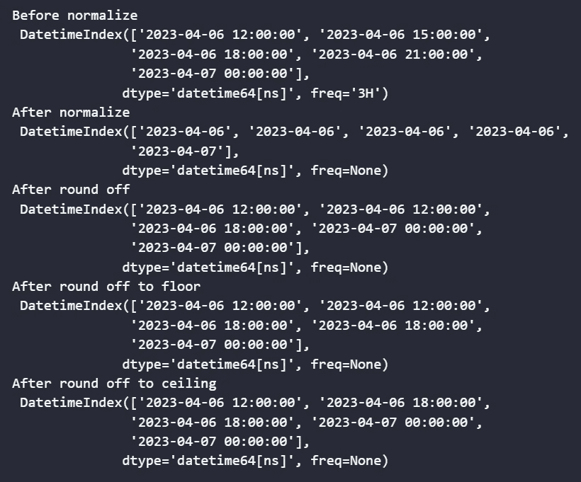

脚本输出 2。图片来源：作者。

6 小时频率意味着时间将被分割成等长的时间段，每个时间段间隔 6 小时，第一个时间段总是从午夜 00:00:00 开始。一天有 24 小时，因此我们会有 4 个时间段，如下图所示。

第一个时间段将是凌晨 12 点到早上 6 点，然后第二个时间段将是早上 6 点到中午 12 点，以此类推。

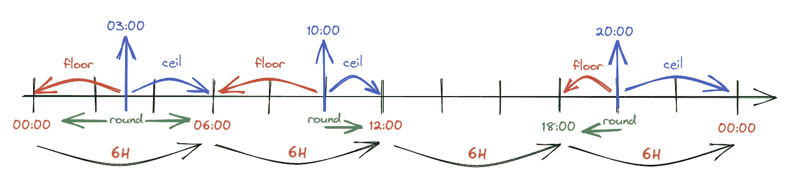

round、floor 和 ceil 方法之间的区别。图片来源：作者。

如上图所示，对于 `.floor` 方法，它将始终返回时间段的下边界。对于 `.ceil` 方法，则与 `.floor` 相反，它将始终返回时间段的上边界。

对于 `.round` 方法，它将返回该时间段的最近边界，但当距离两个边界相等时，它将返回任意一个。

这就是上述三种方法之间的区别。时间戳的舍入方式将影响后续分析的结果，因此，根据需要的分析选择方法是至关重要的。

要在数据框上应用上述方法，我们需要在方法前加上 `.dt`。

要更改日期，我们可以将日期索引复制为一列。

```py
df['dates'] = df.index
df.head()
```

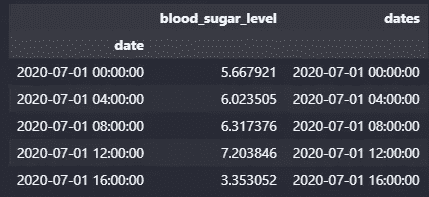

一个包含重复日期列的数据框。图片由作者提供。

数据框的 `dtypes` 如下所示。

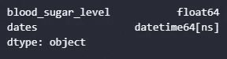

图片由作者提供。

在下面的第一个示例中，我们将在 6 小时的频率下对时间戳进行舍入。`.dt.normalize` 将始终将时间舍入到午夜，因此这里只显示日期。

```py
freq = "6H"
df["ts_norm"] = df.dates.dt.normalize()
df["ts_round"] = df.dates.dt.round(freq=freq)
df["ts_floor"] = df.dates.dt.floor(freq=freq)
df["ts_ceil"] = df.dates.dt.ceil(freq=freq)
df.head()
```

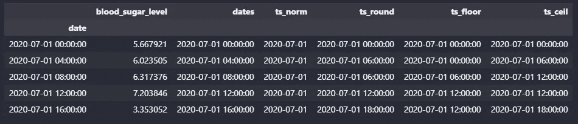

图片由作者提供。

第一个示例与生成的日期列表的两个示例相同，时间戳按小时进行舍入。

在下面的第二个示例中，我们将以“D”频率对日期进行舍入，这意味着时间戳将舍入到最近的一天。

```py
freq = "D"
df["ts_norm"] = df.dates.dt.normalize()
df["ts_round"] = df.dates.dt.round(freq=freq)
df["ts_floor"] = df.dates.dt.floor(freq=freq)
df["ts_ceil"] = df.dates.dt.ceil(freq=freq)
df.head()
```

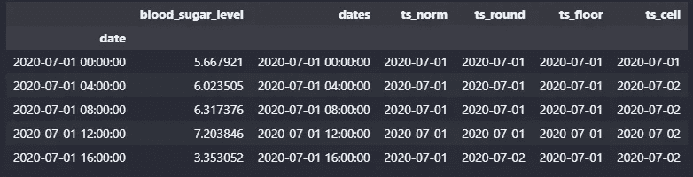

图片由作者提供。

对于第二个示例，`.floor` 方法将返回时间段的下边界，即与时间戳相同的一天，而 `.ceil` 方法将始终返回时间段的上边界，即日期的下一天 **除非** 时间戳是在午夜 00:00 时。

对于 `.round` 方法，它仍然会返回时间段的最近边界，但当距离两个边界相等时，它将返回任意一个。

## 转换 DateTime 格式的方法 — strftime()

通过使用 `.strftime()` 方法，我们可以将时间戳转换为所需的格式。在下面的示例中，标准的 ISO 格式日期已被转换为 <month> <day>, <year> 格式，这可以通过 `strftime()` 格式代码`‘%B %d, %Y’` 表示。`%B` 代表的是月份的完整名称。查看所有的 `strftime()` 格式代码 [这里](https://docs.python.org/3/library/datetime.html#strftime-and-strptime-behavior)。

```py
df["formatted_date"] = df["dates"].dt.strftime('%B %d, %Y')
df.head()
```

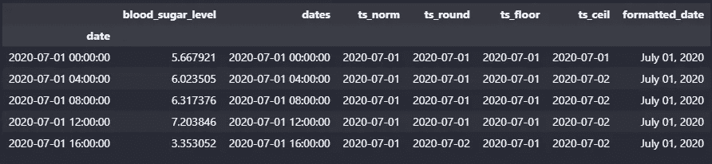

图片由作者提供。

转换 DateTime 格式，例如将月份从数字转换为完整名称，可以消除 7 是指月份还是日期的混淆。

# 将 DateTime 转换为特定的时间段

`[pandas.Series.dt.to_period](https://pandas.pydata.org/pandas-docs/stable/reference/api/pandas.Series.dt.to_period.html)` — 转换为特定频率的 PeriodArray/Index。将 DatetimeArray/Index 转换为 PeriodArray/Index。

以下第一个示例将时间戳转换为周。

```py
ts = pd.date_range(pd.Timestamp("2023-04-06 13:00"), periods=5, freq='w')
print("Before \n", ts)
freq = "w"
ts_period = ts.to_period(freq=freq)
print("After \n", ts_period)
```

如下输出所示，日期时间数组已转换为周期数组，其中列表中的每个元素已从时间戳更改为周。

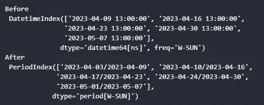

图片由作者提供。

以下第二个示例将时间戳转换为月份。

```py
ts = pd.date_range(pd.Timestamp("2023-04-06 13:00"), periods=5, freq='w')
print("Before\n", ts)
freq = "M"
ts_period = ts.to_period(freq=freq)
print("After\n", ts_period)
```

如下输出所示，日期时间数组已转换为月份数组，其中列表中的每个元素已从时间戳更改为月份。

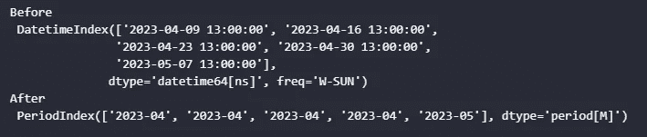

图片由作者提供。

现在让我们将其应用于数据框。与之前的示例一样，应用方法到数据框时，需要在 `.to_period()` 前添加 `.dt`。

```py
df["period"] = df["dates"].dt.to_period(freq="M")
df.head()
```

日期列中的每个日期时间已被转换为月份。


图片由作者提供。

使用新的周期列，我们可以创建透视表以获得更多见解。例如，我们可以计算每个月的平均血糖水平。

```py
df_pivot = pd.pivot_table(data=df, index="period", values="blood_sugar_level", aggfunc=np.mean)
df_pivot
```

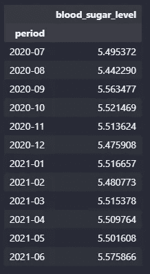

图片由作者提供。

我们还可以通过周期间计算平均血糖水平，以便进行更详细的监测。

```py
df["week_period"] = df["dates"].dt.to_period(freq="W")
df.head()
```

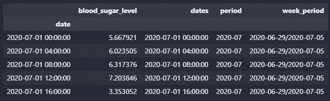

图片由作者提供。

我们可以计算每周的平均血糖水平，如下所示。如果血糖水平在多周内持续上升，则应采取措施进行控制。

```py
df_pivot_week = pd.pivot_table(data=df, index="week_period", values="blood_sugar_level", aggfunc=np.mean)
df_pivot_week.head()
```

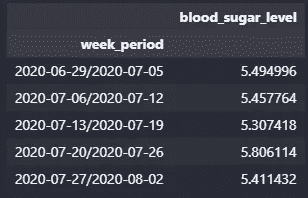

图片由作者提供。

如果我们使用每日数据，几天内血糖水平的上升可能仅是由于丰盛的晚餐，但几周内血糖水平的上升可能表明患者的健康存在风险。

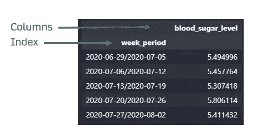

图片由作者提供。

对于透视表，索引标签和列标签将不会处于同一级别，如上图所示。

为了使索引标签和列标签处于同一级别，需要重置索引，如下所示。

```py
df_pivot_week = df_pivot_week.reset_index()
df_pivot_week.head()
```

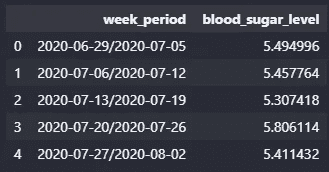

图片由作者提供。

# 基于条件过滤 DateTime 系列

`[pandas.Series.at_time](https://pandas.pydata.org/pandas-docs/stable/reference/api/pandas.Series.at_time.html)` — 选择一天中特定时间的值（例如，上午 9:30）。

`[pandas.Series.between_time](https://pandas.pydata.org/pandas-docs/stable/reference/api/pandas.Series.between_time.html)` — 选择一天中特定时间段之间的值（例如，上午 9:00–9:30）。

这种方法适用于健康记录的调查，例如每天早晨和睡前的血糖水平。它也可以用于跟踪销售或特定时间段内的航班等应用。

在以下示例中，我们将应用上述两种方法来跟踪上午 8 点和晚上 7 点到 9 点之间的血糖水平记录。

```py
# to check the blood sugar level at every morning 8am
df.at_time('8:00')
```

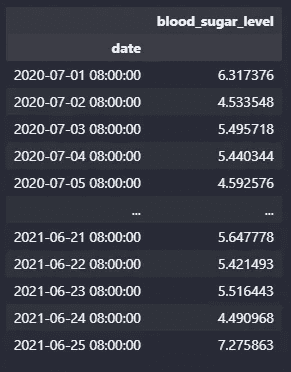

图片由作者提供。

在上面的例子中，仅会显示在早上 8 点记录的记录。

**注意：** 此方法只能应用于索引为**DatetimeIndex**的数据框，否则会导致如下面所示的 TypeError。

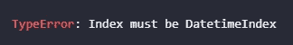

作者提供的图片。

例如下面的例子中，仅会显示晚上 7 点到 9 点之间的前五条记录。

```py
df.between_time(start_time="19:00", end_time="21:00").head()
```

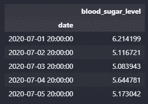

作者提供的图片。

# 时间移位

`[pandas.Series.shift](https://pandas.pydata.org/pandas-docs/stable/reference/api/pandas.Series.shift.html)` — 移动时间索引，如果可用的话使用索引的频率。

**注意：** 由于此方法根据时间索引移动数据点，因此索引必须是**日期时间索引**或**周期索引**。

```py
df_pivot
```

让我们回顾前一节的透视表来演示时间移位方法。


作者提供的图片。

```py
df_pivot.shift(periods=1)
```

我们可以按照脚本中指定的周期向下移位数据点。

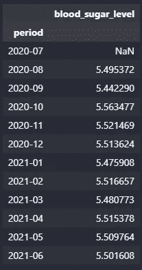

作者提供的图片。

通过将周期更改为-1，我们也可以将数据点向上移位一个周期。例如，数据点已经向上移位一个月，这意味着当前的 7 月数据点是 8 月。

```py
df_pivot.shift(periods=-1)
```

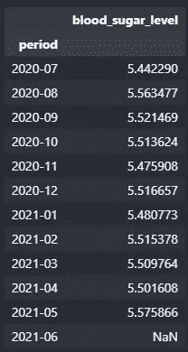

作者提供的图片。

列名可能会产生歧义，因为它没有反映实际值。为了解决这个问题，我们可以将其与`.rename()`方法结合，直接重命名时间移位列。

```py
df_shift = df_pivot.shift(periods=1).rename(columns={"blood_sugar_level":"previous month value"})
df_shift
```

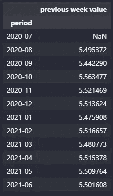

作者提供的图片。

我们可以将原始数据点与移位后的数据点结合，制作比较表。

```py
df_combine = df_pivot.join(df_shift, how="left")
df_combine
```

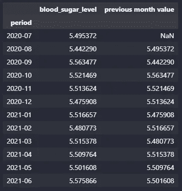

作者提供的图片。

使用上面的两个系列，我们可以计算血糖水平的变化百分比。

```py
df_combine["pct change"] = (df_combine["previous month value"] - df_combine["blood_sugar_level"])/df_combine["previous month value"]
df_combine
```

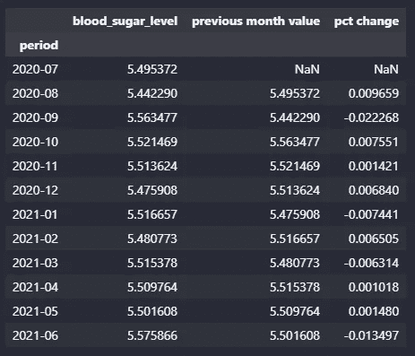

作者提供的图片。

这很酷。你知道什么更酷吗？我们不需要计算变化百分比，`pandas`已经为你准备好了方法😊！

```py
df_pivot["pct_change"] = df_pivot.pct_change()
df_pivot
```

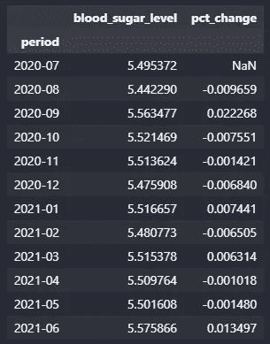

作者提供的图片。

```py
df_pivot["value_change"] = df_pivot["blood_sugar_level"].diff()
df_pivot
```

继续前面的例子，现在数据框中有两列。当有多个列时，需要指定在哪一列上进行计算。

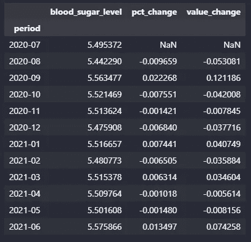

作者提供的图片。

# 重采样时间序列

`[pandas.Series.resample](https://pandas.pydata.org/pandas-docs/stable/reference/api/pandas.Series.resample.html)` — 用于时间序列频率转换和重采样的便捷方法。对象必须具有类似日期时间的索引（DatetimeIndex、PeriodIndex 或 TimedeltaIndex），或者调用者必须将类似日期时间的系列/索引的标签传递给 on/level 关键字参数。

下面的例子使用的是上一节中的`df_pivot`。

```py
df_pivot.resample("Q").mean()
```

上面的脚本将根据时间段索引重新采样数据框，这意味着它将根据指定的时间段进行分组，在本例中是“Q”或季度，通过该时间段内数据点的均值进行分组。

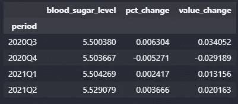

图片由作者提供。

下面是另一个以不同时间段重新采样数据点的示例。

```py
df_pivot.resample("Y").mean()
```

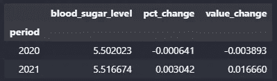

图片由作者提供。

在这个示例中，数据点将根据指定的时间段进行分组，在本例中是“Y”或年份，通过该时间段内数据点的均值进行分组。我们也可以通过该时间段内数据点的最大值进行分组。

```py
df_pivot.resample("Y").max()
```

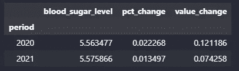

图片由作者提供。

请注意，计算列如`pct_change`和`value_change`也会被加总，因此现在输出中的计算列不再反映正确的值。

请注意，重新采样要求数据框具有类似 DateTime 或时间段的索引，否则会导致类型错误。我们来看看。

```py
df_wrong_example = df_pivot.reset_index()
df_wrong_example.head()
```

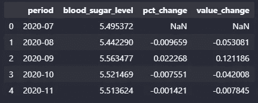

图片由作者提供。

```py
df_wrong_example.resample("Y").sum()
```


图片由作者提供。

# 折线图

`[pandas.Series.plot.line](https://pandas.pydata.org/pandas-docs/stable/reference/api/pandas.Series.plot.line.html)` — 将 Series 或 DataFrame 绘制为折线图。

我们可以使用`.plot()`方法和`.plot.line()`绘制折线图。

```py
df_pivot["blood_sugar_level"].plot.line()
df_pivot["blood_sugar_level"].plot()
```

上述两个命令产生相同的结果。

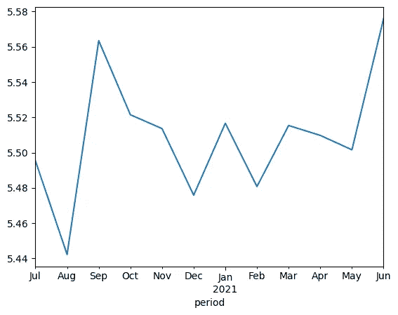

图片由作者提供。

如果你注意到，1 月下有 2021 年，或许如果我们让数据从 2020 年 1 月开始，它也会显示 2020 年？

让我们创建一个数据点从 2020 年开始的数据框。

```py
def create_demo_data():

    random.seed(365)
    np.random.seed(365)
    number_of_data_rows = 55

    # create a month data
    dates = pd.bdate_range(datetime(2020, 1, 1), freq='2W', periods=number_of_data_rows).tolist()

    data = {'date': dates,
            'blood_sugar_level': np.random.normal(5.5, 1, size=(1, number_of_data_rows))[0]}

    df = pd.DataFrame(data)
    df = df.sort_values(by=["date"])
    df = df.set_index(keys="date")
    return df

df = create_demo_data()
print(df.shape)
df.head(10)
```

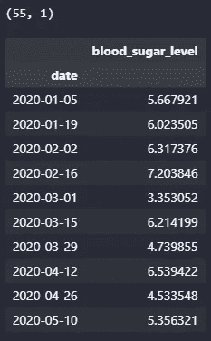

图片由作者提供。

```py
df.plot()
```

让我们绘制图表！

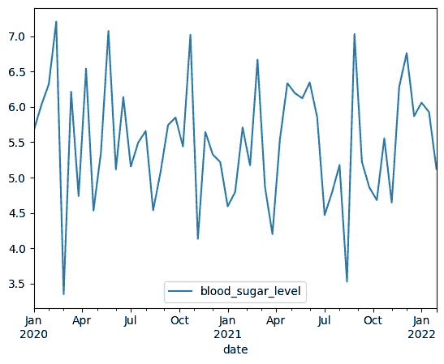

图片由作者提供。

是的！所以年份会显示在 1 月下，如果你有从年度第二个月或之后的数据，你可能需要更好的标题以减少观众的混乱。

```py
df_pivot["blood_sugar_level"].plot(title="Blood Sugar Level Record from Jul'20 - Jun'21", xlabel="Date", ylabel="Blood Sugar Level")
```

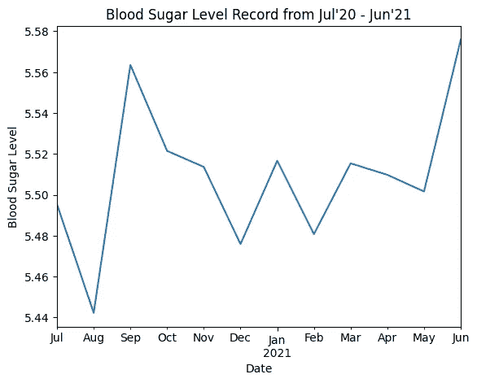

图片由作者提供。

最后一点，`pandas`绘图功能需要安装`matplotlib`库，否则会导致导入错误。

# 结论

总之，我们已经涵盖了如何格式化 DateTime 序列，以及如何通过重新采样将时间戳更改为时间段或将其分组到时间段中。我们还涵盖了如何根据条件有效过滤时间序列，并上下移动数据点以获取新见解。最后，我们还介绍了如何快速创建图表以查看时间序列的趋势。

关于`pandas`时间序列的内容就到这里。我希望你喜欢阅读这篇文章，并希望它能帮助你更好地了解如何应用`pandas`处理时间序列。谢谢！😊

# 保持联系

订阅 [YouTube](https://www.youtube.com/channel/UCiMtx0qbILP41Ot-pkk6eJw)

# 附注

我在 [处理 Python 中的日期] (https://medium.com/towards-data-science/dealing-with-dates-in-python-1b4069a07a0f) 中解释了你可以对 DateTime 变量进行的可能操作。

在 报告自动化技巧与 Python 中，我解释了一些报告自动化的技巧。快来看看吧！

感谢你阅读到最后，祝贺你😊！


图片由 [Hanny Naibaho](https://unsplash.com/@hannynaibaho?utm_source=unsplash&utm_medium=referral&utm_content=creditCopyText) 提供，来源于 [Unsplash](https://unsplash.com/images/events/thank-you?utm_source=unsplash&utm_medium=referral&utm_content=creditCopyText)
