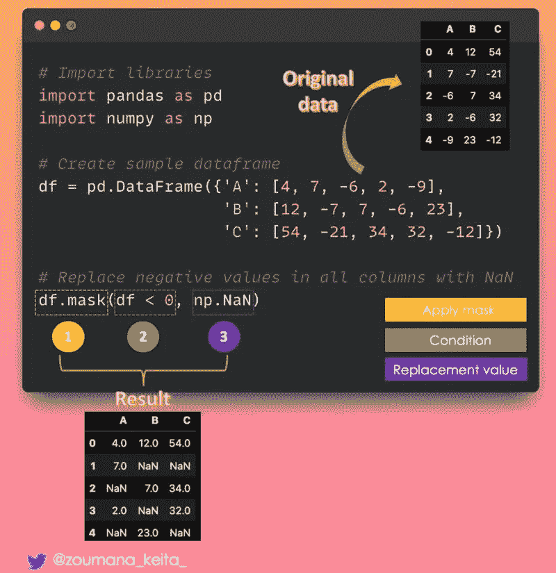
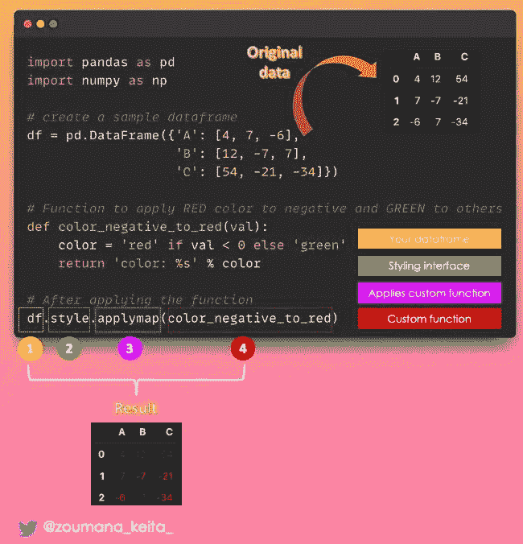
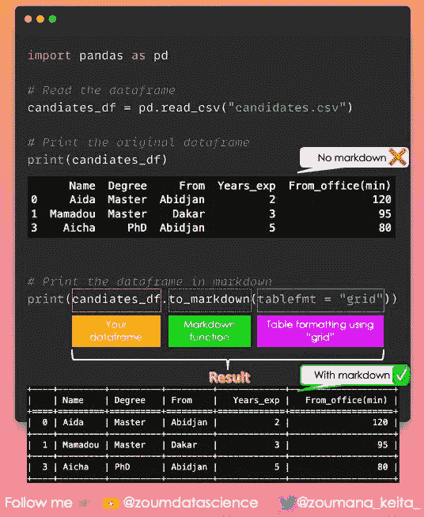
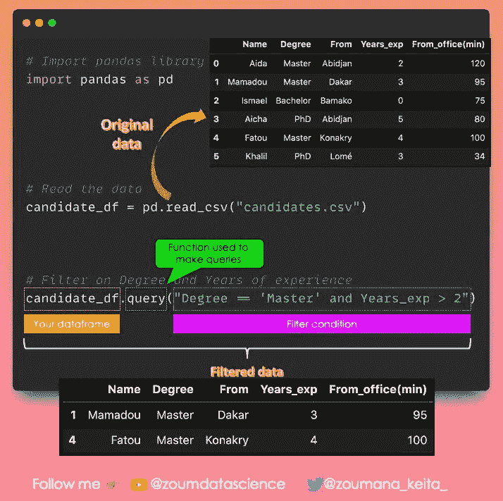
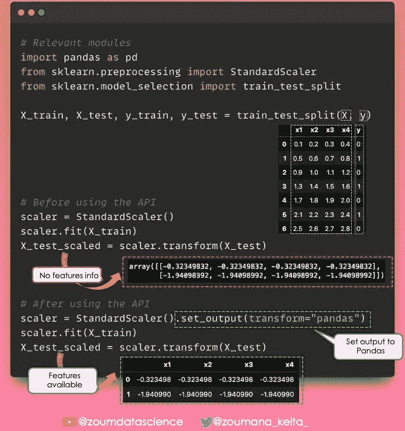
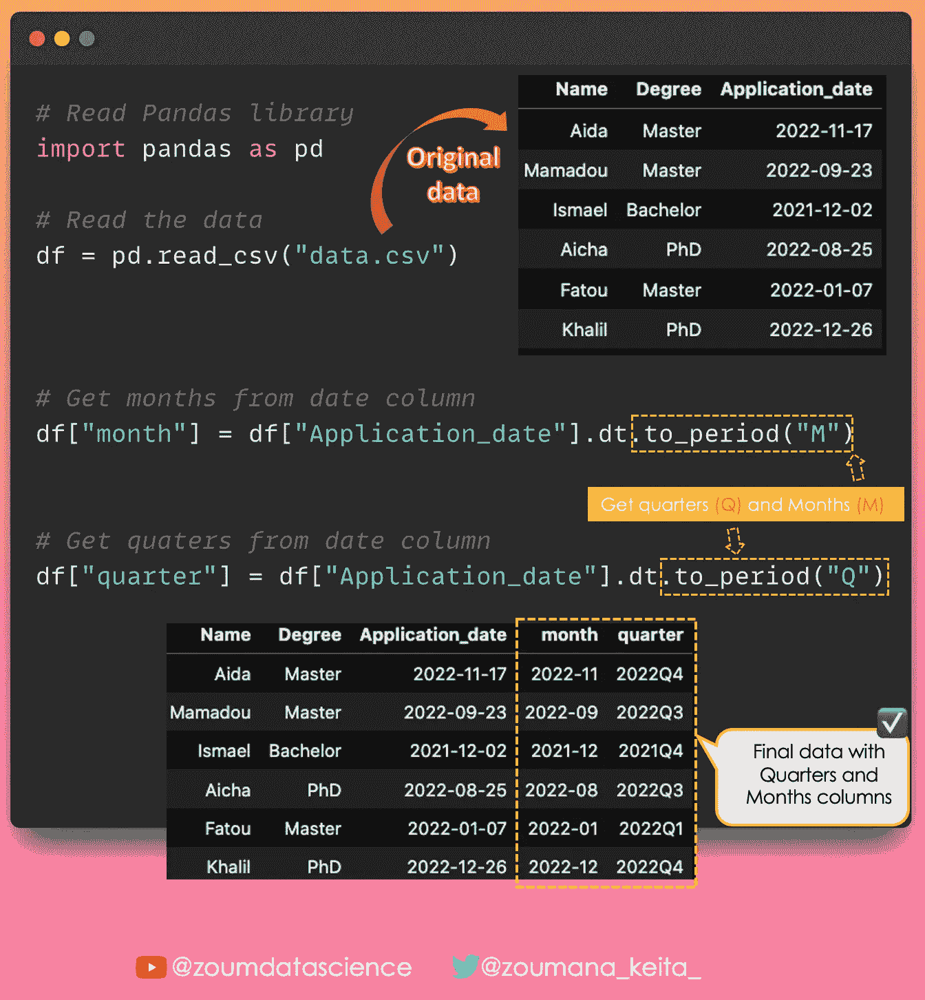
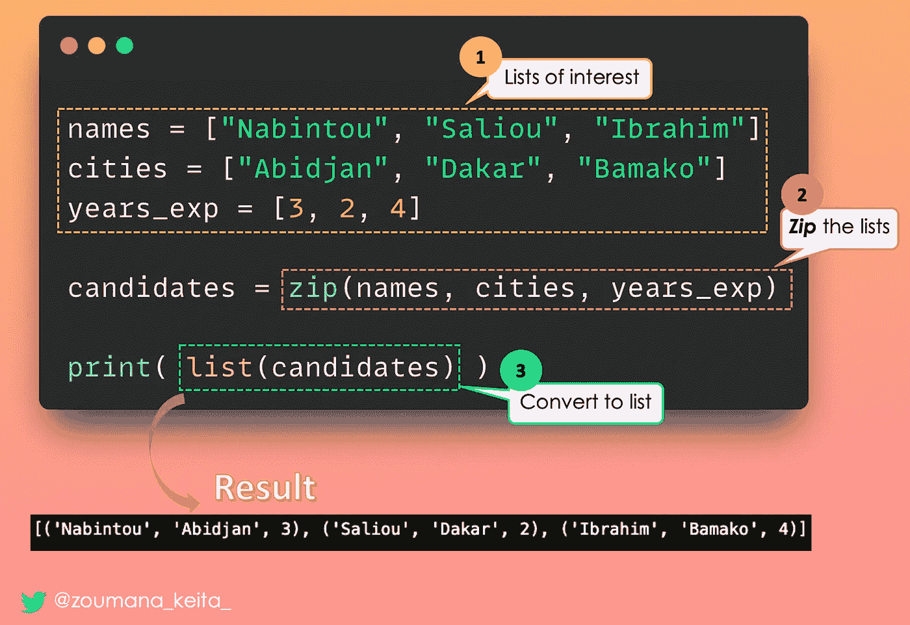
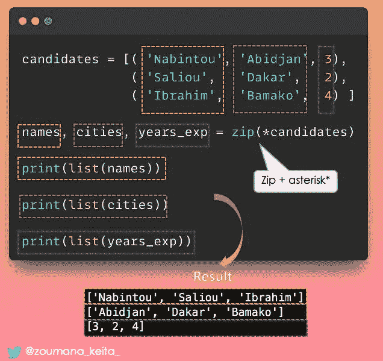
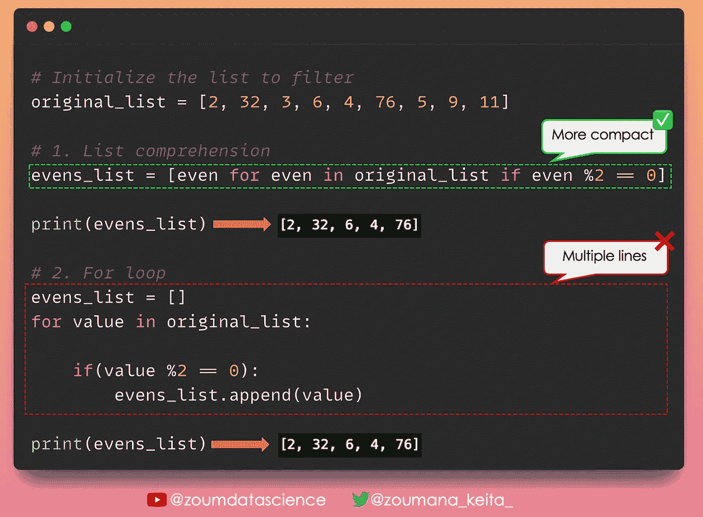
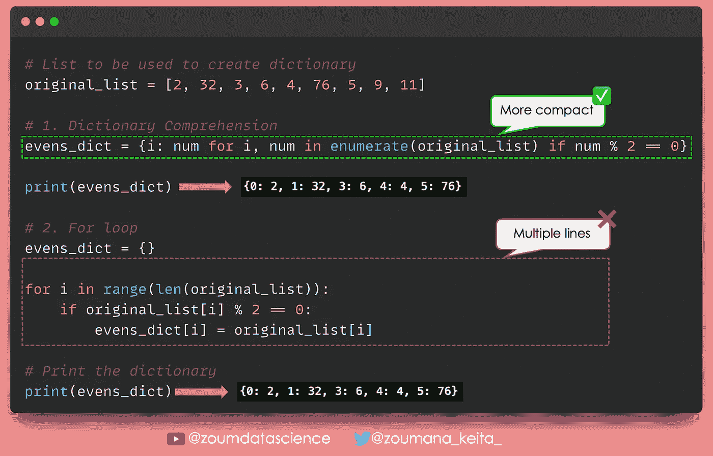

# Pandas & Python 数据科学与数据分析技巧——第三部分

> 原文：[`towardsdatascience.com/pandas-python-tricks-for-data-science-data-analysis-part-3-462d0e952925`](https://towardsdatascience.com/pandas-python-tricks-for-data-science-data-analysis-part-3-462d0e952925)

## 这是我 Pandas & Python 技巧系列的第三部分

 [Zoumana Keita](https://zoumanakeita.medium.com/?source=post_page-----462d0e952925--------------------------------)

·发表于 [Towards Data Science](https://towardsdatascience.com/?source=post_page-----462d0e952925--------------------------------) ·5 分钟阅读·2023 年 2 月 16 日

--

照片由 [Andrew Neel](https://unsplash.com/@andrewtneel) 提供，来源于 [Unsplash](https://unsplash.com/photos/cckf4TsHAuw)

# 介绍

几天前，我分享了[一些 Python 和 Pandas 技巧](https://medium.com/towards-data-science/pandas-and-python-tips-and-tricks-for-data-science-and-data-analysis-1b1e05b7d93a)来帮助数据分析师和数据科学家快速学习他们可能不熟悉的新有价值的概念。这也是我每天在[LinkedIn](https://www.linkedin.com/in/zoumana-keita/)上分享的技巧集合的一部分。

# Pandas

## 根据条件替换数据框中的值

如果你想根据条件替换数据框中的值

✅ 你可以使用 Pandas 内置的 𝗺𝗮𝘀𝗸() 函数。

下面是一个示例 💡

## 为你的 Pandas 数据框应用颜色

你是否曾经希望仅通过查看你的数据框快速找到一些信息❓

例如：

✨ 每列中哪些值是负数？

✨ 每列的最大值或最小值是多少？

✨ 哪些值低于或高于平均值？

列表还在继续…

查看此类信息的一个很好的方法是使用颜色 🎨

✅ 𝗣𝗮𝗻𝗱𝗮𝘀.𝘀𝘁𝘆𝗹𝗲 是一个内置模块，为你的数据框提供了一个高级样式接口。

这里有一个视频示例！

## 在 Markdown 中打印 Pandas 数据框

以更易于理解的方式打印你的数据框总是更好。

✅ 一种方法是使用 .𝚝𝚘_𝚖𝚊𝚛𝚔𝚍𝚘𝚠𝚗() 函数将其渲染为 Markdown 格式。

请在评论中告诉我你最喜欢哪一个。

✨ 使用 Markdown ✅ 或不使用 Markdown ❌

## 通过数据框进行类似 SQL 的查询

Pandas 的强大在数据科学中无法被充分探索💻📊

作为数据分析师或科学家，你可能想要在数据中🔎筛选出相关的见解。

✅ 这可以通过 Pandas 中的内置𝗾𝘂𝗲𝗿𝘆()函数来实现。

它基于布尔表达式运行查询，就像你编写自然语言句子一样！ 💬

以下是一个示例 🚀

## 将 Scikit Learn 处理转换为 Pandas 数据框

如果你仔细观察 🧐 Scikit learn 预处理模块，你可能会注意到底层函数返回一个 numpy 数组 🔢。

这可能会使得追踪数据中特征的原始名称变得困难。

如果没有额外的代码行来保留这些特征名称，拥有一个 Pandas 🐼 数据框不是很好吗？

✅ 这可以通过 Scikit Learn 的新版本（1.2）的𝘀𝗲𝘁_𝗼𝘂𝘁𝗽𝘂𝘁 API 来实现。

以下是一个示例 💡

## 从 Datetime 列中提取周期

天、周、月或季度 🗓，…… 每一个都可以根据任务的需要发挥重要作用。

✅ 使用𝘁𝗼_𝗽𝗲𝗿𝗶𝗼𝗱()函数，你可以从日期列中提取这些相关信息。

以下是一个示例 💡

# Python

## 列表中的元素数量

仍然使用循环 🔁 来确定列表中每个项目出现的频率？

也许有一种更好、更优雅的 Pythonic 🐍 方法！

✅ 你可以使用 Python 中的𝗖𝗼𝘂𝗻𝘁𝗲𝗿类来计算列表中元素的数量。

以下是一个示例 💡

## 从多个列表中合并元素

你在尝试从多个列表中汇总元素吗？

❌ 停止使用𝗳𝗼𝗿循环 🔁 并采用以下方法。

✅ Python 内置的𝘇𝗶𝗽()函数。

以下是一个示例 💡

## 从聚合元素中创建多个列表

当尝试从多个列表中汇总元素时，最优雅和 Pythonic 的方式是使用内置的𝘇𝗶𝗽()函数。

现在，如果你想反向操作：从那些聚合元素中创建多个列表会怎样❓

❌ 忘记𝗳𝗼𝗿循环 🔁

✅ 只需将𝘇𝗶𝗽()函数与𝗮𝘀𝘁𝗲𝗿𝗶𝘀𝗸 *结合使用

以下是一个示例 💡

## 我是列表推导式的忠实粉丝

不要像大多数人那样只用 Python 编程，采取快捷且最有效的方法。

想象一下，你想从一个现有列表中创建一个只包含偶数的列表。最明显的想法是使用“for”循环。但最优雅的方法是使用列表推导式，它更紧凑、更简单，也更容易调试。

以下是一个示例 💡

## 有了列表推导式，就有了字典推导式

与列表推导式类似，也可以创建字典推导式。它也提供了与列表推导式相同的好处。

假设有一个字典，其中键是索引，值是原始列表中实际的偶数。

以下是一个示例 💡

# 结论

感谢阅读！ 🎉 🍾

希望你觉得这份 Python 和 Pandas 技巧列表对你有帮助！请继续关注，因为内容会每天更新更多技巧。

如果你喜欢阅读我的文章并希望支持我的写作，可以考虑 [成为 Medium 会员](https://zoumanakeita.medium.com/membership)。每月 $5 的订阅费用可以解锁 Medium 上所有故事的无限制访问。

你想请我喝咖啡 ☕️ 吗？→ [点击这里](http://www.buymeacoffee.com/zoumanakeig)!

欢迎在 [Medium](https://zoumanakeita.medium.com/)、[Twitter](https://twitter.com/zoumana_keita_) 和 [YouTube](https://www.youtube.com/channel/UC9xKdy8cz6ZuJU5FTNtM_pQ) 上关注我，或者在 [LinkedIn](https://www.linkedin.com/in/zoumana-keita/) 上打个招呼。讨论 AI、ML、数据科学、NLP 和 MLOps 的话题总是很愉快的！

离开之前，请查看此系列的最后两部分：

[Pandas 和 Python 数据科学与数据分析技巧 — 第一部分](https://medium.com/towards-data-science/pandas-and-python-tips-and-tricks-for-data-science-and-data-analysis-1b1e05b7d93a)

[Pandas 和 Python 数据科学与数据分析技巧 — 第二部分](https://medium.com/towards-data-science/pandas-python-tricks-for-data-science-data-analysis-part-2-dc36460de90d)
