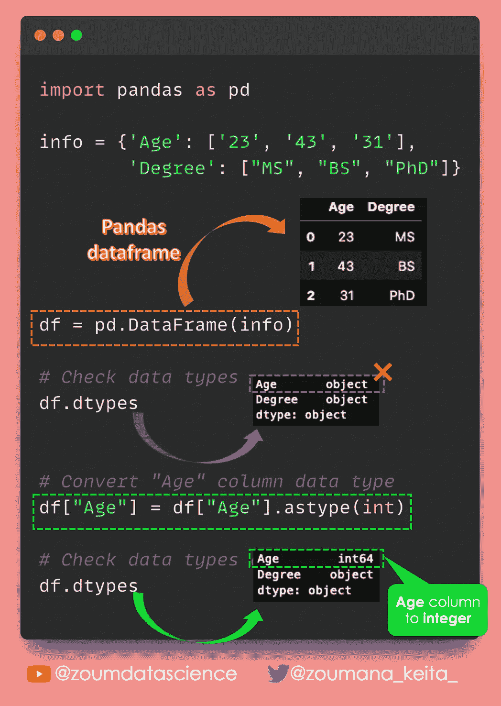
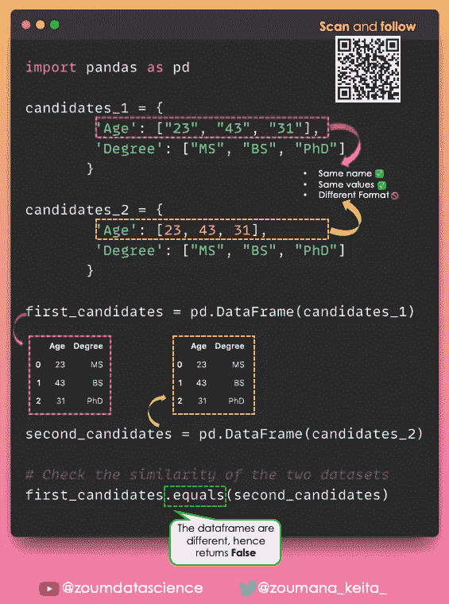
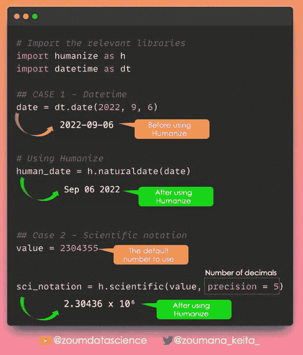
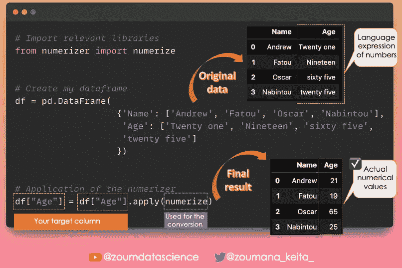
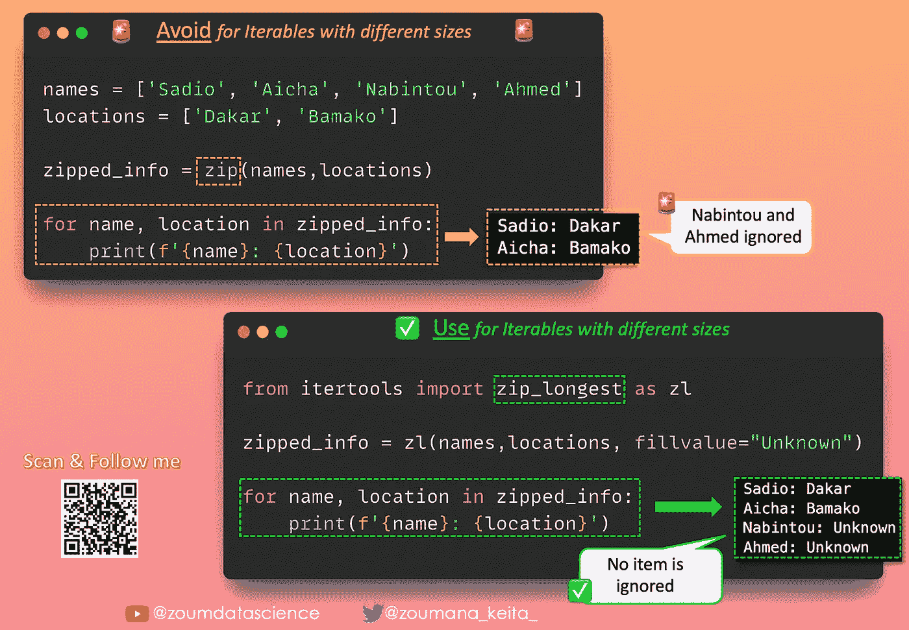

# Pandas 和 Python 数据科学与数据分析技巧——第四部分

> 原文：[`towardsdatascience.com/pandas-python-tricks-for-data-science-data-analysis-part-4-67f61f69d62c`](https://towardsdatascience.com/pandas-python-tricks-for-data-science-data-analysis-part-4-67f61f69d62c)

## 这是我 Pandas 和 Python 技巧系列的第四部分

 [Zoumana Keita](https://zoumanakeita.medium.com/?source=post_page-----67f61f69d62c--------------------------------)

·发表于 [Towards Data Science](https://towardsdatascience.com/?source=post_page-----67f61f69d62c--------------------------------) ·阅读时间 4 分钟·2023 年 3 月 16 日

--

图片由 [Andrew Neel](https://unsplash.com/@andrewtneel) 提供，来源于 [Unsplash](https://unsplash.com/photos/cckf4TsHAuw)

# 介绍

几天前，我分享了 [一些 Python 和 Pandas 技巧](https://medium.com/towards-data-science/pandas-python-tricks-for-data-science-data-analysis-part-3-462d0e952925)，以帮助数据分析师和数据科学家快速学习他们可能不知道的新有价值的概念。这也是我每天在 [LinkedIn](https://www.linkedin.com/in/zoumana-keita/) 上分享的技巧系列的一部分。

# Pandas

## 更改列的数据类型

错误的数据格式是处理真实世界 🌏 数据时常见的挑战。

例如，你可能有一个以字符串形式存储的数值，如“34”而不是 34。

✅ 使用 `astype` 函数，你可以轻松地将数据从一种类型转换为另一种类型（例如，从字符串到数值）。

以下是一个示例 💡

## 检查两个 DataFrame 是否相等

两个具有相同名称的列可能不包含相同的值，而两个具有相同索引的行可能不完全相同。

要知道两个 DataFrame 是否相等，你需要深入检查它们是否具有相同的形状和相同的元素 💡。

这就是 Pandas 𝗲𝗾𝘂𝗮𝗹𝘀() 函数派上用场的地方。

✅ 如果两个 DataFrame 相等，它会返回 True。

❌ 如果它们不相等，它会返回 False。

以下是一个示例 🚀

# Python

## 使你的 Python 输出更具人类可读性

有时候，有必要超越 Python 提供的默认输出，以使其更易于被人类理解 👩🏻‍💼👩🏽‍💼👨🏻‍💼👨🏽‍💼。

✅ 这可以通过使用 ***humanize*** 库来实现。

[完整的视频教程](https://www.youtube.com/watch?v=GvBGNJm6cqU&feature=youtu.be)在这里可以找到更多示例。

## 将自然语言转换为数值

自然语言🗣️无处不在🌐，即使在我们的 DataFrames 中也是如此。

这本身并不是一件坏事，因为在执行自然语言处理任务时，这种数据是完美的👍💯。

然而，当尝试进行数值计算时，它们的局限性👎🚫变得很明显。

🛠️✅ 要解决这个问题，你可以使用来自 Python 库𝗻𝘂𝗺𝗲𝗿𝗶𝘇𝗲𝗿的𝗻𝘂𝗺𝗲𝗿𝗶𝘇𝗲()函数。

✨ 它将自然语言表达的数字转换为实际的数值。

下面是一个示例🚀

## 合并多个列表

使用`+`符号可能是合并🔗列表最常见的方法。

然而，当你需要处理多个列表时，一直输入`+`符号可能会变得很无聊。

✅ 相反，你可以分别使用来自`operator`和`functools`模块的`add`和`reduce`函数。

下面是一个示例🚀

## 合并不同大小的可迭代对象

如果你一直在使用`zip()`函数，那么你可能已经意识到这个限制：它不能处理不同大小的可迭代对象，这可能导致信息丢失。

🛠️✅ 你可以使用`zip`函数的亲戚：来自`itertools`模块的`zip_longest()`函数来解决这个问题。

不是忽略剩余的项，而是将它们的值替换为`None`

这很好，但使用`fillvalue`参数将`None`替换为有意义的值会更棒。

下面是一个示例🚀

# 结论

谢谢阅读！🎉 🍾

我希望你觉得这份 Python 和 Pandas 技巧的列表有用！请继续关注这里，因为内容将会每天更新更多技巧。

如果你喜欢阅读我的故事并希望支持我的写作，可以考虑 [成为 Medium 会员](https://zoumanakeita.medium.com/membership)。每月 5 美元的承诺可以让你无限访问 Medium 上的故事。

你想请我喝咖啡☕️吗？→ [来吧](http://www.buymeacoffee.com/zoumanakeig)!

欢迎随时关注我在[Medium](https://zoumanakeita.medium.com/)、[Twitter](https://twitter.com/zoumana_keita_)和[YouTube](https://www.youtube.com/channel/UC9xKdy8cz6ZuJU5FTNtM_pQ)，或者在[LinkedIn](https://www.linkedin.com/in/zoumana-keita/)打个招呼。讨论 AI、ML、数据科学、NLP 和 MLOps 的内容总是很愉快的！

在你离开之前，请查看下面本系列的最后两个部分：

[Pandas & Python 数据科学与数据分析技巧 — 第一部分](https://medium.com/towards-data-science/pandas-and-python-tips-and-tricks-for-data-science-and-data-analysis-1b1e05b7d93a)

[Pandas 与 Python 数据科学与数据分析技巧——第二部分](https://medium.com/towards-data-science/pandas-python-tricks-for-data-science-data-analysis-part-2-dc36460de90d)

[Pandas 与 Python 数据科学与数据分析技巧——第三部分](https://medium.com/towards-data-science/pandas-python-tricks-for-data-science-data-analysis-part-3-462d0e952925)
