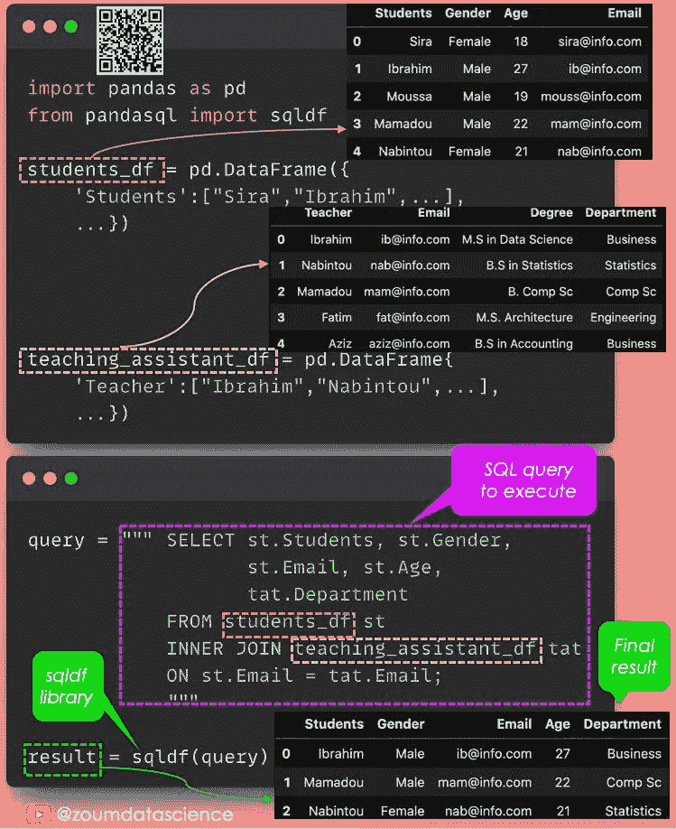
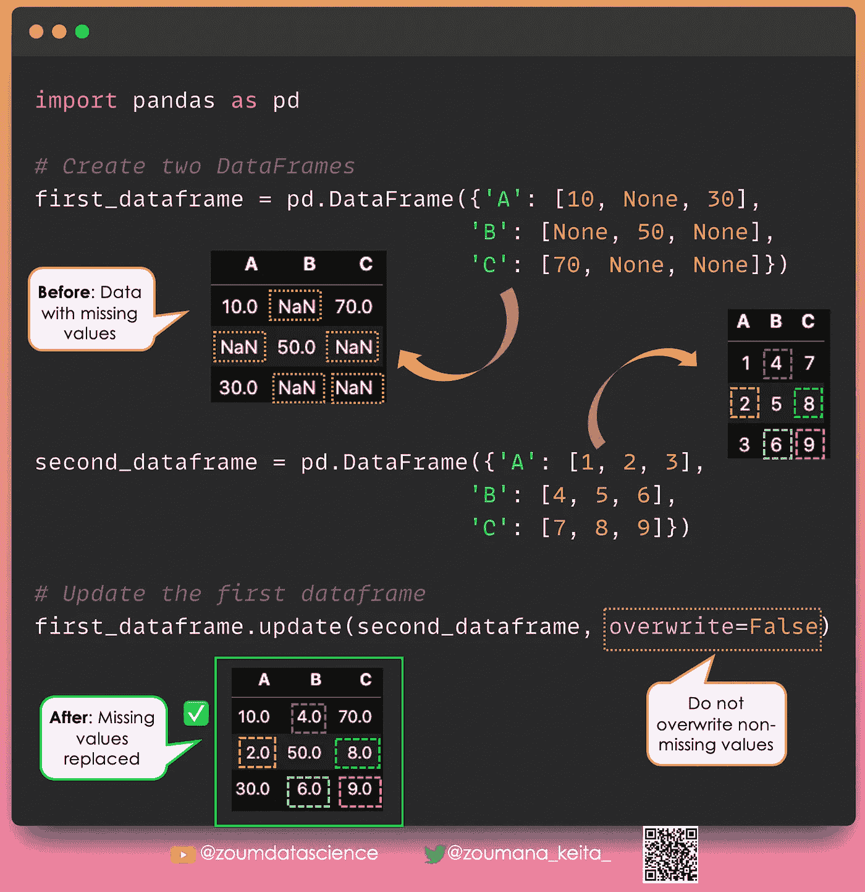
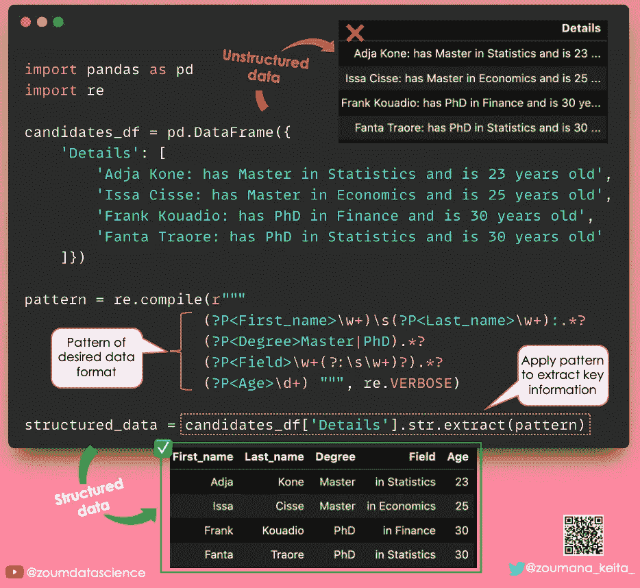
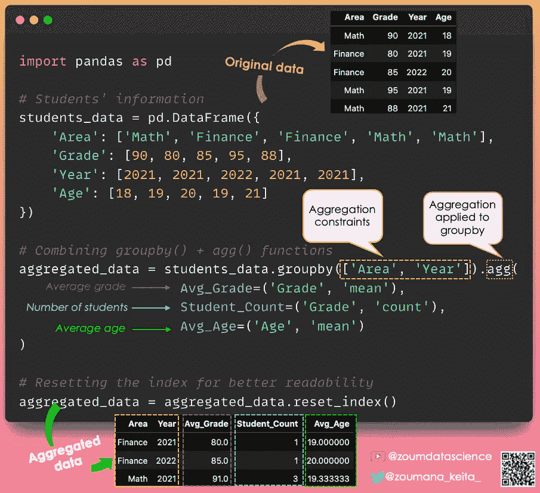
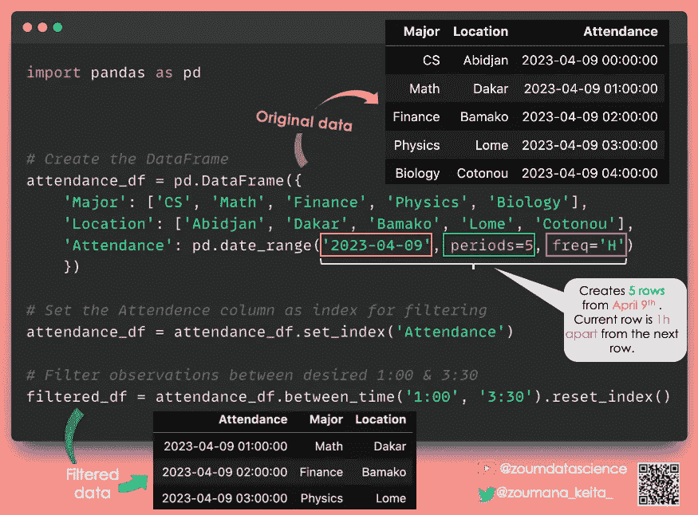
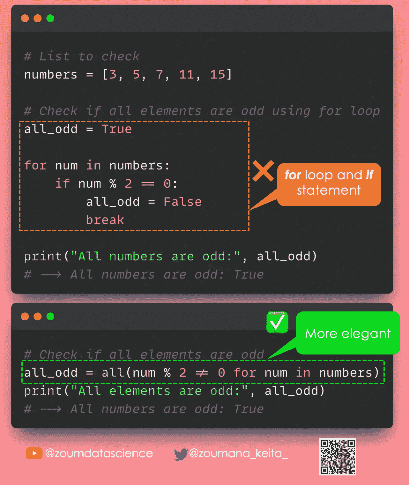
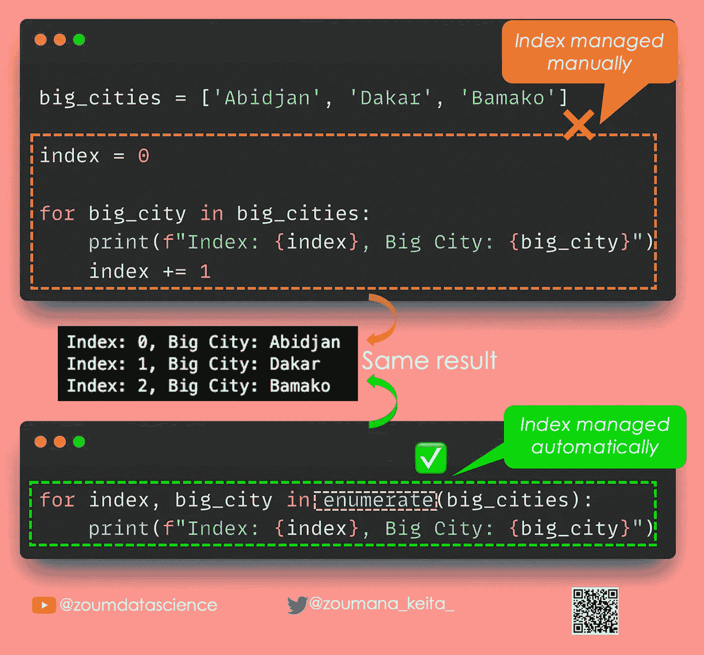

# Pandas 和 Python 数据科学与数据分析技巧 — 第五部分

> 原文：[`towardsdatascience.com/pandas-python-tricks-for-data-science-data-analysis-part-5-8fc987cd82da`](https://towardsdatascience.com/pandas-python-tricks-for-data-science-data-analysis-part-5-8fc987cd82da)

## 这是我的 Pandas 和 Python 技巧的第五部分

 [Zoumana Keita](https://zoumanakeita.medium.com/?source=post_page-----8fc987cd82da--------------------------------)

·发布于 [Towards Data Science](https://towardsdatascience.com/?source=post_page-----8fc987cd82da--------------------------------) ·6 分钟阅读·2023 年 4 月 10 日

--

图片由 [Andrew Neel](https://unsplash.com/@andrewtneel) 提供，来源于 [Unsplash](https://unsplash.com/photos/cckf4TsHAuw)

# 介绍

几天前，我分享了[一些 Python 和 Pandas 的技巧](https://medium.com/towards-data-science/pandas-python-tricks-for-data-science-data-analysis-part-3-462d0e952925)，帮助数据分析师和数据科学家快速学习他们可能不了解的新有价值的概念。这也是我每天在[LinkedIn](https://www.linkedin.com/in/zoumana-keita/)上分享的技巧集合的一部分。

# Pandas

## 结合 SQL 语句和 Pandas

我的直觉告诉我，超过 80% 的数据科学家在日常数据科学活动中使用 Pandas。

我相信这也是因为它作为更广泛的 Python 生态系统的一部分所提供的好处，使得它对许多人都可以访问。

𝙎𝙌𝙇 怎么样？

尽管不是每个人在日常生活中都使用它（因为并不是每个公司都有必要的 SQL 数据库？），SQL 的性能是不可否认的。此外，它是人类可读的，这使得即使是非技术人员也能轻松理解。

❓如果我们能找到一种方法来 𝙘𝙤𝙢𝙗𝙞𝙣𝙚 𝙩𝙝𝙚 𝙗𝙚𝙣𝙚𝙛𝙞𝙩𝙨 𝙤𝙛 𝙗𝙤𝙩𝙝 𝙋𝙖𝙣𝙙𝙖𝙨 𝙖𝙣𝙙 𝙎𝙌𝙇 语句呢？

✅ 这就是 𝗽𝗮𝗻𝗱𝗮𝘀𝗾𝗹 显得非常有用的地方 🎉🎉🎉

下面是一个说明 💡 你也可以观看[完整的视频](https://youtu.be/8N5UOWderg4)。

## 用另一个 DataFrame 更新给定 DataFrame 的数据

在 Pandas 中，有多种方法来替换缺失值 🧩，从简单的插补到更高级的方法。

但是 … 🚨

有时，你只想使用另一个 DataFrame 中的非 NA 值来替换这些值。

✅ 这可以通过 Pandas 内置的更新函数来实现。

它在执行更新之前，会根据索引和列对齐两个数据框。

一般语法 ⚙️ 如下：

𝗳𝗶𝗿𝘀𝘁_𝗱𝗮𝘁𝗮𝗳𝗿𝗮𝗺𝗲.𝘂𝗽𝗱𝗮𝘁𝗲(𝘀𝗲𝗰𝗼𝗻𝗱_𝗱𝗮𝘁𝗮𝗳𝗿𝗮𝗺𝗲)

✨ 从𝗳𝗶𝗿𝘀𝘁_𝗱𝗮𝘁𝗮𝗳𝗿𝗮𝗺𝗲数据框中的缺失值用𝘀𝗲𝗰𝗼𝗻𝗱_𝗱𝗮𝘁𝗮𝗳𝗿𝗮𝗺𝗲中的非缺失值替换

✨ 𝗼𝘃𝗲𝗿𝘄𝗿𝗶𝘁𝗲=𝗧𝗿𝘂𝗲 会用𝘀𝗲𝗰𝗼𝗻𝗱_𝗱𝗮𝘁𝗮𝗳𝗿𝗮𝗺𝗲的数据覆盖𝗳𝗶𝗿𝘀𝘁_𝗱𝗮𝘁𝗮𝗳𝗿𝗮𝗺𝗲的值，这是默认值。如果𝗼𝘃𝗲𝗿𝘄𝗿𝗶𝘁𝗲=𝗙𝗮𝗹𝘀𝗲，则仅替换缺失值。

这里是一个说明 💡

## 从非结构化数据到结构化数据

数据预处理充满挑战 🔥

想象一下你有这种格式的候选人信息数据：

‘𝗔𝗱𝗷𝗮 𝗞𝗼𝗻𝗲: 𝗵𝗮𝘀 𝗠𝗮𝘀𝘁𝗲𝗿 𝗶𝗻 𝗦𝘁𝗮𝘁𝗶𝘀𝘁𝗶𝗰𝘀 𝗮𝗻𝗱 𝗶𝘀 𝟮𝟯 𝘆𝗲𝗮𝗿𝘀 𝗼𝗹𝗱’

…

‘𝗙𝗮𝗻𝘁𝗮 𝗧𝗿𝗮𝗼𝗿𝗲: 𝗵𝗮𝘀 𝗽𝗵𝗱 𝗶𝗻 𝗦𝘁𝗮𝘁𝗶𝘀𝘁𝗶𝗰𝘀 𝗮𝗻𝗱 𝗶𝘀 𝟯𝟬 𝘆𝗲𝗮𝗿𝘀 𝗼𝗹𝗱’

然后，你的任务是为每个候选人生成一个包含以下信息的表格以便进一步分析：

✨ 姓名

✨ 学位和研究领域

✨ 年龄

🚨 执行这样的任务可能令人望而生畏 🤯

✅ 这时，Pandas 中的𝘀𝗿.𝗲𝘅𝘁𝗿𝗮𝗰𝘁()函数可以派上用场！

这是一个强大的文本处理函数，用于从非结构化文本数据中提取结构化信息。

下面是一个说明 💡

## 使用 agg()函数进行多重聚合

如果你想在一个或多个列上执行多个聚合函数，如𝘀𝘂𝗺、𝗮𝘃𝗲𝗿𝗮𝗴𝗲、𝗰𝗼𝘂𝗻𝘁等。

✅ 你可以在一行代码中结合使用𝗴𝗿𝗼𝘂𝗽𝗯𝘆()和𝗮𝗴𝗴()函数。

这里是一个场景 🎬 👇🏽

让我们假设这些学生的数据包含以下信息：

✨ 学生的研究领域

✨ 他们的成绩

✨ 毕业年份和每个学生的年龄。

你被要求计算每个研究领域和年份的以下信息：

→ 学生人数

→ 平均成绩

→ 平均年龄

下面是一个解决场景的图像说明 💡

## 在两个指定时间之间选择观测值

在处理时间序列数据时，你可能需要选择两个指定时间之间的观测值进行进一步分析。

✅ 这可以通过使用𝗯𝗲𝘁𝘄𝗲𝗲𝗻_𝘁𝗶𝗺𝗲()函数快速实现。

下面是一个说明 💡

# Python

## 检查所有元素是否满足某个条件

❌ **for** 循环和 **if** 语句的组合并不总是编写 Python 代码时最优雅的方式。

例如，假设你想检查可迭代对象的所有元素是否满足某个条件。

可能会出现两种情况：

1️⃣ 要么使用 for 循环和 if 语句。

或者

2️⃣ 使用**all()**内置函数

下面是一个说明 💡

## 检查任何元素是否满足某个条件

类似于前面的情况，如果你想检查可迭代对象中的至少一个元素是否满足某个条件。

✅ 然后使用**any()** 内置函数，这比使用**for** 循环和**if** 语句更优雅。

插图类似于上面的图片。

## 避免嵌套的 for 循环

当你的程序变得更大、更复杂时，编写嵌套的𝗳𝗼𝗿 循环几乎是不可避免的。

❌ 这也可能使你的代码难以阅读和维护。

✅ 更好的选择是使用内置的𝗽𝗿𝗼𝗱𝘂𝗰𝘁() 函数。

以下是一个插图 💡

## 自动处理列表中的索引

想象一下，你需要同时访问列表中的元素及其索引。

一种方法是在 for 循环中手动处理索引。

✅ 相反，你可以使用内置的𝗲𝗻𝘂𝗺𝗲𝗿𝗮𝘁𝗲() 函数。

这样有两个主要好处（我能想到的）。

✨ 首先，它会自动处理索引变量。

✨ 这样可以使代码更具可读性。

以下是一个插图 💡

# 结论

感谢阅读！ 🎉 🍾

希望你觉得这个 Python 和 Pandas 技巧列表对你有帮助！请关注这里，因为内容会每天更新更多技巧。

如果你喜欢阅读我的故事并希望支持我的写作，可以考虑 [成为 Medium 会员](https://zoumanakeita.medium.com/membership)。每月支付 5 美元，你将解锁 Medium 上无限制的故事访问权限。

想请我喝咖啡 ☕️ 吗？ → [请在这里](http://www.buymeacoffee.com/zoumanakeig)!

欢迎关注我的 [Medium](https://zoumanakeita.medium.com/)、[Twitter](https://twitter.com/zoumana_keita_) 和 [YouTube](https://www.youtube.com/channel/UC9xKdy8cz6ZuJU5FTNtM_pQ)，或者在 [LinkedIn](https://www.linkedin.com/in/zoumana-keita/) 上打个招呼。讨论 AI、ML、数据科学、NLP 和 MLOps 的内容总是很愉快！

在你离开之前，下面是本系列的最后两个部分：

[Pandas 和 Python 数据科学与数据分析技巧 — 第一部分](https://medium.com/towards-data-science/pandas-and-python-tips-and-tricks-for-data-science-and-data-analysis-1b1e05b7d93a)

[Pandas 和 Python 数据科学与数据分析技巧 — 第二部分](https://medium.com/towards-data-science/pandas-python-tricks-for-data-science-data-analysis-part-2-dc36460de90d)

[Pandas 和 Python 数据科学与数据分析技巧 — 第三部分](https://medium.com/towards-data-science/pandas-python-tricks-for-data-science-data-analysis-part-3-462d0e952925)

[Pandas 和 Python 数据科学与数据分析技巧 — 第四部分](https://medium.com/towards-data-science/pandas-python-tricks-for-data-science-data-analysis-part-4-67f61f69d62c)
