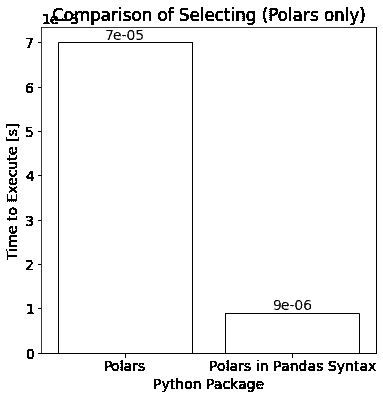

# Pandas 与 Polars：语法和速度比较

> 原文：[`towardsdatascience.com/pandas-vs-polars-a-syntax-and-speed-comparison-5aa54e27497e`](https://towardsdatascience.com/pandas-vs-polars-a-syntax-and-speed-comparison-5aa54e27497e)

## 理解 Python 库 Pandas 和 Polars 在数据科学中的主要差异

[](https://medium.com/@iamleonie?source=post_page-----5aa54e27497e--------------------------------)[](https://towardsdatascience.com/?source=post_page-----5aa54e27497e--------------------------------) [Leonie Monigatti](https://medium.com/@iamleonie?source=post_page-----5aa54e27497e--------------------------------)

·发表于 [Towards Data Science](https://towardsdatascience.com/?source=post_page-----5aa54e27497e--------------------------------) ·阅读时间 7 分钟·2023 年 1 月 11 日

--


图片由作者提供

*这篇文章基于收到的评论进行了修订，评论者包括* [*Jakob Ullmann*](https://medium.com/u/614ba3d0ee10?source=post_page-----5aa54e27497e--------------------------------)*，* [*Dr. Robert Kübler*](https://medium.com/u/6d6b5fb431bf?source=post_page-----5aa54e27497e--------------------------------)*，和* [*Thiago Jaworski*](https://medium.com/u/7191497d8bc1?source=post_page-----5aa54e27497e--------------------------------) *。感谢你们的反馈！*

Pandas 是数据科学领域的一个重要 Python 库。但它最大的问题是对于大数据集的操作可能很慢。Polars 是一个旨在更快处理数据的 Pandas 替代品。

> Polars 是一个旨在更快处理数据的 Pandas 替代品。

这篇文章简要介绍了 Polars Python 包，并在语法和速度方面将其与流行的数据科学库 Pandas 进行比较。

· 什么是 Polars，它为什么比 Pandas 更快？

· 基准测试设置

· 开始使用 Polars

· Pandas 和 Polars 的比较

∘ 读取数据

∘ 选择和过滤数据

∘ 创建新列

∘ 分组和聚合

∘ 缺失数据

· 结论

你可以在我的 [Kaggle Notebook](https://www.kaggle.com/code/iamleonie/pandas-vs-polars) 中找到与这篇文章相关的代码。

# 什么是 Polars，它为什么比 Pandas 更快？

根据 Polars 用户指南[1]，其目标是“提供一个闪电般快速的 DataFrame 库，利用机器上的所有可用核心。”

与 Polars 相比，Pandas 并不会在你的计算机核心之间原生并行处理。像 Dask 这样的其他工具建立在 Pandas 之上，以尝试并行化它们。相反，Polars 是从头开始设计用于并行化的。虽然它是用 Rust 编写的，但 Polars 也有一个 Python 包，这使它成为 Pandas 的潜在替代品。

Polars 有两种不同的 API：急切 API 和延迟 API。

**急切** 执行类似于 Pandas。这意味着代码直接运行，结果会立即返回。

另一方面，**延迟** 执行直到你需要结果时才会运行。因为它避免了运行不必要的代码，所以延迟执行可能比急切执行更高效。

对于延迟执行，你必须以 `.lazy()` 方法开始操作。然后，你可以编写你想做的代码。最后，你需要运行 `.collect()` 方法来显示结果。

```py
df.lazy()
  .with_columns([(pl.col("col") * 10).alias("new_col")])
  #...
  .collect()
```

如果你不运行 `.collect()` 方法，操作不会立即执行。相反，你会看到执行图。


Polars 延迟执行的示例执行图（图片由作者提供，来源于 [Kaggle](https://www.kaggle.com/code/iamleonie/pandas-vs-polars)）

# 基准测试设置

对于基准测试，我们将借用我之前文章中的基准测试设置，该文章比较了不同的文件格式。

[](/how-to-handle-large-datasets-in-python-1f077a7e7ecf?source=post_page-----5aa54e27497e--------------------------------) ## 如何处理 Python 中的大型数据集

### CSV、Pickle、Parquet、Feather 和 HDF5 的比较

[towardsdatascience.com

这个基准测试设置使用了一个虚拟数据集，其中包含每种数据类型的一列。为了减少比较时的时间噪声，这个虚拟数据集包含 4,000,000 行，并且**几乎达到 1GB** **大**，正如 [2] 中建议的那样。


基准测试虚拟数据集的开头（图片由作者提供，来源于 [Kaggle](https://www.kaggle.com/code/iamleonie/pandas-vs-polars)）

接下来，我们将使用 `%%timeit -n32 -r4` 来计时执行。

# 开始使用 Polars

要设置 Polars，你只需使用 `pip` 安装即可。

```py
pip install polars
```

然后，你可以像使用 Pandas 一样导入 Polars Python 包。

```py
import polars as pl
import pandas as pd
```

现在，你一切准备就绪！

# Pandas 与 Polars 的比较

从表面上看，Pandas 和 Polars（急切 API）在语法方面很相似，因为它们共享主要的构建块：Series 和 DataFrames。

此外，许多 Polars 中的表达式类似于 Pandas 表达式：

```py
# Example expressions that work both with Pandas and Polars
df.head() # Get the first n rows
df.tail() # Get the last n rows
df.unique() # Get unique values of this expression. 
```

但根据 Polars 用户指南 [1]，“如果你的 Polars 代码看起来像 Pandas 代码，它可能会运行，但它可能比应该运行的更慢。”

本节探讨 Polars 包在语法和执行时间上如何与 Pandas 区别：

+   读取数据

+   选择与筛选数据

+   创建新列

+   分组与聚合

+   缺失数据

## 读取数据

在 Polars 中读取 CSV 文件会很熟悉，因为你可以像在 Pandas 中一样使用`.read_csv()`方法：

```py
# Pandas
pd.read_csv('example.csv')

# Polars
pl.read_csv('example.csv')
```

下面显示了在 Pandas 和 Polars 中读取样本数据集的执行时间：


Pandas 和 Polars 之间读取时间的对比（图片由作者提供，通过[Kaggle](https://www.kaggle.com/code/iamleonie/pandas-vs-polars)）

对于我们的样本数据集，读取数据的时间约为**Pandas 慢 8 倍**于 Polars。

## 选择与筛选数据

Pandas 和 Polars 之间的第一个主要区别是 Polars 不使用索引[1]。相反，每一行都通过其在 DataFrame 中的整数位置进行索引[1]。

尽管相同的 Pandas 代码可以在 Polars 中运行，但这不是最佳实践。在 Polars 中，你应该使用`.select()`方法来选择数据。

```py
# Pandas
df[['col1', 'col2']] 

# The above code will run with Polars as well, 
# but the correct way in Polars is:
df.select(pl.col(['col1', 'col2'])) 
```

下面显示了在 Pandas 和 Polars 中选择数据的执行时间：


Pandas 和 Polars 之间选择时间的对比（图片由作者提供，通过[Kaggle](https://www.kaggle.com/code/iamleonie/pandas-vs-polars)）

对于我们的样本数据集，使用 Pandas 选择数据的时间约为**15 倍长**于使用 Polars（约 70.3 µs）。

下方可以看到 Polars 操作与文档建议的语法（使用`.select()`，左侧）和 Pandas 语法（使用`df[['col1', 'col2']]`，右侧）的对比。*出乎意料*的是，Pandas 语法比建议的`.select()`方法快得多。



Polars 与 Pandas 语法（df[['col1', 'col2']])选择时间的对比（图片由作者提供，通过[Kaggle](https://www.kaggle.com/code/iamleonie/pandas-vs-polars)）

虽然你会在 Pandas 中使用`.query()`方法来筛选数据，但在 Polars 中你需要使用`.filter()`方法。

```py
# Pandas
df.query('col1 > 5')

# Polars
df.filter(pl.col('col') > 5)
```

下面显示了在 Pandas 和 Polars 中筛选数据的执行时间：


Pandas 和 Polars 之间筛选时间的对比（图片由作者提供，通过[Kaggle](https://www.kaggle.com/code/iamleonie/pandas-vs-polars)）

对于我们的样本数据集，筛选数据框所需的时间在 Pandas 和 Polars 中**相似**。

与 Pandas 不同，Polars 可以并行运行`.select()`和`.filter()`中的操作。

## 创建新列

在 Polars 中创建新列也与 Pandas 有所不同。在 Polars 中，你需要根据要创建的列数使用`.with_column()`或`.with_columns()`方法。

```py
# Pandas
df_pd["new_col"] = df_pd["col"] * 10

# Polars
df.with_columns([(pl.col("col") * 10).alias("new_col")])

# Polars for multiple columns
# df.with_columns([(pl.col("col") * 10).alias("new_col"), ...])
```

下面显示了在 Pandas 和 Polars 中创建新列的执行时间：


Pandas 和 Polars 创建新列的时间比较（图像由作者提供，通过 [Kaggle](https://www.kaggle.com/code/iamleonie/pandas-vs-polars)）

对于我们的示例数据集，使用 **Polars 创建新列大约需要比 Pandas 多两倍的时间**。

## 分组和聚合

分组和聚合在 Pandas 和 Polars 之间的语法略有不同，但两者都使用 `.groupby()` 和 `.agg()` 方法。

```py
# Pandas
df_pd.groupby('col1')['col2'].agg('mean')

# Polars
# df.groupby('col1').agg([pl.col('col2').mean()]) # As suggested in Polars docs
df.groupby('col1').agg([pl.mean('col2')]) # Shorter
```

以下是 Pandas 和 Polars 中分组和聚合数据的执行时间：


Pandas 和 Polars 聚合时间比较（图像由作者提供，通过 [Kaggle](https://www.kaggle.com/code/iamleonie/pandas-vs-polars)）

对于我们的示例数据集，使用 Pandas 聚合数据的时间约为 **Polars 的两倍**。

## 缺失数据

Pandas 和 Polars 之间的另一个主要区别是 Pandas 使用 NaN 值来表示缺失值，而 Polars 使用 null [1]。


Pandas 和 Polars 在 DataFrames 中表示缺失值的方式（图像由作者提供）

因此，与 Pandas 的 `.fillna()` 方法相比，你应该使用 Polars 的 `.fill_null()` 方法。

```py
# Pandas
df['col2'].fillna(-999)

# Polars
# df_pd.with_column(pl.col('col2').fill_null(pl.lit(-999))) # As suggested in Polars docs
df_pd.with_column(pl.col('col2').fill_null(-999)) # Shorter
```

# 结论

现在，Polars 是否比 Pandas 更好？Polars 会取代 Pandas 吗？

Polars 相对于 Pandas 的主要优势是其速度。如果你需要对大数据集进行大量数据处理，你应该尝试一下 Polars。

> Polars 相对于 Pandas 的主要优势是其速度。

但正如本文所示，你需要学习新的 Polars 语法才能从 Pandas 切换到 Polars。此外，你已经看到，Polars 代码通常比 Pandas 在执行相同操作时稍长。最后但同样重要的是，Polars 并没有涵盖 Pandas 拥有的全部功能，例如数据探索。

> Polars 代码通常比 Pandas 代码稍长。

有关进一步讨论，请参阅评论区，那里有更多经验丰富的 Polars 用户列出了他们的见解。

# 享受这篇故事吗？

*如果你喜欢这篇文章，你可能也会喜欢我的其他 Pandas 文章。*


[Leonie Monigatti](https://medium.com/@iamleonie?source=post_page-----5aa54e27497e--------------------------------)

## Pandas

[查看列表](https://medium.com/@iamleonie/list/pandas-2ea742d4860f?source=post_page-----5aa54e27497e--------------------------------)3 个故事！Pandas 与 Polars

[*免费订阅*](https://medium.com/subscribe/@iamleonie) *以便在我发布新故事时收到通知。*

[](https://medium.com/@iamleonie/subscribe?source=post_page-----5aa54e27497e--------------------------------) [## 每当 Leonie Monigatti 发布新内容时，你将收到一封邮件。

### 每当 Leonie Monigatti 发布新内容时，你将收到一封邮件。通过注册，你将创建一个 Medium 账户，如果你还没有的话…

medium.com](https://medium.com/@iamleonie/subscribe?source=post_page-----5aa54e27497e--------------------------------)

*在我的* [*LinkedIn*](https://www.linkedin.com/in/804250ab/)、[*Twitter*](https://twitter.com/helloiamleonie) *和* [*Kaggle*](https://www.kaggle.com/iamleonie) *上找到我！*

# 参考文献

[1] Polars (2023)：用户指南 [`pola-rs.github.io/polars-book/user-guide/`](https://pola-rs.github.io/polars-book/user-guide/)（访问日期：2023 年 1 月 8 日）

[2] “Stackoverflow”，“feather 和 parquet 之间有什么区别？” stackoverflow.com. [`stackoverflow.com/questions/48083405/what-are-the-differences-between-feather-and-parquet`](https://stackoverflow.com/questions/48083405/what-are-the-differences-between-feather-and-parquet)（访问日期：2022 年 7 月 25 日）
