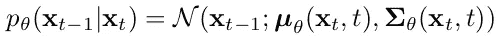

# 论文解读——《基于潜在扩散模型的高分辨率图像合成》

> 原文：[`towardsdatascience.com/paper-explained-high-resolution-image-synthesis-with-latent-diffusion-models-f372f7636d42`](https://towardsdatascience.com/paper-explained-high-resolution-image-synthesis-with-latent-diffusion-models-f372f7636d42)

## 虽然 OpenAI 在自然语言处理领域通过其生成文本模型占据了主导地位，但其图像生成模型 DALL·E 现在面临一个有效的开源竞争者——Stable Diffusion。本文将深入探讨基于 Stable Diffusion 的潜在扩散论文。

 [Mario Larcher](https://mnslarcher.medium.com/?source=post_page-----f372f7636d42--------------------------------)

·发表在[《数据科学前沿》](https://towardsdatascience.com/?source=post_page-----f372f7636d42--------------------------------) ·10 分钟阅读·2023 年 3 月 30 日

--

图 13 的一部分来自于[《基于潜在扩散模型的高分辨率图像合成》](https://arxiv.org/abs/2112.10752)，生成的提示是“潜在空间的油画”。

# 引言

在我撰写这篇文章时，OpenAI 的聊天机器人 ChatGPT 正在通过与微软产品的整合继续获得关注，这些产品被超过十亿人使用。尽管谷歌最近推出了自己的 AI 助手 Bard，其他公司也在该领域取得了进展，但 OpenAI 依然处于前沿，没有明显的竞争对手。有人可能认为，OpenAI 的 **DALL·E**，即**图像生成模型**，在条件和非条件图像生成领域也会同样主导。然而，实际上是一个开源替代品——**Stable Diffusion**，在**受欢迎度和创新性方面领先**。

**本文深入探讨了 Stable Diffusion 背后的科学论文**，旨在提供对这一正在革新图像生成领域的模型的清晰而全面的理解。虽然其他文章提供了该技术的高层次解释，但本文超越了表面，探索了经常被忽视的细节。

# 之前图像生成方法的局限性

在深入分析科学论文[《基于潜在扩散模型的高分辨率图像合成》](https://arxiv.org/abs/2112.10752)中的方法之前，了解该工作所解决的关键问题是至关重要的。

多年来，图像生成主要通过**四类模型**来解决：生成对抗网络（GANs）、变分自编码器（VAEs）、自回归模型（ARMs），以及最近的扩散概率模型（DMs）。

## 生成对抗网络（GANs）

自 2014 年首次出现以来，生成对抗网络（GANs）一直是图像生成领域的主流方法之一。尽管 GANs 在**数据变异性有限**的情况下显示出有前景的结果，但它们也存在一些问题。最著名的问题是**模式崩溃**，在这种情况下，生成器生成的输出范围有限，而不是多样化的图像集。

> **模式崩溃**：这种现象发生在生成器可以交替生成有限数量的输出，来欺骗判别器。通常，GANs 在捕捉完整数据分布方面存在困难。

一般而言，它们的**训练****常常**是**不稳定的**。

## 变分自编码器（VAEs）

变分自编码器（VAEs）是 GANs 的替代方案，提供了几个优势。它们不会遭遇模式崩溃，并且可以高效地生成高分辨率图像。然而，它们的**样本质量****不**总是**可比于** **GANs**。

## 自回归模型（ARMs）

自回归模型（ARMs）在密度估计方面表现出色，并在这一领域取得了显著成果。然而，它们**计算需求高**的架构和顺序采样过程**限制**了它们**仅能生成** **低分辨率图像**。

## 扩散概率模型（DMs）

扩散模型在密度估计和样本质量方面取得了显著进展，但它们在**像素空间**中通过向与原始图像大小相同的张量添加或去除噪声来操作，导致了**推断速度缓慢**和**计算成本高**。例如，即使是相对较小的图像，如尺寸为 512x512 的 RGB 图像，也对应于大约 80 万个值的张量，这使得在训练过程中进行梯度传播和在生成过程中进行迭代的方法时，生成更大图像的计算需求也非常高。

## 条件机制

基于文本描述或其他图像风格生成图像通常是期望的，但**将结果条件化到一个或多个输入** **在之前的方法中一直是一个挑战**。

# 潜在扩散的高级概述

图 3. 来自 [高分辨率图像合成与潜在扩散模型](https://arxiv.org/abs/2112.10752)。

总结科学论文《高分辨率图像合成与潜在扩散模型》中提出的方法，我们可以将其分解为**四个主要步骤**：

1.  第一步是使用位于图上左上角的编码器 *E* **提取** **图像的** 更**紧凑的表示**。与其他方法不同，**潜在扩散在编码器定义的潜在空间中工作**，**而不是在像素空间中**。

1.  接下来，将**高斯噪声添加**到图中上中部的图像中，作为从 *z* 到 *zT* 的**扩散过程**的一部分（假设应用了 *T* 步噪声添加）。

1.  然后，将 *zT* 表示通过位于图中下部中央的**U-Net**。U-Net 的作用是**预测 *zT-1***，这个过程重复 ***T-1* 次，直到我们得到 *z***，然后通过解码器 *D* **将其从潜在空间返回到像素空间**。

1.  最后，该方法允许通过映射各种输入模态（如语义图或文本）进行**任意条件**。这通过首先**使用专用编码器** *τθ* **转换输入** *y* **，然后** **将其映射到 U-Net 的中间层，使用与 Transformer 架构相同的** **交叉注意力层** 实现。

通过这个总体概述，我们现在可以更详细地深入了解这些步骤。

# 感知图像压缩

潜在扩散明确**将图像压缩**阶段分离，以去除高频细节（**感知压缩**），**与生成阶段**分开，在生成阶段模型学习数据的语义和概念组成（**语义压缩**）。

## 目标函数

为了训练用于**图像压缩**的**自编码器**，作者采用了 [《驯化变压器用于高分辨率图像合成》](https://arxiv.org/abs/2012.09841)中**VQGAN**使用的方法。

图 2\. 来源于 [《驯化变压器用于高分辨率图像合成》](https://arxiv.org/abs/2012.09841)。

特别是，用于训练自编码模型 (*E*, *D*) 的**目标函数**是：

方程 25\. 来源于 [《基于潜在扩散模型的高分辨率图像合成》](https://arxiv.org/abs/2112.10752)。

设 *x^* 为 **重建图像** *D(E(x))，Lrec* 是**重建损失**（*x* 和 *x^* 之间的平方误差），*Ladv* 是**对抗损失**，定义为 log*(1 - Dψ(x^))，Dψ* 是一个**基于补丁的判别器**，优化以区分原始图像和重建的“伪造”图像 *x^*（所以 *Dψ(x)* 试图对真实图像 *x* 输出 1，对重建的“伪造”图像 *x^* 输出 0），*，*Lreg* 是**正则化损失**。

## 正则化

作者实验了两种不同的**正则化方法**。

第一种方法涉及低权重的**Kullback-Leibler**项，类似于标准的 VAE。

> **Kullback-Leibler (KL) 惩罚**：Kullback-Leibler 散度是两种分布之间的一种统计距离。在这种情况下，目标是使潜在变量 z ~ N(Eµ , Eσ²) 的分布接近标准正态分布 N(0, 1)。施加这个约束可以通过使潜在空间更加集中来正则化它，因此，例如，如果 z 接近于 z1 和 z2，则 D(z) 将与 D(z1) 和 D(z2) 有某种共同之处。

在第二种方法中，潜在空间通过 **向量量化** 层进行正则化。

> **向量量化 (VQ)**：VQ 是科学论文 [Neural Discrete Representation Learning](https://arxiv.org/abs/1711.00937) 中介绍的 VQVAE 以及之前提到的 VQGAN 所使用的方法。从上面的图像可以看出，对于编码器输出 z^ 的每个空间位置，对应的向量（其大小取决于 z^ 的通道数量）会被替换为在可学习的“代码本”中最接近的向量。这会限制解码器在推理过程中可能的输入，只能是代码本向量的组合（即潜在空间的离散化或量化）。

在 VQ 正则化的潜在空间中，*z* 在量化层之前被提取，并在解码器中吸收量化操作，即它可以被解释为 *D* 的第一层。

# 扩散模型

图 2\. 来自 [Denoising Diffusion Probabilistic Models](https://arxiv.org/abs/2006.11239)。

由于这篇文章讨论的是潜在扩散模型而不是一般的扩散模型，我将只描述它们最重要的方面。首先，让我们区分 **两个过程**：**正向**和**反向**。

## 正向过程

**正向**或 **扩散过程**，即图中从右向左的过程，是一个 **马尔可夫链**，即时间 *t* 的图像仅依赖于时间 *t-1* 的图像，而不是所有之前的图像。每一步，*xt* 都根据以下 **转移概率** 进行采样：

Eq. 2\. 来自 [Denoising Diffusion Probabilistic Models](https://arxiv.org/abs/2006.11239)。

在上面的公式中，*βt* 定义了一个 **方差调度**，可以通过将其视为超参数来学习或保持不变。正向处理的一个有趣特性是可以在任意时间步 *t* 以封闭形式对 *xt* 进行采样。使用符号

和

我们有

Eq. 4\. 来自 [Denoising Diffusion Probabilistic Models](https://arxiv.org/abs/2006.11239)。

所以，总结一下，在正向过程中，我们可以通过从均值和方差由上述公式定义的高斯分布中采样来获取任意时间 *t* 的图像。

## 反向过程

给定正向过程，**逆向** **过程**也遵循高斯分布：

至于方差，作者将其设置为

他们通过实验指出，两者

和

产生等效的结果。

在看到均值的参数化之前，让我们重新参数化等式 4 的正向过程：

此时我们将均值参数化为

其中*ϵθ*是*ϵ*的估计量，来自*xt*，具体来说，它是**时间条件 U-Net**的一个变体。

在这一点上，我们已经具备了采样*xt-1*条件于*xt*所需的所有元素，考虑到我们知道逆过程描述开始时引入的高斯分布的所有参数。

不进入数学细节，目标（简化版）是：

等式 1 来自于 [高分辨率图像合成与潜在扩散模型](https://arxiv.org/abs/2112.10752)。

其中*t* 从 {1, . . . , *T*} 中均匀采样。

## 潜在表示的生成建模

如前所述，Latent Diffusion 的工作方式类似于前面解释的扩散模型。然而，它的不同之处在于它**从通过编码器获得的图像的潜在表示** *z* 开始（**潜在空间**），而不是从图像 *x*（**像素空间**）开始。这一细节大大**减少了计算负担**，因为潜在空间比像素空间更紧凑。

基于此，将*xt*替换为扩散模型目标中的*zt*，我们得到新的目标：

等式 2 来自于 [高分辨率图像合成与潜在扩散模型](https://arxiv.org/abs/2112.10752)。

# 条件机制

在这项研究之前，对于**如何通过输入条件扩散模型**的探索是有限的，输入包括类别标签或模糊版本的输入图像。Latent Diffusion 提出的方案具有很高的通用性，涉及**将** **附加信息直接集成到 U-Net 模型的中间层中，使用交叉注意力**，这类似于 Transformer 架构。

更具体地说，输入信息（如文本）首先通过一个**领域特定的编码器** *τθ* 转换为中间表示（稍后会提供示例）。然后，将该表示传递通过**交叉注意力层**并添加到 U-Net 的中间层：

与

在方程中，*ϕi(zt)*表示 U-Net 的扁平化中间表示，*W*s 是可训练的投影矩阵。尽管论文没有详细说明，代码实现却揭示了**交叉注意力层的输出被加到原始 U-Net 层**中。这可以在以下代码片段中看到：

> x = self.attn2(self.norm2(x), context=context) + x

在这里，attn2 表示交叉注意力层，而上下文指的是*τθ(y)*。虽然这一过程的完整实现更为复杂，但这是关键的概念元素。欲深入了解这一机制，请参考[BasicTransformerBlock](https://github.com/CompVis/latent-diffusion/blob/e66308c7f2e64cb581c6d27ab6fbeb846828253b/ldm/modules/attention.py#L196)模型中使用的模块。

# 实验

图 5\. 来自 [High-Resolution Image Synthesis with Latent Diffusion Models](https://arxiv.org/abs/2112.10752)。

论文进行大量实验探讨了图像生成的各种方法，包括无条件生成、布局到图像合成、空间条件、超分辨率、修补等。为了进一步突出 Latent Diffusion 的两个重要方面，我们将重点关注**文本到图像**这一广为人知的任务。

首要考虑的关键方面是**如何将文本转换**为可以传递给交叉注意力层的表示。作者使用**BERT-tokenizer**并将*τθ*实现为**Transformer**以达到这一目标。

第二个重要方面是通过编码器对输入图像进行压缩的程度。作者尝试了不同的**下采样因子** *f* ∈ {1, 2, 4, 8, 16, 32}，并得出结论认为 4 和 8 提供了最佳的高质量合成结果条件。上述结果是使用 LDM-8 (KL) 获得的。

# 结论

Latent Diffusion 及其后续工作的灵感来源于这篇论文，已取得令人惊讶的成果，这些成果曾被认为难以想象。如今，**这些模型**不再局限于研究实验室，而是**被集成到流行产品中**，如 Adobe Photoshop。这一发展标志着人工智能领域的一个重要里程碑，并展示了它对我们生活各个方面的潜在影响。

然而，尽管在这一领域取得了显著进展，但仍然存在一些需要解决的挑战。这些挑战包括**版权问题**，涉及使用图像训练 AI 模型，以及在从互联网爬取大型数据集时出现的固有**偏见**。然而，尽管存在这些限制，AI 有能力**民主化创造力**并使个人能够以新颖和引人入胜的方式表达自己，这一潜力不容忽视。

感谢你花时间阅读这篇文章，欢迎留下评论或与我联系，分享你的想法或提出任何问题。要及时了解我最新的文章，你可以在[Medium](https://medium.com/@mnslarcher)、[LinkedIn](https://www.linkedin.com/in/mnslarcher/)或[Twitter](https://twitter.com/mnslarcher)上关注我。

 [## 通过我的推荐链接加入 Medium - Mario Namtao Shianti Larcher

### 阅读 Mario Namtao Shianti Larcher（以及 Medium 上其他成千上万的作者）的每一个故事。你的会员费…

[medium.com](https://medium.com/@mnslarcher/membership?source=post_page-----f372f7636d42--------------------------------)
