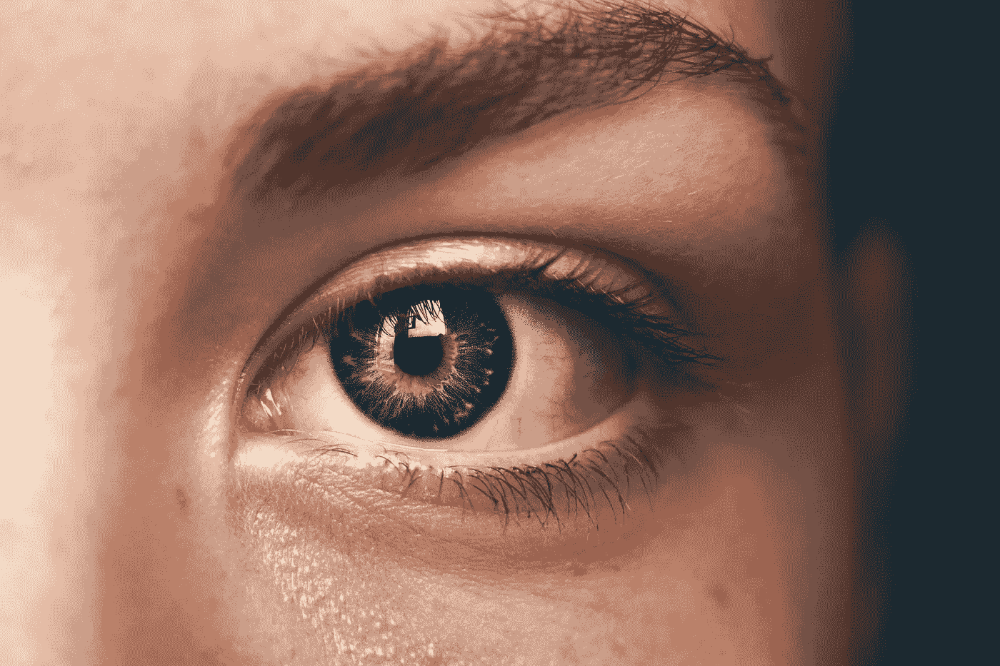
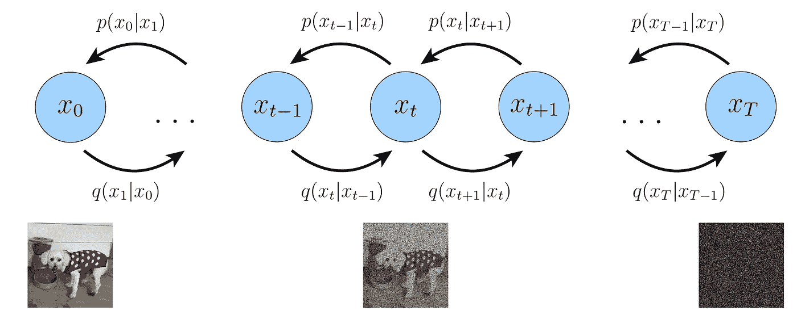
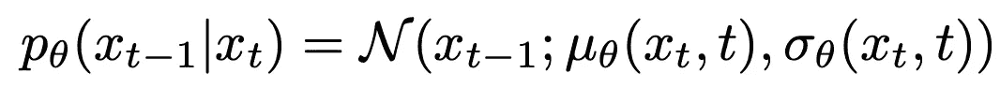
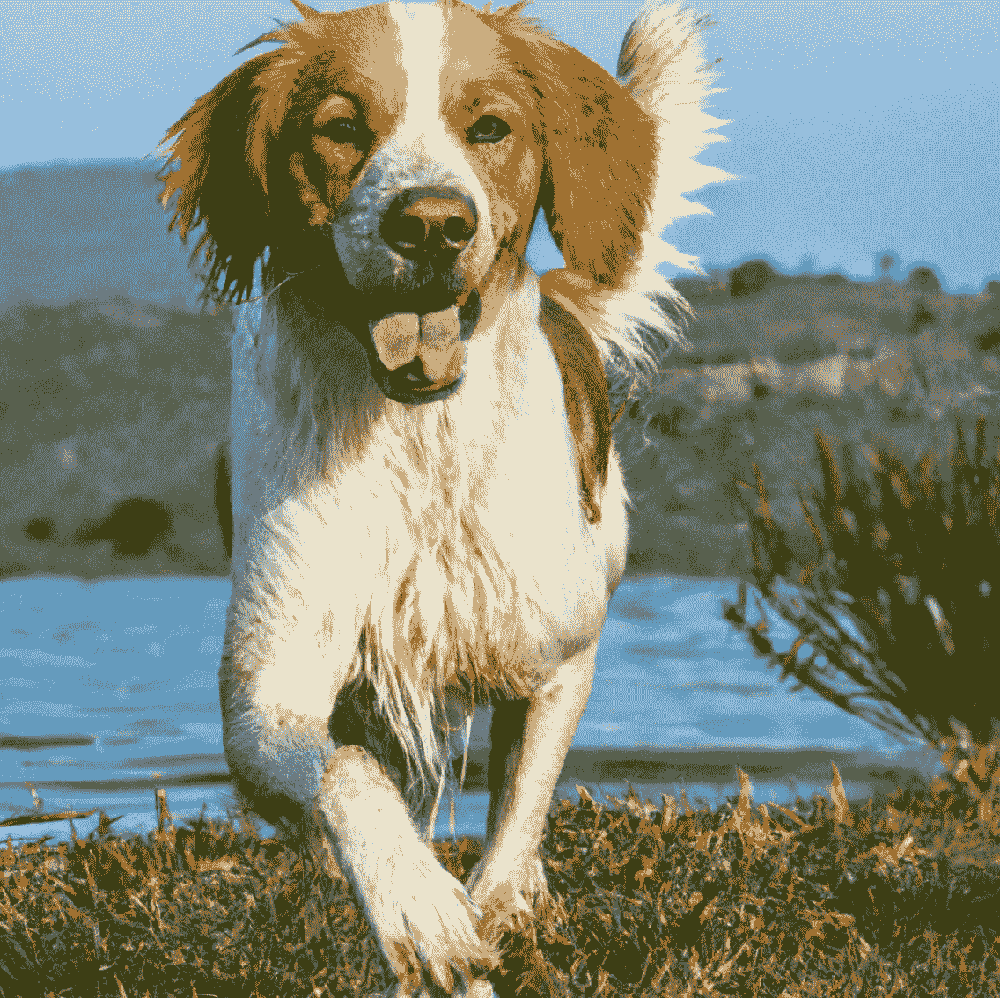
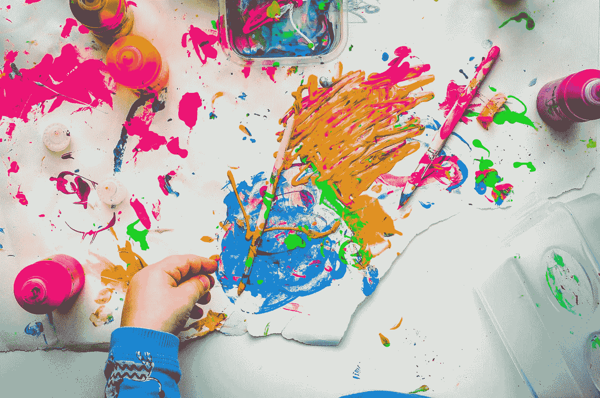
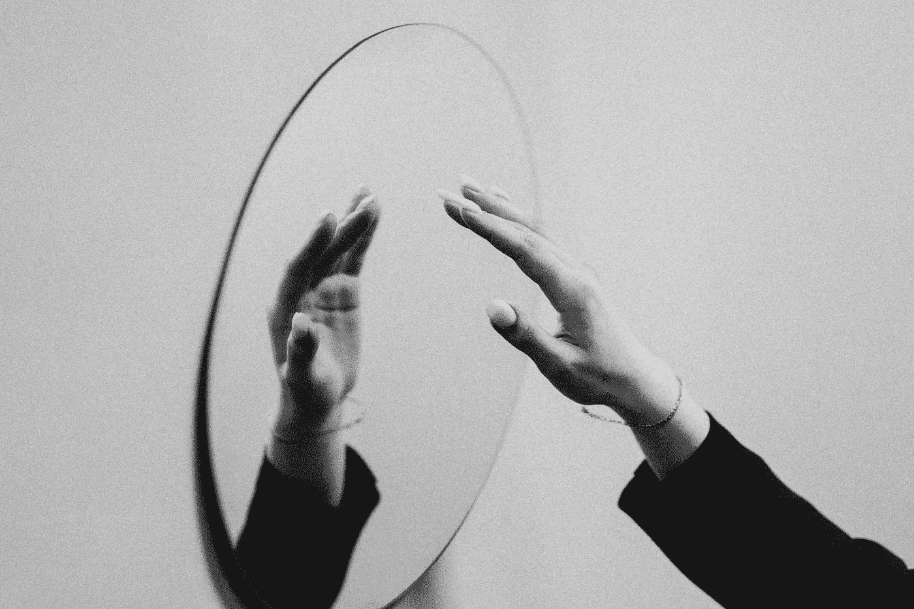

# 论文综述：深度解析 Imagen

> 原文：[`towardsdatascience.com/paper-review-a-deep-dive-into-imagen-4e5b4092af13?source=collection_archive---------13-----------------------#2023-02-01`](https://towardsdatascience.com/paper-review-a-deep-dive-into-imagen-4e5b4092af13?source=collection_archive---------13-----------------------#2023-02-01)

## 对谷歌令人印象深刻的新型文本到图像生成工具的批判性分析

 [Jamie McGowan](https://j-w-mcgowan18.medium.com/?source=post_page-----4e5b4092af13--------------------------------)

·

[关注](https://medium.com/m/signin?actionUrl=https%3A%2F%2Fmedium.com%2F_%2Fsubscribe%2Fuser%2F685229ed4b15&operation=register&redirect=https%3A%2F%2Ftowardsdatascience.com%2Fpaper-review-a-deep-dive-into-imagen-4e5b4092af13&user=Jamie+McGowan&userId=685229ed4b15&source=post_page-685229ed4b15----4e5b4092af13---------------------post_header-----------) 发表在 [Towards Data Science](https://towardsdatascience.com/?source=post_page-----4e5b4092af13--------------------------------) · 13 分钟阅读 · 2023 年 2 月 1 日 

--

图片由 [Amanda Dalbjörn](https://unsplash.com/@amandadalbjorn?utm_source=medium&utm_medium=referral) 提供，来源于 [Unsplash](https://unsplash.com/?utm_source=medium&utm_medium=referral)

文本到图像合成是**多模态学习**领域的一个研究方向，最近在这一领域取得了许多进展[1–4]。这篇综述将重点讨论文章*《具有深度语言理解的逼真文本到图像扩散模型》*[1]。

在这里，作者试图实现最先进的**逼真度**，并提供对文本到图像合成中更深层次的语言理解的见解。本文的主要输出是一个名为‘Imagen’的模型，它改进了文献中以前的文本到图像合成模型[2–4]。

你可以在[**这里**](https://imagen.research.google/)查看更多关于 Imagen 的信息！

# 什么是扩散模型？

正如论文标题所示，Imagen 是一个扩散模型。

简而言之，扩散模型是基于**生成式 AI**的一个例子，其过程是从输入***x***⁰开始，在每一层*t*逐渐加入高斯噪声，直到达到纯噪声表示***x****ᵀ*，其中*T*是最终层。

这受非平衡**热力学**的启发，其中状态通过扩散演变为**均匀**，只要时间足够长。

显示前向和背景扩散过程的图示。图片来自[16]。

扩散模型通过学习逆转这一过程，试图**生成**原始的***x***⁰（在这种情况下，***x***⁰是一张图像）。请参见上面的图示以获得视觉帮助。

该模型的目标是对描述每一步*t*反向扩散过程的**条件概率**进行参数化：

描述反向扩散过程的方程。图片由作者创建。

其中***x***ᵗ⁻¹（上一个时间步骤）的表示从**高斯**分布中绘制，特征是均值μ和协方差σ，模型权重为θ。

由于扩散过程在每一步的去噪过程中保持了图像，这导致数据与预测之间的**亲密**连接，相比其他非扩散基于文本到图像生成器[4–7]。结果通常是，扩散模型[1–3]的输出更**逼真**。

一旦使用基础扩散模型构建一个 64 × 64 像素的图像，Imagen 会利用另外两个**超分辨率**扩散模型进行上采样 64 × 64 → 256 × 256 → 1024 × 1024。最终结果因此是一个高分辨率的 1024 × 1024 像素图像，如下图所示！

请注意，这张图片实际上来自 DALL-E 2 [2]，因为谷歌对 Imagen 有一些限制！概念是一样的，但请确保查看 Imagen 论文以获取实际的图片。

DALL-E 2 的一个示例输出，文本提示为“时代广场上的滑板上的泰迪熊”。图片来自[2]。

本综述将简要概述以前的工作，然后汇总作者提出的主要贡献和结果，并讨论这些贡献，提供我个人对该工作的**意见**。

# 之前的工作

虽然实现文本生成图像已经有若干年，但早期的工作**困难**地将多个文本概念现实地结合到一幅图像中 [5–7]。

基于这些不足，OpenAI 在 [4] 中发布了 DALL-E，它能够将多个看似**不相关的概念**逐行组合成一幅图像——给定文本提示和图像的起始（第一行像素）。

不到 12 个月后，OpenAI 通过 GLIDE [3] 重新制定了他们的文本到图像合成方法。作者展示了 GLIDE 在各种设置中因**照片真实感**和**标题相似性**而被人类评估者偏好，从而确立了扩散模型在文本到图像生成中的主导地位。

最后，在 [2] 中，DALL-E 2 通过基于从文本提示中找到的**图像嵌入**生成图像，从而进一步改进了 GLIDE。

注意到在这个时间段内还有其他进展，但我主要集中在**三大主要贡献**上，这些贡献构成了 Imagen [1] 的基础。

# 主要贡献

## **架构**

类似于 GLIDE [3] 和 DALL-E 2 [2]，Imagen 是一个扩散模型，在其**架构**上似乎与 GLIDE 非常接近（即，它将文本嵌入作为输入，并从噪声中生成图像）。然而，Imagen 的一个关键区别是，**文本嵌入**来自大型*现成的*语言模型（LMs）。

[1]的主要发现之一是，结合在仅文本数据上训练的**大型冻结语言模型**，在获取文本到图像合成的文本表示时非常有用。

此外，作者探讨了文本编码器的扩展，发现扩展语言模型的规模**显著提高**了结果，远超扩展扩散模型的规模。[1]中图 4a 的最左侧图表总结了这一结果，显示 T5-XXL LM [8]生成了**更高质量**的图像（↓ FID 分数）和更好的标题兼容性（↑ CLIP 分数）。

作者还引入了一种新技术，以避免在无分类器引导的图像生成中出现饱和像素。

*分类器引导* 被引入以通过预训练模型提高生成图像的质量，该模型在测试时推动输出更**忠实**于文本输入 [9]。

*无分类器引导* [10] 通过从输入噪声生成两个样本（输出），一个有文本条件，一个没有，避免了对预训练模型的需求。

通过在特征空间中找到这两个样本之间的**差异**，可以找出文本在图像生成中的效果。通过调整这种文本效应，图像生成可以引导至更好的**图像-文本对齐**（通过不同强度的引导权重 *w*）。

到目前为止，这些都不算新鲜，然而这种指导的一个问题是，当*w*很大时，像素可能会饱和，**图像保真度**会因为更好的图像-文本对齐而受到损害。因此，作者引入了*动态阈值*，通过在每次采样步骤***x***ᵗ时确定的不同量将饱和像素从[-1, 1]推向内部（因此是动态的）。作者声称，在图像生成中，高度指导下**逼真度**和**图像-文本对齐**有显著提升。

最后，在模型架构方面，作者提出了一种新的 U-Net [11]变体，该变体比以前的版本**更简单**且**更高效**。根据我的了解，关键修改是去除了超分辨率模型中的自注意力层，这些模型来自于[11–12]的 U-Net 模型。

## **DrawBench**

对未来文本到图像合成研究的另一个重要贡献是**DrawBench**的发布。

DrawBench 是一个‘挑战性’评估基准文本提示的集合，探测模型处理复杂概念如组合性、基数和空间关系的能力。

本次发布的理念是提供一个包含一些非常**奇怪的文本提示**的评估基准，以确保图像之前从未存在过。因此，理论上，这应该将模型推向其想象力和**能力**的极限，以生成复杂图像。

## 定量结果

图片由[Maxim Hopman](https://unsplash.com/@nampoh?utm_source=medium&utm_medium=referral)拍摄，来源于[Unsplash](https://unsplash.com/?utm_source=medium&utm_medium=referral)。

作者在[1]中展示的定量结果对比了不同模型在 COCO [15]和 DrawBench 文本提示上的表现。

作者发现，与 DALL-E 2 [2]、GLIDE [3]、Latent Diffusion [14]和 CLIP-guided VQ-GAN [13]模型进行成对比较时，DrawBench 上的人工评估结果对 Imagen 表现出强烈的偏好（见[1]中的图 3）。这些结果作为**标题对齐**和**保真度**的衡量标准。

同时，COCO 验证集上的结果似乎在不同模型之间没有表现出太大差异——这可能是作者没有对此过多停留的原因。

然而，对 COCO 数据集的一个有趣观察是，Imagen 在生成逼真的人物方面有**有限的能力**——尽管作者没有提供任何关于 Imagen 生成人物效果差的定性例子。

# 讨论

在引言中，[1]的作者提到以下声明：

> [Imagen 交付]了前所未有的逼真度和深层次的语言理解能力，在文本到图像合成中。

在调查这一声明的前半部分时，作者展示了 Imagen 与 DALL-E 2 生成图像之间的几种**定性比较**。他们还提供了人类评估实验的结果，询问人们从单个文本提示或标题中选择最**写实**的图像。

即使在考虑任何结果之前，作者立即在他们的分析中引入了人类评估实验中固有的**主观性**。因此，文献[1]中显示的结果必须谨慎考虑，并持有健康的**怀疑态度**。

一个来自 DALL-E 2 的示例输出，文本提示为“狗在湖边的绿色田野里玩耍的高质量照片”。图像来自[2]。

为了提供这些结果的背景，作者选择了一些示例比较展示给人类评分者，并将其包含在附录中（一定要查看这些示例——作为动机，我在上面添加了一个来自 DALL-E 2 的示例）。

然而，即使有这些例子，我发现很难对哪张图像更具优先性做出明确判断。考虑到上图中显示的复制例子，我个人认为一些 DALL-E 2 生成的图像比 Imagen 的图像**更具照片写实性**，这展示了在收集这类结果时主观性的问题。

作者选择询问人类评分者*“哪张图像更具照片写实性？”*以及每个*“标题是否准确描述了图像？”*在评估过程中。然而，评估这些指标的**不连续**性质让我感到相当担忧。

例如，如果我们有两张卡通图像（这些图像可能不太现实），并且评分者被要求选择其中一张。就照片写实性指标而言，所选择的图像将具有与从另一批次中选择的更**真实**的图像相同的现实水平（即不是卡通图像）。

显然，图像批次的标题与可以实现的**照片写实性**之间存在一定的相互作用。因此，探索根据难度加权某些文本提示，将会有趣，以尝试创建一个**连续的**度量标准，该标准可以更可靠地**汇总**。

同样，在标题对齐的情况下，评分者在三个**类别**选项中选择标题是否与生成的图像对齐（*是*、*有些*和*否*）。这些实验结果试图支持上述引言的后半部分（声称*深层次的语言理解*）。

确实，对于标题对齐，可以说在文本提示中的关系和概念是否在图像生成中被**捕捉**，有一个更**明确**的答案（即比起照片写实性主观性更低）。

然而，我再次认为应该使用更**连续**的度量标准，例如 1-10 的对齐评分。根据上述讨论，所有字幕的不同难度等级也会表现为**较低的字幕对齐度**。有趣的是，探讨让评估者在评价过程中评估字幕或文本提示的难度，并帮助**标准化**数据集和度量标准。

图片来源：[Mitchell Luo](https://unsplash.com/@mitchel3uo?utm_source=medium&utm_medium=referral)于[Unsplash](https://unsplash.com/?utm_source=medium&utm_medium=referral)

随着这一研究领域的发展和生成图像变得越来越令人印象深刻和**富有创意**，这种评估方法自然会变得不那么可靠（当然，这是一个好问题）。因此，希望看到作者讨论询问评估者更多具体问题的潜力，以评估模型所捕捉的创造力、构图性、数量关系和空间关系。

如果生成的两张图像同样令人印象深刻，向评估者提出更多**具体**的问题可以帮助区分模型在这一非常高的水平上的表现。

作为一个例子，文本到图像生成的一个应用是帮助**生成****插图**。因此，评估解释文本提示时的创造力和变化性是有充分理由的。

在之前展示的例子中，DALL-E 2 [2] 在解释*‘眼镜’*时比 Imagen 有更多的方式，因此可以认为 DALL-E 2 是**更具创意**的模型？

从这个角度来看，论文的一个**主要批评**是所选择的度量标准过于侧重于 Imagen 的优势。不同应用中表现良好的模型的最佳指示（度量）将**依赖于**具体应用（即*没有免费的午餐!*）。

因此，我很想听听作者对如何**严格评估**这些模型的不仅仅是忠实度和字幕对齐度的看法。

图片来源：[Dragos Gontariu](https://unsplash.com/@dragos126?utm_source=medium&utm_medium=referral)于[Unsplash](https://unsplash.com/?utm_source=medium&utm_medium=referral)

根据[1]，DrawBench 的发布被认为是对文本到图像研究领域的必要贡献，因为它提供了一套*全面*的挑战性文本提示场景。

虽然我同意大部分观点，但根据围绕这一论点的讨论，我尚未被说服这是一项*全面*的基准。如果深入探索 DrawBench，会发现仅包括约 200 个文本提示/字幕，分布在 11 个类别中，这在初看时显得相当少。

这种担忧在与 COCO 数据集 [15] 比较时愈发加深，该数据集包括 330K 张图像，每张图像有 5 个标题，涵盖了更广泛的类别。个人认为，作者应该讨论他们声称这是一个*全面*集的**推理**。

此外，随着文本到图像合成的快速进展，我认为 DrawBench 是该领域的**动态** **目标**。因此，希望能够看到讨论调整或添加这些标题的可能性。

由于 DrawBench 是与 Imagen 一起呈现的，因此有理由对选择 200 个提示以获得对 Imagen 有利的结果是否存在某种**担忧**。

再次比较 Imagen 和基准模型在 COCO [15] 和 DrawBench 上评估的结果，COCO 的结果似乎**在模型之间更接近**，而 DrawBench 的结果则显示 Imagen 似乎远高于所有基准模型。

这可能是因为 DrawBench 是一个**自然**难度较大的提示集，而 Imagen 能够处理这些提示是由于其预训练的 LM，或者 DrawBench 可能对 Imagen 的优势存在偏见？确实，作者在构建 DrawBench 时承认存在一些偏见，**未包含**任何图像生成中的人物。

最后，当模型（或代码）未发布时，批评研究很容易，尤其是当存在巨大的财务获利潜力时（作者并未提及这一点）。

然而，我认为其中的社会和伦理推理是该论文的**最佳** **贡献**之一，并且突显了在发布强大的开源 AI 软件时需要某种形式的**治理**。

[Михаил Секацкий](https://unsplash.com/@sekatsky?utm_source=medium&utm_medium=referral) 在 [Unsplash](https://unsplash.com/?utm_source=medium&utm_medium=referral) 上的照片

从更广泛的意义上讲，生成模型自然地反映了社会，这对社会研究小组甚至政府可能是**有益的**，前提是他们能够访问**未经筛选**的模型版本。

# 结论

总结来说，作者在文本到图像合成领域的快速增长中做出了**重大**贡献。

虽然出于社会和伦理原因目前不对公众开放，但最终的模型‘Imagen’结合了诸如使用*现成*文本编码器、动态阈值设定和更高效的 U-Net 架构用于基础和超分辨率层等新技术。

我个人很享受阅读这篇论文，我认为所做的贡献是令人兴奋和有趣的领域发展。

图片由 [Arnold Francisca](https://unsplash.com/@clark_fransa?utm_source=medium&utm_medium=referral) 提供，来自 [Unsplash](https://unsplash.com/?utm_source=medium&utm_medium=referral)

然而，尽管结果令人印象深刻，但深入研究后我发现，作者往往**过度宣传** Imagen 和 DrawBench。因此，观察（也许在未来的出版物中，或从获得 Imagen 访问权限的研究人员中）更**广泛**的文本到图像生成模型评估将会很有趣。

# 参考文献

[1] — Chitwan Saharia 等人，照片级文本到图像生成

深度语言理解的扩散模型，arXiv:2205.11487，（2022）。

[2] — Aditya Ramesh 等人，基于 CLIP 潜变量的层次化文本条件图像生成，arXiv:2204.06125，（2022）。

[3] — Alex Nichol 等人，Glide：朝向照片级图像生成与编辑的文本引导扩散模型，arXiv:2112.10741，（2021）。

[4] — Aditya Ramesh 等人，零样本文本到图像生成，ICML，8821 — 8831，PMLR，（2021）。

[5] — Han Zhang 等人，Stackgan++：利用堆叠生成对抗网络进行逼真图像合成，《IEEE 计算机视觉与模式识别学报》，41(8):1947–1962，（2018）。

[6] — Tero Karras 等人，分析与改善 stylegan 图像质量，发表于《IEEE/CVF 计算机视觉与模式识别会议论文集》，8110 — 8119，（2020）。

[7] — Mark Chen 等人，基于像素的生成预训练，ICML，1691 — 1703，PMLR，（2020）。

[8] — Colin Raffel 等人，探索统一文本到文本转换器的迁移学习极限，arXiv:1910.10683，（2019）。

[9] — Prafulla Dhariwal 和 Alexander Nichol，扩散模型在图像合成中的表现优于 GANs，NeurIPS，34，（2021）。

[10] — Jonathan Ho 和 Tim Salimans，无分类器扩散引导，发表于 NeurIPS 2021 深度生成模型与下游应用研讨会，（2021）。

[11] — Alex Nichol 和 Prafulla Dhariwal，改进的去噪扩散概率模型，ICML，8162–8171，PMLR，（2021）。

[12] — Chitwan Saharia 等人，Palette：图像到图像的扩散模型，arXiv:2111.05826，（2021）。

[13] — Katherine Crowson 等人，VQGAN-CLIP：利用自然语言指导的开放域图像生成与编辑，arXiv:2204.08583，（2022）。

[14] — Robin Rombach 等人，高分辨率图像

基于潜在扩散模型的合成，arXiv:2112.10752，（2021）。

[15] — Tsung-Yi Lin 等人，Microsoft COCO：上下文中的常见对象，发表于《欧洲计算机视觉会议论文集》，740 — 755，Springer，（2014）。

[16] — Calvin Luo，理解扩散模型：一个统一视角，arXiv:2208.11970，（2022）。
