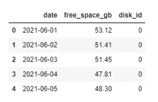
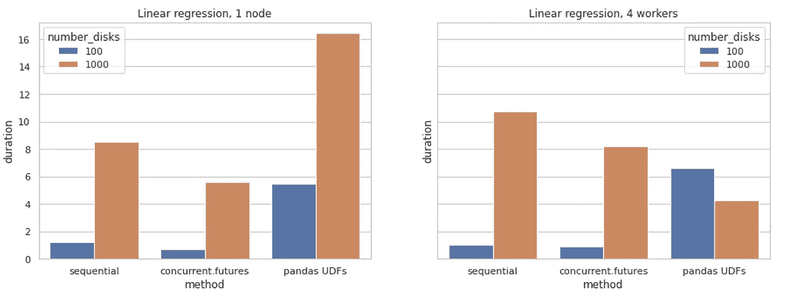
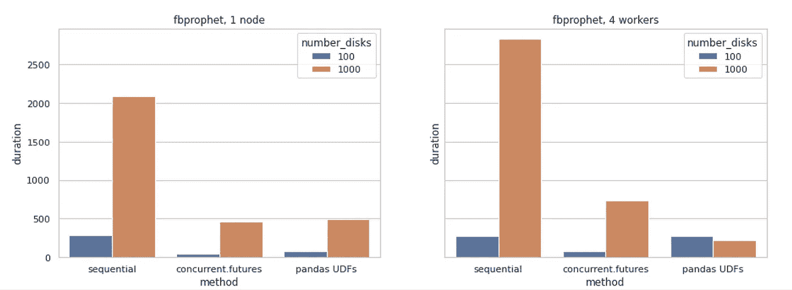
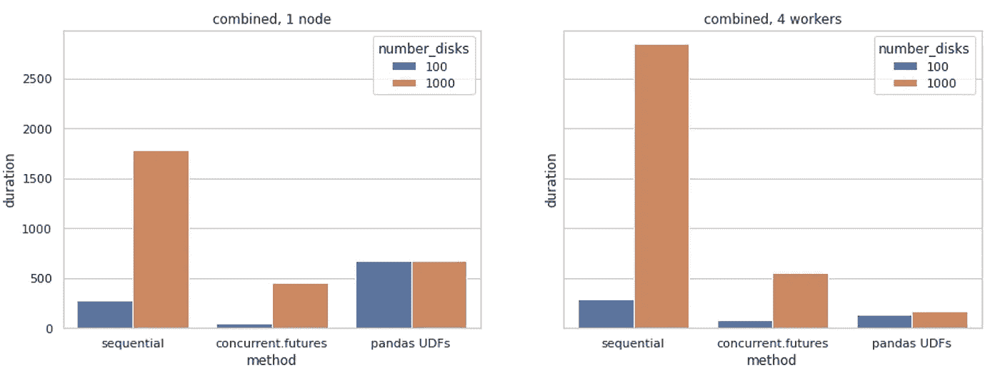

# 在 Pandas 中并行化 Python：使用 Spark 的并发选项

> 原文：[`towardsdatascience.com/parallelising-python-on-spark-options-for-concurrency-with-pandas-7ca553b9f265?source=collection_archive---------8-----------------------#2023-11-18`](https://towardsdatascience.com/parallelising-python-on-spark-options-for-concurrency-with-pandas-7ca553b9f265?source=collection_archive---------8-----------------------#2023-11-18)

## 当使用 Pandas 时，利用 Spark 的优势

[Matt Collins](https://medium.com/@mc12338?source=post_page-----7ca553b9f265--------------------------------)

·

[关注](https://medium.com/m/signin?actionUrl=https%3A%2F%2Fmedium.com%2F_%2Fsubscribe%2Fuser%2Fd1970f1605f1&operation=register&redirect=https%3A%2F%2Ftowardsdatascience.com%2Fparallelising-python-on-spark-options-for-concurrency-with-pandas-7ca553b9f265&user=Matt+Collins&userId=d1970f1605f1&source=post_page-d1970f1605f1----7ca553b9f265---------------------post_header-----------) 发表在[Towards Data Science](https://towardsdatascience.com/?source=post_page-----7ca553b9f265--------------------------------) ·8 分钟阅读·Nov 18, 2023

--

照片由[Florian Steciuk](https://unsplash.com/@flo_stk?utm_source=medium&utm_medium=referral)在[Unsplash](https://unsplash.com/?utm_source=medium&utm_medium=referral)上拍摄。

在我之前的工作中，我花了一些时间在一个内部项目上，为我们的托管服务客户预测未来的磁盘存储空间使用情况。每个磁盘都有自己的使用模式，这意味着我们需要为每个磁盘建立单独的机器学习模型，这些模型利用历史数据逐盘预测未来的使用情况。尽管执行预测和选择正确的算法本身就是一个挑战，但在大规模执行时也有其自身的问题。

为了利用更先进的基础设施，我们可以考虑摆脱顺序预测，通过并行化工作负载来加快预测操作。本文旨在比较 Pandas UDF 和 ‘concurrent.futures’ 模块，这两种并发处理的方法，并确定每种方法的适用场景。

# 挑战

Pandas 是 Python 中用于处理数据集的入口包。在处理 DataFrames 时，我们能够对数据进行分析和评估数据质量，执行探索性数据分析，构建数据的描述性可视化，并预测未来趋势。

尽管这是一个很好的工具，但 Python 的单线程特性意味着在处理更大的数据集时，或者在需要对多个数据子集执行相同分析时，它的扩展性较差。

在大数据领域，我们期望采取更复杂的方法，因为我们还需关注扩展性以保持良好的性能。Spark 以及其他语言使我们能够利用分布式处理来帮助处理更大更复杂的数据结构。

在深入这个具体例子之前，我们可以总结一些数据处理并发需求的用例：

+   对多个数据文件应用统一转换

+   为多个数据子集预测未来值

+   调整机器学习模型的超参数并选择最有效的配置

当我们需要执行如上所述的工作负载时，在 Python 和 Pandas 中最简单的方法是顺序处理这些数据。对于我们的例子，我们将对每个磁盘依次运行上述流程。

# 数据

在我们的例子中，我们有成千上万的磁盘数据，显示了随时间记录的空闲空间，我们希望预测每个磁盘的未来空闲空间值。

为了更清晰地描述情况，我提供了一个包含 1,000 个磁盘的 csv 文件，每个磁盘有一个月的以 GB 为单位的空闲空间历史数据。这一数据量足以让我们看到不同方法在大规模预测中的影响。

作者提供的图像：示例 DataFrame

对于像这样的时间序列问题，我们希望使用历史数据来预测未来的趋势，并且我们希望了解对于每个磁盘哪种机器学习（ML）算法将最合适。像 AutoML 这样的工具在寻找一个数据集的适当模型时非常有效，但对于我们这里的 1,000 个数据集来说则有些过于复杂了。

在这种情况下，我们将限制要比较的算法数量为两个，并查看每个磁盘使用均方根误差（RMSE）作为验证指标时最适合使用的模型。关于 RMSE 的更多信息可以在 [这里](https://www.statology.org/how-to-interpret-rmse/) 找到。这些算法包括：

+   线性回归

+   Fbprophet（将数据拟合到更复杂的线条）

+   Facebook 的时间序列预测模型。

+   为了更复杂的季节性超参数预测而建立。

现在，我们已经准备好所有组件，如果我们想预测单个磁盘的未来剩余空间。操作步骤如下：

作者提供的图像：数据生命周期

现在，我们希望将此扩展，对多个磁盘执行此流程，例如我们的示例中的 1,000 个。

作为我们评估的一部分，我们将比较在不同规模下计算不同算法的 RMSE 值的性能。因此，我创建了一个包含前 100 个磁盘子集的子集来模拟这一点。

这应该对不同大小的数据集上的性能提供一些有趣的见解，执行各种复杂度的操作。

# 引入并发性

Python 以单线程著称，因此不会在某一时间点利用所有可用的计算资源。

因此，我看到了三个选项：

1.  实现一个 for 循环，顺序计算预测，采用单线程方法。

1.  使用 Python 的 [futures](https://docs.python.org/3/library/concurrent.futures.html) 模块同时运行多个进程。

1.  使用 Pandas UDFs（用户定义的函数）在 PySpark 中利用分布式计算，同时保持我们的 Pandas 语法和兼容的包。

我希望在不同的环境条件下进行相当深入的比较，因此使用了一个单节点的 Databricks 集群和另一个具有 4 个工作节点的 Databricks 集群，以利用 Spark 进行我们的 Pandas UDF 方法。

我们将采用以下方法来评估线性回归和 fbprophet 模型在每个磁盘上的适用性：

+   将数据分割为训练集和测试集

+   使用训练集作为输入，在测试集日期上进行预测

+   将预测值与测试集中的实际值进行比较，以获取均方根误差（RMSE）分数

我们将在输出中返回两件事情：一个带有预测的修改后的 DataFrame，为我们提供绘制和比较预测与实际值的额外好处，以及一个包含每个磁盘和算法的 RMSE 分数的 DataFrame。

执行此操作的函数如下所示：

我们将比较上述概述的三种方法。我们有几个不同的场景，因此可以填写一个表格，列出我们收集结果的标准：

使用以下组合：

## 方法

+   顺序

+   futures

+   Pandas UDFs

## 算法

+   线性回归

+   Fbprophet

+   组合（每个磁盘的两种算法）——最有效的比较方式。

## 集群模式

+   单节点集群

+   标准集群，4 个工作节点

## 磁盘数量

+   100

+   1000

结果以这种格式呈现在本博客的附录中，如果您想进一步查看。

# 方法

## 方法 1：顺序

## 方法 2：concurrent.futures

使用此模块有两个选项：并行内存密集型操作（使用 ThreadPoolExecutor）或 CPU 密集型操作（ProcessPoolExecutor）。关于这一点的描述性解释可以在以下[博客](https://medium.com/@bfortuner/python-multithreading-vs-multiprocessing-73072ce5600b)中找到。由于我们将处理 CPU 密集型问题，ProcessPoolExecutor 适合我们要实现的目标。

## 方法 3：Pandas UDFs

现在我们将切换到 Spark 并利用分布式计算来提高效率。由于我们使用的是 Databricks，大部分 Spark 配置已经为我们完成，但我们对数据的通用处理仍有一些调整。

首先，将数据导入到 PySpark DataFrame：

我们将使用 Pandas 分组映射 UDF（PandasUDFType.GROUPED_MAP），因为我们想传入一个 DataFrame 并返回一个 DataFrame。自 [Apache Spark 3.0](https://databricks.com/blog/2020/05/20/new-pandas-udfs-and-python-type-hints-in-the-upcoming-release-of-apache-spark-3-0.html) 起，我们不再需要显式声明此装饰器！

由于 PySpark 中的 DataFrame 结构，我们需要将 fbprophet、回归和 RMSE 函数拆分为 Pandas UDFs，但不需要对代码进行大规模重构即可实现。

我们可以使用`applyInPandas`来生成我们的结果。

注意：上述示例仅演示了使用线性回归的过程以提高可读性。有关完整演示，请参阅完整的[笔记本](https://github.com/MattPCollins/ConcurrentModelTraining/blob/main/concurrent_model_training.ipynb)。

# 结果解读

作者提供的图片：每种建议方法的预测算法执行时间

我们为不同的方法和不同的环境设置创建了图表，然后按算法和磁盘数量对数据进行分组，以便于比较。

请注意，表格结果见本帖的附录。

我已经总结了这些发现的亮点，如下所示：

+   正如预期的那样，预测 1,000 个磁盘与 100 个磁盘相比是（通常）一个更耗时的过程。

+   顺序方法通常是最慢的，无法有效利用底层资源。

+   对于较小、更简单的任务来说，Pandas UDFs 效率很低。数据转换的开销更高 — 并行化有助于弥补这一点。

+   顺序和`concurrent.futures`方法都没有意识到 Databricks 提供的聚类 —— 无法利用额外的计算资源。

# 结语

当然，背景在确定最成功的方法时起着重要作用，但考虑到 Databricks 和 Spark 通常用于大数据问题，我们可以看到在处理这里今天看到的那些更大更复杂的数据集时使用 Pandas UDFs 的好处。

当处理较小数据集时，使用 Spark 环境可以通过`concurrent.futures`模块在较小（且成本更低！）计算配置上以极高的效率完成，因此在设计解决方案时请记住这一点。

如果您熟悉 Python 和 Pandas，那么从在初学者教程中看到的顺序 for 循环方法转变，对于任何一种方法都不应该是一种费力的学习曲线。

我们在本文中没有进行深入调查，因为我发现当前版本存在差异和不兼容性，但最近的`pyspark.pandas`模块在未来肯定会更常见，并且是一个值得关注的方法。该 API（以及由 Databricks 开发的 Koalas，现已退役）利用了 Pandas 的熟悉性以及 Spark 的底层优势。

为了演示我们试图实现的效果，我们只查看了每个磁盘生成的 RMSE 值，而没有实际预测未来的时间序列值。我们在这里设置的框架可以以同样的方式应用于此，具有确定算法使用情况的逻辑，以及在可能情况下使用确定的算法预测未来值，其中包括评估指标（以及其他逻辑，例如磁盘的物理限制）是否适合每种情况。

总是可以在我的[GitHub](https://github.com/MattPCollins/ConcurrentModelTraining)找到这个笔记本。

# 附录

*最初发布于* [*https://blog.coeo.com*](https://blog.coeo.com/parallelising-python-on-spark-different-approaches)，为了本次转载做了调整*。*
