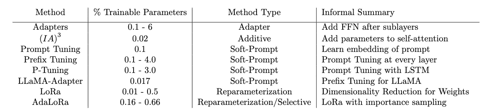

# LLMs 的参数高效微调 (PEFT)：全面介绍

> 原文：[`towardsdatascience.com/parameter-efficient-fine-tuning-peft-for-llms-a-comprehensive-introduction-e52d03117f95`](https://towardsdatascience.com/parameter-efficient-fine-tuning-peft-for-llms-a-comprehensive-introduction-e52d03117f95)

## 对 Hugging Face、Google 的 Vertex AI 和最终 OpenAI 使用的 PEFT 方法进行概念性调查

[](https://medium.com/@smsmith714?source=post_page-----e52d03117f95--------------------------------)[](https://towardsdatascience.com/?source=post_page-----e52d03117f95--------------------------------) [肖恩·史密斯](https://medium.com/@smsmith714?source=post_page-----e52d03117f95--------------------------------)

·发表在 [Towards Data Science](https://towardsdatascience.com/?source=post_page-----e52d03117f95--------------------------------) ·19 分钟阅读·2023 年 8 月 22 日

--


图片由 DALL-E 创建。《大碗岛上的一个星期天下午》，但每个人都是类人。

大型语言模型（LLMs）的名字就意味着它们很大。这些模型通常具有从 70 亿到 700 亿个参数。以全精度加载一个 700 亿参数的模型需要 280 GB 的 GPU 内存！要训练这个模型，你需要在数百万或数十亿个文档上更新数十亿个标记。更新这些参数所需的计算量很大。这些模型的自监督训练成本很高，[公司最高花费可达 1 亿美元](https://www.wired.com/story/openai-ceo-sam-altman-the-age-of-giant-ai-models-is-already-over/)。

对于我们来说，适应我们的数据以适配这些模型引起了显著的兴趣。面对有限的数据集（相比之下）和缺乏计算能力，我们如何在成本的一小部分下创建可以超越主要竞争者的模型？

这就是参数高效微调（PEFT）研究领域的作用所在。通过各种技术，我们可以增强这些模型的小部分，使它们更适合我们要完成的任务。

阅读本文后，你将概念性地掌握 Hugging Face 中应用的每种 PEFT 技术，并能够区分它们之间的差异。在这篇文章之前，我发现的一个最有帮助的概述来自 [Reddit 评论](https://www.reddit.com/r/MachineLearning/comments/14pkibg/d_is_there_a_difference_between_ptuning_and/jqkdam8/?utm_source=share&utm_medium=web3x&utm_name=web3xcss&utm_term=1&utm_content=share_button)。此外，lightning.ai（pytorch lightning 的创作者）还有另一篇 [杰出文章](https://lightning.ai/pages/community/article/understanding-llama-adapters/)。另外，还有一篇基于大量此文的全面调查，由 Liali 等人撰写 [2]。在我的文章中，我旨在解决在审阅这些材料时识别出的空白点。在撰写本文时，本文作为 Hugging Face 库中所有 PEFT 方法的概念指南。读者的目标是以对该领域的基本理解来接触其他 PEFT 技术的研究文献。

## 自我反思的时刻：是时候进行微调了吗？

我写了一篇关于 微调 LLMs 的考虑因素 的文章，以及通过 In-Context Learning 实现类似性能的方法。自那时起，Llama 2 已经发布，开源 LLM 世界有了很大进步。这里是一些我可以分享的扩展思考，超出了那篇文章的范围。

微调本质上对你的组织是危险的。最近的一篇论文显示，LLMs 至少可以记住 1% 的训练数据 [1]。如果你有潜在的数据重复，这个 1% 的比例会更高。如果你的微调 LLMs 将被非内部用户使用，问问自己是否可以将你要训练的数据提供给他们。用户可能对你的模型进行恶意操作，比如 [提示注入攻击](https://blog.mithrilsecurity.io/attacks-on-ai-models-prompt-injection-vs-supply-chain-poisoning/)。我在 [LinkedIn](https://www.linkedin.com/posts/sms714_fine-tuning-llms-a-high-stakes-game-activity-7095426067393384448-xR30?utm_source=share&utm_medium=member_desktop) 上发布了关于这些安全风险的帖子，作为一个快速概述。如果你不能提供你的数据，使用 ICL 的动态观察选择是你的最佳选择之一（详情请参见我的另一篇 文章）。

你还必须优先创建高质量的数据标签用于你的学习任务。如果组织对高质量数据的承诺不足，特别是对于你项目的微调支持，我建议考虑其他方法。模型依赖于高质量的标注输入。如果你的利益相关者对人工标注者的承诺不足，你可能会让所有相关方感到失望。

## 谁在使用 PEFT？

PEFT 被大多数提供语言模型微调能力的供应商使用。如果供应商尚未使用这些技术，我保证他们有计划使用这些技术。本文涵盖了在撰写时可用的[Hugging Face PEFT](https://huggingface.co/docs/peft/index)中的所有技术。Lialin 等人的调查[2]在 Google 关于[在 Vertex AI 上调整基础模型](https://www.youtube.com/watch?v=4A4W03qUTsw)的介绍视频中被引用。虽然 Vertex AI 更像是一个黑箱，但我听说过销售推介中提到的[适配器](https://services.google.com/fh/files/misc/adaptation_of_foundation_models_whitepaper_google_cloud.pdf)、提示微调，以及最近的 LoRa。虽然不清楚他们具体使用了什么，但我们在这里讨论的技术就是支撑这些功能的核心。

OpenAI 确实提供了微调服务，但[至今尚未实现任何 PEFT 方法](https://web.archive.org/web/20230531203946/https://humanloop.com/blog/openai-plans)。这一点基于 OpenAI 几个月前要求删除的一篇博客文章。该文章详细说明了 OpenAI 不使用 Adapters 或 LoRa 来使微调更加计算友好。OpenAI 尚未宣布这些功能的实施，因此可以安全地假设这些功能目前还不可用。它已被纳入 OpenAI 的路线图中，并且由于[微调比正常模型使用更具盈利性](https://openai.com/pricing)，我怀疑它将在不久的将来推出。

## 快速 Transformer 复习

我假设这篇文章的读者对 Transformer 架构已经有所了解。你不需要对自注意力或任何组件的细节有深入的了解，但你应该至少浏览过 Vaswani 等人的[论文](https://wiki.example.org/feynmans_learning_method)，并且可能对[注释版 Transformer](https://nlp.seas.harvard.edu/annotated-transformer/)有过一些了解（在我看来，这是学习 Transformer 的最佳资源）。

我将包括 Transformer 块的伪代码。如果你对 Transformer 了解不多，只需知道它的核心功能如下：

```py
def self_attention(x):
    k = x @ W_k
    q = x @ W_q
    v = x @ W_v
    return softmax(q @ k.T) @ v

def transformer_block(x):
    """ Pseudo code by author based on [2] """
    residual = x
    x = self_attention(x)
    x = layer_norm(x + residual)
    residual = x
    x = FFN(x)
    x = layer_norm(x + residual)
    return x
```

那些伪代码中的所有功能都如 Vaswani 等人所述。FFN 是前馈网络，对于我们的目的来说是 2 层。许多随后的 PEFT 技术对 Transformer 块或自注意力进行修改，因此在我们进行指南时，我会参考并修改这段伪代码。

# PEFT 方法概览


来自 [2] 的方法和类别概述。

我们将通过查看上图中的更广泛类别来逐一介绍每种技术。我们将涵盖的类别包括加性方法、适配器、软提示、重新参数化，以及一种混合方法，它是重新参数化和选择性（而不是稀疏 LoRa）的组合。

## 加性方法

加性方法可能是最容易理解的。加性方法的目标是添加一组额外的参数或网络层以增强模型。在微调数据时，您只更新这些新添加参数的权重。这使得训练计算上更容易，并且适应较小的数据集（起始时大约 100-500，最高接近 100,000）。

## 方法：适配器

适配器既是一种方法也是一种类别。这项技术在 Houlsby 等人 [4] 中被介绍。适配器的目标是在 Transformer 子层之后添加小的全连接网络，并学习这些参数。我遵循 [2] 中的定义，并将适配器严格定义为仅向网络添加全连接层。

Houlsby 等人提出了一种对 transformer 块进行简单更新的方法。他们在两个地方添加了全连接层，如下所示的伪代码。

```py
def transformer_block_adapter(x):
    """Pseudo code from [2] """
    residual = x
    x = self_attention(x)
    x = FFN(x)  # adapter
    x = layer_norm(x + residual)
    residual = x
    x = FFN(x)
    x = FFN(x)  # adapter
    x = layer_norm(x + residual)
    return x
```

## 方法：（IA）³

通过抑制和放大内部激活的注入适配器，或 (IA)³ 是一种非常有趣的加性方法（添加参数），它通过一些新参数扩展了 transformer 块。它由 Liu 等人 [5] 于 2022 年提出。尽管名字如此，但这不是适配器方法，因为它并没有严格地在 transformer 块的子层之后添加全连接层。

让我们考虑正常 transformer 中的缩放点积注意力：

来自 Vaswani 等人 [3] 的缩放点积注意力

由于我们正在使用加性方法，我们寻求向此网络添加参数。我们希望维度尽可能小。（IA）³ 提出了以下新向量以添加到注意力机制中：

在 (IA)³ 中的缩放点积注意力来自 [5]。这里我们在普通方程中添加了两个列向量 l_k 和 l_v，它们分别与键和值项进行 Hadamard 乘积。

我们只是添加了列向量 l_k 和 l_v，并进行 [Hadamard 乘积](https://en.wikipedia.org/wiki/Hadamard_product_(matrices))，即列向量与矩阵之间的乘法（将列向量与矩阵的所有列相乘）。

我们还引入了另一个可学习的列向量 l_{ff}，它被添加到前馈层中，如下所示：

(IA)³ 中的前馈更新改编自 [5]。我们可以看到，我们将列向量 l_{ff} 添加到网络中，并与 transformer 块 FFN 的第一层输出进行 Hadamard 乘积。函数 gamma 是激活函数 [GELU](https://paperswithcode.com/method/gelu#:~:text=The%20GELU%20activation%20function%20is%20x%20%CE%A6%20(%20x%20)%20%2C%20where,of%20as%20a%20smoother%20ReLU.)。

在这个示例中，gamma 是应用于权重和输入之间乘积的激活函数。这是 (IA)³ 的一些伪代码：

```py
def self_attention_ia3(x):
    k = x @ W_k
    q = x @ W_q
    v = x @ W_v

    k = l_k @ k  # ia3
    v = l_v @ v  # ia3

    return softmax(q @ k.T) @ v

def transformer_block_ia3(x):
    """Pseudo code from [2]"""
    residual = x
    x = self_attention_ia3(x)
    x = layer_norm(x + residual)
    residual = x
    x = x @ W_1  # normal transformer
    x = l_ff * gelu(x)  # ia3
    x = x @ W_2
    x = layer_norm(x + residual)
    return x
```

## 软提示

要理解软提示，我们首先讨论硬提示，一个大多数读者可能都熟悉的概念，即使不是通过名字。在硬提示中，我们会将代表当前任务的数据集整理在一起。当有人通过提出问题与网络互动时，他们可能会用不同的方式表达问题。使用硬提示，这个过程涉及策划一个数据集，涵盖语言模型可以框定特定任务的各种方式。

软提示（Soft-prompting）是一种试图避免创建数据集的技术。在硬提示中，我们是在离散表示中创建数据（选择单词）。在软提示中，我们寻求对输入到模型中的文本进行连续表示。这意味着你需要为正在训练的示例提供一个静态提示。

根据技术的不同，信息添加到网络中的方法也各不相同。核心思想是基础模型并不优化文本本身，而是优化提示文本的连续表示（即某种类型的可学习张量）。这可以是某种形式的嵌入或对该嵌入应用的某种变换。这些技术将在我们继续深入探讨时详细说明。

## 方法：Prompt-Tuning


图像来自 Lester 等人 [11] 的 prompt-tuning。这表明，在 prompt-tuning 中，我们将软提示和输入文本的表示（嵌入）连接到预训练模型中。这样做使我们能够通过一个可学习的张量来优化软提示的表示。

Prompt tuning 是 Lester 等人 [11] 提出的技术，属于软提示的范畴。使用软提示时，我们的目标是向基础模型添加更具体于当前任务的信息。通过 prompt tuning，我们通过创建一组提示令牌的参数并将其注入到网络的开头来实现这一点。

为了找到软提示的表示，我们为训练过程中使用的静态提示创建了一组单独的嵌入。我们将输出嵌入与序列嵌入进行连接。我们使用这些新信息传递到语言模型中。创建这种双重信息使我们能够学习软提示的参数化，而无需为同一任务创建多个提示。

```py
def prompt_tuning(seq_tokens, prompt_tokens):
    """ Pseudo code from [2]. """
    x = seq_embedding(seq_tokens)
    soft_prompt = prompt_embedding(prompt_tokens)
    model_input = concat([soft_prompt, x], dim=seq)
    return model(model_input)
```

通过这种方法进行微调有许多丰富的好处。这组新参数可以非常小，大约是基础模型可调参数的 0.01%。这创造了一个使用相同基础模型的任务特定模型集合的机会，这大大减少了模型的内存需求。有关更多信息，请查看我在[LinkedIn](https://www.linkedin.com/posts/sms714_ensembling-has-long-been-a-favorite-technique-activity-7097213152114708480-BHxn?utm_source=share&utm_medium=member_desktop)上分享的帖子以及[3]中的集成部分。

## 方法：前缀调整

前缀调整是另一种与提示调整非常相似的软提示技术。在提示调整中，我们创建了一组单独的参数，将输入传递给这些参数，并将输出附加到模型中输入文本的连续表示上。在前缀调整中，我们还从一组单独的提示标记中找到一个连续的表示，这些标记被输入到基础模型中。

前缀调整和提示调整的区别在于，前缀调整的表示会传递到变换器的所有层，而提示调整仅与嵌入层级联。此外，我们还为前缀调整学习了额外的参数，形式为一个全连接网络。训练后，FFN 被丢弃，我们只使用软提示作为输入。

```py
def transformer_block_prefix_tuning(x, soft_prompt):
    """ Pseudo code from [2] """
    soft_prompt = FFN(soft_prompt)
    model_input = concat([soft_prompt, x], dim=seq)
    return model(model_input)
```

## 方法：P-Tuning


刘等人[6]提供的 P-Tuning 图像。该图展示了提示嵌入的创建过程，整个提示编码与输入嵌入进行级联。提示编码器包括一个嵌入层、LSTM，然后是一些全连接层。

P-Tuning 是刘等人[6]提出的另一种软提示方法，与提示调整（prompt tuning）和前缀调整（prefix tuning）不同。通俗地说，我们可以将 P-Tuning 视为提示调整，但使用 LSTM 对提示进行编码。

P-Tuning 旨在解决作者注意到的两个问题。第一个是传递给模型的词嵌入的离散性。作者认为，如果嵌入是随机初始化的，然后通过随机梯度下降优化，模型可能会陷入局部最小值。第二个是词嵌入的关联性。在提示调整和前缀调整的参数化中，软提示在技术上是相互独立的。作者希望找到一种方法，使提示标记相互依赖。

作者们提出，提示是一个函数，它接受一个上下文 x 和一个目标 y，并将其组织成一个模板 T。作者提供了示例序列“The capital of Britain is [MASK]”。这里的提示是“The capital of … is …”，上下文是“Britain”，目标是[MASK]。我们可以使用这种表述创建两个标记序列：上下文之前的所有内容以及上下文之后和目标之前的所有内容。我们可以学习这些附加信息的表示，并将其缩减为连续输出，输入到语言模型中。

为了以这种方式嵌入提示，我们使用一个由 LSTM 组成的小型网络，输入到一个两层的 FFN 中。我们传递提示标记，包括上下文之前的和目标之前的标记。

```py
def p_tuning(seq_tokens, prompt_tokens):
    """Pseudo code for p-tuning created by Author."""
    h = prompt_embedding(prompt_tokens)
    h = LSMT(h, bidirectional=True)
    h = FFN(h)

    x = seq_embedding(seq_tokens)
    model_input = concat([h, x], dim=seq)

    return model(model_input)
```

## 方法：LLaMA-Adapter


从 Zhang 等人[7]处获得的 LLaMA-Adapter 图像。我们可以看到零初始化的注意力被用于适配提示，并且这些是唯一被微调的内容。

LLaMA adapter 是 Zhang 等人[7]引入的一种软提示技术，它将更高效的前缀学习版本应用于 Llama 模型。

LLaMA-Adapter 与 Prefix Tuning 有一些关键差异。它们引入了适配提示，这些是附加到变换器层输入的软提示。这些适配提示被插入到 N 个变换器层的最上层 L 处。

作者们还引入了零初始化注意力。通过加法方法，我们引入了一组在权重上有一些随机初始化的新参数。由于这种随机噪声的加入，可能会经历不稳定的微调，这可能在早期阶段导致较大的损失值。为了解决这个问题，作者们引入了一个初始化为 0 的门控因子，该因子与自注意力机制相乘。门控因子和自注意力的乘积称为零初始化注意力。门控值在训练步骤中自适应调整，以创建更平滑的网络参数更新。

```py
 def transformer_block_llama_adapter(x, soft_prompt, gating_factor):
    """LLaMA-Adapter pseudo code created by Author"""
    residual = x

    adaption_prompt = concat([soft_prompt, x], dim=seq)
    adaption_prompt = self_attention(adaption_prompt) * gating_factor  # zero-init attention

    x = self_attention(x)
    x = adaption_prompt * x
    x = layer_norm(x + residual)
    residual = x
    x = FFN(x)
    x = layer_norm(x + residual)

    return x
```

## 基于重参数化的方法

基于重参数化的方法专注于找到与基础模型中相同的权重矩阵的低维表示。Hu 等人[8]首次展示了微调与低维表示之间的联系。作者在模型的完整参数和较低维度表示之间建立了联系。根据任务，作者能够用大约 0.0002%的可训练参数实现完全微调模型的 90%的结果。

**方法：LoRa**


从 Hu & Shen 等人[9]处获取的图像。我们可以看到预训练权重以及额外的矩阵 A 和 B。A 被正常初始化，而 B 被初始化为 0。我们仅训练 A 和 B。

微调中最流行的技术之一是基于重参数化的方法，称为低秩适应（LoRa）[9]。LoRa 通过学习一个单独的矩阵来更新权重矩阵，该矩阵表示来自优化的更新。它们进一步创建两个较小维度的权重矩阵来表示这种差异。通过创建较小维度的权重矩阵，我们需要学习的参数更少。

为了训练 LoRa，我们使用梯度下降的基本思想，在这一过程中，我们对一组参数进行渐进调整，使我们更接近目标（损失函数）。在 LoRa 中，我们选择将所有更新隔离到一个单独的矩阵中。这个矩阵，我们称之为 Delta W，表示我们在微调过程中学到的所有参数更新。

让我们将 W_0 的维度设为 dxk（d 行和 k 列）。我们希望更新它的参数，以使其与我们的新目标对齐。你可以通过ΔW 来表示这个参数的更新，它的维度也是 dxk。我们可以使用下面的方程来建模我们的更新规则。

来自[9]的 W_0 的更新规则。我们将 W_0 的变化隔离到 DeltaW 中。然后，我们将 DeltaW 表示为 A 和 B 两个较小维度矩阵的乘积。这样，我们学习的参数更少，但仍然更新 W，这使得微调的计算更加简单。

现在让我们改变更新规则，使得ΔW 由矩阵乘法 AB 建模。我们将矩阵 A 指定为 dxr 的维度，矩阵 B 指定为 rxk 的维度。如果你对矩阵乘法有所了解，你会发现 AB 与 W_0 的维度相同，因此这些矩阵的加法是有效的。这里是 AB 比 DeltaW 更好的原因：矩阵 A 仅有 dxr 的维度，而矩阵 B 有 rxk 的维度。如果我们将 r 设为一个非常小的数值（r=8 是一个典型值），那么 A 和 B 中的参数数量会比ΔW 小得多。如果我们只学习 A 和 B 的参数，我们将学习`d*k-d*r-r*k`更少的参数。实际上，这使我们只需学习原始网络参数的 0.1–0.5%。

我刚刚描述的过程就是 LoRa 工作原理的精髓。我们不是通过额外的训练步骤来优化矩阵 W，而是通过两个参数远少的新矩阵 A 和 B 来改变矩阵ΔW。这种结果帮助我们优化了更少的参数，使得训练更为高效。

通常我们将这个更新规则应用于变换器块中的自注意力的关键和数值矩阵。我们还添加了一个缩放因子，设为 1/r，以调整更新所提供的信息量。请参见下面的伪代码。

```py
def lora_linear(x, W):
    scale = 1 / r  # r is rank
    h = x @ W
    h += x @ W_a @ W_b  # W_a,W_b determined based on W
    return scale * h

def self_attention_lora(x):
    """ Pseudo code from Lialin et al. [2]."""

    k = lora_linear(x, W_k)
    q = x @ W_q
    v = lora_linear(x, W_v)
    return softmax(q @ k.T) @ v
```

## 选择性方法

使用选择性方法，我们选择一些参数进行更新，而不更新其他参数。这些方法的问题在于我们创建了一个稀疏的参数矩阵。稀疏矩阵操作在现代 GPU 上不太被支持，并带来计算挑战。有关稀疏矩阵为何会产生计算挑战的更多信息，请查看[10]。

在选择性方法中，还有一些技术专注于修剪不成功的向量或操控模型偏差。这些方法在训练模型时也会增加额外的复杂性。一般来说，这些方法的实现更具挑战性，因为它们的计算操作比其他操作更为昂贵。

**方法：AdaLoRa**

这是一种混合方法，结合了重新参数化和选择性方法的思想。Zhang 等人 [12] 通过研究 LoRa 开发了 AdaLoRa，并提出了这样一个问题：“我们如何根据模块的重要性自适应地分配参数预算，以提高参数高效微调的性能？”这意味着“我们如何优先考虑那些能带来更好性能的参数，而不是平等对待所有参数？”

与我们在 LoRa 中使用的两个矩阵 A 和 B 不同，AdaLoRa 使用[奇异值分解 (SVD)](https://en.wikipedia.org/wiki/Singular_value_decomposition)的近似来将向量空间的维度降低到三个矩阵：P（左奇异向量）、Lambda（奇异值）和 Q（右奇异向量）。使用这三个矩阵，我们可以重建向量空间 Delta 的近似值，即 P * Lambda * Q。使用 SVD 的好处在于奇异值表示了在这个低维空间中向量的重要性。本文的贡献在于应用一些高效实现，以使用与 SVD 相关的方法来考虑哪些权重应当被优化。

在 LoRa 中，我们看到可以用两个矩阵 A 和 B 来近似 delta W。在这里，我们可以用新的近似值 P * Lambda * Q 来替代 A 和 B。由于 Lambda 仅在对角线（奇异值）上有值，我们将其存储为列向量。我们选择矩阵 P（d x r）、Lambda（r x r）和 Q（r x k）的维度，以匹配权重矩阵 W（d x k）的维度。

另一个新颖的结果是使用一种特殊的重标定技术来确定可以被修剪掉的 SVD 元素。基本上，该技术考虑一组三元组（SVD 的每个条目），并确定它们对低维表示的重要性。他们通过使用一个将奇异值与左/右奇异向量相关联的函数来实现这一点。这些函数随后经过一个灵敏度函数，该函数结合了梯度权重乘积的指数移动平均（伪重要性）以及另一个称为不确定性量化的函数，后者也在当前步骤和前一步骤之间进行指数平均。

在修剪 SVD 元素时，通过删除最不重要的三元组，低维度的秩（矩阵的 r 项）会被迭代地改变。他们通过一个全局预算调度器来实现这一点，该调度器在训练步骤中逐渐降低秩 r。预算初始化为目标预算的 1.5 倍，并在经过 t 次预热步骤后按立方方式减少到目标预算。

从概念上讲，这是一个难以理解的方法。如果您有技术背景，我鼓励您阅读论文以了解该方法的内部工作原理。如果您记住这是一个高效的 SVD 实现应用于 LoRa，并结合了修剪不重要的奇异向量，那么在概念层面上，这可能是安全的。

```py
 def adalora_linear(x, W, curr_sv):
    scale = alpha / r  # r is rank
    h = x @ W

    # p, lamda, and q are related to the W matrix
    # curr_sv marks which singular vectors we are currently optimizing. 
    h += x @ p[curr_sv] @ lamda[curr_sv] @ q[curr_sv]
    return scale * h

def self_attention_lora(x):
    """
    AdaLoRa pseudo code created by author. 
    This only shows the difference in the self_attention block. 
    Does not include code for pruning techniques.
    """
    k = adalora_linear(x, W_k)
    q = x @ W_q
    v = adalora_linear(x, W_v)

    return softmax(q @ k.T) @ v
```

## 方法比较

为了在一个地方比较所有的方法，我创建了下面的表格来展示它们的可训练参数数量（这些都是网络的附加参数）、方法类型以及对方法的非正式总结。非正式总结是我如何用一句话向一个从未听说过该方法的大学生描述该方法。



表格改编自 Lialin 等人[2]。作者贡献了 P-Tuning、LLaMA-Adapter 和 AdaLoRa，并在非正式总结栏中进行总结。非正式总结是我如何用一句话向大学生描述这篇论文的方式。

# 这是您需要的唯一概念性指南吗？

我认为这是您需要的唯一概念性指南，因为阅读后您将理解 PEFT 技术的基础知识。如果您注意到，所有技术都扩展了其他技术的思想。在这次介绍之后，您已经理解了足够的基础知识，您可以自己探索研究论文。然而，如果您最终需要另一个概念性指南来理解这些概念，请在文章的评论中分享，以便其他读者可以找到这些资源！

# 现在是开始的时候了！

在这次概念性回顾之后，您处于一个很好的起点，可以开始实验这些方法来训练自己的模型。来自[Hugging Face](https://huggingface.co/docs/peft/index)有很多很棒的实现指南。如果您希望采取更少的动手方法，您可以使用 Google 的 Vertex AI 模型或使用 OpenAI 的微调服务。

*感谢您阅读这篇文章！如果您有其他问题或有不清楚的地方，请留言，我会回复您。如果您想看到更多类似的文章，请在* [*Medium*](https://medium.com/@smsmith714) *和* [*LinkedIn*](https://www.linkedin.com/in/sms714/)*上关注我。*

*如果您发现本文中的技术错误，请尽快告知我！我努力确保我发布的信息尽可能准确，但没有人是完美的。*

**参考文献：**

[1] Nicholas Carlini, Daphne Ippolito, Matthew Jagielski, Katherine Lee, Florian Tramer, & Chiyuan Zhang. (2023). 量化神经语言模型的记忆。

[2] Vladislav Lialin, Vijeta Deshpande, & Anna Rumshisky. (2023). 缩小规模以扩大规模：参数高效微调指南。

[3] Ashish Vaswani, Noam Shazeer, Niki Parmar, Jakob Uszkoreit, Llion Jones, Aidan N. Gomez, Lukasz Kaiser, & Illia Polosukhin (2017). 关注即是你所需要的*。CoRR, abs/1706.03762*。

[4] Neil Houlsby, Andrei Giurgiu, Stanislaw Jastrzebski, Bruna Morrone, Quentin de Laroussilhe, Andrea Gesmundo, Mona Attariyan, & Sylvain Gelly (2019). NLP 的参数高效迁移学习*。CoRR, abs/1902.00751*。

[5] Haokun Liu, Derek Tam, Mohammed Muqeeth, Jay Mohta, Tenghao Huang, Mohit Bansal, & Colin Raffel. (2022). 少样本参数高效微调优于上下文学习且更经济。

[6] Xiao Liu, Yanan Zheng, Zhengxiao Du, Ming Ding, Yujie Qian, Zhilin Yang, & Jie Tang (2021). GPT 也能理解*。CoRR, abs/2103.10385*。

[7] Renrui Zhang, Jiaming Han, Chris Liu, Peng Gao, Aojun Zhou, Xiangfei Hu, Shilin Yan, Pan Lu, Hongsheng Li, & Yu Qiao. (2023). LLaMA-Adapter：零初始化注意力的语言模型高效微调。

[8] Armen Aghajanyan, Luke Zettlemoyer, & Sonal Gupta (2020). 内在维度解释了语言模型微调的有效性*。CoRR, abs/2012.13255*。

[9] Edward J. Hu, Yelong Shen, Phillip Wallis, Zeyuan Allen-Zhu, Yuanzhi Li, Shean Wang, & Weizhu Chen (2021). LoRA：大语言模型的低秩适应*。CoRR, abs/2106.09685*。

[10] Trevor Gale, Matei Zaharia, Cliff Young, & Erich Elsen. (2020). 深度学习的稀疏 GPU 内核。

[11] Brian Lester, Rami Al-Rfou, & Noah Constant. (2021). 参数高效提示调优的规模效应。

[12] Qingru Zhang, Minshuo Chen, Alexander Bukharin, Pengcheng He, Yu Cheng, Weizhu Chen, & Tuo Zhao. (2023). 参数高效微调的自适应预算分配。
