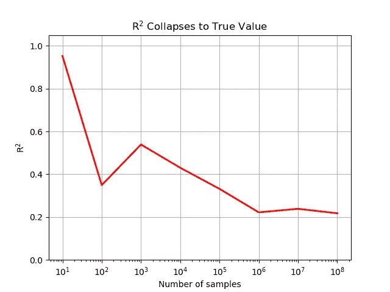

# 帕累托、幂律与胖尾

> 原文：[`towardsdatascience.com/pareto-power-laws-and-fat-tails-0355a187ee6a`](https://towardsdatascience.com/pareto-power-laws-and-fat-tails-0355a187ee6a)

## *他们在统计学中不会教你的东西*

 [Shaw Talebi](https://shawhin.medium.com/?source=post_page-----0355a187ee6a--------------------------------)

·发表于 [Towards Data Science](https://towardsdatascience.com/?source=post_page-----0355a187ee6a--------------------------------) ·12 分钟阅读·2023 年 11 月 11 日

--

黑天鹅。图片来自 Canva。

统计学是数据科学和分析的基础。它为我们提供了一个强大的工具箱，以客观地回答复杂的问题。然而，当应用于特定类型的数据——幂律时，许多我们喜爱的统计工具变得无用。

在这篇文章中，我将提供一个对初学者友好的 Power Laws 指南，并描述使用传统统计方法分析这些规律时遇到的 3 个主要问题。

## 目录

1.  **背景** — *高斯分布、帕累托的 80–20 规则、幂律，以及体重与财富之间的差异。*

1.  **统计学 101 的 3 个问题** — *你需要（很多）更多的数据。*

1.  **胖尾** — *避免争议并量化高斯分布与帕累托分布之间的差距。*

# **称量你的咖啡师**

自然界中的许多量往往围绕典型值聚集。例如，如果你坐在一个（繁忙的）咖啡店里，测量所有进进出出的咖啡师和顾客的体重，你会（最终）观察到如下图所示的模式。

*示例高斯分布。* 技术说明：在测量成年人的体重时，每个性别会出现类似高斯分布的模式。*图片由作者提供。*

这个图是**高斯分布**的一个例子，你可能在统计学 101 或商业统计中遇到过。高斯分布的美在于，我们可以**用一个数字**——**均值**——**捕捉到大部分核心信息**（例如咖啡师的体重）。

更进一步，我们可以通过**标准差**和**方差**等测量方式来获取数据的***分散程度***。

这些在入门统计学中每个人都会学到的概念给了我们一个强大的数据分析方法。然而，并非所有我们关心的量都具有围绕典型值聚集的这种定性特征。

# **帕累托原理（80–20 法则）**

你可能听说过所谓的“**80–20 法则**”，其标语是“*80%的销售额来自 20%的客户*”。然而，这一概念并非源于销售和市场营销，而是起源于维尔弗雷多·帕累托对意大利土地所有权的研究（约 1890 年）[1]。

帕累托观察到意大利约 80%的土地由 20%的人口拥有。这一简单观察表明，统计特性与我们所熟悉和喜爱的高斯分布*有很大不同*。

也就是说，“80–20 法则”是**帕累托分布**的结果。下图对此进行了说明。

帕累托分布，其中 20%的人口占据 80%的体量。图像由作者提供。

高斯分布与帕累托分布之间的**关键区别**在于**帕累托分布没有“典型值”**，我们无法用来有效总结分布。

换句话说，虽然知道一个意大利男人的平均体重（约 175 磅）能让你对下一次罗马之行有个大致的预期，但知道一个意大利城市的平均人口（约 7500）却是**无用的**。

# **功率法则分布**

帕累托分布是**功率法则**这一更广泛分布类别的一部分。我们可以如下定义功率法则[2]。

功率法则分布类别的定义[3]。图像由作者提供。

其中*PDF*()表示随机变量*X*的概率密度函数。*x*是*X*的特定值。*L(x)*是一个在[x_min,* ∞]范围内缓慢变化的正函数。*x_min*是功率法则有效的最小值（即*PDF(x) = 0 当 x<x_min*）[2]。*α*是一个数字（通常在 2 到 3 之间）。

各种*α值*的功率法则分布示例。注意：*α = 1.16 大致意味着 80–20 法则*。图像由作者提供。

正如上面的图示所示，功率法则与高斯分布在定性上非常不同。这形成了一种**高斯型与帕累托型分布之间的二分法**。换句话说，高斯和功率法则分布为定性地分类现实世界中的事物提供了概念性基准。

# **中庸斯坦与极端斯坦**

作者[Nassim Nicholas Taleb](https://medium.com/u/f138bf5466fe?source=post_page-----0355a187ee6a--------------------------------)通过他称之为“**中庸斯坦**”与“**极端斯坦**”的**两个类别**描述了高斯型和帕累托型事物之间的二分法。

**Mediocristan**是类似高斯分布的事物的土地。其公民的一个基本特性是**没有单个观察值会显著影响总体统计数据**[3]。例如，假设你在罗马旅行时称重每个斗兽场的游客，并计算平均体重。如果你加入地球上最重的意大利人，这个平均值将几乎不变（+0.5%）。

在这种概念景观的另一端是**Extremistan**，在这里我们看到相反的统计特性。即，在 Extremistan 中，**单个观察值可以（并且通常会）驱动总体统计数据**。考虑到在斗兽场的相同游客，但不是测量他们的体重，而是询问他们的净资产并计算平均值。与之前不同的是，如果我们将世界上最富有的意大利人乔瓦尼·费雷罗（巧克力+榛子家族）加入样本，这个平均值将会*剧烈*变化（+2500%）。

为了更好地理解这些类别，请参考下面图像中列出的例子。

来自 Mediocristan 和 Extremistan 的项目，分别[3]。图像由作者提供。

正如你所见，**Extremistan 中的帕累托式居民并不是一个小的或微不足道的集合**。事实上，我们关心的许多事物**并非**像我们在 STAT 101 中研究的高斯曲线。

虽然这看起来可能过于技术性和教学性，但使用我们熟悉的统计技术和直觉来分析来自 Extremistan 的数据存在**重大局限性**，甚至在某些情况下可能有显著的风险。

# **STAT 101 思维的 3 个问题**

正如我们在罗马斗兽场看到的，来自 Mediocristan（例如体重）的数据具有与 Extremistan（例如财富）相反的特性。

使用 STAT 101 技术分析幂律（即来自 Extremistan 的数据）的最大问题之一是像均值、标准差、方差、相关性等数量**几乎没有实际意义**。

这一切都源于一个核心问题——**数据不足**。

在统计学中，我们学习到**大数法则**，它表明**如果我们取 N 个随机样本**，样本均值将趋近于*N*真实均值。这对任何分布（具有有限均值）都是正确的：高斯分布、幂律分布、均匀分布，等等。

然而，事实证明**这种渐近行为在某些分布中比其他分布发生得更*缓慢***（例如，幂律分布比高斯分布更慢）。在实践中，由于我们（必然地）拥有有限的数据集，这可能会造成问题。在这里，我突出三个这样的问题。

# **问题 1：均值是无意义的（以及许多其他指标）**

每当我们想比较两组值（*例如四月与五月的销售额、洛杉矶与纽约的交通事故、对照组与治疗组的患者结果*）时，我们通常会计算均值。这为我们提供了一种将多个值压缩成一个代表性数字的直观方法。

对于遵循良好高斯分布的数据，这种方法效果极佳，因为在小样本量（N=~10）中可以准确估计均值。**然而，当处理遵循幂律分布的数据时，这种方法会失效**。

我们可以通过比较高斯分布和幂律分布的样本均值随样本量的增加，来观察这一点，下面的图表展示了 N=100、N=1,000 和 N=10,000 的情况。幂律和高斯样本均值分别用橙色和蓝色表示。

三种不同样本量的样本均值收敛情况。图片由作者提供。

如我们所见，幂律样本均值比高斯分布更为不稳定（且有偏）。即使样本量增加到 N=100,000，幂律的准确性仍然远远低于高斯分布在 N=100 时的表现。这在下面的图表中有所体现。

尽管均值在 N=1,000,000 时略有稳定，但与高斯分布相比仍然有显著偏差。图片由作者提供。

这种不稳定的行为不仅限于均值。它还适用于许多常用的统计量。下图展示了中位数、标准差、方差、最小值、最大值、1st 和 99th 百分位数、峰度和熵的类似收敛图。

三种样本量的其他指标收敛图。自上而下：中位数、标准差、方差、最小值、最大值、1st 和 99th 百分位数、峰度和熵。图片由作者提供。

如我们所见，**某些指标相较于其他指标更稳定**。例如，中位数、最小值和百分位数相对稳定。而标准差、方差、最大值、峰度和熵似乎无法稳定在一个数字上。

在这一组中，我想特别指出最大值，因为这一量度**可能在小样本中看似收敛，** **但随着 N 的增大，它可能会跳跃一个数量级**（如 N=10,000 图中所见）。这特别危险，因为它可能导致虚假的可预测性和安全感。

为了将这一点与现实世界联系起来，如果基础数据是例如，疫情死亡人数，那么过去 100 年的最大疫情将比过去 1,000 年的最大疫情小 10 倍。

例如，过去 100 年中最致命的疫情是西班牙流感（约 5000 万人死亡）[4]，因此如果疫情死亡人数遵循幂律分布，我们可以预计在接下来的 1,000 年中，会有一个疫情造成 5 亿人丧生（抱歉，这个例子有些黑暗）。

这突出了 Extremistan 数据的一个关键属性，即**罕见事件驱动了整体统计数据**。

然而，这并不仅仅是统计指标的问题。罕见事件的严重性也影响了我们有效进行预测的能力。

# **问题 2：回归分析无效**

回归归结为基于过去数据进行预测。然而，正如我们在问题 1 中看到的，当处理幂律分布时，我们可能没有足够的数据来准确捕捉*真实*的统计数据。

当使用幂律分布的变量进行回归时，如果*α* <= 2，这一点会变得更加严重。这是因为***α* <= 2 意味着**该分布具有**无限方差**，这破坏了流行回归方法（例如最小二乘回归）的一个关键假设。

然而，在实际工作中，计算出的方差永远不会是无限的（数据必然是有限的）。这引发了类似于问题 1 的问题：**结果可能看起来稳定，但随着数据的增加不会持续**。

换句话说，你的 R²在开发模型时可能看起来很棒，但随着样本量的增加，R²很快会恶化并接近实际值 R²=0。

我们可以通过一个（人工）示例来观察这一点。假设我们有两个变量 X 和 Y，它们线性相关（即 Y = mX + b），其中 X 服从正态分布，并且有一个遵循幂律分布的加性噪声项。当我们在小样本量（N=100）中进行回归时，拟合效果看起来非常好。

涉及具有加性噪声且遵循幂律分布的预测变量的线性回归拟合，样本量较小（N=100）。图片由作者提供。

然而，当我们收集更多数据（N=100,000,000）时，R²会正确地下降到实际值（即 R²=0）。

随着样本量的增加，R²接近实际值（即 R²=0）。图片由作者提供。

# **问题 3：** 回报**与**概率**偏离**

在这一点上，你可能会想，“*Shaw... 有什么大不了的？如果我的模型不能预测一些罕见事件，那又怎么样？它大多数时候是正确的。*”

我同意你的观点。当处理来自极端国家的数据时，大多数数据不在尾部，因此大多数时间容易是正确的。然而，在预测结果和做出决策时，概率只是部分故事。

**故事的另一半是回报**。换句话说，不仅仅是关于*你有多频繁*地正确*（错误）*，还包括*当你正确（错误）时会发生什么*。

例如，如果你被提供一种每日多种维生素，它 99.9%的时间效果很好，但有 0.1%的时间可能致命，你可能会选择另一种品牌（或更健康的食物）。

单纯依赖概率来做决策**在处理幂律和“80-20 规则”时尤其有害**。考虑以下商业示例。

假设我们有一家软件公司，提供 3 种产品：1）有广告的免费版，2）高级版，3）企业版，其中每种产品的客户和收入分布见下表。

每种产品的客户和收入分布。图片由作者提供。

公司希望推出一个更新，将处理时间提高 50%。作为一家前沿的数据驱动技术公司，他们调查了活跃用户，发现**95%的客户更喜欢更新后的软件**。掌握了这些数据，公司批准了软件更新。

然而，六周后，公司陷入了混乱，因为收入下降了 50%。

事实证明，更新后，3 位客户取消了服务，因为更新移除了对他们用例至关重要的遗留数据集成。但这些不是普通客户。这些是公司的**前 3 大客户（约 1%），占公司收入的约 50%**（考虑到他们的定制增销）。

这就是当只关注概率（95%的客户喜欢更新）时可能犯的（致命）错误。故事的寓意是，当处理来自极端领域的稀有事件数据时，**错一次可能抵消对 99 次正确的判断（甚至更多）**。

生成图表的代码 👇

 [## YouTube-Blog/power-laws 在主分支 · ShawhinT/YouTube-Blog

### 代码用于补充 YouTube 视频和 Medium 博客帖子。 - YouTube-Blog/power-laws 在主分支 · ShawhinT/YouTube-Blog

github.com](https://github.com/ShawhinT/YouTube-Blog/tree/main/power-laws?source=post_page-----0355a187ee6a--------------------------------)

# **极端主义中的争议**

幂律，如高斯分布，是一种理想化的数学抽象。然而，现实世界却很混乱，几乎不可能完全符合我们美丽而精确的构造。这引发了一些争议，即某个特定的分布是否*真正*是幂律。

争论的一个点是财富是否是幂律（如帕累托的工作所示）或仅仅是一个[对数正态分布](https://en.wikipedia.org/wiki/Log-normal_distribution) [5]。

部分争议可能通过观察到对数正态分布在低σ时表现如高斯分布，在高σ时表现如幂律来解释[2]。

然而，为了避免争议，我们可以离开（[暂时](https://medium.com/towards-data-science/detecting-power-laws-in-real-world-data-with-python-b464190fade6)）*某些给定数据是否符合幂律*的问题，转而关注**胖尾**。

# **胖尾性 — 测量中等主义和极端主义之间的距离**

**胖尾**是一个比帕累托和幂律分布更一般的概念。我们可以把它看作“**胖尾性**”是**稀有事件推动分布总体统计的程度**。从这个角度看，胖尾性在从不胖尾（即高斯分布）到非常胖尾（即帕累托 80–20）的谱系上。

这与之前讨论的 Mediocristan 与 Extremistan 的概念直接对应。下面的图像展示了不同分布在这一概念景观中的可视化 [2]。

Mediocristan 与 Extremistan 的地图。*注意：由于肥尾现象存在于一个范围内，因此将分布标记为“肥尾”与否具有一定的主观性。图片作者。*

尽管没有准确的肥尾度量，但我们可以在实践中使用许多指标和启发式方法来感知给定分布在 Mediocristan 与 Extremistan 地图上的位置。以下是一些方法。

+   **幂律性**：使用幂律尾部指数，即*α*——α越低，尾部越肥 [2]

+   **非高斯性**：峰度（对于*α* ≤ 4 的幂律失效）

+   **对数正态分布**的**方差**

+   **塔勒布的κ**指标 [6]

# **要点**

面对肥尾数据的主要挑战是可能没有足够的数据来准确捕捉其潜在的统计属性。这些信息为数据从业者提供了一些启示。

+   **绘制分布**例如直方图、PDF 和 CDF

+   问问自己——**这些数据来自 Mediocristan 还是 Extremistan**（或介于两者之间的某个地方）**？**

+   在构建模型时，问问自己——**正确预测的价值和错误预测的成本是什么？**

+   如果处理（非常）肥尾数据，不要忽视稀有事件。相反，**弄清楚如何利用它们**（例如，你能否为前 1%的客户做一个特别促销以推动更多业务？）

**👉 更多关于幂律和肥尾的信息**：幂律拟合 | 量化肥尾

 [## 用 Python 检测现实世界中的幂律]

### 用示例代码分解最大似然法的方法

towardsdatascience.com](/detecting-power-laws-in-real-world-data-with-python-b464190fade6?source=post_page-----0355a187ee6a--------------------------------)

# 资源

**联系**：[我的网站](https://shawhintalebi.com/) | [预约电话](https://calendly.com/shawhintalebi) | [问我任何问题](https://shawhintalebi.com/contact/)

**社交媒体**：[YouTube 🎥](https://www.youtube.com/channel/UCa9gErQ9AE5jT2DZLjXBIdA) | [LinkedIn](https://www.linkedin.com/in/shawhintalebi/) | [Twitter](https://twitter.com/ShawhinT)

**支持**：[请我喝杯咖啡](https://www.buymeacoffee.com/shawhint) ☕️

 [## 免费获取我撰写的每个新故事的访问权限]

### 免费获取我撰写的每个新故事的访问权限。附言：我不会与任何人分享你的电子邮件。通过注册，你将创建一个…

[shawhin.medium.com](https://shawhin.medium.com/subscribe?source=post_page-----0355a187ee6a--------------------------------)

[1] 帕累托原则。 (2023 年 10 月 30 日). 载于 *维基百科*。 [`en.wikipedia.org/wiki/Pareto_principle`](https://en.wikipedia.org/wiki/Pareto_principle)

[2] arXiv:2001.10488 [stat.OT]

[3] *塔勒布, N.N. (2007). 黑天鹅：极不可能事件的影响. 纽约；兰登书屋。*

[4] [`www.archives.gov/exhibits/influenza-epidemic/`](https://www.archives.gov/exhibits/influenza-epidemic/)

[5] arXiv:0706.1062 [physics.data-an]

[6] Taleb, N. N. (2019). 你需要多少数据？一种操作性的、前渐近的尾部厚度度量。*国际预测学杂志*，*35*(2)，677–686。 [`doi.org/10.1016/j.ijforecast.2018.10.003`](https://doi.org/10.1016/j.ijforecast.2018.10.003)
