# 在人道主义数据集中解析不规则电子表格（借助 GPT-3 的帮助）

> 原文：[`towardsdatascience.com/parsing-irregular-spreadsheet-tables-in-humanitarian-datasets-with-some-help-from-gpt-3-57efb3d80d45?source=collection_archive---------2-----------------------#2023-02-24`](https://towardsdatascience.com/parsing-irregular-spreadsheet-tables-in-humanitarian-datasets-with-some-help-from-gpt-3-57efb3d80d45?source=collection_archive---------2-----------------------#2023-02-24)

## 处理不规则 Excel 表格，无需使用硬编码规则

[](https://medium.com/@astrobagel?source=post_page-----57efb3d80d45--------------------------------)[](https://towardsdatascience.com/?source=post_page-----57efb3d80d45--------------------------------) [马修·哈里斯](https://medium.com/@astrobagel?source=post_page-----57efb3d80d45--------------------------------)

·

[关注](https://medium.com/m/signin?actionUrl=https%3A%2F%2Fmedium.com%2F_%2Fsubscribe%2Fuser%2F4a2cd25b8ff9&operation=register&redirect=https%3A%2F%2Ftowardsdatascience.com%2Fparsing-irregular-spreadsheet-tables-in-humanitarian-datasets-with-some-help-from-gpt-3-57efb3d80d45&user=Matthew+Harris&userId=4a2cd25b8ff9&source=post_page-4a2cd25b8ff9----57efb3d80d45---------------------post_header-----------) 发布于 [数据科学前沿](https://towardsdatascience.com/?source=post_page-----57efb3d80d45--------------------------------) · 26 分钟阅读 · 2023 年 2 月 24 日[](https://medium.com/m/signin?actionUrl=https%3A%2F%2Fmedium.com%2F_%2Fvote%2Ftowards-data-science%2F57efb3d80d45&operation=register&redirect=https%3A%2F%2Ftowardsdatascience.com%2Fparsing-irregular-spreadsheet-tables-in-humanitarian-datasets-with-some-help-from-gpt-3-57efb3d80d45&user=Matthew+Harris&userId=4a2cd25b8ff9&source=-----57efb3d80d45---------------------clap_footer-----------)

--

[](https://medium.com/m/signin?actionUrl=https%3A%2F%2Fmedium.com%2F_%2Fbookmark%2Fp%2F57efb3d80d45&operation=register&redirect=https%3A%2F%2Ftowardsdatascience.com%2Fparsing-irregular-spreadsheet-tables-in-humanitarian-datasets-with-some-help-from-gpt-3-57efb3d80d45&source=-----57efb3d80d45---------------------bookmark_footer-----------)

由 DALL-E2 根据提示“10 张木桌的画作”创作。上图中有 9 张桌子。

***简短说明***

*作为* *之前的研究* *的一部分，使用了来自* [*人道主义数据交换*](https://data.humdata.org/) *的数据，我不得不分析成千上万的 Excel 文件，这些文件中的表格常常难以解析成数据库表。文件来自全球数百个组织时，合并单元格、不规则布局、层次化列和注释难以通过基于规则的解析来预见。在这篇文章中，我探讨了使用 GPT-3 的零-shot、单-shot 和推理补全来重新格式化不规则（小型）表格，并微调模型以预测表格属性，从而用于准确解析。*

在我的旅行中，有不少次需要查看大量 Excel 文件，以了解它们包含的数据、数据的结构如何，以及将其清理成可以处理的形式所需的工作。大部分情况下，只要数据规则且列标题整齐，这个过程相当简单。然而，现实从未那么简单，这些文件中的表格往往以不完美的格式存在，难以解析成可以上传到关系数据库的数据框。Excel 支持许多功能，如数据透视表和单元格合并，人们使用这些功能创建各种各样的布局，包括空白行、随机文本等等！

这里有一个例子来说明……

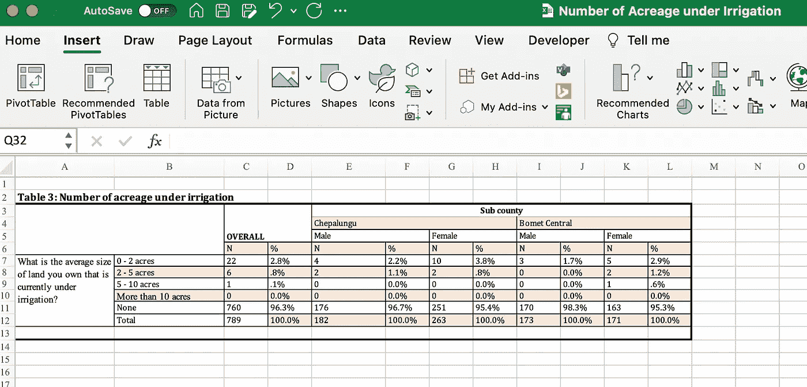

Excel 中的不规则表格示例，带有空白顶部行、标签和合并单元格。对人类来说完全可读，但对数据科学来说是解析的挑战。该文件来自[人道主义数据交换](https://data.humdata.org/dataset/kenya-number-of-acreage-under-irrigation-in-bomet-county)

如果我们直接将上述文件读入 Pandas 中……

```py
import pandas as pd
df = pd.read_excel(filename)
df = df.fillna("")
display(df)
```

我们得到这个……

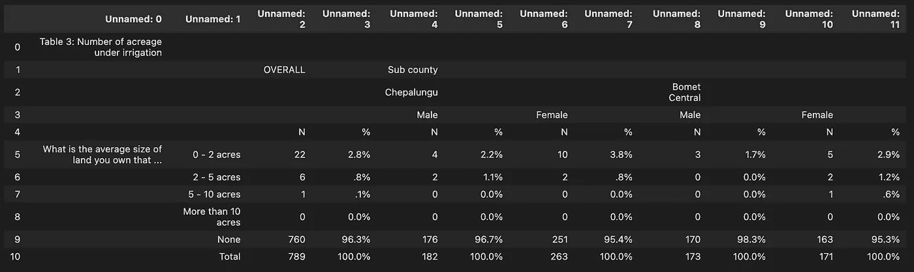

Pandas 数据框在解析 Excel 表格后的示例，其中包含空行和合并单元格，以指示层次列。示例数据来自[人道主义数据交换](https://data.humdata.org/dataset/kenya-production-of-rice-in-irrigation-schemes)

将其加载到数据库中会导致数据几乎无法使用，因为……

1.  右上角单元格中有一个表格标题。

1.  列‘Unnamed: 1’的标题实际上是第一列第 5 行的内容“你拥有的土地的平均面积是多少……”

1.  列‘Unnamed:2’和‘Unnamed:3’是分为’N‘ 数值和‘%’ 百分比值的汇总总数。

1.  大多数列是层次化的，合并单元格位于未合并单元格之上。

这也不*那么*糟糕，对吧？

当然，可以向[Pandas read_excel](https://pandas.pydata.org/docs/reference/api/pandas.read_excel.html)提供参数，将层次列转换为索引，然后可以将其合并为一行。或者，我们可以使用[Openpyxl](https://openpyxl.readthedocs.io/en/stable/)中关于 Excel 自身的合并单元格的信息进行操作。然而，这些方法需要对表格有了解——特别是标题在哪里结束、数据从哪里开始以及层次列的结构——这是我们在处理成千上万的电子表格时可能不总是拥有的奢侈品。对大量文件进行基于规则的解析可能耗时且脆弱，需要随着新布局的出现而持续维护。

其实，我并不是唯一一个遇到这个问题的人！解析不规则表格是一项正在积极研究的挑战。例如，微软的作者展示了利用卷积神经网络开发的一个名为‘TableSense’的算法的出色成果[[1](https://arxiv.org/abs/2106.13500)]。这种技术将 Excel 表格视作图像来处理，但具有更丰富的特征化，因为每个单元格可能具有多种属性和数据类型，还包括格式化和合并特征。非常酷。我希望像这样的精彩工作能尽快纳入微软的产品中，但在此之前，我想探索一些其他的方法。

值得注意的是，我的使用案例不仅仅是识别表格在工作表中的范围（参见[微软论文的训练数据](https://github.com/microsoft/TableSense/blob/main/dataset/Table%20range%20annotations.txt)），还包括表格中的元素，以便将不规则的格式转换为可以轻松导入数据库的格式。主要挑战是 Excel 中的层次列，将这些层次列展平成一个单独的行，从而捕捉上层合并单元格中的信息。听起来解决起来很简单，但挑战是：标题在哪里结束，数据从哪里开始？这对我们人类来说显而易见，但令人惊讶的是，当用代码处理工作表时，这样简单的事情在现实世界中可能会变得非常嘈杂。

鉴于最近对生成式 AI 和大型语言模型（LLMs）的关注，我想知道也许[OpenAI 的 GPT-3](https://openai.com/blog/gpt-3-apps/)可能会接受这个挑战。这些模型在从互联网提取的大量数据上进行了训练，其中包括表格和 CSV 文件，因此它们可能在处理我们这些疯狂人类拼凑的表格的某些细节方面会很有用。

# 提示 GPT-3 清理（一个小的）表格

我们将首先尝试将问题作为零样本和少量样本任务解决，然后再转向使用微调技术。

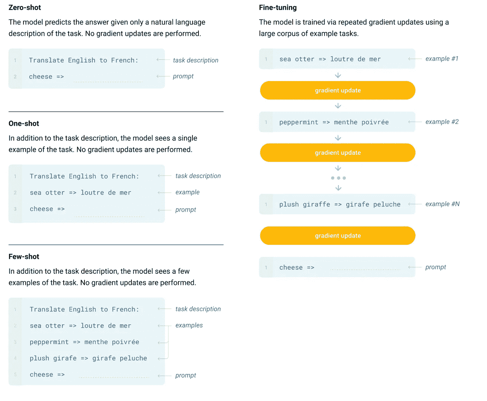

零样本、单样本和少样本任务，与传统的微调对比。上面的面板展示了用语言模型执行任务的四种方法。来源于 Brown 等人 [[2](https://arxiv.org/pdf/2005.14165.pdf)]。

GPT-3 是在从网络上抓取的文本上训练的，所以我们不能用 Excel 提示它（还不行！），因此我们首先必须将我们的表格转换成一种网络上常见的形式，例如 CSV 字符串……

```py
df = pd.read_excel('sample.xlsx', sheet_name='Sheet1')
df = df.fillna("")
print(df.to_csv())
```

```py
,Unnamed: 0,Unnamed: 1,Unnamed: 2,Unnamed: 3,Unnamed: 4,Unnamed: 5,Unnamed: 6,Unnamed: 7,Unnamed: 8,Unnamed: 9,Unnamed: 10,Unnamed: 11
0,Table 3: Number of acreage under irrigation,,,,,,,,,,,
1,,,OVERALL,,Sub county,,,,,,,
2,,,,,Chepalungu,,,,Bomet Central,,,
3,,,,,Male,,Female,,Male,,Female,
4,,,N,%,N,%,N,%,N,%,N,%
5,What is the average size of land you own that is currently under irrigation?,0 - 2 acres,22,2.8%,4,2.2%,10,3.8%,3,1.7%,5,2.9%
6,,2 - 5 acres,6,.8%,2,1.1%,2,.8%,0,0.0%,2,1.2%
7,,5 - 10 acres,1,.1%,0,0.0%,0,0.0%,0,0.0%,1,.6%
8,,More than 10 acres,0,0.0%,0,0.0%,0,0.0%,0,0.0%,0,0.0%
9,,None,760,96.3%,176,96.7%,251,95.4%,170,98.3%,163,95.3%
10,,Total,789,100.0%,182,100.0%,263,100.0%,173,100.0%,171,100.0%
```

**附注**：我还尝试了 Markdown 和 HTML 表格，但发现 CSV 在我的用例中效果最好。

值得注意的是，对于这项分析，我们处理的表格是*稀疏的*，即列数少于 100。这意味着前 10 行可以很容易地在 GPT-3 提示中表示。这对我在援助数据交换中分析的大多数 Excel 表格来说是合适的，但可能不适用于其他情况。此外，这项分析不考虑同一 Excel 工作表上有多个表格的情况……这将是稍后博客文章的内容。🙂

# **零样本提示**

现在让我们看看 GPT-3 是否可以仅通过一个提示重新格式化我们凌乱的表格，这是一项[零样本任务](https://arxiv.org/pdf/2005.14165.pdf) [2]，我们没有提供示例，只是提供了要重新格式化的 CSV 文件……

```py
import openai as ai

# Open AI API key should be put into this file
ai.api_key_path = "./api_key.txt"

csv_as_str = df.to_csv()

prompt = (
    "Reformat this table to be a simpler markdown table with "
    + "no hierarchical columns, no pivoting, values and percentages in different columns, "
    + "and no blank cells\n\n"
    + csv_as_str
)

completions = ai.Completion.create(
    engine="text-davinci-003",
    temperature=0.0,
    prompt=prompt,
    max_tokens=999,
    n=1,
    stop=None,
)

Markdown(completions.choices[0].text)
```

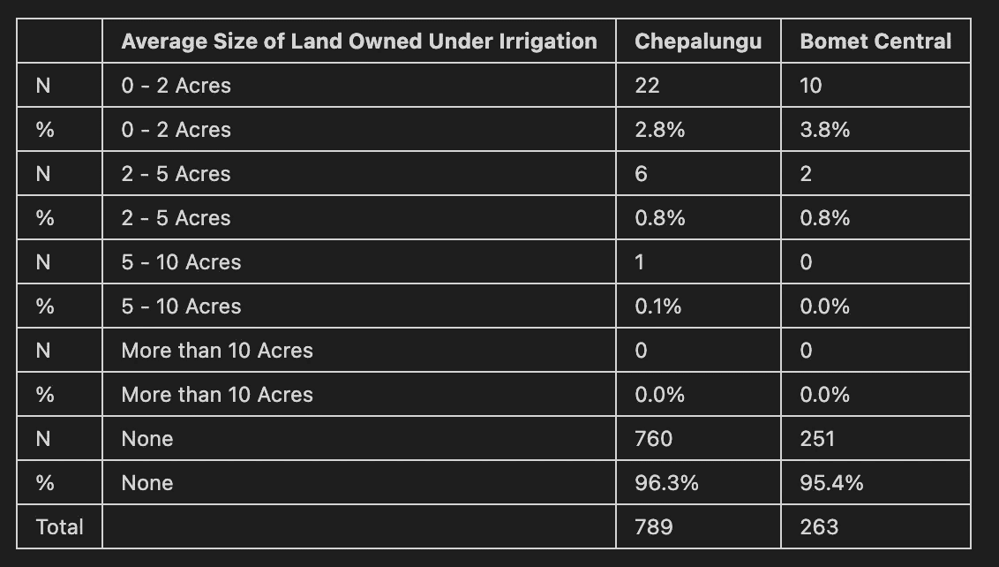

它丢弃了不必要的行，将数据转换为一个规范的表格，带有列标题，但仔细观察会发现，它丢失了一些关键信息，如按性别的分类。这是经典的[幻觉](https://en.wikipedia.org/wiki/Hallucination_(artificial_intelligence))现象，看起来很可信，但却是错误的。

让我们玩玩[温度](https://platform.openai.com/docs/api-reference/completions/create)参数。较低的值使模型更加确定性（对于相同的提示每次都给出相同的结果），而较高的值则更随机。使用更高的温度值，我们得到……

```py
prompt = (
    "Reformat this table to be a simpler markdown table with "
    + "no hierarchical columns, no pivoting, values and percentages in different columns, "
    + "and no blank cells\n\n"
    + csv_as_str
)

completions = ai.Completion.create(
    engine="text-davinci-003",
    temperature=1.0,
    prompt=prompt,
    max_tokens=999,
    n=1,
    stop=None,
)

Markdown(completions.choices[0].text)
```

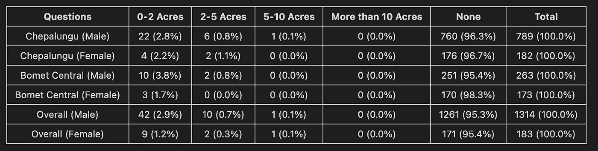

*看起来*不错！几乎所有的正确列标题都来自我们 CSV 文件中的合并单元格，这实际上相当惊人。然而，抽查几个单元格显示，尽管许多是正确的，但也有一些不正确。此外，上面的“总体”被分成了男性和女性，这是不正确的。

另一个问题是，调用 GPT-3 完全相同的提示会产生不同的结果，因为高温值……

```py
completions = ai.Completion.create(
    engine="text-davinci-003",
    temperature=1.0,
    prompt=prompt,
    max_tokens=999,
    n=1,
    stop=None,
)

Markdown(completions.choices[0].text)
```

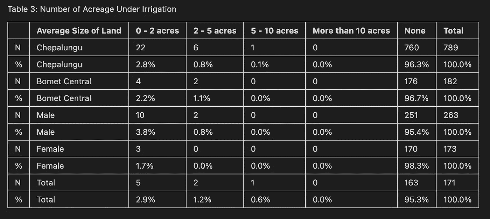

不无道理，尽管值不正确，但布局完全不同。可重复性对我们的任务非常重要，我们应该能够在每次处理运行中以完全相同的方式处理表格数据。

所以高温似乎不是这个用例的好选择。

如果我们在表格中提供更多上下文会怎么样？CSV 并不是很具表现力，例如，层级标题中的合并列告诉人类这些列是分组的，但 CSV 文件并未捕捉到这一点……

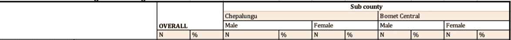

```py
1,,,OVERALL,,Sub county,,,,,,,
2,,,,,Chepalungu,,,,Bomet Central,,,
3,,,,,Male,,Female,,Male,,Female,
4,,,N,%,N,%,N,%,N,%,N,%
```

在上述示例中，GPT-3 必须推断出合并的行标题右侧的空白列与这些标题对应，并且很多时候它确实能够做到这一点。然而，由于我们知道 Excel 文件中哪些单元格是合并的，我们可以稍微帮助一下。

为了在 CSV 中表示这个，我们可以取消合并合并的单元格，并用其合并值填充 …

```py
def pad_merged_cells(sheet):
    """
    Unmerge merged cells and fill with merged value.

    Input Parameters
    ----------------
    sheet: Obj
        Openpyxl sheet object

    Output Parameters
    -----------------
    df: Dataframe
        Pandas dataframe of the table
    """

    dd = pd.DataFrame(sheet.values)

    # Scan for maxn rows
    maxn = 10

    hasmerged = False
    if len(sheet.merged_cells.ranges) > 0:
        hasmerged = True

    if hasmerged:
        merge_list = []
        for merge in sheet.merged_cells.ranges:
            merge_list.append(merge)

        for cell_group in merge_list:
            min_col, min_row, max_col, max_row = range_boundaries(
                str(cell_group))
            top_left_cell_value = sheet.cell(row=min_row, column=min_col).value
            sheet.unmerge_cells(str(cell_group))
            for row in sheet.iter_rows(
                min_col=min_col, min_row=min_row, max_col=max_col, max_row=max_row
            ):
                for cell in row:
                    cell.value = top_left_cell_value

    # Extract data and save to dataframe
    data = []
    for row in sheet.iter_rows(min_row=1):
        row_data = []
        for cell in row:
            if cell.value is None:
                row_data.append(None)
            else:
                row_data.append(cell.value)
        if any(row_data):
            data.append(row_data)

    df = pd.DataFrame(data)

    # Remove duplicate columns
    df = df.T.drop_duplicates().T

    # Remove duplicate rows
    df = df.drop_duplicates()

    # Fill NaN with blank string for easier viewing
    df = df.fillna("")

    return df, sheet, hasmerged

wb = openpyxl.load_workbook(filename)
sheet = wb['Sheet1']
merged_table, sheet, hasmerged = pad_merged_cells(sheet)

display(merged_table)
```

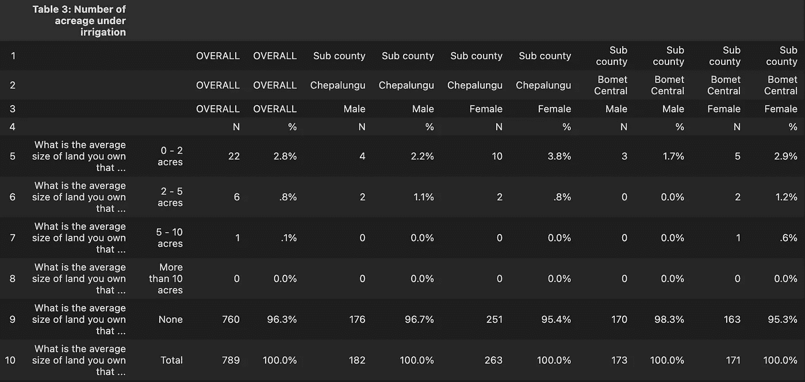

表格中合并的单元格被取消合并，并用合并值填充，以在 CSV 文件格式中提供上下文。

```py
,Table 3: Number of acreage under irrigation,,,,,,,,,,,
1,,,OVERALL,OVERALL,Sub county,Sub county,Sub county,Sub county,Sub county,Sub county,Sub county,Sub county
2,,,OVERALL,OVERALL,Chepalungu,Chepalungu,Chepalungu,Chepalungu,Bomet Central,Bomet Central,Bomet Central,Bomet Central
3,,,OVERALL,OVERALL,Male,Male,Female,Female,Male,Male,Female,Female
4,,,N,%,N,%,N,%,N,%,N,%
5,What is the average size of land you own that is currently under irrigation?,0 - 2 acres,22,2.8%,4,2.2%,10,3.8%,3,1.7%,5,2.9%
6,What is the average size of land you own that is currently under irrigation?,2 - 5 acres,6,.8%,2,1.1%,2,.8%,0,0.0%,2,1.2%
7,What is the average size of land you own that is currently under irrigation?,5 - 10 acres,1,.1%,0,0.0%,0,0.0%,0,0.0%,1,.6%
8,What is the average size of land you own that is currently under irrigation?,More than 10 acres,0,0.0%,0,0.0%,0,0.0%,0,0.0%,0,0.0%
9,What is the average size of land you own that is currently under irrigation?,None,760,96.3%,176,96.7%,251,95.4%,170,98.3%,163,95.3%
10,What is the average size of land you own that is currently under irrigation?,Total,789,100.0%,182,100.0%,263,100.0%,173,100.0%,171,100.0%
```

CSV 文件现在捕获了叠加的合并列标题。让我们看看这是否能改善情况，首先温度=0.0 …

```py
csv_as_str_merged = merged_table.to_csv()

prompt = (
    "Reformat this table to be a simpler markdown table with "
    + "no hierarchical columns, no pivoting, values and percentages in different columns, "
    + "and no blank cells\n\n"
    + csv_as_str_merged
)

completions = ai.Completion.create(
    engine="text-davinci-003",
    temperature=0.0,
    prompt=prompt,
    max_tokens=999,
    n=1,
    stop=None,
)

Markdown(completions.choices[0].text)
```

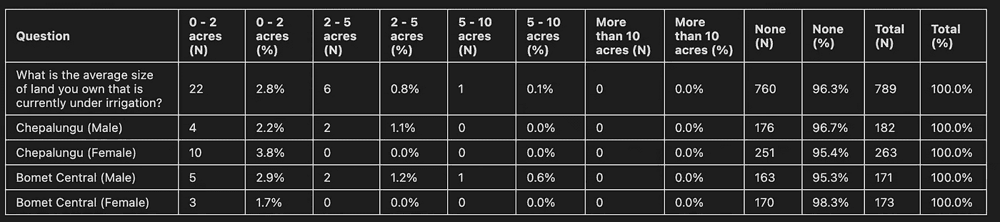

同样的，但温度=1.0，只是为了好玩 …

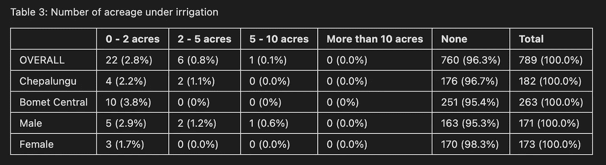

稍微好了一些，但总是*有些*地方不太对。缺失的类别，单元格值偏移，如果我们需要准确表示源数据，两个表格都无法使用。

此时，我尝试了各种组合：

+   提示

+   温度

+   使用 Markdown、HTML 和 CSV 定义输入表格

+   提示 GPT-3 生成用于解析的 Python 代码，而不是解析表格

有时该过程能够生成列标题和数值完美的表格，但通常这需要高温度值，因此不可重复。大多数情况下，结果看起来合理，但数据不正确。

公平地说，我们真的对 GPT-3 提出了很高的要求，这是一项复杂的零样本任务。我对它的表现感到非常满意，也许通过更好的提示和问题的重新框定 —— 或 GPT-4！—— 结果可能会有所改善，但我没有能够实现所需的结果。

# **单次提示**

现在，让我们在提示中提供一个示例。我从人道数据交换获取了一个类似的 Excel 文件 …

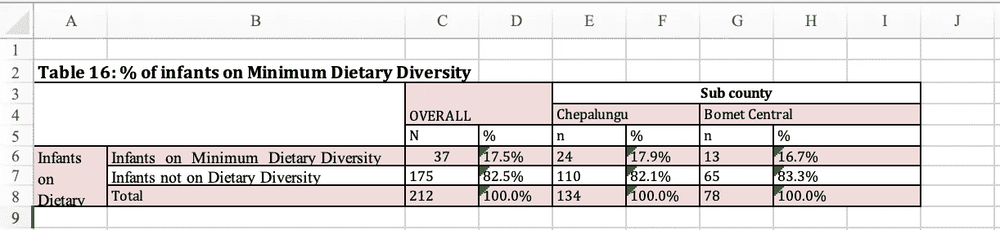

我们将在单次提示中使用的表格。此文件来源于 [人道数据交换](https://data.humdata.org/dataset/kenya-production-of-rice-in-irrigation-schemes)

我们希望这被处理成如下所示 …

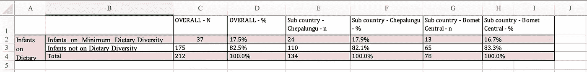

我们的示例文件在重新格式化后的样子

显然，这是一个不切实际的“真实世界”示例，因为格式和内容与我们尝试处理的表格非常相似，但这是一个很好的初步测试。

将我们的输入表格转换为 CSV 并取消合并合并的单元格，如上所述，我们得到 …

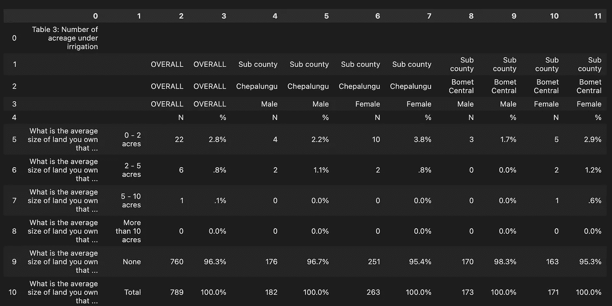

我们现在可以构建我们的单次提示（假设温度为零以便可重复） …

```py
from io import StringIO

wb = openpyxl.load_workbook(prompt_sample_table1, data_only=True)
sheet = wb["Sheet1"]
example_before, sheet, hasmerged = pad_merged_cells(sheet)
example_before_csv = example_before.to_csv()
example_after, hasmerged, report = parse_excel_sheet(sheet)
example_after_markdown = example_after.to_markdown()
example_after_csv = example_after.to_csv()

example_before_csv = """
 ,0,1,2,3,4,5,6,7
0,Table 16: % of infants on Minimum Dietary Diversity,,,,,,,
1,,,OVERALL,OVERALL,Sub county,Sub county,Sub county,Sub county
2,,,OVERALL,OVERALL,Chepalungu,Chepalungu,Bomet Central,Bomet Central
3,,,N,%,n,%,n,%
4,Infants         on Dietary Diversity,Infants  on  Minimum  Dietary Diversity,37,17.5%,24,17.9%,13,16.7%
5,Infants         on Dietary Diversity,Infants not on Dietary Diversity,175,82.5%,110,82.1%,65,83.3%
6,Infants         on Dietary Diversity,Total,212,100.0%,134,100.0%,78,100.0%
"""

example_after_markdown = (
    """
 |    |                                      |                                         |   OVERALL - N | OVERALL - %   |   Sub county - Chepalungu | Sub county - Chepalungu - %   |   Sub county - Bomet Central | Sub county - Bomet Central - %   |
|---:|:-------------------------------------|:----------------------------------------|--------------:|:--------------|--------------------------:|:------------------------------|-----------------------------:|:---------------------------------|
|  1 | Infants         on Dietary Diversity | Infants  on  Minimum  Dietary Diversity |            37 | 17.5%         |                        24 | 17.9%                         |                           13 | 16.7%                            |
|  2 | Infants         on Dietary Diversity | Infants not on Dietary Diversity        |           175 | 82.5%         |                       110 | 82.1%                         |                           65 | 83.3%                            |
|  3 | Infants         on Dietary Diversity | Total                                   |           212 | 100.0%        |                       134 | 100.0%                        |                           78 | 100.0%                           |
""".replace(
        ":|", "|"
    )
    .replace("|:", "|")
    .replace("\n", "\n<RETURN>")
)

example_after_csv = """
 , , ,OVERALL - N,OVERALL - %,Sub county - Chepalungu,Sub county - Chepalungu - %,Sub county - Bomet Central,Sub county - Bomet Central - %
1,Infants         on Dietary Diversity,Infants  on  Minimum  Dietary Diversity,37,17.5%,24,17.9%,13,16.7%
2,Infants         on Dietary Diversity,Infants not on Dietary Diversity,175,82.5%,110,82.1%,65,83.3%
3,Infants         on Dietary Diversity,Total,212,100.0%,134,100.0%,78,100.0%
"""

table_to_parse_padded = """
,0,1,2,3,4,5,6,7,8,9,10,11
0,Table 3: Number of acreage under irrigation,,,,,,,,,,,
1,,,OVERALL,OVERALL,Sub county,Sub county,Sub county,Sub county,Sub county,Sub county,Sub county,Sub county
2,,,OVERALL,OVERALL,Chepalungu,Chepalungu,Chepalungu,Chepalungu,Bomet Central,Bomet Central,Bomet Central,Bomet Central
3,,,OVERALL,OVERALL,Male,Male,Female,Female,Male,Male,Female,Female
4,,,N,%,N,%,N,%,N,%,N,%
5,What is the average size of land you own that is currently under irrigation?,0 - 2 acres,22,2.8%,4,2.2%,10,3.8%,3,1.7%,5,2.9%
6,What is the average size of land you own that is currently under irrigation?,2 - 5 acres,6,.8%,2,1.1%,2,.8%,0,0.0%,2,1.2%
7,What is the average size of land you own that is currently under irrigation?,5 - 10 acres,1,.1%,0,0.0%,0,0.0%,0,0.0%,1,.6%
8,What is the average size of land you own that is currently under irrigation?,More than 10 acres,0,0.0%,0,0.0%,0,0.0%,0,0.0%,0,0.0%
9,What is the average size of land you own that is currently under irrigation?,None,760,96.3%,176,96.7%,251,95.4%,170,98.3%,163,95.3%
10,What is the average size of land you own that is currently under irrigation?,Total,789,100.0%,182,100.0%,263,100.0%,173,100.0%,171,100.0%
"""

prompt = (
    "Reformat this table to only have a single header row: \n\n"
    + example_before_csv
    + "\n\n"
    + "Result: \n\n"
    + example_after_csv
    + "\n\n"
    + "Reformat this table to only have a single header row: \n\n"
    + table_to_parse_padded
    + "\n\n"
    + "Result: \n\n"
)

print("\n\n", prompt, "\n\n")

completions = ai.Completion.create(
    engine="text-davinci-003",
    temperature=0.0,
    prompt=prompt,
    n=1,
    stop=None,
    max_tokens=2068,
    top_p=1,
    frequency_penalty=0,
    presence_penalty=0,
)

print("\n========== Model prediction:\n")

display(pd.read_csv(StringIO(completions.choices[0].text)))
```

这是生成的提示 …

```py
Reformat this table to only have a single header row: 

 ,0,1,2,3,4,5,6,7
0,Table 16: % of infants on Minimum Dietary Diversity,,,,,,,
1,,,OVERALL,OVERALL,Sub county,Sub county,Sub county,Sub county
2,,,OVERALL,OVERALL,Chepalungu,Chepalungu,Bomet Central,Bomet Central
3,,,N,%,n,%,n,%
4,Infants         on Dietary Diversity,Infants  on  Minimum  Dietary Diversity,37,17.5%,24,17.9%,13,16.7%
5,Infants         on Dietary Diversity,Infants not on Dietary Diversity,175,82.5%,110,82.1%,65,83.3%
6,Infants         on Dietary Diversity,Total,212,100.0%,134,100.0%,78,100.0%

Result: 

 , , ,OVERALL - N,OVERALL - %,Sub county - Chepalungu,Sub county - Chepalungu - %,Sub county - Bomet Central,Sub county - Bomet Central - %
1,Infants         on Dietary Diversity,Infants  on  Minimum  Dietary Diversity,37,17.5%,24,17.9%,13,16.7%
2,Infants         on Dietary Diversity,Infants not on Dietary Diversity,175,82.5%,110,82.1%,65,83.3%
3,Infants         on Dietary Diversity,Total,212,100.0%,134,100.0%,78,100.0%

Reformat this table to only have a single header row: 

,0,1,2,3,4,5,6,7,8,9,10,11
0,Table 3: Number of acreage under irrigation,,,,,,,,,,,
1,,,OVERALL,OVERALL,Sub county,Sub county,Sub county,Sub county,Sub county,Sub county,Sub county,Sub county
2,,,OVERALL,OVERALL,Chepalungu,Chepalungu,Chepalungu,Chepalungu,Bomet Central,Bomet Central,Bomet Central,Bomet Central
3,,,OVERALL,OVERALL,Male,Male,Female,Female,Male,Male,Female,Female
4,,,N,%,N,%,N,%,N,%,N,%
5,What is the average size of land you own that is currently under irrigation?,0 - 2 acres,22,2.8%,4,2.2%,10,3.8%,3,1.7%,5,2.9%
6,What is the average size of land you own that is currently under irrigation?,2 - 5 acres,6,.8%,2,1.1%,2,.8%,0,0.0%,2,1.2%
7,What is the average size of land you own that is currently under irrigation?,5 - 10 acres,1,.1%,0,0.0%,0,0.0%,0,0.0%,1,.6%
8,What is the average size of land you own that is currently under irrigation?,More than 10 acres,0,0.0%,0,0.0%,0,0.0%,0,0.0%,0,0.0%
9,What is the average size of land you own that is currently under irrigation?,None,760,96.3%,176,96.7%,251,95.4%,170,98.3%,163,95.3%
10,What is the average size of land you own that is currently under irrigation?,Total,789,100.0%,182,100.0%,263,100.0%,173,100.0%,171,100.0%

Result: 
```

这是 GPT-3 的完成结果，转换为数据框以便更容易显示 …

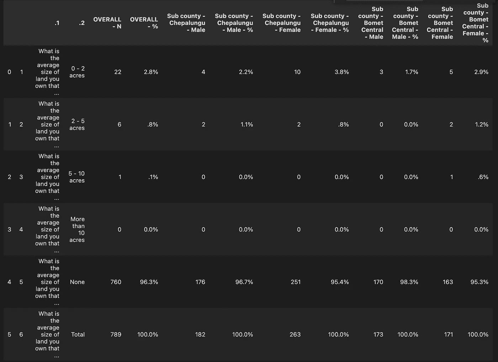

从单次提示生成的表格，重新格式化具有层次结构标题的表格（完成结果是 CSV，这里为便于展示转换为 pandas 数据框）

很好！当提供一个示例时，GPT-3 能够完美地重新格式化我们的新表格。然而，这不是一个很好的测试，因为示例表格和测试表格在结构和内容上非常相似，但有趣的是，即使示例中没有男性/女性的层级，GPT-3 仍能正确地折叠这个额外的层级。

让我们使用相同的示例表格来重新格式化一个具有不同布局和内容数据的表格 …

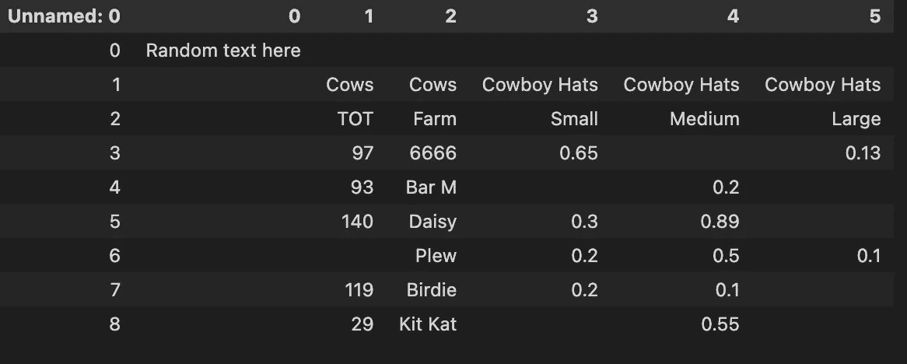

使用相同的代码处理得到的是 …

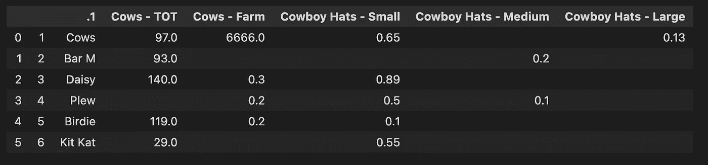

这很接近，标题完全正确，但农场列向左移动了。我们的单次提示在重新格式化非常相似的表格时表现不错，但稍微的变化导致了较差的结果。

# 单次提示，带有推理

关于提示工程已经有相当多的研究。一个非常好的资源可以在 OpenAI Cookbook 的 [提升可靠性的技术](https://github.com/openai/openai-cookbook/blob/main/techniques_to_improve_reliability.md) [3] 中找到。提高结果的最有效方法之一是包含推理在示例提示中 [[4](https://arxiv.org/abs/2205.11916)]。以我们之前的表格为例，调整提示以包括推理 …

```py
prompt = (
    "We need to reformat this table to only have a single header row: \n\n"
    + example_before_csv
    + "\n"
    + "Let's think step by step \n"
    + "Row 1 is just an index row, it has no text or data \n"
    + "Row 2 contains just label text \n"
    + "Rows 3 to 5 contain column headers \n"
    + "Rows 6 onwards contain data \n"
    + "Columns are separated by commas, there should be 7 commas on each row \n"
    + "If we combine each colummn of rows 3 to 5 by concatenating vertically, we get \n"
    + example_after_csv
    + "\n\n"
    + "We need to reformat this table to only have a single header row: \n\n"
    + table_to_parse_padded
    + "\n\n"
    + "Let's think step by step \n\n"
)
```

完整的提示如下 …

```py
We need to reformat this table to only have a single header row: 

 ,0,1,2,3,4,5,6,7
0,Table 16: % of infants on Minimum Dietary Diversity,,,,,,,
1,,,OVERALL,OVERALL,Sub county,Sub county,Sub county,Sub county
2,,,OVERALL,OVERALL,Chepalungu,Chepalungu,Bomet Central,Bomet Central
3,,,N,%,n,%,n,%
4,Infants         on Dietary Diversity,Infants  on  Minimum  Dietary Diversity,37,17.5%,24,17.9%,13,16.7%
5,Infants         on Dietary Diversity,Infants not on Dietary Diversity,175,82.5%,110,82.1%,65,83.3%
6,Infants         on Dietary Diversity,Total,212,100.0%,134,100.0%,78,100.0%

Let's think step by step 
Row 1 is just an index row, it has no text or data 
Row 2 contains just label text 
Rows 3 to 5 contain column headers 
Rows 6 onwards contain data 
Columns are separated by commas, there should be 7 commas on each row 
If we combine each colummn of rows 3 to 5 by concatenating vertically, we get 

 , , ,OVERALL - N,OVERALL - %,Sub county - Chepalungu - N,Sub county - Chepalungu - %,Sub county - Bomet Central - N,Sub county - Bomet Central - %
1,Infants         on Dietary Diversity,Infants  on  Minimum  Dietary Diversity,37,17.5%,24,17.9%,13,16.7%
2,Infants         on Dietary Diversity,Infants not on Dietary Diversity,175,82.5%,110,82.1%,65,83.3%
3,Infants         on Dietary Diversity,Total,212,100.0%,134,100.0%,78,100.0%

We need to reformat this table to only have a single header row: 

,0,1,2,3,4,5
0,Random text here,,,,,
1,,Cows,Cows,Cowboy Hats,Cowboy Hats,Cowboy Hats
2,,TOT,Farm,Small ,Medium,Large
3,,97,6666,0.65,,0.13
4,,93,Bar M,,0.2,
5,,140,Daisy,0.3,0.89,
6,,,Plew,0.2,0.5,0.1
7,,119,Birdie,0.2,0.1,
8,,29,Kit Kat,,0.55,

Let's think step by step 
```

这导致 GPT-3 对我们输入表格的完成结果是 …

```py
Row 1 is just an index row, it has no text or data 
Row 2 contains just label text 
Rows 3 to 8 contain column headers 
Rows 9 onwards contain data 
Columns are separated by commas, there should be 6 commas on each row 
If we combine each colummn of rows 3 to 8 by concatenating vertically, we get 

 , ,Cows - TOT,Cows - Farm,Cowboy Hats - Small ,Cowboy Hats - Medium,Cowboy Hats - Large
1,,97,6666,0.65,,0.13
2,,93,Bar M,,0.2,
3,,140,Daisy,0.3,0.89,
4,,,Plew,0.2,0.5,0.1
5,,119,Birdie,0.2,0.1,
6,,29,Kit Kat,,0.55,
```

这很正确！重新格式化后的表格正是我们想要的 …

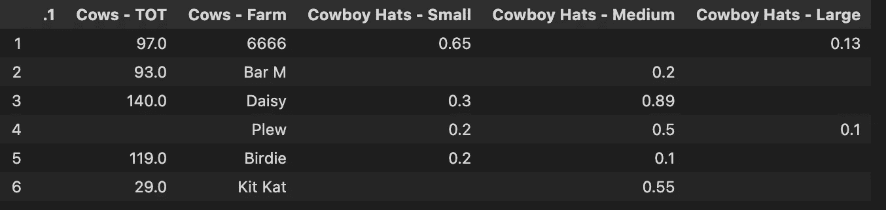

如果我们在单次提示中提供推理，结果会有所改善

也就是说，我们提供的任务并不是很好，因为尽管内容与提供的示例不同，但标题布局仍然相似。事实上，如果我们稍微调整一下要重新格式化的表格并添加一个额外的“有机”列 …

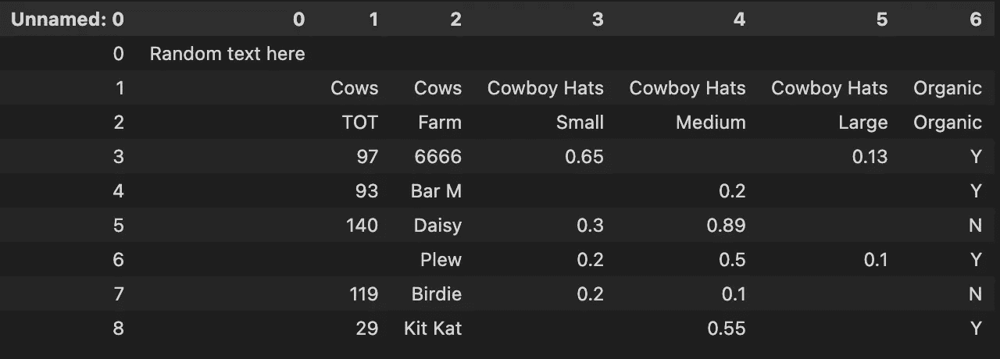

向输入中添加一个额外的列

预测现在不正确 …

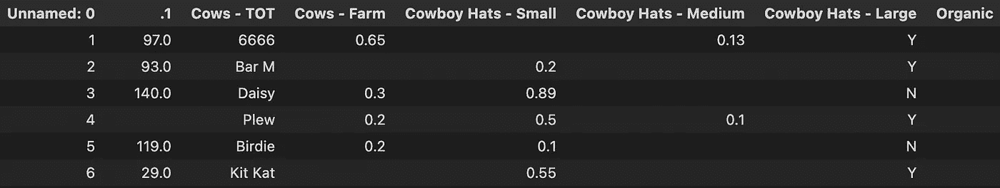

只是标题行中多了*一个*额外的逗号，这导致所有内容向右移动。

我们可能会继续通过更多推理来优化提示，或应用 [更高级的技术](https://github.com/openai/openai-cookbook/blob/main/techniques_to_improve_reliability.md) 自动构建我们的提示工作流，但真正的问题是一个示例并不足以捕捉我们可能遇到的所有表格格式变体。尽管 GPT-3 在仅有一个示例的情况下表现得非常好，但对于这个任务来说，它还不够好（至少就目前的框架而言）。

# 少量示例…. 或者说不是

下一个方法可能是提供多个示例。然而，表格片段需要大量的令牌（稍后会详细说明），所以如果我们必须在提示中提供多个示例，再加上结果中的令牌，就会触及 Open API 的令牌限制。对于 davinci 模型，目前的限制为[4,000](https://platform.openai.com/docs/models/gpt-3)个令牌。此外，由于我们按令牌收费，对于像[DataKind](https://www.datakind.org/)这样的小型非营利组织，发送和接收大量令牌可能会变得昂贵。更长的提示还有性能影响，因此对于这个任务没有探索少样本提示。

所以我决定暂时跳过少样本学习。

# 微调

探索零样本和单样本提示很有趣，如果这些方法在这个用例中有效，将会取得惊人的结果。未来，随着模型的改进，这可能会成为一个可行的选项，但目前，重新定义任务可能更有意义。

另一种方法是通过[微调](https://platform.openai.com/docs/guides/fine-tuning)提供*大量*示例。正如 OpenAI 所述：

*微调可以通过提供以下内容来让你更好地利用 API 提供的模型：*

1.  *比提示设计产生更高质量的结果*

1.  *能够在比提示中能容纳的更多示例上进行训练*

1.  *由于提示较短而节省令牌*

1.  *更低延迟的请求*

起初，我考虑通过提供 GPT-3（i）原始表格的提示（合并单元格未合并）和（ii）作为重新格式化表格的完成项来进行微调。然而，这种方法的挑战在于，它仍然使用了大量的令牌，尤其是我们现在需要使用数百个示例。

与其传递原始表格片段，不如尝试使用该表格的属性，并让 GPT-3 预测我们可以用来解析的关键进一步属性……

# 重新定义任务 — 使用表格属性作为提示

作为一个人（好吧，*大部分*是人），当我扫描 Excel 中的表格时，我可以通过查看值来识别结构，并决定数据的位置。

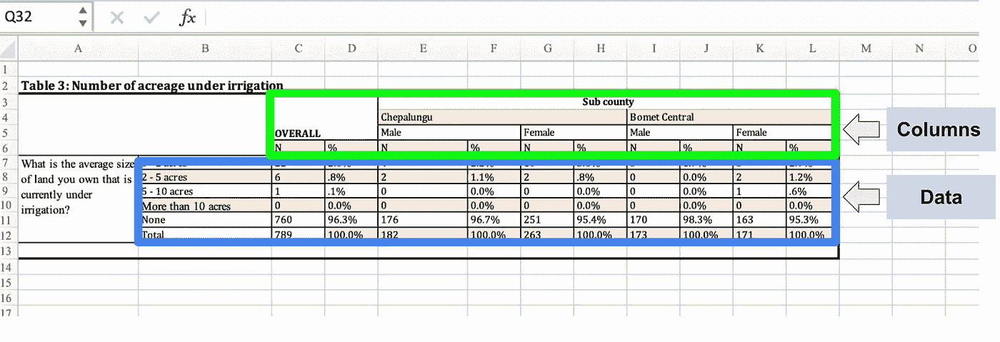

确定表格中的数据部分是将其解析成规则表格结构的关键

一旦我知道数据开始的行，就很容易从上面的行推断出标题层次，并将它们合并成一个单一的标题行，以创建一个整齐、规则的表格来使用……

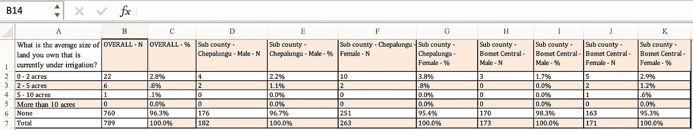

处理后的表格具有平面标题，容易导入关系数据库

确定数据的开始位置乍一看似乎很简单，只需在 [openpyxl](https://openpyxl.readthedocs.io/en/stable/) 或 [pandas.read_excel](https://pandas.pydata.org/docs/reference/api/pandas.read_excel.html) 中稍作处理即可。然而，如果需要处理成千上万的具有不同标题布局、空白行等的电子表格，开发一套用于准确识别每个工作表中数据开始位置的规则将是一项挑战。

这很复杂，因为：

+   列标题可能有很高的变化性，看起来像数据。

+   空白单元格和注释容易混淆解析规则。

+   数据不总是数字的，它可以是分类的，看起来很像列标题。

+   一些列标题是数字，可能看起来像数据，例如年份。

那么，我们应该使用哪些表格属性/特征来预测数据首次出现的行号呢？

我列出了一个我认为可能有用的表格属性的简短清单……

```py
import openpyxl

def get_sheet_attributes(sheet, maxn):
    """
    Returns a set of table attributes for a given sheet

    Input Parameters:
        sheet: Obj
            Openpyxl sheet object
        maxn: int
            Number of rows to scan at start of sheet

    Returns:
        null_cells_in_rows: list of ints
            Count of NULL records in forst maxn rows
        float_cells_in_rows: list of ints
            Count of numeric records in first maxn rows
        unique_vals_in_rows: list of ints
            Count of unique values in first maxn rows
        year_vals_in_rows: list of ints
            Count of year values in first maxn rows
        hxl_row: int
            Row number of HXL header row
        first_float_row: int
            Row number of row with most numeric records
        first_not_null_row: int
            Row number of row with most non-null records

    """
    dd = pd.DataFrame(sheet.values)

    null_cells_in_rows = list(
        dd[0:maxn].apply(lambda x: x.isnull().sum(), axis="columns")
    )
    float_cells_in_rows = []
    unique_vals_in_rows = []
    year_vals_in_rows = []
    report_json = {}
    hxl_row = None
    for index, row in dd[0:maxn].iterrows():
        unique_vals = list(row.unique())
        unique_vals = [i for i in unique_vals if i is not None and str(i) != "nan"]
        unique_vals_in_rows.append(len(unique_vals))
        float_count = 0
        year_count = 0
        if check_hdx_header(list(row)):
            hxl_row = index
        for col in dd.columns:
            val = row[col]
            # Handle numbers that come through as strings
            if isinstance(val, str):
                val = val.replace(",", "").replace(" ", "")
                if val.isnumeric():
                    val = int(val)
            # Check for year values
            if (
                ((isinstance(val, int) or isinstance(val, float)) and val % 1 == 0)
                and val > 1900
                and val < 2100
            ):
                year_count += 1
                continue
            # Check for HXL tags
            if isinstance(val, float) or isinstance(val, int) or "^=" in str(row[col]):
                float_count += 1
        float_cells_in_rows.append(float_count)
        year_vals_in_rows.append(year_count)

    max_floats = max(float_cells_in_rows)
    min_nulls = min(null_cells_in_rows)
    first_float_row = 0
    if sum(float_cells_in_rows) > 0:
        for i in range(1, len(float_cells_in_rows)):
            # Use a ratio or special case where we go from zero to some
            if float_cells_in_rows[i] / max_floats > 0.5 or (
                float_cells_in_rows[i] > 0 and float_cells_in_rows[i - 1] == 0
            ):
                first_float_row = i
                break
    first_not_null_row = np.argmin(null_cells_in_rows)

    report = f"Nulls in first {maxn} rows: {str(null_cells_in_rows)}\n"
    report += f"Numeric first {maxn} rows: {str(float_cells_in_rows)}\n"
    report += f"Unique values in first {maxn} rows: {str(unique_vals_in_rows)}\n"
    report += f"Year values in first {maxn} rows: {str(year_vals_in_rows)}\n"
    report += f"HXL row: {str(hxl_row)}\n"

    report += f"\nFirst reduced nulls row: {str(first_not_null_row)}\n"
    report += f"First increased numeric row (excluding years): {str(first_float_row)}\n"

    report_json = {
        "null_cells_in_rows": null_cells_in_rows,
        "float_cells_in_rows": float_cells_in_rows,
        "unique_vals_in_rows": unique_vals_in_rows,
        "year_vals_in_rows": year_vals_in_rows,
        "hxl_row": hxl_row,
        "first_float_row": first_float_row,
        "first_not_null_row": first_not_null_row,
    }

    return report, report_json

wb = openpyxl.load_workbook(filename, data_only=True)
for s in wb.sheetnames:
    sheet = wb[s]
    report, report_json = get_sheet_attributes(sheet, maxn)
    print(report) 
```

这会产生这样的输出……

```py
Nulls in first 10 rows: [12, 11, 10, 10, 8, 2, 0, 1, 1, 1]
Numeric first 10 rows: [0, 0, 0, 0, 0, 0, 5, 5, 5, 5]
Unique values in first 10 rows: [0, 1, 2, 2, 2, 2, 12, 8, 6, 3]
Year values in first 10 rows: [0, 0, 0, 0, 0, 0, 0, 0, 0, 0]
HXL row: None

First reduced nulls row: 6
First increased numeric row (excluding years): 6
```

这些将是我们用于微调模型的提示。

为了创建微调文件的补全，我使用了肯尼亚的人道主义数据交换数据集（有关如何提取 Excel 文件的更多细节，请参见这里）。解析文件并循环遍历每个工作表，我生成了提示。

我使用了以下逻辑来估算数据开始的行号，使用了上述表格参数……

```py
# Make a guess at which row is the data row
datarow = max_not_null_row
# Sometimes we have header rows where none are null, in this case we want to use the row with the most floats
if max_float_row > datarow:
    datarow = max_float_row
# HXL row is always the row before the data row
if hxl_row is not None:
    datarow = hxl_row
# If we a row with a lot of year values below datarow, use that
if year_vals_in_rows[datarow] > 3:
    datarow = datarow + 1
```

这种基于规则的方法实际上表现得相当不错，但它并不完美，因此需要 GPT-3。尽管如此，它在创建一个大多数补全都准确的测试集时很有用，我只需调整几个逻辑不成立的部分即可。

对于我的训练集，我使用了来自 10 个人道主义提供组织的多个标记为“Kenya”的 Excel 表格中的每个组织的一个表格，其中使用上述基于规则的方法进行了首次数据行的预测。我随后审查了这份清单，并与实际的工作表进行了比较，以纠正电子表格表格开始于不同的行的情况。我排除了本研究中存在多个表格的情况，此后我得到了 232 个这样的微调提示……

```py
{"prompt": "Nulls in first 15 rows: [9, 8, 7, 7, 3, 1, 2, 2, 2, 2, 2]\nNumeric first 15 rows: [0, 0, 0, 0, 0, 3, 3, 3, 3, 3, 3]\nUnique values in first 15 rows: [0, 1, 2, 2, 3, 8, 7, 7, 6, 6, 5]\nYear values in first 15 rows: [0, 0, 0, 0, 0, 0, 0, 0, 0, 0, 0]\nHXL row: None\nFirst reduced nulls row: 5\nFirst increased numeric row (excluding years): 5", "completion": "Data starts at row: 5\n", "meta_data": "./data/Kenya/kenya-hand-washing-statistics-in-bomet-county_118ea93f-83ce-4b86-b1c4-ca54ea9acc8a/Hand_washing_practices_xlsx_efc74f32_ac23_463a_924b_d53c3656b406/Hand washing practices.xlsx"}
{"prompt": "Nulls in first 15 rows: [2, 1, 1, 2, 1, 1, 2, 1, 1, 1, 2, 1, 1, 2, 1]\nNumeric first 15 rows: [0, 0, 0, 0, 0, 0, 0, 0, 0, 0, 0, 0, 0, 0, 0]\nUnique values in first 15 rows: [0, 1, 1, 0, 1, 1, 0, 1, 1, 1, 0, 1, 1, 0, 1]\nYear values in first 15 rows: [0, 0, 0, 0, 0, 0, 0, 0, 0, 0, 0, 0, 0, 0, 0]\nHXL row: None\nFirst reduced nulls row: 1\nFirst increased numeric row (excluding years): 0", "completion": "Data starts at row: 1\n", "meta_data": "./data/Kenya/shcchealthcare-dataset_02995168-3644-4b78-92be-cdf67275b39d/2018_SHCC_Overview_Data_xlsx_d053b42a_7d31_41b5_a6d9_c8b0a424241c/2018 SHCC Overview Data.xlsx"}
{"prompt": "Nulls in first 15 rows: [6, 3, 3, 3, 3, 3, 3, 3, 3, 3, 5, 3, 7, 6, 3]\nNumeric first 15 rows: [0, 0, 3, 3, 3, 3, 3, 3, 3, 3, 1, 3, 0, 0, 0]\nUnique values in first 15 rows: [1, 4, 4, 4, 4, 4, 4, 4, 4, 4, 2, 4, 0, 1, 4]\nYear values in first 15 rows: [0, 0, 0, 0, 0, 0, 0, 0, 0, 0, 0, 0, 0, 0, 0]\nHXL row: None\nFirst reduced nulls row: 1\nFirst increased numeric row (excluding years): 2", "completion": "Data starts at row: 2\n", "meta_data": "./data/Kenya/eastern-southern-africa-refugees-and-idps-situation-and-response-dec2019_e1f9f55e-08db-4166-a787-c7ea9969dc4d/UNICEF_ESARO_Regional_refugee_and_idp_db_2019_November_27_2019_xlsx_0696b7f3_6368_403e_bcb7_eccdc617961f/UNICEF ESARO Regional refugee and idp db 2019 November 27.2019.xlsx"}
```

**附注**：在上面的内容中，你可能注意到我为每个提示添加了一个“meta_data”元素。这不是 JSONL 提示记录的必要部分，但我这样做是为了能够轻松将每个提示与文件关联以便于调试。包含这些额外数据的提示文件似乎仍然被 OpenAI 接受，我认为只要有“prompt”和“completion”元素，它就会接受！

然后我微调了一个 DaVinci 模型……

```py
 ai.api_key_path="./api_key.txt"

train_file = './prompts.json'

print("Uploading training file ...")
training_id = cli.FineTune._get_or_upload(train_file, True)

print("Fine-tuning model ...")
create_args = {
    "training_file": training_id,
    "model": "davinci"
}
resp = ai.FineTune.create(**create_args)
job_id = resp["id"]
status = resp["status"]

print(f'Fine-tunning model with jobID: {job_id}.')
```

我手动检查了微调状态，如下所示……

```py
ai.api_key_path="./api_key.txt"
result = ai.FineTune.retrieve(id=job_id)

print(result['status'])
```

然后完成后，检索了模型……

```py
model = result["fine_tuned_model"]
```

对于测试集，我使用了来自训练集之外组织（标记为‘肯尼亚’）的每个 Excel 文件中的一个表格，首先运行上述基于规则的预测生成提示和完成项，然后纠正返回的错误值。再次排除指定了多个表格的 Excel 表格。这给我提供了 72 个提示的测试集。

```py
 def make_gpt3_prediction(prompt, model, temperature=0.99, max_tokens=13):
    """
    Wrapper to call GPT-3 to make a prediction (completion) on a single prompt.
    Also calls post_process() to clean up the prediction.

    Parameters
    ----------
    prompt : str
        Prompt to use for prediction
    model : str
        GPT-3 model to use
    temperature : float
        Temperature to use for sampling
    max_tokens : int
        Maximum number of tokens to use for sampling

    Returns
    -------
    result : dict
        Dictionary with prompt, predicted, predicted_post_processed
    """
    result = {}
    result["prompt"] = prompt
    model_result = ai.Completion.create(
        engine=model,
        prompt=prompt,
        temperature=temperature,
        max_tokens=max_tokens,
        top_p=1,
        frequency_penalty=0,
        presence_penalty=0,
        stop=["\n"],
        logprobs=1,
    )
    result["predicted"] = model_result["choices"][0]["text"].replace(" ", "")
    result["logprobs"] = model_result["choices"][0]["logprobs"]["top_logprobs"]
    return result

def output_prediction_metrics(results, prediction_field="predicted_post_processed"):
    """
    Prints out model performance report if provided results in the format:

    [
        {
            'prompt': ' \'ISO3\' | "[\'RWA\', \'RWA\', \'RWA\', \'RWA\', \'RWA\', \'RWA\', \'RWA\', \'RWA\']"',
            'predicted': ' #country+code+iso3+v_iso3+',
            'expected': '#country+code'
        },
        ... etc ...
    ]

    Parameters
    ----------
    results : list
        See above for format
    prediction_field : str
        Field name of element with prediction. Handy for comparing raw and post-processed predictions.
    """
    y_test = []
    y_pred = []
    for r in results:
        if "expected" not in r:
            print("Provided results do not contain expected values.")
            sys.exit()
        y_pred.append(r[prediction_field])
        y_test.append(r["expected"])

    print(f"There were {len(y_test)} predictions made.")
    print(f"\nPrediction using field {prediction_field} ...\n")
    print(f"Accuracy: {round(accuracy_score(y_test, y_pred),2)}")
    print(
        f"Precision: {round(precision_score(y_test, y_pred, average='weighted', zero_division=0),2)}"
    )
    print(
        f"Recall: {round(recall_score(y_test, y_pred, average='weighted', zero_division=0),2)}"
    )
    print(
        f"F1: {round(f1_score(y_test, y_pred, average='weighted', zero_division=0),2)}"
    )

# File generated by downloading and processing HDX files. See this blog post
# for more details: https://medium.com/towards-data-science/predicting-metadata-for-humanitarian-datasets-using-gpt-3-b104be17716d
country='Kenya'
resources = pd.read_pickle(hdx_resources_pkl_file)

df = resources[(resources["resource_format"]=='XLSX')][["resource_format","file","sheet","dataset_name","dataset_org_title"]]
df.drop_duplicates(inplace=True)
orgs = df["dataset_org_title"].unique()

# Number of rows to use when calculating table row parameters
maxn = 15

# Determine test/train split, 0:10 used for training, 11:len(orgs) for test
dataset_orgs_cutoff = 10

for dataset_org in orgs[dataset_orgs_cutoff: len(orgs)]:
    rows = df.loc[df['dataset_org_title']== dataset_org]
    row = rows.iloc[0]  # Take one sheet from each org to get more variation
    filename = row["file"]
    sheetname = row["sheet"]

    wb = openpyxl.load_workbook(filename, data_only=True)
    for s in wb.sheetnames:
        sheet = wb[s]

        # Extract table attributes 
        report = get_sheet_attributes(sheet, maxn)

        report_elements = report.split('\n\n')
        prompt = report_elements[0] + report_elements[1]
        completion = report_elements[2]

        # Make our GPT-3 prediction
        res = make_gpt3_prediction(prompt, model, temperature=0.0)

        predicted = res["predicted"].split(':')[1].strip()
        actual = completion.split(':')[1].strip()

        results.append({
            "prompt": prompt,
            "predicted": predicted,
            "expected": actual
        })

output_prediction_metrics(results, prediction_field="predicted")
```

**附注：** 在[我之前的博客文章](https://medium.com/towards-data-science/predicting-metadata-for-humanitarian-datasets-using-gpt-3-b104be17716d)中预测 HXL 标签时，我必须通过对数概率过滤完成项，但在这项研究中没有必要。

GPT-3 在我们的测试集中预测了第一行数据的结果如下……

```py
Prediction using field predicted ...

Accuracy: 0.97
Precision: 1.0
Recall: 0.97
F1: 0.99
```

所以 GPT-3 在预测第一行数据的位置上表现不错。

# 综合起来

**步骤 1 — 读取我们的数据**

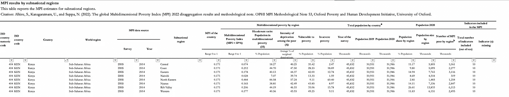

示例电子表格，具有不同的层级标题和单元格中的备注

**步骤 2 — 取消合并的列并填充合并值**

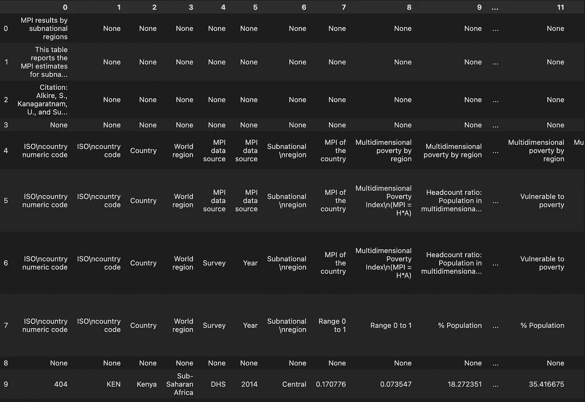

Pandas 数据框在通过‘pad_merged_cells’函数处理后，用于取消合并并填充合并值

**步骤 3 — 计算表格参数以生成 GPT-3 提示**

```py
Nulls in first 10 rows: [20, 20, 20, 21, 10, 8, 19, 9, 21, 0]
Numeric first 10 rows: [0, 0, 0, 0, 0, 0, 0, 0, 0, 14]
Unique values in first 10 rows: [1, 1, 1, 0, 11, 13, 2, 4, 0, 21]
Year values in first 10 rows: [0, 0, 0, 0, 0, 0, 0, 0, 0, 1]
HXL row: None

First reduced nulls row: 9
First increased numeric row (excluding years): 9
```

**步骤 4 — 调用 GPT-3 预测数据行的起始位置**

```py
GPT-3 prediction: 9
```

**步骤 5 — 现在我们知道了数据行的开始位置，将上方的列标题连接成一行**

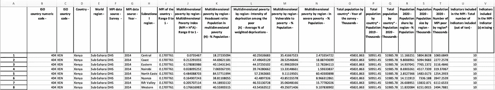

解析后的表格，具有折叠的层级列，没有随机标签。现在可以导入到数据库中。

这是一个我们可以上传到关系数据库的好表格。有关完整代码，请参见下面的参考部分。

诚然，手动解析这个表格并指定一些与我们发现的表格参数相关的规则是很容易的，但上述过程的重点是它可以应用于人道主义数据交换数据集中成千上万的 Excel 表格的广泛表格布局。

# 结论与未来工作

尽管零次和一次提示具有很大的潜力，但在用 CSV 表格进行提示时，这种方法尚未对这个特定任务奏效。随着大型语言模型的进步，这种情况可能会改变——我很期待 GPT-4 的表现——但目前看来，微调是更好的选择，它可以预测关键的表格属性，用于重新格式化。当然，这种方法需要一些预处理，以确定提示的表格参数。值得注意的是，使用表格‘特征’时，它更像是分类任务而不是文本完成，可能会更适合这样框架。不过，无论如何，这种技术在使用人道主义数据交换 Excel 文件时表现良好。

我认为将这项工作扩展到处理 Excel 工作表上有多个表格的情况将非常有趣。这需要比我在这项研究中使用的更多的表格特征，比如单元格格式和列（而不是行）属性。

更多有趣内容敬请期待！

# 参考文献

[1] Haoyu Dong 等人，[TableSense: 使用卷积神经网络进行电子表格表格检测](https://arxiv.org/abs/2106.13500) (2021)

[2] Brown 等人，[语言模型是少样本学习者](https://arxiv.org/pdf/2005.14165.pdf) (2020)。

[3] [OpenAI Cookbook: 提高可靠性的技术](https://github.com/openai/openai-cookbook/blob/main/techniques_to_improve_reliability.md)

[4] Kojima 等人，[大型语言模型是零样本推理者](https://arxiv.org/abs/2205.11916)

这个分析的代码可以在[这个笔记本](https://github.com/datakind/gpt-3-meta-data-discovery/blob/main/gpt-3-table-parsing.ipynb)中找到。
