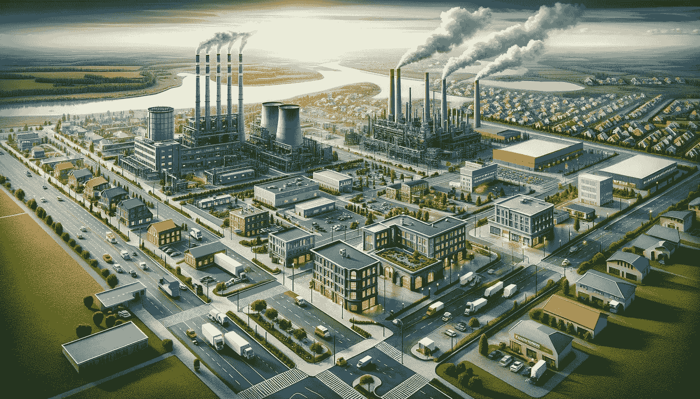
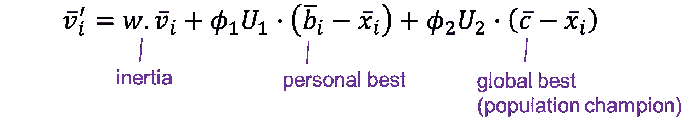
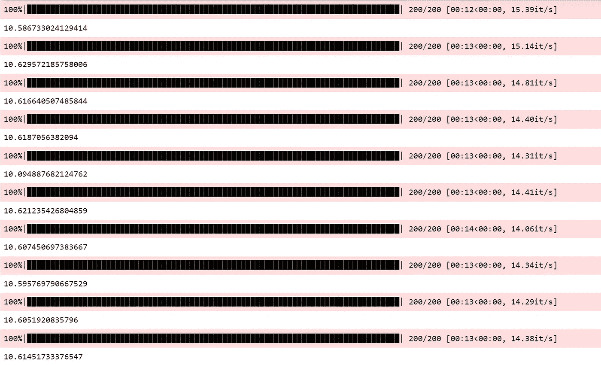

# 粒子群优化：搜索过程可视化

> 原文：[`towardsdatascience.com/particle-swarm-optimization-search-procedure-visualized-4b0364fb3e5a`](https://towardsdatascience.com/particle-swarm-optimization-search-procedure-visualized-4b0364fb3e5a)

## 直觉 + 数学 + 代码，为从业者提供

[](https://medium.com/@byjameskoh?source=post_page-----4b0364fb3e5a--------------------------------)[](https://towardsdatascience.com/?source=post_page-----4b0364fb3e5a--------------------------------) [詹姆斯·柯博士](https://medium.com/@byjameskoh?source=post_page-----4b0364fb3e5a--------------------------------)

·发表于[数据科学前沿](https://towardsdatascience.com/?source=post_page-----4b0364fb3e5a--------------------------------) ·阅读时间 9 分钟·2023 年 12 月 1 日

--


图像由 DALL·E 3 根据提示“绘制一幅科幻主题的图像，描绘一群无人机在城市景观中寻找目标”创建

人类喜欢模仿自然界中的许多事物。

我们模仿青蛙游泳。我们通过在飞机上安装翅膀来模仿鸟类以提供升力。我们模仿起重机/蛇/螳螂来进行武术。我们模仿白蚁来建造具有高效温控的结构（参见东门大厦）。

这也扩展到了数学算法中，例如你可能听说过**蜜蜂**算法、**蚂蚁**算法、**布谷鸟**搜索算法和**萤火虫**算法。我之前还谈过[进化算法，](https://medium.com/towards-data-science/evolutionary-algorithm-selections-explained-2515fb8d4287)它遵循自然选择的原则。

今天，我将讲解 PSO——粒子群优化。在本文的最后，你将获得能够实现解决方案的代码，并生成一个 gif 来可视化搜索过程。

# 使用案例

在高维空间中寻找最优解是困难的。刚接触机器学习的学生可能在第一周就听说过“维度诅咒”这个术语。

高维空间不仅仅是一个抽象的数学概念。考虑一个供应链问题。一家公司必须决定在哪里建立生产工厂、仓库、分销中心和零售店。为了简单起见，我们假设每种设施只有一个。这已经使我们要寻找的解决方案是 8 维的——(*x*₁, *y*₁, *x*₂, *y*₂, *x*₃, *y*₃, *x*₄, *y*₄)。



由 DALL·E 3 根据提示“绘制一个包含四个关键设施——生产工厂、仓库、配送中心和零售店——的全景视图”创建的图像。

绝对位置(*x*₁, *y*₁, *x*₂, *y*₂, *x*₃, *y*₃, *x*₄, *y*₄)影响每个设施之间的相对位置。绝对位置和相对位置都会影响运营成本以及预期收益，从而影响利润。虽然不完全准确，但我们可以大致说搜索空间和对目标函数的影响是连续的。

# 问题的公式化

实际上，将输入（候选解）映射到输出（目标）的底层函数是一个黑箱，无法用数学方法表示。

如果可以的话，可以直接获得解析解。然而，在处理黑箱时，我们将进行*采样*。一个天真的方法是执行网格搜索。在本文末尾，你将掌握更好的工具，更重要的是，理解为什么它有效。

让我们将供应链问题和黑箱转化为以下数学方程式（以便于操作）。同时，我们将导入所有需要的库。

```py
import math
import numpy as np
import random
import matplotlib.pyplot as plt
from tqdm import tqdm

def blackbox(x1, y1, x2, y2, x3, y3, x4, y4):
    return math.sqrt((x1+2)**2 + (y1-3)**2) * \
            math.sin(
                math.atan2(2*(y2-4), 3*(x2+1)) * (
                    math.cos(x3-x1) + math.sin(y3-y1)
                    + math.cos(3*(y4+3))
                    + math.sin(2*(x4-2))
                ) 
            )
```

注意一切是如何被故意纠缠在一起的。这是因为如果使用一个简单的组件加法函数（例如，下方所示），可以执行 O(n²)的网格搜索而不是 O(n⁸)。这也与现实不一致，因为我们不能天真地解决生产设施和零售店位置独立的最佳仓库位置问题。

```py
def blackbox_addition(x1, y1, x2, y2, x3, y3, x4, y4):
    return np.sin(x1) * np.cos(y1) \
            + np.cos(x2) * np.sin(y2) \
            + np.sin(x3) * np.sin(y3) \
            + np.cos(x4) * np.cos(y4)
```

问题的目标是找到(*x*₁, *y*₁, *x*₂, *y*₂, *x*₃, *y*₃, *x*₄, *y*₄)，使得`blackbox`给出的输出尽可能高，而不知道底层方程。为了使问题更具现实性，我们在采样过程中加入噪声。当然，我们可以简单地在每个点重复测量并取平均值，但一个鲁棒的搜索算法即使没有这样做也应能表现良好。

```py
class Task:
    def __init__(self):
        pass

    def score(self, x_arr, with_noise=True):
        if with_noise:
            return blackbox(*x_arr) + 0.1*np.random.randn()
        else:
            return blackbox(*x_arr)
```

# 解决方案的公式化

让我们从 PSO 的基本构建块——粒子开始。一个粒子是一个候选解向量，携带其个人最佳解和一组向量，这些向量决定了个人影响和社会影响的程度。在每次迭代中，每个粒子*i*根据其速度探索新的解：


所有图像均为作者提供，除非另有说明。

该速度受其惯性控制，同时也受到个人最佳解和群体全局最佳解的倾斜影响。[1]



每个粒子的速度由三个组件决定。

*w*是粒子继续沿其先前轨迹的倾向，而*ϕ*₁和*ϕ*₂可以看作是对个人和全球最佳的学习率。拥有惯性是个好主意，因为如果我们之前已经朝着一个假设的良好方向前进，那么继续保持是合理的。事实上，这种动量概念也存在于 Adam 优化器中，用于在梯度下降过程中更新神经网络的权重。

个人最佳，甚至全球最佳，是基于迄今为止发现的内容。可能有些方面（即维度）较好，至少相对而言，但不是全部。然而，我们不知道哪些维度应该保留，因此只能尝试各种组合。秉持进化算法的精神，重要的是*最佳*粒子而不是平均种群，因此探索时只有上升潜力。

将这个概念转化为数学方程，我们有向量*U*₁和*U*₂从均匀分布中随机抽取，乘以各自的学习率*ϕ*₁和*ϕ*₂。每个粒子对其个人最佳和全球最佳有不同维度上的亲和力。综合来看，我们可以为`Particle`类写出如下代码。

```py
class Particle:
    def __init__(self, idx, n_dim, param_limits=(-1,1)):
        self.idx = idx
        self.low = param_limits[0]
        self.high = param_limits[1]
        self.pos = np.random.uniform(
            low=self.low, high=self.high, size=(n_dim,)
        )
        self.w = np.random.uniform(0.1, 0.5)
        self.r1 = np.random.uniform(0, 1, size=(n_dim,))
        self.r2 = np.random.uniform(0, 1, size=(n_dim,))
        self.vel = np.random.normal(size=n_dim)
        self.pbest = np.zeros(n_dim,)
        self.pbest_fitness = -1e8

    def update(self, gbest, task):
        self.vel = self.w * self.vel \
                + self.r1 * (self.pbest - self.pos) \
                + self.r2 * (gbest - self.pos)

        self.vel = np.clip(self.vel, 0.2*self.low, 0.2*self.high)
        self.pos = np.clip(self.pos + self.vel, self.low, self.high)

        fitness = task.score(self.pos)
        if fitness > self.pbest_fitness:
            self.pbest_fitness = fitness
            self.pbest = deepcopy(self.pos)
        return self.pos
```

注意，我将*ϕ*₁*U*₁和*ϕ*₂*U*₂分别合并为*r*₁和*r*₂，以便（非常轻微地）节省计算。实际上，我将学习率规定为 1 的数量级，以节省这个简单问题的时间。你也可以使用`random.uniform(0,0.1)`或你认为合适的其他范围。

接下来，一个**群体**包含大量粒子。每个粒子是独立创建的，并且对个人最佳和全球最佳的不同维度有其独特的亲和力。在每次迭代中，所有粒子根据其‘速度’搜索附近的解决方案，并跟踪其速度，如本节开头所示。

```py
class Swarm:
    def __init__(self, n_dim, n_population, param_limits):
        self.n_dim = n_dim
        self.particles = [Particle(i+1, n_dim, param_limits) for i in range(n_population)]
        self.reset()

    def reset(self):
        self.gbest = np.zeros(self.n_dim,)
        self.gbest_fitness = -1e8
        self.history = {}

    def update_all_particles(self, task):
        for particle_Obj in self.particles:
            particle_Obj.update(self.gbest, task)

    def solve(self, task, num_generation):
        self.reset()
        for t in tqdm(range(num_generation)):
            self.update_all_particles(task)
            particles_pbest_fitness = [task.score(p.pos) for p in self.particles]
            self.history[t] = dict([(p, deepcopy(p.pos)) for p in self.particles])
            if np.max(particles_pbest_fitness) > self.gbest_fitness:
                self.gbest_fitness = np.max(particles_pbest_fitness)
                self.gbest_index = np.argmax(particles_pbest_fitness)
                self.gbest_particle = self.particles[self.gbest_index]
                self.gbest = self.gbest_particle.pos                
        return self.gbest
```

实现可以如下完成。这里，种群包括 2000 个粒子作为示例。每个粒子都有一个噪声测量值，但噪声会从最终解决方案中去除，以获得算法性能的准确度量。注意，`gbest`不需要在每次迭代中更新。这是因为没有保证每次解决方案都会改进。

```py
position_min, position_max = -5, 5
swarm = Swarm(
    n_dim=8, n_population=2000, param_limits=(position_min, position_max)
)
solution = swarm.solve(task, num_iteration=200)

print(solution)
print(task.score(solution, with_noise=False))
```

# 结果

仅需几秒钟即可找到解决方案。为了公平起见，我重复了十次实验，每次循环都删除`swarm`并重新初始化所有内容。结果不可避免地有所不同，因为每个粒子都被随机初始化，侧重于不同的组件。



进行 10 次 PSO，每次有 200 次迭代。

如果没有 PSO 或其他优秀的搜索算法，你的替代方案是进行暴力网格搜索。让我们看看这种方法与 PSO 的比较如何。

```py
best_score = -np.inf
solution = None
intervals = 11

for x1 in tqdm(np.linspace(position_min, position_max, intervals)):
    for y1 in np.linspace(position_min, position_max, intervals):
        for x2 in np.linspace(position_min, position_max, intervals):
            for y2 in np.linspace(position_min, position_max, intervals):
                for x3 in np.linspace(position_min, position_max, intervals):
                    for y3 in np.linspace(position_min, position_max, intervals):
                        for x4 in np.linspace(position_min, position_max, intervals):
                            for y4 in np.linspace(position_min, position_max, intervals):
                                sample = task.score(np.array([x1,y1,x2,y2,x3,y3,x4,y4]))
                                if sample > best_score:
                                    best_score = sample
                                    solution = np.array([x1,y1,x2,y2,x3,y3,x4,y4])

print("solution: ", solution)
print(task.score(solution, with_noise=False))
```

即使在每个维度上仅进行 11 个点（即分成十分之一）的极其粗略搜索，也需要进行 10⁸次黑箱函数计算。在我的计算机上，这需要超过 20 分钟。请注意，这是在“最佳性能”模式下，并且背景中没有其他程序运行；甚至没有音乐（我在等待期间去喝了咖啡）。在现实中，每次计算可能涉及一个需要更长时间的模拟。


完成八维网格搜索所需的时间，以及对应的最佳解决方案和目标函数值。

仅使用极少的计算预算，PSO 解决了问题（中位数 10.61，最大 10.63），效果与蛮力网格搜索（最终值 10.61）一样好。值得注意的是，我们这里只涉及 8 维。如果涉及 1000 维等问题，网格搜索显然不可行，而 PSO 的好处将得到放大。

# 可视化

让我们看看粒子在迭代中的分布情况。尽管在 8 维中可视化事物是不可能的，我们可以每次关注两个维度，同时忽略其他组件。

在下面的图中，热图展示的是在仅改变两个维度的同时，保持其他 6 个维度为该特定迭代的`swarm.gbest_particle`值的目标值。因此，每个快照实际上仅适用于一个粒子（且没有实际方法同时呈现 2000 个热图）。尽管如此，它仍然提供了一些想法，胜于空白背景。

```py
x_range = np.linspace(-5, 5, 100)
y_range = np.linspace(-5, 5, 100)
X, Y = np.meshgrid(x_range, y_range)
vectorized_blackbox = np.vectorize(blackbox)

for t in [1,2,3,4,5,6,8,10,12,15,20,30,50,100,200]:
    data = np.array(list(swarm.history[t-1].values()))
    ref = data[swarm.gbest_particle.idx-1,:]
    heatmap = {
        1: vectorized_blackbox(X, Y, ref[2], ref[3], ref[4], ref[5], ref[6], ref[7]),
        2: vectorized_blackbox(ref[0], ref[1], X, Y, ref[4], ref[5], ref[6], ref[7]),
        3: vectorized_blackbox(ref[0], ref[1], ref[2], ref[3], X, Y, ref[6], ref[7]),
        4: vectorized_blackbox(ref[0], ref[1], ref[2], ref[3], ref[4], ref[5], X, Y)
    }

    fig, axs = plt.subplots(2, 2, figsize=(10, 10))
    for i in range(2):
        for j in range(2):
            c = axs[i,j].contourf(X, Y, heatmap[2*i+j+1], vmin=0, vmax=12, levels=50, alpha=0.5)
            axs[i,j].scatter(data[:, 2*i+j], data[:, 2*i+j+1], s=2, alpha=0.4)
            axs[i,j].scatter(data[swarm.gbest_particle.idx-1, 2*i+j], data[swarm.gbest_particle.idx-1, 2*i+j+1], c='w', s=5, alpha=1)
            axs[i,j].set_xlabel("x_%d"%(2*i+j+1))
            axs[i,j].set_ylabel("y_%d"%(2*i+j+1))
            axs[i,j].set_xlim([-5, 5])
            axs[i,j].set_ylim([-5, 5])
    fig.colorbar(c, ax=axs)
    plt.suptitle("Distribution of particles at iteration %d"%t)
    plt.savefig("plot_%03d.png"%t)
```

使用`imageio`库创建 gif，如[之前共享的](https://medium.com/towards-data-science/a-cornerstone-of-rl-td-%CE%BB-and-3-big-names-2e547b37c05)，我们可以将所有图形组合成以下 gif。

白点表示`swarm.gbest_particle`的位置，而其他 1999 个粒子由较小的蓝点表示。

可能会很诱人急于得出结论，声称 PSO 代理是“愚蠢的”，只需稍微朝地图上更亮的区域移动即可。这样的论点是有缺陷的。我们看到的热图只是多维解决空间的一部分，正如 gif 中所示，当其他维度取不同的值时，它可以有很大变化。这不仅仅是贪婪地逐个优化组件维度的问题。如果采用了不同的表示组合，比如说*x*₁与*y*₃，或*x*₄与*y*₂，情况会有所不同。没有一种万全的技术可以同时让所有人满意。

最终，结果说明了一切，PSO 在几秒钟内解决问题的事实证明了其有效性。

# 结论

在这篇文章中，我们探讨了如何高效地实现 PSO 来寻找未知黑箱的最优解，并了解了实现这一目标的幕后过程。

我设想继续进行一系列以自然为灵感的算法。毕竟，自然是美丽的。数学是美丽的。自然中的数学？这必定是最棒的。

在我的下一篇文章中，我将解释 ABC（人工蜂群）的实现方法，并与 PSO 进行比较，探讨 ABC 在何种问题上表现更佳。敬请关注。

# 参考文献

[1] A. E. Eiben 和 J. E. Smith, [进化计算导论](https://link.springer.com/book/10.1007/978-3-662-44874-8) (2015), Springer-Verlag Berlin Heidelberg
