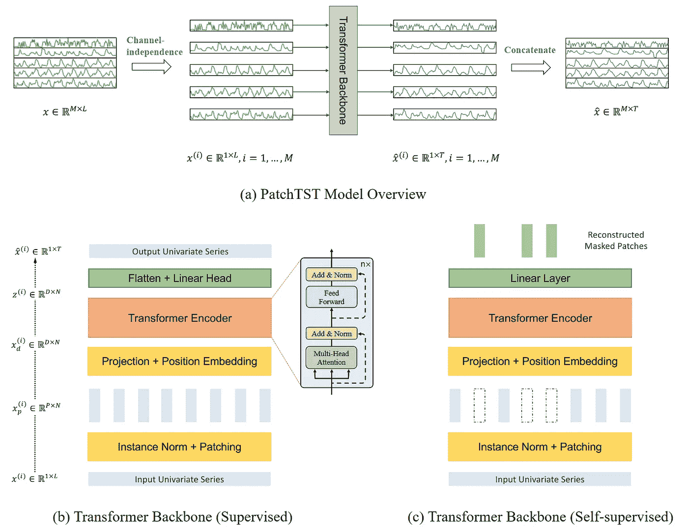
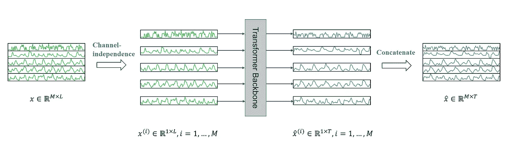
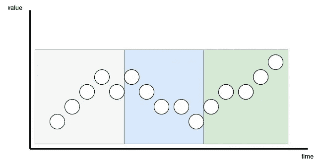
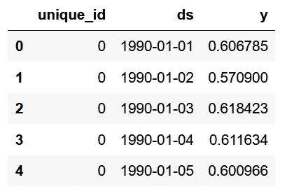
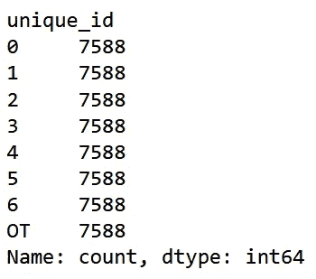
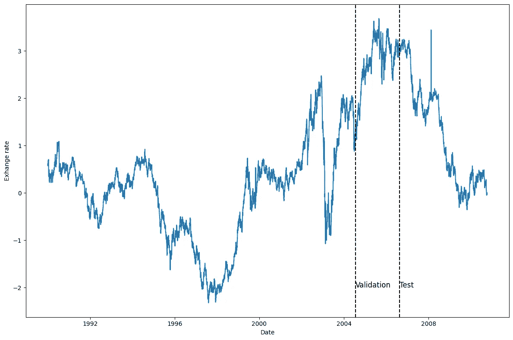
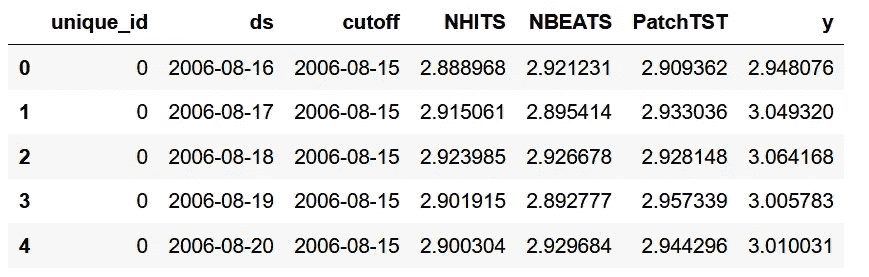
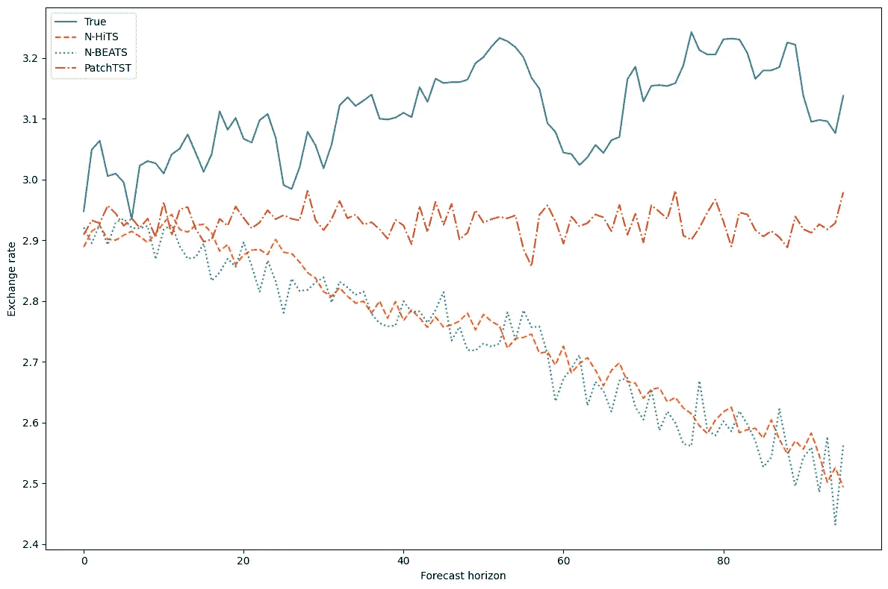
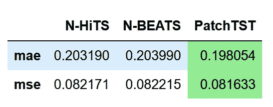

# PatchTST：时间序列预测中的突破

> 原文：[`towardsdatascience.com/patchtst-a-breakthrough-in-time-series-forecasting-e02d48869ccc`](https://towardsdatascience.com/patchtst-a-breakthrough-in-time-series-forecasting-e02d48869ccc)

## 从理论到实践，了解 PatchTST 算法，并在 Python 中与 N-BEATS 和 N-HiTS 一起应用。

[](https://medium.com/@marcopeixeiro?source=post_page-----e02d48869ccc--------------------------------)[](https://towardsdatascience.com/?source=post_page-----e02d48869ccc--------------------------------) [Marco Peixeiro](https://medium.com/@marcopeixeiro?source=post_page-----e02d48869ccc--------------------------------)

·发表于 [Towards Data Science](https://towardsdatascience.com/?source=post_page-----e02d48869ccc--------------------------------) ·阅读时间 10 分钟·2023 年 6 月 20 日

--


图片由 [Ray Hennessy](https://unsplash.com/@rayhennessy?utm_source=medium&utm_medium=referral) 提供，来源于 [Unsplash](https://unsplash.com/?utm_source=medium&utm_medium=referral)

基于变换器的模型已成功应用于许多领域，如自然语言处理（例如 BERT 或 GPT 模型）和计算机视觉等。

然而，在时间序列方面，最先进的结果主要由 MLP 模型（多层感知器）如 [N-BEATS](https://medium.com/towards-data-science/the-easiest-way-to-forecast-time-series-using-n-beats-d778fcc2ba60) 和 N-HiTS 实现。最近的一篇论文甚至表明，简单的线性模型在许多基准数据集上优于复杂的基于变换器的预测模型（见 [Zheng 等人, 2022](https://arxiv.org/pdf/2205.13504.pdf)）。

尽管如此，一种新的基于变换器的模型已经被提出，并在长期预测任务中取得了最先进的结果：**PatchTST**。

PatchTST 代表补丁时间序列变换器，它首次由 Nie、Nguyen 等人在 2023 年 3 月提出，详细介绍在他们的论文中：[时间序列值得 64 个词：使用变换器进行长期预测](https://arxiv.org/pdf/2211.14730.pdf)。他们提出的方法在与其他基于变换器的模型比较时，取得了最先进的结果。

在这篇文章中，我们首先直观地探索 PatchTST 的内部工作原理，而不使用任何方程式。接着，我们将该模型应用于预测项目，并将其性能与 MLP 模型（如 N-BEATS 和 N-HiTS）进行比较和评估。

当然，关于 PatchTST 的更多细节，请参考 [原始论文](https://arxiv.org/pdf/2211.14730.pdf)。

> ***使用我的*** [***免费时间序列备忘单***](https://www.datasciencewithmarco.com/pl/2147608294) ***在 Python 中学习最新的时间序列分析技术！获取统计和深度学习技术的实现，全部使用 Python 和 TensorFlow！***

让我们开始吧！

# 探索 PatchTST

如前所述，PatchTST 代表补丁时间序列 transformer。

正如名字所示，它利用了补丁和 transformer 架构。它还包括通道独立性来处理多变量时间序列。下面展示了总体架构。



PatchTST 模型架构。我们看到该模型利用通道独立性来处理多变量时间序列。在 transformer 主干中，我们还看到使用了补丁（由矩形表示）。此外，模型有两个版本：监督学习和自监督学习。图片由 Nie Y.、Nguyen N.、Sinthong P.、Kalagnanam J. 提供，来源于 [“一个时间序列值 64 个词：使用 Transformer 进行长期预测”](https://arxiv.org/pdf/2211.14730.pdf)。

从上图中需要收集大量信息。这里的关键要素是，PatchTST 使用通道独立性来预测多变量时间序列。然后，在其 transformer 主干中，该模型使用补丁，这些补丁由小的垂直矩形表示。此外，该模型有两个版本：监督学习和自监督学习。

让我们更详细地探讨 PatchTST 的架构和内部工作原理。

## 通道独立性

在这里，多变量时间序列被视为多通道信号。每个时间序列基本上是一个包含信号的通道。



PatchTST 模型概述。在这里，我们特别强调通道独立性的实现，其中每个输入 token 到 Transformer 主干仅包含来自一个通道或一个时间序列的信息。图片由 Nie Y.、Nguyen N.、Sinthong P.、Kalagnanam J. 提供，来源于 [“一个时间序列值 64 个词：使用 Transformer 进行长期预测”](https://arxiv.org/pdf/2211.14730.pdf)。

在上图中，我们看到如何将多变量时间序列分离成单独的序列，并将每个序列作为输入 token 传递给 Transformer 主干。然后，对每个序列进行预测，结果被连接起来形成最终预测。

## 补丁

大多数基于 Transformer 的预测模型的工作集中在构建新的机制来简化原始注意力机制。然而，它们仍然依赖于逐点注意力，这在时间序列的情况下并不理想。

在时间序列预测中，我们希望提取过去时间步和未来时间步之间的关系以进行预测。使用逐点注意力时，我们试图从单个时间步中检索信息，而不考虑该点周围的内容。换句话说，我们孤立一个时间步，而不查看之前或之后的点。

这就像试图理解一个词的意义而不看句子中的其他词一样。

因此，PatchTST 利用分块来提取时间序列中的局部语义信息。

## 分块如何工作

每个输入序列被分成块，这些块只是来自原始序列的较短序列。


PatchTST 的 Transformer 主干。这里，我们看到输入时间序列（图底部）经过分块，结果是多个块（垂直矩形），然后被送到 Transformer 编码器。图片由 Nie Y.、Nguyen N.、Sinthong P.、Kalagnanam J. 提供，来自 [A Time Series is Worth 64 Words: Long-Term Forecasting with Transformers](https://arxiv.org/pdf/2211.14730.pdf)。

这里，块可以是重叠的也可以是不重叠的。块的数量取决于块的长度 *P* 和步幅 *S*。这里，步幅类似于卷积，它只是分隔连续块开始的时间步数。



可视化分块。这里，我们有一个 15 个时间步的序列，分块长度为 5，步幅也为 5，结果是三个块。图片由作者提供。

在上图中，我们可以可视化分块的结果。这里，我们有一个序列长度 (*L*) 为 15 个时间步，分块长度 (*P*) 为 5，步幅 (*S*) 为 5。结果是序列被分为 3 个块。

## 分块的优势

通过分块，模型可以通过查看时间步的组而不是单个时间步来提取局部语义信息。

它还有一个额外的好处，就是大大减少了送入 Transformer 编码器的标记数量。这里，每个块成为输入到 Transformer 的输入标记。这样，我们可以将标记数量从 *L* 减少到大约 *L/S*。

这样，我们大大减少了模型的空间和时间复杂度。这反过来意味着我们可以给模型输入更长的序列，以提取有意义的时间关系。

因此，通过分块，模型变得更快、更轻，并且可以处理更长的输入序列，这意味着它可能会对序列学习得更多并做出更好的预测。

## Transformer 编码器

一旦序列被分块，它会被送入 Transformer 编码器。这是经典的 Transformer 架构，没有任何修改。

然后，将输出送入线性层，并进行预测。

## 使用表示学习改进 PatchTST

论文的作者建议通过使用表示学习来改进模型。


在 PatchTST 中可视化自监督表示学习。在这里，模型将随机掩盖补丁并学习重建它们。图片由 Nie Y.、Nguyen N.、Sinthong P.、Kalagnanam J.提供，来自[A Time Series is Worth 64 Words: Long-Term Forecasting with Transformers](https://arxiv.org/pdf/2211.14730.pdf)。

从上图中，我们可以看到 PatchTST 可以利用自监督表示学习来捕捉数据的抽象表示。这可能会导致预测性能的潜在改善。

在这里，过程相当简单，因为随机补丁将被掩盖，意味着它们将被设置为 0。这在上图中由空白的垂直矩形表示。然后，模型被训练以重建原始补丁，这就是图顶端输出的灰色垂直矩形。

现在我们对 PatchTST 的工作原理有了很好的理解，让我们将其与其他模型进行测试，看看其表现如何。

# 使用 PatchTST 进行预测

在论文中，PatchTST 与其他基于 Transformer 的模型进行了比较。然而，最近也发布了基于 MLP 的模型，如 N-BEATS 和 N-HiTS，它们在长期预测任务中也展示了最先进的性能。

本节的完整源代码可在[GitHub](https://github.com/marcopeix/datasciencewithmarco/blob/master/PatchTST.ipynb)上找到。

在这里，让我们应用 PatchTST，以及 N-BEATS 和 N-HiTS，并评估它在这两个基于 MLP 的模型中的表现。

对于这个练习，我们使用 Exchange 数据集，这是研究中用于长期预测的常见基准数据集。该数据集包含 1990 年至 2016 年期间相对于美元的八个国家的每日汇率。该数据集通过 MIT 许可证提供。

## 初始设置

让我们首先导入所需的库。在这里，我们将使用`neuralforecast`，因为它们有一个现成的 PatchTST 实现。对于数据集，我们使用`datasetsforecast`库，其中包含所有流行的数据集，用于评估预测算法。

```py
import torch
import numpy as np
import pandas as pd
import matplotlib.pyplot as plt

from neuralforecast.core import NeuralForecast
from neuralforecast.models import NHITS, NBEATS, PatchTST

from neuralforecast.losses.pytorch import MAE
from neuralforecast.losses.numpy import mae, mse

from datasetsforecast.long_horizon import LongHorizon
```

如果你已经安装了 CUDA，那么`neuralforecast`将自动利用你的 GPU 来训练模型。在我这边，我没有安装 CUDA，这就是为什么我没有进行广泛的超参数调整或在非常大的数据集上训练的原因。

完成这一步后，让我们下载 Exchange 数据集。

```py
Y_df, X_df, S_df = LongHorizon.load(directory="./data", group="Exchange")
```

在这里，我们看到得到三个 DataFrames。第一个包含每个国家的每日汇率。第二个包含外生时间序列。第三个包含静态外生变量（如日期、月份、年份、小时或我们已知的任何未来信息）。

对于这个练习，我们只使用`Y_df`。

然后，确保日期具有正确的类型。

```py
Y_df['ds'] = pd.to_datetime(Y_df['ds'])

Y_df.head()
```



Exchange 数据集的前五行。作者提供的图片。

在上图中，我们看到有三列。第一列是唯一标识符，当使用`neuralforecast`时，需要有一个 id 列。然后，`ds`列有日期，`y`列有汇率。

```py
Y_df['unique_id'].value_counts()
```



显示每个唯一 id 的观测数量。图片由作者提供。

从上图可以看出，每个唯一 id 对应一个国家，我们每个国家有 7588 个观测值。

现在，我们定义验证集和测试集的大小。在这里，我选择了 760 个时间步作为验证集，1517 个时间步作为测试集，如`[datasets](https://github.com/Nixtla/datasetsforecast/blob/main/datasetsforecast/long_horizon.py)` [库](https://github.com/Nixtla/datasetsforecast/blob/main/datasetsforecast/long_horizon.py)所规定。

```py
val_size = 760
test_size = 1517

print(n_time, val_size, test_size)
```

然后，让我们绘制其中一个序列，看看我们在处理什么。在这里，我决定绘制第一个国家的序列（unique_id = 0），但可以自由绘制其他序列。

```py
u_id = '0'

x_plot = pd.to_datetime(Y_df[Y_df.unique_id==u_id].ds)
y_plot = Y_df[Y_df.unique_id==u_id].y.values

x_plot

x_val = x_plot[n_time - val_size - test_size]
x_test = x_plot[n_time - test_size]

fig, ax = plt.subplots(figsize=(12,8))
ax.plot(x_plot, y_plot)
ax.set_xlabel('Date')
ax.set_ylabel('Exhange rate')
ax.axvline(x_val, color='black', linestyle='--')
ax.axvline(x_test, color='black', linestyle='--')

plt.text(x_val, -2, 'Validation', fontsize=12)
plt.text(x_test,-2, 'Test', fontsize=12)

plt.tight_layout()
```



第一个国家从 1990 年到 2016 年的每日汇率。图片由作者提供。

从上图中，我们看到数据相当嘈杂，没有明显的季节性。

## 建模

探索了数据后，让我们开始使用`neuralforecast`进行建模。

首先，我们需要设置预测期。在这种情况下，我使用 96 个时间步，因为这个预测期也在[PatchTST 论文](https://arxiv.org/pdf/2211.14730.pdf)中使用。

然后，为了公平评估每个模型，我决定将输入大小设置为预测期的两倍（即 192 个时间步），并将最大训练轮数设置为 50。所有其他超参数保持默认值。

```py
horizon = 96

models = [NHITS(h=horizon,
               input_size=2*horizon,
               max_steps=50),
         NBEATS(h=horizon,
               input_size=2*horizon,
               max_steps=50),
         PatchTST(h=horizon,
                 input_size=2*horizon,
                 max_steps=50)]
```

然后，我们初始化`NeuralForecast`对象，指定我们要使用的模型和预测频率，在这里是每日。

```py
nf = NeuralForecast(models=models, freq='D')
```

我们现在准备进行预测。

## 预测

为了生成预测，我们使用`cross_validation`方法利用验证集和测试集。它将返回一个包含所有模型预测值及相关真实值的 DataFrame。

```py
preds_df = nf.cross_validation(df=Y_df, val_size=val_size, test_size=test_size, n_windows=None)
```



预测 DataFrame 的前五行。图片由作者提供。

如您所见，对于每个 id，我们有来自每个模型的预测以及`y`列中的真实值。

现在，为了评估模型，我们需要将实际值和预测值的数组重塑为形状为`(series 的数量, 窗口数量, 预测期)`。

```py
y_true = preds_df['y'].values
y_pred_nhits = preds_df['NHITS'].values
y_pred_nbeats = preds_df['NBEATS'].values
y_pred_patchtst = preds_df['PatchTST'].values

n_series = len(Y_df['unique_id'].unique())

y_true = y_true.reshape(n_series, -1, horizon)
y_pred_nhits = y_pred_nhits.reshape(n_series, -1, horizon)
y_pred_nbeats = y_pred_nbeats.reshape(n_series, -1, horizon)
y_pred_patchtst = y_pred_patchtst.reshape(n_series, -1, horizon)
```

完成后，我们可以选择性地绘制模型的预测。在这里，我们绘制了第一个序列的第一个窗口中的预测。

```py
fig, ax = plt.subplots(figsize=(12,8))

ax.plot(y_true[0, 0, :], label='True')
ax.plot(y_pred_nhits[0, 0, :], label='N-HiTS', ls='--')
ax.plot(y_pred_nbeats[0, 0, :], label='N-BEATS', ls=':')
ax.plot(y_pred_patchtst[0, 0, :], label='PatchTST', ls='-.')
ax.set_ylabel('Exchange rate')
ax.set_xlabel('Forecast horizon')
ax.legend(loc='best')

plt.tight_layout()
```



第一个序列在第一个窗口中的每日汇率预测。图片由作者提供。

这个图有点让人失望，因为 N-BEATS 和 N-HiTS 的预测结果与实际值差异很大。然而，尽管 PatchTST 也有偏差，但似乎最接近实际值。

当然，我们必须对此持保留态度，因为我们只是可视化了一个序列中的一个预测窗口。

## 评估

所以，让我们评估每个模型的表现。为了复制论文中的方法，我们使用 MAE 和 MSE 作为性能指标。

```py
data = {'N-HiTS': [mae(y_pred_nhits, y_true), mse(y_pred_nhits, y_true)],
       'N-BEATS': [mae(y_pred_nbeats, y_true), mse(y_pred_nbeats, y_true)],
       'PatchTST': [mae(y_pred_patchtst, y_true), mse(y_pred_patchtst, y_true)]}

metrics_df = pd.DataFrame(data=data)
metrics_df.index = ['mae', 'mse']

metrics_df.style.highlight_min(color='lightgreen', axis=1)
```



所有模型的性能。在这里，PatchTST 实现了最低的 MAE 和 MSE。图片由作者提供。

在上表中，我们看到 PatchTST 是冠军模型，因为它实现了最低的 MAE 和 MSE。

当然，这不是最彻底的实验，因为我们只使用了一个数据集和一个预测范围。尽管如此，看到一个基于 Transformer 的模型能够与最先进的 MLP 模型竞争仍然很有趣。

# 结论

PatchTST 是基于 Transformer 的模型，通过补丁来提取时间序列数据中的局部语义意义。这使得模型的训练速度更快，并且具有更长的输入窗口。

相较于其他基于 Transformer 的模型，它已经达到了最先进的性能。在我们的练习中，我们看到它的表现也优于 N-BEATS 和 N-HiTS。

虽然这并不意味着它比 N-HiTS 或 N-BEATS 更好，但它仍然是一个有趣的选项，尤其是在长期预测时。

感谢阅读！希望你喜欢这篇文章，并且学到了一些新东西！

想要掌握时间序列预测？那就看看[Python 应用时间序列预测](https://www.datasciencewithmarco.com/offers/zTAs2hi6/checkout?coupon_code=ATSFP10)。这是唯一一个通过 15 个引导实践项目使用 Python 实现统计学、深度学习和最先进模型的课程。

干杯 🍻

# 支持我

喜欢我的工作吗？通过[给我买杯咖啡](http://buymeacoffee.com/dswm)来表示支持，这是鼓励我的简单方式，我可以享受一杯咖啡！如果你愿意，请点击下面的按钮 👇


# 参考文献

[时间序列的价值为 64 个词：使用 Transformer 进行长期预测](https://arxiv.org/pdf/2211.14730.pdf) 作者：Nie Y., Nguyen N. 等。

[Neuralforecast](https://nixtla.github.io/neuralforecast/) 作者：Olivares K., Challu C., Garza F., Canseco M., Dubrawski A.
