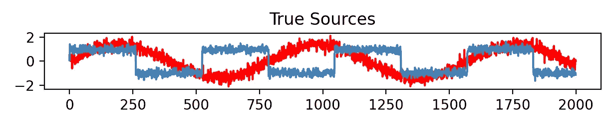

# PCA/LDA/ICA：组件分析算法比较

> 原文：[`towardsdatascience.com/pca-lda-ica-a-components-analysis-algorithms-comparison-c5762c4148ff`](https://towardsdatascience.com/pca-lda-ica-a-components-analysis-algorithms-comparison-c5762c4148ff)

## 回顾这些著名算法的概念和差异

  [Yoann Mocquin](https://mocquin.medium.com/?source=post_page-----c5762c4148ff--------------------------------)

·发表于[Towards Data Science](https://towardsdatascience.com/?source=post_page-----c5762c4148ff--------------------------------) ·8 分钟阅读·2023 年 2 月 19 日

--

在深入比较算法之前，让我们先独立回顾一下它们。

*注意，本文章并不旨在深入解释每个算法，而是比较它们的目标和结果。*

如果你想了解更多关于 PCA 和 ZCA 的区别，请查看我之前基于 numpy 的文章：

## PCA-whitening vs ZCA-whitening：一个 numpy 2D 可视化

### 数据白化的过程包括一种变换，使得变换后的数据具有单位矩阵作为…

[towardsdatascience.com

# PCA：主成分分析

+   PCA 是一种无监督的线性降维技术，旨在找到一组新的正交变量，这些变量捕捉数据中最重要的变异来源。

+   它广泛用于特征提取和数据压缩，并且可以用于探索性数据分析或作为机器学习算法的预处理步骤。

+   生成的组件根据它们解释的方差量进行排名，可以用来可视化和解释数据，以及用于聚类或分类任务。

# LDA：线性判别分析

+   LDA 是一种监督式线性降维技术，旨在找到一组新的变量，这些变量最大限度地提高类之间的分离，同时最小化每个类内的变化。

+   PCA 广泛用于特征提取和分类，并且可以在保留类间判别信息的同时减少数据的维度。

+   结果组件按其区分能力排序，可以用来可视化和解释数据，以及进行分类或回归任务。

# ICA：独立成分分析

+   ICA 是一种无监督的线性降维技术，旨在找到一组统计上独立且非高斯的变量。

+   它广泛用于信号处理和源分离，可以用来提取数据中其他技术无法访问的潜在变异源。

+   结果组件按其独立性排序，可以用来可视化和解释数据，以及进行聚类或分类任务。

# 鸢尾花数据集的结果

让我们使用 sklearn 比较它们在著名的鸢尾花数据集上的结果。首先，使用每个 4 个数值特征的 pairplot 绘制鸢尾花数据集，并将颜色作为类别特征：

```py
import seaborn as sns
import matplotlib.pyplot as plt
from sklearn.datasets import load_iris

# Load the iris dataset
iris = load_iris()
data = iris.data
target = iris.target
target_names = iris.target_names

# Convert the iris dataset into a pandas DataFrame
iris_df = sns.load_dataset('iris')
iris_df['target'] = target

# Generate the pairplot∑
sns.pairplot(data=iris_df, hue='target', palette=['navy', 'turquoise', 'darkorange'], markers=['o', 's', 'D'],
             plot_kws=dict(s=25, alpha=0.8, edgecolor='none'), diag_kws=dict(alpha=0.8, edgecolor='none'))

# Set the title and adjust plot spacing
plt.suptitle('Iris Pairplot')
plt.subplots_adjust(top=0.92)

plt.show()
```


作者提供的图像：鸢尾花数据集的 pairplot

现在我们可以计算每个变换并绘制结果。注意我们只使用了 2 个组件，因为 LDA 最多需要 (N-1) 个组件，其中 N 是类别的数量（这里等于 3，因为有 3 种鸢尾花类型）。

```py
from sklearn.datasets import load_iris
from sklearn.discriminant_analysis import LinearDiscriminantAnalysis
from sklearn.preprocessing import StandardScaler
from sklearn.decomposition import PCA, FastICA
import matplotlib.pyplot as plt

# Load the Iris dataset
iris = load_iris()
X = iris.data
y = iris.target
target_names = iris.target_names

# Standardize the data
scaler = StandardScaler()
X_std = scaler.fit_transform(X)

# Apply LDA with 2 components
lda = LinearDiscriminantAnalysis(n_components=2)
X_lda = lda.fit_transform(X_std, y)

# Apply PCA with 2 components
pca = PCA(n_components=2)
X_pca = pca.fit_transform(X_std)

# Apply ICA with 2 components
ica = FastICA(n_components=2)
X_ica = ica.fit_transform(X_std)

# Plot the results
plt.figure(figsize=(15, 5))

plt.subplot(1, 3, 1)
for target, color in zip(range(len(target_names)), ['navy', 'turquoise', 'darkorange']):
    plt.scatter(X_lda[y == target, 0], X_lda[y == target, 1], color=color, alpha=.8, lw=2,
                label=target_names[target])
plt.legend(loc='best', shadow=False, scatterpoints=1)
plt.title('LDA')
plt.xlabel('LD1')
plt.ylabel('LD2')

plt.subplot(1, 3, 2)
for target, color in zip(range(len(target_names)), ['navy', 'turquoise', 'darkorange']):
    plt.scatter(X_pca[y == target, 0], X_pca[y == target, 1], color=color, alpha=.8, lw=2,
                label=target_names[target])
plt.legend(loc='best', shadow=False, scatterpoints=1)
plt.title('PCA')
plt.xlabel('PC1')
plt.ylabel('PC2')

plt.subplot(1, 3, 3)
for target, color in zip(range(len(target_names)), ['navy', 'turquoise', 'darkorange']):
    plt.scatter(X_ica[y == target, 0], X_ica[y == target, 1], color=color, alpha=.8, lw=2,
                label=target_names[target])
plt.legend(loc='best', shadow=False, scatterpoints=1)
plt.title('ICA')
plt.xlabel('IC1')
plt.ylabel('IC2')

plt.show()
```

这段代码加载了鸢尾花数据集，应用了 LDA、PCA 和 ICA，每种方法使用 2 个组件，然后使用不同的颜色绘制每个类别的结果。

注意，通常在应用 PCA、ICA 或 LDA 之前对数据进行标准化是一个好习惯。标准化很重要，因为这些技术对输入特征的尺度很敏感。标准化数据可以确保每个特征具有零均值和单位标准差，这使所有特征处于相同的尺度上，避免了某一特征对其他特征的支配。

由于 LDA 是一种有监督的降维技术，它以类别标签作为输入。相比之下，PCA 和 ICA 是无监督的技术，这意味着它们仅使用输入数据而不考虑类别标签。

LDA 的结果可以解释为将数据投影到一个最大化类别分离的空间，而 PCA 和 ICA 的结果可以解释为将数据投影到一个分别捕捉最重要的变异源或独立源的空间。


作者提供的图像：LDA、PCA 和 ICA 在鸢尾花数据集上的比较

注意，尽管 ICA 的目的不是分离类别，但它仍然显示了类别之间的分离：这是因为类别在输入数据集中已经相当有序。

让我们暂时放下 LDA，关注 PCA 和 ICA 之间的区别——因为 LDA 是一种有监督的技术，专注于分离类别并强制最大组件数量，而 PCA 和 ICA 侧重于创建一个与输入矩阵形状相同的新矩阵。

让我们查看 PCA 和 ICA 的 4 个组件的输出：


左：PCA 的配对图 / 右：ICA 的配对图（图片由作者提供）

我们还可以比较每个转换数据的相关性矩阵：注意到两种方法都产生了不相关的向量（换句话说，转换后的数据特征是正交的）。这是因为这是 PCA 算法中的一个约束——每个新向量必须正交于之前的向量——而 ICA 算法的一个结果——这意味着原始数据集是混合在一起的独立信号，必须被重构。


左：ICA 的相关性热图 / 右：PCA 的相关性热图（图片由作者提供）

所以 PCA 和 ICA 似乎给出了具有类似属性的结果：这是由于以下两个原因：

+   独立性在这两种算法中都“编码”了

+   鸢尾花数据集展示了良好的类分离

这就是为什么我们需要另一个例子，更适合 ICA 的原因。

# 另一个例子：

让我们看另一个例子：我们首先生成一个合成数据集，其中包含两个独立的源，一个正弦波和一个方波，它们被线性组合在一起以创建一个混合信号。

实际的、真正的、独立的信号如下：



它们被线性组合在一起，作为 2 个线性组合：


让我们看看 PCA 和 ICA 在这个新数据集上的表现：


注意 PCA 如何创建了一个新的组件，它作为输入的线性组合展示了大量的方差，但这绝对不匹配原始数据：这确实不是 PCA 的目的。

相反，ICA 在恢复原始数据集方面表现非常好，无论方差组成如何。

```py
import numpy as np
import matplotlib.pyplot as plt
from sklearn.decomposition import FastICA

# Generate a synthetic dataset with two independent sources
np.random.seed(0)
n_samples = 2000
time = np.linspace(0, 8, n_samples)

s1 = np.sin(2 * time) # Source 1: sine wave
s2 = np.sign(np.sin(3 * time)) # Source 2: square wave

S = np.c_[s1, s2]
S += 0.2 * np.random.normal(size=S.shape) # Add noise to the sources
S /= S.std(axis=0) # Standardize the sources

# Mix the sources together to create a mixed signal
A = np.array([[0.5, 0.5], [0.2, 0.8]]) # Mixing matrix
X = np.dot(S, A.T) # Mixed signal

# Standardize the data
X = (X - np.mean(X, axis=0)) / np.std(X, axis=0)

# Use PCA to reduce the dimensionality of the data
pca = PCA(n_components=2)
X_pca = pca.fit_transform(X)

# Use ICA to separate the sources from the mixed signal
ica = FastICA(n_components=2)
X_ica = ica.fit_transform(X) # Estimated sources

# Plot the results
plt.figure()

models = [X, S, X_pca, X_ica]
names = ['Observations (mixed signal)',
         'True Sources',
         'PCA features', 'ICA estimated sources']
colors = ['red', 'steelblue']

for ii, (model, name) in enumerate(zip(models, names), 1):
    plt.subplot(4, 1, ii)
    plt.title(name)
    for sig, color in zip(model.T, colors):
        plt.plot(sig, color=color)

plt.tight_layout()
plt.show()
```

# 结论

PCA、LDA 和 ICA 算法可能看起来像是彼此的定制版本，但它们的目的实际上并不相同。总结如下：

+   PCA 旨在创建新的组件，这些组件包含输入数据的最大方差

+   LDA 旨在创建基于类别特征分离簇的新组件

+   ICA 旨在恢复在输入数据集中线性组合在一起的原始特征

希望你能更好地理解这些算法之间的差异，并能够在未来快速识别你需要的算法。

**如果你喜欢这个故事，确保关注我并帮助我实现 100 个订阅者的目标 :)**

查看下面的一些其他故事：

[](/300-times-faster-resolution-of-finite-difference-method-using-numpy-de28cdade4e1?source=post_page-----c5762c4148ff--------------------------------) [## 使用 numpy 的有限差分法实现 300 倍更快的分辨率

### 有限差分法是一种强大的技术来解决复杂问题，numpy 使它变得快速！

[使用 numpy 提升有限差分方法的分辨率 300 倍](https://medium.com/analytics-vidhya/deep-dive-into-seaborn-palettes-7b5fae5a258e?source=post_page-----c5762c4148ff--------------------------------) [](/wrapping-numpys-arrays-971e015e14bb?source=post_page-----c5762c4148ff--------------------------------) [## 使用 numpy 提升有限差分方法的分辨率 300 倍

### 容器方法。

[深入了解 seaborn 调色板](https://medium.com/analytics-vidhya/deep-dive-into-seaborn-palettes-7b5fae5a258e?source=post_page-----c5762c4148ff--------------------------------) [](https://medium.com/analytics-vidhya/deep-dive-into-seaborn-palettes-7b5fae5a258e?source=post_page-----c5762c4148ff--------------------------------) [## 深入了解 seaborn 调色板

### 被 seaborn 调色板淹没了吗？

[PCA-whitening 与 ZCA-whitening：一个 numpy 2d 可视化](https://medium.com/analytics-vidhya/deep-dive-into-seaborn-palettes-7b5fae5a258e?source=post_page-----c5762c4148ff--------------------------------) [](/pca-whitening-vs-zca-whitening-a-numpy-2d-visual-518b32033edf?source=post_page-----c5762c4148ff--------------------------------) [## PCA-whitening 与 ZCA-whitening：一个 numpy 2d 可视化

### 数据白化的过程包括一种变换，使得变换后的数据具有单位矩阵作为…

[包裹 numpy 的数组](https://medium.com/analytics-vidhya/deep-dive-into-seaborn-palettes-7b5fae5a258e?source=post_page-----c5762c4148ff--------------------------------) [](/wrapping-numpys-arrays-971e015e14bb?source=post_page-----c5762c4148ff--------------------------------) [## 包裹 numpy 的数组
