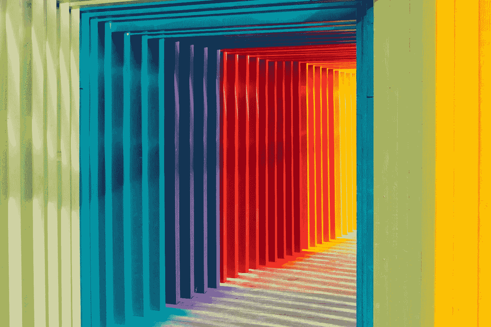
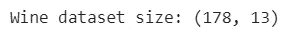
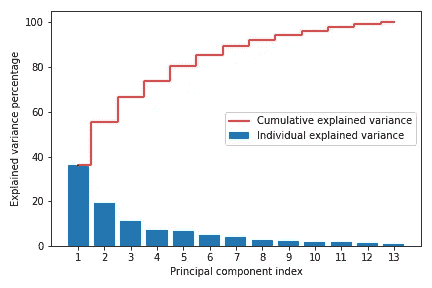
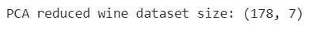
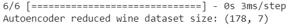
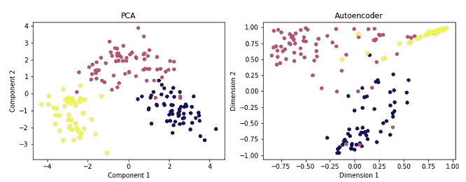

# PCA 与自编码器在小数据集上的降维比较

> 原文：[`towardsdatascience.com/pca-vs-autoencoders-for-a-small-dataset-in-dimensionality-reduction-67b15318dea0`](https://towardsdatascience.com/pca-vs-autoencoders-for-a-small-dataset-in-dimensionality-reduction-67b15318dea0)

## 神经网络和深度学习课程：第四十五部分

[](https://rukshanpramoditha.medium.com/?source=post_page-----67b15318dea0--------------------------------)[](https://towardsdatascience.com/?source=post_page-----67b15318dea0--------------------------------) [Rukshan Pramoditha](https://rukshanpramoditha.medium.com/?source=post_page-----67b15318dea0--------------------------------)

·发表在 [Towards Data Science](https://towardsdatascience.com/?source=post_page-----67b15318dea0--------------------------------) ·阅读时间 8 分钟·2023 年 2 月 16 日

--



图片由 [Robert Katzki](https://unsplash.com/@ro_ka?utm_source=unsplash&utm_medium=referral&utm_content=creditCopyText) 提供，来源于 [Unsplash](https://unsplash.com/photos/jbtfM0XBeRc?utm_source=unsplash&utm_medium=referral&utm_content=creditCopyText)

***小数据集上，通用机器学习算法是否能超越神经网络？***

一般而言，深度学习算法如神经网络需要大量数据才能实现合理的性能。因此，像自编码器这样的神经网络可以从我们用来训练模型的非常大的数据集中获益。

有时，当通用机器学习算法在非常小的数据集上训练时，它们的表现可能会超越神经网络算法。

自编码器也可以用于降维应用，尽管它们在图像去噪、图像生成、图像着色、图像压缩、图像超分辨率等其他流行应用中被广泛使用。

早些时候，我们通过在*非常大的* MNIST 数据集上训练模型，比较了自编码器在降维中的表现与 PCA 的表现。在那里，自编码器模型轻松超越了 PCA 模型 [参考¹]，因为 MNIST 数据集大且具有非线性特征。

参考¹：*自编码器如何在降维中超越 PCA*

> 自编码器在处理大规模和非线性数据时表现良好。

尽管自编码器是一种神经网络，但仍然可以使用较小的数据集，只要选择正确的模型架构和超参数值，就能够取得一定的性能。

> 自编码器功能强大且灵活，足以捕捉数据中的复杂和非线性模式。

今天，我们将通过在*非常小*的葡萄酒数据集上训练模型，比较自编码器（神经网络模型）在降维方面与 PCA（通用机器学习算法）的表现。

葡萄酒数据集有 178 个样本和 13 个特征。与 MNIST 数据集的 60,000 个样本和 784 个特征相比，这个数据集非常小！

# 加载葡萄酒数据集

葡萄酒数据集已经预加载到 Scikit-learn 中，可以按如下方式加载。

```py
# Load the Wine dataset
from sklearn.datasets import load_wine

wine = load_wine()
X = wine.data
y = wine.target

print("Wine dataset size:", X.shape)
```



**葡萄酒数据集的形状**（作者提供的图片）

# 使用葡萄酒数据运行 PCA

首先，我们需要通过使用所有组件运行 PCA 来选择最佳组件数量 [ref²]。

ref²: [*进行主成分分析 (PCA) 以实现降维的 3 个简单步骤*](https://rukshanpramoditha.medium.com/3-easy-steps-to-perform-dimensionality-reduction-using-principal-component-analysis-pca-79121998b991)

```py
# Feature scaling
from sklearn.preprocessing import StandardScaler

X_scaled = StandardScaler().fit_transform(X)

import numpy as np
import matplotlib.pyplot as plt
from sklearn.decomposition import PCA

# Select the best number of components
# by running PCA with all components
pca = PCA(n_components=None)
pca.fit(X_scaled)

# Plot cumulative explained variances
exp_var = pca.explained_variance_ratio_ * 100
cum_exp_var = np.cumsum(exp_var)

plt.bar(range(1, 14), exp_var, align='center',
        label='Individual explained variance')

plt.step(range(1, 14), cum_exp_var, where='mid',
         label='Cumulative explained variance', color='red')

plt.ylabel('Explained variance percentage')
plt.xlabel('Principal component index')
plt.xticks(ticks=list(range(1, 14)))
plt.legend(loc='best')
plt.tight_layout()

plt.savefig("cumulative_explained_variance_plot.png")
```



**累计解释方差图**（作者提供的图片）

通过分析上述累计解释方差图，我决定保留前七个组件，这些组件捕获了数据中约 90% 的方差。因此，这七个组件将准确地代表原始葡萄酒数据集。

# 使用选定的组件重新运行 PCA

要将降维应用于葡萄酒数据集，我们需要使用选定的组件重新运行 PCA 并应用转换。

```py
# Run PCA again with selected (7) components
pca = PCA(n_components=7)
X_pca = pca.fit_transform(X_scaled)
print("PCA reduced wine dataset size:", X_pca.shape)
```



**应用 PCA 后的葡萄酒数据集的形状**（作者提供的图片）

现在，数据集中只有七个组件（特征）。因此，数据的维度已经减少！

# 使用自编码器进行降维

以下代码定义了一个自编码器，其中编码器部分可以用于获得数据的低维（编码）表示。

```py
import numpy as np
from tensorflow.keras import Model, Input
from tensorflow.keras.layers import Dense

# Build the autoencoder
input_dim = X.shape[1]
latent_vec_dim = 7

input_layer = Input(shape=(input_dim,))

# Define encoder
x = Dense(8, activation='relu')(input_layer)
x = Dense(4, activation='relu')(x)
encoder = Dense(latent_vec_dim, activation="tanh")(x)

# Define decoder
x = Dense(4, activation='relu')(encoder)
x = Dense(8, activation='relu')(x)
decoder = Dense(input_dim, activation="sigmoid")(x)

autoencoder = Model(inputs=input_layer, outputs=decoder)

# Compile the model with optimizer and loss function
autoencoder.compile(optimizer="adam", loss="mse")

# Train the model with 100 epochs
autoencoder.fit(X_scaled, X_scaled, epochs=100, verbose=0,
                batch_size=16, shuffle=True)

# Use the encoder part to obtain the lower dimensional,
# encoded representation of the data
encoder_model = Model(inputs=input_layer, outputs=encoder)
X_encoded = encoder_model.predict(X_scaled)

# Print the shape of the encoded data
print("Autoencoder reduced wine dataset size:", X_encoded.shape)
```



**自编码数据后的葡萄酒数据集的形状**（作者提供的图片）

自编码器模型具有输入层、编码层和解码层。输入维度是葡萄酒数据集中的输入特征数，即 13。潜在向量维度为 7，等于我们在 PCA 中先前选择的组件数量。

所有层都使用 Keras 功能 API 方法 [ref³] 连接。然后，通过连接输入层和解码器部分创建整个自编码器模型。

ref³: [*构建 Keras 模型的两种不同方式：顺序 API 和功能 API*](https://rukshanpramoditha.medium.com/two-different-ways-to-build-keras-models-sequential-api-and-functional-api-868e64594820)

然后，我们使用 Adam 优化器和均方误差（mse）损失函数编译整个自编码器。

模型在标准化（缩放）的葡萄酒数据上训练 100 个周期，批量大小为 16。

潜在向量表示了输入数据中最重要的特征的低维形式 [ref⁴]。因此，在训练完整个自动编码器之后，我们可以使用其编码器部分来获得数据的低维（编码）表示。

ref⁴: [*深度学习中的自动编码器简介*](https://rukshanpramoditha.medium.com/an-introduction-to-autoencoders-in-deep-learning-ab5a5861f81e)

`encoder_model` 是通过连接输入层和编码器部分创建的。然后，我们可以在缩放后的 Wine 数据上调用它的 predict() 方法，以获得 Wine 数据集的低维（编码）表示，这由变量 `X_encoded` 表示。由于**“潜在向量维度”**被设置为 7，因此编码表示具有 7 个特征，数据的维度已被降低！

# 通过可视化数据来比较 PCA 和自动编码器模型

高维数据的可视化可以通过降维实现 [ref⁵]。因此，降维对于数据可视化极为有用。

ref⁵: *降维的 11 种不同用途*

仅使用两个组件（维度），我们绘制了 PCA 和自动编码器模型返回的 Wine 数据集输出。

```py
import matplotlib.pyplot as plt

fig, (ax1, ax2) = plt.subplots(1, 2, figsize=(12, 4))

# Plot PCA output
ax1.scatter(X_pca[:, 0], X_pca[:, 1], c=y, s=25, cmap='plasma')
ax1.set_title('PCA')
ax1.set_xlabel('Component 1')
ax1.set_ylabel('Component 2')

# Plot autoencoder output
ax2.scatter(X_encoded[:, 0], X_encoded[:, 1], c=y, s=25, cmap='plasma')
ax2.set_title('Autoencoder')
ax2.set_xlabel('Dimension 1')
ax2.set_ylabel('Dimension 2')

plt.savefig("Output.png")
```



**Wine 数据的二维表示：PCA 与自动编码器**（图像作者）

如你所见，使用 PCA 获得的 Wine 数据的二维表示显示了三种葡萄酒类别之间的明显分离，但在自动编码器输出中分离效果不够好。

> PCA 在小数据集如 Wine 数据集上效果很好。
> 
> **注意：** 由于算法的随机特性以及超参数的值，如隐藏层的数量和隐藏单元、每层使用的激活函数类型、损失函数类型、优化器类型、训练轮数和批量大小，自动编码器的输出（右图）可能会有显著变化！但是，三个类别的分离可能不如 PCA 输出的效果好。

# PCA 与自动编码器：哪种在降维方面更好？

选择 PCA 和自动编码器进行降维取决于以下因素。

+   数据集的大小

+   数据集的复杂性（线性还是非线性，图像还是数值数据）

+   分析的目标

+   计算资源的可用性

+   可解释性

PCA 在小数据集上效果很好。它也可以用于较大的数据集。然而，自动编码器在非常大的数据集上效果非常好。

PCA 对线性数据效果很好，因为它是一种线性降维技术。对于非线性数据效果不佳。相反，自动编码器可以轻松捕捉数据中的复杂和非线性模式。因此，它们在非线性数据上表现良好。

自动编码器在图像数据上表现良好。PCA 在数值数据上表现良好。

无法确定自编码器模型潜在向量中每个组件（特征）的重要性。但是在 PCA 中，我们可以为此创建累积解释方差图。

由于自编码器是神经网络，它的架构可能变得复杂。此外，它还需要大量的数据。因此，自编码器比 PCA 需要更多的计算资源。

自编码器是黑箱模型。因此，它们难以解释。我们不知道它们如何从我们提供的数据中选择重要特征。因此，这些模型的解释非常困难。

# 结论

PCA 和自编码器都可以用于执行降维。PCA 是一个通用的机器学习算法，而自编码器是一种神经网络架构，需大数据集和大量计算资源。

自编码器在处理大规模和非线性数据时表现良好。它们足够强大和灵活，可以捕捉数据中的复杂和非线性模式，但在较小的数据集上可能无法超越通用机器学习算法如 PCA！

如果你真的想在执行降维时考虑类可分性，LDA（线性判别分析）是最佳选择。请阅读下面的完整指南。

*LDA 在分类数据集中比 PCA 更有效*

今天的文章到此结束。

**如果你有任何问题或反馈，请告诉我。**

## 那么 AI 课程怎么样？


**加入我的神经网络和深度学习课程，这是 Medium 上的首个课程**（作者截图）

## 支持我作为作者

*我希望你喜欢阅读这篇文章。如果你愿意支持我作为作者，请* [***注册会员***](https://rukshanpramoditha.medium.com/membership) *以获得对 Medium 的无限制访问权限。每月只需$5，我将从你的会员费中获得一部分。*

[](https://rukshanpramoditha.medium.com/membership?source=post_page-----67b15318dea0--------------------------------) [## 通过我的推荐链接加入 Medium - Rukshan Pramoditha

### 阅读 Rukshan Pramoditha 的每一篇故事（以及 Medium 上成千上万的其他作者的故事）。您的会员费用直接…

[rukshanpramoditha.medium.com](https://rukshanpramoditha.medium.com/membership?source=post_page-----67b15318dea0--------------------------------)

## 加入我的私人邮件列表

*不要再错过我的精彩故事。通过* [***订阅我的邮件列表***](https://rukshanpramoditha.medium.com/subscribe)*，你将直接在我发布故事时收到。*

非常感谢你的持续支持！下篇文章见。祝大家学习愉快！

## 葡萄酒数据集信息

+   **数据集来源：** 你可以从[这里](https://archive.ics.uci.edu/ml/datasets/Wine)下载原始数据集。

+   **数据集许可证：** 该数据集在[*CC BY 4.0*](https://creativecommons.org/licenses/by/4.0/)（*知识共享署名 4.0*）许可证下提供。

+   **引用：** Lichman, M. (2013). UCI 机器学习库 [[`archive.ics.uci.edu/ml`](https://archive.ics.uci.edu/ml)]。加州尔湾：加利福尼亚大学信息与计算机科学学院。

[Rukshan Pramoditha](https://medium.com/u/f90a3bb1d400?source=post_page-----67b15318dea0--------------------------------)

**2023 年 2 月 16 日**
