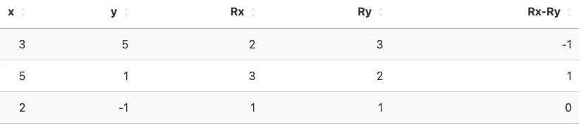
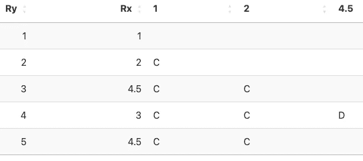

# Pearson、Spearman 和 Kendall 相关系数，手动计算

> 原文：[`towardsdatascience.com/pearson-spearman-and-kendall-correlation-coefficients-by-hand-d2e1676ca73f`](https://towardsdatascience.com/pearson-spearman-and-kendall-correlation-coefficients-by-hand-d2e1676ca73f)

## 学习如何手动计算 Pearson、Spearman 和 Kendall 相关系数，以评估两个变量之间的关系

[](https://antoinesoetewey.medium.com/?source=post_page-----d2e1676ca73f--------------------------------)[](https://towardsdatascience.com/?source=post_page-----d2e1676ca73f--------------------------------) [Antoine Soetewey](https://antoinesoetewey.medium.com/?source=post_page-----d2e1676ca73f--------------------------------)

·发表于 [Towards Data Science](https://towardsdatascience.com/?source=post_page-----d2e1676ca73f--------------------------------) ·15 分钟阅读·2023 年 9 月 5 日

--


图片由 [S O C I A L . C U T](https://unsplash.com/@socialcut?utm_source=medium&utm_medium=referral) 提供

# 介绍

在统计学中，相关性用于评估两个变量之间的关系。

在之前的帖子中，我们展示了如何 [在 R 中计算相关性并执行相关性测试](https://statsandr.com/blog/correlation-coefficient-and-correlation-test-in-r/)。在本帖中，我们展示了如何手动计算 Pearson、Spearman 和 Kendall 相关系数，并在两种不同的场景下（即有平局和无平局）进行计算。

# 数据

为了展示有平局和无平局的方法，我们考虑了两个不同的数据集，一个带有平局，另一个没有平局。

# 带有平局

对于带有平局的场景插图，假设我们有以下大小为 5 的样本：


表格由作者提供


图表由作者提供

如我们所见，由于变量 x 中有两个相同的观测值，因此存在一些平局。

# 无平局

对于不需要处理平局的情况，我们将考虑以下大小为 3 的样本：


表格由作者提供


图表由作者提供

# 手动计算的相关系数

三种最常见的相关性方法是：[1](https://statsandr.com/blog/pearson-spearman-kendall-correlation-by-hand/#fn1)

1.  Pearson，用于两个 [定量连续](https://statsandr.com/blog/variable-types-and-examples/#continuous) 变量之间具有线性关系

1.  Spearman，用于两个定量变量，如果关系部分线性，或用于一个[定性序数](https://statsandr.com/blog/variable-types-and-examples/#ordinal)变量和一个定量变量

1.  Kendall，通常用于两个定性序数变量

每种方法将在接下来的章节中介绍。

请注意，本帖的目的是展示如何手动计算三种相关系数和在两种不同情况下的操作；我们并不关心验证基本假设。

# Pearson

幸运的是，无论是否存在重复值，计算 Pearson 相关系数的过程是相同的，所以我们不区分这两种情况。

# 有无重复值的情况

Pearson 相关系数，样本情况下用 r 表示，可以如下计算[2](https://statsandr.com/blog/pearson-spearman-kendall-correlation-by-hand/#fn2)


其中：

+   n 是样本大小

+   xi 和 yi 是观测值

+   ¯x¯ 和 ¯y¯ 是 x 和 y 的样本[均值](https://statsandr.com/blog/descriptive-statistics-by-hand/#mean)

+   sx 和 sy 是 x 和 y 的样本[标准差](https://statsandr.com/blog/descriptive-statistics-by-hand/#standard-deviation)

我们逐步展示如何计算。

**步骤 1.**

如你所见，在计算相关系数之前，我们首先需要计算两个变量的均值和标准差。

x 的均值计算如下：


x 的标准差计算如下：


这些公式也可以类似地用于变量 y。

我们从计算两个变量的均值开始：


**步骤 2.**

我们现在需要计算每个变量的标准差。为了简化计算，最好使用表格，从观测值开始：


作者提供的表格

计算标准差时，我们需要每个观测值与其均值之间平方差的总和，即：


我们首先在表格中创建两列新数据，标记为 `x-xbar` 和 `y-ybar`，对应于：


作者提供的表格

我们取这两列新数据的平方，标记为 `(x-xbar)²` 和 `(y-ybar)²`：


作者提供的表格

然后我们对这两列求和，结果是：


标准差因此为：


**步骤 3.**

我们现在需要


因此，我们在表格中添加一列新数据，对应于 xiyi，标记为 `x*y`：


作者提供的表格

**步骤 4。**

我们取最后一列的总和，结果是：


**步骤 5。**

最后，可以通过将上述找到的值代入初始公式来计算皮尔逊相关系数：


请注意，还有其他公式可以计算皮尔逊相关系数。例如，


所有公式当然会给出完全相同的结果。

供您参考，将皮尔逊相关系数 r 平方得到决定系数 R2，适用于简单的[线性回归](https://statsandr.com/blog/multiple-linear-regression-made-simple/)。

# 斯皮尔曼

现在我们介绍斯皮尔曼相关系数，也称为斯皮尔曼等级相关系数。这个系数实际上与皮尔逊系数相同，只是计算基于*等级值*而不是原始观察值。

再次介绍如何一步步手动计算，但这次我们区分了两种情况：

1.  如果有并列

1.  如果没有并列

# 含并列

斯皮尔曼相关系数（含并列），记作 rs，定义如下：


其中：


这里是如何手动计算的。

**步骤 1。**

如前所述，斯皮尔曼系数基于等级。因此，我们首先需要分别为两个变量添加观察值的等级（从最低到最高）。

对于 y，我们看到：

+   -3 是最小值，所以我们将其分配为等级 1。

+   -1 是第二小的值，所以我们将其分配为等级 2。

+   然后是 0，所以我们将其分配为等级 3。

+   然后是 1，所以我们将其分配为等级 4。

+   最终，2 是最大值，所以我们将其分配为等级 5。

对于 x 也是如此，只是这里有两个观察值为 5（因此等级中会有并列）。在这种情况下，我们取平均等级：

+   -1 是最小值，所以我们将其分配为等级 1。

+   2 是第二小的值，所以我们将其分配为等级 2。

+   然后是 3，所以我们将其分配为等级 3。

+   最终，两个最大值属于等级 4 和 5，所以我们将它们都分配为等级 4.5。

我们在表中包括等级，表示为`Rx`和`Ry`：


作者提供的表格

**步骤 2。**

从那里开始，计算方法类似于皮尔逊系数，只是我们处理的是等级而不是初始观察值。为了避免剩余步骤中的任何混淆，我们从表格中删除初始观察值，仅保留等级：


作者提供的表格

我们从等级的平均值开始：


对于标准差，我们使用与皮尔逊系数相同的表格：


作者提供的表格

我们求出最后两列的总和，这给出：


标准差为：


**步骤 3.**

我们现在需要


因此，我们在表格中添加了一列，对应于 RxiRyi，用`Rx*Ry`表示：


按作者分类的表格

**步骤 4.**

我们求出最后一列的总和，这给出


**步骤 5.**

最后，通过将所有值代入初始公式来计算斯皮尔曼相关系数：


# 无平局

当每个变量中的所有初始值都不同，即所有排名都是不同的整数时，就没有平局。在这种特定情况下，斯皮尔曼系数可以用以下简化公式计算：


例如，假设样本中没有平局的数据介绍如下：


按作者分类的表格

**步骤 1.**

每个变量中的所有观察值都不同，因此所有排名都是不同的整数，并且没有平局：


按作者分类的表格

**步骤 2.**

我们只需要计算每行两个排名之间的差异，用`Rx-Ry`表示：



按作者分类的表格

求这些差异的平方，记作`(Rx-Ry)²`：


按作者分类的表格

然后求出最后一列的总和，这给出


**步骤 3.**

最后，我们可以填入初始公式以找到斯皮尔曼系数：


# Kendall

Kendall 系数相关性，也称为 Kendall 的τ系数，与斯皮尔曼系数类似，只是它通常在样本较小且有许多排名平局时更受欢迎。

在这里我们也区分两种情况：

+   如果没有平局

+   如果有平局

与斯皮尔曼系数不同，我们首先说明没有平局的情况，然后是有平局的情况。

# 无平局

当没有平局时，Kendall 系数，记作τa，定义如下：


其中：

+   C 是一致对的数量

+   D 是不一致对的数量

这个系数，也称为 Kendall tau-a，不对平局进行任何调整。

让我们看看使用无平局的数据（与斯皮尔曼相关性无平局的相同数据）的一致对和不一致对：


按作者分类的表格

**步骤 1.**

我们首先计算每个变量（`Rx` 和 `Ry`）的排名，就像我们为斯皮尔曼系数做的那样：


按作者分类的表格

**步骤 2.**

然后我们在两个变量 `Rx` 或 `Ry` 中任意选择一个作为参考变量。假设我们在这里选择 `Rx` 作为参考变量。

我们按照这个参考变量对数据集进行排序：


表格由作者提供

从现在开始，我们只看第二个变量（*非* 参考水平的那个，这里是 `Ry`）的排名，因此为了避免在剩下的步骤中产生混淆，我们只保留 `Ry` 列：


表格由作者提供

**步骤 3.**

我们现在逐行检查 `Ry`，并检查表中它下面的行是否更小或更大。

在我们的表格中，`Ry` 的第一行是 1。我们看到它下面的值是 3，大于 1。由于 3 大于 1，这被称为和谐配对。我们将其写入表中：


表格由作者提供

下一行，2，也大于 1，因此它也是一个和谐配对。我们也将其写入表中：


表格由作者提供

我们重新从 `Ry` 的第二行开始，即 3。再次，我们查看下面的行，检查它是否更大或更小。在这里，下面的行是 2，小于 3，因此我们有一个 discordant 配对。我们将此信息添加到表中：


表格由作者提供

**步骤 4.**

现在我们计算和谐配对和 discordant 配对的总数。总共有：

+   2 对和谐配对，所以 C = 2，和

+   1 对 discordant 配对，所以 D = 1。

**步骤 5.**

最后，我们将刚刚找到的值代入初始公式中：


或者，我们也可以使用以下公式


其中 n 仍然是样本大小，两者都给出完全相同的结果。

# 有重复值的情况

我必须承认，有重复值的过程比没有重复值的情况稍微复杂一些。

Kendall tau-b 系数，即对重复值进行调整的系数，定义如下


其中：


请注意，这里 C2n 中的字母 C 表示“组合”，而不是“和谐”。

让我们用皮尔逊相关系数和有重复的斯皮尔曼相关系数的数据集来说明这个场景和公式，即：


表格由作者提供

**步骤 1.**

与没有重复的情况类似，有重复的情况下，这个过程也是基于排名的，因此我们首先为每个变量添加排名，通常表示为`Rx`和`Ry`：


表格由作者提供

**步骤 2.**

必须选择两个变量中的一个（x 或 y）作为参考变量。这次，我们不是任意选择，而是选择没有重复值的那个。在我们的例子中，变量 x 有重复值，而变量 y 没有任何重复值。因此 y 将是我们的参考变量。

然后我们：

+   按参考变量排序数据集，这里是 `Ry`，并

+   我们只保留必要的列，以避免在剩余步骤中出现任何混淆：


作者提供的表格

**步骤 3.**

我们检查它是否是一个一致对或不一致对，与我们处理无联系时的方式相同，但这次我们不计算联系。

列 `Rx` 中的第一行是 1。我们将表中所有低于该值的行与之比较。表中 1 以下的所有行都更大，因此我们写下它们是一致对：


作者提供的表格

我们对每一行重复相同的过程。

例如，对于列 `Rx` 的第二行，我们有值 2。再次，表中所有低于该值的行都更大，因此我们写下它们是一致对：


作者提供的表格

对于列 `Rx` 的第三行，我们有值 4.5。表中紧接其下的行（= 3）小于 4，因此我们写下 D 表示不一致对：



作者提供的表格

现在，如你所见，最后一行也是 4.5。由于它等于我们正在比较的值，它既不是一致对也不是不一致对，因此我们在表格中写下“T”表示“联系”：


作者提供的表格

最后，列 `Rx` 中的第四行是 3，我们将其与 4.5 进行比较，发现 4.5 更大，因此它是一个一致对：


作者提供的表格

**步骤 4.**

然后我们汇总一致对和不一致对的数量：

+   C = 8

+   D = 1

**步骤 5.**

我们现在拥有计算 τb 分子的所有信息，但仍需找到


以计算分母。

如上所述，C2n 是可能对的总数，因此对应于两个值的组合数量。这个对的数量可以通过[组合](https://statsandr.com/blog/the-9-concepts-and-formulas-in-probability-that-every-data-scientist-should-know/#combination)公式找到，即：


其中 n 是样本大小。

在我们的例子中，我们的样本大小为 5，所以我们有：[3](https://statsandr.com/blog/pearson-spearman-kendall-correlation-by-hand/#fn3)


此外，nx 和 ny 分别是 x 和 y 变量中具有联系的可能对的数量。

当查看上述表格中的 `Ry` 和 `Rx` 时：


作者提供的表格

我们看到有：

+   变量 x 中的 2 个相同值

+   变量 y 中的 0 个相同值

这意味着具有联系的**对**的数量等于：[4](https://statsandr.com/blog/pearson-spearman-kendall-correlation-by-hand/#fn4)

+   对于变量 x（唯一的可能联系对是 {4.5, 4.5}）

+   0 对于变量 y（由于所有等级都是独特的，因此不存在成对的并列情况）

因此，


现在我们拥有计算 τb 所需的所有信息！

**步骤 6。**

将上述找到的值代入初始公式中，我们得到


# 在 R 中验证

为了完整性，我们使用 R 验证每个系数和场景的结果。

**Pearson：**

```py
x <- c(-1, 3, 5, 5, 2)
y <- c(-3, 1, 0, 2, -1)
```

```py
cor(x, y, method = "pearson")
```

```py
## [1] 0.8769051
```

**带并列情况的 Spearman：**

```py
cor(x, y, method = "spearman")
```

```py
## [1] 0.8207827
```

**不带并列情况的 Spearman：**

```py
x2 <- c(3, 5, 2)
y2 <- c(5, 1, -1)
```

```py
cor(x2, y2, method = "spearman")
```

```py
## [1] 0.5
```

**不带并列情况的 Kendall：**

```py
cor(x2, y2, method = "kendall")
```

```py
## [1] 0.3333333
```

**带并列情况的 Kendall：**

```py
cor(x, y, method = "kendall")
```

```py
## [1] 0.7378648
```

我们确实手动计算的结果与 R 中得到的结果相同（任何差异都是由于四舍五入造成的）！

# 结论

记住，相关系数（无论是 Pearson、Spearman 还是 Kendall）的范围是 -1 到 1，其中 0 表示没有相关性，绝对值越接近 1，相关性越强。

广义上讲，正相关意味着一个变量的高值与另一个变量的高值相关（反之亦然）。负相关意味着一个变量的高值与另一个变量的低值相关。

最后但同样重要的是，记住从样本中计算出的相关系数得出的结论不能在没有适当统计检验的情况下推广到总体，即[相关性检验](https://statsandr.com/blog/correlation-coefficient-and-correlation-test-in-r/#correlation-test)。

感谢阅读。

希望这篇文章帮助你手动计算 Pearson、Spearman 和 Kendall 相关系数（包括和不包括并列情况）。

和往常一样，如果你对本文涉及的主题有任何问题或建议，请在评论中添加，这样其他读者也能从讨论中受益。

1.  供参考，Pearson 相关系数被视为参数检验，而 Spearman 和 Kendall 相关系数被视为非参数检验。[↩︎](https://statsandr.com/blog/pearson-spearman-kendall-correlation-by-hand/#fnref1)

1.  在这里，我们假设我们有一个样本而不是总体。如果你拥有的观察值代表整个总体，则相关系数记作 ρ，公式略有不同。如果需要，请参见[样本和总体之间的差异](https://statsandr.com/blog/what-is-the-difference-between-population-and-sample/)的回顾。[↩︎](https://statsandr.com/blog/pearson-spearman-kendall-correlation-by-hand/#fnref2)

1.  记住，n 的阶乘，记作 n!，是 n! = n×(n−1)×⋯×1。例如，5! = 5×4×3×2×1=120。[↩︎](https://statsandr.com/blog/pearson-spearman-kendall-correlation-by-hand/#fnref3)

1.  如果你有许多相同的值，并希望通过公式而非手动计数来计算可能的配对数量，你可以再次使用[组合](https://statsandr.com/blog/the-9-concepts-and-formulas-in-probability-that-every-data-scientist-should-know/#combination)的公式，即 C2n = n! / x!(n−x)!，其中 n 是给定组中相同值的数量。请记住，组合的数量必须对所有组进行求和。在我们的例子中，我们只有一个包含 2 个值的组，因此 nx = C22 = 2! / 2!(2−2)! = 1。[↩︎](https://statsandr.com/blog/pearson-spearman-kendall-correlation-by-hand/#fnref4)

# 相关文章

+   [R 中的相关系数和相关性检验](https://statsandr.com/blog/correlation-coefficient-and-correlation-test-in-r/)

+   [R 中的描述性统计](https://statsandr.com/blog/descriptive-statistics-in-r/)

+   [什么是生存分析？手动示例和 R 中的示例](https://statsandr.com/blog/what-is-survival-analysis/)

+   [R 中的单样本 Wilcoxon 检验](https://statsandr.com/blog/one-sample-wilcoxon-test-in-r/)

+   [手动假设检验](https://statsandr.com/blog/hypothesis-test-by-hand/)

*最初发布于* [*https://statsandr.com*](https://statsandr.com/blog/pearson-spearman-kendall-correlation-by-hand/) *于 2023 年 9 月 5 日。*
