# 感知机：第一个神经网络模型

> 原文：[`towardsdatascience.com/perceptrons-the-first-neural-network-model-8b3ee4513757`](https://towardsdatascience.com/perceptrons-the-first-neural-network-model-8b3ee4513757)

## 概述及在 Python 中的实现

[](https://medium.com/@roiyeho?source=post_page-----8b3ee4513757--------------------------------)[](https://towardsdatascience.com/?source=post_page-----8b3ee4513757--------------------------------) [Dr. Roi Yehoshua](https://medium.com/@roiyeho?source=post_page-----8b3ee4513757--------------------------------)

·发表于 [Towards Data Science](https://towardsdatascience.com/?source=post_page-----8b3ee4513757--------------------------------) ·14 分钟阅读·2023 年 3 月 28 日

--


[Hal Gatewood](https://unsplash.com/ja/@halacious?utm_source=unsplash&utm_medium=referral&utm_content=creditCopyText) 在 [Unsplash](https://unsplash.com/photos/OgvqXGL7XO4?utm_source=unsplash&utm_medium=referral&utm_content=creditCopyText) 上的照片

感知机是神经网络（NN）的最早计算模型之一，它们构成了今天更复杂、更深层网络的基础。理解感知机模型及其理论将为你理解神经网络中的许多关键概念提供良好的基础。

# 背景：生物神经网络

生物神经网络（例如我们大脑中的网络）由大量称为**神经元**的神经细胞组成。

每个神经元通过称为**树突**的纤维接收来自其邻近神经元的电信号（冲动）。当其接收到的信号总和超过某个阈值时，神经元会通过长纤维称为**轴突**发出自己的信号，这些轴突连接到其他神经元的树突上。

两个神经元之间的连接称为**突触**。平均而言，每个神经元连接到大约 7000 个突触，这表明我们大脑网络的高度连通性。当我们学习两个概念之间的新联想时，表示这些概念的神经元之间的突触强度会增强。这种现象被称为**赫布规则**（1949），其表述为“一起发火的细胞会一起连接”。

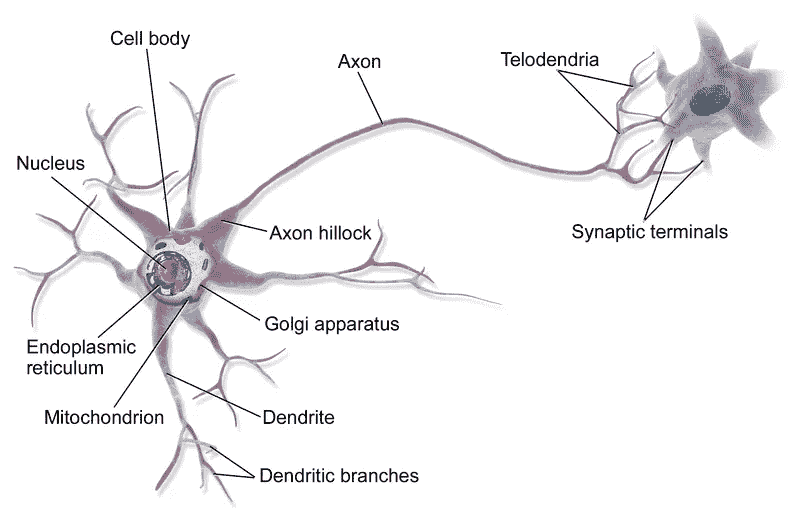

生物神经元 ([公共图像](https://en.wikipedia.org/wiki/Neuron#/media/File:Blausen_0657_MultipolarNeuron.png) 在维基共享资源下自由授权)

# 感知机模型

感知机模型由弗兰克·罗森布拉特于 1957 年提出，是生物神经元的简化模型。

感知机有 *m* 个二进制输入，表示为 *x*₁, …, *xₘ*，这些输入代表来自其邻近神经元的信号，并输出一个二进制值 *o*，表示感知机是否“激发”。

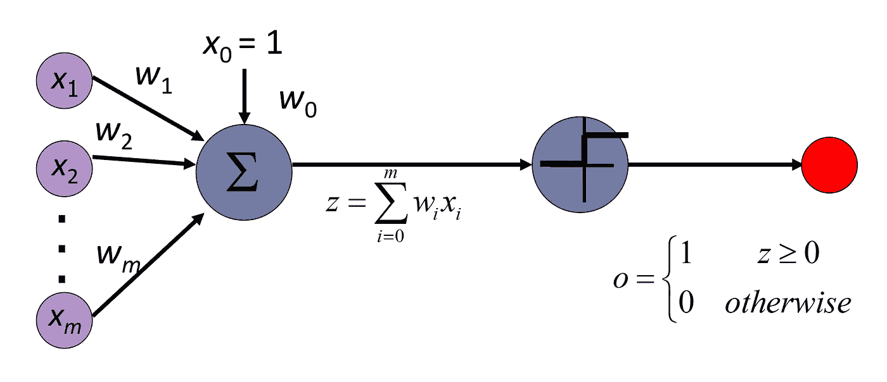

感知机模型

每个输入神经元 *xᵢ* 通过一个强度由权重 *wᵢ* 表示的连接与感知机相连。权重较高的输入对感知机的输出有更大的影响。

感知机首先计算其输入信号的加权和，通过将每个输入乘以其对应的权重。这个加权和通常称为**净输入**，表示为 *z*：


感知机的净输入

如果净输入超过某个预定义的阈值 *θ*，则感知机激发（输出为 1），否则不激发（输出为 0）。换句话说，感知机当且仅当：


我们的目标是找到权重 *w*₁, …, *wₘ* 和阈值 *θ*，使得感知机能正确地将其输入 *x*₁, …, *xₘ*（代表数据中的特征）映射到期望的输出 *y*（代表标签）。

为了简化学习过程，我们添加了一个特殊的输入神经元，称为**偏置神经元**，它总是输出值 1。这个神经元通常表示为*x*₀，其连接权重表示为*b*或*w*₀。

因此，感知机的净输入变为：


包括偏置的净输入

这种公式允许我们像学习输入信号的权重一样学习正确的阈值（偏置）。

在向量形式中，我们可以将 *z* 写作输入向量 **x** = (*x*₁, …, *xₘ*)*ᵗ* 与权重向量 **w** = (*w*₁, …, *wₘ*)*ᵗ* 的**点积**加上偏置：


净输入的向量形式

只有当净输入非负时，感知机才会激发，即：


更一般地，感知机对净输入应用**激活函数** *f*(*z*)，以生成其输出。感知机中最常用的两个激活函数是：

1.  **阶跃函数**（也称为**海维赛德函数**）是一个对于负输入值为 0，对于非负输入值为 1 的函数：

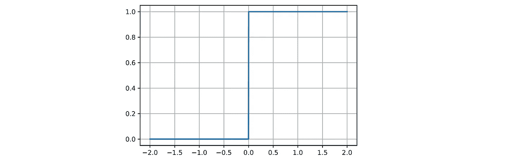

阶跃函数

2\. **符号函数**是一个对于负输入值为-1，对于非负输入值为 1 的函数：

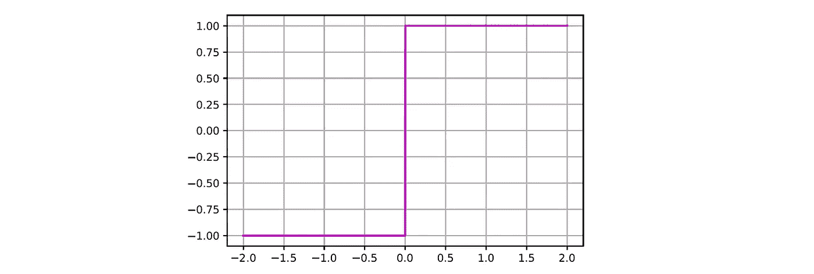

符号函数

在更复杂的网络中使用其他类型的激活函数，例如[多层感知机](https://medium.com/@roiyeho/multi-layer-perceptrons-8d76972afa2b)（MLPs）。在本文的其余部分，我将假设感知机使用步进函数。

总结一下，感知机的计算包括两个步骤：

1.  输入值 *x*₁, …, *xₘ* 乘以其对应的权重 *w*₁, …, *wₘ*，然后加上偏置 *b*，得到感知机的净输入 *z =* **w***ᵗ***x** + *b***。**

1.  在生成二进制输出（0/1 或 -1/+1）的净输入上应用激活函数 *f*(*z*)。

我们可以将整个计算写成一个方程：


其中 *f* 是选择的激活函数，*o* 是感知机的输出。

# 使用感知机实现逻辑门

为了演示感知机的工作原理，让我们尝试构建计算逻辑函数“与”和“或”的感知机。

作为提醒，逻辑“与”函数有两个二进制输入，当两个输入都为真时返回真（1），否则返回假（0）。


“与”函数的真值表

实现“与”函数的感知机有两个二进制输入和一个偏置。我们希望这个感知机只有在两个输入都“激活”时才会“触发”。例如，可以通过为两个输入选择相同的权重来实现这一点，例如 *w*₁ = *w*₂ = 1，然后选择偏置在-2, -1)范围内。这样可以确保当两个神经元都激活时，净输入 2 + *b* 将是非负的，但当只有一个神经元激活时，净输入 1 + *b* 将是负的（当没有神经元激活时，净输入 *b* 也为负）。

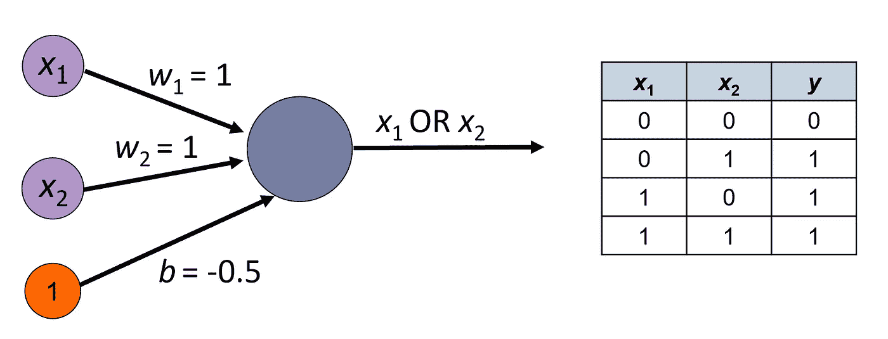

计算逻辑“或”函数的感知机

验证你是否理解这个感知机是如何工作的！

作为练习，尝试构建一个用于 NAND 函数的感知机，其真值表如下所示：


NAND 函数的真值表

# 感知机作为线性分类器

感知机是一种**线性分类器**，因为它将输入空间划分为由下述超平面分隔的两个区域


分隔超平面的方程

权重向量**w**与这个超平面正交，从而决定其方向，而偏置 *b* 定义了它离原点的距离。

每个超平面上方的例子（**w***ᵗ***x** + *b*> 0**））被感知机分类为正例，而每个超平面下方的例子（**w***ᵗ***x** + *b*< 0**））被分类为负例。

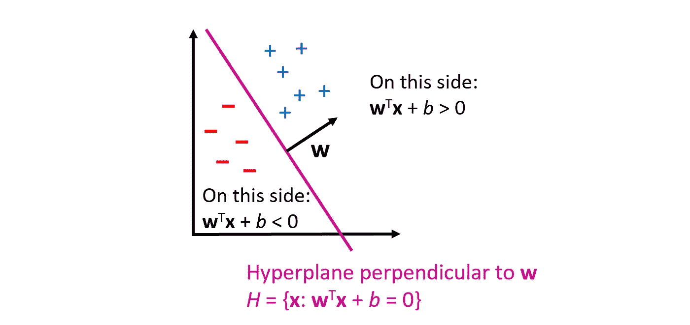

作为线性分类器的感知器

其他线性分类器包括逻辑回归和线性支持向量机（SVM）。

线性分类器只能学习**线性可分**的问题，即正例和负例之间的决策边界是一个线性表面（一个超平面）。

例如，以下数据集是非线性可分的，因此感知器无法正确分类此数据集中的所有示例：

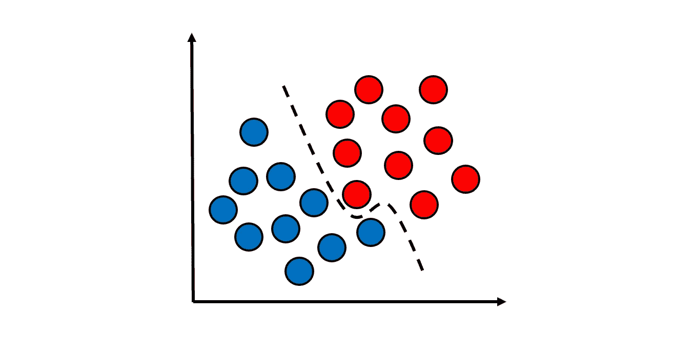

非线性可分数据集

# 感知器学习规则

感知器具有一个简单的学习规则，如果数据是线性可分的，它可以找到分离超平面。

对于每一个被感知器误分类的训练样本（即*oᵢ* ≠ *yᵢ*），我们将以下更新规则应用于权重向量：


感知器学习规则

其中*α*是学习率（0 < *α* ≤ 1），它控制每次更新中权重调整的大小。

换句话说，我们将每个连接权重*wⱼ*的感知器在这个例子上的误差（真实标签*yᵢ*和输出*oᵢ*之间的差异）乘以相应输入*xᵢⱼ*的值和学习率。

这个学习规则尝试做的是减少感知器输出*oᵢ*和真实标签*yᵢ*之间的差距。为了理解它为什么有效，让我们检查感知器误分类的两种可能情况：

1.  真实标签是*yᵢ* = 1，但感知器的预测是*oᵢ* =0，即**w***ᵗ***x***ᵢ + b* < 0。在这种情况下，我们希望**增加**感知器的净输入，使其最终变为正值。

    为此，我们将量(*yᵢ — oᵢ)***x***ᵢ* = **x***ᵢ*添加到权重向量中（乘以学习率）。这会增加正值输入的权重（其中*xᵢⱼ* > 0），同时减少负值输入的权重（其中*xᵢⱼ* < 0）。因此，感知器的整体净输入会增加。

1.  真实标签是*yᵢ* = 0，但感知器的预测是*oᵢ* = 1，即**w***ᵗ***x***ᵢ + b >* 0。类似于前面的情况，这里我们希望**减少**感知器的净输入，使其最终变为负值。这是通过将量(*yᵢ — oᵢ)***x***ᵢ* = -**x***ᵢ*添加到权重向量中实现的，因为这会减少正值输入的权重（其中*xᵢⱼ* > 0），而增加负值输入的权重（其中*xᵢⱼ* < 0）。因此，感知器的整体净输入会减少。

该学习规则会依次应用于所有训练样本（顺序可以是任意的）。通常需要对整个训练集进行多次迭代（称为**一个周期**），才能找到正确的权重向量（即分隔正负样本的超平面的向量）。

根据**感知器收敛定理**，如果数据是线性可分的，则重复应用感知器学习规则最终将收敛于分隔超平面的权重（在有限的步骤中）。有兴趣的读者可以在这篇[论文](http://www.cs.columbia.edu/~mcollins/courses/6998-2012/notes/perc.converge.pdf)中找到该定理的正式证明。

# 感知器学习算法

实际上，感知器学习过程可能需要较长时间才能收敛（即，在训练集上达到零错误）。此外，数据本身可能不是线性可分的，在这种情况下，算法可能永远不会终止。因此，我们需要通过一些预定义的参数来限制训练周期的数量。如果感知器在达到该数量之前在训练集上达到了零错误，我们可以提前停止训练。

感知器学习算法的总结如下伪代码：

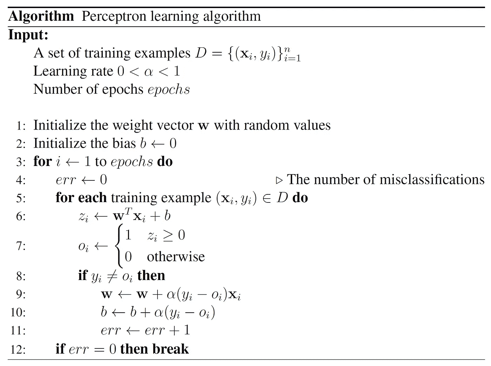

请注意，权重通常初始化为小的随机值以打破对称性（如果所有权重相等，则感知器的输出对于每个输入都是恒定的），而偏置则初始化为零。

# 示例：学习多数函数

例如，我们来看看感知器学习算法如何用于学习三个二进制输入的**多数函数**。多数函数是一个在其输入中有一半或更多为真时返回真（1），否则返回假（0）的函数。

感知器的训练集包括所有 8 种可能的二进制输入：

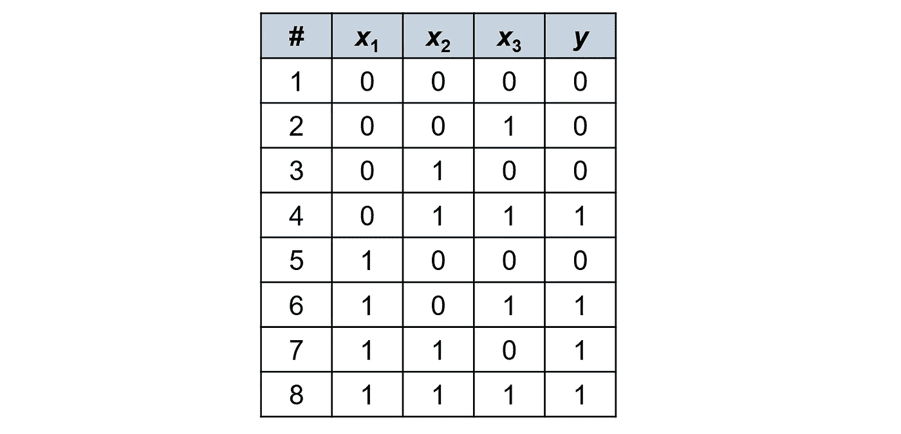

多数函数的训练集

在这个例子中，我们将假设初始权重和偏置为 0，学习率为 *α* = 0.5。

让我们跟踪第一次训练周期中的权重更新。呈现给感知器的第一个样本是**x** = (0, 0, 0)*ᵗ*。在这种情况下，感知器的净输入为：*z* = **w***ᵗ***x** + *b* = 0 × 0 + 0 × 0 + 0 × 0 + 0 = 0。因此，它的输出是 *o* = 1（记住，当输入≥0 时，阶跃函数的输出为 1）。然而，在这种情况下，目标标签是 *y* = 0，所以感知器的错误为 *y* - *o* = -1。

根据感知器学习规则，我们通过将 *α*(*y - o*)*xᵢ* = -0.5*xᵢ* 加到每个权重 *wᵢ* 上来更新权重。由于在这种情况下所有输入都是 0，除了偏置神经元（*x*₀ = 1），我们只更新偏置为-0.5，而不是 0。

我们对其他 7 个训练样本重复相同的过程。下表显示了每个样本之后的权重更新：

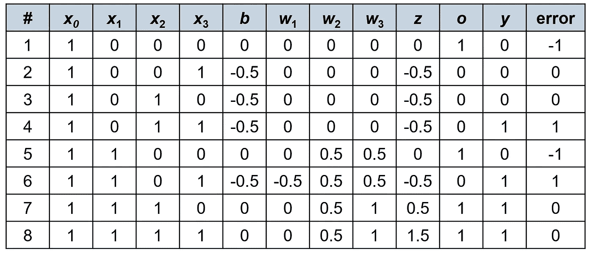

第一轮训练

在第一轮中，感知器发生了 4 次错误。第一轮后的权重向量为**w** = (0, 0.5, 1)*ᵗ*，偏置为 0。

在第二轮训练中，我们得到以下权重更新：

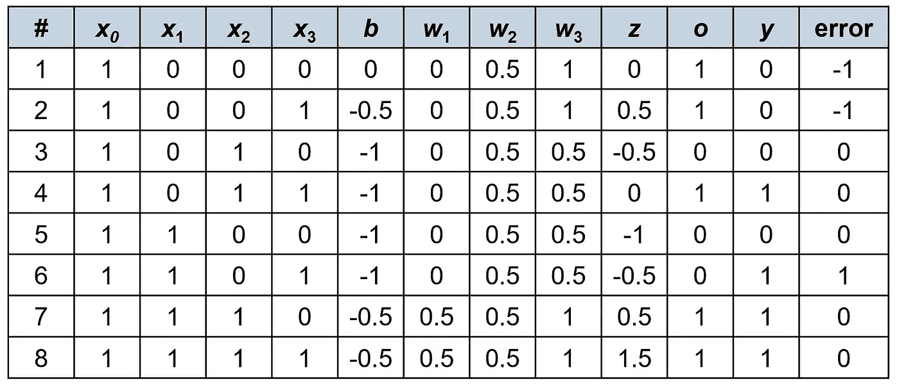

第二轮训练

这次感知器只发生了三次错误。第二轮后的权重向量为**w** = (0.5, 0.5, 1)*ᵗ*，偏置为-0.5。

第三轮的权重更新如下：

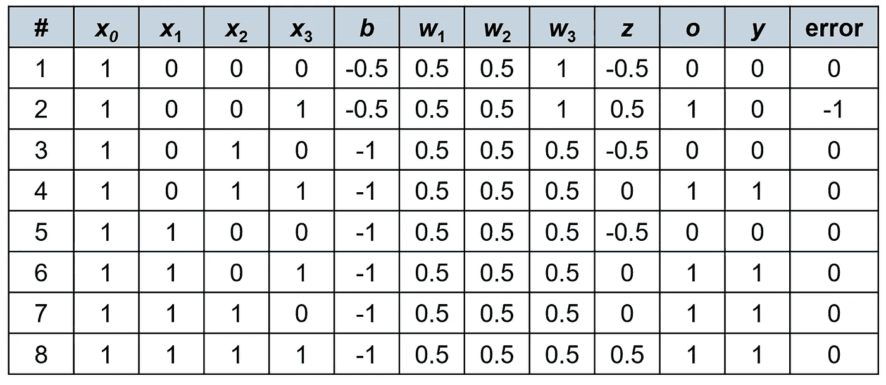

第三轮训练

在这一轮中，第二个示例更新后，感知器已收敛到解决此分类问题的权重向量：

**w** = (0.5, 0.5, 0.5)*ᵗ* 和 *b* = -1。由于所有权重相等，感知器仅在至少两个输入为 1 时激发，此时它们的加权和至少为 1，即大于或等于偏置的绝对值，因此感知器的净输入是非负的。

# Python 中的感知器实现

现在我们来实现 Python 中的感知器学习算法。

我们将通过扩展[sklearn.base.BaseEstimator](https://scikit-learn.org/stable/modules/generated/sklearn.base.BaseEstimator.html)类来实现它作为自定义 Scikit-Learn 估计器。这将允许我们像使用其他 Scikit-Learn 估计器一样使用它（例如，将其添加到一个[pipeline](https://medium.com/@roiyeho/pipelines-in-scikit-learn-46c61c5c60b2)中）。

自定义估计器需要实现**fit()**和**predict()**方法，并在**__init__()**方法中设置所有超参数。

我会首先展示这个类的完整代码，然后逐步讲解。

```py
from sklearn.base import BaseEstimator

class Perceptron(BaseEstimator):
    def __init__(self, alpha, n_epochs):
        self.alpha = alpha        # the learning rate
        self.n_epochs = n_epochs  # number of training iterations

    def fit(self, X, y):
        (n, m) = X.shape  # n is the number of samples, m is the number of features

        # Initialize the weights to small random values
        self.w = np.random.randn(m)
        self.b = 0

        # The training loop
        for epoch in range(self.n_epochs):
            n_errors = 0  # number of misclassification errors

            for i in range(n):
                o = self.predict(X[i])
                if o != y[i]:
                    # Apply the perceptron learning rule
                    self.w += self.alpha * (y[i] - o) * X[i]
                    self.b += self.alpha * (y[i] - o)
                    n_errors += 1

            # Compute the accuracy on the training set
            accuracy = 1 - (n_errors / n)
            print(f'Epoch {epoch + 1}: accuracy = {accuracy:.3f}')

            # Stop the training when there are no more errors
            if n_errors == 0:
                break

    def predict(self, X):
        z = X @ self.w + self.b
        return np.heaviside(z, 1)  # the step function
```

类的构造函数初始化了模型的两个超参数：学习率（*alpha*）和训练轮数（*n_epochs*）。

```py
def __init__(self, alpha, n_epochs):
    self.alpha = alpha
    self.n_epochs = n_epochs
```

**fit()**方法在给定数据集*X*（带标签*y*）上运行学习算法。我们首先通过查询*X*的形状来找出数据集中有多少样本和特征：

```py
(n, m) = X.shape
```

*n* 是训练样本的数量，*m* 是特征的数量。

接下来，我们使用标准正态分布（均值为 0，标准差为 1）初始化权重向量，将偏置设为 0：

```py
self.w = np.random.randn(m)
self.b = 0
```

我们现在运行训练循环进行*n_epochs*次迭代。在每次迭代中，我们遍历所有训练样本，对于每个样本，我们通过调用**predict()**方法并将其输出与真实标签进行比较，检查感知器是否正确分类：

```py
for i in range(n):
    o = self.predict(X[i])
    if o != y[i]:
```

如果感知器错误地分类了样本，我们将权重更新规则应用于权重向量和偏置，然后将误分类错误的数量增加 1：

```py
self.w += self.alpha * (y[i] - o) * X[i]
self.b += self.alpha * (y[i] - o)
n_errors += 1
```

当轮次终止时，我们报告感知器在训练集上的当前准确性，如果错误数量为 0，我们终止训练循环：

```py
accuracy = 1 - (n_errors / n)
print(f'Epoch {epoch + 1}: accuracy = {accuracy:.3f}')

if n_errors == 0:
    break
```

**predict()** 方法非常直接。我们首先计算感知机的净输入，即输入向量与权重的点积加上偏置：

```py
z = X @ self.w + self.b
```

最后，我们使用 NumPy 的 [heaviside()](https://numpy.org/doc/stable/reference/generated/numpy.heaviside.html) 函数将步进函数应用于净输入并返回输出：

```py
return np.heaviside(z, 1)
```

np.heaviside() 的第二个参数指定了函数在 *z* = 0 时的值。

现在让我们在由 Scikit-Learn 的 [make_blobs()](https://scikit-learn.org/stable/modules/generated/sklearn.datasets.make_blobs.html) 函数生成的数据集上测试我们的实现。

我们首先生成一个包含 100 个随机点的数据集，并将其分为两组：

```py
from sklearn.datasets import make_blobs

X, y = make_blobs(n_samples=100, n_features=2, centers=2, cluster_std=0.5)
```

我们将 *cluster_std* 设置为 0.5（而不是默认的 1），以确保数据是线性可分的。

让我们绘制数据集：

```py
import seaborn as sns

sns.scatterplot(x=X[:, 0], y=X[:, 1], hue=y, style=y, markers=('s', 'o'), 
                palette=('r', 'b'), edgecolor='black')
plt.xlabel('$x_1$')
plt.ylabel('$x_2$')
```

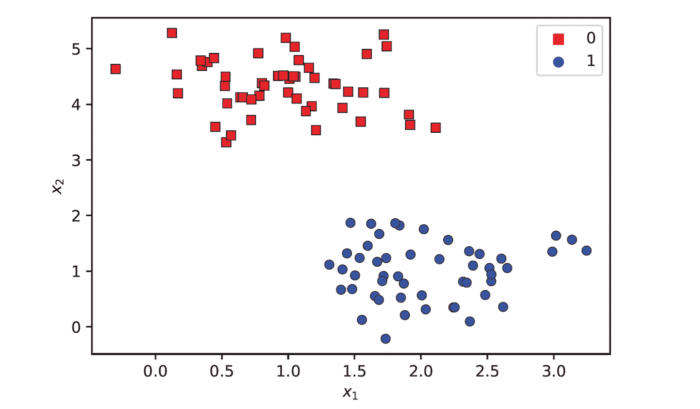

blobs 数据集

现在我们实例化 Perceptron 类并将其拟合到数据集上：

```py
perceptron = Perceptron(alpha=0.01, n_epochs=10)
perceptron.fit(X, y)
```

训练过程中的输出是：

```py
Epoch 1: accuracy = 0.250
Epoch 2: accuracy = 0.950
Epoch 3: accuracy = 1.000
```

感知机在经过三次训练周期后已经收敛。

我们可以使用以下函数绘制感知机找到的决策边界和两个类别区域：

```py
def plot_decision_boundary(model, X, y):
    # Retrieve the model parameters
    w1, w2, b = model.w[0], model.w[1], model.b

    # Calculate the intercept and slope of the separating line
    slope = -w1 / w2
    intercept = -b / w2

    # Plot the line
    x1 = X[:, 0]
    x2 = X[:, 1]
    x1_min, x1_max = x1.min() - 0.2, x1.max() + 0.2
    x2_min, x2_max = x2.min() - 0.5, x2.max() + 0.5
    x1_d = np.array([x1_min, x1_max])
    x2_d = slope * x1_d + intercept

    # Fill the two classification areas with two different colors
    plt.plot(x1_d, x2_d, 'k', ls='--')
    plt.fill_between(x1_d, x2_d, x2_min, color='blue', alpha=0.25)
    plt.fill_between(x1_d, x2_d, x2_max, color='red', alpha=0.25)
    plt.xlim(x1_min, x1_max)
    plt.ylim(x2_min, x2_max)

    # Draw the data points
    sns.scatterplot(x=x1, y=x2, hue=y, style=y, markers=('s', 'o'), 
                    palette=('r', 'b'), edgecolor='black')
    plt.xlabel('$x_1$')
    plt.ylabel('$x_2$')
```

```py
plot_decision_boundary(perceptron, X, y)
```

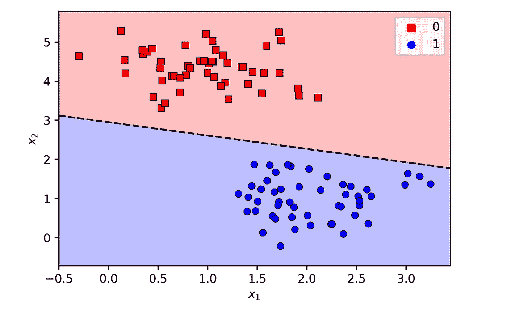

感知机找到的分离超平面

Scikit-Learn 提供了自己的 [Perceptron](https://scikit-learn.org/stable/modules/generated/sklearn.linear_model.Perceptron.html) 类，实现了类似的算法，但提供了更多选项，如正则化和提前停止。

# 感知机模型的局限性

尽管感知机模型显示出一些初步的成功，但很快就意识到感知机无法学习一些简单的函数，如 XOR 函数：

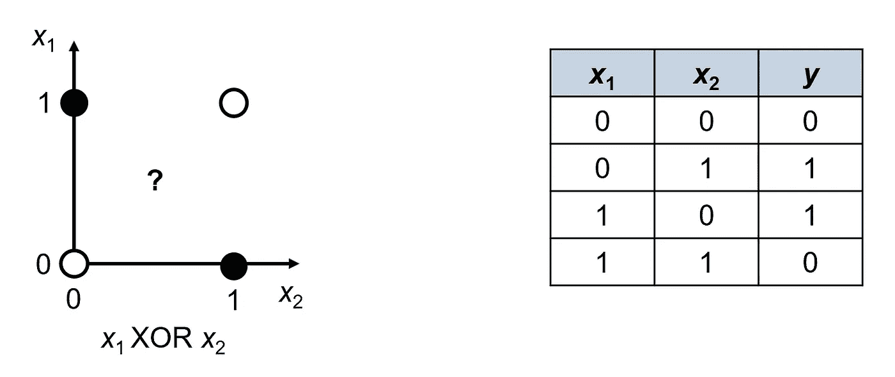

XOR 问题无法通过感知机解决

XOR 问题不是线性可分的，因此线性模型如感知机无法解决它。

这一发现使得神经网络领域停滞了很多年（这一时期被称为“AI 冬天”），直到意识到通过将多个感知机堆叠在层中可以解决更复杂和非线性的问题，例如 XOR 问题。

多层感知机（MLPs）在 [这篇文章](https://medium.com/p/8d76972afa2b) 中有详细介绍。

## 最后的备注

除非另有说明，所有图片均为作者提供。

你可以在我的 GitHub 上找到这篇文章的代码示例：[`github.com/roiyeho/medium/tree/main/perceptrons`](https://github.com/roiyeho/medium/tree/main/perceptrons)

感谢阅读！
