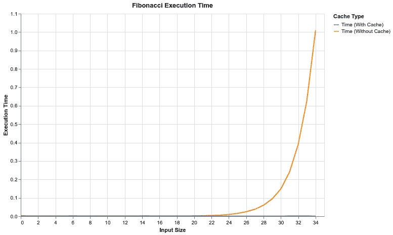

# 快速修复你缓慢的 Python 代码

> 原文：[`towardsdatascience.com/performance-fix-for-slow-python-lru-cache-f9a454776716`](https://towardsdatascience.com/performance-fix-for-slow-python-lru-cache-f9a454776716)

## 大幅度加速可重复的计算密集型任务。

[](https://thuwarakesh.medium.com/?source=post_page-----f9a454776716--------------------------------)[](https://towardsdatascience.com/?source=post_page-----f9a454776716--------------------------------) [Thuwarakesh Murallie](https://thuwarakesh.medium.com/?source=post_page-----f9a454776716--------------------------------)

·发布于 [Towards Data Science](https://towardsdatascience.com/?source=post_page-----f9a454776716--------------------------------) ·6 分钟阅读·2023 年 6 月 6 日

--


[Ryan Johnston](https://unsplash.com/@ryanjohnstonco?utm_source=medium&utm_medium=referral) 在 [Unsplash](https://unsplash.com/?utm_source=medium&utm_medium=referral)上的照片

计算密集型任务现在无处不在。

现在我们经常使用资源密集型技术，如 LLMs 和生成式 AI。

任何使用珍贵资源的人都会知道，再次执行相同任务是多么令人畏惧，即使我们知道结果会是相同的。你会责怪自己没有存储之前运行的结果。

这就是 LRU 缓存发挥作用的地方。LRU 代表**最近最少使用**。它是众多缓存策略之一。让我们首先了解它的工作原理。

[](/python-decorators-for-data-science-6913f717669a?source=post_page-----f9a454776716--------------------------------) ## 我在几乎所有数据科学项目中使用的 5 个 Python 装饰器

### 装饰器提供了一种新的方便方法，用于从缓存到发送通知的一切操作。

towardsdatascience.com

## @lru_cache 在 Python 中是如何工作的？

想象你的大脑是一个小玩具箱。它只能容纳五个玩具。你的朋友们不断询问不同的玩具，你利用你超人的记忆力记住并讲述这些玩具的故事。

一些玩具很容易找到，因为你的朋友们经常询问它们，所以它们在最上面。一些玩具则更难找到，因为它们在箱子底部。

在你讲述一个玩具的故事后，你把它放回顶部，以便让事情变得更容易。这样，你的朋友们最常问的玩具总是容易找到。这就是“**最近最少使用**”或 LRU 策略。

如果你得到一个新玩具，但盒子满了，你会移除最久未被询问的玩具。如果一个朋友询问，你仍然可以在你的大玩具仓库中找到它，这需要更长的时间。这就是 LRU 缓存的工作方式！

[创建 GPT3 支持的应用程序仅需几分钟，使用 Streamlit](https://levelup.gitconnected.com/streamlit-openai-gpt3-example-app-b333da955ceb?source=post_page-----f9a454776716--------------------------------) [## 创建 GPT3 支持的应用程序仅需几分钟，使用 Streamlit

### 学习如何构建智能应用，而不必过于担心软件开发。

[levelup.gitconnected.com](https://levelup.gitconnected.com/streamlit-openai-gpt3-example-app-b333da955ceb?source=post_page-----f9a454776716--------------------------------)

从版本 3.2 开始，Python 自带了一个内置的 `@lru_cache` 装饰器，你可以在任何函数上使用它。它使你的过程工作得很像玩具箱的例子。

如果某部分之前已经执行过，结果将在后续运行中从缓存中提取。就像你的玩具箱变满了一样，你可以指定缓存的最大大小。

[小型 Pandas 技巧处理有限内存的大数据集](https://a-little-pandas-hack-to-handle-large-datasets-with-limited-memory-6745140f473b?source=post_page-----f9a454776716--------------------------------) [## 小型 Pandas 技巧处理有限内存的大数据集

### Pandas 默认设置并不理想。一个小配置可以将你的数据框压缩到适合你的内存中。

[towardsdatascience.com](https://a-little-pandas-hack-to-handle-large-datasets-with-limited-memory-6745140f473b?source=post_page-----f9a454776716--------------------------------)

## 我们在日常工作中可以在哪里使用 `lru_cache`？

考虑一个 **长期运行的数据库查询**。我们都经历过：等待，手指敲击，直到数据库最终响应所需的数据。这通常发生在我们需要重新运行 Jupyter Notebooks 时。

现在，想象一下，第一次等待一次，然后下次立即检索数据。这就是 `lru_cache` 的魔力。

不仅仅是关于数据库查询。那 **API** 呢？尤其是那些具有 **按需付费定价模型** 的 API，如 OpenAI API。如果提示看起来相同，使用 `lru_cache`，我们调用一次，支付费用，然后重用结果而无需再次支付。

此外，如果你处理的外部数据查询连接到源的可靠性不总是很高——比如 **网页抓取**——`lru_cache` 可以成为救星。你可以一次性获取数据，将其缓存，然后在无需担心连接问题的情况下引用它，而不是不断与 **不稳定的连接** 做斗争。

[Python 网页抓取的宁静交响曲——分为 3 个部分](https://levelup.gitconnected.com/3-ways-of-web-scraping-in-python-e953c4a96ec2?source=post_page-----f9a454776716--------------------------------) [## Python 网页抓取的宁静交响曲——分为 3 个部分

### 在 Python 中进行网页抓取的最简单、最灵活和最全面的方法

levelup.gitconnected.com](https://levelup.gitconnected.com/3-ways-of-web-scraping-in-python-e953c4a96ec2?source=post_page-----f9a454776716--------------------------------)

另外，不要忘记**计算密集型任务**。如果你的函数需要处理大量数据并进行复杂计算，`lru_cache`可以显著减少对系统资源的负担。当你的应用涉及运行重型机器学习模型如**BERT LLM**或拥有全面的**搜索功能**时，情况通常是这样的。

在所有这些情况下，价值主张都是相同的。**节省时间、节省金钱、节省资源**。这在输出保持一致的合理时间范围内是可能的。从宏观上看，Python 的`lru_cache`不是一个技术解决方案，而是一种效率原则。在每一秒都很重要的世界里，效率就是至高无上的。

## 测试`lru_cache`在递归函数上的效果

这是一个斐波那契数生成的典型示例。看看使用和不使用`lru_cache`的运行时间。

```py
import time

def fib(n):
    if n < 2:
        return n
    return fib(n - 1) + fib(n - 2)

start_time = time.time()
print(fib(40))
print("Execution Time: ", time.time() - start_time)

>> 102334155
>> Execution Time: 19.45328450202942
```

现在让我们从`functools`模块导入`lru_cache`并对函数进行标注。

```py
import time
from functools import lru_cache

@lru_cache(maxsize=None) # Invinite cache
def fib(n):
    if n < 2:
        return n
    return fib(n - 1) + fib(n - 2)

start_time = time.time()
print(fib(40))
print("Execution Time: ", time.time() - start_time)

>> 102334155
>> Execution Time: 8.893013000488281e-05
```

通过引入`lru_cache`装饰器来进行备忘录化，与未备忘录化的版本相比，代码实现了显著的时间节省。

在第一个示例（没有`lru_cache`）中，计算第 40 个斐波那契数大约花费了 19.45 秒。在第二个示例（使用`lru_cache`）中，计算第 40 个斐波那契数仅花费了大约 8.89e-05 秒。

这就像节省了 99.99%的时间。

这是不同斐波那契数执行时间的图表。可以看到，非缓存版本的执行时间呈指数增长，而缓存版本即使对于更大的数字也只需要极少的时间。



作者提供的图片 — 展示了`@lru_cache`如何提高斐波那契数生成的执行时间。

[](/sql-on-pandas-usign-duckdb-f7cd238a0a5a?source=post_page-----f9a454776716--------------------------------) ## SQL on Pandas — 我新的 10 倍速度的最爱。

### 将两者的最佳之处结合在一起

towardsdatascience.com

## `@lru_cache`并不是万灵药。

虽然`@lru_cache`在提升性能方面非常重要，但这并不意味着你可以随意使用任何函数而不考虑性能。

[](/numpy-vectorization-speed-ffdab5deb402?source=post_page-----f9a454776716--------------------------------) ## 你的 Python For-loop 很慢？使用 NumPy 替代

### 当速度很重要时，列表不是最佳选择。

towardsdatascience.com

**被缓存的函数必须是可哈希的。**

这意味着它必须是不可变的，并且能够转换为用于字典键目的的唯一整数。对于函数来说，这通常不是问题，但你不能缓存可变类的方法或接受可变参数的函数。

例如，以下函数是不可变的，因此`lru_cache`工作正常：

```py
@lru_cache(maxsize=128)
def add_ten(number):
    return number + 10

print(add_ten(5))

>> 15
```

但下一个则不是。调用它会抛出错误。

```py
@lru_cache(maxsize=128)
def add_to_list(lst, item):
    lst.append(item)
    return lst

print(add_to_list([1, 2, 3], 4))  

>> TypeError: unhashable type: 'list'
```

[](/python-3-11-is-indeed-faster-than-3-10-1247531e771b?source=post_page-----f9a454776716--------------------------------) ## Python 3.11 确实比 3.10 更快

### 与冒泡排序和递归函数逐一比较确认了这一点。

towardsdatascience.com

**如果你的函数依赖于外部源，`lru_cache`就不太适用了**

缓存不会自动过期。如果函数的返回值可能会随时间变化（例如，如果它基于文件系统或网络操作），那么使用`lru_cache`可能会导致返回过时的结果。

以下 Python 脚本模拟了一个外部源并进行了测试：

```py
import functools
import time

def simulate_external_source():
    """Simulate an external source that changes over time."""
    return time.time()

@functools.lru_cache()
def dependent_function():
    """Function that depends on an external source."""
    return simulate_external_source()

# Test lru_cache with a function that depends on external sources
print("Testing lru_cache with a function that depends on external sources:")
print("Initial call:", dependent_function())
time.sleep(1)  # Simulate a delay
print("Cached call:", dependent_function())  # Should return the same result
time.sleep(1)  # Simulate a delay
print("Updated call:", dependent_function())  # Should still return the same result

print()

@functools.lru_cache(maxsize=1)
def expiring_function():
    """Function with cached entries that expire over time."""
    return simulate_external_source()

# Test lru_cache with entries that expire over time
print("Testing lru_cache with entries that expire over time:")
print("Initial call:", expiring_function())
time.sleep(1)  # Simulate a delay
print("Expired call:", expiring_function())  # Should trigger recalculation
time.sleep(1)  # Simulate a delay
print("Expired call:", expiring_function())  # Should trigger recalculation again

print()

___________________
Output
-------------------
Testing lru_cache with a function that depends on external sources:
Initial call: 1685507725.6362917
Cached call: 1685507725.6362917
Updated call: 1685507725.6362917

Testing lru_cache with entries that expire over time:
Initial call: 1685507727.639048
Expired call: 1685507727.639048
Expired call: 1685507727.639048
```

对于这种情况，你需要一种支持 TTL 的缓存技术。

[](/github-automated-testing-python-fdfe5aec9446?source=post_page-----f9a454776716--------------------------------) ## 如何在每次提交时使用 GitHub Actions 运行 Python 测试？

### 自动化无聊的任务，确保你的代码质量，通过 CI 管道。

towardsdatascience.com

## 结论

`lru_cache`是一种非常简单的技术，用于存储函数输出，以便计算无需重复执行。虽然它在节省昂贵计算资源方面很有用，但并非所有情况下都能很好地工作。

然而，只要你的函数不依赖外部输入且是可哈希的，`lru_cache`绝对是一个很好的工具。

> 感谢阅读，朋友！在[**LinkedIn**](https://www.linkedin.com/in/thuwarakesh/)、[**Twitter**](https://twitter.com/Thuwarakesh)和[**Medium**](https://thuwarakesh.medium.com/)上向我打个招呼吧。
> 
> 还不是 Medium 会员？请使用此链接[**成为会员**](https://thuwarakesh.medium.com/membership)，因为在不增加你额外费用的情况下，我可以获得少量佣金作为推荐费。
