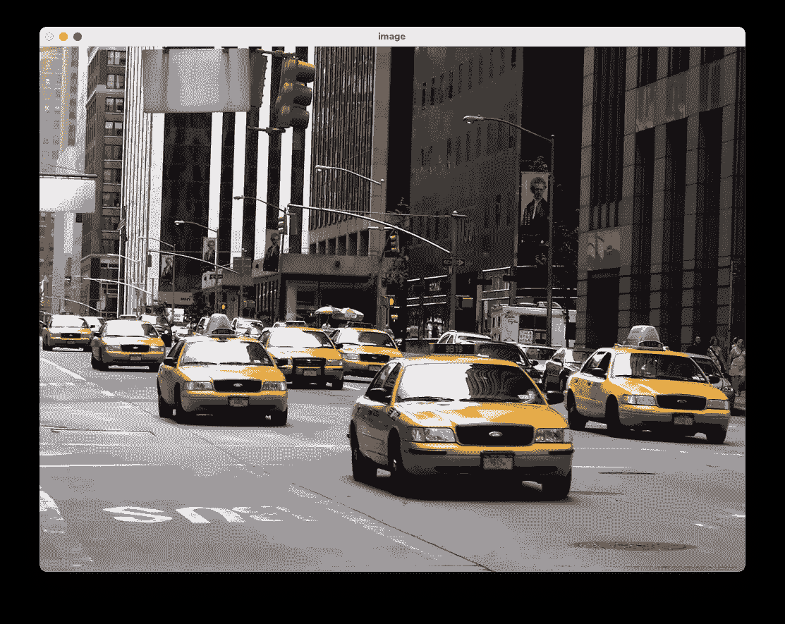
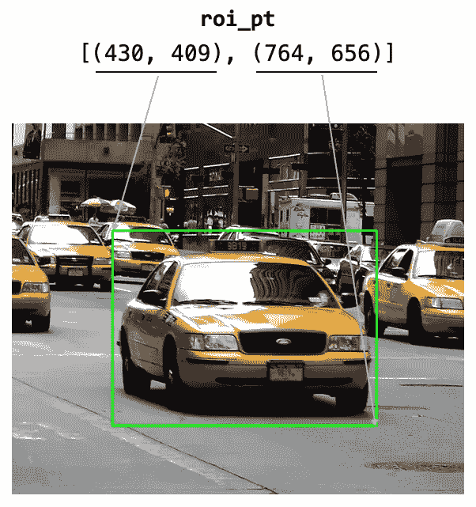
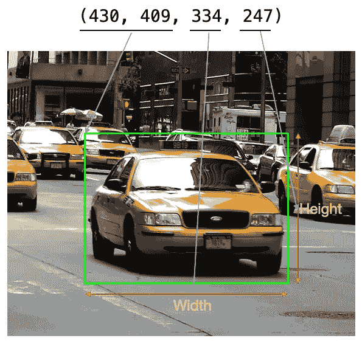
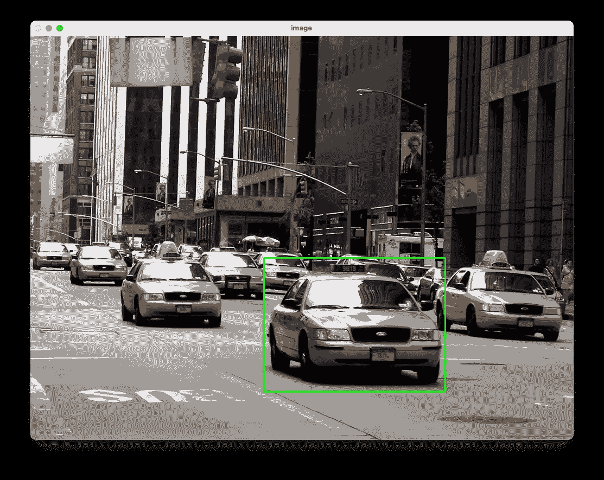

# 使用 Python 和 OpenCV 进行图像注释

> 原文：[`towardsdatascience.com/performing-image-annotation-using-python-and-opencv-f0124746613c`](https://towardsdatascience.com/performing-image-annotation-using-python-and-opencv-f0124746613c)

## 学习如何为你的图像创建边界框

[](https://weimenglee.medium.com/?source=post_page-----f0124746613c--------------------------------)[](https://towardsdatascience.com/?source=post_page-----f0124746613c--------------------------------) [Wei-Meng Lee](https://weimenglee.medium.com/?source=post_page-----f0124746613c--------------------------------)

·发布于 [Towards Data Science](https://towardsdatascience.com/?source=post_page-----f0124746613c--------------------------------) ·6 分钟阅读·2023 年 4 月 27 日

--


图片由 [Héctor J. Rivas](https://unsplash.com/es/@hjrc33?utm_source=medium&utm_medium=referral) 在 [Unsplash](https://unsplash.com/?utm_source=medium&utm_medium=referral) 提供

深度学习中的常见任务之一是 ***对象检测***，这是一个在给定图像中定位特定对象的过程。对象检测的一个例子是检测图像中的汽车，你可以统计图像中检测到的汽车总数。在需要分析特定交叉口的交通流量时，这可能会很有用。

为了训练一个深度学习模型以检测特定对象，你需要为模型提供一组训练图像，并将图像中特定对象的坐标标记出来。这个过程称为 ***图像注释***。图像注释为图像中存在的对象分配标签，并将所有对象标记出来。

在本文中，我将展示如何使用 Python 和 OpenCV 为图像添加注释——你将使用鼠标标记你要注释的对象，应用程序将绘制一个边界矩形围绕该对象。然后，你可以查看你标记出的对象的坐标，并选择性地将其保存到日志文件中。

# 使用 OpenCV 显示图像

首先，创建一个文本文件，命名为 **bounding.py**。然后，填写以下语句：

```py
import argparse
import cv2

ap = argparse.ArgumentParser()
ap.add_argument("-i", "--image", required = True, help = "Path to image")
args = vars(ap.parse_args())

# load the image
image = cv2.imread(args["image"])

# reference to the image
image_clone = image

# loop until the 'q' key is pressed
while True:
    # display the image 
    cv2.imshow("image", image)

    # wait for a keypress
    key = cv2.waitKey(1)
    if key == ord("c"):
        break

# close all open windows
cv2.destroyAllWindows()
```

上述 Python 控制台应用程序从控制台接收一个参数，即要显示的图像名称。获取图像名称后，你将使用 OpenCV 显示图像。同时，你还需要克隆图像，以便以后使用。要停止程序，你可以按键盘上的 Ctrl-C。

要运行程序，打开终端并输入以下命令：

```py
$ python bounding.py -i Cabs.jpg
```

> 上述**Cabs.jpg**文件可以从 https://en.wikipedia.org/wiki/Taxi#/media/File:Cabs.jpg 下载。

现在应该可以显示图像了：



来源：[`en.wikipedia.org/wiki/Taxi#/media/File:Cabs.jpg`](https://en.wikipedia.org/wiki/Taxi#/media/File:Cabs.jpg)。图片由用户 Omnibus，Uris 提供 — Uris 拍摄了这张照片。

# 处理鼠标事件

我们希望用户能够使用鼠标点击图像，然后在图像上拖动以选择特定的*感兴趣区域*（ROI）。为此，让我们在程序中添加两个全局变量：

```py
import argparse
import cv2

# to store the points for region of interest
roi_pt = []

# to indicate if the left mouse button is depressed
is_button_down = False
```

下图显示了`roi_pt`将如何存储 ROI 的坐标：



图片由作者提供

你现在将定义一个名为`draw_rectangle()`的函数来处理鼠标点击。此函数接受五个参数 — `event`、`x`、`y`、`flags`和`param`。我们只会在这个练习中使用前三个参数：

```py
def draw_rectangle(event, x, y, flags, param):
    global roi_pt, is_button_down

    if event == cv2.EVENT_MOUSEMOVE and is_button_down:
        global image_clone, image

        # get the original image to paint the new rectangle
        image = image_clone.copy()

        # draw new rectangle
        cv2.rectangle(image, roi_pt[0], (x,y), (0, 255, 0), 2)

    if event == cv2.EVENT_LBUTTONDOWN:
        # record the first point
        roi_pt = [(x, y)]  
        is_button_down = True

    # if the left mouse button was released
    elif event == cv2.EVENT_LBUTTONUP:        
        roi_pt.append((x, y))     # append the end point

        # ======================
        # print the bounding box
        # ======================
        # in (x1,y1,x2,y2) format
        print(roi_pt)                  

        # in (x,y,w,h) format
        bbox = (roi_pt[0][0],
                roi_pt[0][1],
                roi_pt[1][0] - roi_pt[0][0],
                roi_pt[1][1] - roi_pt[0][1])
        print(bbox)

        # button has now been released
        is_button_down = False

        # draw the bounding box
        cv2.rectangle(image, roi_pt[0], roi_pt[1], (0, 255, 0), 2)
        cv2.imshow("image", image)
```

在上述函数中：

+   当左鼠标按钮被按下（`cv2.EVENT_LBUTTONDOWN`）时，你记录 ROI 的第一个点。然后将`is_button_down`变量设置为`True`，以便在用户按住左鼠标按钮移动鼠标时开始绘制矩形。

+   当用户在按住左鼠标按钮的情况下移动鼠标（`cv2.EVENT_MOUSEMOVE and is_button_down`），你将会在原始图像的副本上绘制矩形。你需要在克隆图像上绘制，因为当用户移动鼠标时，你还需要去除之前绘制的矩形。因此，完成这项任务的最简单方法是丢弃之前的图像，并使用克隆图像绘制新的矩形。

+   当用户最终释放左鼠标按钮（`cv2.EVENT_LBUTTONUP`）时，你将 ROI 的结束点添加到`roi_pt`中。然后打印出边界框坐标。对于一些深度学习包，边界框坐标的格式为*(x, y, width, height)*，所以我也以这种格式计算了 ROI 的坐标：



图片由作者提供

+   最后，为 ROI 绘制边界框

要将鼠标事件与其事件处理程序连接起来，请添加以下语句：

```py
...

# reference to the image
image_clone = image

# ======ADD the following======
# setup the mouse click handler
cv2.namedWindow("image")
cv2.setMouseCallback("image", draw_rectangle)
# =============================

# loop until the 'q' key is pressed
while True:
    ...
```

再次运行程序，你现在可以从图像中选择 ROI，矩形将被显示出来：



图片由作者提供

同时，ROI 的坐标也将显示出来：

```py
[(430, 409), (764, 656)]
(430, 409, 334, 247)
```

为了方便起见，这里是完整的 Python 程序：

```py
import argparse
import cv2

# to store the points for region of interest
roi_pt = []

# to indicate if the left mouse button is depressed
is_button_down = False

def draw_rectangle(event, x, y, flags, param):
    global roi_pt, is_button_down

    if event == cv2.EVENT_MOUSEMOVE and is_button_down:
        global image_clone, image

        # get the original image to paint the new rectangle
        image = image_clone.copy()

        # draw new rectangle
        cv2.rectangle(image, roi_pt[0], (x,y), (0, 255, 0), 2)

    if event == cv2.EVENT_LBUTTONDOWN:
        # record the first point
        roi_pt = [(x, y)]  
        is_button_down = True

    # if the left mouse button was released
    elif event == cv2.EVENT_LBUTTONUP:        
        roi_pt.append((x, y))     # append the end point

        # ======================
        # print the bounding box
        # ======================
        # in (x1,y1,x2,y2) format
        print(roi_pt)                  

        # in (x,y,w,h) format
        bbox = (roi_pt[0][0],
                roi_pt[0][1],
                roi_pt[1][0] - roi_pt[0][0],
                roi_pt[1][1] - roi_pt[0][1])
        print(bbox)

        # button has now been released
        is_button_down = False

        # draw the bounding box
        cv2.rectangle(image, roi_pt[0], roi_pt[1], (0, 255, 0), 2)
        cv2.imshow("image", image)

ap = argparse.ArgumentParser()
ap.add_argument("-i", "--image", required = True, help = "Path to image")
args = vars(ap.parse_args())

# load the image
image = cv2.imread(args["image"])

# reference to the image
image_clone = image

# setup the mouse click handler
cv2.namedWindow("image")
cv2.setMouseCallback("image", draw_rectangle)

# loop until the 'q' key is pressed
while True:
    # display the image 
    cv2.imshow("image", image)

    # wait for a keypress
    key = cv2.waitKey(1)
    if key == ord("c"):
        break

# close all open windows
cv2.destroyAllWindows()
```

**如果你喜欢阅读我的文章并且这些文章对你的职业/学习有帮助，请考虑注册成为 Medium 会员。每月 5 美元，你可以无限访问 Medium 上的所有文章（包括我的）。如果你通过以下链接注册，我将获得少量佣金（对你没有额外费用）。你的支持意味着我将能投入更多时间撰写像这样的文章。**

[](https://weimenglee.medium.com/membership?source=post_page-----f0124746613c--------------------------------) [## 使用我的推荐链接加入 Medium - Wei-Meng Lee

### 阅读 Wei-Meng Lee 的每一个故事（以及 Medium 上成千上万的其他作者的故事）。你的会员费直接支持…

weimenglee.medium.com](https://weimenglee.medium.com/membership?source=post_page-----f0124746613c--------------------------------)

# 摘要

在这篇短文中，我展示了如何通过选择图像中的对象来注释图像。当然，一旦对象的坐标被映射出来，你需要将其存储在外部文件中（如 JSON 或 CSV 文件）。为此，我将其留给读者作为练习。如果你觉得这有用，或者你在日常工作中使用哪些注释工具，请告诉我。
