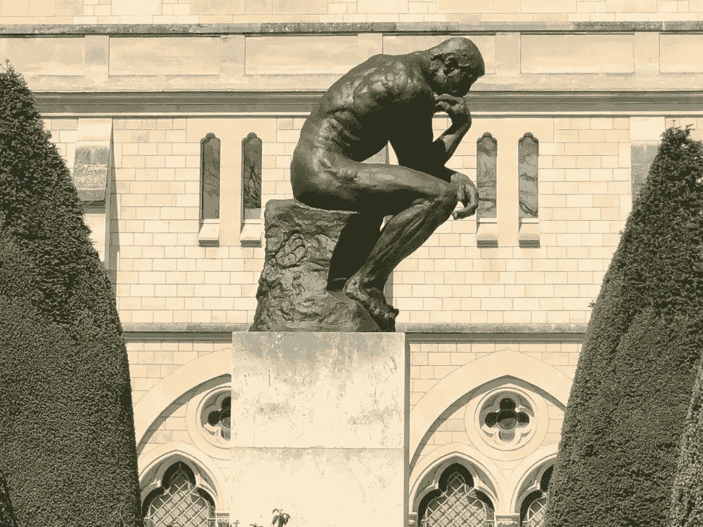

# 哲学与数据科学——深刻思考数据

> 原文：[`towardsdatascience.com/philosophy-and-data-science-thinking-deeply-about-data-222cc9fbdcc5?source=collection_archive---------3-----------------------#2023-11-28`](https://towardsdatascience.com/philosophy-and-data-science-thinking-deeply-about-data-222cc9fbdcc5?source=collection_archive---------3-----------------------#2023-11-28)

## 第二部分：认识论

 [Jarom Hulet](https://medium.com/@jarom.hulet?source=post_page-----222cc9fbdcc5--------------------------------)

·

[关注](https://medium.com/m/signin?actionUrl=https%3A%2F%2Fmedium.com%2F_%2Fsubscribe%2Fuser%2F88982a88b4e5&operation=register&redirect=https%3A%2F%2Ftowardsdatascience.com%2Fphilosophy-and-data-science-thinking-deeply-about-data-222cc9fbdcc5&user=Jarom+Hulet&userId=88982a88b4e5&source=post_page-88982a88b4e5----222cc9fbdcc5---------------------post_header-----------) 发表在 [Towards Data Science](https://towardsdatascience.com/?source=post_page-----222cc9fbdcc5--------------------------------) ·11 分钟阅读·2023 年 11 月 28 日

--

图片由 Alex Pere 提供，来源于 pexels.com

阅读完本文后，我希望你能够实际理解数千年对知识的深刻思考如何应用于你作为数据科学家的日常工作中。

这是系列文章的第二部分，探讨了哲学概念如何在我作为数据科学家的工作中提供帮助。第一篇文章讨论了决定论 ([link](https://medium.com/towards-data-science/philosophy-and-data-science-thinking-deeply-about-data-f9b3960c9897))；一个具体的形而上学理论。本文将涵盖多个哲学流派，这些流派属于被称为**认识论**的哲学领域。

**认识论**是研究我们可以*知道*什么以及我们如何*知道*它的学科。它是对知识本身的研究。这与数据科学非常契合，因为我们正试图从数据中获得知识！

> 认识论是研究我们可以*知道*什么以及我们如何*知道*它的学科。它是对知识本身的研究。

以下是我们将要讨论的内容：

1.  归纳推理与演绎推理

1.  怀疑主义

1.  实用主义

**归纳推理与演绎推理**

推理是我们理性化和辩护知识的方式。它是我们知道某事的*原因*。推理有多种类型，但我认为最常见（也是最适用）的有…
