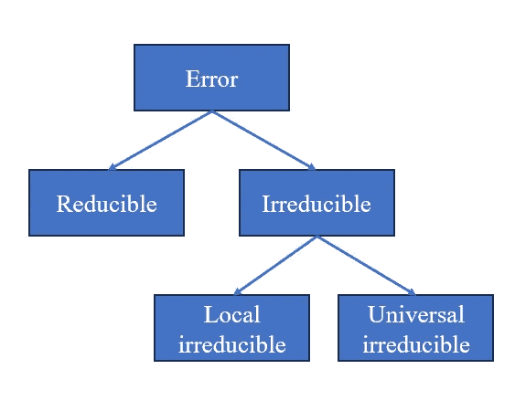

# 哲学与数据科学——深刻思考数据

> 原文：[`towardsdatascience.com/philosophy-and-data-science-thinking-deeply-about-data-f9b3960c9897`](https://towardsdatascience.com/philosophy-and-data-science-thinking-deeply-about-data-f9b3960c9897)

## 第一部分：决定论

 [Jarom Hulet](https://medium.com/@jarom.hulet?source=post_page-----f9b3960c9897--------------------------------)

·发表于 [Towards Data Science](https://towardsdatascience.com/?source=post_page-----f9b3960c9897--------------------------------) ·阅读时间 10 分钟·2023 年 11 月 12 日

--

图片来源于 Pexels.com 上的‘HH’

数据科学是一项非常技术性、深入细节的工作。我们通常会非常专注于具体的问题——这很好。我们通过将专注的注意力和技能结合起来解决问题来创造最大价值。但是，我认为偶尔退一步，试图看到更大的图景，是一种很好的实践。

学习哲学是我发现对深入思考数据科学非常有效的工具。作为一个哲学的业余学生，我观察到一些哲学思维领域与数据科学有很好的交织。具体来说，我发现形而上学、因果关系和认识论有很多理论是非常适用的。

这是一个多部分系列的第一篇，讨论了各种哲学观点及其对数据和数据科学的影响。我将从迷人的**决定论**的形而上学理论开始。

# 什么是决定论？

决定论是关于我们宇宙本质的哲学理论。决定论有多种不同的细微版本¹，但总体想法是我们宇宙中没有随机性。每一个事件都有一组原因，这些原因完全解释了事件，而这些原因本身也有一组原因。从宇宙开始（或者可能宇宙没有开始²？）起，因果链是不断裂的。

以下是拉普拉斯的名言，它概括了对物理世界的决定论观点：

> *“我们可以将宇宙的现状视为其过去的结果和未来的原因。如果某一时刻有一个智力能够知道所有使自然运动的力量，以及自然中所有物体的所有位置，如果这个智力也足够庞大以将这些数据进行分析，它将会在一个公式中包含宇宙中最大物体和最小原子的运动；对于这样的智力来说，没有什么是不确定的，未来就像过去一样，会展现在它的眼前。”*
> 
> *皮埃尔-西蒙·拉普拉斯，《概率的哲学论文》（1814）*

我发现确定论在以下数据科学主题中出现（我相信还有很多其他的——如果我遗漏了什么，请告诉我！）：

+   概率论

+   不可约错误的概念

+   理论上的‘神’模型

+   因果关系和实验设计

+   随机数

# 概率论

概率的研究主要是了解随机变量的行为。随机变量表示一个包含随机性的过程的结果。例如，掷骰子。我们可以了解某些结果的概率，但我们无法确定单次投掷的结果——大概是由于随机性。

确定论理论拒绝宇宙中存在任何随机性。那么我们为什么有研究*随机*变量的概率领域呢？当然，非确定论者会说宇宙中*确实*存在随机性。但确定论者可能会说整个概率领域是由于人类**“认知极限”**而创建的。

**认知极限**弥合了宇宙中感知的随机性与确定论理论之间的差距。这些极限可以定义为可以知道或理解的界限。如果宇宙是完全确定的，我们可以*假设性地*知道每次掷骰子的结果（考虑一下拉普拉斯的引述）。如果我们能够收集和理解所有影响每次掷骰子的变量之间的因果关系，我们可以以 100%的信心计算出掷骰子的结果（如果宇宙是确定的）。但想象一下，我们需要知道多少才能做这样的计算！骰子的缺陷、骰子在我手中的准确位置、我摇动手的方式、那天的气压、着陆面地面的硬度等等。

> 认知极限弥合了宇宙中感知的随机性与确定论理论之间的差距。

确定论者可以接受事物看起来随机，因为她会认为事物看起来随机的原因是由于我们的认知极限。由于这些极限，概率仍然是一个非常有用的研究领域，无论确定论是否正确描述了我们宇宙的本质。

# 不可约错误

机器学习模型试图在给定数据集的情况下进行预测。通常，这些模型只是对系统如何运作的估计或近似。换句话说，模型往往存在一定程度的错误——我们称之为误差。确定性对模型误差具有理论影响！

模型的误差可能来源于三种不同的来源：

1.  模型近似

1.  不可用的数据

1.  随机噪声

*模型近似*

图片来源：作者

当我们创建一个预测模型时，我们是在估计目标和预测变量之间的真实关系。我们希望得到一个接近的近似值。这就是为什么你可能会听到“估计模型”和“训练模型”被交替使用。

例如，当我们估计线性回归模型时，我们假设所有预测变量与目标变量之间有线性关系。对这一假设的违反（即使是小的违反）会导致至少一些误差。

*不可用的数据*

图片来源：作者

这种类型的误差来自于描述系统所需的缺失数据。它可能因为不可观察或无法准确量化（例如，预测超速的驾驶员情绪）而缺失，或者因为根本无法获得（例如，网站未设置以捕捉潜在客户在结账页面上花费的时间来预测完成购买的概率）。

*随机噪声*

随机性（假设存在）是模型误差的第三个原因。随机性根据定义是无法预测的，即使拥有所有必要的特征和完美的机器学习方法。

*不可减少的误差*

现在我们了解了模型误差的来源，让我们谈谈这种误差的性质。一般而言，误差（无论来源如何）可以被分类为可减少的或不可减少的。

1.  **可减少的误差**可以通过改进模型从训练数据中学习的方式来*减少*。

1.  **不可减少的误差**是无论我们的模型如何拟合训练数据，都无法消除的误差。我认为不可减少的误差进一步划分为‘**局部不可减少的误差**’和‘**普遍不可减少的误差³**’。

    **A.** 我定义**局部不可减少的误差**为由于数据科学工具的限制或本地或 readily 可用的数据限制而无法减少的误差。例如，在彻底测试所有可用的机器学习算法后仍然存在的误差。或者因为我们无法访问所有解释目标变量的数据点而存在的误差。局部不可减少的误差存在是因为我们生活在一个不完美的世界中，它承认我们只能在给定的工具和数据下做这么多事情。

    **B. 普遍不可减少的误差** 是指在局部约束解除后仍然存在的误差。我们必须进入一个假设的世界来理解这一点。这是指如果我们拥有完美的机器学习算法和完全解释目标变量所需的所有数据时，我们将观察到的误差。

**误差分类图：**

图片来源：作者

图片来源：作者

通过了解模型误差的来源和分类，我们终于可以探讨决定论如何与一切相关！

这是一个思想实验——如果我们有一个完美的模型结构（即 *f(x) = f’(x)*），并且 *x* 是预测 *y* 所需的 **所有** 特征的详尽集合，那么我们的模型仍会有不可减少的误差吗？或者用我创建的术语，‘普遍不可减少的误差’是否大于 0？决定论说‘不！’我们的模型将是 100%准确的，因为随机性不存在。如果误差不来自其他来源，那么就没有误差！在决定论的世界里，普遍不可减少的误差总是 0！

当然，我们无法超越思想实验，因为鉴于人类目前的认知限制，‘完美模型’是不可能的。

# ‘神’模型

在前一节中，我们讨论了一个具有完美公式和完整、全面预测变量列表的假设模型。这就是我所说的‘神’模型⁴，即需要一种自然神论水平的知识来创建这样的模型。

在决定论下，‘神’模型是一个理论上的可能性。由于随机性不存在，一个完美的模型将会有完美的预测。

回到认知限制，我们无法创建‘神’模型的唯一原因是我们的限制，而不是宇宙的本质。

# 因果关系与实验设计

决定论要求一切都是严格因果的。一些哲学家认为因果关系是人类构建的⁵。要接受决定论，必须接受因果关系是一个真实现象。（注意，这个声明不是可交换的——你不需要接受决定论才能接受因果关系）

这对我们如何考虑实验的设计和执行有着深远的影响。你是否期望一个完全受控的实验会有零误差？换句话说，如果我们能够完全隔离各个原因，并进行一百万次相同的实验，你是否期望得到完全相同的结果，永远没有任何变化？如果答案是‘是’，那么你就离成为一个决定论者不远了！

探索一个完美的假设世界是一个有用的工具，但现实要求我们适应其不完美之处。当然，我们不能完美地控制实验——这就是为什么实验设计领域有处理表面随机性和错误的规定。根据我们对宇宙的看法，我们可以将这些适应措施视为由于我们的认识限制（在决定论下）而必要，或者是由于随机性在宇宙中固有而必要。

# 随机数

有些随机数生成器使用*随机*过程（例如，大气噪声）来生成无法复制的数字。这些*随机*数需要硬件来捕捉。

大多数数据专业人员（那些不介意甚至希望他们的随机数被复制——想想设置种子）只需要使用伪随机数。伪随机数看起来是随机的，但由确定性算法创建，不需要比计算机程序更多的东西来生成。

如果决定论是真的，所有的‘随机数’实际上都是伪随机数——记住，随机性并不存在！当然，再次回到（非常抱歉）认识限制，*随机*数和伪随机数之间的区别是有意义的，因为我们可以很容易地复制伪随机数，而*随机*数需要类似于神的知识水平才能复制。抱歉黑客们，决定论在这一方面不太可能对你们有用……至少目前如此！

# 结论

通过一点‘宏观思考’，确定性思想和其含义在数据科学中经常出现。这种思维方式可能对解决工作中的具体技术问题没有帮助。但是，我相信对数据和宇宙如何连接进行深刻思考将使你成为一个更全面、更有洞察力的数据科学家。

备注

1.  在本文中，我只涉及了决定论的基本和一般概念。决定论有许多不同的版本。此外，我并不主张或反对决定论——决定论的理论有多个替代方案——非决定论、代理因果关系、二元论等。

1.  关于宇宙是否有一个开始或是否无限的问题，哲学家们已经争论了数千年。亚里士多德认为，观察运动链表明宇宙是永恒的，因为链条不能有开始。许多中世纪哲学家，如托马斯·阿奎那，认为存在一个初始运动，而这个运动就是上帝。斯蒂芬·霍金认为宇宙在大爆炸时开始，因此有一个明确的起点。

1.  我将不可约错误进一步细分为‘局部’和‘普遍’以帮助我更全面地思考错误。由于这些是我自己创造的术语，进一步在互联网上搜索可能不会带来什么结果！

1.  虽然‘神’模型实际上没有任何实际应用，但它是一个帮助我思考所有可能模型的工具。在左侧（最简单且可能最差的预测）我们有目标变量的平均值，而右侧则是‘神’模型。为了在回归问题的背景下说明这一点，平均模型的测试 R 平方值可能接近 0，而‘神’模型的测试 R 平方值总是 1。当我开发模型时，我喜欢问自己我的模型在这个范围内大致处于什么位置。

1.  休谟的规律理论认为我们观察到模式并推断因果关系时，并不一定存在因果联系。大卫·休谟认为我们不能直接观察因果关系，因此我们没有理由认为因果关系是除了我们注意到模式以外的其他东西。

1.  决 determinism 和自由意志 — 尽管这超出了本文的范围，如果你对决定论感兴趣，你应该研究自由意志的哲学。决定论对自由意志和责任的影响非常有趣，但我无法想到它们如何与数据科学相关！
