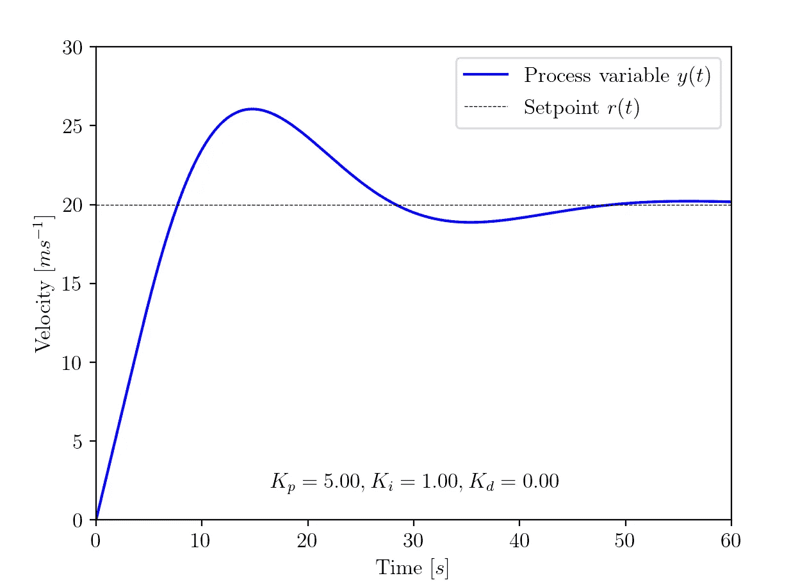
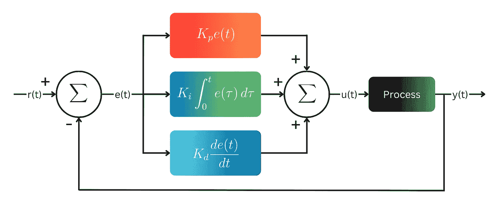
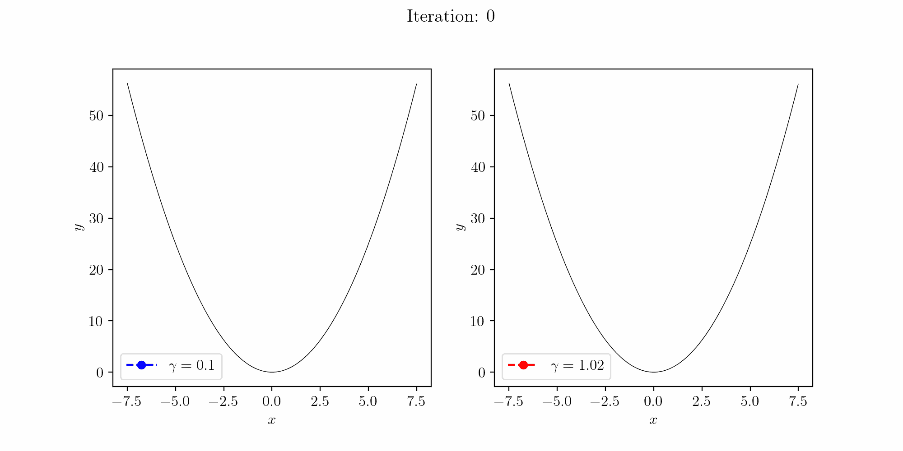
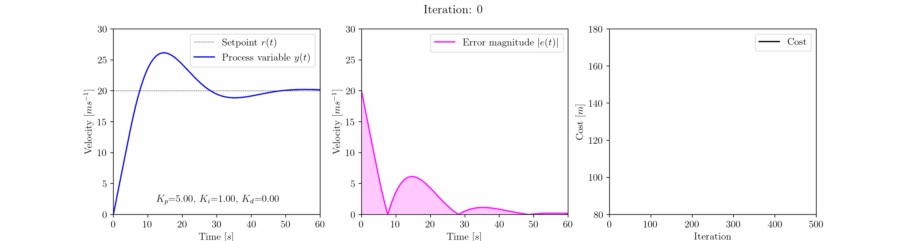

# PID 控制器优化：梯度下降方法

> 原文：[`towardsdatascience.com/pid-controller-optimization-a-gradient-descent-approach-58876e14eef2`](https://towardsdatascience.com/pid-controller-optimization-a-gradient-descent-approach-58876e14eef2)

## 使用机器学习解决工程优化问题

[](https://medium.com/@callum.bruce1?source=post_page-----58876e14eef2--------------------------------)[](https://towardsdatascience.com/?source=post_page-----58876e14eef2--------------------------------) [Callum Bruce](https://medium.com/@callum.bruce1?source=post_page-----58876e14eef2--------------------------------)

·发布于 [Towards Data Science](https://towardsdatascience.com/?source=post_page-----58876e14eef2--------------------------------) ·10 分钟阅读·2023 年 8 月 1 日

--


梯度下降算法沿着下坡的方向减少成本函数。

机器学习。深度学习。人工智能。越来越多的人每天都在使用这些技术。这在很大程度上是由于像 ChatGPT、Bard 等大型语言模型的兴起。尽管这些技术被广泛使用，但相对较少的人了解这些技术背后的方法。

在本文中，我们深入探讨了机器学习中使用的基本方法之一：梯度下降算法。

我们将不从神经网络的角度来审视梯度下降算法，在神经网络中它用于优化网络权重和偏置，而是将其作为解决经典工程优化问题的工具来探讨。

具体而言，我们将使用梯度下降来调整汽车巡航控制系统中 PID（比例-积分-微分）控制器的增益。

采用这种方法的动机有两个：

首先，优化神经网络中的权重和偏置是一个高维问题。有许多变量，我认为这些会分散梯度下降在解决优化问题中的基本效用。

其次，正如你将看到的，梯度下降在应用于经典工程问题如 PID 控制器调优、机器人中的逆运动学和拓扑优化时，可以是一个强大的工具。梯度下降是一个在我看来，更多工程师应该熟悉并能够利用的工具。

阅读本文后，你将了解什么是 PID 控制器，梯度下降算法的工作原理，以及它如何应用于解决经典工程优化问题。你可能会受到激励，使用梯度下降来应对自己的优化挑战。

本文中使用的所有代码可以在[GitHub 上找到](https://github.com/c-bruce/pid_controller_gradient_descent)。

# 什么是 PID 控制器？

PID 控制器是工程和自动化系统中广泛使用的反馈控制机制。其目标是通过持续调整控制信号以维持期望的设定点，基于设定点和系统测量输出（过程变量）之间的误差。



PID 控制器的典型阶跃响应

PID 控制器在各个行业和领域中应用广泛。它们被广泛用于过程控制系统，如制造业中的温度控制、化工厂中的流量控制以及 HVAC 系统中的压力控制。PID 控制器还被应用于机器人技术中以实现精确定位和运动控制，以及汽车系统中的油门控制、发动机速度调节和防抱死刹车系统。它们在航空航天和航空应用中也发挥着重要作用，包括飞机自动驾驶仪和姿态控制系统。

PID 控制器由三个组成部分组成：比例项、积分项和微分项。比例项对当前误差做出即时响应，积分项累积并修正过去的误差，微分项预测并抵消未来的误差趋势。



PID 控制器框图

上图中的 PID 控制器控制回路展示了 *r(t)* 是设定点，*y(t)* 是过程变量。过程变量从设定点中减去以获得误差信号 *e(t)*。

控制信号，*u(t)*，是比例、积分和微分项的总和。控制信号被输入到过程当中，这会导致过程变量更新。

PID 控制器控制信号 u(t)

# 梯度下降算法

梯度下降是一种常用于机器学习和数学优化的优化算法。它通过基于成本函数梯度迭代调整参数，旨在找到给定成本函数的最小值。梯度指向最陡的上升方向，因此通过朝相反方向迈步，算法逐渐收敛到最优解。

单步梯度下降更新定义为：

梯度下降更新步骤

***a****ₙ* 是输入参数的向量。下标 *n* 表示迭代。*f(****a****ₙ)* 是多变量成本函数，∇*f(****a****)* 是该成本函数的梯度。∇*f(****a****ₙ)* 代表最陡升高的方向，因此它从 ***a****ₙ* 中减去以在下一次迭代中减少成本函数。𝛾 是学习率，决定了每次迭代的步长。

必须选择一个合适的𝛾值。如果值过大，每次迭代时采取的步骤将过大，导致梯度下降算法无法收敛。如果值过小，梯度下降算法将计算开销大，收敛时间长。



梯度下降算法应用于 y=x²代价函数（初始 x=5），对于𝛾=0.1（左侧）和𝛾=1.02（右侧）

梯度下降在广泛的领域和学科中应用。在机器学习和深度学习中，它是用于训练神经网络和优化其参数的基本优化算法。通过根据代价函数的梯度迭代更新网络的权重和偏差，梯度下降使网络能够学习并随着时间的推移提高其性能。

除了机器学习之外，梯度下降被应用于工程、物理学、经济学及其他领域的各种优化问题中。它帮助进行参数估计、系统识别、信号处理、图像重建以及许多其他需要找到函数最小值或最大值的任务。梯度下降的多功能性和有效性使其成为解决优化问题和改善各领域模型和系统的重要工具。

# 使用梯度下降优化 PID 控制器增益

有几种方法可以调整 PID 控制器。这些方法包括手动调节法和像[齐格勒-尼科尔斯法](https://en.wikipedia.org/wiki/Ziegler%E2%80%93Nichols_method)这样的启发式方法。手动调节法可能耗时且可能需要多次迭代才能找到最佳值，而齐格勒-尼科尔斯法往往会产生激进的增益和较大的超调，这意味着它不适合某些应用。

这里展示了一种梯度下降方法来优化 PID 控制器。我们将优化一个车载巡航控制系统的控制系统，以应对设定点的阶跃变化。

通过控制踏板位置，控制器的目标是将车辆加速到速度设定点，同时最小化超调、稳定时间和稳态误差。

车辆受到与踏板位置成比例的驱动力。滚动阻力和空气阻力作用于与驱动力相反的方向。踏板位置由 PID 控制器控制，并限制在-50%到 100%范围内。当踏板位置为负值时，车辆在制动。

在调整 PID 控制器增益时，拥有系统模型是有帮助的。这样我们可以模拟系统响应。为此，我在 Python 中实现了一个`Car`类：

```py
import numpy as np

class Car:
    def __init__(self, mass, Crr, Cd, A, Fp):
        self.mass = mass # [kg]
        self.Crr = Crr # [-]
        self.Cd = Cd # [-]
        self.A = A # [m²]
        self.Fp = Fp # [N/%]

    def get_acceleration(self, pedal, velocity):
        # Constants
        rho = 1.225 # [kg/m³]
        g = 9.81 # [m/s²]

        # Driving force
        driving_force = self.Fp * pedal

        # Rolling resistance force
        rolling_resistance_force = self.Crr * (self.mass * g)

        # Drag force
        drag_force = 0.5 * rho * (velocity ** 2) * self.Cd * self.A

        acceleration = (driving_force - rolling_resistance_force - drag_force) / self.mass
        return acceleration

    def simulate(self, nsteps, dt, velocity, setpoint, pid_controller):
        pedal_s = np.zeros(nsteps)
        velocity_s = np.zeros(nsteps)
        time = np.zeros(nsteps)
        velocity_s[0] = velocity

        for i in range(nsteps - 1):
            # Get pedal position [%]
            pedal = pid_controller.compute(setpoint, velocity, dt)
            pedal = np.clip(pedal, -50, 100)
            pedal_s[i] = pedal

            # Get acceleration
            acceleration = self.get_acceleration(pedal, velocity)

            # Get velocity
            velocity = velocity_s[i] + acceleration * dt
            velocity_s[i+1] = velocity

            time[i+1] = time[i] + dt

        return pedal_s, velocity_s, time
```

`PIDController`类的实现如下：

```py
class PIDController:
    def __init__(self, Kp, Ki, Kd):
        self.Kp = Kp
        self.Ki = Ki
        self.Kd = Kd
        self.error_sum = 0
        self.last_error = 0

    def compute(self, setpoint, process_variable, dt):
        error = setpoint - process_variable

        # Proportional term
        P = self.Kp * error

        # Integral term
        self.error_sum += error * dt
        I = self.Ki * self.error_sum

        # Derivative term
        D = self.Kd * (error - self.last_error)
        self.last_error = error

        # PID output
        output = P + I + D

        return output
```

采取这种面向对象编程的方法使得设置和运行多个带有不同 PID 控制器增益的仿真变得更加容易，这在运行梯度下降算法时是必须的。

`GradientDescent` 类的实现如下：

```py
class GradientDescent:
    def __init__(self, a, learning_rate, cost_function, a_min=None, a_max=None):
        self.a = a
        self.learning_rate = learning_rate
        self.cost_function = cost_function
        self.a_min = a_min
        self.a_max = a_max
        self.G = np.zeros([len(a), len(a)])
        self.points = []
        self.result = []

    def grad(self, a):
        h = 0.0000001
        a_h = a + (np.eye(len(a)) * h)
        cost_function_at_a = self.cost_function(a)
        grad = []
        for i in range(0, len(a)):
            grad.append((self.cost_function(a_h[i]) - cost_function_at_a) / h)
        grad = np.array(grad)
        return grad

    def update_a(self, learning_rate, grad):
        if len(grad) == 1:
            grad = grad[0]
        self.a -= (learning_rate * grad)
        if (self.a_min is not None) or (self.a_max is not None):
            self.a = np.clip(self.a, self.a_min, self.a_max)

    def update_G(self, grad):
        self.G += np.outer(grad,grad.T)

    def execute(self, iterations):
        for i in range(0, iterations):
            self.points.append(list(self.a))
            self.result.append(self.cost_function(self.a))
            grad = self.grad(self.a)
            self.update_a(self.learning_rate, grad)

    def execute_adagrad(self, iterations):
        for i in range(0, iterations):
            self.points.append(list(self.a))
            self.result.append(self.cost_function(self.a))
            grad = self.grad(self.a)
            self.update_G(grad)
            learning_rate = self.learning_rate * np.diag(self.G)**(-0.5)
            self.update_a(learning_rate, grad)
```

通过调用 `execute` 或 `execute_adagrad` 来运行算法指定次数的迭代。`execute_adagrad` 方法执行一种修改后的梯度下降形式，称为 AdaGrad（自适应梯度下降）。

AdaGrad 具有逐参数的学习率，这些学习率对于稀疏参数会增加，对于不那么稀疏的参数会减少。学习率在每次迭代后会根据历史梯度平方和进行更新。

我们将使用 AdaGrad 来优化汽车巡航控制系统的 PID 控制器增益。使用 AdaGrad 时，梯度下降更新方程变为：

AdaGrad 梯度下降更新步骤

现在我们需要定义我们的成本函数。成本函数必须接受一组输入参数，并返回一个数字；即成本。汽车巡航控制的目标是将汽车加速到速度设定点，同时最小化超调、稳定时间和稳态误差。我们可以根据这个目标定义多种成本函数。这里我们将其定义为误差幅度随时间的积分：

汽车巡航控制成本函数

由于我们的成本函数是一个积分，我们可以将其可视化为误差幅度曲线下的面积。我们期望看到曲线下的面积在接近全局最小值时减少。在程序中，成本函数定义为：

```py
def car_cost_function(a):
    # Car parameters
    mass = 1000.0  # Mass of the car [kg]
    Cd = 0.2  # Drag coefficient []
    Crr = 0.02 # Rolling resistance []
    A = 2.5 # Frontal area of the car [m²]
    Fp = 30 # Driving force per % pedal position [N/%]

    # PID controller parameters
    Kp = a[0]
    Ki = a[1]
    Kd = a[2]

    # Simulation parameters
    dt = 0.1  # Time step
    total_time = 60.0  # Total simulation time
    nsteps = int(total_time / dt)
    initial_velocity = 0.0  # Initial velocity of the car [m/s]
    target_velocity = 20.0 # Target velocity of the car [m/s]

    # Define Car and PIDController objects
    car = Car(mass, Crr, Cd, A, Fp)
    pid_controller = PIDController(Kp, Ki, Kd)

    # Run simulation
    pedal_s, velocity_s, time = car.simulate(nsteps, dt, initial_velocity, target_velocity, pid_controller)

    # Calculate cost
    cost = np.trapz(np.absolute(target_velocity - velocity_s), time)
    return cost
```

成本函数包括模拟参数。模拟运行 60 秒。在此期间，我们观察系统对从 0 m/s 到 20 m/s 的设定点阶跃变化的响应。通过随时间积分误差幅度，计算每次迭代的成本。

现在，只剩下运行优化了。我们将从初始值 *Kp* = 5.0，*Ki* = 1.0 和 *Kd* = 0.0 开始。这些值会产生一个稳定的、带有超调的振荡响应，最终收敛到设定点。从这个起点开始，我们将使用基础学习率 𝛾=0.1 运行梯度下降算法 500 次：

```py
a = np.array([5.0, 1.0, 0.0])
gradient_descent = GradientDescent(a, 0.1, car_cost_function, a_min=[0,0,0])
gradient_descent.execute_adagrad(500)
```



汽车巡航控制的阶跃响应（左侧），误差幅度（中间）和成本（右侧），随着梯度下降算法迭代趋向于最优解

上面的动画图显示了汽车巡航控制的阶跃响应如何随着梯度下降算法对 *Kp*、*Ki* 和 *Kd* 增益的调优而演变。

到第 25 次迭代时，梯度下降算法已消除了振荡响应。在这一点之后，发生了有趣的事情。算法会在一个局部最小值处徘徊，该最小值的特征是约 3 m/s 的超调。这发生在 6.0 < *Kp* < 7.5，*Ki* ~= 0.5，*Kd* = 0.0 的范围内，并持续到第 300 次迭代。

第 300 次迭代后，算法会脱离局部最小值，找到更接近全局最小值的更令人满意的响应。现在的响应特征是零超调、快速稳定时间和接近零的稳态误差。

运行梯度下降算法 500 次迭代后，我们得到了优化的 PID 控制器增益；*Kp* = 8.33，*Ki* = 0.12 和 *Kd* = 0.00。

比例增益仍在稳步上升。运行更多的迭代（此处未显示），随着 *Kp* 的缓慢增加，我们发现对成本函数的进一步减少是可能的，尽管这种效果逐渐变得边际化。

# 摘要

采用一种广泛用于解决机器学习和深度学习问题的方法，我们成功地优化了汽车巡航控制系统的 PID 控制器增益。

从初始值 *Kp* = 5.0，*Ki* = 1.0 和 *Kd* = 0.0 开始，应用梯度下降算法的 AdaGrad 形式，我们观察到该低维系统如何首先进入局部最小值，然后最终找到一个更满意的响应，具有零超调、快速的稳定时间和接近零的稳态误差。

在本文中，我们看到梯度下降在应用于经典工程优化问题时可以成为一个强大的工具。除了这里展示的例子外，梯度下降还可以用于解决其他工程问题，如机器人中的逆向运动学、拓扑优化等。

您是否有一个认为可以应用梯度下降的优化问题？在下面的评论中告诉我。

> **喜欢阅读这篇文章吗？**
> 
> [关注](https://medium.com/@callum.bruce1)并[订阅](https://medium.com/@callum.bruce1/subscribe)获取更多类似内容——与您的网络分享——尝试将梯度下降应用于您自己的优化问题。

*所有图片，除非另有说明，均由作者提供。*

# 参考文献

## 网络

[1] GitHub (2023), [pid_controller_gradient_descent](https://github.com/c-bruce/pid_controller_gradient_descent)

[2] 维基百科 (2023)，[齐格勒–尼科尔斯法](https://en.wikipedia.org/wiki/Ziegler–Nichols_method)（访问日期：2023 年 7 月 10 日）
