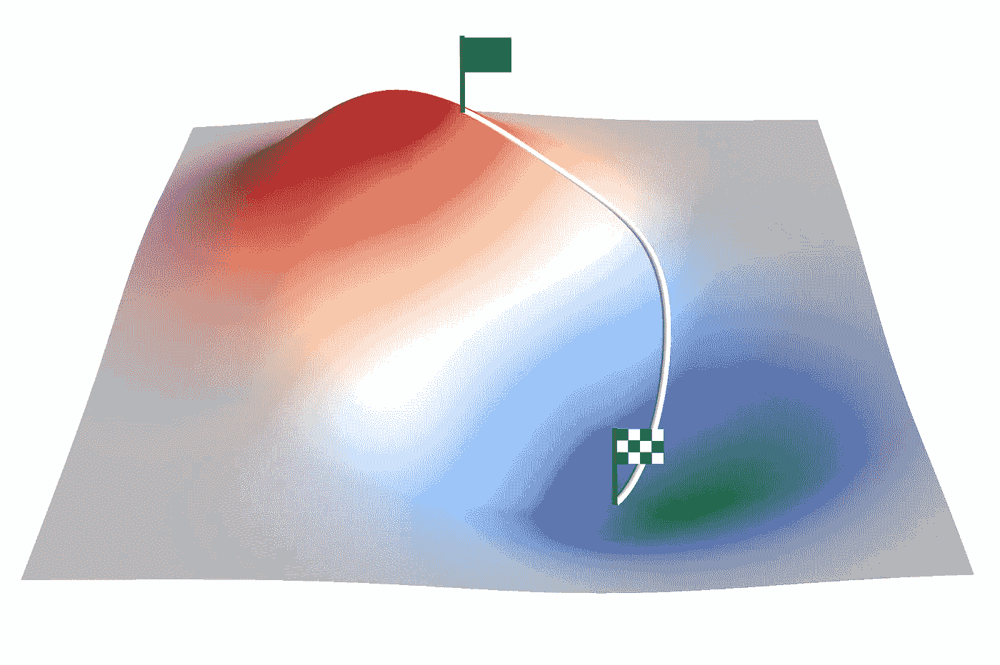

# PID 控制器优化：一种梯度下降方法

> 原文：[`towardsdatascience.com/pid-controller-optimization-a-gradient-descent-approach-58876e14eef2?source=collection_archive---------4-----------------------#2023-08-01`](https://towardsdatascience.com/pid-controller-optimization-a-gradient-descent-approach-58876e14eef2?source=collection_archive---------4-----------------------#2023-08-01)

## 使用机器学习解决工程优化问题

 [Callum Bruce](https://medium.com/@callum.bruce1?source=post_page-----58876e14eef2--------------------------------)

·

[关注](https://medium.com/m/signin?actionUrl=https%3A%2F%2Fmedium.com%2F_%2Fsubscribe%2Fuser%2Fa9c915837ab3&operation=register&redirect=https%3A%2F%2Ftowardsdatascience.com%2Fpid-controller-optimization-a-gradient-descent-approach-58876e14eef2&user=Callum+Bruce&userId=a9c915837ab3&source=post_page-a9c915837ab3----58876e14eef2---------------------post_header-----------) 发表在 [Towards Data Science](https://towardsdatascience.com/?source=post_page-----58876e14eef2--------------------------------) ·10 分钟阅读·2023 年 8 月 1 日

--

梯度下降算法沿着下坡路径来最小化成本函数

机器学习。深度学习。人工智能。越来越多的人每天都在使用这些技术。这在很大程度上是由于像 ChatGPT、Bard 等大型语言模型的崛起。尽管这些技术被广泛使用，但相对较少的人了解这些技术的基础方法。

在这篇文章中，我们深入探讨了机器学习中使用的一个基本方法：梯度下降算法。

与其从神经网络的角度看梯度下降法——在这种情况下，它用于优化网络的权重和偏置，不如将该算法视作解决经典工程优化问题的工具。

具体来说，我们将使用梯度下降法来调整汽车巡航控制系统中 PID（比例-积分-微分）控制器的增益。

采取这种方法的动机有两个方面：

首先，优化神经网络中的权重和偏置是一个高维问题。这涉及许多动态因素，我认为这些因素分散了梯度下降法在解决优化问题中的基本效用。
