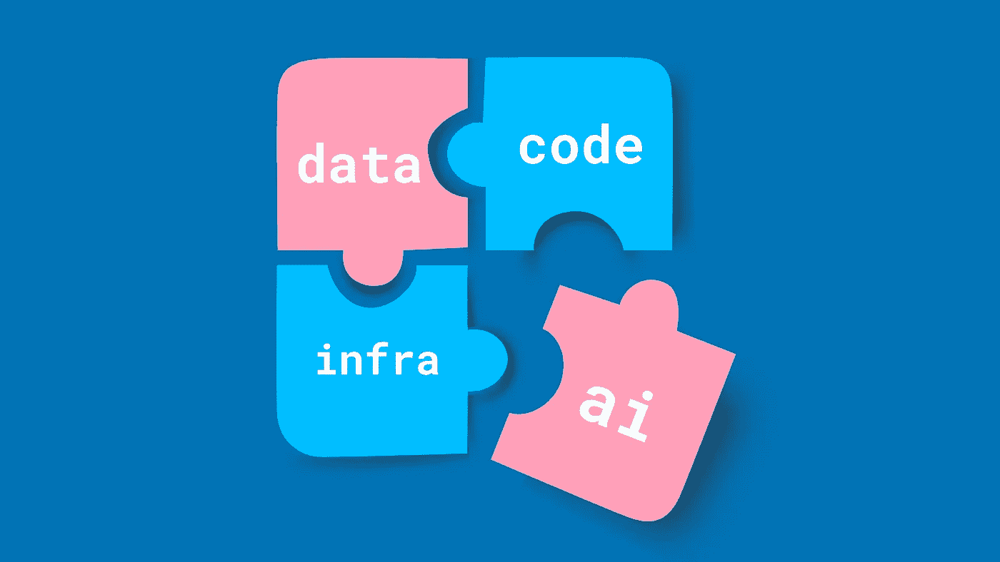
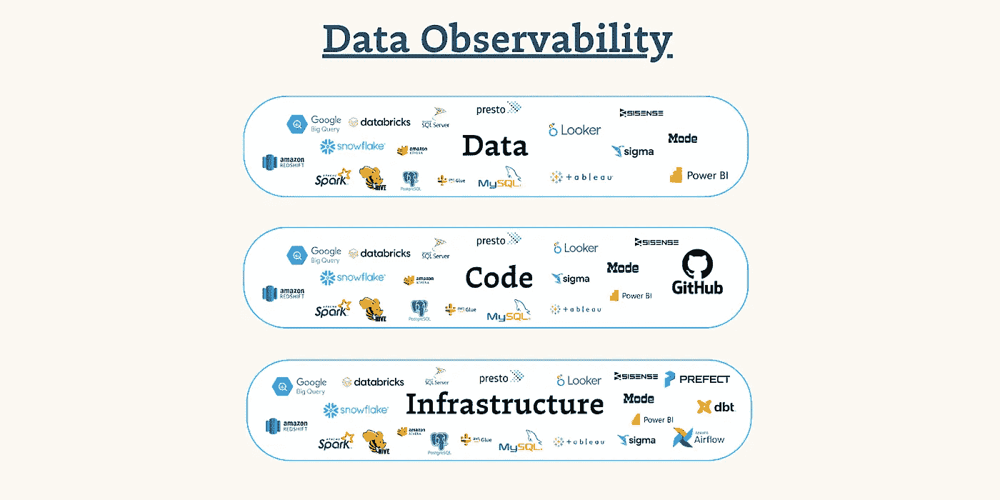

# 开创数据可观察性：数据、代码、基础设施与人工智能

> 原文：[`towardsdatascience.com/pioneering-data-observability-data-code-infrastructure-ai-c22a26706866?source=collection_archive---------5-----------------------#2023-08-08`](https://towardsdatascience.com/pioneering-data-observability-data-code-infrastructure-ai-c22a26706866?source=collection_archive---------5-----------------------#2023-08-08)

 [Barr Moses](https://barrmoses.medium.com/?source=post_page-----c22a26706866--------------------------------)

·

[关注](https://medium.com/m/signin?actionUrl=https%3A%2F%2Fmedium.com%2F_%2Fsubscribe%2Fuser%2F2818bac48708&operation=register&redirect=https%3A%2F%2Ftowardsdatascience.com%2Fpioneering-data-observability-data-code-infrastructure-ai-c22a26706866&user=Barr+Moses&userId=2818bac48708&source=post_page-2818bac48708----c22a26706866---------------------post_header-----------) 发表在 [Towards Data Science](https://towardsdatascience.com/?source=post_page-----c22a26706866--------------------------------) ·8 分钟阅读·2023 年 8 月 8 日

--

数据可观察性的四个维度：数据、代码、基础设施和人工智能？图片由作者提供。

概述了构建可靠数据系统的过去、现在和未来。

当我们在 2019 年推出[**数据可观察性**](https://www.montecarlodata.com/blog-what-is-data-observability/)类别时，这个术语几乎是我难以发音的。

四年后，这一类别已经明确确立为**现代数据堆栈的核心层**。数据可观察性是[一个 G2 类别](https://www.g2.com/categories/data-observability)，被 Gartner、Forrester 等机构认可，最重要的是，被包括一些世界上最先进的数据组织在内的数百家公司广泛采用。

事实上，一家快速增长公司的首席技术官最近告诉我：“这是由于世界变化而产生的世俗趋势。数据可观察性早晚会发生，没有人能阻止它。”

虽然我仍然不能总是正确发音（有 ESL 的吗？），但数据可观察性已经成为现代数据团队的必需品，我对这一运动取得的进展感到无比自豪——以及我们要去的地方。

那么，数据可靠性的未来会是什么样的呢？要理解我们的前进方向，首先需要退一步评估我们已经走了多远。

# 我们的起点

在 2010 年代中期，数据团队开始迁移到云端，采用数据存储和计算技术——Redshift、Snowflake、Databricks、GCP，哎呀！——以满足对分析的不断增长的需求。云计算使数据处理更快、转换更容易、访问更广泛。

随着数据变得越来越普遍，管道变得更复杂，新角色（例如数据工程师）出现以管理这种混乱，可能的使用场景数量激增。

优点？更明智的决策，更丰富的数据使用场景，以及更智能的软件。

缺点？基础部分——如数据质量——被忽视了，且在这个现代数据堆栈中处于次要地位。

在过去的某个时期，我亲身体验了坏数据的影响。凌晨 5 点，首席财务官发来的信息说“数据看起来有问题”。来自利益相关者的贴纸条，提醒我仪表盘未能更新。因我们的产品输入了不准确的数据而感到困惑的客户。

[数据可观察性](https://www.montecarlodata.com/blog-what-is-data-observability/)源于这种痛苦——我们称之为[数据停机时间](https://www.montecarlodata.com/blog-the-rise-of-data-downtime/)——并提供了一个切实可行的解决方案。受应用可观察性和站点可靠性工程的启发，数据可观察性监控并警告组织数据事件，避免对业务造成影响。数据可观察性提供了一种自动化、流程驱动的替代方案，以实现数据可靠性，从而降低成本，推动增长，并大幅减少凌晨 5 点的紧急处理。

从历史上看，最强的数据可观察性方法包括三个主要阶段：**检测**、**解决**和**预防**。

1.  **检测：** 数据可观察性检测数据中的异常和其他问题，并在相关利益相关者发现之前，提醒数据团队的相关负责人。

1.  **解决方案：**同时，数据可观察性平台为团队提供了解决问题的工具，包括字段级追溯、自动根本原因分析和影响分析、有关影响该资产的过去事件的信息、相关查询日志和 dbt 模型、受影响的报告等。

1.  **预防：**最后，数据可观察性还提供了防止数据问题发生的机制，例如在管道中设置断路器，并创建有关代码更改对数据影响的可见性，以及其他主动措施，以防止不良数据首次进入管道。

起初，数据可观察性专注于利用元数据和数据本身来检测、解决和防止数据问题，从而拼凑出数据健康的全貌。通过监控和警报数据从摄取到消费的全过程，团队可以检测到上游表中意外的变化，从而导致下游来源中断或变得不可靠。

# 扩展数据之外的检测和解决

然而，像任何行业一样，数据领域也在发展，影响了团队对事件检测和解决以及更广泛的数据可观察性的思考方式。这一演变归因于一些令人兴奋的趋势：**数据产品的兴起**以及因此**数据团队不断向工程部门靠拢或直接融入工程部门**。

随着数据团队在组织中的范围扩大，数据使用案例的增长，数据团队对底线的影响比以往任何时候都更大。现在，业务中的每个人每天都利用数据来驱动洞察、推动数字服务和训练机器学习模型。实际上，我们已经超越了仅仅[将数据视作产品](https://insidebigdata.com/2022/06/09/dont-call-it-a-data-product-unless-it-meets-these-5-requirements/)。在 2023 年，**数据即产品**。

数百位客户之后，包括 Pepsi、Gusto、MasterClass 和 Vimeo 的团队，我们发现需要超越**数据**来实现数据可靠性。不可靠的数据不会独立存在……它受到数据生态系统中所有三种成分的影响：**数据** + **代码** + **基础设施**。

这种更广泛的视角反映了我们在软件工程领域的朋友们如何处理检测和解决问题。应用程序可观察性从基础设施开始，但分析的内容远不止这些，以检测和解决软件停机问题；根本原因分析考虑了代码、基础设施、服务、网络和其他许多因素。对于软件工程师来说，可靠性不是在真空中实现的——它通常受到多个因素的影响，这些因素经常一起作用或相互叠加。

在数据中，情景往往是相同的，我们应该开始以这种方式对待它。

让我们通过一个数据领域的假设示例来了解一下。

想象一下你有一个显示过时结果的仪表板。你可能会首先**查看你的数据**，在这种情况下，也许是从 Google 导入的一个上游表格，描述了你的广告活动。是否有人更改了广告活动名称，破坏了硬编码的数据管道？或者你在点击事件表中得到的是 null 而不是用户 UUID？没有结果，那么接下来是什么？

**你查看了代码**。也许你的分析工程师对你的 SQL 进行了更改，从而过滤掉了最新的数据？他们本意是好的，但这可能带来了意想不到的后果？你查看了你的 dbt 仓库。不对——那儿一切正常。

最后，你**查看了你的基础设施**。你迅速点击到你的 Airflow 用户界面——也许你在一个小实例上运行 Airflow，而它的内存耗尽了（不应该把那些行加载到内存中！！），导致了下游的新鲜度问题。发现了——你找到了问题所在！

经验告诉我们，这三种因素都会对数据停机产生重要影响。所以无论你首先查看哪里，你都要经历一个漫长而乏味的过程，进行有根据的猜测并逐一排除。哦，我们提到过这还需要访问和熟练掌握组成你数据栈的 8 种不同工具吗？

现在，想象一下你可以迅速将你看到的症状（陈旧的仪表板……）与数据、代码和基础设施的所有变化关联起来。哦，而且你不需要统计学博士学位或在公司工作十年，知道数据仓库中的每一列。所有这些都触手可及——对数据、代码和基础设施如何共同作用以导致仪表板出现问题的端到端理解。想想你本可以节省多少时间和资源，避免多少利益相关者的沮丧，更不用说那些早晨的闹钟了。

*数据可观察性需要洞察数据环境的三个层面：数据、代码和基础设施。图片由作者提供。*

要真正实现数据可观察性的潜力并获得可靠的数据，团队需要采取三层次的方法，将影响数据健康的数据、代码和基础设施编织成一个全面的图景。

我们还认识到，实现数据可靠性不仅仅是启动一个工具。它是关于在团队中创建一种新学科——如果你愿意的话，是一种操作思维。团队需要引入有关监控数据系统、响应事件并随着时间推移不断改进的流程。

组织结构、流程和技术必须进化以实现这些目标。想想看：[仪表盘](https://www.montecarlodata.com/blog-announcing-monte-carlos-data-reliability-dashboard-a-better-way-understand-the-health-of-your-data/) 定义和监控数据产品的可靠性，基于支撑它们的上游表格，这些仪表盘可以在组织内部轻松共享，以实现透明度、协作和问责。以及 [领域](https://www.montecarlodata.com/blog-5-steps-to-getting-started-with-data-observability/) 基于用例和所有者对数据和管道进行分段，以实现有针对性的优先处理和事件解决。

# 可靠的数据与 AI 的未来

将大型语言模型 (LLMs) 视为 [插入行业] 未来的赌注现在几乎已成陈词滥调，但对数据行业的影响却有所不同。

当前数据和工程中的生成式 AI 用例几乎完全专注于提升生产力，比如 GitHub Co-Pilot、Snowflake Document AI 和 Databricks LakehouseIQ。在许多方面，我们不知道生成式 AI 的未来会怎样，但我们知道数据团队将在其成功中发挥重要作用。

LLMs 在数据质量方面有着令人兴奋的机会，但更强有力的观点是数据质量和可靠性可以帮助 LLMs。事实上，我认为服务于生产用例的 LLMs 必须建立在坚实的基础上：拥有大量高质量、可靠、值得信赖的数据。

总体而言，今天绝大多数生成式 AI 应用程序都托管在云端，并通过 API 提供服务。为了支持这些应用，你需要一个强大、基于云的数据架构，以可靠地存储、转换、训练和提供支撑这些应用的数据。

呼应这一观点，在 Snowflake 的 2023 年第一季度财报电话会议上，Snowflake 的 CEO Frank Slootman 认为，“生成式 AI 由数据驱动。这就是模型如何训练并变得越来越有趣和相关……你不能无差别地将这些 [LLMs] 放在人们不了解其质量、定义和来源的数据上。”

我们已经看到了不可靠模型训练的影响。就在去年，全球信用巨头 Equifax [共享](https://www.cnn.com/2022/08/03/business/equifax-wrong-credit-scores/index.html) 了一个消息：一个在不良数据上训练的 ML 模型导致他们向贷款机构发送了数百万消费者的错误信用评分。不久前，[Unity Technologies 报告](https://seekingalpha.com/news/3836713-unity-crashes-20-as-guidance-shows-slowing-growth-ad-delay-could-hurt-revenue-for-a-year) 由于错误的广告数据推动其定向算法，造成了 1.1 亿美元的收入损失。在未来几年中，除非我们优先考虑信任，否则这将不可避免地成为一个更大的问题。

随着我们见证企业 AI 应用的崛起，数据可观察性将成为支持 LLMs 和所有其他 AI 用例的关键能力。

正如 Databricks 的联合创始人 Matei Zaharia、Patrick Wendell、Reynold Xin 和 Ali Ghodsi [建议](https://www.databricks.com/blog/databricks-mosaicml?trk=feed_main-feed-card_reshare_feed-article-content)： “企业应用对幻觉或错误响应的容忍度很低……在机器学习生命周期的每个阶段，数据和模型必须共同管理，以构建最佳的应用程序。这对于生成模型尤其重要，因为质量和安全性在很大程度上依赖于良好的训练数据。”

我完全同意。提高和增强 AI 影响力的第一步？优质、可靠的数据——而且要有大量的数据。

加入我们吧，你愿意吗？

***通过 LinkedIn 与*** [***Barr Moses***](https://www.linkedin.com/in/barrmoses/) ***联系，分享你的想法、感受和情绪。你认为这个领域的未来发展方向是什么？***
