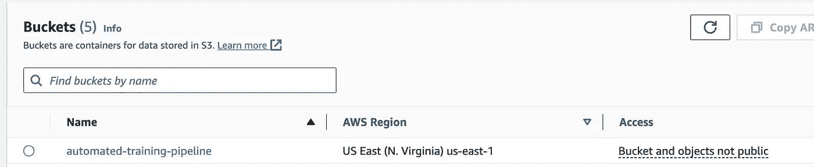
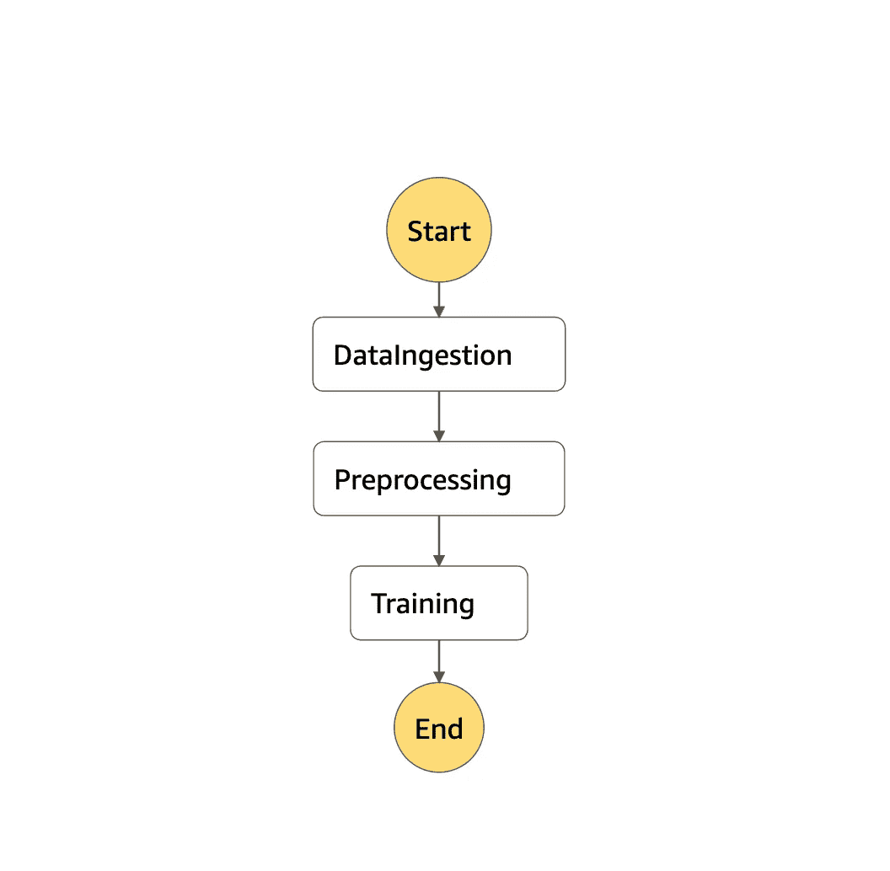

# Pipeline Dreams: 在 AWS 上自动化机器学习训练

> 原文：[`towardsdatascience.com/pipeline-dreams-automating-ml-training-on-aws-8e90a33061fd`](https://towardsdatascience.com/pipeline-dreams-automating-ml-training-on-aws-8e90a33061fd)

[](https://medium.com/@raicik.zach?source=post_page-----8e90a33061fd--------------------------------)[](https://towardsdatascience.com/?source=post_page-----8e90a33061fd--------------------------------) [Zachary Raicik](https://medium.com/@raicik.zach?source=post_page-----8e90a33061fd--------------------------------)

·发布于[Towards Data Science](https://towardsdatascience.com/?source=post_page-----8e90a33061fd--------------------------------) ·阅读时间 11 分钟·2023 年 10 月 25 日

--


照片由[Arnold Francisca](https://unsplash.com/@clark_fransa?utm_source=medium&utm_medium=referral)拍摄，来源于[Unsplash](https://unsplash.com/?utm_source=medium&utm_medium=referral)。

在机器学习的世界里，自动化训练管道简化了从数据到洞察的过程。它们自动化了机器学习生命周期的各个部分，如数据摄取、预处理、模型训练、评估和部署。亚马逊网络服务（“AWS”）提供了多种工具来开发自动化训练管道。在本文中，我们将通过使用经典的鸢尾花数据集来讲解如何设置一个基本的自动化训练管道。

# 设置舞台：需求和 AWS 工具包

在这一部分，我们将介绍一些高级需求以及我们将使用的 AWS 工具的简要概述。

## 需求

如果你选择通过构建自己的训练管道来跟随，您将需要以下内容。

+   需要一个活跃的 AWS 账户（你可以在[这里](https://aws.amazon.com/free/?trk=78b916d7-7c94-4cab-98d9-0ce5e648dd5f&sc_channel=ps&ef_id=CjwKCAjws9ipBhB1EiwAccEi1K7ugfy2KiyndD6pN_A9_pVTNfC-K3Xp41WNOcLEEDoPj1Lyu_7WHRoCtjEQAvD_BwE%3AG%3As&s_kwcid=AL%214422%213%21432339156165%21e%21%21g%21%21aws+account%219572385111%21102212379047)注册），并具有管理员权限。

+   **AWS CLI**的基本知识（我们将在未来的帖子中探索 AWS CLI 的替代方案）

设置你的 AWS 账户并通过 CLI 连接到 AWS 超出了本文的范围，但如果你需要帮助，请随时直接联系我。

## 工具包

设置自动化训练管道将需要使用以下 AWS 产品。

+   **S3**：可扩展的对象存储服务，旨在存储和检索来自网络任何位置的任意数量的数据。

+   **Lambda**：无服务器计算服务，自动响应事件运行你的代码，例如对 Amazon S3 桶中数据的更改。

+   **Docker**：Docker 是一个平台，它在轻量级、可移植的容器中打包、分发和管理应用程序。

+   **Sagemaker**：完全托管的服务，提供开发人员和数据科学家快速、轻松地构建、训练和部署机器学习模型的能力。

+   **Step Functions**：无服务器工作流服务，让你通过可视化工作流协调分布式应用程序和微服务，使你能够大规模地构建、运行和可视化复杂的流程。

# 实现自动化训练管道

假设你已经通过了要求，我们可以将注意力转向构建我们的自动化训练管道。对于这个简单的例子，我们将专注于以下步骤。

1.  创建 AWS S3 存储桶来存储与我们的训练管道相关的数据和工件。

1.  创建 AWS Lambda 函数用于数据摄取、预处理和训练。

1.  创建一个 AWS Step Functions 状态机来协调执行你的管道阶段。

我们将深入探讨每个步骤。

## 1\. S3 存储桶

首先，我们将使用 AWS CLI 创建一个新的 S3 存储桶来存储数据和工件。

```py
aws s3api create-bucket 
  --bucket automated-training-pipeline 
  --region us-east-1
```

如果这个命令成功运行，你的终端应该会输出类似的信息。

```py
{
    "Location": "/automated-training-pipeline"
}
```

看一下我们的管理控制台，我们可以看到 S3 存储桶已经成功创建。



## 2\. Lambda 函数

对于我们的自动化训练管道，我们将大量依赖 lambda 函数来执行和触发过程的某些部分。具体来说，我们将使用 lambda 函数来：

+   数据摄取

+   数据预处理

+   模型训练

***2a. 数据摄取***

Lambda 函数需要 lambda 处理程序。Lambda 处理程序是 Lambda 部署包中的用户定义函数，当 AWS Lambda 服务执行 Lambda 函数时，服务可以调用该处理程序函数。处理程序函数接收并处理来自调用者的事件数据。

鉴于这一点，让我们定义我们的 `lambda_handler` 用于数据摄取。`lambda_handler` 函数作为 AWS Lambda 执行代码的入口点，在这种情况下，它从指定的 URL 中检索一个 CSV 文件，并将其上传到 Amazon S3 存储桶。该文件已存储在 `./src/data` 中。

```py
import boto3
import requests

def lambda_handler(event, context):
    s3 = boto3.client('s3')
    data_url = 'https://example.com/dataset.csv'
    response = requests.get(data_url)

    # Assuming the data is small enough to fit into memory
    s3.put_object(
        Bucket='your-s3-bucket',
        Key='data/dataset.csv',
        Body=response.content
    )
```

我们将使用 docker 将你的 AWS Lambda 函数打包和部署为容器镜像。为此，我们首先需要创建一个 ECR 仓库来存放我们的镜像。

```py
aws ecr create-repository --repository-name fetch-iris-data --region us-east-1
```

既然我们的 ECR 仓库已经搭建好了，我们就在项目目录的根目录中创建我们的 `Dockerfile`。

```py
# Use a base image with Python 3.11
FROM public.ecr.aws/lambda/python:3.11

# Install dependencies (if any)
RUN pip install requests boto3

# Copy your function code from the src/data directory to the Lambda task root directory
COPY src/data/fetch_iris_data.py ${LAMBDA_TASK_ROOT}

# Set the CMD to your handler (could also be done as a parameter override outside of the Dockerfile)
CMD ["fetch_iris_data.lambda_handler"]
```

我们使用这个 Dockerfile 来构建我们的镜像并将其推送到 ECR 注册表。

```py
docker build -t fetch-iris-data .
```

我们需要对 Docker 进行身份验证以访问 ECR 注册表。

```py
aws ecr get-login-password --region region | docker login --username AWS --password-stdin <your-account-id>.dkr.ecr.<region>.amazonaws.com
```

接下来，我们为镜像打上标签以匹配仓库。

```py
docker tag fetch-iris-data:latest <your-account-id>.dkr.ecr.<region>.amazonaws.com/fetch-iris-data:latest
```

现在，我们可以将我们的镜像推送到 ECR 注册表。

```py
docker push <your-account-id>.dkr.ecr.<region>.amazonaws.com/fetch-iris-data:latest
```

最后，我们将创建 lambda 函数并附加容器。

```py
aws lambda create-function \
    --function-name <function-name> \
    --package-type Image \
    --code ImageUri=<your-account-id>.dkr.ecr.<region>.amazonaws.com/<repository-name>:<tag> \
    --role arn:aws:iam::<your-account-id>:role/<role-name> \
    --region <region>
```

你现在可以在 AWS 管理控制台中看到 lambda 函数。我可以调用该函数并确认文件已正确下载到 S3 存储桶中。

```py
aws lambda invoke --function-name fetch-iris-data-function --payload '{}' 

aws s3 ls s3://automated-training-pipeline/data/

#2023-10-24 13:52:41       4551 iris.data
```

***2b. 预处理***

现在，我们已经有了建模任务所需的数据。对于大多数机器学习任务，我们希望以某种方式处理这些数据。在下面的文件中，我们定义了一个脚本来处理我们的鸢尾花数据。

```py
import argparse
import os
import pandas as pd
from sklearn.preprocessing import StandardScaler, LabelEncoder
from sklearn.model_selection import train_test_split

def preprocess(input_data_path, output_data_path):
    column_names = [
        "sepal_length",
        "sepal_width",
        "petal_length",
        "petal_width",
        "species",
    ]
    df = pd.read_csv(input_data_path, header=None, names=column_names)

    df = df.dropna(subset=["species"])

    encoder = LabelEncoder()
    df["species"] = encoder.fit_transform(df["species"])

    train, test = train_test_split(df, test_size=0.2, random_state=42)

    mean_train = train.mean()

    train.fillna(mean_train, inplace=True)
    test.fillna(mean_train, inplace=True)

    scaler = StandardScaler()
    scaler.fit(train[["sepal_length", "sepal_width", "petal_length", "petal_width"]])

    train[
        ["sepal_length", "sepal_width", "petal_length", "petal_width"]
    ] = scaler.transform(
        train[["sepal_length", "sepal_width", "petal_length", "petal_width"]]
    )
    test[
        ["sepal_length", "sepal_width", "petal_length", "petal_width"]
    ] = scaler.transform(
        test[["sepal_length", "sepal_width", "petal_length", "petal_width"]]
    )

    train.to_csv(
        os.path.join(output_data_path, "train_data.csv"), header=False, index=False
    )
    test.to_csv(
        os.path.join(output_data_path, "test_data.csv"), header=False, index=False
    )

if __name__ == "__main__":
    parser = argparse.ArgumentParser()
    parser.add_argument("--input-data", type=str)
    parser.add_argument("--output-data", type=str)
    args = parser.parse_args()

    preprocess(args.input_data, args.output_data)
```

我们将预处理脚本上传到 S3。在与 `preprocess.py` 相同的目录中运行此命令。

```py
aws s3 cp preprocess.py s3://automated-training-pipeline/modeling/preprocess.py
```

类似于我们为数据获取步骤构建镜像的方式，我们将为预处理步骤构建镜像。像之前一样，我们先创建我们的仓库。

```py
aws ecr create-repository --repository-name preprocess-iris-data --region <region>
```

既然我们已经建立了 ECR 仓库，我们在项目目录的根目录中创建我们的 `Dockerfile`。

```py
# Use a standard Python base image
FROM python:3.11-slim-buster

# Install necessary libraries: requests, boto3, scikit-learn, pandas, numpy, etc.
RUN pip install requests boto3 scikit-learn pandas numpy

# No need to copy any Python script here since it will be provided from S3 at runtime

# Set working directory
WORKDIR /app

# Set a default CMD or ENTRYPOINT in case you want to run the container for testing, but this isn't strictly necessary
# since the Processing job will override this with ContainerEntrypoint from your Lambda function
CMD ["python", "-c", "print('Container started successfully')"]
```

我们构建镜像。

```py
docker build -t preprocess-iris-data .
```

让我们对 Docker 进行 ECR 注册表的认证。如果你的访问权限没有过期，你可能不需要这样做。

```py
aws ecr get-login-password --region region | docker login --username AWS --password-stdin <your-account-id>.dkr.ecr.<region>.amazonaws.com
```

再次，我们将镜像标记以匹配仓库。

```py
docker tag preprocess-iris-data:latest <your-account-id>.dkr.ecr.<region>.amazonaws.com/preprocess-iris-data:latest
```

现在，我们可以将镜像推送到 ECR 注册表。

```py
docker push <your-account-id>.dkr.ecr.<region>.amazonaws.com/preprocess-iris-data:latest
```

像之前一样，我们将创建一个 lambda 函数来启动一个 SageMaker 处理作业。我们在下面定义了我们的 lambda 处理程序。

```py
import boto3
import datetime

def lambda_handler(event, context):
    sagemaker_client = boto3.client("sagemaker")

    # Parameters for the processing job
    job_name = "iris-preprocessing-job-" + datetime.datetime.now().strftime(
        "%Y%m%d%H%M%S"
    )
    role_arn = "arn:aws:iam::<your-account-id>:role/service-role/<role>"
    image_uri = (
        "<your-account-id>.dkr.<region>.amazonaws.com/preprocess-iris-data:latest"
    )
    input_s3_uri = "s3://automated-training-pipeline/data/iris.data"
    preprocess_s3_uri = "s3://automated-training-pipeline/modeling/preprocess.py"
    output_s3_uri = "s3://automated-training-pipeline/data/"

    response = sagemaker_client.create_processing_job(
        ProcessingJobName=job_name,
        RoleArn=role_arn,
        ProcessingInputs=[
            {
                "InputName": "input-1",
                "S3Input": {
                    "S3Uri": input_s3_uri,
                    "LocalPath": "/opt/ml/processing/input",
                    "S3DataType": "S3Prefix",
                    "S3InputMode": "File",
                    "S3DataDistributionType": "FullyReplicated",
                    "S3CompressionType": "None",
                },
            },
            {
                "InputName": "code",
                "S3Input": {
                    "S3Uri": preprocess_s3_uri,
                    "LocalPath": "/opt/ml/processing/code",
                    "S3DataType": "S3Prefix",
                    "S3InputMode": "File",
                    "S3DataDistributionType": "FullyReplicated",
                    "S3CompressionType": "None",
                },
            },
        ],
        ProcessingOutputConfig={
            "Outputs": [
                {
                    "OutputName": "output-1",
                    "S3Output": {
                        "S3Uri": output_s3_uri,
                        "LocalPath": "/opt/ml/processing/output",
                        "S3UploadMode": "EndOfJob",
                    },
                }
            ]
        },
        ProcessingResources={
            "ClusterConfig": {
                "InstanceCount": 1,
                "InstanceType": "ml.t3.medium",
                "VolumeSizeInGB": 5,
            }
        },
        AppSpecification={
            "ImageUri": image_uri,
            "ContainerArguments": [
                "--input-data",
                "/opt/ml/processing/input/iris.data",
                "--output-data",
                "/opt/ml/processing/output",
            ],
            "ContainerEntrypoint": ["python3", "/opt/ml/processing/code/preprocess.py"],
        },
    )

    return {"statusCode": 200, "body": response}
```

我们将 lambda 处理程序打包，并存储在 S3 中。

```py
zip lambda_function_preprocess.zip lambda_handler_preprocess.py

aws s3 cp lambda_function_preprocess.zip s3://automated-training-pipeline/modeling/lambda_function_preprocess.zip
```

最后，我们创建我们的 lambda 函数。

```py
aws lambda create-function \
    --function-name iris-preprocessing-trigger \
    --runtime python3.11 \
    --role arn:aws:iam::<your-account-id>:role/<role>\
    --handler lambda_handler_preprocess.lambda_handler \
    --code S3Bucket=automated-training-pipeline,S3Key=modeling/lambda_function_preprocess.zip \
    --memory-size 256 \
    --timeout 900 
```

由于我们还没有将 Lambda 函数串联起来，我们可以手动调用 Lambda 函数，并检查 S3 的内容以确保我们的训练和测试数据集存在。

```py
aws lambda invoke --function-name iris-preprocessing-trigger --payload '{}' 

aws s3 ls s3://automated-training-pipeline/data/

#2023-10-24 14:50:46       4551 iris.data
#2023-10-24 17:08:42       2404 test_data.csv
#2023-10-24 17:08:42       9635 train_data.csv
```

***2c. 模型训练***

我们将使用一个内置的 SageMaker 镜像来进行逻辑回归，而不是为训练创建我们自己的镜像。如果你想要一个定制化的训练过程，你可以创建自己的镜像。因此，我们会立即编写我们的 lambda 处理程序。

```py
import boto3
import datetime

def lambda_handler(event, context):
    sagemaker_client = boto3.client("sagemaker")

    job_name = "iris-training-job-" + datetime.datetime.now().strftime("%Y%m%d%H%M%S")
    role_arn = "arn:aws:iam::<your-account-id>:role/service-role/<role>"  # Update the ARN as required

    image_uri = "382416733822.dkr.ecr.us-east-1.amazonaws.com/linear-learner:1" # Public learner

    training_data_s3_uri = "s3://automated-training-pipeline/data/train_data.csv"
    output_s3_uri = "s3://automated-training-pipeline/models/"

    response = sagemaker_client.create_training_job(
        TrainingJobName=job_name,
        RoleArn=role_arn,
        AlgorithmSpecification={
            "TrainingImage": image_uri,
            "TrainingInputMode": "File",
        },
        InputDataConfig=[
            {
                "ChannelName": "train",
                "DataSource": {
                    "S3DataSource": {
                        "S3DataType": "S3Prefix",
                        "S3Uri": training_data_s3_uri,
                        "S3DataDistributionType": "FullyReplicated",
                    },
                },
                "ContentType": "text/csv",  # Specify that we're using CSV format
            },
        ],
        OutputDataConfig={
            "S3OutputPath": output_s3_uri,
        },
        ResourceConfig={
            "InstanceCount": 1,
            "InstanceType": "ml.m5.large",
            "VolumeSizeInGB": 5,
        },
        HyperParameters={
            "predictor_type": "multiclass_classifier",
            "num_classes": "3",
            "mini_batch_size": "30",
        },
        StoppingCondition={
            "MaxRuntimeInSeconds": 3600,
        },
    )

    model_artifact_uri = f"{output_s3_uri}/{job_name}/output/model.tar.gz"

    return {
        "statusCode": 200,
        "body": {"trainingJobName": job_name, "modelArtifactUri": model_artifact_uri},
    }
```

在我们创建 lambda 函数之前，我们必须将处理程序打包并发送到 S3。

```py
zip lambda_function_train.zip lambda_handler_train.py

aws s3 cp lambda_function_train.zip s3://automated-training-pipeline/modeling/lambda_function_train.zip
```

现在我们可以创建我们的 lambda 函数了。

```py
aws lambda create-function \                                                                           
    --function-name iris-training-trigger \
    --runtime python3.11 \
    --role arn:aws:iam::<your-account-id>:role/<role> \
    --handler lambda_handler_train.lambda_handler \
    --code S3Bucket=automated-training-pipeline,S3Key=modeling/lambda_function_train.zip \
```

我们可以手动调用我们的训练 lambda 函数，以确保其正常工作。

```py
aws lambda invoke --function-name iris-training-trigger --payload '{}' output.txt

aws s3 ls s3://automated-training-pipeline/models/

#PRE iris-training-job-20231025015943/
```

## 3. 步骤函数

现在，我们有一个非常基本的流程，包括数据获取、预处理和模型训练。然而，这些组件各自存在——我们如何将它们串联起来以创建一个自动化的流程？步骤函数！

为了将我们的 lambda 函数串联起来，我们首先将使用 Amazon States Language 定义一个状态机，并将其保存在 `.json` 文件中，以便我们可以通过 CLI 将其推送到 AWS。对于我们的目的，我们将以以下方式定义我们的状态机。

```py
{
  "Comment": "A simple AWS Step Functions state machine that orchestrates 3 Lambda functions.",
  "StartAt": "DataIngestion",
  "States": {
    "DataIngestion": {
      "Type": "Task",
      "Resource": "arn:aws:lambda:REGION:ACCOUNT_ID:function:data-ingestion-lambda",
      "Next": "Preprocessing"
    },
    "Preprocessing": {
      "Type": "Task",
      "Resource": "arn:aws:lambda:REGION:ACCOUNT_ID:function:preprocessing-lambda",
      "Next": "Training"
    },
    "Training": {
      "Type": "Task",
      "Resource": "arn:aws:lambda:REGION:ACCOUNT_ID:function:training-lambda",
      "End": true
    }
  }
}
```

我们可以将步骤函数部署到 AWS。

```py
aws stepfunctions create-state-machine \
    --name “automated-training-pipeline“ \
    --definition file://pipeline.json \
    --role-arn "arn:aws:iam::<your-account-id>:role/<execution role>”
```

一旦状态机创建完成，我们可以在管理控制台中可视化它。



我们可以手动调用流程，如下所示。

```py
aws stepfunctions start-execution \
    --state-machine-arn "arn:aws:states:us-east-1:<your-account-id>:stateMachine:<YourStateMachineName>"
```

# 附加考虑事项与结论

我们在这个例子中构建的流程非常基础——我们甚至没有考虑模型评估！在实际应用中，这种方法可以扩展到涵盖模型构建生命周期的其他部分，包括模型评估和部署。

此外，我们已经构建了我们的管道，但必须手动触发。在实际应用中，你可以根据各种事件触发 Step Functions 状态机的执行。使用触发器提供了更具事件驱动的架构。以下是为状态机设置触发器的一些常见方法：

1.  **Amazon S3 Events**：如果你希望在将新文件上传到 S3 桶时运行状态机，可以在桶内设置事件来触发 Lambda 函数，从而启动状态机的执行。

1.  **AWS CodeCommit**：如果你使用 AWS CodeCommit 作为代码库，可以使用 AWS Lambda 和 Amazon CloudWatch Events 在有新的提交时触发状态机。

1.  **GitHub 或其他代码库**：如果你使用类似 GitHub 的服务，可以使用 webhooks 通知 AWS 服务有关新的提交或拉取请求合并。通常，你会设置一个 API Gateway 端点来接收 webhook，触发 API Gateway 调用的 Lambda 函数，然后让 Lambda 函数启动你的状态机。

1.  **Amazon DynamoDB Streams**：如果你想根据 DynamoDB 表中的变化触发状态机，可以使用 DynamoDB Streams。每当表中发生变化时，流可以触发一个 Lambda 函数，然后启动状态机。

1.  **AWS EventBridge（之前的 CloudWatch Events）**：AWS EventBridge 允许你基于各种 AWS 服务事件创建规则。你可以使用这些规则来指定 Lambda 函数。然后，像其他场景一样，Lambda 函数将启动你的状态机。

总之，机器学习和数据科学领域的自动化训练管道提供了多种优势。以下是你结论部分的简洁优点列表：

1.  **一致性和可重复性**：自动化确保训练过程在不同运行中保持一致。这有助于重现结果，并消除了由于人工干预而导致的变化。

1.  **效率**：自动化管道可以简化流程，减少训练和重新训练模型所需的时间。这在迭代不同的模型架构或参数时尤其有利。

1.  **可扩展性**：随着数据或模型复杂性的增加，自动化管道可以扩大资源和流程，而无需人工监督。

1.  **资源优化**：自动化可以更有效地管理资源，从而可能节省成本。例如，云资源可以在不使用时自动缩减。

如有任何问题，请随时联系！
