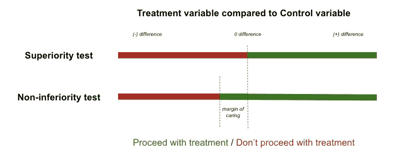

# 产品实验中的陷阱

> 原文：[`towardsdatascience.com/pitfalls-in-product-experimentation-145d12bb139f`](https://towardsdatascience.com/pitfalls-in-product-experimentation-145d12bb139f)

图片来自 Freepik (www.freepik.com)

## 常见的禁忌事项往往被忽视，这些在产品实验中导致结果不佳且不可靠

 [Olivia Tanuwidjaja](https://tanuwidjajaolivia.medium.com/?source=post_page-----145d12bb139f--------------------------------)

·发布于 [Towards Data Science](https://towardsdatascience.com/?source=post_page-----145d12bb139f--------------------------------) ·8 分钟阅读·2023 年 1 月 17 日

--

我们都知道产品实验很重要，**其好处已经被许多组织证明**，它使得基于数据的产品、功能和流程决策成为可能。[谷歌测试了 40 种蓝色](https://bambrick.com.au/blog/google-increased-revenue-200-million-just-finding-perfect-shade-blue/)，而正确的蓝色使其收入增加了 2 亿美元。[Booking.com 已经承认](https://hbr.org/2020/03/building-a-culture-of-experimentation) 组织的扩展和转型是通过在这里进行的众多测试和实验得以实现的。

然而，产品实验和其他统计测试或实验一样，**容易出现陷阱**。这些陷阱可能是设计和/或执行上的缺陷，在整个过程中可能被隐藏或未被察觉。数据团队——产品数据分析师/数据科学家——有责任保障实验执行和分析的可靠性。因此，了解常见陷阱及其处理方式非常重要，因为这些陷阱可能误导分析结果和结论。

> 如果实验没有被正确配置和分析，可能会导致结果不佳且不可靠，违背了实验最初的目的——即测试处理方法并评估其影响。

# 配置陷阱

在查看统计策略和分析之前，确保**整体实验的规划和设计**是正确的至关重要。尽管这些看起来很基础，但很有可能被忽视（*再说一次，因为它非常基础*），如果处理不当，最终会使我们错过实验。

+   **优化错误指标。** 指标选择决定了处理变更是否被推广的整体决策。作为经验法则，[实验的指标理想上应该是**与业务相关**且**受处理影响/可移动**的](https://medium.com/geekculture/selecting-the-right-metrics-to-be-tracked-5a427b94b725)。 (1) *如果这个指标上升/下降，你会感到高兴吗？* (2) *假设你是接受了处理的用户，你会做或不做会影响指标的活动吗？*

+   **未充分利用变体潜力。** 在理论世界中，A/B 测试（或分割测试）是一个常用术语。它是[比较**两个版本**以找出哪个表现更好](https://hbr.org/2017/06/a-refresher-on-ab-testing)。在实际世界中，这可以进一步扩展到两个以上的版本（[**A/B/n 测试**](https://www.optimizely.com/optimization-glossary/abn-testing/)）或测试变量组合（[**多变量测试**](https://www.optimizely.com/optimization-glossary/multivariate-testing/)）。拥有更多的变体对于**最大化资源利用**和**获取最佳决策选项的可能性**非常有帮助。它们带来了一些副统计效应（例如样本量需求增加；家庭误差率），但仍然值得探索。

+   **重叠实验。** 在组织内可能会同时进行许多实验。当这些不同的实验在相似的特征上运行时，可能会出现问题，因为**它们可能会相互干扰**——影响到重叠用户子集上的相同指标。实验的指标增加可能实际上不是单纯来自于处理本身，而是来自于重叠实验中的另一个处理。**全组织协调（从实验时间到目标分配）**可以帮助最小化这个问题。

+   **直接全面推广。** 可能会很诱人立即将实验全面推广，以最小化所需时间并尽快获得结果。然而，实验变更仍然是“产品发布”，中间可能会出现问题。建议**以分阶段推广的方式进行实验**，以降低这些发布的风险。

图片由 pch.vector 提供于 Freepik (www.freepik.com)

拥有一个[**产品实验平台**](https://engineering.atspotify.com/2020/10/spotifys-new-experimentation-platform-part-1/)可以成为预防这些陷阱的潜在解决方案，确保实施标准化的指标和最佳实践。

# 统计陷阱

产品实验是[持续***测试假设***以改进您的产品的过程](https://www.hotjar.com/product-experimentation/)。假设测试本身本质上是一种**统计推断**，因此需要遵循统计原则以正确进行产品实验。

根据产品的背景和使用情况，实验可能在统计上更复杂，需要注意一些额外的措施。以下是一些常见的问题。

## 实验“窥探”

在进行实验时，直接在部署后很快查看结果并得出（过早的）结论是非常诱人的，特别是当结果看起来良好或与我们的假设一致时。这被称为实验“窥探”问题。

实验“窥探”发生在**结果在达到适当的样本大小之前被错误地宣布*。即使初始结果显示统计显著性，这种推断也可能是**纯粹出于偶然**，如果在达到适当样本大小之前做出的推断，则是有缺陷的。

解决这个问题的理想方法是**在测试开始时确认样本大小，并在达到该样本值之前**推迟任何结论。然而，在某些情况下，达到足够的样本大小可能需要很长时间，并且变得不实际。在这种情况下，可以探索的一种技术是**顺序测试**，其中最终样本大小根据我们在测试过程中观察到的数据而动态调整。因此，如果我们在开始时观察到更极端的结果，测试可以提前结束。

由[Hexandcube](https://unsplash.com/@hexandcube?utm_source=medium&utm_medium=referral)拍摄，图片来源于[Unsplash](https://unsplash.com/?utm_source=medium&utm_medium=referral)

## 没有设定正确的零假设

在产品实验中，我们设定一个[**零假设**](https://en.wikipedia.org/wiki/Null_hypothesis)进行测试——即是否被拒绝——并给予处理。一个常见的经典零假设是*在分析的数据集（对照组与处理组）之间没有兴趣变量的差异*。这被称为[**优越性测试**](https://www.analytics-toolkit.com/glossary/superiority-test/)，其中我们期望处理组和对照组之间有一些**优越的差异——**期待处理组在兴趣变量（例如均值、比例）上有正向变化，以便继续实施处理。

这方面的一个替代方法是[**非劣性检验**](https://blog.analytics-toolkit.com/2017/case-non-inferiority-designs-ab-testing/)，在这种检验中，只要测试变体没有比对照组差得太多，我们就有理由实施该变体。该检验中的原假设是“*变体中的兴趣变量比对照组差 X%或更多*”。在此检验中，只要表现不如对照组的变体仍在“可接受范围”内，我们可以继续实施该处理。

优越性与非劣性检验的示意图（图示作者）

非劣性检验对于可能带来一些负面影响的变更（即测试移除某个功能对预订转化的影响）或检查实验中的次要指标是否可以接受降低到某个阈值以提高主要指标，都是有用的。

## 污染

常用的假设检验——z 检验和 t 检验——假设数据是从一个**独立**的正态分布中抽样的。[假设](https://www.mathworks.com/help/stats/hypothesis-test-assumptions.html)大多数情况下，通过确保随机化和非重复分配可以很容易地满足这一条件，但在某些情况下可能会比较棘手。

例如，关于[在按需配送应用中实验配送定价](https://medium.com/@DoorDash/switchback-tests-and-randomized-experimentation-under-network-effects-at-doordash-f1d938ab7c2a)。虽然处理是针对选定的用户，但由于配送车队在区域内共享（而不是按客户分配），也可能对非处理组产生影响。这被称为污染或网络效应，其中**实验的不同处理相互干扰**。

一种常见的解决方案是使用“**切换实验**”。在这种情况下，实验中的所有用户将接触到相同的体验，随机化发生在时间间隔和区域（或其他可以隔离处理效应的粒度）上。然后，感兴趣的指标将跨时间间隔进行平均。

## 多重比较问题

多重比较问题是统计学中的一个著名问题。当**同时考虑一组统计推断**或推断基于观察值选择的参数子集时，就会发生这种问题。

例如，我们正在对电子商务平台的新 UI 页面（处理组）与旧 UI 页面（对照组）进行实验。除了主要测试预订转化的影响外，我们还检查了许多其他（不太相关的）指标，如搜索框点击次数、每个类别的点击次数、会话时长、优惠券使用率等。**随着比较的属性增多，仅由于随机** [**抽样误差**](https://en.wikipedia.org/wiki/Sampling_error) **，处理组和对照组在至少一个属性上出现差异的可能性也越来越大。**

为了在统计上控制这个问题，可以采用一些方法，例如 [**邦费罗尼校正**](https://en.wikipedia.org/wiki/Bonferroni_correction)，它降低了判断结果显著性所需的 p 值阈值。

图片由 [Clay Banks](https://unsplash.com/@claybanks?utm_source=medium&utm_medium=referral) 提供，来源于 [Unsplash](https://unsplash.com/?utm_source=medium&utm_medium=referral)。

# 提升到一个新层次

上述常见陷阱之外，产品实验结果可能仍然不够理想和可靠。在分析实验结果时，还需考虑和牢记一些警示点。

+   **新颖效应**。当产品中引入一些变化时，用户通常会对这些变化感到好奇，从而推动业务指标的变化。然而，这种效应是暂时的，因为兴趣可能会随着变化变得不再新颖而逐渐趋于正常。考虑到这一点，在实验中建立“**烧入期**”通常是一个好主意，并忽略实验初期收集的数据。

+   **考虑季节性**。某些产品/功能的使用可能有一定的季节性生命周期，这可能会影响实验。例如，娱乐网站在周末的流量可能会显著高于工作日。在进行产品实验时，我们可以尽量覆盖周末和工作日，以获得治疗影响的全面估计。

没有一种完美简单的方法来进行产品实验，因为它因人群和治疗背景的不同而有所变化。此外，并非所有现实世界的影响都可以轻易量化。但仍然，***以统计学正确的方式进行的产品实验可以帮助为业务决策提供科学依据***。这可以与用户研究和产品/业务领域专家的洞察（如你作为 PM 或数据分析师）相辅相成。
