# 摆脱电子表格的束缚

> 原文：[`towardsdatascience.com/pivot-away-from-spreadsheets-e2c1639f4e2b`](https://towardsdatascience.com/pivot-away-from-spreadsheets-e2c1639f4e2b)

## Excel 不是唯一的数据透视表工具

[](https://bradley-stephen-shaw.medium.com/?source=post_page-----e2c1639f4e2b--------------------------------)[](https://towardsdatascience.com/?source=post_page-----e2c1639f4e2b--------------------------------) [Bradley Stephen Shaw](https://bradley-stephen-shaw.medium.com/?source=post_page-----e2c1639f4e2b--------------------------------)

·发布于 [Towards Data Science](https://towardsdatascience.com/?source=post_page-----e2c1639f4e2b--------------------------------) ·8 分钟阅读·2023 年 4 月 13 日

--


图片由 [DDP](https://unsplash.com/fr/@moino007?utm_source=medium&utm_medium=referral) 提供，来源于 [Unsplash](https://unsplash.com/?utm_source=medium&utm_medium=referral)

“但是数据透视表！”：许多 Excel 爱好者在听到我赞扬`pandas`（以及不可避免的建议他们放弃使用电子表格进行数据分析）时的常见反应。

认为数据透视表是电子表格的唯一属性的信念，可能阻碍了许多人完全转向使用 Python 进行数据分析。

当然，这完全不是真的——正如我们今天将深入探讨的那样：

1.  `pandas`中的基本数据透视表

1.  使用定制函数和计算字段在数据透视表中

让我们开始吧——我们将从模拟一些数据开始。

# 数据

我们将从模拟一些数据开始。这里的工作量不大，因为我们模拟了关于两种不同产品的销售数据：

```py
import pandas as pd
import numpy as np

# product A
d_a = pd.DataFrame(
    {
        'Month':pd.date_range(
            start = pd.to_datetime('01-01-2012',format = '%d-%m-%Y'),
            end = pd.to_datetime('31-12-2022',format = '%d-%m-%Y'),
            freq = 'MS',

        ),
        'Quotes':np.random.randint(
            low = 1_000_000,
            high = 2_500_000,
            size = 132
        ),
        'Numbers':np.random.randint(
            low = 300_000,
            high = 500_000,
            size = 132
        ),
        'Amounts':np.random.randint(
            low = 750_000,
            high = 1_250_000,
            size = 132
        ),
        'Product':'A'
    }
)

d_a['Store'] = np.where(
    d_a['Quotes'] / d_a['Quotes'].max() < 0.3,
    'Uptown',
    np.where(
        d_a['Quotes'] / d_a['Quotes'].max() < 0.6,
        'Downtown',
        'Central'
    )
)

# product B
d_b = pd.DataFrame(
    {
        'Month':pd.date_range(
            start = pd.to_datetime('01-01-2012',format = '%d-%m-%Y'),
            end = pd.to_datetime('31-12-2022',format = '%d-%m-%Y'),
            freq = 'MS'
        ),
        'Quotes':np.random.randint(
            low = 100_000,
            high = 800_000,
            size = 132
        ),
        'Numbers':np.random.randint(
            low = 10_000,
            high = 95_000,
            size = 132
        ),
        'Amounts':np.random.randint(
            low = 450_000,
            high = 750_000,
            size = 132
        )
    }
)

d_b['Product'] = np.where(
    d_a['Quotes'] / d_a['Quotes'].max() < 0.5,
    'B',
    'C'
)

d_b['Store'] = np.where(
    d_a['Quotes'] / d_a['Quotes'].max() < 0.3,
    'Uptown',
    np.where(
        d_a['Quotes'] / d_a['Quotes'].max() < 0.6,
        'Downtown',
        'Outer'
    )
)

df = pd.concat([d_a,d_b],axis = 0)
df = df.sample(frac = 1).copy().reset_index(drop = True)
```

… 这给出：

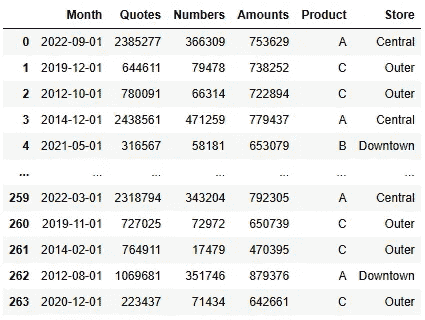

作者提供的图片

看起来很公平。让我们从数据透视表的基础开始。

# 基本数据透视表

数据透视表的前提相当简单：一些数量在各种数据段中进行汇总（或计算）。这些结果可以以表格形式表示，其中适当行和列交叉点的值是段结果。

例如，让我们看看每个商店每种产品的总报价数量。

在 Excel 中，我们可能会这样创建数据透视表查询：

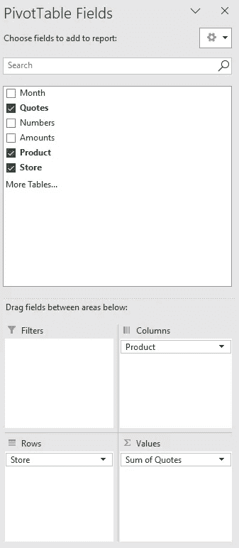

作者提供的图片

… 这将给我们一个基本的表格，如下所示：

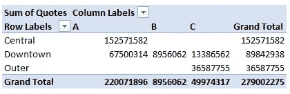

作者提供的图片

这里的空白条目表示特定段没有数据——例如，中央商店的产品 C 没有报价。

在 `pandas` 中，这很容易复制，使用 `pivot_table`¹ 函数：

```py
# basic pivot table
pd.pivot_table(
    data = df,
    index = 'Store',
    columns = 'Product',
    values = 'Quotes',
    aggfunc = 'sum'
)
```

输出呈现方式略有不同，缺失的数据更加突出：

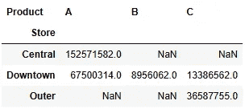

作者提供的图片

让我们更详细地查看一下代码。

`index`、`columns` 和 `values` 参数类似于 Excel 透视表查询中的“列”、“行”和“值”字段。也就是说，我们提供给 `index` 的列将形成透视表的**行**。同样，我们通过 `columns` 提供的列将形成透视表中的**列**。最后但同样重要的是，我们通过 `values` 提供的内容将是我们计算和汇总的数量，并将填充表格**单元格**。

稍有不同的是，我们如何定义应用于表格数据的函数。在 Excel 中，我们通常会在“值”窗格中点击每个数量，从“值字段设置”窗口中选择一个合适的函数。

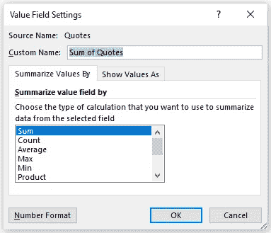

作者提供的图片

在 Python 中，这会简单一些，因为我们只需通过函数的名称来引用它们（稍后会详细介绍）。

那么，如何扩展表格以涵盖更多数量呢？例如，如果我们想计算每个产品和商店组合的最小报价和销售数量，这样做：

```py
# include two quantities
pd.pivot_table(
    data = df,
    index = 'Store',
    columns = 'Product',
    values = ['Quotes','Numbers'],
    aggfunc = ['min'],
    margins = True,
    margins_name = 'Combined'
)
```

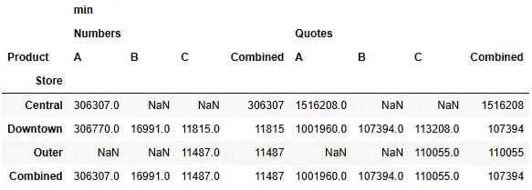

作者提供的图片

啊，但这里有些不同——我们包括了每行和每列的统计信息（并将其命名为“Combined”）。这很容易实现，因为`margins` 控制是否包含这些总计，`margins_name` 允许我们为这些表格条目提供一个有意义的名称。

# 定制函数和计算字段

很多分析——包括探索性分析——可以使用相同的简单函数完成：总和、平均值、最小值、最大值（标准差和方差也可以）。这些函数非常普遍，以至于它们已经内置于 `pandas` 中，我们可以在调用 `pivot_table` 时通过名称引用它们。

然而，有些情况下我们可能需要使用自定义函数。例如，计算变异系数绝不是一个“标准”函数，但我们可以通过首先定义它，然后通过`aggfunc`将其输入到透视表调用中来轻松实现。

```py
# function for coefficient of variation (cov)
def cov(x):
    return x.std() / x.mean()

# pivot table with cov
pd.pivot_table(
    data = df,
    index = 'Store',
    columns = 'Product',
    values = ['Quotes'],
    aggfunc = [cov]
)
```

结果是：

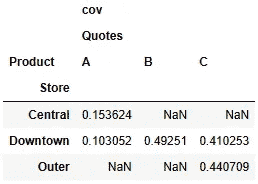

作者提供的图片

Excel 透视表的一个更有用的功能是能够创建所谓的计算字段——透视表中的一个字段，该字段来源于透视表中的其他字段。`pandas` 对透视表的实现仍然可以提供这些功能，但需要多一点工作，并回到基本原理。

作为一个实际示例，假设我们对每个产品在每个商店的转换率感兴趣。数学上这很简单：

1.  计算每个产品和商店的实际销售总数（数据中的“数量”）。

1.  计算每个产品和商店的销售报价总数（“报价”）。

1.  转换率为 (1) / (2)。

要将其作为透视表生成，我们可以按如下方式编码：

```py
# total sales numbers
num = pd.pivot_table(
    data = df,
    index = 'Store',
    columns = 'Product',
    values = 'Numbers',
    aggfunc = 'sum',
    margins = True,
    margins_name = 'Combined'
)

# total sales quotes
den = pd.pivot_table(
    data = df,
    index = 'Store',
    columns = 'Product',
    values = 'Quotes',
    aggfunc = 'sum',
    margins = True,
    margins_name = 'Combined'
)

# conversion rate
num / den
```

结果如下：

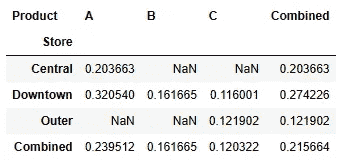

图片由作者提供

当然，这作为单独展示是可以的，但为了完整性，我们也可以将其与包含“原始”数据的透视表合并。

# 小贴士和技巧

作为额外内容，给出一些提示和技巧，然后我们就结束了。

## 创意定制函数

我们稍微谈了一下使用定制函数的事例。我展示了一个我们需要自定义函数来进行分析的案例，但你可以用更具创意的方式使用自定义函数。

作为示例，我们使用内置的 `sum` 函数来计算总报价和销售。比如这样：

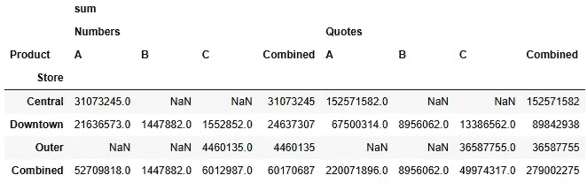

图片由作者提供

现在，尽管我相信形式之前是功能，但我不喜欢“总和”作为伪标题漂浮的方式。如果我要展示这个表格，我会考虑编写一个新的函数，名字适合展示——例如“总计”——它做的事情和 `sum` 一样，但结果更具描述性。

因此定义新的函数并传入它：

```py
# custom function with nicer name
def Total(x):
    return x.sum()

# pivot table
pd.pivot_table(
    data = df,
    index = 'Store',
    columns = 'Product',
    values = ['Quotes','Numbers'],
    aggfunc = [Total],
    margins = True,
    margins_name = 'Combined'
)
```

给我们提供：

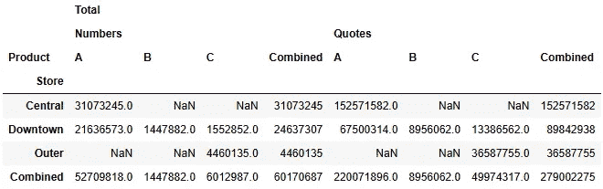

图片由作者提供

虽然表格还未完全准备好展示，但它看起来确实更好了。

## 格式化透视表

我在这里用了不少 p 字眼：通常情况下，简单的透视表会出现在幻灯片包中。

在此之前，我们可能想对表格进行一些格式化——例如以适当的方式处理缺失值，并使数字更易读。

这通过一些 DataFrame 样式设置非常简单。以下是我之前做的一个示例：

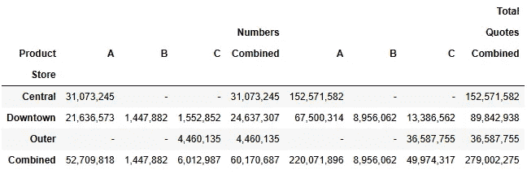

图片由作者提供

通过在 `pivot_table` 调用的末尾添加一点 `.style.format(’{:,.0f}’,na_rep=’-’)` 来完成。

对 DataFrame 的展示有大量的自定义选项。实际上，我已经为此写了一篇文章：

[](/make-your-tables-look-glorious-2a5ddbfcc0e5?source=post_page-----e2c1639f4e2b--------------------------------) ## 让你的表格看起来更辉煌

### 简单的格式化技巧让你的 pandas DataFrame 准备好展示

towardsdatascience.com

# 总结

我们很快覆盖了相当多的内容。我们已经了解了 `pandas` 中透视表的基础知识，尝试了使用定制函数，并对计算字段的工作示例进行了尝试。

在结束之前，几句想法。

Excel 仍然有几个优点。其中之一是熟悉度；无论多么简单，尝试全新的东西可能会有挑战。

用户使用的**点击和拖拽操作**是一个优势——在 Python 中没有这样的操作。

然而，如果这个操作必须重复多次，点击和拖拽的优势可能会在长期内被抵消：将这些操作转化为硬编码会节省时间和精力。

是的，这可以通过 VBA 或录制宏来完成，但说实话——无论 VBA 社区多么庞大和有帮助，它仍然是一个难以学习（且不太受欢迎）的语言。

Excel 在某些更微妙的功能和操作方面比 `pandas` 更为出色。我不是说在 `pandas` 中无法做到这些，但当你处理日期、过滤数据透视表和创建计算字段时，Excel 可以让你的生活变得更轻松。

如果你发现自己经常重复创建相同的数据透视表，也许你应该考虑转向 Python。我已经这样做了，并且没有回头——在这种情况下，草地真的更绿。

如果你读到了这里——**感谢你的阅读！** 如果你喜欢我的闲谈并希望查看更多内容，请查看我的其他故事。我写的内容涵盖了从[图表和图形](https://medium.com/towards-data-science/make-your-charts-look-glorious-9ce3fa310b70)到[神经网络](https://medium.com/towards-data-science/lets-do-neural-networks-d849d80fd012)的各种主题。

# 参考资料

1.  [pandas.pivot_table — pandas 2.0.0 文档 (pydata.org)](https://pandas.pydata.org/docs/reference/api/pandas.pivot_table.html)

1.  [变异系数 — 维基百科](https://en.wikipedia.org/wiki/Coefficient_of_variation)
