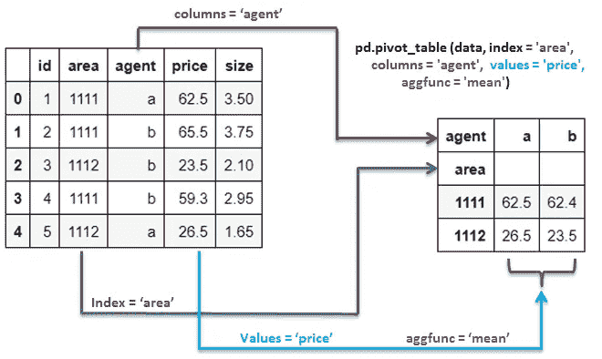

# Pandas 中的透视表及使用 Python 处理多重索引数据的实用示例。

> 原文：[`towardsdatascience.com/pivot-tables-in-pandas-with-hands-on-examples-in-python-9f29a48796f2`](https://towardsdatascience.com/pivot-tables-in-pandas-with-hands-on-examples-in-python-9f29a48796f2)

## 了解如何对 Pandas DataFrame 进行透视，并获得有意义的洞察。

[](https://suemnjeri.medium.com/?source=post_page-----9f29a48796f2--------------------------------)[](https://towardsdatascience.com/?source=post_page-----9f29a48796f2--------------------------------) [Susan Maina](https://suemnjeri.medium.com/?source=post_page-----9f29a48796f2--------------------------------)

·发布在 [Towards Data Science](https://towardsdatascience.com/?source=post_page-----9f29a48796f2--------------------------------) ·阅读时间 11 分钟·2023 年 2 月 9 日

--


图片来源 [Елена from Pexels](https://www.pexels.com/photo/upside-down-multicolored-pencils-8850038/)

透视表是一种数据操作工具，用于重新排列表格，有时还会聚合值以便于分析。

在这篇文章中，我们将探讨 Pandas 的 pivot_table 函数以及如何使用它提供的各种参数。我们将使用来自 Kaggle 的实际数据集来说明何时以及如何使用 pivot_table 函数。

透视表的优点

+   你可以通过一个或多个列对数据进行分组，然后使用各种统计数据（如均值、总和和计数）来总结这些值。

+   它具有易于使用的语法，可以直观地进行简单到复杂的数据转换。

**透视表语法**

```py
pandas.pivot_table(data, 
                  values=None, 
                  index=None, 
                  columns=None, 
                  aggfunc='mean', 
                  fill_value=None, 
                  margins=False, 
                  dropna=True, 
                  margins_name='All', 
                  observed=False, 
                  sort=True)
```

*必需参数：*

+   `data`: 数据源，格式为 pandas DataFrame

*以下两个参数中至少需要一个来分组数据。*

+   `index`: 按行分组数据的列。

+   `columns`: 按列分组数据的列。

*可选参数：*

+   `values`: 使用 `aggfunc` 函数进行聚合的列。

+   `aggfunc`: 用于聚合值的函数。

+   `fill_value`: 用于替换缺失值的值。

+   `dropna`: 是否删除仅包含 NaN 值的整行或整列。

+   `margins`: 是否包含行和列的小计。

+   `margins_name`: 行和列小计的标签名称。

+   `observed`: 仅显示分类分组器的观察值。

+   `sort`: 是否对结果的行索引进行排序。

*返回值：*

pivot_table 函数返回一个 DataFrame，其中包含使用传递给它的参数汇总的数据。

**易于理解的类比** — 简而言之，透视表语法表示对于每一个`‘index’`，返回`‘values’`列的`‘aggfunc’`，按`‘columns’`进一步分组。



Pandas 透视表由作者提供的插图

在下面的演示中，我们将使用这个类比来理解操作。

**数据**

在本文中，我们将使用来自 Kaggle 的酒店预订[数据集](https://www.kaggle.com/datasets/ahsan81/hotel-reservations-classification-dataset)，该数据集使用[署名 4.0 国际 (CC BY 4.0)](https://creativecommons.org/licenses/by/4.0/)许可证。我们将在[这个](https://github.com/suemnjeri/medium-articles/blob/main/pivot_table_pandas/EDA%20and%20Cleaning%20Hotel%20reservations%20Data.ipynb)笔记本中对数据集进行探索和清理，下面是我们将用来演示 Pandas 中透视表的 DataFrame 的一个示例。


作者提供的示例 DataFrame

**逐个参数探索**

## **‘Index’ 参数（默认值：index = None）**

这是用于对数据进行分组的列。

```py
pd.pivot_table(data, index='market')
```

让我们使用前面提到的类比来查看上面的代码。对于每个`market`，我们想要*所有数值*列的`mean`（`values`参数默认为所有可以处理默认`aggfunc=’mean’`参数且不在`‘index’`参数中的列）。


图片由作者提供

这会产生一个按`‘market’`分组的 DataFrame。每个单元格中的值是按市场组计算的该列的平均值（例如，客人数量或房价）。

## **‘Columns’ 参数（默认值：columns = None）**

这也是在列级别对数据进行分组。

```py
pd.pivot_table(data, columns='market')
```

相同的类比适用。对于每个`‘market’`，返回数值的`‘mean’`。这些组按列显示，并返回一个转置的 DataFrame。


图片由作者提供

## **‘Values’ 参数（默认值：values = None）**

这些是将出现在表格单元格中的值。聚合函数应用于这些值。

如前所述，我们必须传递`data`和至少`index`或`columns`参数来对数据进行分组。如果`values`参数没有明确指定，则会从数据中推断出支持`aggfunc`参数的列。

```py
pd.pivot_table(data, 
               index='meal_plan', 
               values = 'room_price').head()
```

上面的代码表示对于每个`‘meal_plan’`组，返回`‘room_price’`值的`‘mean’`。


图片由作者提供

## **‘Aggfunc’ 参数（默认值：aggfunc = ‘mean’）**

这是每组的值汇总（或选择返回值）的函数。

下表包含常用的`aggfunc`选项，以及它们是否仅适用于数值函数或同时适用于数值和分类函数。

**数值列：**

*‘mean’ — 每组的平均值

‘sum’ — 每组的总和

‘median’ — 每组的中位数

‘std’ — 标准差

‘var’ — 每组的方差

‘mad’ — 平均绝对偏差

‘prod’ — 每组的值的乘积*

**数字和分类列**

*‘count’ — 每组的行数

‘min’ — 每组的最小值

‘max’ — 最大值

‘first’ — 每组的第一行值

‘last’ — 最后一行的值

‘nunique’ — 每组的唯一值数量*

```py
pd.pivot_table(data, 
               index='market', 
               values = 'room_type',
              aggfunc = 'nunique')
```

在上面的代码中，对于每个 `‘market’` 组，返回 `unique` `‘room_types’` 的数量。


`**aggfunc**` **字典** — 我们还可以有 `{`values`:’aggfunc’}` 字典对，其中我们为不同的 `values` 列传递不同的函数。

```py
pd.pivot_table(data,
              index = 'market',
              aggfunc = {'room_type': 'count',
                         'lead_time':'max',
                         'room_price': 'mean'})
```

在这里，对于每个 `‘market’` 组，返回 `‘room_types’` 的 `count`、`‘lead_time’` 的 `maximum` 和 `‘price’` 的 `average`。


作者提供的图像

`**df.reset_index()**` — 上述示例中生成的结果按 `index` 参数分组，使其成为新的 index。你可以使用 `df.reset_index()` 将此列重置为常规列，同时添加一个包含从 0 开始的 [RangeIndex](https://pandas.pydata.org/docs/reference/api/pandas.RangeIndex.html)。


作者提供的图像

**理解透视表中的多重索引列头**

在查看其他 `pivot_table` 参数之前，我们先来看看从 `pivot_table` 生成的 [多重索引列](https://medium.com/towards-data-science/functions-that-generate-a-multiindex-in-pandas-and-how-to-remove-the-levels-7aa15ac7ca95)，以及如何去除这些层级。


DataFrame 多重索引示意图，作者提供

当透视表具有以下条件时，会出现多重索引列：

*一个 ‘index’ 参数

AND

多个 ‘columns’ 参数

AND/OR

多个 ‘values’ 参数

AND/OR

多个 ‘aggfunc’ 参数*

**~** `**index**` **和多个** `**columns**`

```py
pd.pivot_table(data, 
               index = 'market', 
               columns = ['status','year'], 
               values = 'room_price',
               aggfunc = 'mean',
               fill_value=0).head()
```

在上面的代码中，我们按 `‘market’` 对数据进行分组，然后返回按 `status` 和 `year` 进一步分组的 `average` `‘room price’`。


作者提供的图像

注意，在 `‘columns’` 列表中的每一列，表中会按照从最外层（0）到最内层（1）的顺序添加一个列级别（层次结构）。

**~** `**index**` **和多个** `**values**`

```py
pd.pivot_table(data, 
               index = 'market', 
               columns = 'status', 
               values = ['nights','month'],
               aggfunc = 'mean',
               fill_value=0).head()
```

在这里，我们按 `‘market’` 对数据进行分组，然后返回 `‘nights‘` 和 `‘month’` 值的 `mean`，按 `‘status’` 分组。


作者提供的图像

`values` 层级位于 `columns` 之上，默认情况下，名称是排序的。（`sort=False` 参数目前仅适用于行索引）。与 `columns` 参数不同，所有名称都保持在一个层级中，无论列表的长度如何。

**~** `**index**` **和多个** `**aggfunc**` **选项**

```py
pd.pivot_table(data, 
               index = 'market', 
               columns = 'status',  
               values = 'guests',
               aggfunc = ['mean','max'],
               fill_value=0).head()
```

在这里，按 `‘market’` 分组数据，然后返回 `‘guests’` 列的 `mean` 和 `maximum` 值，并进一步按 `‘status’` 分组。


图片来源：作者

`aggfunc` 层次处于最高层次。类似于 `values`，所有 `aggfunc` 选项都保留在一个层次中。

**~** `**index**` **和多个** `**columns**` **、** `**values**` **以及** `**aggfunc**` **选项**

```py
pd.pivot_table(data, 
               index = 'market', 
               columns = ['status','year'], 
               values = ['lead_time','nights'],
               aggfunc = ['median','max'],
               fill_value=0)
```

在这里，对于每个 `‘market’`，返回 `‘lead_time’` 和 `‘mights’` 列的 `median` 和 `maximum` 值，并进一步按 `‘status’` 和 `‘year’` 分组。


图片来源：作者

注意，我们现在有四个层次；两个层次用于 `columns` 参数，以及每个 `values` 和 `aggfunc` 参数各一个层次。

**移除多重索引层次**

你会发现，当存在列的层次结构时，`df.reset_index()` 将不会按预期工作。


df.reset_index 的多重索引示意图由作者提供

这里有两种处理多重索引的方法

1.  ***合并/合并层次***


图片来源：作者

使用上述的数据透视表，下面有两种合并层次的方法。

+   ***使用*** `***map***` ***和*** `***join***` ***函数***

```py
df.columns.map('_'.join)

#Results
['month_Canceled', 'month_Not Canceled', 
 'nights_Canceled','nights_Not Canceled']
```

在 `map` 函数中，调用 `join` 函数并传递分隔符符号，在我们的例子中是下划线。这将返回一个连接的列层次的列表，然后你可以将其分配给数据框的列名，如下所示。

```py
df.columns = df.columns.map('_'.join)
```


合并后的多重索引列标题

你还可以提供其他符号或字符作为分隔符，例如空字符串 `(''.join)`、点 `('.'.join)`，甚至一个词 `('per'.join)`。注意，层次是从最上层（层次 0）向最内层（层次 -1）组合的。

+   ***使用列表推导式——***当你想在合并过程中重新排序名称时，这种方法很有用。

```py
df.columns = [f'{i}_{j}' for i,j in df.columns]
```

上面的代码结果与上一节相同的数据框。该代码表示对于每一列，`i` 为最上层，`j` 为其下一个层次，按照这种顺序返回这两个层次（`i` 然后 `j`），并用下划线分隔。

现在，假设你希望在合并后对名称进行不同的排序。我们将使用下面的数据框。


图片来源：作者

你可以使用列表推导式合并像 `level1_level0_level2` 这样的名称。在这里，使用三个变量名来表示层次 `(i,j,k)`，然后提供所需的格式进行返回，例如 `(f’{j}_{i}_{k}’)`。

```py
df.columns = [f'{j} {i} {k}' for i,j,k in df.columns]
```

在上面的代码中，我们使用空格来分隔名称。


合并后的列名由作者提供

***2\. 删除一些层次***

有时，这些层次结构并没有实际用处。


图片来源：作者

要删除上述数据透视表的前两个层次，使用 `df.columns.droplevel(level=position)`。

```py
df.columns = df.columns.droplevel(level = [0,1])
df
```


丢弃多级索引列的 DataFrame

**删除‘列级别’名称** — 一旦你移除或合并了级别，你可以使用 `df.reset_index()`。

```py
df.reset_index()
```


图片由作者提供

但现在，原始列名（传递给 `columns` 参数的名称）仍然出现在重置的 DataFrame 中。请参见上面的 `‘year’`，它作为新索引的名称出现在错误的位置。我们可以使用 `df.rename_axis()` 来移除这个名称。

```py
df2 = df.rename_axis(columns=None)

df2.reset_index()
```


图片由作者提供

## **‘Fill_value’ 参数（默认值：fill_value = None）**

这是替代缺失值的值。

当没有 `index-columns` 组合用于你正在聚合的 `values` 时，会出现缺失值或 NaNs（Not a number）。


图片由作者提供

在上面的 DataFrame（左侧），区号 1112 没有 `agent ‘b’`，因此在 1112 和 ‘b’ 的组合值的位置上出现 NaN。

在这里，我们可以使用 `fill_value=0` 将 NaNs 替换为 0。


图片由作者提供

你也可以使用字符串值，如下面的代码中，我们将一个空字符串传递给 `fill_value` 参数。


图片由作者提供

## **‘dropna’ 参数（默认值：dropna = True）**

当为 `True` 时，此参数丢弃仅包含缺失值的行或列。

例如，使用下面的 DataFrame，假设我们有一个新的 `agent c` 尚未分配区号，以及一个新的 `area code 1113` 没有价格和大小。


图片由作者提供

如果我们希望它们出现在透视表中，而不是原始表中存在的内容，我们可以按照以下步骤进行：

+   将 `agent` 和 `area_code` 特征转换为 [分类数据类型](https://pandas.pydata.org/docs/user_guide/categorical.html) 并提供所有可能的类别。

```py
df['area_code'] = pd.Categorical(
                        df['area_code'], 
                        categories=['1111', 
                                    '1112', 
                                    '1113'])
df['agent'] = pd.Categorical(
                        df['agent'], 
                        categories=['a', 'b', 'c'])
```

+   使用 `dropna=False` 透视数据，以便不丢弃仅包含缺失值的列和行。你也可以在这里使用 `fill_value`。

```py
pd.pivot_table(df,
              index = 'area_code',
              columns = 'agent',
              values = 'price',
              aggfunc = 'mean',
              dropna = False)
```


图片由作者提供

## **‘Margins’ 参数（默认值：margins = False）**

这显示了透视表中每一行和每一列的聚合值。margin 参数在透视表的结果为数值（来自 `aggfunc` 函数如 `sum`、`count`、`nunique` 等）时有效，并且相同的 `aggfunc` 函数用于计算 `margin` 值。

例如，在下面的 pivot_table 中，我们按 `‘area_code’` 分组数据，并返回 `‘price’` 的 `sum`，进一步按 `‘agent’` 分组。我们还希望 `margins` 值，在这种情况下，返回的是行和列值的 `sum`。

```py
pd.pivot_table(df,
              index = 'area_code',
              columns = 'agent',
              values = 'price',
              aggfunc = 'sum',
              dropna = False,
              fill_value = 0,
              margins = True)
```


图片由作者提供

## **‘Margins_name’ 参数（默认值：margins_name=’All’）**

这会重命名边际名称，并且仅在`margins`设置为 True 时有效。

在下面的代码中，我们将边际名称更改为`‘sum_total’`。


图片作者提供

## **‘Observed’ 参数（默认值：observed = False）**

当你有像之前那样的[分类](https://pandas.pydata.org/docs/reference/api/pandas.Categorical.html)数据类型时，有时透视表会显示只包含零值的行和列。这种情况即使在`dropna=True`时也会发生。


图片作者提供

当你设置`observed=True`时，只显示‘observed’分组。这在从大型数据集中创建透视表时节省了内存和计算能力。


图片作者提供

## **‘Sort’ 参数（默认值：sort = True）**

这会对行和列索引进行排序。

```py
pd.pivot_table(df,
              index = 'area_code',
              aggfunc = 'first')
```


图片作者提供

当`sort=False`时，结果行索引按原始顺序出现，但列标题保持排序状态。

```py
pd.pivot_table(df,
              index = ['area_code','agent'],
              aggfunc = 'first',
              sort = False)
```


图片作者提供

## 结论

在这篇文章中，我们探讨了如何使用 Pandas 透视表及其参数。我们还了解到，`index`和`columns`参数的所有唯一组合的`values`会通过`aggfunc`函数聚合成一个值。

我们接着看了如何通过传递一个`index`和多个`columns`、`values`或`aggfunc`参数来生成分层列[(多级索引)](https://medium.com/towards-data-science/functions-that-generate-a-multiindex-in-pandas-and-how-to-remove-the-levels-7aa15ac7ca95)。后来，我们合并并删除了多级索引级别。

透视表对总结数据集很重要。你可以使用这个总结来绘制图表，或为演示格式化和美化表格。

可以在[GitHub 上的这个位置](https://github.com/suemnjeri/medium-articles/blob/main/pivot_table_pandas/Pivot_table%20examples%20using%20Hotel%20Reservations%20Data.ipynb)找到本文使用的笔记本和文件。

希望你喜欢这篇文章。要在我发布新文章时接收更多类似内容，请[点击这里](https://suemnjeri.medium.com/subscribe/@suemnjeri)订阅。如果你还不是 Medium 成员并希望支持我作为写作者，请访问[这个链接](https://medium.com/@suemnjeri/membership)，我将获得一小部分佣金。感谢阅读！
