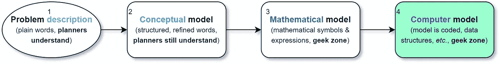
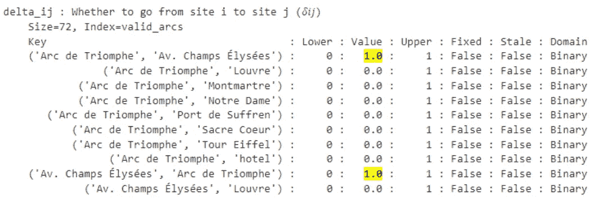
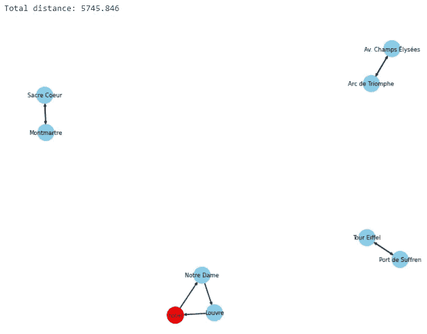
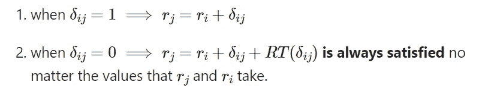
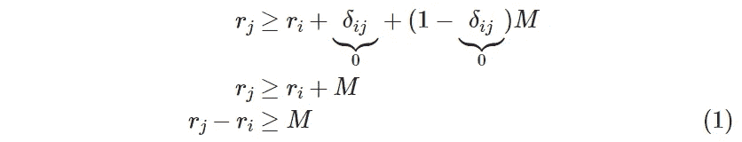
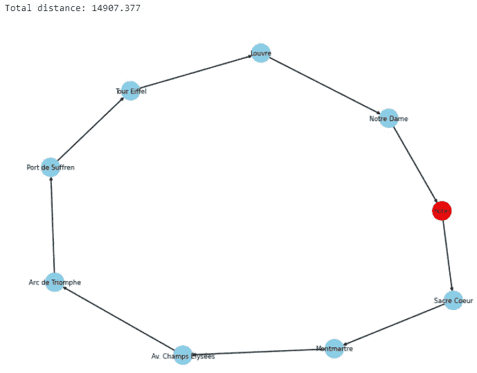

# 使用 Python 实现、解决和可视化旅行推销员问题

> 原文：[`towardsdatascience.com/plan-optimal-trips-automatically-with-python-and-operations-research-models-part-2-fc7ee8198b6c?source=collection_archive---------8-----------------------#2023-05-09`](https://towardsdatascience.com/plan-optimal-trips-automatically-with-python-and-operations-research-models-part-2-fc7ee8198b6c?source=collection_archive---------8-----------------------#2023-05-09)

## 将数学优化模型翻译为 Python，进行优化，并可视化解决方案，以便快速获得建模错误的反馈

[](https://medium.com/@carlosjuribe?source=post_page-----fc7ee8198b6c--------------------------------)[](https://towardsdatascience.com/?source=post_page-----fc7ee8198b6c--------------------------------) [Carlos J. Uribe](https://medium.com/@carlosjuribe?source=post_page-----fc7ee8198b6c--------------------------------)

·

[关注](https://medium.com/m/signin?actionUrl=https%3A%2F%2Fmedium.com%2F_%2Fsubscribe%2Fuser%2F4337eddb94ed&operation=register&redirect=https%3A%2F%2Ftowardsdatascience.com%2Fplan-optimal-trips-automatically-with-python-and-operations-research-models-part-2-fc7ee8198b6c&user=Carlos+J.+Uribe&userId=4337eddb94ed&source=post_page-4337eddb94ed----fc7ee8198b6c---------------------post_header-----------) 发表在[Towards Data Science](https://towardsdatascience.com/?source=post_page-----fc7ee8198b6c--------------------------------) ·24 分钟阅读·2023 年 5 月 9 日[](https://medium.com/m/signin?actionUrl=https%3A%2F%2Fmedium.com%2F_%2Fvote%2Ftowards-data-science%2Ffc7ee8198b6c&operation=register&redirect=https%3A%2F%2Ftowardsdatascience.com%2Fplan-optimal-trips-automatically-with-python-and-operations-research-models-part-2-fc7ee8198b6c&user=Carlos+J.+Uribe&userId=4337eddb94ed&source=-----fc7ee8198b6c---------------------clap_footer-----------)

--

[](https://medium.com/m/signin?actionUrl=https%3A%2F%2Fmedium.com%2F_%2Fbookmark%2Fp%2Ffc7ee8198b6c&operation=register&redirect=https%3A%2F%2Ftowardsdatascience.com%2Fplan-optimal-trips-automatically-with-python-and-operations-research-models-part-2-fc7ee8198b6c&source=-----fc7ee8198b6c---------------------bookmark_footer-----------)

由 DALL·E 3 生成的图像，作者的提示是：“城市中的位置网络和连接它们的最佳路线”

> *👁️* **这是涵盖项目“**[**Python 中的智能决策支持系统**](https://medium.com/@carlosjuribe/list/an-intelligent-decision-support-system-for-tourism-in-python-b6ba165b4236)**”的系列文章中的第 3 篇。** 我鼓励你查看，以获得整个项目的一般概述。如果你只是对如何在 Python 中实现 TSP 模型感兴趣，你仍然来对地方了：这篇文章是自包含的，我将带你完成所有步骤——安装依赖项、分析、代码、结果解释和模型调试。

本文继续从[sprint 2](https://medium.com/@carlosjuribe/modeling-the-traveling-salesman-problem-from-first-principles-bd6530c9c07)结束的地方接着讲解。在这里，我们将上一篇文章中**制定的数学**模型**实现到 Python 中**，使用**Pyomo**，并遵循**良好实践**。然后，模型经过优化，**解决方案被可视化和分析**。为了教学目的，我们发现初始模型公式不完整，因此我展示了如何从第一性原理推导出**修正公式所需的约束**。这些新约束被添加到 Pyomo 模型中，新解决方案再次被分析和验证。

# 目录

## 1\. 使用 Pyomo 在 Python 中实现模型

+   1.1\. 安装依赖项

+   1.2\. 数学变成代码

## 2\. 解决和验证模型

+   2.1\. 解决模型

+   2.2\. 结果可视化

+   2.3\. 分析结果

## 3\. 修正公式

+   3.1\. 激励思想

+   3.2\. 将激励思想表达为逻辑蕴涵

+   3.3\. 将逻辑蕴涵公式化为线性约束

+   3.4\. 推导“大 M”的适当值

## 4\. 实现和验证新公式

+   4.1\. 扩展 Pyomo 模型

+   4.2\. 绘制更新模型的解决方案

## 5\. 结论（用于下一个冲刺）

> *📖* 如果你没有阅读过[上一篇文章](https://medium.com/@carlosjuribe/modeling-the-traveling-salesman-problem-from-first-principles-bd6530c9c07)，也不用担心。数学公式在这里也**阐述（但没有推导）**，每个模型组件都与其代码实现相邻。如果你不理解这些内容的来源或含义，请阅读“[冲刺 2](https://medium.com/@carlosjuribe/modeling-the-traveling-salesman-problem-from-first-principles-bd6530c9c07)”的文章，如果你想了解更多关于问题陈述和动机的背景，请阅读“[冲刺 1](https://medium.com/@carlosjuribe/plan-an-optimal-trip-for-your-next-holidays-with-the-help-of-operations-research-and-python-481b1ea38fef)”的文章。

[](/modeling-the-traveling-salesman-problem-from-first-principles-bd6530c9c07?source=post_page-----fc7ee8198b6c--------------------------------) ## 从第一原则建模旅行推销员问题

### 一种以概念为先，数学为后的建模方法，用于解决运筹学中最著名的路径问题

[towardsdatascience.com

# 1. 实现使用 Pyomo 的 Python 模型

> 使用 Python 是因为它是数据科学中的顶级语言，而[**Pyomo**](https://www.pyomo.org/)则是处理大规模模型的最佳（开源）库之一。

在本节中，我将逐一讲解在公式中定义的每个**模型组件**，**并解释它是如何转换为 Pyomo 代码**的。我尽量不留下任何空白，但如果你觉得还有问题，请在评论中提问。

> ***免责声明****：目标读者预计对 Pyomo 甚至建模都是新手，因此为了降低他们的认知负担，* ***简洁明了的实现优先于编程最佳实践****。目前的目标是教授优化建模，而非软件工程。代码会在未来迭代中逐步改进，随着这一概念验证演变成更复杂的 MVP。

## 1.1. 安装依赖项

## 对于着急的人

安装（或确保已经安装）库`pyomo`、`networkx`和`pandas`，以及包`glpk`。

> *📝* 包`glpk`包含[GLPK 求解器](https://www.gnu.org/software/glpk/)，这是我们用来优化创建模型的**外部求解器**。Pyomo 用于**创建问题模型**并将其传递给 GLPK，GLPK 将运行算法来执行优化过程。然后，GLPK 将解决方案返回给 Pyomo 模型对象，这些解决方案被存储为模型属性，我们可以在不离开 Python 的情况下方便地使用它们。

推荐的安装 GLPK 的方法是通过[conda](https://anaconda.org/conda-forge/glpk)，这样 Pyomo 可以轻松找到 GLPK 求解器。要一次性安装所有依赖项，请运行：

```py
conda install -y -c conda-forge pyomo=6.5.0 pandas networkx glpk
```

## 对于有组织的人

我建议创建一个单独的**虚拟环境**，在其中安装所有需要的库以跟随本系列的文章。复制这段文本

```py
name: ttp  # traveling tourist problem
channels:
  - conda-forge
dependencies:
  - python=3.9
  - pyomo=6.5.0
  - pandas
  - networkx
  - glpk  # external solver used to optimize models
  - jupyterlab  # comment this line if you won't use Jupyter Lab as IDE
```

并将其保存在名为`environment.yml`的 YAML 文件中。在相同位置打开 Anaconda 提示符并运行命令

```py
conda env create --file environment.yml
```

几分钟后，环境将创建完毕，所有依赖项都已安装。运行`conda activate ttp`以“进入”环境，启动 Jupyter Lab（在终端中运行`jupyter lab`），然后开始编码吧！

## 1.2. 数学变成代码

首先，确保 Pyomo 可以找到 GLPK 求解器

```py
### =====  Code block 3.1  ===== ###
import pandas as pd
import pyomo.environ as pyo
import pyomo.version
import networkx as nx

solver = pyo.SolverFactory("glpk")
solver_available = solver.available(exception_flag=False)
print(f"Solver '{solver.name}' available: {solver_available}")

if solver_available:
    print(f"Solver version: {solver.version()}")

print("pyomo version:", pyomo.version.__version__)
print("networkx version:", nx.__version__)
```

```py
Solver 'glpk' available: True
Solver version: (5, 0, 0, 0)
pyomo version: 6.5
networkx version: 2.8.4
```

> *⛔* 如果你收到消息`'glpk' available: False`，说明求解器安装不正确。请尝试以下方法解决问题：
> 
> - 重新仔细执行安装步骤
> 
> - 在基础（默认）环境中运行 `conda install -y -c conda-forge glpk`
> 
> - 尝试安装适合你的不同求解器

然后读取距离数据的 CSV 文件

```py
### =====  Code block 3.2  ===== ###
path_data = (
    "https://raw.githubusercontent.com/carlosjuribe/"
    "traveling-tourist-problem/main/"
    "Paris_sites_spherical_distance_matrix.csv"
)
df_distances = pd.read_csv(path_data, index_col="site")

df_distances
```


现在我们进入[敏捷运筹学工作流程]的“阶段 4”，如下图所示的绿色块：



**图 1.** 运筹学问题解决的极简工作流程。第 4 阶段：**计算机** **模型**（作者提供的图片）

任务是将之前创建的数学模型实现成代码，*完全按照数学上定义的方式*。

> *👁️* 如果这样可以使模型实现更容易，我们可以创建任意数量的 Python 对象，但**在编写代码时，我们不允许以任何方式修改底层模型**。**这会导致数学模型和计算机模型不同步**，从而使后续的模型调试变得相当困难。

我们实例化一个空的 Pyomo 模型，在其中将模型组件作为属性存储：

```py
model = pyo.ConcreteModel("TSP")
```

## 1.2.1\. 集合

为了创建站点集合𝕊 = {卢浮宫，埃菲尔铁塔，…，酒店}，我们从数据框的索引中提取它们的名称，并用它来创建一个名为`sites`的 Pyomo `Set`：

```py
### =====  Code block 3.3  ===== ###
list_of_sites = df_distances.index.tolist()

model.sites = pyo.Set(initialize=list_of_sites, 
                      domain=pyo.Any, 
                      doc="set of all sites to be visited (𝕊)")
```

创建派生集


**表达式 3.1.** 旅行的可能弧的派生集（站点到站点的轨迹）。

我们将过滤器𝑖 ≠ 𝑗 存储在*构造规则*（Python 函数`_rule_domain_arcs`）中，并在初始化`Set`时将此规则传递给`filter`关键字。请注意，这个过滤器将应用于站点的笛卡尔积（𝕊 × 𝕊），并会筛选出那些不符合规则的笛卡尔积成员。

```py
### =====  Code block 3.4  ===== ###
def _rule_domain_arcs(model, i, j):
    """ All possible arcs connecting the sites (𝔸) """
    # only create pair (i, j) if site i and site j are different
    return (i, j) if i != j else None 

rule = _rule_domain_arcs
model.valid_arcs = pyo.Set(
    initialize=model.sites * model.sites,  # 𝕊 × 𝕊
    filter=rule, doc=rule.__doc__)
```

## 1.2.2\. 参数

参数

𝐷ᵢⱼ ≔ 站点𝑖和站点𝑗之间的距离

是通过构造函数`pyo.Param`创建的，该构造函数将**第一个**（位置）参数域𝔸（`model.valid_arcs`）传递给它，并将*关键字*参数`initialize`设置为另一个构造规则`_rule_distance_between_sites`，该规则针对每对（𝑖, 𝑗）∈ 𝔸进行评估。在每次评估中，距离的数值从数据框`df_distances`中提取，并在内部与对（𝑖, 𝑗）相关联：

```py
### =====  Code block 3.5  ===== ###
def _rule_distance_between_sites(model, i, j):
    """ Distance between site i and site j (𝐷𝑖𝑗) """
    return df_distances.at[i, j]  # fetch the distance from dataframe

rule = _rule_distance_between_sites
model.distance_ij = pyo.Param(model.valid_arcs, 
                              initialize=rule, 
                              doc=rule.__doc__)
```

## 1.2.3\. 决策变量

由于𝛿ᵢⱼ具有与𝐷ᵢⱼ相同的“索引域”，因此构建此组件的方式非常相似，只是这里不需要构造规则。


**表达式 3.2.** 二进制决策变量

```py
model.delta_ij = pyo.Var(model.valid_arcs, within=pyo.Binary, 
                         doc="Whether to go from site i to site j (𝛿𝑖𝑗)")
```

`pyo.Var`的第一个位置参数保留用于其索引集𝔸，变量的“类型”通过关键字参数`within`指定。这里的“变量类型”指的是变量可以取的**值范围**。在这里，𝛿ᵢⱼ的范围仅为 0 和 1，所以它是二进制类型。从数学上讲，我们会写作𝛿ᵢⱼ ∈ {0, 1}，但我们可以在创建变量时通过设置`within=pyo.Binary`直接在 Pyomo 中表示这一点，而无需创建单独的约束。

## 1.2.4\. 目标函数


**表达式 3.3.** 需要最小化的目标函数：总巡回距离

要构造目标函数，我们可以将表达式“存储”在一个函数中，该函数将用作*构造规则*。此函数只接受一个参数，即模型，用于提取构建表达式所需的任何模型组件。

```py
### =====  Code block 3.6  ===== ###
def _rule_total_distance_traveled(model):
    """ total distance traveled """
    return pyo.summation(model.distance_ij, model.delta_ij)

rule = _rule_total_distance_traveled
model.obj_total_distance = pyo.Objective(rule=rule, 
                                         sense=pyo.minimize, 
                                         doc=rule.__doc__)
```

观察数学表达式与函数的返回语句之间的平行关系。我们通过`sense`关键字指定这是一个最小化问题。

## 1.2.5\. 约束

如果你记得之前的文章，一个方便的方式来强制每个站点仅被访问一次是强制每个站点同时被“进入”一次和“退出”一次。

**每个站点仅被访问一次**


**表达式 3.4.** 约束集，强制每个站点仅被“进入”一次。

```py
def _rule_site_is_entered_once(model, j):
    """ each site j must be visited from exactly one other site """
    return sum(model.delta_ij[i, j] for i in model.sites if i != j) == 1

rule = _rule_site_is_entered_once
model.constr_each_site_is_entered_once = pyo.Constraint(
                                          model.sites, 
                                          rule=rule, 
                                          doc=rule.__doc__)
```

**每个站点仅被退出一次**


**表达式 3.5.** 约束集，强制每个站点仅被“退出”一次。

```py
def _rule_site_is_exited_once(model, i):
    """ each site i must departure to exactly one other site """
    return sum(model.delta_ij[i, j] for j in model.sites if j != i) == 1

rule = _rule_site_is_exited_once
model.constr_each_site_is_exited_once = pyo.Constraint(
                                          model.sites, 
                                          rule=rule, 
                                          doc=rule.__doc__)
```

## 1.2.6\. 模型的最终检查

模型实现已完成。为了查看模型的整体情况，我们应该执行`model.pprint()`，并稍微浏览一下，以查看是否遗漏了一些声明或犯了一些错误。

为了了解模型的规模，我们打印它包含的变量和约束的数量：

```py
def print_model_info(model):
    print(f"Name: {model.name}", 
          f"Num variables: {model.nvariables()}",
          f"Num constraints: {model.nconstraints()}", sep="\n- ")

print_model_info(model)

#[Out]:
# Name: TSP
#  - Num variables: 72
#  - Num constraints: 18
```

拥有少于 100 个约束或变量，这个问题的规模较小，求解器会相对较快地优化它。

# 2\. 解决和验证模型

## 2.1\. 解决模型

[AOR 流程图](https://example.org)中的下一步是优化模型并检查解决方案：

```py
res = solver.solve(model)  # optimize the model
print(f"Optimal solution found: {pyo.check_optimal_termination(res)}")
# [Out]: Optimal solution found: True
```

好消息！求解器找到了这个问题的**最优解**！让我们检查一下，以便知道到巴黎时该跟随什么路线！

为了进行快速检查，我们可以运行`model.delta_ij.pprint()`，这将打印所有𝛿ᵢⱼ变量的（最优）值，值为 0 或 1：



**图 3.1.** 模型打印的决策变量值摘录（图片来源：作者）

仅通过查看*选择的弧线*很难可视化一个巡回路线，更不用说分析它以验证我们是否正确地制定了模型。

要真正理解解决方案，我们需要对其进行可视化。

## 2.2\. 结果可视化

> *一张图片胜过千言万语*

由于我们处理的是节点和弧，**可视化解决方案的最简单方法是将其绘制成图形**。请记住，这只是一个概念验证，因此**快速、有效的反馈优于美观**。更具洞察力的可视化可以等到我们有一个可行的 MVP 后再做。现在，让我们编写一些辅助函数以高效地绘制解决方案。

函数`extract_solution_as_arcs`接收一个已解决的 Pyomo 模型，并从解决方案中提取“选定的弧”。接下来，函数`plot_arcs_as_graph`将活跃弧的列表存储在 Graph 对象中以便于分析，并绘制该图，使得酒店是唯一的红色节点，作为参考。最后，函数`plot_solution_as_graph`调用上述两个函数，以图形的形式展示给定模型的解决方案。

```py
### =====  Code block 3.7  ===== ###
def extract_solution_as_arcs(model):
    """ Extract list of active (selected) arcs from the solved model,
    by keeping only the arcs whose binary variables are 1 """
    active_arcs = [(i, j)
                   for i, j in model.valid_arcs
                   if model.delta_ij[i, j].value == 1]
    return active_arcs

def plot_arcs_as_graph(tour_as_arcs):
    """ Take in a list of tuples representing arcs, convert it 
    to a networkx graph and draw it
    """
    G = nx.DiGraph()
    G.add_edges_from(tour_as_arcs)  # store solution as graph

    node_colors = ['red' if node == 'hotel' else 'skyblue' 
                   for node in G.nodes()]
    nx.draw(G, node_color=node_colors, with_labels=True, font_size=6, 
            node_shape='o', arrowsize=5, style='solid')

def plot_solution_as_graph(model):
    """ Plot the solution of the given model as a graph """
    print(f"Total distance: {model.obj_total_distance()}")

    active_arcs = extract_solution_as_arcs(model)
    plot_arcs_as_graph(active_arcs)
```

现在我们可以看到解决方案的真实情况：

```py
plot_solution_as_graph(model)
```



**图 3.2.** 第一个模型的解决方案，显示了不希望出现的子旅行，而不是单一旅行路线。（图像由作者提供）

嗯，这显然是**不符合我们预期的！** 没有**单一的旅行路线**遍历所有站点并返回酒店。确实，所有站点都被访问了，但只是作为小的、不连通的站点簇的一部分。技术上讲，我们指定的约束条件确实被严格遵守：每个站点只进入一次，离开一次，但**总体结果不是我们所期望的单一旅行路线，而是一组子旅行**。这意味着我们在上一篇文章中的假设.) 是错误的，因此模型中缺少了某些东西，以编码“解决方案中不允许子旅行”的要求。

## 2.3\. 分析结果

出了什么问题？

> *当一个模型的解决方案不合逻辑时，唯一的可能解释是：* ***模型是错误的******¹****。*

求解器给出了模型的*真实*最优解，但**我们给出的模型并不符合我们要解决的问题**。现在的任务是找出原因，以及我们哪里犯了错误。回顾起来，显而易见的候选因素是我们在前一篇文章“4.4\. 创建约束”部分最后两段中做出的*可疑假设*，即我们设计数学模型时的假设。**我们**（现在知道是错误的）**假设从两个约束条件自然会形成一个*单一的旅行路线***。但正如我们刚刚可视化的那样，并非如此。为什么？

> 错误的根源在于我所称的“**未言明的常识**”：我们对世界的知识如此明显，以至于我们忘记在模型中指定它。

我们**隐含地**知道在访问站点时传送是不可能的，**但我们没有明确告知模型**。这就是为什么我们观察到那些小的子旅行，连接了一些站点，但不是全部。模型“认为”从一个站点传送到另一个站点是可以的，只要一旦到达某个站点，就会*退出*一次并*进入*一次（请再次查看图 3.2）。我们之所以看到子旅行，仅仅是因为我们告诉模型最小化旅行的距离，而正好传送有助于节省距离。

因此，**我们需要防止这些子旅行的形成**以获得一个现实的解。**我们需要设计一些新的约束条件**，以“告知模型”子旅行是被禁止的，或者说，**解必须是一个单一的旅行**。我们选择后者，并**从第一原则出发**，推导出一组直观的约束条件，并能很好地完成任务。

# 3\. 修正模型

参考[敏捷运筹研究工作流程]，我们现在处于**模型重新制定阶段**。模型的重新制定可能涉及改进或修复。我们的目的是修复它。

我们知道我们想要什么：强制解为一个单一的旅行，从我们的初始站点，即酒店，开始和结束。**挑战在于如何将这一要求编码为一组线性约束**。下面是一个想法，源于旅行的性质。

## 3.1\. 激励思想

我们有𝑁个站点需要“遍历”，包括酒店。由于我们从酒店开始，这意味着还有 𝑁 − 1 个站点需要访问。**如果我们跟踪访问这些站点的“时间顺序”**，使得第一个目的地（酒店之后）标记为 1，第二个目的地标记为 2，以此类推，那么在返回酒店之前的最后一个目的地将被标记为 𝑁 − 1。如果我们将这些用于跟踪访问顺序的数字称为“*等级*”，那么**在旅行中出现的模式**是*任何站点（**除了酒店**）的等级总是比前一个站点的等级高 1 个单位*。如果我们能够**制定一组约束条件，使得任何可行解都符合这种模式**，那么可以说，我们在模型中引入了一个“时间顺序”的要求。事实证明我们确实可以做到这一点。

## 3.2\. 将激励思想表达为逻辑蕴涵

> *💡* *这是我们希望任何可行解都满足的“模式”：*
> 
> 任何站点（除了酒店）的等级必须总是比其在旅行中前面的站点的等级高 1 个单位

我们可以将这个模式重新表达为一个**逻辑蕴涵**，如下：“站点𝑗的等级必须比站点𝑖的等级高 1 个单位*当且仅当* 𝑗 紧接着 𝑖 被访问，对于所有不包括酒店𝐻的弧 (𝑖, 𝑗)”。这个措辞在数学上表示为：


**表达式 3.6\.** 排名变量的逻辑含义：每访问一个新地点，排名增加 1。

其中 𝑟ᵢ 是**我们需要跟踪（尚未确定的）访问顺序的新变量**。为了将它们与决策变量区分开来，我们称它们为“**排名**变量”。右侧的意思是“对于所有属于所有地点集合（不包括酒店）的 𝑖 和 𝑗”。为了*符号方便*，我们定义新的集合 𝕊* 来存储除酒店之外的所有地点（用 𝐻 表示）：


**表达式 3.7\.** 所有感兴趣地点的集合：所有地点，除酒店外。

这允许我们简洁地定义排名变量为：


**表达式 3.8.** 排名变量的定义，仅定义在感兴趣的地点。

> *👁️* *酒店* ***不能有相关的排名变量*** *因为* 酒店将同时是任何旅行的起点和终点*，这一条件* ***会违反模式*** *“旅行中排名变量不断增加”*。这样，每个地点的排名总是随着每个新弧的添加而增加，从而确保* ***禁止封闭环路，除非环路闭合在唯一一个没有排名变量的地点：酒店***。

𝑟ᵢ 的界限源自其描述：排名从 1 开始，并单调增加，直到所有 𝕊* 中的地点都被访问，最终为 | 𝕊* |（非酒店地点集合的大小）。此外，我们允许它们取任何正实数值：


**表达式 3.9.** 排名变量的范围和界限

# 3.3\. 将逻辑含义表述为线性约束

现在的挑战是将这种逻辑含义转化为一组线性约束。幸运的是，**线性不等式也可以用来强制逻辑含义**，不仅仅是有限资源限制。

一种方法是通过所谓的**Big-M 方法**，其包括声明一个约束，使得**当您关心的条件满足时，约束有效（激活），当您关心的条件不满足时，约束变得冗余（失效）**。该技术称为“大 M”是因为它使用一个常数值 𝑀，**该值足够大，以至于当出现在约束中时，使约束在任何情况下都变得冗余**。当 𝑀 不出现在约束中时，约束在*期望的含义*上是“有效的”。

**但是什么决定了约束是否“有效”？** 简短的回答是约束所应用的**决策变量的值**。让我们看看它是如何工作的。

希望的含义是仅当 𝛿ᵢⱼ = 1 时 𝑟ⱼ = 𝑟ᵢ + 1。我们可以用 𝛿ᵢⱼ 替代表达式中的 1，得到


当𝛿ᵢⱼ = 1 时，这是我们希望保持的关系，但当𝛿ᵢⱼ = 0 时则不是。为了“纠正”𝛿ᵢⱼ = 0 的情况，**我们添加一个冗余项** 𝑅𝑇 **，其功能是仅在** 𝛿ᵢⱼ = 0 **时“解除约束”。因此，这个冗余项必须包括变量𝛿ᵢⱼ，因为它依赖于它。**


> *在这个上下文中，“解除约束”意味着“使其冗余”，因为冗余约束在模型中与不存在的约束效果相同。*

让我们来深入探讨如何推导*RT*的表达式。𝑅𝑇(𝛿ᵢⱼ)的表达式需要满足以下这些属性：



**表达式 3.10.** 冗余项必须满足的属性以确保有效的冗余。

为了满足点（1），我们需要𝑅𝑇(𝛿ᵢⱼ = 1) = 0，因此𝑅𝑇的表达式必须包含乘数（1 − 𝛿ᵢⱼ），因为当𝛿ᵢⱼ = 1 时它变为 0。这种形式使𝑅𝑇在𝛿ᵢⱼ = 1 时“消失”，或在𝛿ᵢⱼ = 0 时“减少”为一个常数（我们称之为*M*）。因此，冗余项的一个候选项是


**表达式 3.11.** 定义用于选择性使某些约束变为冗余的“冗余项”。

其中𝑀应该从问题数据中确定（稍后会详细说明）。

为了满足**所有可能的𝑖和𝑗**的点（2），我们需要将表达式（3.11）中的等式变成不等式（=变为≥），并**找到一个足够大的常数** 𝑀 **（绝对值）以确保无论** 𝑟ⱼ **和** 𝑟ᵢ **取什么值，约束始终得到满足**。这就是“大 M”中的“大”的来源。

一旦我们找到这样的**足够大的常数** 𝑀，我们的“逻辑暗示”约束将采取以下形式


**表达式 3.12**. 对于“一个站点的等级必须高于其前一个站点”的暗示的约束。

将这些约束引入模型中，将会强制解为单一巡回。但如果我们不首先指定一个好的*M*值，约束将不会产生期望的效果。

# 3.4. 推导出“巨大 M”的适当值

由于目标是使𝑅𝑇(𝛿ᵢⱼ = 0) = 𝑀，我们可以通过在表达式（3.12）中设置𝛿ᵢⱼ = 0 来**推导出适当的** 𝑀 **值：**



**表达式 3.13.** 𝑀的最小值的推导。

为了使𝑟ⱼ − 𝑟ᵢ ≥ 𝑀对**所有非酒店站点** 𝑖，𝑗 **都满足，我们需要** 𝑟ⱼ − 𝑟ᵢ **的下界也大于𝑀。** 𝑟ⱼ − 𝑟ᵢ的下界（LB）是𝑟ⱼ − 𝑟ᵢ可以取的最小值，可以通过以下方式获得


其中𝑟ᵐⁱⁿ是可能的最低等级，𝑟ᵐᵃˣ是可能的最高等级。因此，为了使表达式（3.13）中的不等式（1）对所有站点的所有等级都成立，以下不等式也必须成立：


多亏了这个不等式，我们知道**为了使大 M 方法有效，𝑀 必须取的最小值**是


**表达式 3.14**. 大 M 的下界。

那么 𝑟ᵐⁱⁿ 和 𝑟ᵐᵃˣ 的值是多少？根据我们的约定，我们给第一个访问的站点排了第 1 名，这当然是*最小排名*（*即*，𝑟ᵐⁱⁿ = 1）。由于排名在每个访问的站点中增加 1 单位，旅行中的最后一个非酒店站点将具有*最大排名*，等于*所有非酒店站点的数量*。由于非酒店站点的数量可能会变化，我们需要一个通用表达式。如果你还记得，我们定义了集合 𝕊* 包含所有非酒店站点，因此我们要找的数字是集合 𝕊* 的*大小*（*即*，元素的数量），用数学符号表示为 | 𝕊* |。因此，我们推导出 𝑟ᵐⁱⁿ = 1 和 𝑟ᵐᵃˣ = | 𝕊* |。代入表达式（3.14），我们最终得到了一个适当的 M 值：


**表达式 3.15**. 从问题数据中推导出的“大 M”值。

由于 𝕊* 总是会有超过 2 个需要访问的站点（*否则就没有* ***决策*** *问题*），在这个模型中，“大 M”值总是**负的“大”值**。

> *📝* **理论*值*与计算*值***
> 
> *理论上，我们可以选择比这里推导出的 𝑀 值更“负”的值——甚至可以编造* 巨大的 *数字以确保它们足够大，避免这个计算——但* ***这不是好的实践。*** *如果 𝑀 变得过大（绝对值），可能会在求解器的算法中产生* 性能问题 *，或者，在最坏的情况下，甚至使求解器*** 将不可行的解视为可行解***。这就是为什么推荐的做法是从问题数据中推导出* ***紧凑但足够大的值*** *来表示 𝑀。*

既然我们已经推导出适当的“大 M”值，我们将把它存储在新的模型参数中，以便于重复使用。有了这个，**子旅行排除约束集已准备好**，其“完整形式”为


**表达式 3.16**. 子旅行排除约束。

为了保持视角的准确性，请注意，这实际上是**原始** **逻辑蕴涵**在表达式（3.6）中的“**约束等价物**”：


恭喜！我们终于有了一组可以添加到模型中的约束。提出这些约束是困难的部分。现在，让我们验证将它们添加到模型中是否真的能消除子旅行。

# 4\. 实现和验证新公式

## 4.1\. 使用新公式扩展 Pyomo 模型

修订和纠正模型需要添加一些额外的集合、参数、变量和约束。让我们将这些新的**模型组件**按照最初制定阶段的顺序添加到 Pyomo 模型中。

## 4.1.1\. 集合和参数

+   **感兴趣的站点**，𝕊*: 所有站点的集合 **不包括酒店：**


**表达式 3.17**。感兴趣的站点集合的定义（即，非酒店站点）

*Pyomo* `Set` 对象具有与 *Python* 集合兼容的操作，因此我们可以直接计算 Pyomo 集合与 Python 集合之间的差异：

```py
model.sites_except_hotel = pyo.Set(
    initialize=model.sites - {'hotel'}, 
    domain=model.sites,
    doc="Sites of interest, i.e., all sites except the hotel (𝕊*)"
)
```

+   **大 M**，子回路消除约束的新参数：


```py
model.M = pyo.Param(initialize=1 - len(model.sites_except_hotel),
                    doc="big M to make some constraints redundant")
```

## 4.1.2\. 辅助变量

+   **排序变量，r**ᵢ: 用于跟踪站点访问顺序：


```py
model.rank_i = pyo.Var(
    model.sites_except_hotel,  # i ∈ 𝕊* (index)
    within=pyo.NonNegativeReals,  # rᵢ ∈ ℝ₊ (domain)
    bounds=(1, len(model.sites_except_hotel)),  # 1 ≤ rᵢ ≤ |𝕊*|
    doc="Rank of each site to track visit order"
)
```

在评论中，你可以看到完整的*数学定义*中变量的元素是如何很好地映射到*Pyomo 变量声明*函数 `pyo.Var` 的参数上的。我希望这有助于你理解在开始构建 *Pyomo* 模型之前拥有一个良好定义的*数学*模型的价值。实现过程将自然流畅，错误也会减少。

## 4.1.3\. 约束

+   解必须是一个**从酒店开始并结束的单一巡回**：


```py
def _rule_path_is_single_tour(model, i, j):
    """ For each pair of non-hotel sites (i, j), 
    if site j is visited from site i, the rank of j must be 
    strictly greater than the rank of i. """
    if i == j:  # if sites coincide, skip creating a constraint
        return pyo.Constraint.Skip

    r_i = model.rank_i[i]
    r_j = model.rank_i[j]
    delta_ij = model.delta_ij[i, j]
    return r_j >= r_i + delta_ij + (1 - delta_ij) * model.M

# cross product of non-hotel sites, to index the constraint
non_hotel_site_pairs = model.sites_except_hotel * model.sites_except_hotel

rule = _rule_path_is_single_tour
model.constr_path_is_single_tour = pyo.Constraint(
    non_hotel_site_pairs,
    rule=rule, 
    doc=rule.__doc__)
```

Pyomo 模型已更新。增加子回路消除约束后，它增长了多少？

```py
print_model_info(model)
# [Out]:
# Name: TSP
#  - Num variables: 80
#  - Num constraints: 74
```

我们已经**从 72 个变量增加到 80 个变量，从 18 个约束增加到 74 个约束**。显然，这种表述在约束方面比变量更多，因为它使我们之前的约束数量增加了四倍。这就是我们通常为使模型更“现实”而付出的代价，因为现实性通常意味着——如果数据不变——限制可允许的解的数量。

和往常一样，我们可以使用`model.pprint()`检查模型结构。虽然随着模型组件数量的增加，这种“打印”迅速失去价值，但它仍然可以让我们快速了解模型的构成和规模。

# 4.2\. 绘制更新模型的解

让我们解决更新后的模型并绘制新解。祈祷好运。

```py
res = solver.solve(model)  # optimize the model
solution_found = pyo.check_optimal_termination(res)
print(f"Optimal solution found: {solution_found}")
# [Out]: Optimal solution found: True

if solution_found:
    plot_solution_as_graph(model)
```



现在我们说到点子了！这正是我们在新增约束后期待的结果：**没有形成子回路**，这使得解路径现在变成了**单一巡回**。

请注意，显然，这个解模型的目标值现在是 14.9 公里，而不是不准确的 5.7 公里，我们从不完整的模型中得到的。

> ***👁️* 图形绘制不是地图上的巡回**
> 
> 请注意，这张图片仅仅是图表的一种可能**绘图**，而不是地理轨迹。你看到的圆圈和链接并不对应于地理空间中的实际路径（如果我们没有在创建过程中使用任何地理信息，它怎么可能对应呢？）。你可以通过多次运行`plot_solution_as_graph(model)`来验证这一点：每次运行时，节点的位置都会不同。[图表](https://en.wikipedia.org/wiki/Graph_(discrete_mathematics))是抽象的数学结构，通过“链接”连接“点”，表示任意实体之间的关系。我们在这里使用图表来**研究解决方案的有效性**，而不是**可视化巴黎的真实旅行**。我们在[这篇文章]中做到了这一点。

# 5\. 结论（或规划下一个冲刺）

通过对解决方案的最终验证，**我们得出结论，这个更新版本的模型可以解决任何实例的旅行推销员问题**，因此我们可以认为它是一个成功的概念验证（POC）。

> *💡* **逐步演进解决方案，每次冲刺一个**
> 
> 这个 POC 尚未解决我们原始的[复杂旅游问题](https://medium.com/@carlosjuribe/plan-an-optimal-trip-for-your-next-holidays-with-the-help-of-operations-research-and-python-481b1ea38fef)，但**它确实解决了我们作为第一个基石提出的最小有价值问题**。因此，**它确实使我们可以证明**（即基于证据）**更接近复杂问题的有价值解决方案**。有了一个最小的*有效*示例，我们可以更好地评估在我们希望的方向上需要做什么，以及在解决方案的更成熟版本达到之前可以临时*简化掉*的内容。**在任何时候都有一些有用的东西，我们将开发一个越来越有价值的系统，直到我们**[**满足**](https://en.wikipedia.org/wiki/Satisficing)。这就是通往有效解决方案的“敏捷之路”的本质。

这种方法的有效性已经得到验证，我们必须扩展和改进它，以便**逐渐涵盖我们原始问题的更多特征**，每次迭代都提供**逐步有价值的解决方案**。在这个 POC 中，我们专注于基本模型的设计和制定，因此我们不得不假设一组固定的站点及其距离矩阵作为给定条件。当然，这具有局限性，下一步应该是有一个能够接受任意数量站点的模型。为此，**我们需要一种方法，根据站点列表及其地理坐标自动生成距离矩阵**。这就是[我们下一个冲刺](https://medium.com/@carlosjuribe/compute-the-distance-matrix-of-a-set-of-sites-from-their-coordinates-in-python-d5fc92a0ba9e)的目标。

## 5.1\. 接下来做什么

在下一篇文章（第 4 次冲刺）中，我们将创建一个**从任何站点列表中自动生成距离矩阵**的类。这一功能与我们刚刚在这里构建的模型结合起来，将使我们能够快速地解决**不同输入的多个模型**，并进行比较**。**此外，以这种方式对解决方案进行概括，将使我们在未来进行一些**敏感性和情景分析**时更加轻松。此外，随着我们将这个概念验证升级为“MVP 状态”，我们将开始使用**面向对象的代码**来保持良好的组织，并为扩展做好准备。不要浪费时间，直接跳到[这里](https://medium.com/@carlosjuribe/compute-the-distance-matrix-of-a-set-of-sites-from-their-coordinates-in-python-d5fc92a0ba9e)：

[](/compute-the-distance-matrix-of-a-set-of-sites-from-their-coordinates-in-python-d5fc92a0ba9e?source=post_page-----fc7ee8198b6c--------------------------------) ## 从地理坐标计算一组站点的距离矩阵

### 从地理坐标估算任何一对站点之间的距离，作为解决问题的一个起点……

towardsdatascience.com

## 脚注

1.  实际上，还有一个导致结果错误的原因：模型所依赖的*数据*也可能是错误的，不只是模型公式。但是，从某种意义上说，如果你把“模型”视为“**模型实例**”，*即*，一个具体的模型与具体的数据，那么如果数据错误，模型自然也会错误，这就是我声明中的意思。↩

感谢阅读，下次见！📈😊

随时关注我，向我提问，在评论中**给我反馈**，或在[LinkedIn](https://www.linkedin.com/in/carlosjuribe/)上联系我。
