# 玩转苹果健康数据

> 原文：[`towardsdatascience.com/playing-with-apple-health-data-be426bcff85e`](https://towardsdatascience.com/playing-with-apple-health-data-be426bcff85e)

## 数据科学项目

## 对血糖数据进行分类和时间序列预测

[](https://medium.com/@ednalyn.dedios?source=post_page-----be426bcff85e--------------------------------)[](https://towardsdatascience.com/?source=post_page-----be426bcff85e--------------------------------) [Ednalyn C. De Dios](https://medium.com/@ednalyn.dedios?source=post_page-----be426bcff85e--------------------------------)

·发表于 [Towards Data Science](https://towardsdatascience.com/?source=post_page-----be426bcff85e--------------------------------) ·阅读时间 12 分钟·2023 年 2 月 27 日

--


图片由 [Laesa D](https://unsplash.com/@proudestpuff21?utm_source=medium&utm_medium=referral) 提供，[Unsplash](https://unsplash.com/?utm_source=medium&utm_medium=referral)

今天，我们将深入探索苹果的世界。

我是一名糖尿病患者，佩戴一款持续血糖监测仪，简称 CGM。它每几分钟记录一次我的血糖，并将结果传送到我的手机上。方便的是，我可以与医生分享我的数据，我们一起讨论特定的趋势和模式，并做出真正基于数据的决策。

自然地，我对应用程序收集的数据感兴趣。由于 Dexcom G6（我的 CGM 品牌）没有 CSV 导出功能，我通过将数据同步到苹果健康来绕过这个限制。问题是苹果健康不允许用户过滤导出的数据。因此，生成的导出文件是一个巨大的文件。如果你用了手机至少一年，导出的文件大到几乎无法打开。差点儿！

我接受了这个挑战：找到读取文件并进行处理的方法。

Python，救援！

# 规划

我们将像处理一个优秀的数据科学项目一样来应对这个挑战。首先，我们将使用 PAPEM-DM 框架来生成有见地的图形和一个干净的 CSV 文件。

这里有两个主要障碍：

+   文件格式为 XML。

+   这个文件非常大，以至于在线的 XML 阅读器和转换器都无法打开它。

+   我们不知道架构是什么。

这是我们的方案：

1.  将 XML 文件读取到数据框中

1.  将数据缩减为仅包含 Dexcom G6 数据

1.  稍微清理一下数据框

1.  将数据框导出为 CSV

1.  进行特征工程

1.  进行探索性数据分析（制作漂亮的图表）

1.  预测血糖水平是高、正常还是低

1.  进行一些时间序列预测

# 从 XML 到 CSV 的 Apple Health 数据采集

是时候启动 Jupyter notebook 并获取我们的数据了！

首先，让我们导入一些 Python 包。

```py
# setting the random seed for reproducibility
import random
random.seed(493)

# for reading the xml file
import xml.etree.ElementTree as ET

# for manipulating dataframes
import pandas as pd
import numpy as np

# for working with timestamps
import datetime as dt
from dateutil.parser import parse

# for modeling
from sklearn import preprocessing
from sklearn.linear_model import LogisticRegression
from sklearn.model_selection import train_test_split
from imblearn.over_sampling import SMOTE
from sklearn.metrics import confusion_matrix
from sklearn.metrics import classification_report
from sklearn.metrics import roc_auc_score
from sklearn.metrics import roc_curve
from sklearn import metrics

# for time-series forecasting
import matplotlib.pyplot as plt
from prophet import Prophet

# for visualizations
%matplotlib inline
import matplotlib.pyplot as plt
import seaborn as sns
sns.set(style="whitegrid")

# to print out all the outputs
from IPython.core.interactiveshell import InteractiveShell
InteractiveShell.ast_node_interactivity = "all"

# set display options
pd.set_option('display.max_columns', None)
pd.set_option('display.max_rows', None)
pd.set_option('display.max_colwidth', None)
```

第二步，让我们创建元素树对象 [1]。

```py
# create element tree object
tree = ET.parse('export.xml')

# extract the attributes for every health record
root = tree.getroot()
record_list = [x.attrib for x in root.iter('Record')]
```

第三步，让我们将元素树对象转换为数据框 [1]。

```py
# create the dataframe
df = pd.DataFrame(record_list)
```

在下面，我们可以看到类型列中的奇怪名称。

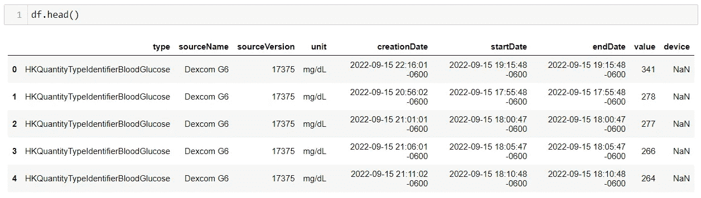

截图由 Ednalyn C. De Dios 提供

让我们解决这个问题！

```py
# shorter observation names
df['type'] = df['type'].str.replace('HKQuantityTypeIdentifier', '')
df['type'] = df['type'].str.replace('HKCategoryTypeIdentifier', '')
```

来看看：

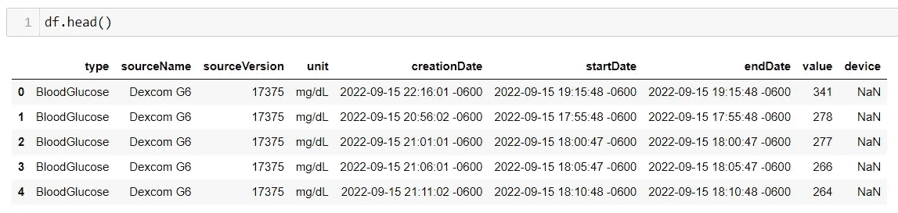

截图由 Ednalyn C. De Dios 提供

我们的数据框很大！

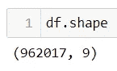

截图由 Ednalyn C. De Dios 提供

让我们搜索我们想要的内容。

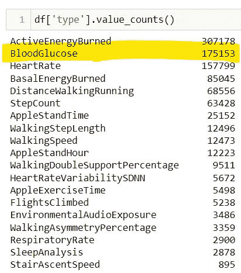

截图由 Ednalyn C. De Dios 提供

让我们进行筛选。

```py
df['type'].value_counts()
```

然后，通过仅保留必要的列和行，进一步缩减我们的数据框大小。

```py
df1 = df.loc[df['type'] == 'BloodGlucose']
df1 = df1[['startDate', 'value']]
```

很好！

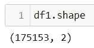

截图由 Ednalyn C. De Dios 提供

现在，让我们做一点清理。下面，我们将 startDate 列的数据类型更改为 datetime，并将值列强制为数字类型。最后，我们用 1 填充那些未必测量到任何值的记录的空白字段。

```py
df1["startDate"] = pd.to_datetime(df1["startDate"])

# value is numeric, NaN if fails
df1['value'] = pd.to_numeric(df1['value'], errors='coerce')

# some records do not measure anything, just count occurences
# filling with 1.0 (= one time) makes it easier to aggregate
df1['value'] = df1['value'].fillna(1.0)
```

最后，是时候将我们的数据框导出为 CSV 文件。我们将其命名为 “blood_glucose.csv”。

```py
df1.to_csv('blood_glucose.csv', index=False)
```

# 从 Dexcom G6 的 Apple Health 数据的准备

现在，让我们准备进行一些数据整理。

首先，为了清晰起见，让我们将 ‘startDate’ 重命名为 ‘timestamp’。然后，我们将从 timestamp 列中提取时间组件和属性。

```py
# rename date column
df2 = df1.rename(columns={'startDate':'timestamp'})

# extract time components from the timestamp column
df2['year'] = df2.timestamp.dt.year
df2['month'] = df2.timestamp.dt.month
df2['day'] = df2.timestamp.dt.day
df2['hour'] = df2.timestamp.dt.hour

# extract time attributes from the timestamp column
df2['day_of_year'] = df2.timestamp.dt.dayofyear
df2['week_of_year'] = df2.timestamp.dt.weekofyear
df2['day_of_week'] = df2.timestamp.dt.dayofweek
```

我们还将从星期几列中提取星期几特征，并根据小时列推导出一天中的时间段。

```py
# extract weekday characteristic from the day of the week column
df2['weekday'] = np.where(df2['day_of_week'] < 5, True, False)

# extract part of the day from the hour column
def get_day_period(x):
    if x in range(6,12):
        return 'Morning'
    elif x in range(12,18):
        return 'Afternoon'
    elif x in range(18,23):
        return 'Evening'
    else:
        return 'Late night'

df2['part_of_day'] = df2['hour'].apply(get_day_period)
```

接下来，我们将对记录的血糖水平进行分类，判断其是高、正常还是低。

```py
# extract blood glucose level from the value column
def get_status(row):
    if row['value'] < 70:
        val = "Low"
    elif row['value'] <= 180:
        val = "Normal"
    else:
        val = "High"
    return val

df2['status'] = df2.apply(get_status, axis=1)
```

查看值计数，我们可以看到状态类别之间存在巨大的不平衡。

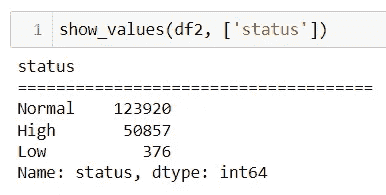

截图由 Ednalyn C. De Dios 提供

我决定放弃低状态，并创建另一列来指示读取值是否为高。

```py
# creates a new column and designates a row as either high or low
df2['high'] = np.where(df2['status'] != 'High', '0', '1').astype('int32')
```

现在，我们准备删除 timestamp 和 status 列，因为我们不再需要它们。

```py
df2 = df2.drop(columns=['status', 'timestamp'])
```

让我们现在看看我们的数据框。

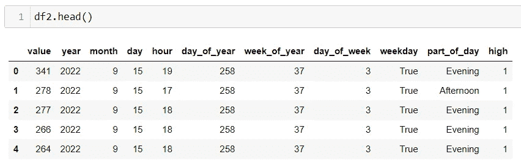

截图由 Ednalyn C. De Dios 提供

# Dexcom G6 的 Apple Health 数据的探索性数据分析

我们即将进行一些可视化，所以让我们设置图形大小和布局。

```py
plt.rcParams["figure.figsize"] = [10, 6]
plt.rcParams["figure.autolayout"] = True
```

在深入探讨之前，让我们检查一下我们正在处理的年份。让我们执行 value_counts()。

```py
show_values(df2, ['year'])
```

不过我们可以看到年份的顺序混乱，所以让我们手动创建一个正确的年份顺序列表。

```py
years = [2020, 2021, 2022, 2023]
```

接下来是令人兴奋的部分。让我们绘制一些小提琴图！下面我们定义一个函数，根据一天中的时间、血糖值以及是否为周末来创建一些小提琴图。以下是实现这一切的代码：

```py
def show_violin(df, year):
    ax = sns.violinplot(x="part_of_day",
                        y="value",
                        hue="weekday",
                        split=True,
                        data=df[df['year'] == year],
                        order=['Morning', 'Afternoon', 'Evening', 'Late night'])
    ax.set_title('Distribution of Blood Glucose Value per Part of the Day ' + str(year), fontsize=16)

    # Set label for x-axis
    plt.ylabel( "Blood Glucose" , size = 12 )
    plt.xlabel( "Part of the Day" , size = 12 )

    plt.legend(title='Weekday?', loc='upper right')
    plt.show()
```

以及用于根据年份创建单独的小提琴图的代码片段：

```py
for year in years:
    show_violin(df2, year)
```

结果是：

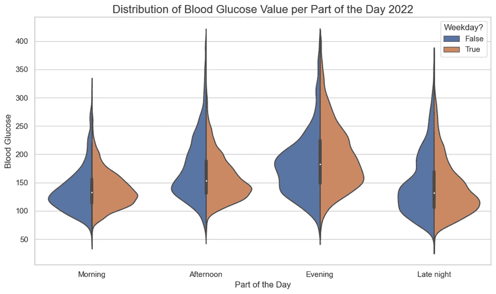

截图由 Ednalyn C. De Dios 提供

美丽！

但如果我们想将所有年份的数据进行比较呢？让我们再次做同样的事情，只是将图表叠加在一起，看看它们的效果。在代码中，这转化为在函数中省略 plt.show() 这一行。这是代码：

```py
def show_violin_no_legend(df, year):
    ax = sns.violinplot(x="part_of_day",
                        y="value",
                        hue="weekday",
                        split=True,
                        data=df[df['year'] == year],
                        order=['Morning', 'Afternoon', 'Evening', 'Late night'])
    ax.set_title('Distribution of Blood Glucose Value per Part of the Day Over the Years', fontsize=16)

    # Set label for x-axis
    plt.ylabel( "Blood Glucose" , size = 12 )
    plt.xlabel( "Part of the Day" , size = 12 )
    ax.get_legend().remove()
```

结果是：

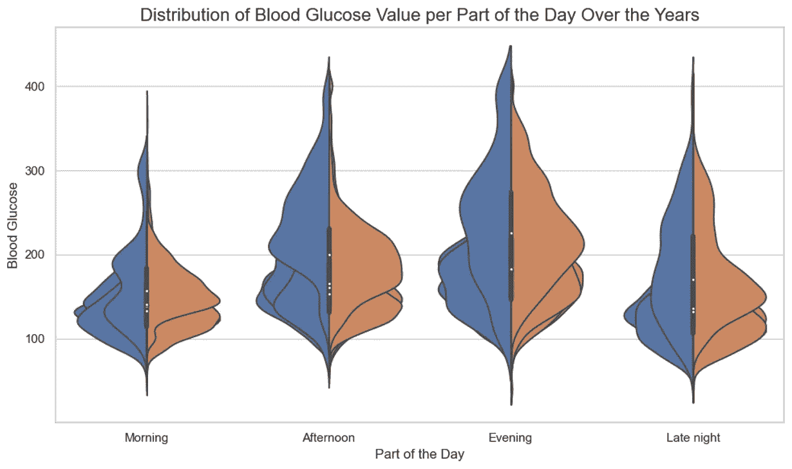

截图由 Ednalyn C. De Dios 提供

完美！

让我们为自己鼓掌。我们成功地将许多维度压缩到了一个漂亮的图表中！

探索性数据分析没有唯一正确的方法。因此，我们将跳过其余常见的分析方法（如分布、时间序列图等），直接进入建模阶段。

# 建模 — 逻辑回归

首先，让我们丢弃值列，因为我们将使用高列作为目标变量。

```py
df3 = df2.drop(columns=['value'])
```

由于我们将进行分类任务以预测读数是否会很高，所以让我们为我们的分类变量创建虚拟变量。

```py
categorical_vars = ['month', 'weekday', 'part_of_day']

for var in categorical_vars:
    cat_list='var'+'_'+var
    cat_list = pd.get_dummies(df3[var], prefix=var)
    dfx=df3.join(cat_list)
    df3=dfx

data_vars=df3.columns.values.tolist()
to_keep=[i for i in data_vars if i not in categorical_vars]

df4=df3[to_keep]
df4.columns.values
```

让我们检查一下数据框是否存在类别不平衡：

```py
show_values(df4, ['high'])
```

如上所示，高值的数量远远少于非高值。这可能会导致我们的模型不准确，因此我们将使用 SMOTE 来解决这个问题。SMOTE（合成少数类过采样技术）是一种用于解决数据集不平衡问题的机器学习技术，它通过在现有少数类数据点之间进行插值来创建合成的数据点。它通过随机选择一个少数类数据点并找到其 k 个最近邻来实现。然后随机选择这些邻居中的一个，并通过它们之间的插值创建一个新的数据点。

新的数据点是通过选择连接少数类数据点及其选择的邻居的线段上的一个随机点来创建的。这个过程会重复进行，直到少数类与多数类平衡为止。

结果是一个平衡的数据集，这使得机器学习算法可以更有效地进行训练。此外，通过创建合成的数据点，SMOTE 确保分类器不会偏向于多数类别，从而提高在少数类别上的表现。

这是从 Susan Li 的关于逻辑回归的文章中借用的 SMOTE 实现。[2]

```py
X = df4.loc[:, df4.columns != 'high']
y = df4.loc[:, df4.columns == 'high']

os = SMOTE(random_state=493)

X_train, X_test, y_train, y_test = train_test_split(X, y, test_size=0.3, random_state=493)

columns = X_train.columns
os_data_X,os_data_y=os.fit_resample(X_train, y_train)
os_data_X = pd.DataFrame(data=os_data_X,columns=columns )
os_data_y= pd.DataFrame(data=os_data_y,columns=['high'])

# we can check the numbers of our data
print("length of oversampled data is ",len(os_data_X))
print("Number of no subscription in oversampled data",len(os_data_y[os_data_y['high']==0]))
print("Number of subscription",len(os_data_y[os_data_y['high']==1]))
print("Proportion of no subscription data in oversampled data is ",len(os_data_y[os_data_y['high']==0])/len(os_data_X))
print("Proportion of subscription data in oversampled data is ",len(os_data_y[os_data_y['high']==1])/len(os_data_X))
```

接下来，我们将通过运用常识和直觉来进行特征选择，以决定使用哪些列来预测高血糖。

```py
cols=['hour',
 'month_1',
 'month_2',
 'month_3',
 'month_4',
 'month_5',
 'month_6',
 'month_7',
 'month_8',
 'month_9',
 'month_10',
 'month_11',
 'month_12',
 'weekday_False',
 'weekday_True',
 'part_of_day_Afternoon',
 'part_of_day_Evening',
 'part_of_day_Late night',
 'part_of_day_Morning']
```

然后，我们将把数据框分成自变量和因变量，即 X 和 y。

```py
X=os_data_X[cols]
y=os_data_y['high']
```

然后，我们将进行训练-测试-划分，并创建一个逻辑回归对象，接着用我们的数据进行拟合。

```py
X_train, X_test, y_train, y_test = train_test_split(X, y, test_size=0.3, random_state=493)

logreg = LogisticRegression(solver="liblinear")
logreg.fit(X_train, y_train)
```

终于，我们准备进行预测了！

```py
y_pred = logreg.predict(X_test)
print('Accuracy of logistic regression classifier on test set: {:.2f}'.format(logreg.score(X_test, y_test)))
```

我们还将添加混淆矩阵和其他指标来评估模型的表现。

```py
confusion_matrix = confusion_matrix(y_test, y_pred)
print(confusion_matrix)
```

结果是：

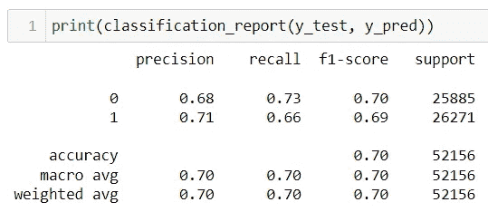

截图由 Ednalyn C. De Dios 提供

由于我们进行的是二分类，我们将检查 ROC（接收者操作特征）和 AUC（曲线下面积）。

ROC 曲线是一个图表，显示了二分类器的真实正例率（灵敏度）和假正例率（1 — 特异性）之间的权衡，随着分类阈值的变化。换句话说，它显示了分类器在不同置信水平下区分正例和负例的能力。

ROC 曲线是通过绘制真实正例率与假正例率的关系图创建的。AUC 是 ROC 曲线下的面积，范围从 0 到 1。AUC 为 1 表示分类器可以完美区分正例和负例，而 AUC 为 0.5 表示分类器的表现不比随机猜测好。

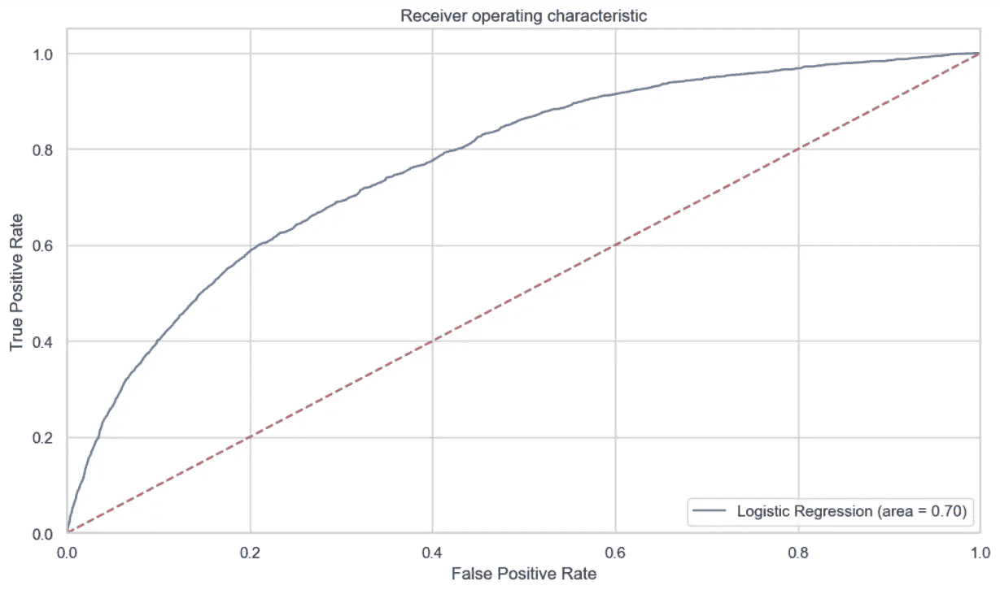

截图由 Ednalyn C. De Dios 提供

用通俗的话来说，ROC AUC 提供了一种衡量二分类器在正确区分正例和负例的能力的方法，无论使用什么阈值。高 AUC 分数表示分类器表现良好，而低分数表示表现较差。它是评估和比较不同分类器性能的有价值工具，尤其是在数据集不平衡或假正例和假负例的成本不同的情况下。

# 时间序列预测 — Prophet

在我们的最后一次尝试中，我们将使用 Prophet 进行时间序列预测。Prophet 是一个由 Facebook 开发的时间序列预测工具，旨在用户友好和灵活。在使用 Prophet 进行时间序列预测时，需要注意以下几点：

+   数据应该符合特定格式：Prophet 需要时间序列数据的特定格式，包含一个名为‘ds’的列用于日期/时间，一个名为‘y’的列用于要预测的值。

+   需要处理异常值：异常值可能会显著影响预测的准确性，因此必须识别和妥善处理这些异常值。

+   需要考虑季节性和趋势成分：Prophet 旨在捕捉时间序列数据中的季节性和趋势成分，因此如果数据中存在这些成分，必须将其包含在模型中。

+   应包括节假日和事件：Prophet 允许你包含可能影响时间序列数据的节假日和事件，如国家假日或营销活动。

+   可以包含多个时间序列：Prophet 可以处理具有不同季节性和趋势的多个时间序列，允许你同时建模和预测它们。

+   需要考虑预测的不确定性：Prophet 为其预测提供了不确定性区间，在根据预测做决策时需要考虑这些不确定性区间。

+   超参数需要调整：Prophet 具有多个可以调整的超参数，以提高预测的准确性，例如用于捕捉季节性的傅里叶项的数量。

总体而言，Prophet 可以成为一个强大的时间序列预测工具，但必须仔细考虑数据和模型设置，以确保准确和有用的预测。因此，我们将导入之前保存的 csv 文件，专注于我们的数据框架，避免所有的转换。

```py
df5 = pd.read_csv('blood_glucose.csv', parse_dates=True, infer_datetime_format=True)
```

接下来，我们将把列重命名为 ‘ds’ 和 ‘y’，因为 Prophet 需要这样的格式。

```py
df5 = df5.rename(columns={'startDate':'ds', 'value':'y'})
```

我们还将确保 ‘ds’ 列是 datetime 格式的。通过 tx_localize(None)，我们也在去除时间戳中的时区部分，因为 Prophet 不喜欢这样。

```py
df5["ds"] = pd.to_datetime(df5["ds"])
df5['ds'] = df5['ds'].dt.tz_localize(None)
```

然后，我们将重新采样我们的数据，以考虑每日读数的平均值。

```py
df6=df5.set_index('ds').resample('D').agg(y=('y', 'mean'))
df6 = df6.reset_index()
```

我们准备好了：

```py
model = Prophet()
model.fit(df6)
df6_forecast = model.make_future_dataframe(periods=12, freq='MS')
df6_forecast = model.predict(df6_forecast)
plt.figure(figsize=(18, 6))
model.plot(df5_forecast, xlabel = 'Timestamp', ylabel = 'Glucose')
plt.title('Blood Glucose')
```

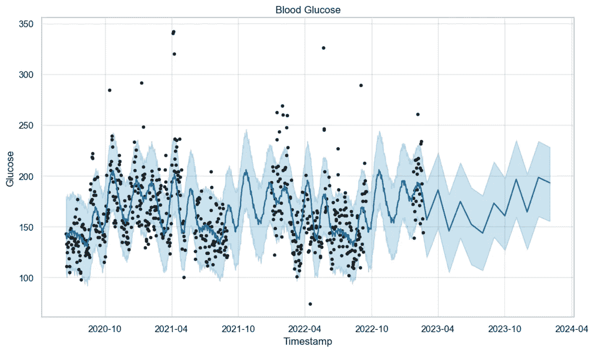

截图由 Ednalyn C. De Dios 提供

以及组件：

```py
model.plot_components(df6_forecast)
```

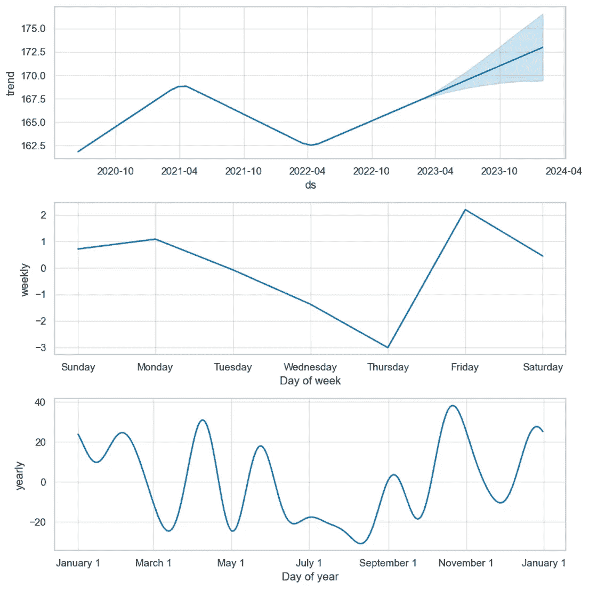

截图由 Ednalyn C. De Dios 提供

# 结论

我们已经从导入 Apple Health 数据，转换它以发现见解，预测高血糖，并预测血糖水平，走了很长一段路。

在这个过程中，我们学习了如何使用 datetime 对象，制作小提琴图，利用 SMOTE 平衡不平衡的数据集，使用逻辑回归进行分类，并使用 Prophet 进行预测。

接下来，我们将处理清洗过的数据，并使用 Power BI 创建一个仪表盘。

敬请关注！

感谢你的光临和阅读我的文章。希望这个逐步的讲解对你有所帮助！

*如果你想了解更多关于我从懒散者到数据科学家的旅程，请查看下面的文章：*

[](/from-slacker-to-data-scientist-b4f34aa10ea1?source=post_page-----be426bcff85e--------------------------------) ## 从懒散者到数据科学家

### 我没有学位的情况下进入数据科学的历程。

towardsdatascience.com

你可以通过 [Twitter](https://twitter.com/ecdedios) 或 [LinkedIn](https://www.linkedin.com/in/ednalyn-de-dios/) 联系我。

参考文献：

+   [1] [`www.python-engineer.com/posts/apple-health-data-python/`](https://www.python-engineer.com/posts/apple-health-data-python/)

+   [2] `towardsdatascience.com/building-a-logistic-regression-in-python-step-by-step-becd4d56c9c8`
