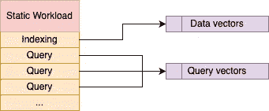
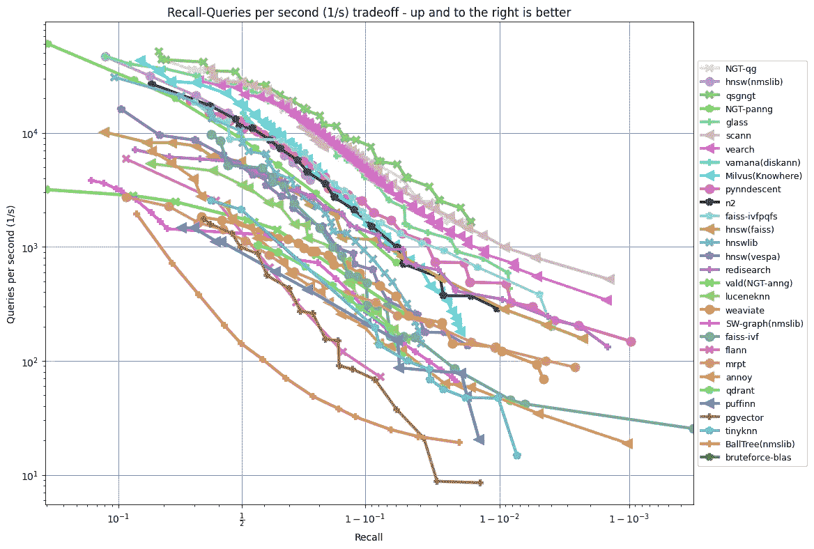
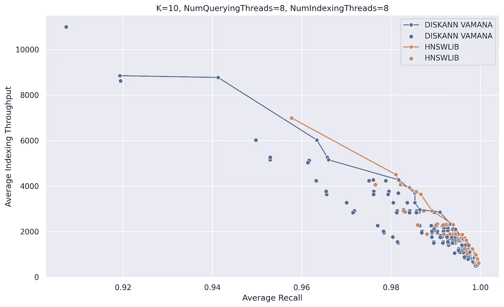
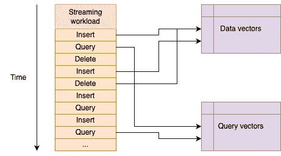
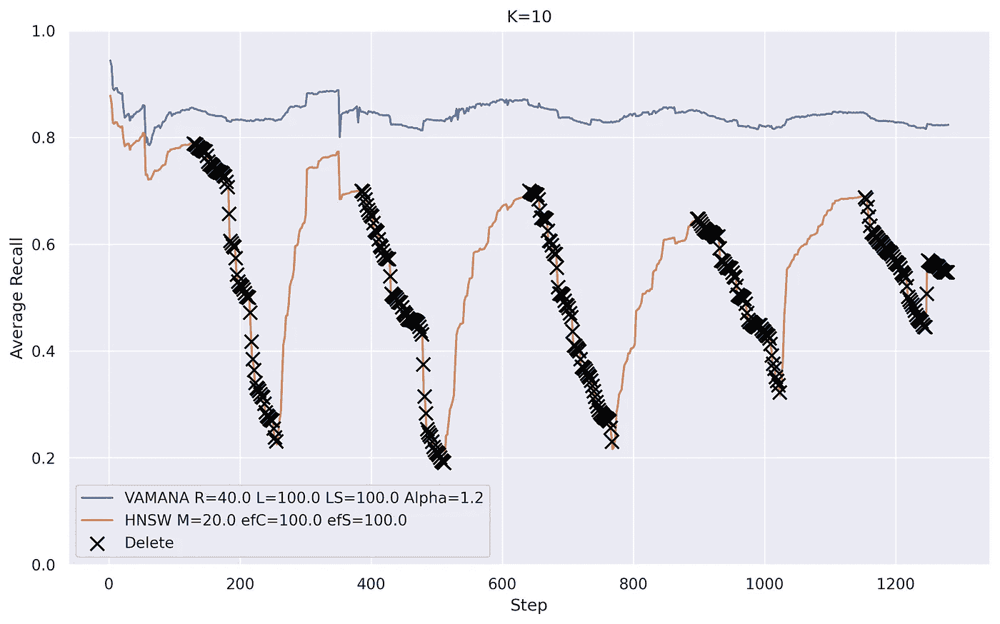
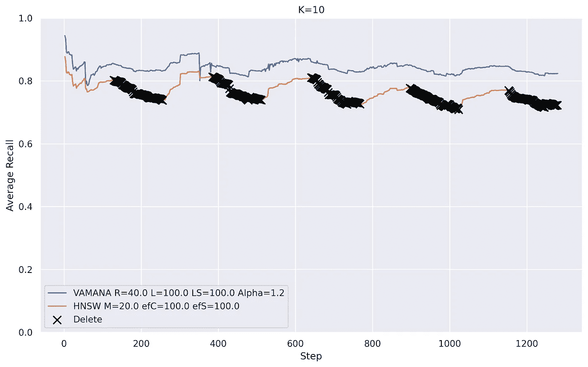
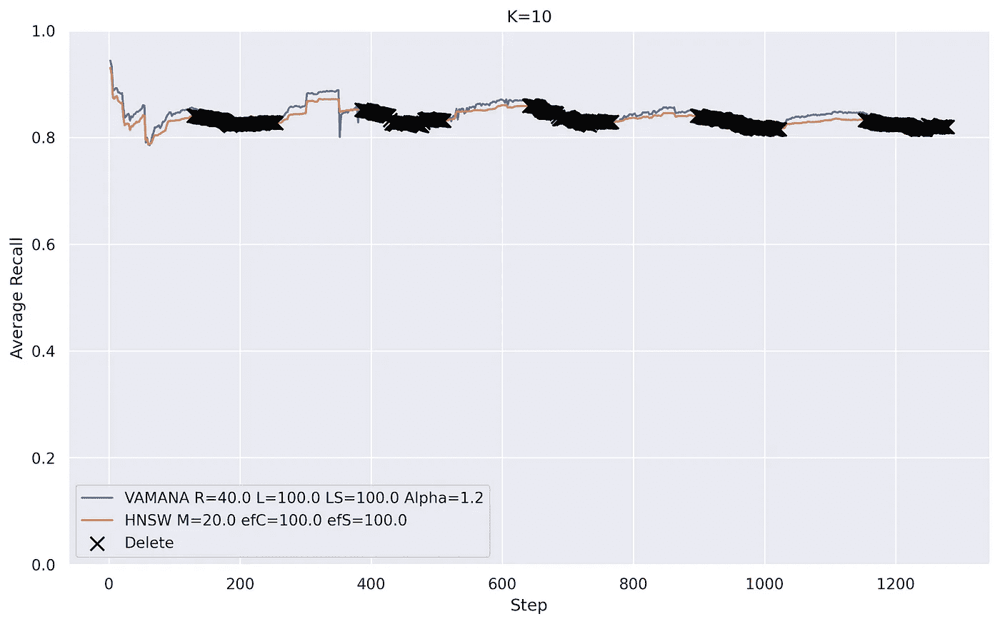

# 请使用流工作负载来评估向量数据库性能

> 原文：[`towardsdatascience.com/please-use-streaming-workload-to-benchmark-vector-databases-bb0154480263?source=collection_archive---------12-----------------------#2023-12-01`](https://towardsdatascience.com/please-use-streaming-workload-to-benchmark-vector-databases-bb0154480263?source=collection_archive---------12-----------------------#2023-12-01)

## 为何静态工作负载不足以满足需求，以及通过比较 HNSWLIB 和 DiskANN 使用流工作负载学到了什么

 [Eric Zhù](https://ekzhu.medium.com/?source=post_page-----bb0154480263--------------------------------)

·

[跟随](https://medium.com/m/signin?actionUrl=https%3A%2F%2Fmedium.com%2F_%2Fsubscribe%2Fuser%2F5b549f62ef70&operation=register&redirect=https%3A%2F%2Ftowardsdatascience.com%2Fplease-use-streaming-workload-to-benchmark-vector-databases-bb0154480263&user=Eric+Zh%C3%B9&userId=5b549f62ef70&source=post_page-5b549f62ef70----bb0154480263---------------------post_header-----------) 在 [Towards Data Science](https://towardsdatascience.com/?source=post_page-----bb0154480263--------------------------------) ·9 min 阅读·Dec 1, 2023

--

图片由 DALLE-3 提供

向量数据库是为了高维向量检索而构建的。如今，许多向量是由深度神经网络生成的*嵌入*，如[GPTs](https://platform.openai.com/docs/models/embeddings)和[CLIP](https://openai.com/research/clip)，用于表示数据点，如文本片段、图像或音频轨道。嵌入被用于许多应用，如搜索引擎、推荐系统和聊天机器人。你可以在向量数据库中索引嵌入，数据库使用*近似最近邻（ANN）索引*，通过如余弦或欧几里得等距离函数支持快速检索最邻近的对象。对于 100 万向量的索引，延迟为 2 到 10 毫秒，并且随着索引大小呈亚线性扩展（即*O(log n)*)。

在这篇文章中，我指出了我们当前评估 ANN 索引方式的几个问题，并建议了一种新的评估类型。本文重点关注嵌入向量的 ANN 索引，这是一个最近受到广泛关注的领域：像[Pinecone](https://www.pinecone.io/)、[Zilliz](https://zilliz.com/)、[Qdrant](https://qdrant.tech/)和[Weaviate](https://weaviate.io/)这样的向量数据库初创公司提供嵌入索引和检索作为其核心服务。

# 1\. 静态负载基准测试是不够的。

评估 ANN 索引的标准方法是使用*静态负载基准测试*，它由固定数据集和固定查询集组成。

静态负载基准测试。图片来源于作者。

静态负载基准测试首先从固定数据集中构建 ANN 索引，然后以不同参数设置多次运行固定查询集，并在每个最小准确度水平下测量可达到的最高查询吞吐量。对每个 ANN 索引执行相同的程序后，基准测试会生成如下图所示的图表：

图源自[ANN Benchmarks (11/25/2023)](https://github.com/erikbern/ann-benchmarks/tree/b8cdbdf29238e14e70c90074f1247ef0dcfdd7f2)。[MIT 许可。](https://github.com/erikbern/ann-benchmarks/blob/main/LICENSE)

上图比较了使用静态负载名为 glove-100-angular 的不同 ANN 索引，该负载包含词语的嵌入。

这种评估方法由[ann-benchmarks](https://github.com/erikbern/ann-benchmarks)项目推广，该项目始于 5 年前。许多向量数据库现在在其技术博客中使用这种方法来测量其性能。请参见[Qdrant 基准](https://qdrant.tech/benchmarks/)和[Timescale 基准](https://www.timescale.com/blog/how-we-made-postgresql-the-best-vector-database/)。

静态负载基准测试是有用的，因为结果易于理解，并允许我们通过相同的图表比较不同索引算法之间的准确度和查询性能权衡。

除非这是对 ANN 索引的完整评估，否则你**不应**仅仅根据这一点选择 ANN 索引。它过分强调了召回准确性和查询性能，而忽略了其他重要方面，如索引性能和内存使用。

## 索引性能应当被反映出来。

索引吞吐量衡量了 ANN 索引接受新数据点的速度。与查询吞吐量类似，它通常与召回准确性呈反比。例如，下面的图展示了 HNSWLIB 和 DiskANN Vamana 索引的索引吞吐量与召回之间的关系。

HNSWLIB 和 DiskANN Vamana 在 OpenAI 1M 上的召回率与索引吞吐量。图片由作者提供。

这张图与之前的 Recall-QPS 图类似，但从这张图中你可以看到更高的召回率也是索引性能的权衡。如果我对索引和查询性能都感兴趣，这张图仍然不够充分，因为它没有显示出召回性能权衡的边界，因为静态基准测试将索引和查询负载分开。

许多 ANN 索引支持批量索引 API，这比逐点索引（即，一次添加一个向量）优化得多，并且可以创建更准确的索引。例如，基于簇的 ANN 索引在批量中构建所有向量的簇。静态工作负载基准将索引和查询负载分开，因此它鼓励批量索引，这可能不切实际。

另一个与索引相关的问题是产品量化（PQ）。许多 ANN 索引使用 PQ 或其他形式的向量压缩来加速计算。静态工作负载基准允许 ANN 索引在查询阶段开始之前构建优化的压缩代码本，但这样的最佳代码本在实践中可能无法实现。

## 内存使用很重要。

大多数流行的 ANN 索引都是内存中的，这意味着它们的主要数据结构保持在易失性存储（DRAM）中以供查询。因此，衡量内存效率及其与性能和召回准确性的权衡是很重要的。例如，在[这篇研究论文](https://www.microsoft.com/en-us/research/publication/hm-ann-efficient-billion-point-nearest-neighbor-search-on-heterogeneous-memory/)中，作者测量了 HNSW 在 10 亿点下的内存使用为 490 GB，而[NSG](https://github.com/ZJULearning/nsg)为 303 GB，但在召回和查询性能方面，HNSW 仅略微优于 NSG。进行 ANN 索引基准测试时，这种权衡应当被重点考虑。

然而，仅用静态基准很难获得内存效率的现实图景，原因有几个。首先，ANN 索引算法可以创建一个读取优化的索引，这样虽然索引很紧凑，但会影响随后的索引性能。其次，工作负载只捕捉纯粹的索引或纯粹的查询，而不是两者的混合，这在实际场景中，如问答引擎或聊天机器人，数据不断到达时更为常见。

## 数据分布随时间变化。

在静态基准中，数据和查询集保持不变。这并不现实，因为数据和查询是由最终用户的兴趣驱动的，而这些兴趣会随着时间变化。如果数据和查询集始终固定，那么最佳的索引就是一个记住每个查询结果的缓存。最近，ANN 索引的研究（例如，[FreshDiskANN](https://arxiv.org/abs/2105.09613)）开始测量分布外查询性能——这是一个正确的进步。

## 删除的情况如何？

删除 API 已经成为 ANN 索引的标准，但没有静态基准在测量这一点。能够处理删除是重要的，因为新兴的 AI 相关应用场景如聊天机器人将 ANN 索引作为类似于在线事务处理（OLTP）数据库的操作存储，因为数据不断被添加和修改。

# 2\. 流式工作负载提供了更多信息。

如果一个 ANN 索引支持以下 API：

+   插入(ID, vector)

+   查询(vector)

+   删除(ID)

如果使用场景不仅仅是静态数据和查询（比如，所有场景？），那么流式工作负载基准可以让你更深入地了解 ANN 索引的特性以及它们在特定使用场景中的表现。

流式工作负载基准包括两个流：一个数据流，对应一系列的插入和删除 API 调用；另一个查询流，对应一系列的查询 API 调用。它可以通过实际的流式系统如 Kafka 实现，或者更简单地使用运行手册，其中包含指向数据集和查询集的序列，类似于静态基准中使用的那些。

使用运行手册的简单流式工作负载基准。图片由作者提供。

上面的图示展示了[NeurIPS 23' 大型 ANN 基准](https://big-ann-benchmarks.com/)中使用的流式工作负载基准。具体来说，运行手册中的每一步对应一批向量，因此操作可以并行执行。这种方法具有以下优点：

1.  **灵活性：** 工作负载模式和数据分布变化可以被建模为不同的流式工作负载，然后编译成不同的运行手册。

1.  **现实性：** 索引和查询交替进行，因此 ANN 索引必须适应未来的插入。此外，内存配置更准确地反映了实际工作负载。

1.  **简单分析：** 性能可以通过整体吞吐量来描述，而不是索引与查询吞吐量，因此可以轻松地可视化召回率与性能之间的权衡。

1.  **完整性：** 插入和删除操作也进行了评估。

在这篇博客文章中，我深入探讨了上述（4）点，并展示了我通过流式工作负载基准测试发现的新见解。

## 比较召回稳定性：HNSW 与 Vamana

在运行流式工作负载基准测试时，我们收集的一个重要指标是每个查询操作的召回率。我们可以通过查看不同索引设置（参数、算法等）的召回稳定性随时间的变化来进行比较，并决定哪个索引适用于特定的使用场景。

我测量了[DiskANN](https://github.com/microsoft/DiskANN)的 Vamana 和各种 HNSW 实现的召回稳定性，测试是在[NeurIPS 23' Big ANN Benchmarks](http://big-ann-benchmarks.com/neurips23.html)中定义的流式工作负载下进行的。

关于 Vamana 和 HNSW 的一些背景：它们都是图形 ANN 索引，并且特别擅长处理嵌入。在图形 ANN 索引中，每个向量是一个节点，查询作为图形遍历执行。有向边被选择性地构造，以限制内存使用，同时保证从任何节点到任何节点的快速遍历。在原地删除期间，对于每个即将到来的邻居节点，图形 ANN 索引执行边修复以维护有向图结构。

我们使用的第一个 HNSW 实现是基于[HNSWLIB](https://github.com/nmslib/hnswlib)的，增加了使用名为`[repairConnectionsForUpdate](https://github.com/nmslib/hnswlib/blob/359b2ba87358224963986f709e593d799064ace6/hnswlib/hnswalg.h#L987)`的修复算法实现的删除 API，该算法已是 HNSWLIB 源代码的一部分。其思想是对需要修复的节点执行“重新插入”，并在所有层级上更新其出度邻居。下图展示了 Vamana 和 HNSW 的召回率随时间的变化。

DiskANN 的 Vamana 与基于 HNSWLIB 的 HNSW 实现的召回稳定性。删除 API 调用标记为“X”。图片由作者提供。

请注意，我将 Vamana 的最大度参数设置为 40（`R = 40`），将 HNSW 的基础层最大度也设置为 40（`M = 20, M0 = 40`）。因此，它们应使用大致相同的内存。

从该图中可以明显看出，删除对召回率有不利影响，因为召回率在连续删除过程中单调下降。相比之下，HNSW 受删除的影响远大于 Vamana。

我们使用的第二个 HNSW 实现将 HNSWLIB 的边修复算法替换为 Vamana 的，这两者差别很大。Vamana 的边修复算法的思想是将每个被删除节点的入邻居连接到被删除节点的出邻居，同时应用修剪步骤以保持最大度约束。在这种情况下，我们使用 HNSW 原始的修剪算法。它由 HNSWLIB 在一个名为`[getNeighborsByHeuristic2](https://github.com/nmslib/hnswlib/blob/359b2ba87358224963986f709e593d799064ace6/hnswlib/hnswalg.h#L382C16-L382C16)`的函数中实现。

回顾 DiskANN 的 Vamana 和一个使用 Vamana 边修复算法处理删除的 HNSW 实现。图片由作者提供。

在所有参数保持不变的情况下，将 HNSWLIB 的边修复算法更改为 Vamana 的，HNSW 的召回稳定性立即得到了改善。

让我们多做一点工作，将 HNSW 的边修剪算法改为 Vamana 的。现在 HNSW 索引与 Vamana 的几乎相同，唯一的不同是它有多个层级。我们称这个索引为“多层 Vamana”。

回顾 DiskANN 的 Vamana 和一个使用 Vamana 边修复和修剪算法的 HNSW 实现——“多层 Vamana”。图片由作者提供。

你可以看到 HNSW 的召回率现在略高于 Vamana 的，同时使用了类似的内存。我还没有在任何研究论文中发现这一观察结果。此外，虽然图中没有性能数据，但我注意到在切换到 Vamana 的修剪算法时性能显著下降。

总之，通过使用流式工作负载基准测试，我能够发现有关不同边修复和修剪算法的新信息。一个合乎逻辑的下一步是研究这些算法的性能影响，我可以通过流式工作负载基准测试来实现这一点。

# 3\. 结论

总结一下，在这篇博客文章中，我指出了静态工作负载基准测试不足以真实评估 ANN 索引，并描述了我认为更好的替代方案——流式工作负载基准测试。我还使用了一个特定的流式工作负载来揭示 HNSW 和 Vamana 索引之间的新对比。感谢[NeurIPS 23' Big ANN Benchmarks](http://big-ann-benchmarks.com/neurips21.html)团队！他们已经开源了我在这篇博客文章中使用的流式工作负载。

## 我们需要一个用于向量数据库的 TPC-C 和 TPC-H。

在基准测试方面仍有很多工作要做。ANN 索引是向量数据库的核心特征，它们已经筹集了[超过 3.5 亿美元](https://www.cbinsights.com/research/generative-ai-infrastructure-vector-database/)。然而，其中许多仍在使用一种过时的方法来衡量性能，这种方法已经不能反映实际使用场景。数据库系统在 90 年代和 2000 年代初经历了类似的阶段。随后，像 TPC-C 和 TPC-H 这样的标准基准被开发出来，并且至今仍在使用。我们应该为向量数据库也制定类似的标准。
