# 在框架之外绘制 — 使用 Python 替代矩形图表的 8 种圆形图表

> 原文：[`towardsdatascience.com/plot-outside-the-box-8-alternative-circle-charts-with-python-to-replace-rectangular-charts-36732a98364a`](https://towardsdatascience.com/plot-outside-the-box-8-alternative-circle-charts-with-python-to-replace-rectangular-charts-36732a98364a)

## 使用 Python 绘制圆形图表

[](https://medium.com/@borih.k?source=post_page-----36732a98364a--------------------------------)[](https://towardsdatascience.com/?source=post_page-----36732a98364a--------------------------------) [Boriharn K](https://medium.com/@borih.k?source=post_page-----36732a98364a--------------------------------)

·发表于 [Towards Data Science](https://towardsdatascience.com/?source=post_page-----36732a98364a--------------------------------) ·阅读时间 9 分钟·2023 年 4 月 11 日

--


图片由 [Daniel Roe](https://unsplash.com/@danielroe) 提供，来自 [Unsplash](https://unsplash.com/?utm_source=medium&utm_medium=referral)

在矩形区域内绘制图表，如典型的条形图，是数据可视化中的常见做法。使用这些图表的优点是可以最大限度地利用空间。

顺便提一下，将过多的矩形图表紧密放置在一起，比如创建仪表盘，可能会使结果显得不美观或过于密集。

由于矩形图表并不是唯一的选择，一些圆形替代方案可以取而代之。使用不同的图表样式可能会产生美观的效果。

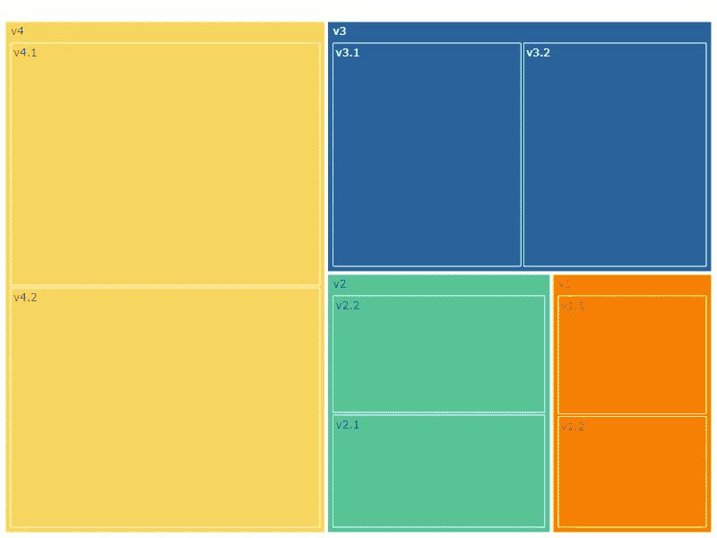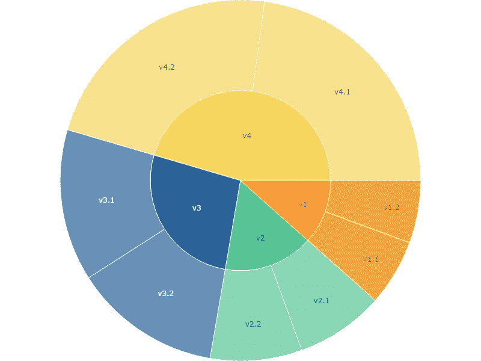

一个可以作为矩形图表替代方案的圆形图表示例。图片来源于作者。

在继续之前，我想澄清一下，这篇文章并不反对使用矩形图表。主要目的是呈现一些想法。这样，读者可以决定哪些最适合他们的用途。

开始吧。

# 替代图表

在这篇文章中，将介绍三种类型的矩形图表及其八种替代方案：

## **1. 堆积条形图的替代方案。**

+   #1 比例面积（又称嵌套形状）

+   #2 饼图

+   #3 圆环图

## **2. 树图的替代方案。**

+   #4 日晕图（又称径向树图）

## **3. 条形图的替代方案。**

+   #5 圆形条形图（又称赛车赛道图）

+   #6 径向条形图

+   #7 雷达图

+   #8 圆形打包图

# **1. 堆积条形图的替代方案。**

首个矩形图表是堆积条形图。这个图表对于表达相对于总量的比例贡献很有用。首先，我们将创建一个简单的堆积条形图。然后将解释替代选项。

使用 [numpy.random](https://numpy.org/doc/1.16/reference/routines.random.html) 创建一个模拟数据集。如果你已经有其他数据集可以尝试，可以跳到可视化部分。

```py
import numpy as np
import pandas as pd
import matplotlib.pyplot as plt
import seaborn as sns

%matplotlib inline

np.random.seed(42)
v1 = np.random.randint(5,45,50)
v2 = np.random.randint(10,60,50)
v3 = np.random.randint(30,80,50)
v4 = np.random.randint(90,100,50)

df = pd.DataFrame(zip(v1,v2,v3,v4),
                  columns=['v1','v2','v3','v4'])
df = df.melt()
df.head()
```

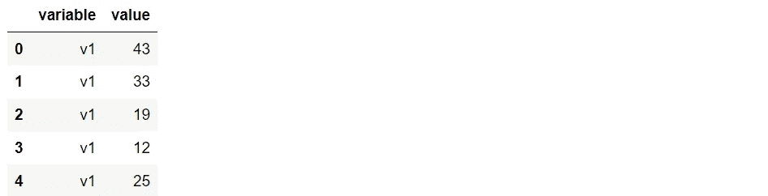

创建一个颜色列表和字典以供后续使用。以下代码中的颜色可以修改。

```py
v_list = ['v1', 'v2', 'v3', 'v4']
c_code = ['#F77F00','#56C596','#2A639B','#F6D55C']
dict_color = dict(zip(v_list,c_code))
```

下一步是按 DataFrame 分组，计算百分比列，并添加颜色列。

```py
df_gb = df.groupby(by='variable').sum().reset_index()
df_gb['pct']= [round(i,1) for i in df_gb['value']*100/df_gb['value'].sum()]
df_gb['color']= c_code
df_gb
```

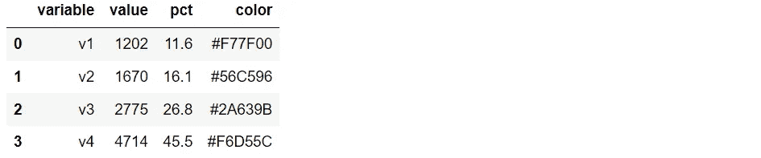

绘制堆积条形图，以便后续与其他选项进行比较。

```py
groups = ['V']
v1 = [df_gb.pct[0]]
v2 = [df_gb.pct[1]]
v3 = [df_gb.pct[2]]
v4 = [df_gb.pct[3]]
values = np.array([v1, v2, v3, v4])

sns.set_style('darkgrid')
fig, ax = plt.subplots(figsize=(1,6))

for i,c in zip(range(values.shape[0]), df_gb.color):
    ax.bar(groups,values[i], bottom=np.sum(values[:i], axis=0), color=c)
plt.show()
```


堆积条形图。图像由作者提供。

# #1 比例面积（也称为嵌套形状）

如前所述，堆积条形图的概念是展示比例贡献。因此，我们可以使用比例面积来展示相对于总量的贡献，应用相同的观点。

```py
fig, ax = plt.subplots(figsize=(8,8))
ax.scatter(0, 0)
cir = plt.Circle((0, 0), 1, color='lightgray', fill=True)
ax.add_patch(cir)

df_gb.sort_values(by=['pct'], ascending=False, inplace=True)

for i,c,l in zip(df_gb.pct,df_gb.color,df_gb.variable):
    data = np.array(i)
    r = np.sqrt(data/100)
    cir_p = plt.Circle((0, r-1), r, color=c, fill=True)
    ax.add_patch(cir_p)
    ax.axis('off')
    kw = dict(color="white", va="center", ha="center")
    kw.update(dict(fontsize=19))
    ax.text(0, (2*r)-1.08, l+' '+str(i)+'%', **kw)
    ax.set_aspect('equal')

plt.xlim([-1, 1])
plt.xlim([-1, 1])
plt.show()
```

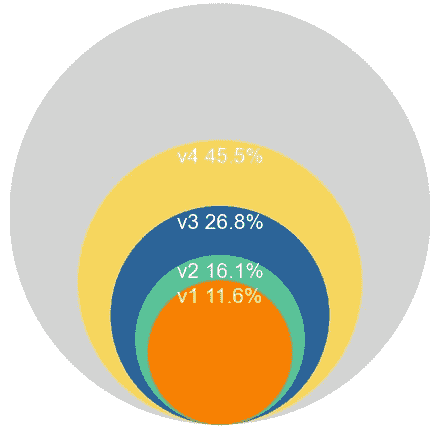

作为堆积条形图的替代选项的比例面积。图像由作者提供。

一个缺点是，这种替代方案比堆积条形图需要更多的空间。如果绘图区域很重要，这是一个限制。另一个需要考虑的是将条形图替换为 x 轴上的时间线。使用多个嵌套形状不方便显示随时间变化的情况。

结果可以单独表达并结合为一个照片拼贴，这是制作信息图的一个别致的想法。

```py
for i,c,l in zip(df_gb.pct,df_gb.color,df_gb.variable):
    data = np.array(i)
    r = np.sqrt(data/100)

    fig, ax = plt.subplots(figsize=(8,8))
    ax.scatter(0, 0)
    cir = plt.Circle((0, 0), 1, color='lightgray', fill=True)
    cir_p = plt.Circle((0, r-1), r, color=c, fill=True)
    ax.add_patch(cir)
    ax.add_patch(cir_p)
    ax.axis('off')
    kw = dict(color="white", va="center", ha="center")
    kw.update(dict(fontsize=32))
    ax.text(0, r-1, l+'\n'+str(i)+'%', **kw)
    ax.set_aspect('equal')

    plt.xlim([-1, 1])
    plt.xlim([-1, 1])
    plt.show()
```

哇！！

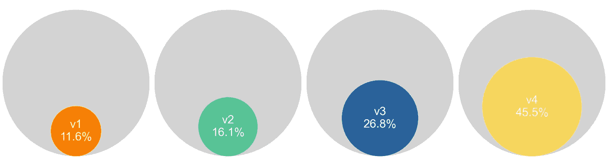

作为堆积条形图的替代选项的分离比例面积。图像由作者提供。

如果你想创建一个照片拼贴，你可以查看我的文章：'9 个用 Python 制作的比条形图更引人注目的可视化 (link)。'

## #2 饼图

饼图是展示数据组成百分比的简单选项。使用饼图作为替代方案有与比例面积相同的缺点，即需要更多的空间。因此，如果绘图区域不重要，这个选项很简单易创建。

```py
import plotly.express as px
fig = px.pie(df_gb, values='value', names='variable',
             color='variable', color_discrete_map=dict_color)
fig.update_layout(width=600, height=600, margin=dict(l=0, r=0, b=0, t=0))
fig.show()
```

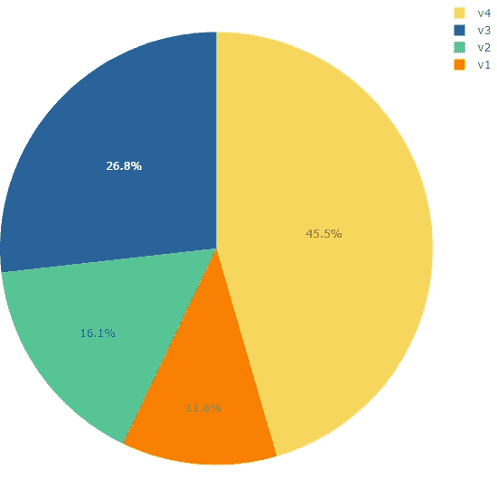

作为堆积条形图替代选项的饼图。图像由作者提供。

## #3 圆环图

基本上，圆环图是一个带有空洞的饼图。这个中心的空白似乎有一些好处，因为一些来源声称它有助于读者的视线集中在弧形上，并促进叙述。此外，它还可以用于添加一些注释或信息。

```py
import plotly.express as px
fig = px.pie(df_gb, values='value', names='variable',
             color='variable', color_discrete_map=dict_color,
             hole=0.6)
fig.update_layout(width=600, height=600, margin=dict(l=0, r=0, b=0, t=0))
fig.show()
```

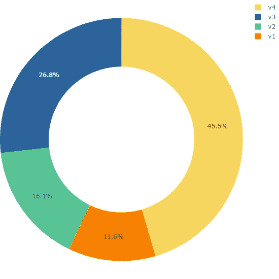

作为堆积条形图替代选项的圆环图。图像由作者提供。

# 2\. 替代树图的选项。

从技术上讲，treemap 是一种有效展示层级数据的方法。它通过一组嵌套矩形表达数据。treemap 图使用了全部绘图区域。如果你需要一些空白空间，这可能不是一个好选择。

为了展示 treemap，我将通过向每个变量添加子组来修改数据集。下面的代码展示了如何添加子组列并绘制图表。之后，我们将看到 treemap 的替代方案。

```py
df['sub']=[i+'.1' if j%2 else i+'.2' for i,j in zip(df.variable, df.value)]
df_wsub=df.groupby(by=['variable','sub']).mean().reset_index()
df_wsub
```

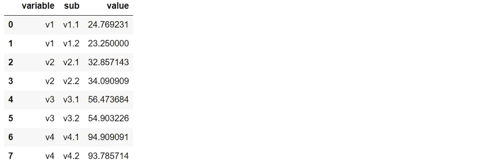

```py
import plotly.express as px
fig = px.treemap(df_wsub, path=['variable', 'sub'], values='value',
                 color='variable',color_discrete_map=dict_color)
#fig.update_traces(root_color="lightgrey")
fig.update_layout(width=800, height=600, margin=dict(l=0, r=0, b=0, t=0))
fig.show()
```

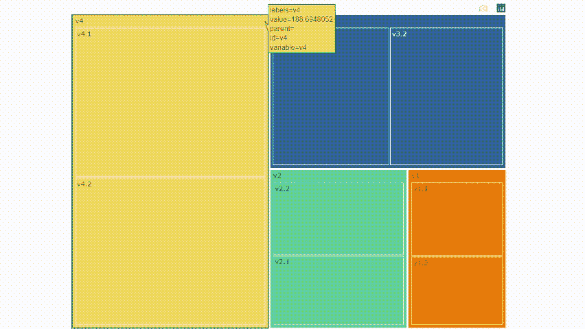

treemap 图。图片来自作者。

## #4 Sunburst 图（也称为径向 treemap）

treemap 的完美替代品是 sunburst 图。该图也称为径向 treemap，因为它实际上是一个圆形区域的 treemap。我们可以使用 [Plotly](https://plotly.com/python/sunburst-charts/) 和几行代码创建 sunburst 图，如下所示。

```py
import plotly.express as px
fig = px.sunburst(df_wsub, path=['variable', 'sub'], values='value',
                  color='variable',color_discrete_map=dict_color)
fig.update_layout(width=800, height=600, margin=dict(l=0, r=0, b=0, t=0))
fig.show()
```

哒哒！！

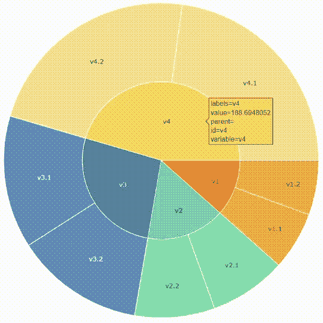

Sunburst 图作为 treemap 图的替代方案。图片来自作者。

与 treemap 相比，你可以看到这个图表在圆圈周围有更多的空白空间。

# 3\. 条形图的替代方案。

尽管条形图是一种常用的标准图表，但绘制过多的条形图会使结果变得枯燥。通过改变视角，矩形条形图可以用一些等效的形式替代。

作为示例，我将制作一个模拟数据集并使用它绘制一个简单的条形图。之后，我们将讨论一些替代方案。

```py
np.random.seed(42)
v1 = np.random.randint(5,50,50)
v2 = np.random.randint(5,50,50)
v3 = np.random.randint(20,60,50)
v4 = np.random.randint(20,60,50)
v5 = np.random.randint(90,100,50)
v6 = np.random.randint(10,50,50)
v7 = np.random.randint(10,50,50)
v8 = np.random.randint(25,60,50)
v9 = np.random.randint(25,60,50)

df = pd.DataFrame(zip(v1,v2,v3,v4,v5,v6,v7,v8,v9),
                  columns=['v1','v2','v3','v4','v5','v6','v7','v8','v9'])
df = df.melt()

#extract color palette
pal = list(sns.color_palette(palette='Spectral', n_colors=9).as_hex())

df_gb = df.groupby(by='variable').sum().reset_index()
df_gb['pct']= [round(i,1) for i in df_gb['value']*100/df_gb['value'].sum()]
df_gb['color']= pal
df_gb
```

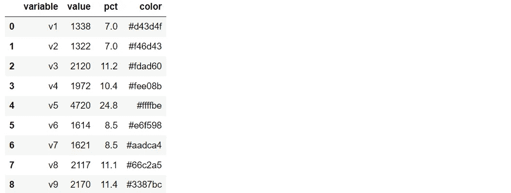

绘制条形图。

```py
sns.set_style('darkgrid')
plt.figure(figsize=(9,5))
plt.bar(x=df_gb.variable, height=df_gb.pct,color=df_gb.color)
plt.show()
```

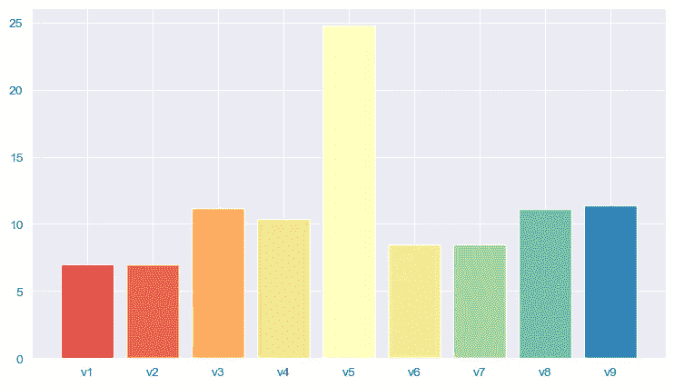

条形图。图片来自作者。

## #5 循环条形图（也称为赛道图）

第一个替代方案是修改条形图的方向，使其围绕中心循环。阅读图表时，条形图似乎在竞赛完成圆圈。因此，这可以产生引人注目的效果。

请注意，循环条形图存在条形图比例不均的缺点。即使它们具有相同的值，靠近中心的条形图总是比外面的短。

可以通过标记每个条形图来处理问题，以向用户显示实际值。

```py
import math
plt.gcf().set_size_inches(8,8)
sns.set_style('darkgrid')

#set max value
max_val = 26
ax = plt.subplot(projection='polar')

for i,p,l in zip(range(len(df_gb)),pal,df_gb.variable):
    ax.barh(i, df_gb['pct'][i]*2*np.pi/max_val, label=l, color=p)

#set the subplot 
ax.set_theta_zero_location('N')
ax.set_theta_direction(1)
ax.set_rlabel_position(0)
ax.set_thetagrids([], labels=[])

labels = [i+' '+str(j)+'%' for i,j in zip(df_gb.variable, df_gb.pct)]
ax.set_rgrids(range(len(df_gb)), labels= labels)

#set the projection
ax = plt.subplot(projection='polar')
plt.legend().set_visible(False)
plt.show()
```

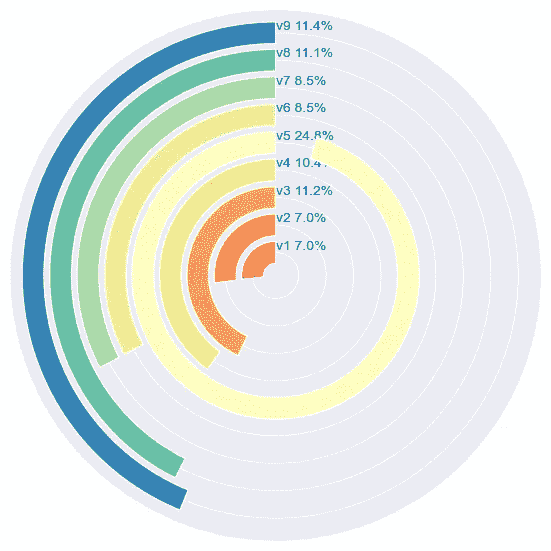

循环条形图作为条形图的替代方案。图片来自作者。

## #6 径向条形图

除了循环，条形图还可以通过从中心向外移动来表达。与循环条形图相比，这种图没有每个条形图比例的问题。这是使结果看起来更吸引人的另一种方法。

顺便说一下，不在彼此旁边的条形图难以比较。问题也可以通过标记来解决，以方便比较。

```py
plt.figure(figsize=(8,8))
ax = plt.subplot(111, polar=True)
plt.axis()

#set min and max value
ax.axis(ymin=0, ymax=25)

#set heights and width
heights = df_gb['pct']
width = 2*np.pi / len(df_gb)
#set index and angle
indexes = list(range(1, len(df_gb)+1))
angles = [element * width for element in indexes]
bars = ax.bar(x=angles, height=heights, width=width, bottom=0,
              linewidth=1, edgecolor="white", color=pal)
labelPadding = 2

labels = [i+' '+str(j)+'%' for i,j in zip(df_gb.variable, df_gb.pct)]
for bar, angle, height, label in zip(bars, angles, heights, labels):
    rotation = np.rad2deg(angle)
    alignment = ""
    #deal with alignment
    if angle >= np.pi/2 and angle < 3*np.pi/2:
        alignment = "right"
        rotation = rotation + 180
    else: 
        alignment = "left"

    ax.text(x=angle, y=0 + bar.get_height() + labelPadding,
            s=label, ha=alignment, va='center', rotation=rotation, 
            rotation_mode="anchor")

    ax.set_thetagrids([], labels=[])

plt.show()
```

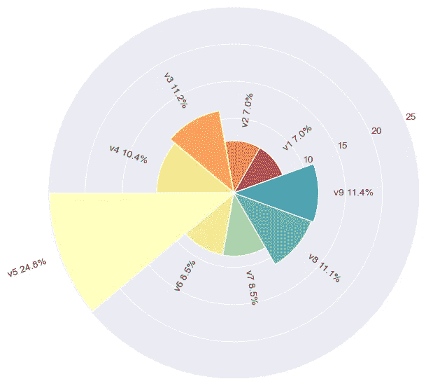

径向条形图作为条形图的替代方案。图片来自作者。

## #7 雷达图

在这种情况下，使用雷达图可能是一个奇怪的想法，因为这个图表通常用于处理[多变量数据](https://en.wikipedia.org/wiki/Multivariate_statistics)。然而，通过改变视角，雷达图可以作为一种替代方式，用于显示分类数据及其在轴上的值。

```py
import plotly.express as px
import pandas as pd
fig = px.line_polar(df_gb, r='pct', theta='variable',
                    line_close=True, color_discrete_sequence=[c_code[1]])
fig.update_polars(radialaxis_range=[0,25])
fig.update_layout(width=600, height=600, margin=dict(l=10,r=10,b=10,t=20))
fig.update_traces(fill='toself')
fig.show()
```

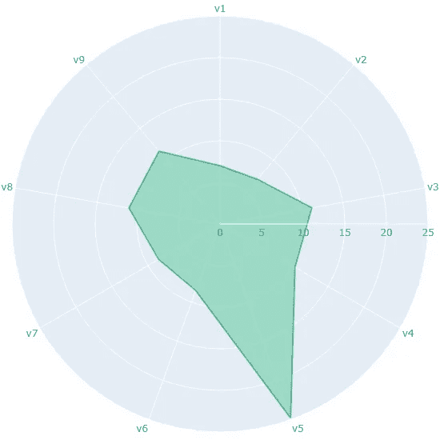

作为条形图替代的雷达图。图片由作者提供。

从技术上讲，雷达图和径向条形图返回的是相同的概念结果。雷达图用线条来比较值，而不是在中心周围显示条形。

## #8 圆形打包

最后，我们可以将矩形条形图转换为多个圆圈，并将它们组合成一个圆形打包。这是另一种创建信息图表的想法。

请考虑即使圆形可以标记信息，过多的圆形也可能导致图表难以阅读。

从使用 [circlify](https://pypi.org/project/circlify/) 库计算每个圆圈的位置开始。

```py
import circlify
# compute circle positions:
circles = circlify.circlify(df_gb['pct'].tolist(), 
                            show_enclosure=False, 
                            target_enclosure=circlify.Circle(x=0, y=0))
```

绘制圆形打包图。

```py
df_gb.sort_values(by='pct', ascending=True, inplace=True)

fig, ax = plt.subplots(figsize=(8,8), facecolor='white')
ax.axis('off')
lim = max(max(abs(c.x)+c.r, abs(c.y)+c.r,) for c in circles)
plt.xlim(-lim, lim)
plt.ylim(-lim, lim)

# print circles
for circle,v,p,color in zip(circles,df_gb.variable,df_gb.pct,df_gb.color):
    x, y, r = circle
    ax.add_patch(plt.Circle((x, y), r, alpha=0.9,color = color))
    plt.annotate(v+'\n'+str(p)+'%',(x,y),size=12,va='center',ha='center')

plt.xticks([])
plt.yticks([])
plt.show()
```

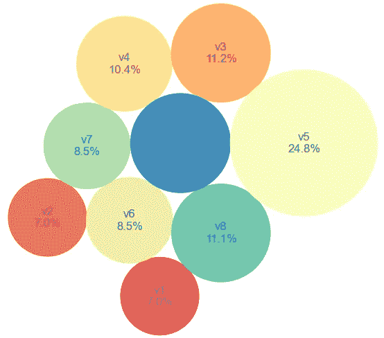

作为条形图替代的圆形打包。图片由作者提供。

# 主要收获

本文没有展示任何新内容，而是提出了用圆形图形替代矩形图表的想法。相反，这些圆形图表也可以用矩形图表替代。

选择合适的图表取决于许多因素，如受众、媒体等。主要的想法是根据使用情况改变图表，以使数据可视化更具吸引力。

显然，除了本文提到的图表和想法，还有更多其他的。如果你有任何意见，请随时分享。我很乐意看到。

感谢阅读

这些是我认为你可能会感兴趣的数据可视化文章：

+   9 种使用 Python 显示比例的可视化方法，而不是饼图 (link)

+   9 种使用 Python 的可视化方法，比条形图更引人注目 (link)

+   8 种使用 Python 处理多时间序列数据的可视化方法 (link)

+   7 种使用 Python 表达排名变化的可视化方法 (link)

+   Battle Royale — 比较 7 个用于交互式金融图表的 Python 库 ([link](https://medium.com/@borih.k/battle-royale-comparison-of-7-python-libraries-for-interactive-financial-charts-bbdcc28989bc))

## 参考

+   *饼图和甜甜圈图模板：饼图和甜甜圈图。* Moqups. (n.d.). 取自 [`moqups.com/templates/charts-graphs/pie-donut-chart/`](https://moqups.com/templates/charts-graphs/pie-donut-chart/)
