# Plotly 和 Pandas：结合力量实现有效的数据可视化

> 原文：[`towardsdatascience.com/plotly-and-pandas-combining-forces-for-effective-data-visualization-2e2caad52de9?source=collection_archive---------1-----------------------#2023-07-10`](https://towardsdatascience.com/plotly-and-pandas-combining-forces-for-effective-data-visualization-2e2caad52de9?source=collection_archive---------1-----------------------#2023-07-10)

## 一份受《数据讲故事》启发的快速指南

[](https://medium.com/@andreas030503?source=post_page-----2e2caad52de9--------------------------------)[](https://towardsdatascience.com/?source=post_page-----2e2caad52de9--------------------------------) [安德烈亚斯·卢基塔](https://medium.com/@andreas030503?source=post_page-----2e2caad52de9--------------------------------)

·

[关注](https://medium.com/m/signin?actionUrl=https%3A%2F%2Fmedium.com%2F_%2Fsubscribe%2Fuser%2F955ef38ea7b&operation=register&redirect=https%3A%2F%2Ftowardsdatascience.com%2Fplotly-and-pandas-combining-forces-for-effective-data-visualization-2e2caad52de9&user=Andreas+Lukita&userId=955ef38ea7b&source=post_page-955ef38ea7b----2e2caad52de9---------------------post_header-----------) 发表在 [Towards Data Science](https://towardsdatascience.com/?source=post_page-----2e2caad52de9--------------------------------) ·13 min read·2023 年 7 月 10 日[](https://medium.com/m/signin?actionUrl=https%3A%2F%2Fmedium.com%2F_%2Fvote%2Ftowards-data-science%2F2e2caad52de9&operation=register&redirect=https%3A%2F%2Ftowardsdatascience.com%2Fplotly-and-pandas-combining-forces-for-effective-data-visualization-2e2caad52de9&user=Andreas+Lukita&userId=955ef38ea7b&source=-----2e2caad52de9---------------------clap_footer-----------)

--

[](https://medium.com/m/signin?actionUrl=https%3A%2F%2Fmedium.com%2F_%2Fbookmark%2Fp%2F2e2caad52de9&operation=register&redirect=https%3A%2F%2Ftowardsdatascience.com%2Fplotly-and-pandas-combining-forces-for-effective-data-visualization-2e2caad52de9&source=-----2e2caad52de9---------------------bookmark_footer-----------)

照片由 [卢克·切瑟](https://unsplash.com/@lukechesser?utm_source=medium&utm_medium=referral) 在 [Unsplash](https://unsplash.com/?utm_source=medium&utm_medium=referral) 上提供

> “我的数据可视化技能很糟糕。我的观众似乎对我的工作不感兴趣，更糟的是，他们没有被说服。”

曾经有很多人遇到过这个问题。除非你有天赋或之前上过设计课程，否则制作视觉美观且对观众直观的图表可能非常具有挑战性和耗时。

当时我想到的是：我希望在制作图表时更加用心，以便它能直观地传达信息给我的观众。我的意思是，不要过度消耗他们的脑力和时间来理解发生了什么。

我曾经认为从 Matplotlib 切换到 Seaborn，再到 Plotly 可以解决美学问题。事实上，我错了。可视化不仅仅是关于美学的。以下是我尝试复制的两个可视化图表，灵感来自[**《数据讲故事》**](https://www.storytellingwithdata.com/books)¹由 Cole Nussbaumer Knaflic 编写，这些图表真正激励我改变了我的可视化方法。它们看起来干净、优雅且有目的。我们将在本文中尝试复制这些图表！

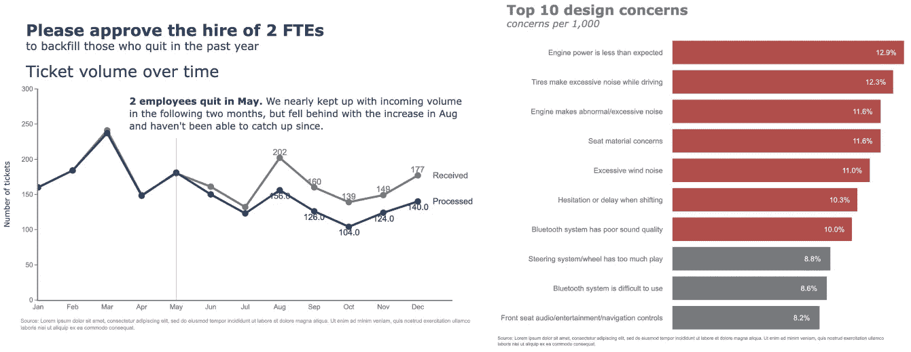

作者提供的图像

这篇文章的要点是。如果你在寻找关于优秀可视化背后概念的深入解释，查看[**《数据讲故事》**](https://www.storytellingwithdata.com/books)¹，每一页都是值得你花时间阅读的宝贵内容。如果你在寻找工具特定的实用建议，你来对地方了。Cole 在她的书开头提到，她提供的建议是普遍适用的，与工具无关，尽管她承认她在书中的示例是使用 Excel 创建的。有些人，包括我自己，出于许多原因并不喜欢 Excel 和拖放工具。有些人更喜欢使用 Python、R 及其他一些编程语言来创建可视化。如果你属于这一类，并且将 Python 作为主要工具，那么这篇文章就是为你准备的。

**目录**

+   链式调用—Pandas 绘图

+   水平条形图

+   折线图

+   附录：数字图表

# 链式调用—Pandas 绘图

如果你对使用 Pandas 进行数据整理颇有经验，你可能会遇到或甚至自己采用“链式调用”的概念。简而言之，链式调用可以让你的代码更具可读性、更易于调试，并且更适合生产。以下是我所指的一个简单示例。你不必逐行阅读，只需快速浏览即可理解“链式调用”的概念。每一步都清晰易懂，代码组织良好，没有不必要的中间变量。

```py
(epl_10seasons
 .rename(columns=lambda df_: df_.strip())
 .rename(columns=lambda df_: re.sub('\W+|[!,*)@#%(&$_?.^]', '_', df_))
 .pipe(lambda df_: df_.astype({column: 'int8' for column in (df_.select_dtypes("integer").columns.tolist())}))
 .pipe(lambda df_: df_.astype({column: 'category' for column in (df_.select_dtypes("object").columns.tolist()[:-1])}))
 .assign(match_date=lambda df_: pd.to_datetime(df_.match_date, infer_datetime_format=True))
 .assign(home_team=lambda df_: np.where((df_.home_team == "Arsenal"), "The Gunners", df_.home_team),
         away_team=lambda df_: np.where((df_.away_team == "Arsenal"), "The Gunners", df_.away_team),
         month=lambda df_: df_.match_date.dt.month_name())
 .query('home_team == "The Gunners"')
)
```

这很好，但你是否知道你可以继续链式调用以创建基本的可视化图表？Pandas Plot 默认使用 Matplotlib 后端来实现这一点。让我们看看它是如何工作的，并复制 Cole 在她的书中创建的一些示例。

```py
import pandas as pd
import numpy as np
import matplotlib.pyplot as plt
import seaborn as sns
import plotly.graph_objects as go
%matplotlib inline

pd.options.plotting.backend = 'plotly'

df = pd.DataFrame({"concerns": ["Engine power is less than expected", 
                                "Tires make excessive noise while driving",
                                "Engine makes abnormal/excessive noise",
                                "Seat material concerns",
                                "Excessive wind noise",
                                "Hesitation or delay when shifting",
                                "Bluetooth system has poor sound quality",
                                "Steering system/wheel has too much play",
                                "Bluetooth system is difficult to use",
                                "Front seat audio/entertainment/navigation controls"
                                 ],
                   "concerns per 1,000": [12.9, 12.3, 11.6, 11.6, 11.0, 10.3, 10.0, 8.8, 8.6, 8.2],}, 
                  index=list(range(0,10,1)))
```

我们有一个看起来像这样的 DataFrame。

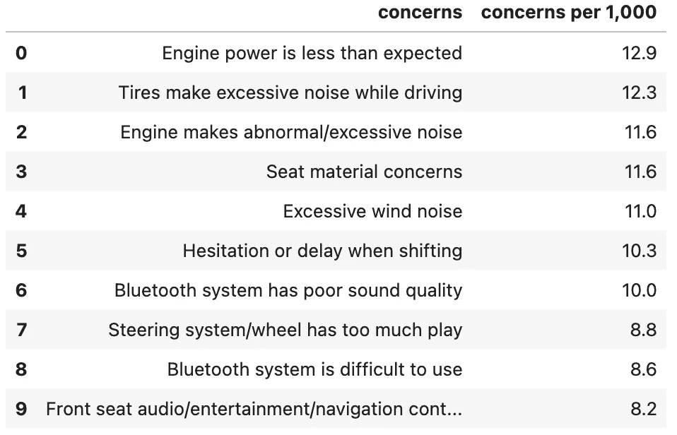

作者提供的图像

```py
(df
 .plot
 .barh()
)
```

这是生成基本可视化图表的最快方法。通过将`**.plot**`属性和`**.line**`方法直接链式调用到 DataFrame，我们获得了下面的图表。

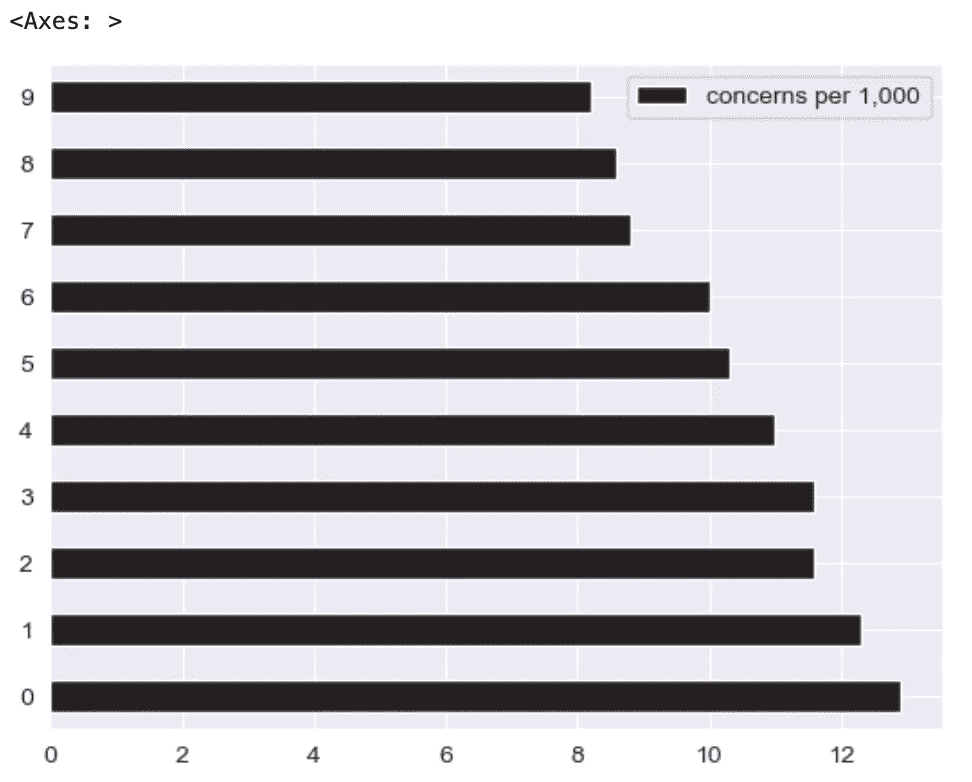

图片由作者提供

如果你认为上面的图表没有通过美学检查，请暂时按捺住你的反应和判断。确实，它看起来至少有些难看。让我们改进一下，让它更好。诀窍是，将 Pandas 绘图后端从 Matplotlib 切换到 Plotly，这样即将揭示的魔法就会显现。

```py
pd.options.plotting.backend = 'plotly'
```

你可能会问，“为什么要换成 Plotly？难道 Matplotlib 不也能做到同样的事情吗？”好吧，这就是区别所在。

如果我们在 Pandas 中使用 Matplotlib 后端，它返回一个 Axes 对象，尝试使用内置的`**type()**`方法自行验证。这很好，因为 axes 对象允许我们访问方法以进一步修改图表。查看[**这份文档**](https://matplotlib.org/stable/api/axes_api.html)²以了解对 Axes 对象执行的可能方法。我们来选择一个快速演示一下。

```py
(df
 .plot
 .barh()
 .set_xlabel("concerns per 1,000")
)
```

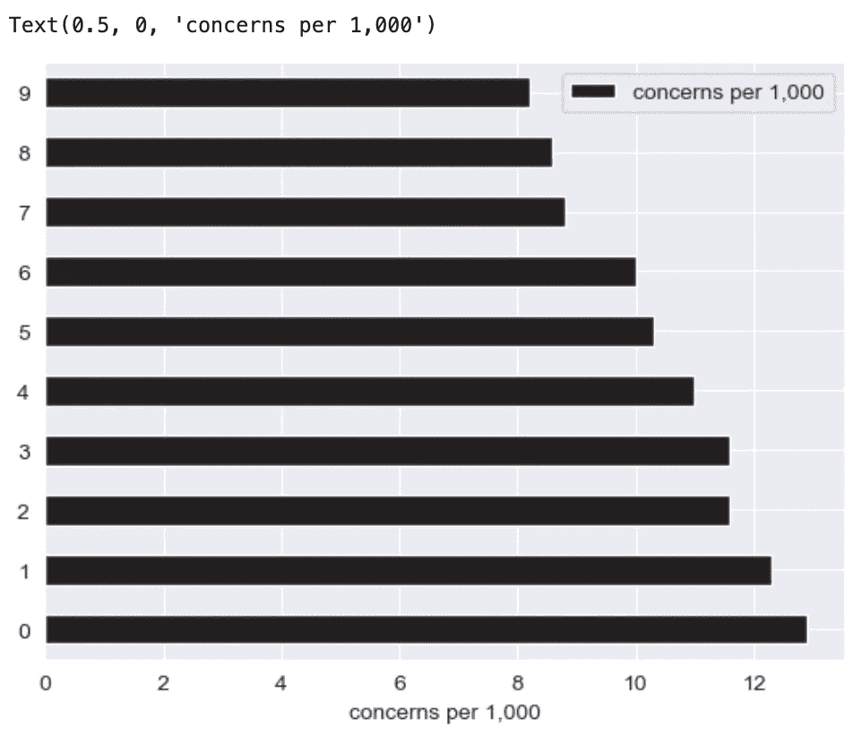

图片由作者提供

我们成功地将 x 轴标签设置为“每千个关注点”，但这样做的结果是，我们返回了一个**Text 对象**，失去了珍贵的 Axis 对象，而这个对象让我们可以访问进一步修改图表的宝贵方法。真可惜！

这里是绕过上述限制的另一种方法，

```py
(df
 .plot
 .barh(xlabel="Concerns per 1,000", ylabel="Concerns", title="Top 10 design concerns")
)
```

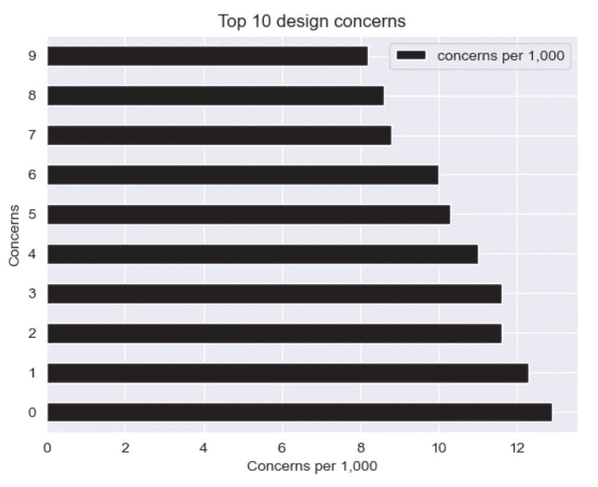

图片由作者提供

然而，由于 Pandas 实现的限制，我们仍然无法进行广泛的修改，具体请参考[这里](https://pandas.pydata.org/docs/reference/api/pandas.DataFrame.plot.line.html)。

另一方面，Plotly 不返回一个 Axes 对象。它返回一个`**go.Figure**`对象。这里的区别在于，负责更新图表的方法也会返回一个`**go.Figure**`对象，这样你可以继续链式调用方法，以进一步更新图表。我们来试试吧！

顺便说一下，如果你想知道我如何获得下面的方法和参数组合，它们都可以在官方文档中找到，[**在这里**](https://plotly.com/python/reference/)³。

这里是一些重要的方法，帮助你入门——`**.update_traces**`，`**.add_traces**`，`**.update_layout**`，`**.update_xaxes**`，`**.update_yaxes**`，`**.add_annotation**`，`**.update_annotations**`。

# 横向条形图

让我们为下面的可视化定义一组颜色调色板。

```py
GRAY1, GRAY2, GRAY3 = '#231F20', '#414040', '#555655'
GRAY4, GRAY5, GRAY6 = '#646369', '#76787B', '#828282'
GRAY7, GRAY8, GRAY9, GRAY10 = '#929497', '#A6A6A5', '#BFBEBE', '#FFFFFF'
BLUE1, BLUE2, BLUE3, BLUE4, BLUE5 = '#25436C', '#174A7E', '#4A81BF', '#94B2D7', '#94AFC5'
BLUE6, BLUE7 = '#92CDDD', '#2E869D'
RED1, RED2, RED3 = '#B14D4A', '#C3514E', '#E6BAB7'
GREEN1, GREEN2 = '#0C8040', '#9ABB59'
ORANGE1, ORANGE2, ORANGE3 = '#F36721', '#F79747', '#FAC090'

gray_palette = [GRAY1, GRAY2, GRAY3, GRAY4, GRAY5, GRAY6, GRAY7, GRAY8, GRAY9, GRAY10]
blue_palette = [BLUE1, BLUE2, BLUE3, BLUE4, BLUE5, BLUE6, BLUE7]
red_palette = [RED1, RED2, RED3]
green_palette = [GREEN1, GREEN2]
orange_palette = [ORANGE1, ORANGE2, ORANGE3]

sns.set_style("darkgrid")
sns.set_palette(gray_palette)
sns.palplot(sns.color_palette())
```


图片由作者提供

在这里，我们希望通过定义不同的颜色来突出显示等于或高于 10% 的关注点。

```py
color = np.array(['rgb(255,255,255)']*df.shape[0])
color[df
      .set_index("concerns", drop=True)
      .iloc[::-1]
      ["concerns per 1,000"]>=10] = red_palette[0]
color[df
      .set_index("concerns", drop=True)
      .iloc[::-1]
      ["concerns per 1,000"]<10] = gray_palette[4]
```

然后我们**从 DataFrame 创建图表**。

```py
(df
 .set_index("concerns", drop=True)
 .iloc[::-1]
 .plot
 .barh()
 .update_traces(marker=dict(color=color.tolist()))
)
```

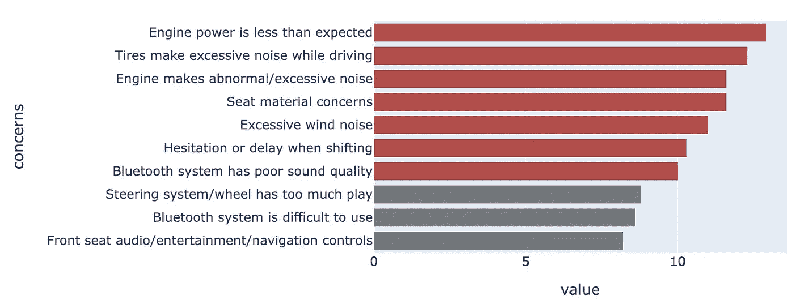

图片由作者提供

**更新布局**将得到如下结果。在这里，我们指定模板，添加标题和边距，并指定图形对象的大小。让我们暂时对注释进行评论。

```py
(df
 .set_index("concerns", drop=True)
 .iloc[::-1]
 .plot
 .barh()
 .update_traces(marker=dict(color=color.tolist()))
 .update_layout(template="plotly_white",
                title=dict(text="<b>Top 10 design concerns</b> <br><sup><i>concerns per 1,000</i></sup>", 
                           font_size=30,
                           font_color=gray_palette[4]),
                margin=dict(l=50,
                            r=50,
                            b=50,
                            t=100,
                            pad=20),
                width=1000, 
                height=800, 
                showlegend=False, 
                #annotations=annotations
               )
)
```

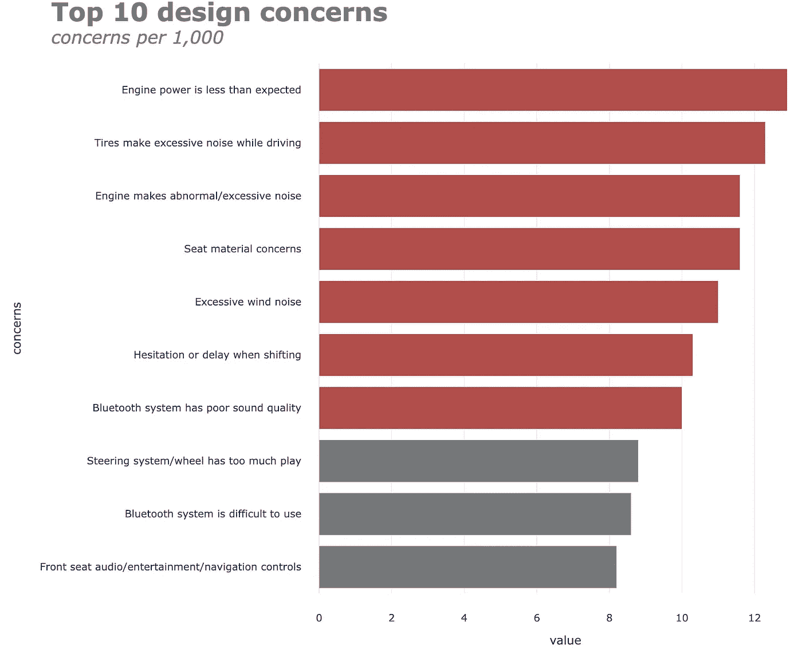

作者提供的图片

**更新 x 和 y 轴**属性将得到如下结果。

```py
(df
 .set_index("concerns", drop=True)
 .iloc[::-1]
 .plot
 .barh()
 .update_traces(marker=dict(color=color.tolist()))
 .update_layout(template="plotly_white",
                title=dict(text="<b>Top 10 design concerns</b> <br><sup><i>concerns per 1,000</i></sup>", 
                           font_size=30,
                           font_color=gray_palette[4]),
                margin=dict(l=50,
                            r=50,
                            b=50,
                            t=100,
                            pad=20),
                width=1000, 
                height=800, 
                showlegend=False, 
                #annotations=annotations
               )
 .update_xaxes(title_standoff=10,
               showgrid=False,
               visible=False,
               tickfont=dict(
                        family='Arial',
                        size=16,
                        color=gray_palette[4],),
               title="")
 .update_yaxes(title_standoff=10,
               tickfont=dict(
                        family='Arial',
                        size=16,
                        color=gray_palette[4],),
               title="")
)
```

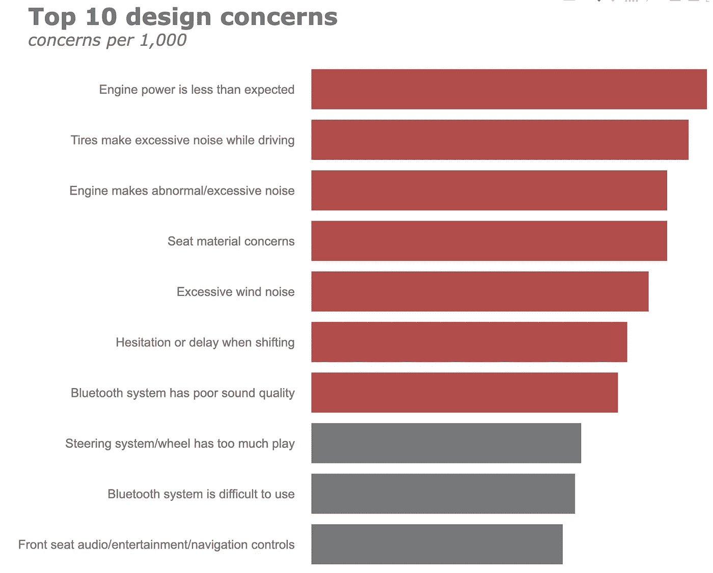

作者提供的图片

最后但同样重要的是，我们将**添加一些注释**到图表中。在这里，我们有一些注释——为水平条形图和脚注添加数据标签。让我们一起做这个。首先，我们在一个单独的单元格中定义注释。

```py
annotations = []

y_s = np.round(df["concerns per 1,000"], decimals=2)

# Adding data labels
for yd, xd in zip(y_s, df.concerns):
    # labeling the bar net worth
    annotations.append(dict(xref='x1', 
                            yref='y1',
                            y=xd, x=yd - 1,
                            text=str(yd) + '%',
                            font=dict(family='Arial', size=16,
                                      color=gray_palette[-1]),
                            showarrow=False))

# Adding Source Annotations
annotations.append(dict(xref='paper', 
                        yref='paper',
                        x=-0.72, 
                        y=-0.050,
                        text='Source: Lorem ipsum dolor sit amet, consectetur adipiscing elit, sed do eiusmod tempor incididunt ut labore et dolore magna aliqua. Ut enim ad minim veniam, quis nostrud exercitation ullamco'
                             '<br>laboris nisi ut aliquip ex ea commodo consequat.',
                        font=dict(family='Arial', size=10, color=gray_palette[4]),
                        showarrow=False,
                        align='left'))
```

```py
(df
 .set_index("concerns", drop=True)
 .iloc[::-1]
 .plot
 .barh()
 .update_traces(marker=dict(color=color.tolist()))
 .update_layout(template="plotly_white",
                title=dict(text="<b>Top 10 design concerns</b> <br><sup><i>concerns per 1,000</i></sup>", 
                           font_size=30,
                           font_color=gray_palette[4]),
                margin=dict(l=50,
                            r=50,
                            b=50,
                            t=100,
                            pad=20),
                width=1000, 
                height=800, 
                showlegend=False, 
                annotations=annotations
               )
 .update_xaxes(title_standoff=10,
               showgrid=False,
               visible=False,
               tickfont=dict(
                        family='Arial',
                        size=16,
                        color=gray_palette[4],),
               title="")
 .update_yaxes(title_standoff=10,
               tickfont=dict(
                        family='Arial',
                        size=16,
                        color=gray_palette[4],),
               title="")
)
```


作者提供的图片

相对于最初的默认版本，这是不是一个更好的图表？让我们继续探索另一种流行图表——折线图。

请注意，下面的示例比上面的更复杂。然而，思路保持不变。

# 折线图

让我们快速查看默认的 Matplotlib 折线图绘图后端。

```py
pd.options.plotting.backend = 'matplotlib'

df = pd.DataFrame({"Received": [160,184,241,149,180,161,132,202,160,139,149,177],
                   "Processed":[160,184,237,148,181,150,123,156,126,104,124,140]},
                  index=['Jan', 'Feb', 'Mar', 'Apr', 'May', 'Jun', 'Jul', 'Aug', 'Sep', 'Oct', 'Nov', 'Dec'])

(df
 .plot
 .line()
);
```

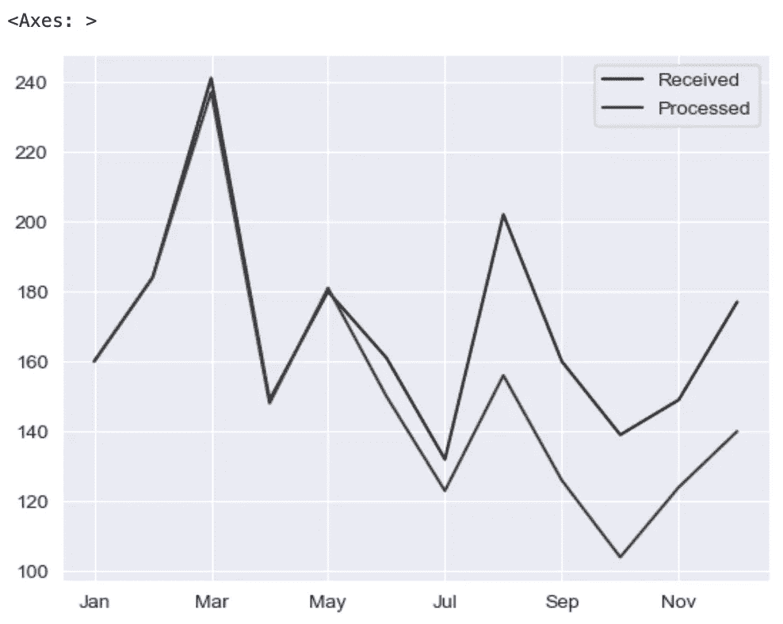

作者提供的图片

让我们将绘图后端切换到 Plotly！

```py
pd.options.plotting.backend = 'plotly'

(df
 .plot(x=df.index, 
       y=df.Received,
       labels=dict(index="", value="Number of tickets"),)
)
```

在将 Pandas 绘图后端切换到 Plotly 后，上面的代码给出了以下结果。在这里，我们首先绘制**已接收**系列。

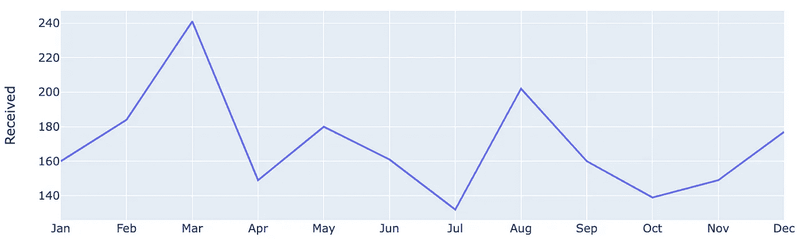

作者提供的图片

让我们通过进一步链接上面的方法来**更新线条属性**。在这里，我们修改颜色、宽度，并在数据点上放置标记。

```py
(df
 .plot(x=df.index, 
       y=df.Received,
       labels=dict(index="", value="Number of tickets"),)
 .update_traces(go.Scatter(mode='lines+markers+text', 
                           line={"color": gray_palette[4], "width":4},
                           marker=dict(size=12)),)
)
```

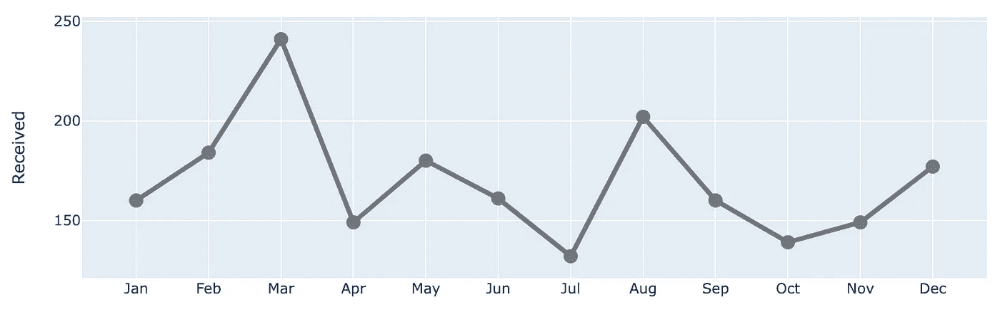

作者提供的图片

让我们将**处理过的**系列添加到图表中！

```py
(df
 .plot(x=df.index, 
       y=df.Received,
       labels=dict(index="", value="Number of tickets"),)
 .update_traces(go.Scatter(mode='lines+markers+text', 
                           line={"color": gray_palette[4], "width":4},
                           marker=dict(size=12)),)
 .add_traces(go.Scatter(x=df.index, #Add Processed col
                        y=df.Processed, 
                        mode="lines+markers+text", 
                        line={"color": blue_palette[0], "width":4},
                        marker=dict(size=12)))
)
```

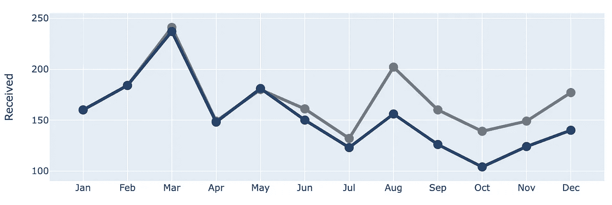

作者提供的图片

让我们在 5 月的索引处**添加一条垂直线**，以显示两条线开始分歧的点。

```py
(df
 .plot(x=df.index, 
       y=df.Received,
       labels=dict(index="", value="Number of tickets"),)
 .update_traces(go.Scatter(mode='lines+markers+text', 
                           line={"color": gray_palette[4], "width":4},
                           marker=dict(size=12)),)
 .add_traces(go.Scatter(x=df.index, #Add Processed col
                        y=df.Processed, 
                        mode="lines+markers+text", 
                        line={"color": blue_palette[0], "width":4},
                        marker=dict(size=12)))
 .add_traces(go.Scatter(x=["May", "May"], #Add vline
                        y=[0,230], 
                        fill="toself", 
                        mode="lines", 
                        line_width=0.5, 
                        line_color= gray_palette[4]))
)
```

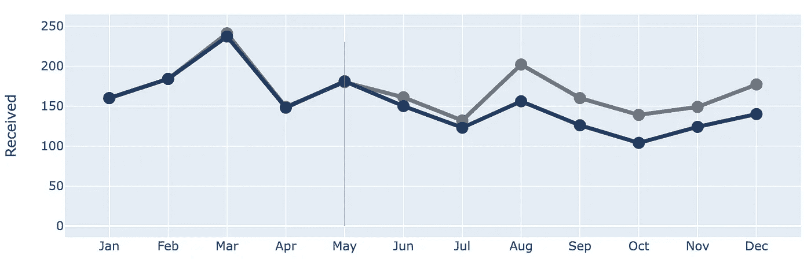

作者提供的图片

接下来，让我们通过将背景更改为白色，添加标题、边距和其他一些元素来**更新整体布局**。关于注释，我们暂时进行评论。

```py
(df
 .plot(x=df.index, 
       y=df.Received,
       labels=dict(index="", value="Number of tickets"),)
 .update_traces(go.Scatter(mode='lines+markers+text', 
                           line={"color": gray_palette[4], "width":4},
                           marker=dict(size=12)),)
 .add_traces(go.Scatter(x=df.index, #Add Processed col
                        y=df.Processed, 
                        mode="lines+markers+text", 
                        line={"color": blue_palette[0], "width":4},
                        marker=dict(size=12)))
 .add_traces(go.Scatter(x=["May", "May"], #Add vline
                        y=[0,230], 
                        fill="toself", 
                        mode="lines", 
                        line_width=0.5, 
                        line_color= gray_palette[4]))
 .update_layout(template="plotly_white",
                title=dict(text="<b>Please approve the hire of 2 FTEs</b> <br><sup>to backfill those who quit in the past year</sup> <br>Ticket volume over time <br><br><br>", 
                           font_size=30,),
                margin=dict(l=50,
                            r=50,
                            b=100,
                            t=200,),
                width=900, 
                height=700, 
                yaxis_range=[0, 300], 
                showlegend=False, 
                #annotations=right_annotations,
                )
)
```

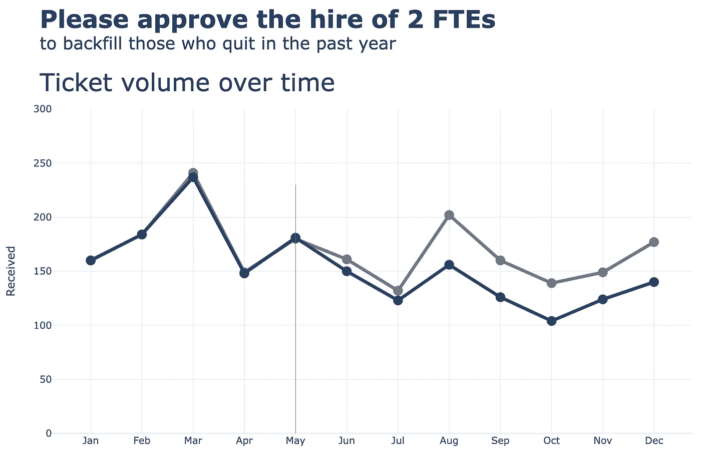

作者提供的图片

接下来，我们将对**x 和 y 轴**进行更新。

```py
(df
 .plot(x=df.index, 
       y=df.Received,
       labels=dict(index="", value="Number of tickets"),)
 .update_traces(go.Scatter(mode='lines+markers+text', 
                           line={"color": gray_palette[4], "width":4},
                           marker=dict(size=12)),)
 .add_traces(go.Scatter(x=df.index, #Add Processed col
                        y=df.Processed, 
                        mode="lines+markers+text", 
                        line={"color": blue_palette[0], "width":4},
                        marker=dict(size=12)))
 .add_traces(go.Scatter(x=["May", "May"], #Add vline
                        y=[0,230], 
                        fill="toself", 
                        mode="lines", 
                        line_width=0.5, 
                        line_color= gray_palette[4]))
 .update_layout(template="plotly_white",
                title=dict(text="<b>Please approve the hire of 2 FTEs</b> <br><sup>to backfill those who quit in the past year</sup> <br>Ticket volume over time <br><br><br>", 
                           font_size=30,),
                margin=dict(l=50,
                            r=50,
                            b=100,
                            t=200,),
                width=900, 
                height=700, 
                yaxis_range=[0, 300], 
                showlegend=False, 
                #annotations=right_annotations,
                )
 .update_xaxes(dict(range=[0, 12],
                    showline=True,
                    showgrid=False,
                    linecolor=gray_palette[4],
                    linewidth=2,
                    ticks='',
                    tickfont=dict(
                        family='Arial',
                        size=13,
                        color=gray_palette[4],
                    ),
 ))
 .update_yaxes(dict(showline=True,
                    showticklabels=True,
                    showgrid=False,
                    ticks='outside',
                    linecolor=gray_palette[4],
                    linewidth=2,
                    tickfont=dict(
                        family='Arial',
                        size=13,
                        color=gray_palette[4],
                    ),
                    title_text="Number of tickets"
 ))
)
```

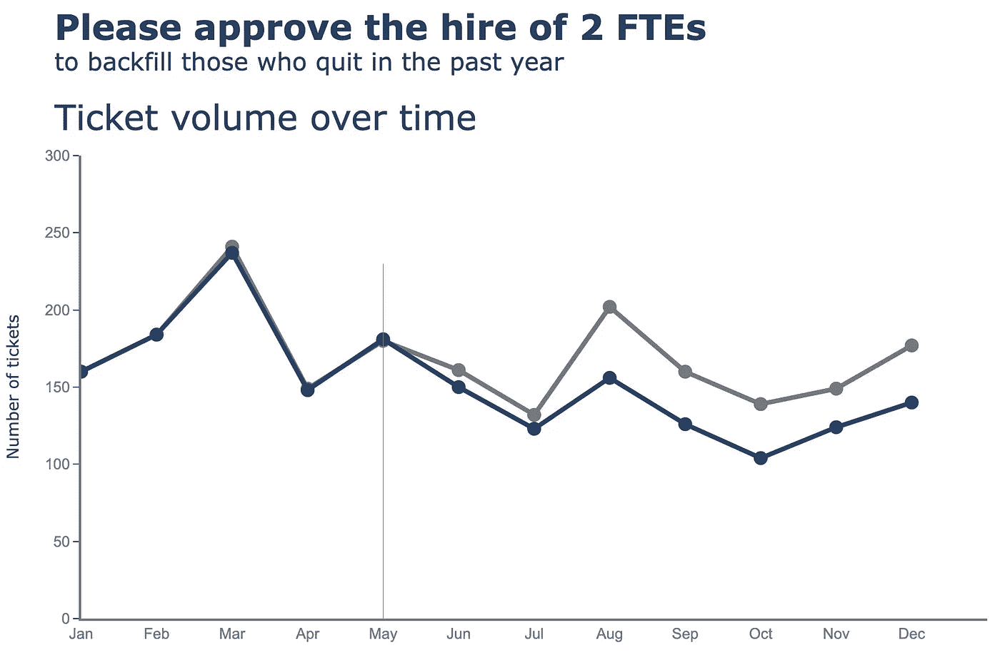

作者提供的图片

最后但同样重要的是，我们将**添加一些注释**到图表中。在这里，我们有一些注释——为折线图添加标签（已接收，已处理），以及为散点添加标签，这可能会有些复杂。让我们一起做这个。首先，我们在一个单独的单元格中定义注释。

```py
y_data = df.to_numpy()
colors = [gray_palette[3], blue_palette[0]]
labels = df.columns.to_list()

right_annotations = []

# Adding labels to line
for y_trace, label, color in zip(y_data[-1], labels, colors):

    right_annotations.append(dict(xref='paper', 
                                  x=0.95, 
                                  y=y_trace,
                                  xanchor='left', 
                                  yanchor='middle',
                                  text=label,
                                  font=dict(family='Arial',size=16,color=color),
                                  showarrow=False))

# Adding labels to scatter point
scatter_annotations = []

y_received = [each for each in df.Received]
y_processed  = [float(each) for each in df.Processed]
x_index = [each for each in df.index]
y_r = np.round(y_received)
y_p = np.rint(y_processed)

for ydn, yd, xd in zip(y_r[-5:], y_p[-5:], x_index[-5:]):

    scatter_annotations.append(dict(xref='x2 domain', 
                                    yref='y2 domain', 
                                    y=ydn, 
                                    x=xd, 
                                    text='{:,}'.format(ydn),
                                    font=dict(family='Arial',size=16,color=gray_palette[4]),
                                    showarrow=False,
                                    xanchor='center', 
                                    yanchor='bottom',
                                    ))

    scatter_annotations.append(dict(xref='x2 domain', 
                                    yref='y2 domain', 
                                    y=yd, 
                                    x=xd, 
                                    text='{:,}'.format(yd),
                                    font=dict(family='Arial',size=16,color=blue_palette[0]),
                                    showarrow=False,
                                    xanchor='center', 
                                    yanchor='top',
                                    ))
```

在定义注释后，我们只需**将注释变量放入链式方法**中，如下所示。

```py
(df
 .plot(x=df.index, 
       y=df.Received,
       labels=dict(index="", value="Number of tickets"),)
 .update_traces(go.Scatter(mode='lines+markers+text', 
                           line={"color": gray_palette[4], "width":4},
                           marker=dict(size=12)),)
 .add_traces(go.Scatter(x=df.index, #Add Processed col
                        y=df.Processed, 
                        mode="lines+markers+text", 
                        line={"color": blue_palette[0], "width":4},
                        marker=dict(size=12)))
 .add_traces(go.Scatter(x=["May", "May"], #Add vline
                        y=[0,230], 
                        fill="toself", 
                        mode="lines", 
                        line_width=0.5, 
                        line_color= gray_palette[4]))
 .update_layout(template="plotly_white",
                title=dict(text="<b>Please approve the hire of 2 FTEs</b> <br><sup>to backfill those who quit in the past year</sup> <br>Ticket volume over time <br><br><br>", 
                           font_size=30,),
                margin=dict(l=50,
                            r=50,
                            b=100,
                            t=200,),
                width=900, 
                height=700, 
                yaxis_range=[0, 300], 
                showlegend=False, 
                annotations=right_annotations,
                )
 .update_layout(annotations=scatter_annotations * 2)
 .update_xaxes(dict(range=[0, 12],
                    showline=True,
                    showgrid=False,
                    linecolor=gray_palette[4],
                    linewidth=2,
                    ticks='',
                    tickfont=dict(
                        family='Arial',
                        size=13,
                        color=gray_palette[4],
                    ),
 ))
 .update_yaxes(dict(showline=True,
                    showticklabels=True,
                    showgrid=False,
                    ticks='outside',
                    linecolor=gray_palette[4],
                    linewidth=2,
                    tickfont=dict(
                        family='Arial',
                        size=13,
                        color=gray_palette[4],
                    ),
                    title_text="Number of tickets"
 ))
 .add_annotation(dict(text="<b>2 employees quit in May.</b> We nearly kept up with incoming volume <br>in the following two months, but fell behind with the increase in Aug <br>and haven't been able to catch up since.",
                      font_size=18,
                      align="left",
                      x=7.5,
                      y=265,
                      showarrow=False))
 .add_annotation(dict(xref='paper', 
                        yref='paper',
                        x=0.5, 
                        y=-0.15,
                        text='Source: Lorem ipsum dolor sit amet, consectetur adipiscing elit, sed do eiusmod tempor incididunt ut labore et dolore magna aliqua. Ut enim ad minim veniam, quis nostrud exercitation ullamco'
                             '<br>laboris nisi ut aliquip ex ea commodo consequat.',
                        font=dict(family='Arial',
                                  size=10,
                                  color='rgb(150,150,150)'),
                        showarrow=False,
                        align='left'))
 .update_annotations(yshift=0)
 .show()
)
```

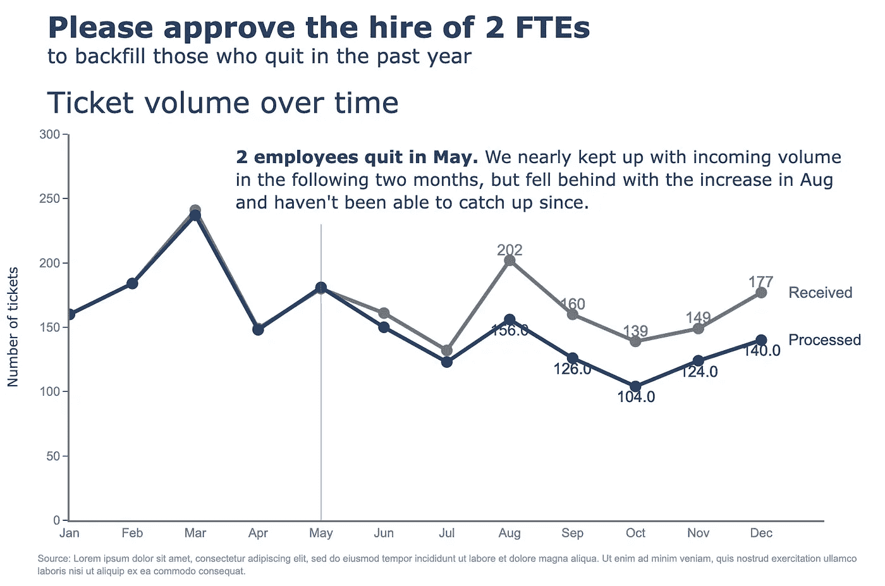

作者提供的图片

# 附加：数字图表

恭喜你阅读到文章的这一部分！这是一个额外的图表，供你参考！我们在这里创建了一个图表，以美观的方式呈现一个数字。简而言之，这就是我所指的。

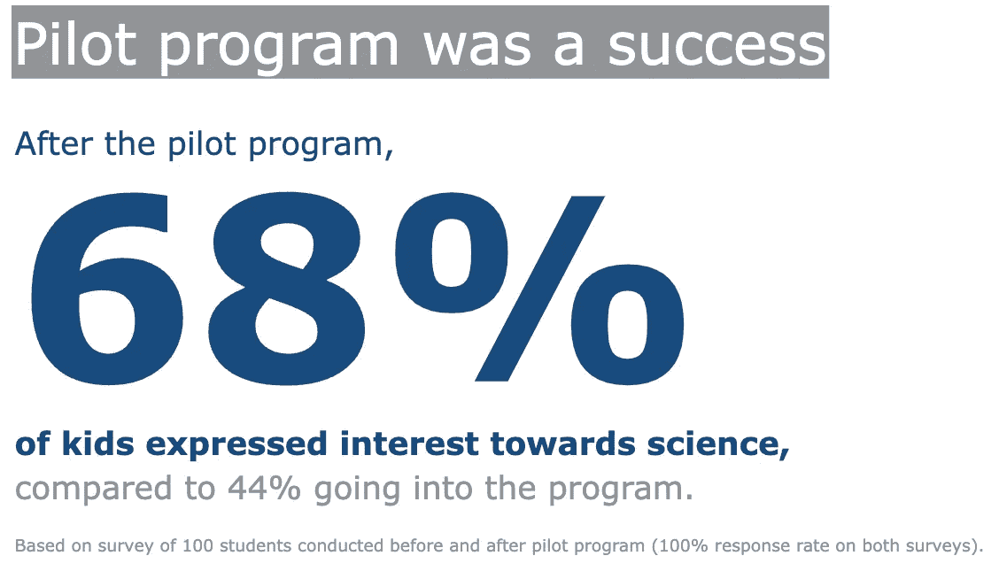

图片来源：作者

由于这不是 DataFrame 的结果，我们可以从头开始创建一个空的 `**go.Figure**` 对象，然后逐步添加注释。最后，通过相应地更新布局来结束。

```py
(go
 .Figure() # Create an empty figure
 .add_annotation(
    x=0.0,
    y=1,
    text='Pilot program was a success',
    showarrow=False,
    font={'size': 36, 'color': 'white'},
    bgcolor=gray_palette[-3],
    bordercolor='gray',
    borderwidth=0,
    xref='paper',
    yref='paper',
    xanchor='left',
    yanchor='top',
    align='left',
    ax=0,
    ay=-10
 )
 .add_annotation(
    x=-1.0,  # X-coordinate of the text position
    y=3.0,  # Y-coordinate of the text position
    text="After the pilot program,",  # The text content
    showarrow=False,  # Hide the arrow
    font=dict(size=20, 
              color=blue_palette[1]),  # Customize the font size
    xanchor='left',
    yanchor='top',
    align='left',
 )
 .add_annotation(
    x=-1.0,  # X-coordinate of the text position
    y=1.6,  # Y-coordinate of the text position
    text="<b>68%</b>",  # The text content
    showarrow=False,  # Hide the arrow
    font=dict(size=160, 
              color=blue_palette[1]),  # Customize the font size
    xanchor='left',
    align='left',
 )
 .add_annotation(
    x=-1.0,  # X-coordinate of the text position
    y=0.2,  # Y-coordinate of the text position
    text="<b>of kids expressed interest towards science,</b>",  # The text content
    showarrow=False,  # Hide the arrow
    font=dict(size=20, 
              color=blue_palette[1]),  # Customize the font size
    xanchor='left',
    align='left',
 )
 .add_annotation(
    x=-1.0,  # X-coordinate of the text position
    y=-0.2,  # Y-coordinate of the text position
    text="compared to 44% going into the program.",  # The text content
    showarrow=False,  # Hide the arrow
    font=dict(size=20, 
              color=gray_palette[-3]),  # Customize the font size
    xanchor='left',
    align='left',
 )
 .add_annotation(
    x=-1.0,  # X-coordinate of the text position
    y=-0.7,  # Y-coordinate of the text position
    text='Based on survey of 100 students conducted '
         'before and after pilot program '
         '(100% response rate on both surveys).',  # The text content
    showarrow=False,  # Hide the arrow
    font=dict(size=10.5, 
              color=gray_palette[-3]),  # Customize the font size
    xanchor='left',
    align='left',
 )
 .update_layout(
    xaxis=dict(visible=False),  # Hide x-axis
    yaxis=dict(visible=False),  # Hide y-axis
    margin=dict(l=0,
                r=0,
                b=0,
                t=0,
                pad=0),
    font=dict(size=26, 
              color=gray_palette[-3]),  # Customize the font size
    paper_bgcolor='rgba(0,0,0,0)',
    plot_bgcolor='rgba(0,0,0,0)'
 )
 .show()
)
```

# 后记

就这些了！关键是逐步更新和完善你的图表，直到获得理想的结果。当然，每种技术都有其局限性。如果你的图表变得过于复杂，可能有必要参考 Plotly Express，甚至使用 Plotly Graph Objects 从头开始构建。刚开始采用这种技术可能会显得困难和陌生，但坚持练习，你很快就能创建出有意义且美观的可视化！

如果你从这篇文章中获得了一些有用的内容，请考虑在 Medium 上给我一个 [***关注***](https://medium.com/@andreas030503)。很简单，每周一篇文章，让自己保持更新，走在前沿！

# 与我联系！

+   [*LinkedIn*](https://www.linkedin.com/in/andreaslukita7/)👔

+   [*Twitter*](https://twitter.com/andreaslukita7)🖊

# 参考文献

1.  《用数据讲故事》由 Cole Nussbaumer Knaflic 编著。 [`www.storytellingwithdata.com/books`](https://www.storytellingwithdata.com/books)

1.  Matplotlib Axes API. [`matplotlib.org/stable/api/axes_api.html`](https://matplotlib.org/stable/api/axes_api.html)

1.  Plotly 图形库。 [`plotly.com/python/reference/`](https://plotly.com/python/reference/)
