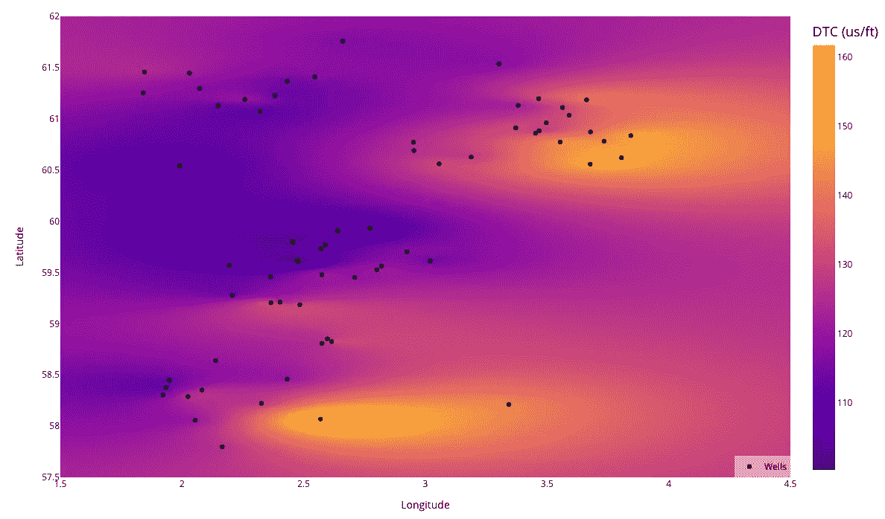

# Plotly 和 Python：为岩石物理和地质数据创建互动热图

> 原文：[`towardsdatascience.com/plotly-and-python-creating-interactive-heatmaps-for-petrophysical-geological-data-701c22b32e4?source=collection_archive---------3-----------------------#2023-06-16`](https://towardsdatascience.com/plotly-and-python-creating-interactive-heatmaps-for-petrophysical-geological-data-701c22b32e4?source=collection_archive---------3-----------------------#2023-06-16)

## 在地下结构中可视化井测量记录的地理空间变化

 [Andy McDonald](https://andymcdonaldgeo.medium.com/?source=post_page-----701c22b32e4--------------------------------)

·

[关注](https://medium.com/m/signin?actionUrl=https%3A%2F%2Fmedium.com%2F_%2Fsubscribe%2Fuser%2F9c280f85f15c&operation=register&redirect=https%3A%2F%2Ftowardsdatascience.com%2Fplotly-and-python-creating-interactive-heatmaps-for-petrophysical-geological-data-701c22b32e4&user=Andy+McDonald&userId=9c280f85f15c&source=post_page-9c280f85f15c----701c22b32e4---------------------post_header-----------) 发表在 [Towards Data Science](https://towardsdatascience.com/?source=post_page-----701c22b32e4--------------------------------) ·7 分钟阅读·2023 年 6 月 16 日

--

使用 Plotly 热图探索挪威大陆架上井测量记录的地理空间变化。图片由作者提供。

解释地下结构需要理解地质和岩石物理数据在一个区域内的变化。这通常涉及处理井测量记录和分布在区域内的解释属性，这带来了在这些测量之间估计值的挑战。

我们可以通过一种叫做克里金（kriging）的地质统计方法来估计值（或填补空白）。该方法估算并外推观察到的测量数据，并预测未测量位置的值。

**在我之前的文章中，** 我们重点介绍了如何使用 [**pykrige**](https://github.com/GeoStat-Framework/PyKrige) 和 [**matplotlib**](https://matplotlib.org/) 来绘制和可视化挪威大陆架上的地质变化。本文将进一步拓展这种可视化，并使这些图表具备交互性。

 ## 利用 pykrige 和 matplotlib 进行地质变化的空间可视化

### 探索来自井日志测量的空间地质变化

towardsdatascience.com

# 关于使用 Pykrige 的快速回顾
