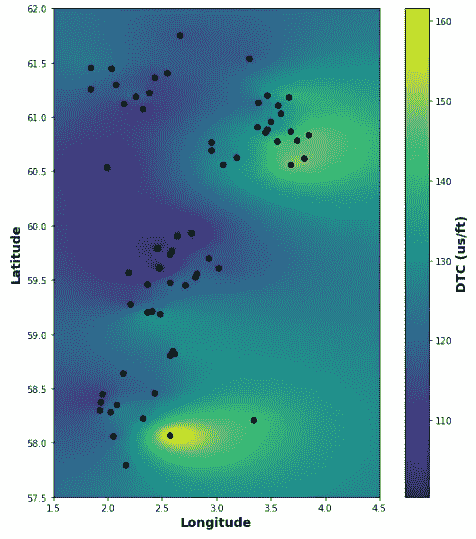
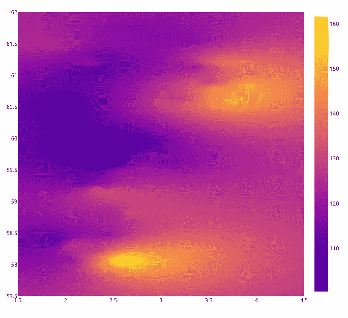
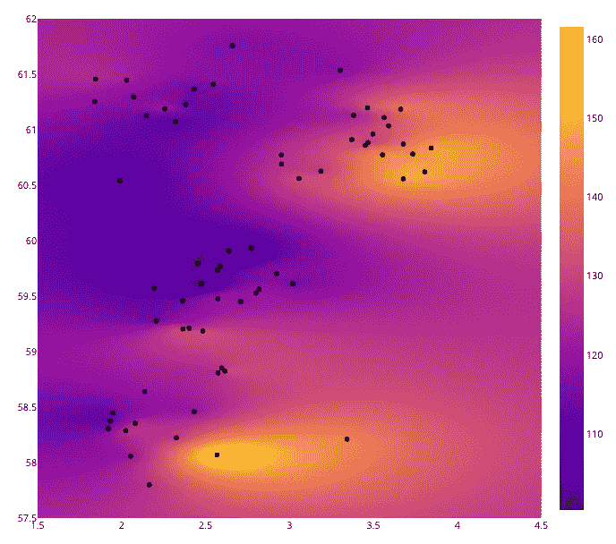
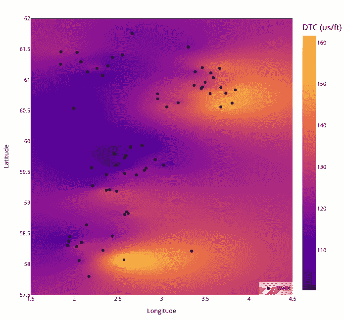

# Plotly 和 Python：为岩心物理和地质数据创建互动热图

> 原文：[`towardsdatascience.com/plotly-and-python-creating-interactive-heatmaps-for-petrophysical-geological-data-701c22b32e4`](https://towardsdatascience.com/plotly-and-python-creating-interactive-heatmaps-for-petrophysical-geological-data-701c22b32e4)

## 可视化地下钻井记录测量中的地理空间变化

[](https://andymcdonaldgeo.medium.com/?source=post_page-----701c22b32e4--------------------------------)[](https://towardsdatascience.com/?source=post_page-----701c22b32e4--------------------------------) [Andy McDonald](https://andymcdonaldgeo.medium.com/?source=post_page-----701c22b32e4--------------------------------)

·发表于 [Towards Data Science](https://towardsdatascience.com/?source=post_page-----701c22b32e4--------------------------------) ·7 分钟阅读·2023 年 6 月 16 日

--


Plotly 热图用于探索挪威大陆架上钻井记录测量的地理空间变化。图片由作者提供。

解释地下数据需要了解地质和岩心物理数据在一个区域内的变化。这通常涉及处理分散在区域内的钻井记录测量和解释属性，这导致了估算这些测量之间的值的挑战。

我们可以通过一种称为克里金法（kriging）的地统计学方法来估算值（或填补空白）。这种方法在观察到的测量数据之间进行估算和外推，并预测未测量位置的值。

**在我之前的文章中，**我们重点介绍了如何使用 [**pykrige**](https://github.com/GeoStat-Framework/PyKrige) 和 [**matplotlib**](https://matplotlib.org/) 来绘制和可视化挪威大陆架的地质变化。本文将进一步推进这些可视化，并使这些图表变得互动。

[](/utilising-pykrige-and-matplotlib-for-spatial-visualisation-of-geological-variations-a288b186bfd6?source=post_page-----701c22b32e4--------------------------------) ## 利用 pykrige 和 matplotlib 进行地质变化的空间可视化

### 从钻井记录测量探索空间地质变化

towardsdatascience.com

# Pykrige 使用快速回顾

在使用 Plotly 之前，我们将快速回顾一下在上一篇文章中使用的代码，以便你跟上进度。

第一步是导入我们所需的库。在这种情况下，我们需要 [**pandas**](https://pandas.pydata.org/) 来加载我们的 csv 数据，[**pykrige**](https://github.com/GeoStat-Framework/PyKrige) 来进行数据点之间的插值，以及 [**numpy**](https://numpy.org/) 来进行一些数学操作。

```py
import pandas as pd
from pykrige import OrdinaryKriging
import numpy as np

df = pd.read_csv('Data/Xeek Force 2020/Xeek_2020_Balder_DTC_AVG.csv')
```

一旦数据加载完成，我们可以通过调用 pykrige 的 `OrdinaryKriging` 方法来进行克里金过程。

在这个调用中，我们传入我们的 x 和 y 数据，代表数据的纬度和经度。我们还需要传入我们想要外推的变量。在这种情况下，我们使用的是 Balder Formation 的平均声波压缩慢度（DTC）值。

一旦模型生成后，我们可以将其应用于覆盖井位的自定义纬度和经度范围。

```py
OK = OrdinaryKriging(x=df['LON'], 
                      y=df['LAT'], 
                      z=df['DTC_MEAN'],
                      variogram_model='exponential',
                      verbose=True, enable_plotting=True,
                      coordinates_type='geographic')

grid_lat = np.arange(57.5, 62, 0.01, dtype='float64')
grid_long = np.arange(1.5, 4.5, 0.01,dtype='float64')
zstar, ss = OK.execute('grid', grid_long, grid_lat)
zstar
```

然后我们将两个位置数组 `grid_lat` 和 `grid_long` 以及我们的网格数据传递给 matplotlib 的 `imshow` 图。这样会生成类似于下图的图形。



使用 pykrige 运行普通克里金（Ordinary Kriging）的数据的 Matplotlib imshow 图表。图片由作者提供。

尽管我们返回的图形讲述了数据趋势的故事，但很难识别具体的井位以及测量点之间的任何值。

# 使用 Plotly 使我们的图表具有交互性

一种立即改变这一点的方法是使用 [**Plotly**](https://plotly.com/) 库。[**Plotly**](https://plotly.com/) 是一个出色的库，用于创建高度交互的图表，且易于组装。

Plotly 提供了两种主要的绘图方式：Plotly Express 和 Plotly Graph Objects。

Plotly Express 提供了一个用于 Plotly 的高级接口，并利用简单的语法创建强大的交互式图表。然而，自定义图表的某些方面可能需要大量工作，并且可能比较困难。这时，库中的 Graph Objects 部分就派上用场了。它提供了一个低级接口，可以完全控制你的图形；然而，这也意味着组装图形会稍微复杂一些。

在这个示例中，我们将使用 Graph Objects，可以按照以下方式导入：

```py
import plotly.graph_objects as go
```

接下来，我们可以使用 numpy 的 `linspace` 函数来定义我们的 `x` 和 `y` 数组。

这将创建两个与我们之前创建的数据网格大小相同的数组。

我们还将创建两个用于经度和纬度的列表。这些值超出了数据的经度和纬度值，并且允许我们在数据点的边缘周围有填充。

```py
longitude = [1.5, 4.5]
latitude = [57.5, 62]

x = np.linspace(longitude[0], longitude[1], zstar.shape[1])
y = np.linspace(latitude[0], latitude[1], zstar.shape[0])
```

使用 matplotlib 时，我们可以使用 `imshow` 来显示这类数据。

尽管 Plotly 也有`imshow`图，但我在写作时（据我所知）无法控制图形的范围。这意味着我们不能指定坐标轴的起始点值。

因此，为了展示我们的数据网格，我们可以切换到使用[**Plotly 的热图**](https://plotly.com/python/heatmaps/)。

热图根据每个数据单元格的值为其着色。你可以在[我的关于 Seaborn 的文章中](https://plotly.com/python/heatmaps/)了解更多关于热图的信息。

我们可以使用以下代码来创建 Plotly Graph Objects 热图。

```py
fig = go.Figure()

fig.add_trace(go.Heatmap(z=zstar, x=x, y=y))

fig.update_xaxes(range=(longitude[0], longitude[1]))
fig.update_yaxes(range=(latitude[0], latitude[1]))

fig.update_layout(autosize=False, width=800, height=800)

fig.show()
```

首先，我们创建一个图形对象，然后添加一个轨迹。这个轨迹包含我们的`x`和`y`位置数据，以及由克里金插值法生成的网格（`zstar`）。

我们还会将图形的大小设置为 800 x 800，这样在 Jupyter 笔记本中就能得到足够大的图表进行操作。

运行上述代码后，我们得到带有所有数据值的热图，且坐标轴显示在正确的范围内。



Plotly Graph Objects 热图显示了挪威大陆架上我们声波压缩缓慢度测量的变化。图片由作者提供。

这个图表的优点是我们可以悬停在任何点上查看值。此外，Plotly 允许我们放大某些部分以进行更仔细的观察。

尽管上述图表很好，但我们缺少额外的信息，这些信息可以帮助读者，例如井的位置以及坐标轴标签。

为了添加我们的井位置，我们需要添加第二个轨迹。这次使用`go.scatter()`并传入数据框中的纬度和经度值。我们还可以通过添加一个字典来控制这些点的显示。在这个示例中，我们将它们设置为黑色。

```py
fig = go.Figure()

fig.add_trace(go.Heatmap(z=zstar, x=x, y=y))

# Add Well Locations
fig.add_trace(go.Scatter(x=df['LON'], y=df['LAT'],
                         mode='markers', marker=dict(color='black')))

fig.update_xaxes(range=(longitude[0], longitude[1]))
fig.update_yaxes(range=(latitude[0], latitude[1]))

fig.update_layout(autosize=False, width=800, height=800)

fig.show()
```



Plotly Graph Objects 热图显示了测量位置（井）以及我们声波压缩缓慢度在挪威大陆架上的变化。图片由作者提供。

现在，我们可以看到我们井的位置；然而，如果我们悬停在标记上，得到的只是纬度和经度值。这在某种程度上是有用的；不过，知道标记表示哪个井以及该井测量的 DTC 值会更好。

为了解决这个问题，我们可以在数据框中直接创建一个新的列作为悬停文本。如果我们以后要在其他图表中使用这个信息，这会很有用。

```py
fig = go.Figure()

fig.add_trace(go.Heatmap(z=zstar, x=x, y=y, 
                         colorbar=dict(title='DTC (us/ft)',
                                       title_font=dict(size=18))))

df['hover_text'] = df.apply(lambda row: f"""<b>{row['WELL']}</b>
                            <br>Latitude: {row['LAT']}
                            <br>Longitude: {row['LON']}
                            <br>Log Value: {round(row['DTC_MEAN'], 2)}""",
                             axis=1)

fig.add_trace(go.Scatter(x=df['LON'], y=df['LAT'],
                         mode='markers', marker=dict(color='black'),
                        name='Wells', text=df['hover_text'], hoverinfo='text', showlegend=True))

fig.update_xaxes(range=(longitude[0], longitude[1]), 
                 title='Longitude')

fig.update_yaxes(range=(latitude[0], latitude[1]), 
                 title='Latitude')

fig.update_layout(autosize=False, width=800, height=800, 
                  legend=dict(x=1, y=0, xanchor='auto', yanchor='auto', 
                              bgcolor='rgba(255, 255, 255, 0.5)'))

fig.show()
```

当我们运行上述代码时，我们得到以下图表。



Plotly Graph Objects 热图增加了互动性。这个图表显示了测量位置（井）以及我们声波压缩缓慢度的变化。图片由作者提供。

现在，当我们将鼠标悬停在任何一个井上时，会显示井名，接着是纬度和经度，以及记录值。在这种情况下，我们展示的是声学压缩慢度。

# 总结

在这个简短的教程中，我们已经看到如何超越简单和静态的 matplotlib 图形来展示我们的测量变化。Plotly 提供的额外功能和互动性使其成为可视化井记录测量的地理空间变化的绝佳选择。

额外的互动性让我们能够识别每个点所代表的井的具体信息、该位置的测量值，并解释那些没有直接测量值的网格的数值。

# 使用的数据集

本文使用的数据集是 Xeek 和 FORCE 2020 机器学习竞赛训练数据集的一个子集*(Bormann et al., 2020)*。该数据集在挪威政府的 NOLD 2.0 许可证下发布，详细信息可在此处找到：[挪威开放政府数据许可证 (NLOD) 2.0](https://data.norge.no/nlod/en/2.0/)。完整数据集可以通过[这里](https://doi.org/10.5281/zenodo.4351155)访问。

数据集的完整参考资料是：

Bormann, Peter, Aursand, Peder, Dilib, Fahad, Manral, Surrender, & Dischington, Peter. (2020). FORCE 2020 井记录和岩相数据集，用于机器学习竞赛 [数据集]。Zenodo. [`doi.org/10.5281/zenodo.4351156`](http://doi.org/10.5281/zenodo.4351156)

*感谢阅读。在你离开之前，你一定要订阅我的内容，并在你的邮箱中获取我的文章。* [***你可以在这里做到这一点！***](https://andymcdonaldgeo.medium.com/subscribe)

*其次，你可以通过订阅会员获得完整的 Medium 体验，并支持我和其他数千名作者。只需每月$5，你就能全面访问所有精彩的 Medium 文章，还能通过写作赚取收入。*

*如果你使用* [***我的链接***](https://andymcdonaldgeo.medium.com/membership)***，*** *你将直接用你的费用支持我，并且这不会增加你的费用。如果你这样做了，非常感谢你的支持。*
