# 在 Python 中绘制和弦图

> 原文：[`towardsdatascience.com/plotting-chord-diagrams-in-python-72fd71b3eef0`](https://towardsdatascience.com/plotting-chord-diagrams-in-python-72fd71b3eef0)

## 如何使用 Holoviews 绘制和弦图以显示各种数据属性之间的关系

[](https://weimenglee.medium.com/?source=post_page-----72fd71b3eef0--------------------------------)[](https://towardsdatascience.com/?source=post_page-----72fd71b3eef0--------------------------------) [Wei-Meng Lee](https://weimenglee.medium.com/?source=post_page-----72fd71b3eef0--------------------------------)

·发表于 [Towards Data Science](https://towardsdatascience.com/?source=post_page-----72fd71b3eef0--------------------------------) ·阅读时间 7 分钟·2023 年 2 月 15 日

--

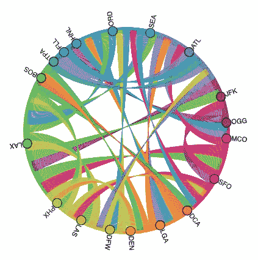

由作者提供的图片

目前谈到数据可视化时，通常会想到一些常见的图表类型——条形图、饼图、直方图等。然而，还有一种非常有趣但很少讨论的图表类型——**和弦图**。那么，什么是和弦图呢？

和弦图表示多个实体（称为节点）之间的流动或连接。使用和弦图，你可以轻松地可视化数据集中各个数据点之间的连接或关系。以航班延误数据集为例，它包含了从一个机场到另一个机场的详细航班信息。如果你想可视化各机场之间的关系，和弦图（见本文开头的图示）是展示这些信息的绝佳方式。

在这篇文章中，我将向你展示如何使用一个名为**HoloViews**的第三方库绘制和弦图。

> 所有图片均由作者提供，除非另有说明。

# 安装 Holoviews

**HoloViews** 是一个开源的 Python 库，旨在使数据分析和可视化变得无缝且简单。HoloViews 依赖于另外两个 Python 库——**pyviz** 和 **bokeh**。因此，安装 HoloViews 的最佳方法是使用以下命令：

```py
conda install -c pyviz holoviews bokeh
```

# 使用航班延误数据集

像往常一样，我最喜欢用来说明概念的数据集是 2015 年的航班延误数据集。你可以从以下网址下载数据集：[`www.kaggle.com/datasets/usdot/flight-delays`](https://www.kaggle.com/datasets/usdot/flight-delays)。

> *许可协议：* [*CC0: 公共领域*](https://creativecommons.org/publicdomain/zero/1.0/)
> 
> 在本文中，所有代码示例将使用 Jupyter Notebook 运行。

首先，使用 Pandas 加载**flights.csv**文件：

```py
import pandas as pd

df = pd.read_csv('flights.csv')
df
```

这是数据框：


对于本文，我们需要两个特定的列：

+   **ORIGIN_AIRPORT**

+   **DESTINATION_AIRPORT**

我们感兴趣的是查看起点和终点机场之间的关系。

# 查找起点和终点机场之间的关系

下一步是找出起点和终点机场的唯一组合。你可以使用`groupby()`函数，然后使用`count()`函数：

```py
df_between_airports = df.groupby(by=["ORIGIN_AIRPORT", "DESTINATION_AIRPORT"]).count()
df_between_airports
```

输出是一个多索引数据框：

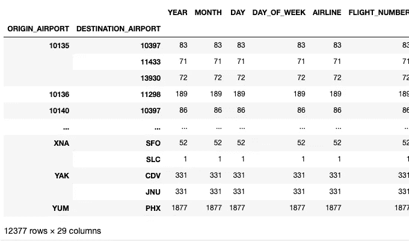

显然，你只需要一个非索引列。因此，让我们提取**YEAR**列并将其重命名为**COUNT**，然后重置索引：

```py
df_between_airports = df_between_airports['YEAR'].rename('COUNT').reset_index() 
df_between_airports
```

现在输出包含从一个机场到另一个机场的航班数量：

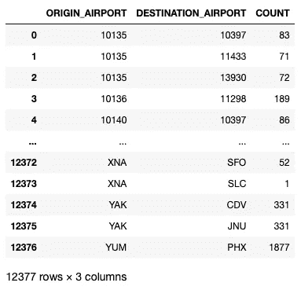

注意到一些机场代码是 5 位数字（例如 10135、10397 等）。这些实际上是 FAA 的机场 ID，用作 IATA 代码（如 XNA、SFO、SLC 等）的替代值。理想情况下，我们应将所有这些 5 位数的机场 ID 替换为实际的 IATA 代码，但为了简化本文，我们将删除它们：

```py
df_between_airports = df_between_airports.query(
    'ORIGIN_AIRPORT.str.len() <= 3 & DESTINATION_AIRPORT.str.len() <= 3')
df_between_airports
```

现在你对我们尝试实现的目标有了更清晰的了解。例如，从 ABE 到 ATL 共有 898 个航班，从 ABE 到 DTW 共有 711 个航班，等等：

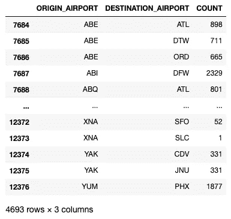

观察到总共有 4693 个组合，生成这么多组合的和弦图会非常混乱。因此，让我们按降序排列它们：

```py
df_between_airports = df_between_airports.sort_values(by="COUNT", 
                                                      ascending=False)
df_between_airports
```

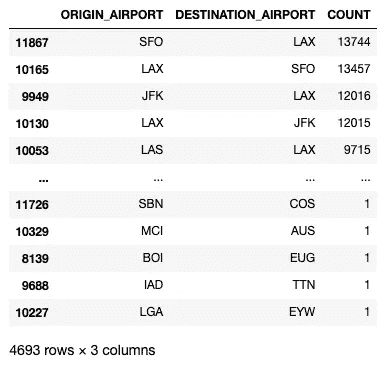

接下来提取前 40 个组合：

```py
top = 40
df_between_airports.head(top)['ORIGIN_AIRPORT'].unique()
```

在前 40 个组合中，共有 18 个起点机场：

```py
array(['SFO', 'LAX', 'JFK', 'LAS', 'LGA', 'ORD', 'OGG', 'HNL', 'ATL',
       'MCO', 'DFW', 'SEA', 'BOS', 'DCA', 'FLL', 'PHX', 'DEN', 'TPA'],
      dtype=object)
```

# 展示和弦图

我们现在准备展示和弦图。首先，导入`holoviews`并指定`bokeh`作为扩展：

```py
import holoviews as hv
hv.extension('bokeh')
```

HoloViews 使用`%%opts`单元魔法来修改单元的执行方式，以显示其输出。你使用`Chord`类来展示和弦图：

```py
%%opts Chord [height=500 width=500 title="Flights between airports" ]
chord = hv.Chord(df_between_airports.head(top))
chord
```

以下输出显示了前 40 个航班组合之间的关系：

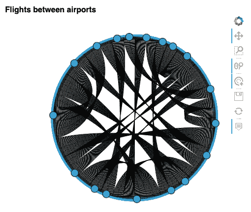

和弦图上的每个圆圈（称为节点）代表一个机场。要查看机场之间的关系，请将鼠标悬停在一个圆圈上：

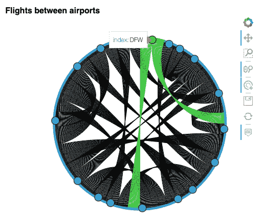

上图显示了从**DFW**（达拉斯/沃思堡国际机场）起飞的航班。显然，无法查看目的地机场。因此，让我们获取起点和终点机场的列表，然后使用它来创建一个`hv.Dataset`对象：

```py
# get the top count of flights between airports
df_between_airports = df_between_airports.head(top)

# find all the unique origin and destination airports
airports = list(set(df_between_airports["ORIGIN_AIRPORT"].unique().tolist() + 
                    df_between_airports["DESTINATION_AIRPORT"].unique().tolist()))

airports_dataset = hv.Dataset(pd.DataFrame(airports, columns=["Airport"]))
```

要显示每个节点的机场名称，请在`%%opts`单元魔法中设置`labels`属性，并将`airports_dataset`变量传递给`Chord`类初始化器：

```py
%%opts Chord [height=500 width=500 title="Flights between airports" labels="Airport"]
chord = hv.Chord((df_between_airports, airports_dataset))
chord
```

> 请注意，`df_between_airports`和`airports_dataset`变量被包装为一个元组。

弦图现在在每个节点上显示了机场代码：

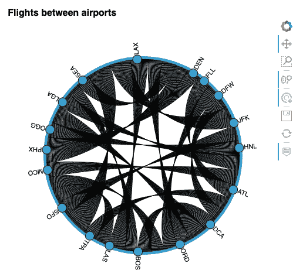

当你现在悬停在 DFW 上时，你可以清楚地看到 DFW 的航班飞往 ORD（奥黑尔国际机场）和 ATL（哈茨菲尔德-杰克逊亚特兰大国际机场）：

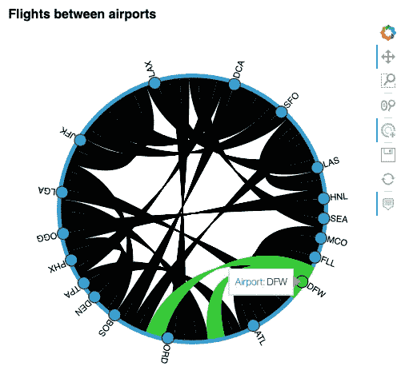

如果你点击**DFW**节点，其余的航班路径将被灰色化：

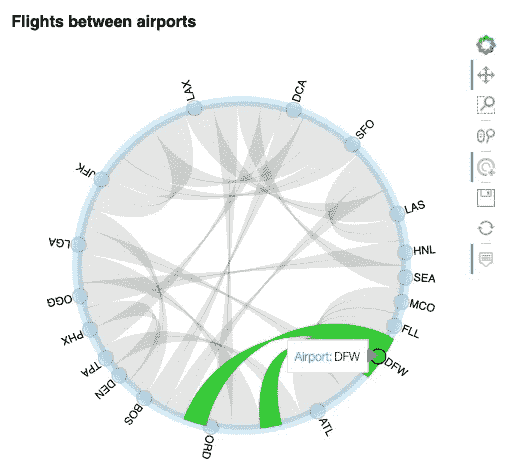

# 为弦图应用颜色

弦图支持 Bokeh 调色板。你可以在 [`docs.bokeh.org/en/latest/docs/reference/palettes.html`](https://docs.bokeh.org/en/latest/docs/reference/palettes.html) 查看调色板颜色列表。

> Bokeh 调色板提供了一系列用于颜色映射的调色板。

这里有两个常用的 Bokeh 调色板：

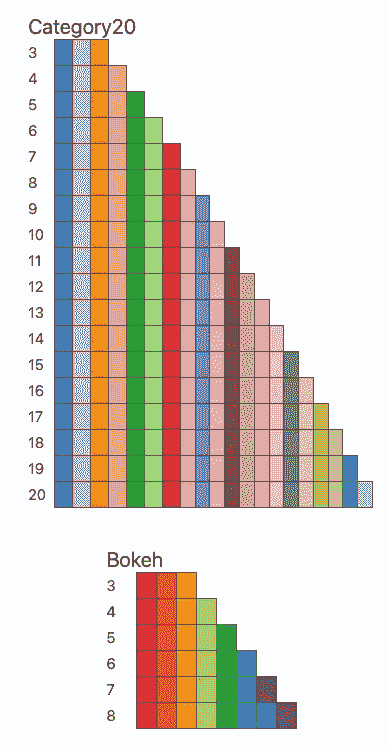

来源: [`docs.bokeh.org/en/latest/docs/reference/palettes.html`](https://docs.bokeh.org/en/latest/docs/reference/palettes.html)

现在让我们通过添加另一个 `%%opts` 单元魔法语句来为弦图应用颜色：

```py
%%opts Chord [height=500 width=500 title="Flights between airports" labels="Airport"]
%%opts Chord (node_color="Airport" node_cmap="Category20" edge_color="ORIGIN_AIRPORT" edge_cmap='Category20')
chord = hv.Chord((df_between_airports, airports_dataset))
chord
```

`node_cmap` 指示应用于节点的调色板，而 `edge_color` 指示应用于弦图边缘的调色板：

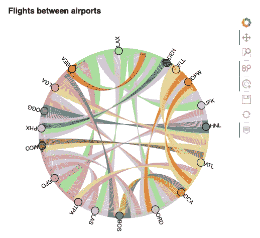

这是另一个应用了不同调色板的示例：

```py
%%opts Chord [height=500 width=500 title="Flights between airports" labels="Airport"]
%%opts Chord (node_color="Airport" node_cmap="Category20" edge_color="ORIGIN_AIRPORT" edge_cmap='Bokeh')
chord = hv.Chord((df_between_airports, airports_dataset))
chord
```

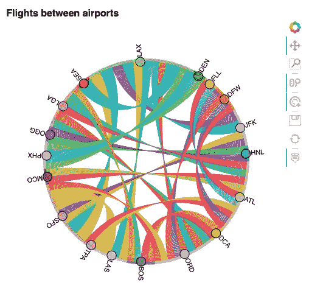

# 确认弦图中的关系

在本文的最终部分，我只想确保弦图显示了正确的信息。选择**JFK**表明航班飞往**LAX**和**SFO**：

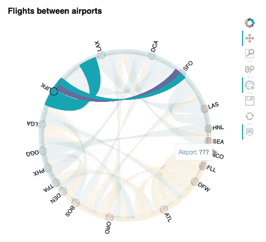

要确认这一点，请使用以下语句：

```py
df_between_airports.query('ORIGIN_AIRPORT == "JFK"')
```

输出确认了弦图中的答案：

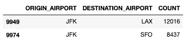

在弦图中选择**ORD**显示航班飞往：

+   **LGA**

+   **LAX**

+   **DFW**

+   **SFO**

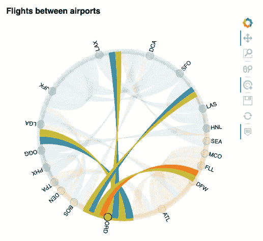

以下语句确认了我们所看到的：

```py
df_between_airports.query('ORIGIN_AIRPORT == "ORD"')
```

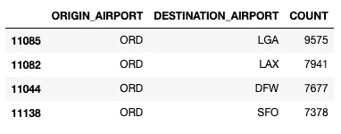

## 如果你喜欢阅读我的文章，并且这些文章对你的职业/学习有帮助，请考虑成为 Medium 会员。会员费用为每月 $5，并且可以无限制地访问 Medium 上的所有文章（包括我的文章）。如果你通过以下链接注册，我将赚取少量佣金（不会增加你的额外费用）。你的支持意味着我将能够花更多时间撰写像这样的文章。

[](https://weimenglee.medium.com/membership?source=post_page-----72fd71b3eef0--------------------------------) [## 通过我的推荐链接加入 Medium - Wei-Meng Lee

### 阅读 Wei-Meng Lee 的每个故事（以及 Medium 上成千上万的其他作者）。你的会员费用直接支持…

weimenglee.medium.com](https://weimenglee.medium.com/membership?source=post_page-----72fd71b3eef0--------------------------------)

# 总结

现在你已经了解了如何使用 HoloViews 创建弦图，你会在什么时候使用它呢？你应该在以下场景中使用弦图：

+   当你想用简单的表示方式展示大数据集之间的相互连接时。

+   当你想要创建视觉上引人注目的、具有美感的表示时。

+   当你需要查找和比较数据组之间的相互关系时。

尽情玩转弦图，并记得告诉我你在实际项目中是如何使用它的！
