# 在 Python 中绘制维恩图

> 原文：[`towardsdatascience.com/plotting-venn-diagrams-in-python-6c55e0d78e57`](https://towardsdatascience.com/plotting-venn-diagrams-in-python-6c55e0d78e57)

## 学习如何使用维恩图展示两个或更多数据集之间的关系

[](https://weimenglee.medium.com/?source=post_page-----6c55e0d78e57--------------------------------)[](https://towardsdatascience.com/?source=post_page-----6c55e0d78e57--------------------------------) [Wei-Meng Lee](https://weimenglee.medium.com/?source=post_page-----6c55e0d78e57--------------------------------)

·发表于 [Towards Data Science](https://towardsdatascience.com/?source=post_page-----6c55e0d78e57--------------------------------) ·阅读时间 8 分钟·2023 年 2 月 24 日

--


图片由 [Dustin Humes](https://unsplash.com/@dustinhumes_photography?utm_source=medium&utm_medium=referral) 提供，[Unsplash](https://unsplash.com/?utm_source=medium&utm_medium=referral)

在数据可视化中，我们生成的大多数图表属于以下一种或多种类型：

+   条形图

+   饼图

+   折线图

+   直方图

+   时间序列

然而，有一种图表不常用，那就是 **维恩图**。**维恩图** 是另一种被低估的可视化形式。它实际上是一种非常有用的可视化形式，可以让你检查两个不同数据集之间的关系。例如，以下维恩图展示了两个生物集的关系——集合 A（左圈；有两条腿的生物）和 B（右圈；会飞的生物）。重叠区域包含那些既有两条腿又能飞的生物：

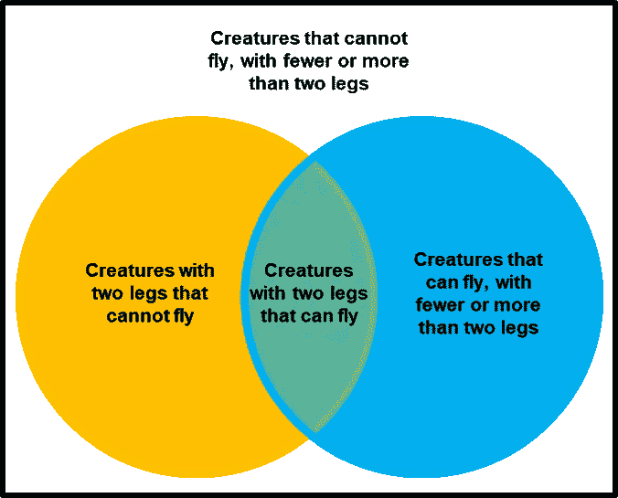

来源: [`en.wikipedia.org/wiki/Venn_diagram#/media/File:Venn_diagram_example.png`](https://en.wikipedia.org/wiki/Venn_diagram#/media/File:Venn_diagram_example.png)

在本文中，我将向你展示如何从样本数据集中绘制一个维恩图。我还会展示如何自定义维恩图以修改其外观和感觉。

所以让我们开始吧！

# **安装 matplotlib-venn 包**

使用 `pip` 命令安装 `matplotlib-venn` 包：

```py
!pip install matplotlib-venn
```

# 数据集

对于数据集，我创建了一个虚构的数据文件，名为 **purchases.csv**，内容如下：

```py
custid,product
1,Mac mini
17,Mac mini
1,Mac Studio
2,MacBook Pro 13
3,Mac Studio
18,Mac mini
2,MacBook Pro 13
5,Mac Studio
7,Mac Studio
6,MacBook Pro 13
4,MacBook Pro 13
8,Mac mini
9,Mac mini
5,Mac mini
6,Mac mini
19,Mac mini
8,Mac Studio
2,Mac mini
2,Mac Studio
20,MacBook Pro 13
```

该文件包含了不同客户通过 `custid` 识别的三款 Mac 产品（Mac mini、Mac Studio 和 MacBook Pro 13）的购买记录。

下一步是将其加载到 Pandas DataFrame 对象中：

```py
import pandas as pd

df = pd.read_csv('purchases.csv')
df
```

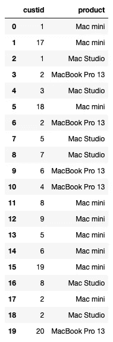

所有图片由作者提供

# 绘制 Venn 图

要绘制一个 2 圆 Venn 图，有几种方法。最简单的方法是向`venn2()`函数（在`matplotlib_venn`包中）提供两个*集合*的值，它会自动为你绘制 Venn 图。

让我们使用这种方法来绘制一个 2 圆 Venn 图，显示购买 Mac mini、Mac Studio 及两者的数量。

首先，我会找到所有购买了 Mac mini 的客户，并提取`custid`作为一个*集合*：

```py
mac_mini = set(df.query('product == "Mac mini"')['custid'])
mac_mini
```

以下`custid`集合是那些购买了 Mac mini 的：

```py
{1, 2, 5, 6, 8, 9, 17, 18, 19}
```

同样，我会提取所有购买了 Mac Studio 的`custid`：

```py
mac_studio = set(df.query('product == "Mac Studio"')['custid'])
mac_studio
```

这些是购买了 Mac Studio 的客户：

```py
{1, 2, 3, 5, 7, 8}
```

现在我们准备绘制 2 圆 Venn 图：

```py
from matplotlib_venn import venn2

venn2([mac_mini, mac_studio],
      ('Mac mini','Mac Studio'))
```

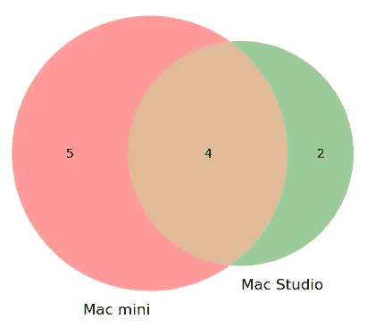

> 注意，你需要提供要显示在 Venn 图上的标签。如果不提供，默认标签是 A 和 B，这可能会有点误导或混淆。

如果你想要一个 3 圆 Venn 图，只需调用`venn3()`函数：

```py
from matplotlib_venn import venn3

macbookpro_13 = set(df.query('product == "MacBook Pro 13"')['custid'])
macbookpro_13 # {2, 4, 6, 20}

venn3([mac_mini, mac_studio, macbookpro_13],
      ('Mac mini','Mac Studio','MacBook Pro 13'))
```

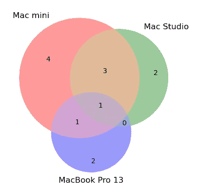

我非常喜欢这种方法，因为我不需要手动计算有多少人只购买了 Mac mini，有多少人购买了 Mac Studio，有多少人购买了 Mac mini 和 Mac Studio 等。

# 备选方法 1

第二种方法是手动传递数值到`venn2()`或`venn3()`函数中。对于`venn2()`函数，格式是：`venn2(subsets = (*Ab*,*aB*,*AB*))`，其中：

+   ***Ab***表示集合 A 中但不在集合 B 中的项目数量

+   ***aB***表示集合 B 中但不在集合 A 中的项目数量

+   **AB**表示同时包含在集合 A 和 B 中的项目数量

让我们使用数据框计算**Ab**、**aB**和**AB**的值。首先，找到购买了 Mac mini 但没有购买 Mac Studio 的人：

```py
# calculate Ab
mac_mini_exclude_mac_studio = mac_mini - mac_studio
display(mac_mini_exclude_mac_studio)
# {6, 9, 17, 18, 19}
```

然后，找到购买了 Mac Studio 但没有购买 Mac mini 的人：

```py
# calculate aB
mac_studio_exclude_mac_mini = mac_studio - mac_mini
display(mac_studio_exclude_mac_mini) 
# {3, 7}
```

最后，找到购买了*Mac mini*和*Mac Studio*的*所有*人：

```py
# calculate AB
mac_mini_and_mac_studio = mac_studio.intersection(mac_mini) 
display(mac_mini_and_mac_studio)
# {1, 2, 5, 8}
```

计算了**Ab**、**aB**和**AB**的值后，你只需计算每个集合中的项目数，并将它们传递给`venn2()`函数：

```py
venn2(subsets = (
        len(mac_mini_exclude_mac_studio),   # Ab
        len(mac_studio_exclude_mac_mini),   # aB
        len(mac_mini_and_mac_studio)        # AB
      ),
      set_labels = ('Mac mini','Mac Studio')
     )
```

不足为奇，结果与我们之前得到的相同：


# 备选方法 2

下一种方法是二进制方法。你可以用**字典**代替传递值作为元组。对于 2 圆 Venn 图，你以以下格式传递二进制值：

+   ***Ab*** — “`10`”

+   ***aB***— “`01`"

+   ***AB***— “`11`”

对于 3 圆 Venn 图，二进制值如下：

+   ***Abc*** — “`100`”

+   ***ABc*** — “`110`”

+   ***ABC*** — “`111`”

+   ***aBC***— “`011`"

+   **abC** — “`001`”

+   ***AbC***— “`101`”

+   ***aBc*** — “`010`”

以下代码片段绘制了你之前绘制的相同 2 圆 Venn 图：

```py
venn2(subsets = {
        '10': len(mac_mini_exclude_mac_studio),  # Ab
        '01': len(mac_studio_exclude_mac_mini),  # aB
        '11': len(mac_mini_and_mac_studio)       # AB
        },
      set_labels = ('Mac mini','Mac Studio'),
     )
```

# 自定义 Venn 图

由于生成的 Venn 图是使用 matplotlib 创建的，因此它可以像使用 matplotlib 创建的任何图表一样自定义。

## 设置透明度

你可以使用 `alpha` 参数设置圆圈的透明度：

```py
v2 = venn2(subsets = {
        '10': len(mac_mini_exclude_mac_studio), 
        '01': len(mac_studio_exclude_mac_mini),
        '11': len(mac_mini_and_mac_studio)
        },
      set_labels = ('Mac mini','Mac Studio'),
      alpha = 0.8,
     )
```

下面是将 `alpha` 参数设置为 0.8 的图表效果。如果你想要更浅的色调，可以将其设置为更低的值，如 0.1 或 0.2：

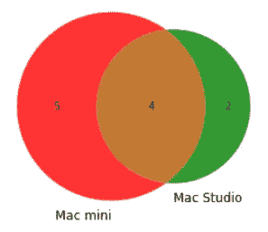

## 设置颜色

你可以使用 `set_colors` 参数指定圆圈的单独颜色：

```py
v2 = venn2(subsets = {
        '10': len(mac_mini_exclude_mac_studio), 
        '01': len(mac_studio_exclude_mac_mini),
        '11': len(mac_mini_and_mac_studio)
        },
      set_labels = ('Mac mini','Mac Studio'),
      alpha = 0.8,
      set_colors=('lightblue', 'yellow')
     )
```

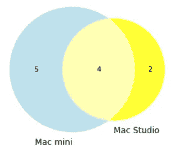

## 设置线条样式

要绘制圆圈的轮廓，使用 `venn2_circles()` 函数（用于 2 圆韦恩图）与 `venn2()` 函数结合使用。以下代码片段展示了如何绘制带有 `--` 虚线和 `5` 线宽的轮廓：

```py
from matplotlib_venn import venn2_circles

c = venn2_circles(subsets = {
        '10': len(mac_mini_exclude_mac_studio), 
        '01': len(mac_studio_exclude_mac_mini),
        '11': len(mac_mini_and_mac_studio)
        },
      linestyle='--',   
      linewidth=5,
     )
```

> 你可以参考 [`matplotlib.org/3.1.0/gallery/lines_bars_and_markers/linestyles.html`](https://matplotlib.org/3.1.0/gallery/lines_bars_and_markers/linestyles.html) 了解支持的线条样式列表。

这是更新后的韦恩图：

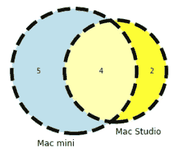

## 设置字体大小

韦恩图上显示有两种类型的标签：

+   **标签** — 圆圈外的文本

+   **子集标签** — 圆圈内的文本

以下代码片段设置了两种类型标签的字体大小：

```py
for text in v2.set_labels:     # the text outside the circle
    text.set_fontsize(20);

for text in v2.subset_labels:  # the text inside the circle
    text.set_fontsize(15)
```

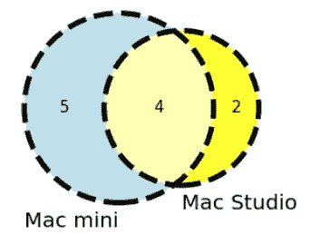

## 自定义线条样式

你还可以在 `venn2_circles()` 函数之外以编程方式设置轮廓的样式和线宽：

```py
c[0].set_lw(3.0) # customize left outline
c[0].set_ls('-.')   

c[1].set_lw(2.0) # customize right circle 
c[1].set_ls('--')
```

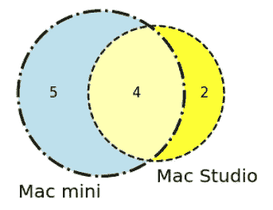

## 设置图表标题

由于这是 matplotlib，你显然可以为图形设置标题：

```py
import matplotlib.pyplot as plt

plt.title('Customers distribution for Mac Mac and Mac Studio')
```

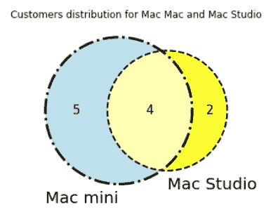

## 设置子集标签

如果你想自定义单独标签的外观，可以使用 `get_label_by_id()` 函数并传入单个圆圈的二进制值来引用标签，并设置它们的显示文本和颜色：

```py
for text in v2.set_labels:     # the text outside the circle
    text.set_fontsize(20);

for text in v2.subset_labels:  # the text inside the circle
    text.set_fontsize(12)

text = 'Mac mini\n'
for i in mac_mini_exclude_mac_studio:
    text += f'{i}\n'
v2.get_label_by_id('10').set_text(text)  # Mac mini

text = 'Mac Studio\n'
for i in mac_studio_exclude_mac_mini:
    text += f'{i}\n'
v2.get_label_by_id('01').set_text(text)  # Mac Studio

text = 'Mac mini &\n Mac Studio\n'
for i in mac_mini_and_mac_studio:        # Mac mini and Mac Studio
    text += f'{i}\n'
v2.get_label_by_id('11').set_text(text)
v2.get_label_by_id('11').set_color('red')
```

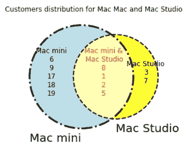

**如果你喜欢阅读我的文章，并且这些文章对你的职业/学习有帮助，请考虑成为 Medium 会员。每月 $5，你可以无限访问 Medium 上的所有文章（包括我的）。如果你使用以下链接注册，我将获得少量佣金（对你没有额外费用）。你的支持意味着我将能花更多时间写这样的文章。**

[](https://weimenglee.medium.com/membership?source=post_page-----6c55e0d78e57--------------------------------) [## 通过我的推荐链接加入 Medium - Wei-Meng Lee

### 阅读 Wei-Meng Lee 的每一个故事（以及 Medium 上成千上万的其他作家）。你的会员费直接支持…

weimenglee.medium.com](https://weimenglee.medium.com/membership?source=post_page-----6c55e0d78e57--------------------------------)

# 总结

就这样完成了！你学会了如何使用示例数据框绘制简单的 2 圈和 3 圈维恩图，并且了解了可以对图形进行的各种自定义。绘制维恩图很简单，更具挑战性的是整理你的数据，以便将其传递给 API 进行绘图。无论如何，希望你玩得开心！
