# POCS 基于的聚类算法解释

> 原文：[`towardsdatascience.com/pocs-based-clustering-algorithm-explained-2f7d25183eff?source=collection_archive---------12-----------------------#2023-03-24`](https://towardsdatascience.com/pocs-based-clustering-algorithm-explained-2f7d25183eff?source=collection_archive---------12-----------------------#2023-03-24)

## 每个数据有不同的重要性

[](https://tranlevision.medium.com/?source=post_page-----2f7d25183eff--------------------------------)[](https://towardsdatascience.com/?source=post_page-----2f7d25183eff--------------------------------) [LA Tran](https://tranlevision.medium.com/?source=post_page-----2f7d25183eff--------------------------------)

·

[关注](https://medium.com/m/signin?actionUrl=https%3A%2F%2Fmedium.com%2F_%2Fsubscribe%2Fuser%2Fe495318bfdd3&operation=register&redirect=https%3A%2F%2Ftowardsdatascience.com%2Fpocs-based-clustering-algorithm-explained-2f7d25183eff&user=LA+Tran&userId=e495318bfdd3&source=post_page-e495318bfdd3----2f7d25183eff---------------------post_header-----------) 发布于 [Towards Data Science](https://towardsdatascience.com/?source=post_page-----2f7d25183eff--------------------------------) ·5 分钟阅读·2023 年 3 月 24 日[](https://medium.com/m/signin?actionUrl=https%3A%2F%2Fmedium.com%2F_%2Fvote%2Ftowards-data-science%2F2f7d25183eff&operation=register&redirect=https%3A%2F%2Ftowardsdatascience.com%2Fpocs-based-clustering-algorithm-explained-2f7d25183eff&user=LA+Tran&userId=e495318bfdd3&source=-----2f7d25183eff---------------------clap_footer-----------)

--

[](https://medium.com/m/signin?actionUrl=https%3A%2F%2Fmedium.com%2F_%2Fbookmark%2Fp%2F2f7d25183eff&operation=register&redirect=https%3A%2F%2Ftowardsdatascience.com%2Fpocs-based-clustering-algorithm-explained-2f7d25183eff&source=-----2f7d25183eff---------------------bookmark_footer-----------)

图片来源于 [Kier in Sight](https://unsplash.com/@kierinsight?utm_source=medium&utm_medium=referral) 在 [Unsplash](https://unsplash.com/?utm_source=medium&utm_medium=referral)

**聚类分析**（或 **聚类**）是一种数据分析技术，它探索并将一组向量（或数据点）分组，使得同一簇中的向量彼此间的相似性大于与其他簇中的向量。聚类算法在数据分析、模式识别和图像处理等众多应用中被广泛使用。

本文回顾了一种基于凸集投影（POCS）方法的新聚类算法，称为 POCS 基础的聚类算法。原始论文在[IWIS2022](https://ieeexplore.ieee.org/document/9920762)中介绍，源代码也已发布在[Github](https://github.com/tranleanh/pocs-based-clustering)上。

# 凸集

凸集定义为一个数据点的集合，其中连接集合中任意两个点 x1 和 x2 的线段完全包含在该集合中。根据这种凸集的定义，空集∅、单集合、线段、超平面和欧几里得球被认为是凸集。数据点也被认为是一个凸集，因为它是一个单集合（一个只有一个元素的集合）。这指向了 POCS 概念可以应用于数据点聚类的新路径。

# 投影到凸集（POCS）

让我简要回顾一下 POCS 的概念（不涉及方程）。POCS 的方法大致可以分为两种形式：*交替* 和 *并行*。

## 交替 POCS

从数据空间中的任意一点开始，将该点交替投影到两个（或更多）相交的凸集上，将会收敛到这些集合交集中的一点。下面显示了一个图形说明。

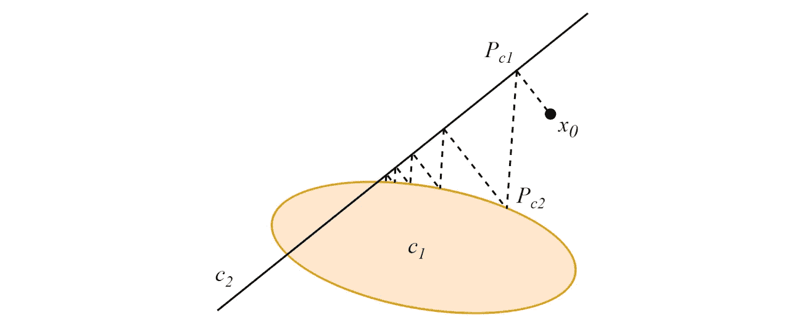

作者提供的图片。

当凸集不相交时，交替投影将收敛到依赖于投影顺序的贪婪极限循环。

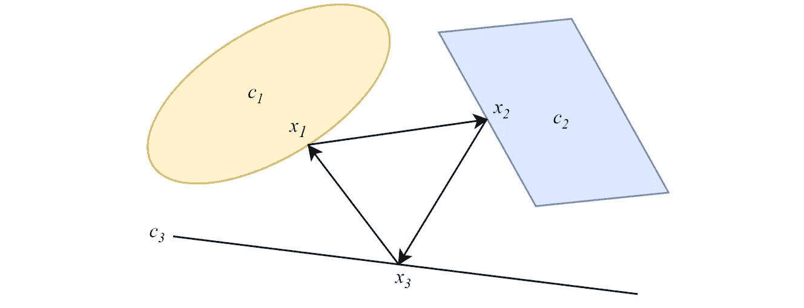

作者提供的图片。

## 并行 POCS

与交替形式不同，POCS 的并行形式同时将数据点投影到所有凸集上，每个投影都有一个重要性权重。对于两个非空交集的凸集，与交替版本类似，并行投影收敛到这些集合的交集中的一点。

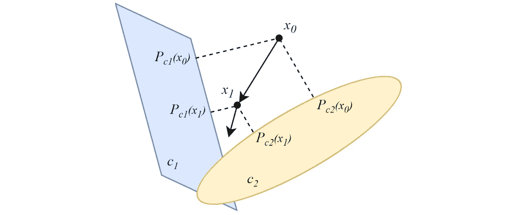

作者提供的图片。

在凸集不相交的情况下，投影将收敛到一个最小化解决方案。POCS 基础的聚类算法的主要思想源于这一特性。

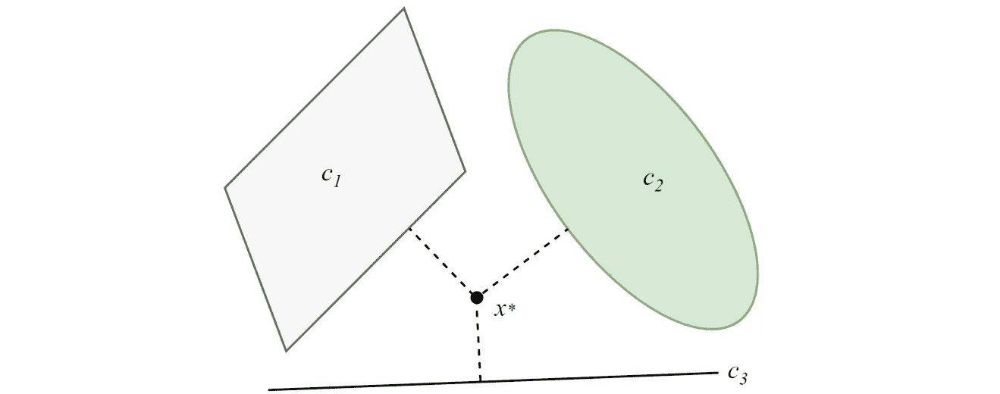

作者提供的图片。

欲了解 POCS 的更多细节，请访问[原始论文](https://arxiv.org/abs/2208.08888)和/或一些其他推荐的论文（可用 pdf 文件）：

+   [交替投影到模糊凸集](https://ieeexplore.ieee.org/document/327499)

+   [膨胀 POCS：最小最大凸优化](https://arxiv.org/abs/2206.04759)

# POCS 基础的聚类算法

利用并行 POCS 方法的收敛性质，作者提出了一种非常简单但有效（在某种程度上）的聚类算法。该算法的操作与经典的 K-Means 算法类似，但处理每个数据点的方式有所不同，即 K-Means 算法对每个数据点赋予相同的权重，而 POCS-based 聚类算法则对每个数据点赋予不同的权重，权重与数据点到簇原型的距离成正比。就这样！

下面显示了算法的伪代码：

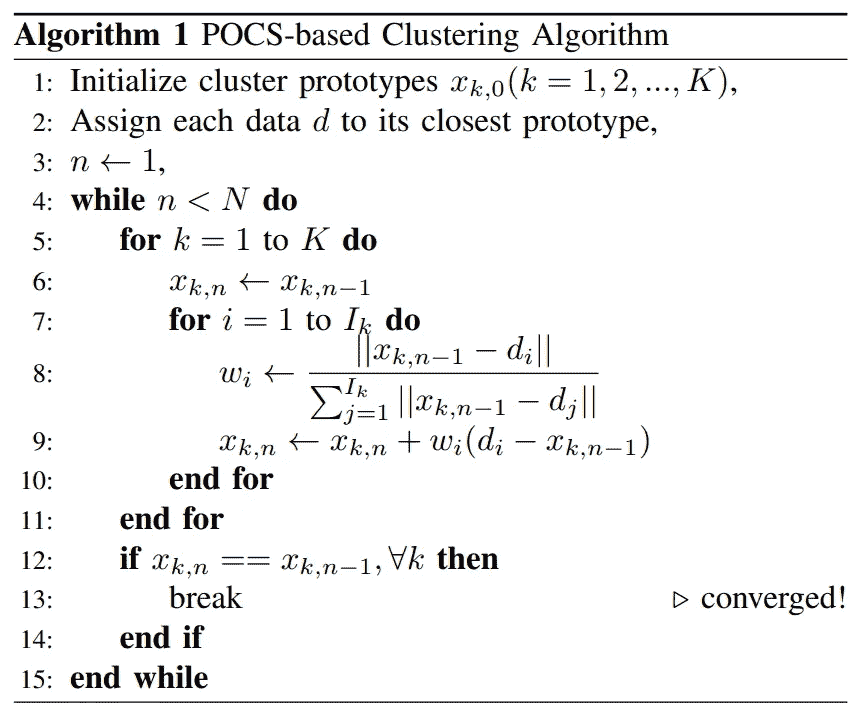

图像来自论文。

# 实验结果

作者检查了 POCS-based 聚类算法在一些公共基准数据集上的性能，这些数据集来自网站[Clustering basic benchmark](https://cs.joensuu.fi/sipu/datasets/)。这些数据集的描述总结在下表中。

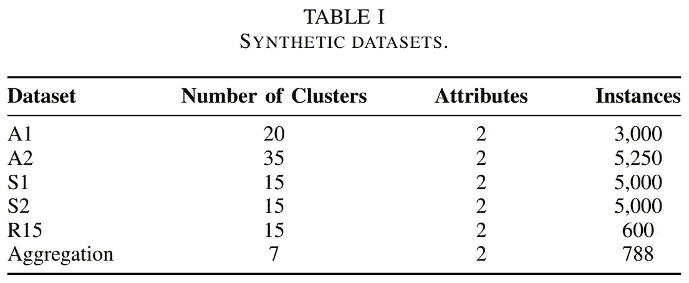

图像来自论文。

在论文中，作者比较了 POCS-based 聚类算法与其他传统聚类方法（包括 K-Means 和 Fuzzy C-Means 算法）的性能。关于执行时间和聚类误差的评估总结在以下表格中。

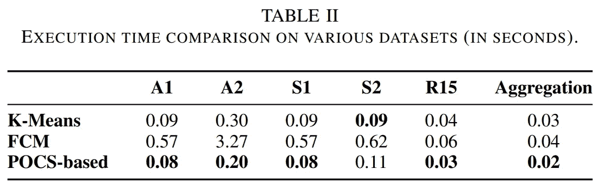

图像来自论文。

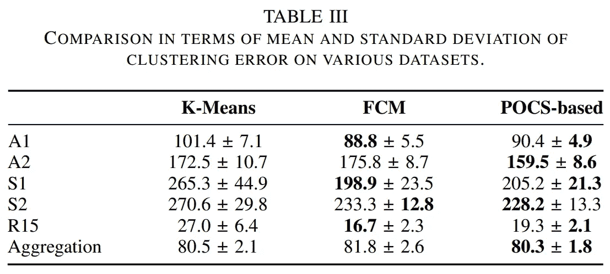

图像来自论文。

可视化的聚类结果也在以下图中展示。

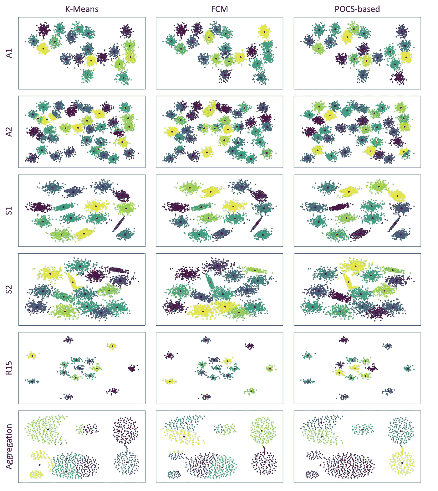

图像来自论文。

欲了解更多细节，可以在原始论文[这里](https://arxiv.org/abs/2208.08888)查看。

# 示例代码

让我们在一个非常简单的数据集上试用这个算法。为了简单起见，可以使用以下命令安装发布的算法包：

```py
pip install pocs-based-clustering
```

首先，我们导入几个必要的包，并创建一个以 10 个簇为中心的 5000 个数据点的简单数据集：

```py
# Import packages
import time
import matplotlib.pyplot as plt

from sklearn.datasets import make_blobs
from pocs_based_clustering.tools import clustering

# Generate a simple dataset
num_clusters = 10
X, y = make_blobs(n_samples=5000, centers=num_clusters, \
                  cluster_std=0.5, random_state=0)

plt.figure(figsize=(8,8))
plt.scatter(X[:, 0], X[:, 1], s=50)
plt.show()
```

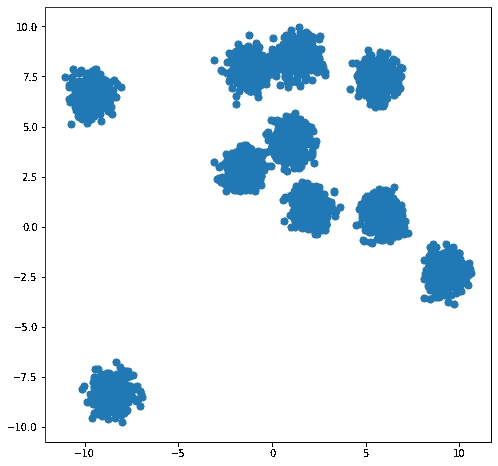

图像由作者提供。

现在，使用内置函数进行聚类并显示结果：

```py
# POSC-based Clustering Algorithm
centroids, labels = clustering(X, num_clusters, 100)

# Display results
plt.figure(figsize=(8,8))
plt.scatter(X[:, 0], X[:, 1], c=labels, s=50, cmap='viridis')
plt.scatter(centroids[:, 0], centroids[:, 1], s=100, c='red')
plt.show()
```

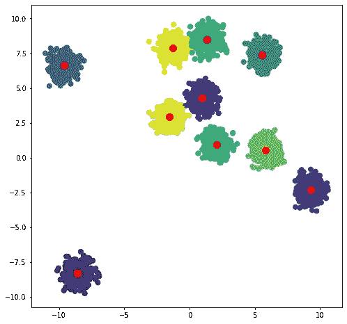

图像由作者提供。

# 结论

在这篇文章中，我简要回顾了一种基于凸集投影方法（POCS）的简单而有效的聚类技术，称为 POCS-based Clustering Algorithm。该算法利用 POCS 的收敛性质应用于聚类任务，并在一定程度上实现了可行的改进。该算法的有效性已在一些基准数据集上得到验证。原始论文可以在[arXiv](https://arxiv.org/abs/2208.08888)（预印本）或[IEEE Xplore](https://ieeexplore.ieee.org/document/9920762)（发表论文）找到。代码也已发布在[Github](https://github.com/tranleanh/pocs-based-clustering)上。

我很高兴欢迎你来到我的 Facebook 页面，分享有关机器学习的内容：[深入机器学习](https://www.facebook.com/diveintomachinelearning)。你还可以在这里找到我发布的其他重要内容：

+   EDN-GTM

+   MetaFormer

+   Darkeras

+   EFPN: 扩展特征金字塔网络

+   数据增强

+   数据蒸馏

+   以及其他内容在[我的页面](https://tranlevision.medium.com/)上。

感谢你的时间！
