# 2022 年 EMNLP 上的诗歌、花卉和龙

> 原文：[`towardsdatascience.com/poems-flowers-and-dragons-at-emnlp-2022-e83dbb0e91db?source=collection_archive---------13-----------------------#2023-01-02`](https://towardsdatascience.com/poems-flowers-and-dragons-at-emnlp-2022-e83dbb0e91db?source=collection_archive---------13-----------------------#2023-01-02)

[](https://medium.com/@phoenixilya?source=post_page-----e83dbb0e91db--------------------------------)[](https://towardsdatascience.com/?source=post_page-----e83dbb0e91db--------------------------------) [Ilya Gusev](https://medium.com/@phoenixilya?source=post_page-----e83dbb0e91db--------------------------------)

·

[关注](https://medium.com/m/signin?actionUrl=https%3A%2F%2Fmedium.com%2F_%2Fsubscribe%2Fuser%2F99b43d56e4b6&operation=register&redirect=https%3A%2F%2Ftowardsdatascience.com%2Fpoems-flowers-and-dragons-at-emnlp-2022-e83dbb0e91db&user=Ilya+Gusev&userId=99b43d56e4b6&source=post_page-99b43d56e4b6----e83dbb0e91db---------------------post_header-----------) 发表在 [Towards Data Science](https://towardsdatascience.com/?source=post_page-----e83dbb0e91db--------------------------------) ·8 min 阅读·2023 年 1 月 2 日 [](https://medium.com/m/signin?actionUrl=https%3A%2F%2Fmedium.com%2F_%2Fvote%2Ftowards-data-science%2Fe83dbb0e91db&operation=register&redirect=https%3A%2F%2Ftowardsdatascience.com%2Fpoems-flowers-and-dragons-at-emnlp-2022-e83dbb0e91db&user=Ilya+Gusev&userId=99b43d56e4b6&source=-----e83dbb0e91db---------------------clap_footer-----------)

--

[](https://medium.com/m/signin?actionUrl=https%3A%2F%2Fmedium.com%2F_%2Fbookmark%2Fp%2Fe83dbb0e91db&operation=register&redirect=https%3A%2F%2Ftowardsdatascience.com%2Fpoems-flowers-and-dragons-at-emnlp-2022-e83dbb0e91db&source=-----e83dbb0e91db---------------------bookmark_footer-----------)

“诗歌、花卉、地牢与龙的结合，数字艺术 — ar 3:2 — v 4”，Midjourney

EMNLP 会议是自然语言处理领域一个备受推崇的活动，研究人员汇聚一堂，分享和讨论该领域的最新发现。今年的会议于 12 月 7 日至 12 月 11 日在阿布扎比举行。在会议上展示的众多论文中，我想特别提到三篇给我留下深刻印象的论文。这些论文可能不是最实用或最知名的，但我认为它们值得一提。两篇论文以海报的形式展示，第三篇是完整的演讲。我最喜欢的三篇论文中的一篇是 PoeLM。

# PoeLM: 一种用于无监督诗歌生成的节奏和韵律可控语言模型

+   **论文**: [Ormazabal et al., 2022](https://arxiv.org/abs/2205.12206)

+   **组织**: 巴斯克大学、Meta AI、哥本哈根大学

+   **代码**: [`github.com/aitorormazabal/poetry_generation`](https://github.com/aitorormazabal/poetry_generation)，不过这里只有数据集创建。

+   **主要思想**: 通过控制代码生成西班牙语和巴斯克语正式诗歌，使用在非诗歌文本上训练的语言模型。

## **动机**

现代语言模型能写诗吗？当然能。你可以快速用[ChatGPT](https://chat.openai.com/chat)测试一下。挑战在于强加特定的约束，比如固定的音节数或特定的韵律或节奏方案。

我们如何强迫语言模型生成正式的诗歌？一种方法是修改解码算法，这在现代语言模型中很复杂，因为它们处理的是子词，既不是词也不是音节。本文描述了另一种方法。要使其有效，你需要一个常规的文本语料库和一个能够分析音节和韵律的系统。

## 训练语言模型

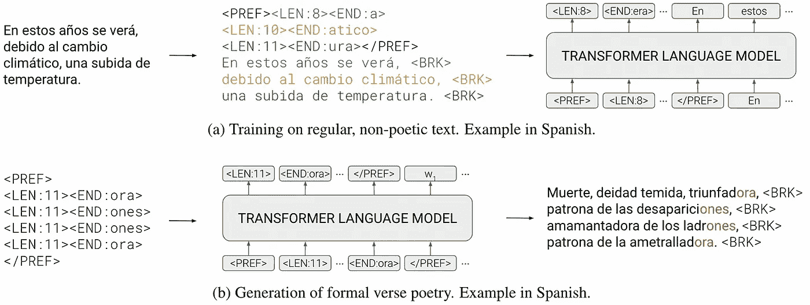

来自论文的图，提出的方法。

你需要做的步骤是：

1.  获取一个常规的非诗歌语料库，并将其拆分成短语。

1.  将文本分成 N 个短语块，其中 N 是随机采样的。

1.  使用结构描述符（=前缀）增强组，以包含每个短语的音节数和韵尾。

1.  用将结构描述符视为普通标记的经典变换器语言模型进行训练。

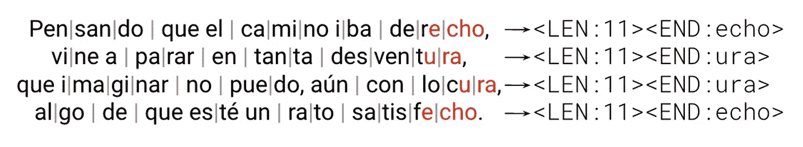

来自论文的图。正式诗歌及其相关的结构描述符。

上图中的结构描述符是

```py
<PREF>
<LEN:11><END:echo>
<LEN:11><END:ura>
<LEN:11><END:ura>
<LEN:11><END:echo>
</PREF>
```

这个描述符意味着四行；每行有 11 个音节；首尾两行以“echo”结尾，第 2 和第 3 行以“ura”结尾。模型将学习如何使用这些代码，因为使用这些提示生成文本比没有提示要容易。

## 生成

1.  选择韵律方案和音节数。

1.  生成一个结构描述符。作者通过从训练语料库中五种最常见的韵律声音中独立采样每种韵律声音来完成这个任务。

1.  提供诗歌的第一行（可选）

1.  使用训练过的语言模型生成大量诗歌候选。

1.  过滤掉所有不符合韵律方案或包含错误音节数的候选。

1.  使用训练过的语言模型（没有结构描述符）按一般流畅度重新排序剩余的候选，并输出得分最高的那个。

## 它的效果如何？

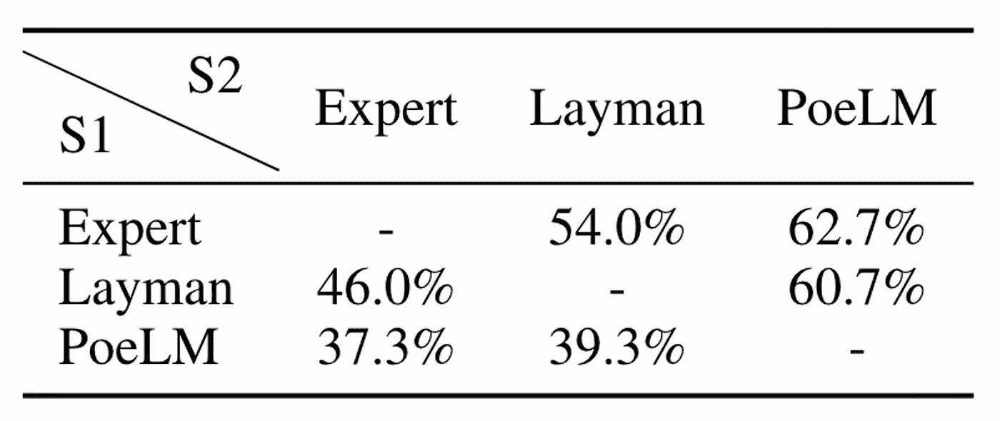

来自论文的表格。系统 S1 在人工评估中排名高于 S2 的次数百分比。

第 5 步的过滤率对于西班牙语诗歌为 30.9%，对于巴斯克语诗歌为 23.4%。37.3%的人更喜欢自动生成的诗歌而非知名诗人的诗歌，比较的是第一行相同的诗歌。

## 你能在你的语言中做到这一点吗？

使用描述的算法需要可靠的音节划分和押韵检测过程。虽然某些语言可能已有这样的程序，但其他语言可能具有更复杂的特征，如节奏，需要考虑。在这些情况下，可以修改结构描述符以包括额外的组件。

## 为什么这对我很重要？

六年前，丹尼尔·阿纳斯捷耶夫和我开发了一个俄罗斯诗歌生成系统，[rupo](https://github.com/IlyaGusev/rupo)。这是一个基于 LSTM 的语言模型，具有一些独特的特征：它从右到左预测文本，分别使用单词的标准形式及其语法特征，并且基于有限状态接受器。自那时以来，自然语言处理技术取得了显著进展，使得今天创建类似系统可能更加容易。

# 画一朵花：自然语言中的处理和基础抽象

+   **论文**: [Lachmy 等人, 2022](https://arxiv.org/abs/2106.14321)

+   **机构**: 巴伊兰大学, AI2

+   **代码**: [`github.com/OnlpLab/Hexagons`](https://github.com/OnlpLab/Hexagons)，但目前还没有基准，只有数据集本身。

+   **主要思想**: 创建一个基于六边形网格的指令式模式绘制的自然语言基础抽象基准。

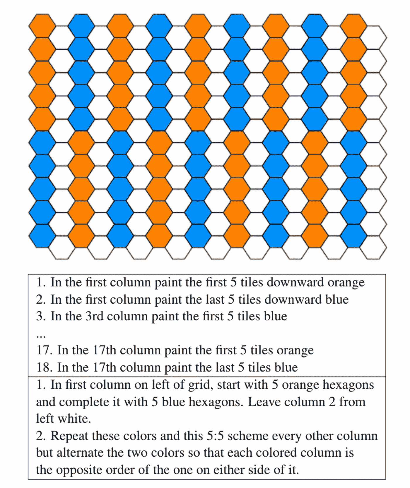

论文中的图，展示自然语言中的抽象层次

## **动机**

我们知道大型语言模型[无法正确计算](https://arxiv.org/pdf/2210.17517.pdf)或执行[简便的估算](https://aclanthology.org/2021.emnlp-main.582.pdf)。即使是[简单的空间推理](https://github.com/google/BIG-bench/tree/main/bigbench/benchmark_tasks/navigate)任务也是个问题（不过[思维链](https://arxiv.org/pdf/2210.09261.pdf)有所帮助）。但是抽象呢？当你命令你假设的 AI 助手，“订三个披萨，一个 BBQ，一个意大利辣香肠，一个玛格丽塔，前两个大，最后一个中，下午 5 点”，它应该能够理解你。这不仅仅涉及省略号，还有条件、迭代、功能分解、递归和其他机制。

为了衡量模型 grasp 抽象概念的程度，我们可以将其 grounding 在[各种](https://en.wikipedia.org/wiki/SHRDLU) [虚拟](https://aclanthology.org/2020.acl-main.232/) [世界](https://arxiv.org/abs/2106.00188)中。在这种情况下，作者使用了一个 10x18 瓷砖和八种颜色的六边形棋盘作为 grounding 抽象的基础。

## **数据集**

本研究的数据集是通过众包方式收集的。虽然作者提供了起始图像，但众包工作者也通过绘制额外的模式进行了贡献。注释过程分为两个阶段：第一阶段，一组注释人员根据图像编写说明；第二阶段，另一组人员根据说明尝试重建图像。任何不一致或分歧都通过人工检查解决。最终数据集包含 175 张独特的图像、620 组说明和 4177 个说明步骤。

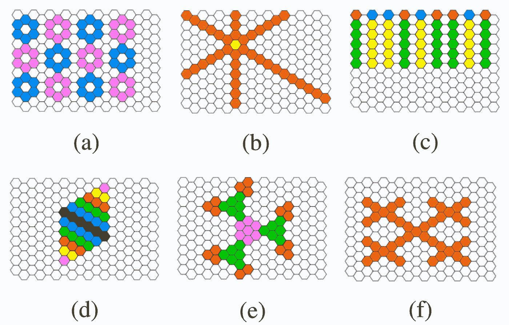

论文中的图，画廊样本。

## **实验**

测试了两种模型：分类模型和生成模型。分类模型使用了 DeBERTa 来预测每个瓦片的状态。生成模型则使用了 T5 来生成一系列动作。模型在各种设置下进行了测试，这些设置在历史记录和当前棋盘信息的量上有所不同：无历史记录、一个前一步、完整历史记录、预测棋盘和神谕棋盘。结果表明，这些模型的表现明显低于人类，甚至在拥有神谕棋盘和完整历史记录的情况下，也只能处理最基本的抽象。

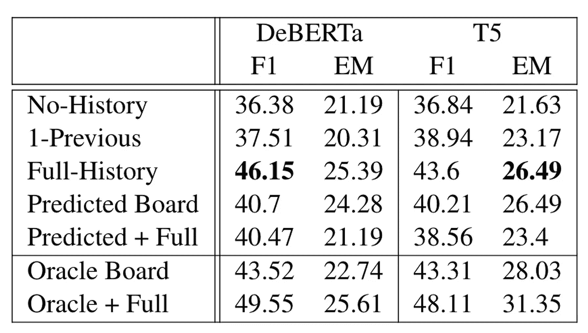

论文中的表格。两种模型在测试集上的结果，基于动作的指标。

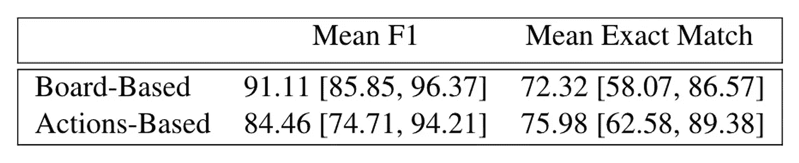

论文中的表格。数据集评估，人类表现。

## **为什么这很重要？**

这是对自然语言模型面临的挑战的一个很好的视觉展示。这个基准使得可以迅速识别这些模型中缺乏哪些抽象机制。我怀疑基于代码的模型[会](https://arxiv.org/pdf/2210.09261.pdf)在这个任务中表现更好，并且我对测试这一假设很感兴趣。

# 龙与地下城作为人工智能对话挑战

+   **论文**：[Callison-Burch et al., 2022](https://arxiv.org/pdf/2210.07109.pdf)

+   **机构**：宾夕法尼亚大学，谷歌研究

+   **代码**：尚未发布，应该在[这里](https://www.cis.upenn.edu/~ccb/dnd-data.html)

+   **主要思想**：基于 D&D 对话创建一个对话系统挑战，任务是在游戏中生成下一个对话回合，并预测游戏的状态，给定对话历史。

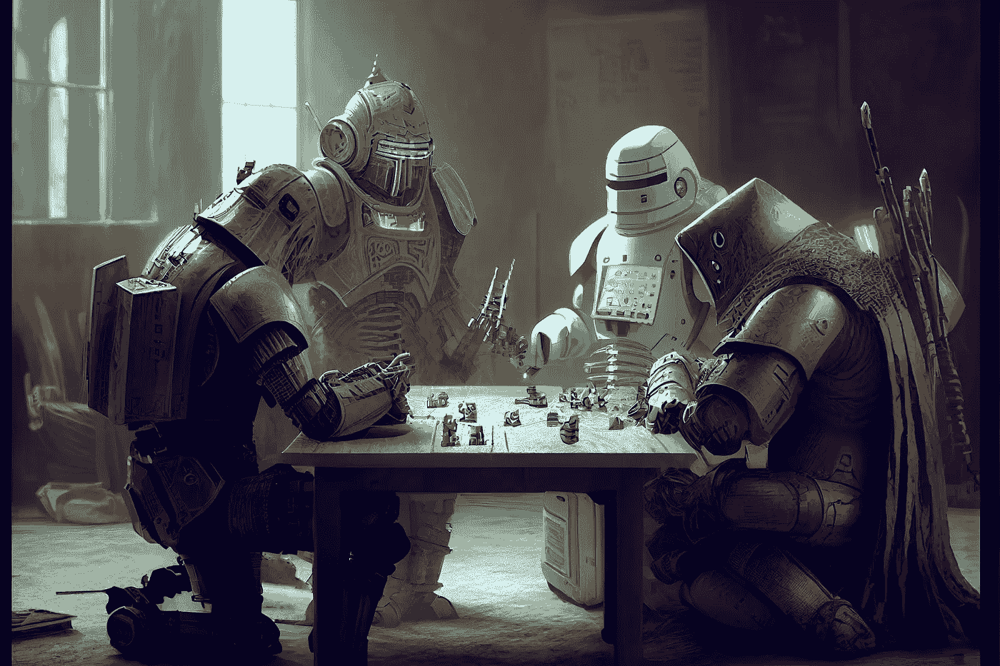

“robots playing D&D, digital art, futuristic — ar 3:2 — v 4”，Midjourney

## **动机**

> *龙与地下城（Dungeons & Dragons）是一款奇幻桌面角色扮演游戏。角色们在奇幻的环境中展开冒险。地下城主作为游戏的裁判和讲述者，同时维护冒险发生的环境，并扮演游戏世界的居民，也称为非玩家角色（NPCs）。角色们组成一个小队，与环境中的居民和彼此互动。他们一起解决难题，参与战斗，探索并收集宝藏和知识。在这个过程中，角色们获得经验值，逐渐升级并变得越来越强大，经过一系列的游戏会话。—* [*维基百科*](https://en.wikipedia.org/wiki/Dungeons_%26_Dragons)

许多自然语言处理数据集都高度专业化，专注于特定任务。龙与地下城（D&D）是一项需要所有参与者高度语言理解的人类活动。它涉及一系列技能，如文本生成、知识库查找、多方对话、目标设定、常识推理、意图检测、状态跟踪和问题回答，使其成为评估 NLP 模型能力的理想测试平台。

AI 在 D&D 中的其他应用包括 [角色照片生成](https://www.reddit.com/r/StableDiffusion/comments/yskhce/my_new_dd_model_trained_for_30000_steps_on_2500/) 和当然还有著名的 [AI Dungeon](https://play.aidungeon.io/main/home)。

## **数据集**

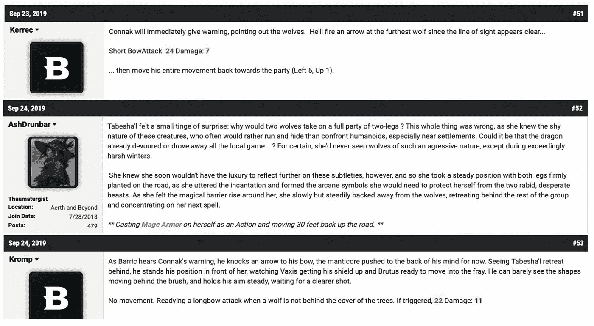

论文中的图示。D&D Beyond 论坛中 3 回合的示例。

作者从 D&D Beyond 论坛上抓取了 Play-By-Post 数据，在这个论坛上，人们通过轮流在论坛上发帖来描述他们的行动。这不是 D&D 会话的唯一可能来源。例如，[CRD3 数据集](https://aclanthology.org/2020.acl-main.459.pdf)使用了 Critical Role 节目的转录稿。

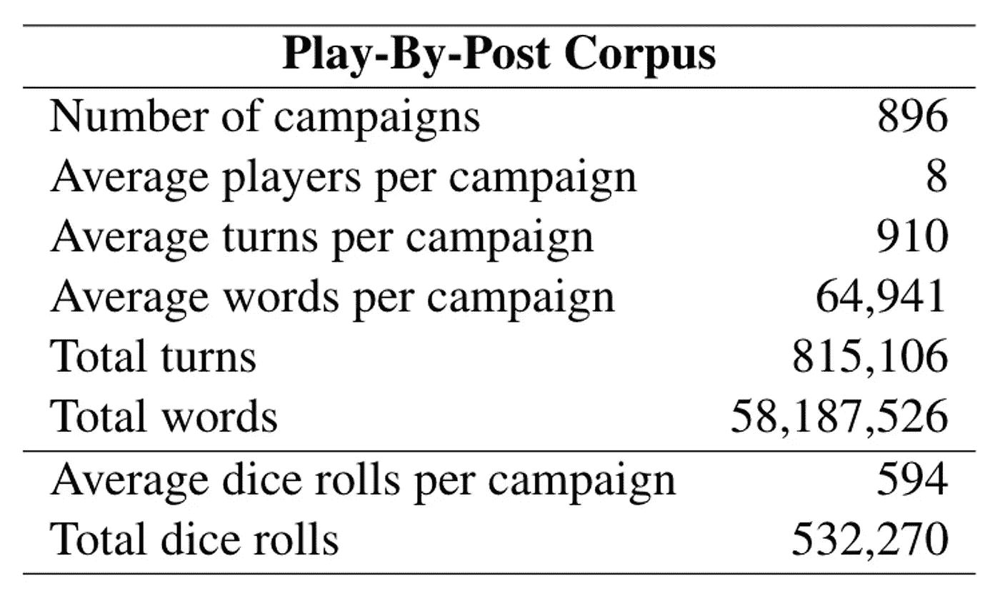

论文中的表格，数据集统计信息。

使用基于规则的启发式方法通过正则表达式和命名实体识别（NER）从文本中提取游戏状态信息。此外，在启发式方法无法提取信息的情况下，还使用了用于文本的 CNN 分类器。数据集不仅包括角色内文本，还包括角色外帖子。

## **实验**

LaMDA，谷歌类似于 GPT-3 的大型语言模型，用于处理两个任务：游戏状态跟踪和回应生成。作者尝试了模型的各种微调变体，包括使用当前或前几个回合的状态作为控制特征。为了评估模型的表现，招募了六名对幻想题材感兴趣并具有 D&D 经验的专业评估员，其中包括三名曾担任地下城主的人员，进行手动评估。

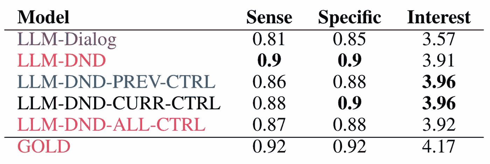

论文中的表格。系统和人工编写的金牌回应的平均人类评估者评分。

评估结果显示领域适应是有益的，但控制特征的影响可能更清晰。然而，这些特征使得模型能够在游戏中担任特定角色，这可能使其成为实际 D&D 游戏中地下城主或玩家的有价值替代品。

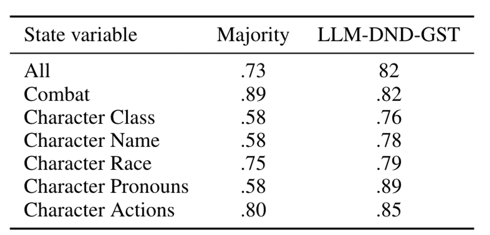

论文中的表格。GST 的平均准确率与多数类基线相比。

游戏状态跟踪任务的结果本可以更好。模型接收了所有以前对话回合及其对应的状态变量，以及当前回合的文本，并期望输出当前回合的正确状态变量。模型的联合准确率为 58%。这些结果表明，仅使用大型语言模型不足以完成此任务，可能需要进一步修改以提高性能。

# 结论

总结上述研究和发现突出了持续存在的挑战和改进领域。必须考虑非主流论文的价值，因为它们可能提供独特的见解和方法，这些可能在急于跟上更广为人知的作品时被忽视。
